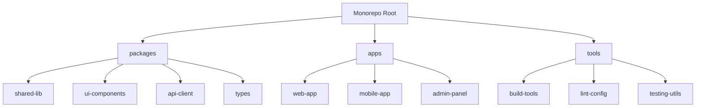

# TypeScript 多项目管理

## 🎯 Monorepo 架构设计

### 📊 项目组织结构



## 🏗️ 项目引用配置

### 🔧 TypeScript Project References

```json
// tsconfig.json (root)
{
  "files": [],
  "references": [
    { "path": "./packages/shared-lib" },
    { "path": "./packages/ui-components" },
    { "path": "./apps/web-app" },
    { "path": "./apps/mobile-app" }
  ],
  "compilerOptions": {
    "composite": true,
    "declaration": true,
    "declarationMap": true
  }
}

// packages/shared-lib/tsconfig.json
{
  "extends": "../../tsconfig.base.json",
  "compilerOptions": {
    "composite": true,
    "outDir": "./dist",
    "rootDir": "./src"
  },
  "include": ["src/**/*"],
  "references": [
    { "path": "../types" }
  ]
}

// apps/web-app/tsconfig.json
{
  "extends": "../../tsconfig.base.json",
  "compilerOptions": {
    "composite": true,
    "outDir": "./dist"
  },
  "include": ["src/**/*"],
  "references": [
    { "path": "../../packages/shared-lib" },
    { "path": "../../packages/ui-components" },
    { "path": "../../packages/types" }
  ]
}
```

### 🎪 Workspace 配置

```json
// package.json (root)
{
  "name": "my-monorepo",
  "private": true,
  "workspaces": [
    "packages/*",
    "apps/*",
    "tools/*"
  ],
  "scripts": {
    "build": "tsc --build",
    "clean": "tsc --build --clean",
    "test": "jest",
    "lint": "eslint .",
    "type-check": "tsc --noEmit"
  }
}
```

## 📦 共享类型库设计

### 💡 基础类型定义

```typescript
// packages/types/src/index.ts
export interface User {
  id: string;
  name: string;
  email: string;
  roles: Role[];
}

export interface Role {
  id: string;
  name: string;
  permissions: Permission[];
}

export interface Permission {
  resource: string;
  actions: string[];
}

// API 响应类型
export interface ApiResponse<T> {
  data: T;
  status: 'success' | 'error';
  message?: string;
}

// 通用组件 Props
export interface BaseComponentProps {
  className?: string;
  children?: React.ReactNode;
}
```

### 🎯 命名空间管理

```typescript
// packages/types/src/components.ts
export namespace ComponentTypes {
  export interface ButtonProps extends BaseComponentProps {
    variant?: 'primary' | 'secondary' | 'danger';
    size?: 'small' | 'medium' | 'large';
    onClick?: () => void;
    disabled?: boolean;
  }
  
  export interface InputProps extends BaseComponentProps {
    type?: 'text' | 'email' | 'password';
    value: string;
    onChange: (value: string) => void;
    placeholder?: string;
  }
}

// packages/types/src/api.ts
export namespace ApiTypes {
  export interface CreateUserRequest {
    name: string;
    email: string;
    password: string;
  }
  
  export interface UpdateUserRequest {
    name?: string;
    email?: string;
  }
}
```

## 🔄 构建工具配置

### ⚡ Turborepo 集成

```json
// turbo.json
{
  "pipeline": {
    "build": {
      "dependsOn": ["^build"],
      "outputs": ["dist/**"]
    },
    "test": {
      "dependsOn": ["build"],
      "outputs": ["coverage/**"]
    },
    "lint": {
      "outputs": []
    },
    "type-check": {
      "outputs": []
    }
  }
}
```

### 🛠️ Webpack 配置

```typescript
// tools/webpack.config.ts
import { Configuration } from 'webpack';
import path from 'path';

export const createBaseConfig = (
  packageName: string,
  isLibrary: boolean = false
): Configuration => ({
  mode: 'production',
  module: {
    rules: [
      {
        test: /\.tsx?$/,
        use: 'ts-loader',
        exclude: /node_modules/,
      },
    ],
  },
  resolve: {
    extensions: ['.tsx', '.ts', '.js'],
    alias: {
      '@shared': path.resolve(__dirname, `../packages/shared-lib/src`),
      '@types': path.resolve(__dirname, `../packages/types/src`),
    },
  },
  ...(isLibrary ? {
    output: {
      library: packageName,
      libraryTarget: 'umd',
      globalObject: 'this',
    },
  } : {}),
});
```

## 📚 最佳实践

### 🎯 依赖管理

```json
// 共享依赖在根 package.json
{
  "devDependencies": {
    "typescript": "^4.9.0",
    "@types/node": "^18.11.0",
    "eslint": "^8.0.0",
    "jest": "^29.0.0"
  },
  "dependencies": {
    "react": "^18.0.0",
    "lodash": "^4.17.0"
  }
}

// 子项目只声明特定依赖
// packages/ui-components/package.json
{
  "name": "@myorg/ui-components",
  "dependencies": {
    "styled-components": "^5.3.0"
  },
  "peerDependencies": {
    "react": "^18.0.0"
  }
}
```

### 🔧 ESLint 配置共享

```typescript
// tools/eslint-config/index.ts
export const config = {
  extends: [
    'eslint:recommended',
    '@typescript-eslint/recommended',
  ],
  parser: '@typescript-eslint/parser',
  rules: {
    '@typescript-eslint/no-unused-vars': 'error',
    '@typescript-eslint/explicit-function-return-type': 'off',
  },
};

// packages/*/package.json
{
  "devDependencies": {
    "@myorg/eslint-config": "../tools/eslint-config"
  }
}
```

这样的多项目管理配置提供了类型安全、构建优化和开发便利性的完美平衡。
