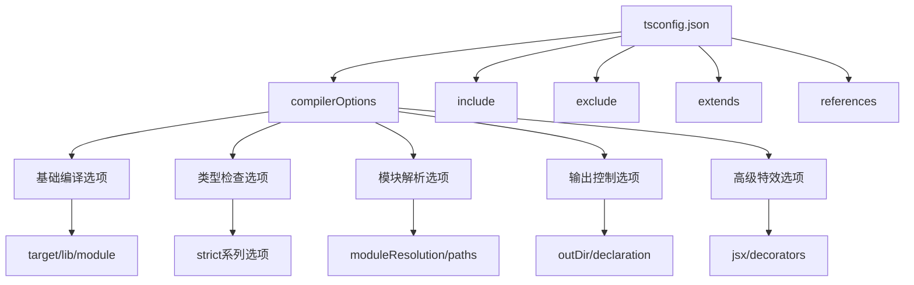

# tsconfig.json 大师级配置

## 🎯 tsconfig.json 核心概念

### 📊 配置文件架构图



## 🏗️ 高级配置策略

### 🎯 基于项目类型的配置模板

#### 📱 前端项目配置

```json
// frontend-base.tsconfig.json
{
    "compilerOptions": {
        // === 基础环境配置 ===
        "target": "ES2022",
        "lib": ["ES2022", "DOM", "DOM.Iterable", "WebWorker"],
        "module": "ESNext",
        "moduleResolution": "bundler",
        
        // === 路径解析配置 ===
        "baseUrl": "./src",
        "paths": {
            "@/*": ["*"],
            "@/components/*": ["components/*"],
            "@/utils/*": ["utils/*"],
            "@/services/*": ["services/*"],
            "@/types/*": ["types/*"],
            "@/assets/*": ["assets/*"],
            "@/styles/*": ["styles/*"]
        },
        
        // === 严格类型检查 ===
        "strict": true,
        "noImplicitAny": true,
        "strictNullChecks": true,
        "strictFunctionTypes": true,
        "strictBindCallApply": true,
        "strictPropertyInitialization": true,
        "noImplicitReturns": true,
        "noFallthroughCasesInSwitch": true,
        "noUncheckedIndexedAccess": true,
        
        // === 输出和质量控制 ===
        "outDir": "./dist",
        "removeComments": true,
        toEmitOnError": true,
        "declaration": false,
        "sourceMap": true,
        
        // === 兼容性设置 ===
        "esModuleInterop": true,
        "allowSyntheticDefaultImports": true,
        "forceConsistentCasingInFileNames": true,
        "resolveJsonModule": true,
        
        // === JSX 支持 ===
        "jsx": "react-jsx",
        "isolatedModules": true,
        
        // === 性能优化 ===
        "skipLibCheck": true,
        "incremental": true,
        "tsBuildInfoFile": "./dist/.tsbuildinfo"
    },
    
    "include": [
        "src/**/*",
        "types/**/*"
    ],
    
    "exclude": [
        "node_modules",
        "dist",
        "coverage",
        "**/*.test.ts",
        "**/*.spec.ts",
        "storybook-static"
    ]
}
```

#### 🚀 Node.js 后端项目配置

```json
// backend-base.tsconfig.json
{
    "compilerOptions": {
        // === 基础环境配置 ===
        "target": "ES2022",
        "lib": ["ES2022"],
        "module": "CommonJS",
        "moduleResolution": "node",
        
        // === 路径解析配置 ===
        "baseUrl": "./",
        "paths": {
            "@/*": ["src/*"],
            "@/controllers/*": ["src/controllers/*"],
            "@/services/*": ["src/services/*"],
            "@/models/*": ["src/models/*"],
            "@/middleware/*": ["src/middleware/*"],
            "@/routes/*": ["src/routes/*"],
            "@/utils/*": ["src/utils/*"],
            "@/types/*": ["src/types/*"],
            "@/config/*": ["src/config/*"]
        },
        
        // === 严格类型检查 ===
        "strict": true,
        "noImplicitAny": true,
        "strictNullChecks": true,
        "exactOptionalPropertyTypes": true,
        "noImplicitReturns": true,
        "noUncheckedIndexedAccess": true,
        
        // === 输出配置 ===
        "outDir": "./dist",
        "rootDir": "./src",
        "removeComments": true,
        "noEmitOnError": true,
        "declaration": true,
        "declarationMap": true,
        "sourceMap": true,
        
        // === Node.js 特定设置 ===
        "esModuleInterop": true,
        "allowSyntheticDefaultImports": true,
        "forceConsistentCasingInFileNames": true,
        "resolveJsonModule": true,
        
        // === 装饰器和元数据 ===
        "experimentalDecorators": true,
        "emitDecoratorMetadata": true,
        "reflectMetadata": true,
        
        // === 性能优化 ===
        "skipLibCheck": true,
        "incremental": true,
        "tsBuildInfoFile": "./dist/.tsbuildinfo"
    },
    
    "include": [
        "src/**/*"
    ],
    
    "exclude": [
        "node_modules",
        "dist",
        "tests",
        "**/*.test.ts",
        "**/*.spec.ts",
        "docs"
    ]
}
```

#### 🏢 企业级库项目配置

```json
// enterprise-library.tsconfig.json
{
    "compilerOptions": {
        // === 基础配置 ===
        "target": "ES2020",
        "lib": ["ES2020"],
        "module": "CommonJS",
        "moduleResolution": "node",
        
        // === 严格性最高级别 ===
        "strict": true,
        "noImplicitAny": true,
        "strictNullChecks": true,
        "strictFunctionTypes": true,
        "strictBindCallApply": true,
        "strictPropertyInitialization": true,
        "noImplicitReturns": true,
        "noFallthroughCasesInSwitch": true,
        "noUncheckedIndexedAccess": true,
        "exactOptionalPropertyTypes": true,
        "noImplicitOverride": true,
        
        // === 声明文件生成 ===
        "declaration": true,
        "declarationMap": true,
        "emitDeclarationOnly": false,
        
        // === 输出控制 ===
        "outDir": "./lib",
        "rootDir": "./src",
        "removeComments": true,
        "preserveConstEnums": false,
        
        // === 兼容性 ===
        "esModuleInterop": true,
        "allowSyntheticDefaultImports": true,
        "forceConsistentCasingInFileNames": true,
        
        // === 工具支持 ===
        "skipLibCheck": true,
        "incremental": true,
        "tsBuildInfoFile": "./lib/.tsbuildinfo"
    },
    
    "include": [
        "src/**/*"
    ],
    
    "exclude": [
        "node_modules",
        "lib",
        "tests",
        "**/*.test.ts",
        "examples",
        "docs"
    ]
}
```

## 🔧 高级配置选项详解

### 🎪 Compiler Options 深度解析

#### 📊 类型检查层级

```typescript
// typesafety-levels.tsconfig.json
{
    "compilerOptions": {
        // Level 1: 基础安全
        "noImplicitAny": true,
        
        // Level 2: 严格空值检查
        "strictNullChecks": true,
        
        // Level 3: 严格函数类型
        "strictFunctionTypes": true,
        "strictBindCallApply": true,
        
        // Level 4: 严格属性初始化
        "strictPropertyInitialization": true,
        
        // Level 5: 无隐式返回
        "noImplicitReturns": true,
        
        // Level 6: Switch 严格检查
        "noFallthroughCasesInSwitch": true,
        
        // Level 7: 索引访问安全
        "noUncheckedIndexedAccess": true,
        
        // Level 8: 精确可选属性
        "exactOptionalPropertyTypes": true,
        
        // Level 9: 无隐式覆写
        "noImplicitOverride": true
    }
}
```

#### 🔍 模块解析深度配置

```typescript
// advanced-module-resolution.tsconfig.json
{
    "compilerOptions": {
        "module": "ESNext",
        "moduleResolution": "bundler",          // Node | Classic | Bundler
        
        // 基础路径配置
        "baseUrl": "./",
        "rootDirs": ["./src", "./shared"],
        
        // 复杂的路径映射
        "paths": {
            // 基础别名
            "@/*": ["src/*"],
            
            // 深度路径映射
            "@/components/base/*": ["src/components/base/*"],
            "@/components/ui/*": ["src/components/ui/*"],
            "@/components/business/*": ["src/components/business/*"],
            
            // 业务模块映射
            "@/user/*": ["src/modules/user/*"],
            "@/order/*": ["src/modules/order/*"],
            "@/product/*": ["src/modules/product/*"],
            
            // 共享资源映射
            "@/shared/utils/*": ["shared/utils/*"],
            "@/shared/types/*": ["shared/types/*"],
            "@/shared/constants/*": ["shared/constants/*"],
            
            // 第三方库替换
            "lodash": ["src/utils/lodash"],
            "axios": ["axios-custom"]
        },
        
        // 类型声明文件位置
        "typeRoots": [
            "./node_modules/@types",
            "./types",
            "./src/@types"
        ],
        
        "types": ["node", "jest"],
        
        // 扩展解析
        "resolveJsonModule": true,
        "allowImportingTsExtensions": true
    }
}
```

## 🏗️ 多项目配置管理

### 🔗 项目引用 (Project References)

#### 📁 多包 Monorepo 架构

```json
// root/tsconfig.json - 根配置文件
{
    "files": [],
    "references": [
        { "path": "./packages/core" },
        { "path": "./packages/utils" },
        { "path": "./packages/ui" },
        { "path": "./packages/forms" },
        { "path": "./apps/web" },
        { "path": "./apps/admin" },
        { "path": "./apps/api" }
    ],
    "compilerOptions": {
        "composite": true,
        "declaration": true,
        "declarationMap": true
    }
}

// packages/core/tsconfig.json
{
    "extends": "../base/tsconfig.base.json",
    "compilerOptions": {
        "outDir": "./dist",
        "rootDir": "./src",
        "declaration": true,
        "declarationMap": true,
        "composite": true
    },
    "include": ["src/**/*"],
    "references": [
        { "path": "../utils" }
    ]
}

// packages/ui/tsconfig.json  
{
    "extends": "../base/tsconfig.base.json", 
    "compilerOptions": {
        "outDir": "./dist",
        "rootDir": "./src",
        "declaration": true,
        "declarationMap": true,
        "composite": true,
        "jsx": "react-jsx"
    },
    "include": ["src/**/*"],
    "references": [
        { "path": "../utils" },
        { "path": "../core" }
    ]
}
```

#### ⚡ 增量编译优化

```json
// incremental-build.tsconfig.json
{
    "compilerOptions": {
        // === 增量编译配置 ===
        "incremental": true,
        "tsBuildInfoFile": "./dist/.tsbuildinfo",
        
        // === 项目引用配置 ===
        "composite": true,
        "declaration": true,
        "declarationMap": true,
        
        // === 性能优化 ===
        "skipLibCheck": true,
        "preserveWatchOutput": true,
        
        // === 并行编译 ===
        "assumeChangesOnlyAffectDirectDependencies": true
    }
}
```

## 🎯 环境特定配置

### 🌍 多环境配置策略

#### 🔧 环境特定配置分离

```typescript
// config/development.tsconfig.json
{
    "extends": "./base.json",
    "compilerOptions": {
        "sourceMap": true,
        "removeComments": false,
        "noEmitOnError": false,
        "skipLibCheck": true
    },
    "include": [
        "src/**/*",
        "tests/**/*",
        "**/*.test.ts"
    ]
}

// config/production.tsconfig.json
{
    "extends": "./base.json",
    "compilerOptions": {
        "removeComments": true,
        "noEmitOnError": true,
        "skipLibCheck": true,
        "sourceMap": false
    },
    "include": ["src/**/*"],
    "exclude": [
        "tests/**/*",
        "**/*.test.ts",
        "**/*.spec.ts"
    ]
}

// config/test.tsconfig.json
{
    "extends": "./base.json",
    "compilerOptions": {
        "module": "CommonJS",
        "jsx": "react",
        "sourceMap": true
    },
    "include": [
        "src/**/*",
        "tests/**/*",
        "**/*.test.ts",
        "**/*.spec.ts"
    ]
}
```

## 🛠️ 高级构建优化

### ⚡ 性能优化配置

#### 🚀 Webpack 集成优化

```json
// webpack-optimized.tsconfig.json
{
    "compilerOptions": {
        "target": "ES2020",
        "module": "ESNext",
        "lib": ["ES2020", "DOM"],
        "moduleResolution": "bundler",
        
        // === 输出优化 ===
        "declaration": false,
        "declarationMap": false,
        "sourceMap": true,
        "inlineSourceMap": false,
        
        // === 模块优化 ===
        "preserveConstEnums": true,
        "importHelpers": true,
        
        // === 兼容性优化 ===
        "allowImportingTsExtensions": false,
        "noEmit": true,                    // Webpack 负责 emit
        
        // === 性能优化 ===
        "skipLibCheck": true,
        "skipDefaultLibCheck": true
    }
}
```

### 🔧 框架特定优化

#### ⚛️ React 项目优化

```json
// react-optimized.tsconfig.json
{
    "compilerOptions": {
        "jsx": "react-jsx",
        "jsxImportSource": "react",
        "allowUnusedLabels": false,
        "allowUnreachableCode": false,
        
        // === React 严格模式 ===
        "strict": true,
        "noImplicitAny": true,
        "strictNullChecks": true,
        
        // === React 特定类型 ===
        "lib": ["ES2022", "DOM", "DOM.Iterable", "ES6"],
        
        // === 性能配置 ===
        "skipLibCheck": true,
        "isolatedModules": true
    }
}
```

#### ⚡ Next.js 项目优化

```json
// nextjs-optimized.tsconfig.json
{
    "extends": "../base.json",
    "compilerOptions": {
        "target": "ES5",
        "lib": ["dom", "dom.iterable", "ES6"],
        "allowJs": true,
        "skipLibCheck": true,
        "strict": true,
        "forceConsistentCasingInFileNames": true,
        "noEmit": true,
        "esModuleInterop": true,
        "module": "esnext",
        "moduleResolution": "node",
        "resolveJsonModule": true,
        "isolatedModules": true,
        "jsx": "preserve",
        "incremental": true,
        "plugins": [
            {
                "name": "next"
            }
        ],
        "paths": {
            "@/*": ["./src/*"],
            "@/components/*": ["./src/components/*"],
            "@/pages/*": ["./src/pages/*"],
            "@/styles/*": ["./src/styles/*"],
            "@/utils/*": ["./src/utils/*"],
            "@/hooks/*": ["./src/hooks/*"],
            "@/types/*": ["./src/types/*"]
        }
    },
    "include": [
        "next-env.d.ts",
        "**/*.ts",
        "**/*.tsx",
        ".next/types/**/*.ts"
    ],
    "exclude": ["node_modules"]
}
```

## 🎪 配置验证和调试

### 🔍 配置诊断工具

#### 📊 配置验证命令

```bash
# 验证配置文件
tsc --showConfig                # 显示最终配置
tsc --listFiles                 # 列出要编译的文件
tsc --diagnostics               # 诊断信息
tsc --extendedDiagnostics       # 详细信息

# 性能分析
tsc --watch --verbose          # 监听模式详细输出
tsc --build --verbose          # 构建模式详细输出

# 配置分析
tsc --help                     # 查看所有选项
tsc --version                  # 查看 TypeScript 版本
```

#### 🛠️ 配置调试技巧

```javascript
// custom-config-loader.js
const ts = require('typescript');
const fs = require('fs');

function analyzeTsConfig(configPath) {
    try {
        // 读取配置文件
        const configFileText = fs.readFileSync(configPath, 'utf8');
        
        // 解析配置
        const configResult = ts.parseConfigFileTextToJson(configPath, configFileText);
        
        if (configResult.error) {
            console.error('配置解析错误:', configResult.error);
            return;
        }
        
        console.log('配置内容:', JSON.stringify(configResult.config, null, 2));
        
        // 解析编译器选项
        const options = ts.convertCompilerOptionsFromJson(
            configResult.config.compilerOptions,
            './'
        );
        
        if (options.errors.length > 0) {
            console.error('编译器选项错误:', options.errors);
            return;
        }
        
        console.log('编译器选项:', JSON.stringify(options.options, null, 2));
        
    } catch (error) {
        console.error('配置文件分析失败:', error.message);
    }
}

analyzeTsConfig('./tsconfig.json');
```

## 📚 最佳实践总结

### 🎯 配置文件最佳实践

| 实践原则 | 具体实施 | 预期效果 |
|----------|----------|----------|
| **分层配置** | base.json + env-specific | 避免重复配置 |
| **增量编译** | projectReferences + composite | 提升大型项目编译速度 |
| **路径映射** | 清晰的路径别名 | 提高代码可读性 |
| **严格检查** | 渐进式严格模式 | 提高代码质量 |
| **性能优化** | skipLibCheck + incremental | 减少编译时间 |

### 🔗 相关深入学习

- [[02-Production优化策略]] - 生产环境优化技巧
- [[03-Multi-project多项目管理]] - 大型项目管理策略
- [[04-Build-Toolchain构建工具链]] - 构建工具集成

---
*💡 掌握 tsconfig.json 的高级配置是 TypeScript 大型项目成功的关键，合理的配置能显著提升开发效率和代码质量*
