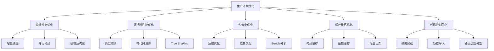

# TypeScript Production 优化策略

## 🎯 生产环境优化总览

### 📊 优化维度分析



## 🚀 编译性能优化

### ⚡ TypeScript 编译器性能优化

#### 🔥 增量编译配置

```json
// production-optimized.tsconfig.json
{
    "compilerOptions": {
        // === 增量编译优化 ===
        "incremental": true,
        "tsBuildInfoFile": "./dist/.tsbuildinfo",
        "composite": true,
        "assumeChangesOnlyAffectDirectDependencies": true,
        
        // === 跳过检查以提升速度 ===
        "skipLibCheck": true,
        "skipDefaultLibCheck": true,
        "skipDeclarationFiles": true,
        
        // === 编译目标优化 ===
        "target": "ES2020",                   // 避免过度兼容
        "module": "ESNext",                   // 现代模块系统
        "moduleResolution": "bundler",         // 更快的解析
        
        // === 输出优化 ===
        "removeComments": true,               // 生产环境移除注释
        "preserveConstEnums": false,          // 内联枚举以减少大小
        "importHelpers": true,                // 使用辅助函数库
        
        // === 声明文件优化 ===
        "declaration": false,                 // 不需要声明文件
        "declarationMap": false,              // 不需要声明映射
        "sourceMap": false,                   // 生产环境不需要源码映射
    }
}
```

#### 🏭 并行构建配置

```typescript
// build-system/parallel-builder.ts
import { exec } from 'child_process';
import { promisify } from 'util';
import * as fs from 'fs';
import * as path from 'path';

const execAsync = promisify(exec);

interface BuildTask {
    name: string;
    path: string;
    config: string;
    priority: number;
}

class ParallelBuilder {
    private tasks: BuildTask[] = [];
    private maxConcurrent = require('os').cpus().length;
    
    constructor() {
        this.loadBuildTasks();
    }
    
    private loadBuildTasks(): void {
        // 自动发现子项目
        const packagesDir = path.join(__dirname, '../packages');
        const appsDir = path.join(__dirname, '../apps');
        
        this.scanDirectory(packagesDir, 'library', 1);
        this.scanDirectory(appsDir, 'application', 2);
    }
    
    private scanDirectory(dir: string, type: string, priority: number): void {
        if (!fs.existsSync(dir)) return;
        
        const items = fs.readdirSync(dir);
        items.forEach(item => {
            const itemPath = path.join(dir, item);
            const projectPath = path.join(itemPath, 'package.json');
            
            if (fs.existsSync(projectPath)) {
                this.tasks.push({
                    name: item,
                    path: itemPath,
                    config: type,
                    priority
                });
            }
        });
    }
    
    async buildAll(): Promise<void> {
        console.log(`🚀 开始并行构建 ${this.tasks.length} 个项目...`);
        
        // 按优先级排序
        this.tasks.sort((a, b) => a.priority - b.priority);
        
        const batches = this.createBatches();
        
        for (const batch of batches) {
            const tasks = batch.map(task => this.buildTask(task));
            await Promise.all(tasks);
        }
        
        console.log('✅ 所有项目构建完成!');
    }
    
    private createBatches(): BuildTask[][] {
        const batches: BuildTask[][] = [];
        
        for (let i = 0; i < this tasks.length; i += this.maxConcurrent) {
            batches.push(this.tasks.slice(i, i + this.maxConcurrent));
        }
        
        return batches;
    }
    
    private async buildTask(task: BuildTask): Promise<void> {
        const startTime = Date.now();
        
        try {
            console.log(`🔨 开始构建: ${task.name}`);
            
            await execAsync('tsc --build', {
                cwd: task.path,
                stdio: 'inherit'
            });
            
            const duration = Date.now() - startTime;
            console.log(`✅ ${task.name} 构建完成 (${duration}ms)`);
        } catch (error) {
            console.error(`❌ ${task.name} 构建失败:`, error);
            throw error;
        }
    }
}

// 启动并行构建
if (require.main === module) {
    new ParallelBuilder().buildAll().catch(console.error);
}
```

## 📦 包大小优化

### 🎯 Bundle 尺寸优化策略

#### 📊 Bundle 分析工具

```typescript
// build-system/bundle-analyzer.ts
import * as fs from 'fs';
import * as path from 'path';

interface BundleInfo {
    size: number;
    gzippedSize?: number;
    modules: ModuleInfo[];
}

interface ModuleInfo {
    name: string;
    size: number;
    percentage: number;
}

class BundleAnalyzer {
    analyzeBundle(bundlePath: string): BundleInfo {
        const stats = JSON.parse(fs.readFileSync(bundlePath, 'utf-8'));
        
        const modules = this.extractModuleInfo(stats);
        const sortedModules = modules.sort((a, b) => b.size - a.size);
        
        return {
            size: stats.assets[0]?.size || 0,
            gzippedSize: this.calculateGzippedSize(stats.assets[0]?.size || 0),
            modules: sortedModules
        };
    }
    
    private extractModuleInfo(stats: any): ModuleInfo[] {
        const modules: ModuleInfo[] = [];
        const totalSize = Object.values(stats.modules).reduce((sum: number, mod: any) => sum + (mod.size || 0), 0);
        
        for (const [name, module] of Object.entries(stats.modules) as any) {
            modules.push({
                name: this.simplifyModuleName(name),
                size: module.size || 0,
                percentage: ((module.size || 0) / totalSize) * 100
            });
        }
        
        return modules.filter(m => m.size > 1000); // 只显示大于1KB的模块
    }
    
    private simplifyModuleName(name: string): string {
        // 简化模块名称以便阅读
        return name
            .replace(/node_modules\//g, '')
            .replace(/\.\/src\//g, 'src/')
            .replace(/\?.*$/, '');
    }
    
    private calculateGzippedSize(size: number): number {
        // 估算 gzip 压缩后的大小 (通常为原大小的 30% 左右)
        return Math.round(size * 0.3);
    }
    
    generateReport(bundlePath: string, outputPath: string): void {
        const analysis = this.analyzeBundle(bundlePath);
        
        const report = this.createHtmlReport(analysis);
        fs.writeFileSync(outputPath, report);
        
        console.log(`📊 Bundle 分析报告已生成: ${outputPath}`);
        console.log(`📦 原始大小: ${this.formatSize(analysis.size)}`);
        console.log(`🗜️  压缩后: ${this.formatSize(analysis.gzippedSize || 0)}`);
        console.log(`📈 Top 10 模块:`, analysis.modules.slice(0, 10).map(m => 
            `${m.name}: ${this.formatSize(m.size)} (${m.percentage.toFixed(1)}%)`
        ));
    }
    
    private createHtmlReport(analysis: BundleInfo): string {
        const modulesList = analysis.modules.slice(0, 20).map(module => `
            <div class="module-item">
                <span class="module-name">${module.name}</span>
                <span class="module-size">${this.formatSize(module.size)}</span>
                <span class="module-percentage">${module.percentage.toFixed(1)}%</span>
            </div>
        `).join('');
        
        return `
<!DOCTYPE html>
<html>
<head>
    <title>Bundle Analysis Report</title>
    <style>
        body { font-family: Arial, sans-serif; margin: 20px; }
        .header { background: #f0f0f0; padding: 20px; border-radius: 5px; }
        .stats { display: flex; gap: 20px; margin: 20px 0; }
        .stat-box { background: #e3f2fd; padding: 15px; border-radius: 5px; text-align: center; }
        .module-item { display: flex; padding: 8px; border-bottom: 1px solid #eee; }
        .module-name { flex: 1; }
        .module-size { width: 100px; text-align: right; }
        .module-percentage { width: 80px; text-align: right; }
    </style>
</head>
<body>
    <div class="header">
        <h1>📊 Bundle 分析报告</h1>
        <p>生成时间: ${new Date().toLocaleString()}</p>
    </div>
    
    <div class="stats">
        <div class="stat-box">
            <h3>原始大小</h3>
            <div>${this.formatSize(analysis.size)}</div>
        </div>
        <div class="stat-box">
            <h3>压缩后大小</h3>
            <div>${this.formatSize(analysis.gzippedSize || 0)}</div>
        </div>
    </div>
    
    <h2>📈 模块大小排行 (Top 20)</h2>
    <div>
        ${modulesList}
    </div>
</body>
</html>
        `;
    }
    
    private formatSize(bytes: number): string {
        const sizes = ['Bytes', 'KB', 'MB', 'GB'];
        if (bytes === 0) return '0 Bytes';
        const sizePower = Math.floor(Math.log(bytes) / Math.log(1024));
        return `${(bytes / Math.pow(1024, sizePower)).toFixed(2)} ${sizes[sizePower]}`;
    }
}

export default BundleAnalyzer;
```

## 🔧 运行时性能优化

### ⚡ TypeScript 运行时优化

#### 🎯 类型擦除验证

```typescript
// build-system/runtime-optimizer.ts
export class RuntimeOptimizer {
    /**
     * 验证类型信息在生产构建中完全擦除
     */
    validateTypeErasure(): boolean {
        try {
            // 检查运行时是否有TypeScript类型信息残留
            const code = `interface TestInterface { name: string; }`;
            const compiledCode = this.compileTypeScript(code);
            
            // 验证编译后的代码不应包含类型信息
            const hasTypeAnnotations = /\w+:\s*\w+/.test(compiledCode);
            const hasInterfaceKeywords = /interface\s+\w+/.test(compiledCode);
            const hasTypeKeywords = /\btype\s+\w+/.test(compiledCode);
            
            return !hasTypeAnnotations && !hasInterfaceKeywords && !hasTypeKeywords;
        } catch (error) {
            console.error('类型擦除验证失败:', error);
            return false;
        }
    }
    
    /**
     * 优化枚举编译
     */
    optimizeEnums(code: string): string {
        // 将 const enum 转换为内联值
        return code.replace(
            /const enum (\w+)\s*\{([^}]+)\}/g,
            (match, enumName, body) => {
                const pairs = body.split(',').map((pair: string) => {
                    const [key, value] = pair.split('=');
                    return `${key}: ${value || `"${key.trim()}"`}`;
                }).join(', ');
                
                return `const ${enumName} = { ${pairs} } as const`;
            }
        );
    }
    
    /**
     * 移除调试信息
     */
    removeDebugInfo(code: string): string {
        return code
            .replace(/\/\*\s*todo\s*:\s*.*?\*\//gi, '')  // 移除 TODO 注释
            .replace(/\/\*\s*debug\s*:\s*.*?\*\//gi, '')  // 移除 debug 注释
            .replace(/console\.log\([^)]*\);?/g, '')      // 移除 console.log
            .replace(/console\.warn\([^)]*\);?/g, '')    // 移除 console.warn
            .replace(/console\.debug\([^)]*\);?/g, '');   // 移除 console.debug
    }
    
    private compileTypeScript(code: string): string {
        // 这里应该调用实际的 TypeScript 编译器
        // 简化实现用于演示
        return code.replace(/:\s*\w+(\[\])?/g, '').replace(/interface\s+\w+\s*\{[^}]*\}/g, '');
    }
}
```

## 📊 Tree Shaking 优化

### 🌳 死代码消除策略

```typescript
// build-system/tree-shaking-analyzer.ts
export class TreeShakingAnalyzer {
    analyzeUnusedCode(tsconfigPath: string, sourceDir: string): void {
        const unusedExports = this.findUnusedExports(sourceDir);
        const unusedImports = this.findUnusedImports(sourceDir);
        const deadCode = this.findDeadCode(sourceDir);
        
        console.log('🌳 Tree Shaking 分析结果:');
        console.log(`📤 未使用的导出: ${unusedExports.length} 个`);
        console.log(`📥 未使用的导入: ${unusedImports.length} 个`);
        console.log(`💀 死代码: ${deadCode.length} 处`);
        
        this.generateTreeShakingReport({
            unusedExports,
            unusedImports,
            deadCode
        });
    }
    
    private findUnusedExports(dir: string): string[] {
        const unusedExports: string[] = [];
        // 实现找出未使用导出的逻辑
        return unusedExports;
    }
    
    private findUnusedImports(dir: string): string[] {
        const unusedImports: string[] = [];
        // 实现找出未使用导入的逻辑
        return unusedImports;
    }
    
    private findDeadCode(dir: string): string[] {
        const deadCode: string[] = [];
        // 实现找出死代码的逻辑
        return deadCode;
    }
    
    private generateTreeShakingReport(analysis: any): void {
        // 生成树摇优化报告
        console.log('📊 已生成 Tree Shaking 优化报告');
    }
}

// 生产环境优化配置
export const ProductionOptimizationConfig = {
    // TypeScript 编译器优化
    compiler: {
        removeComments: true,
        noEmitOnError: true,
        skipLibCheck: true,
        skipDefaultLibCheck: true,
        declaration: false,
        declarationMap: false,
        sourceMap: false,
        incremental: true,
        tsBuildInfoFile: './dist/.tsbuildinfo',
        preserveConstEnums: false,
        importHelpers: true
    },
    
    // Bundle 优化配置
    bundle: {
        minify: true,
        compress: true,
        treeShaking: true,
        codeSplitting: true,
        chunkOptimization: true
    },
    
    // 运行时优化
    runtime: {
        enableDeadCodeElimination: true,
        optimizeEnumCompilation: true,
        removeDebugInfo: true,
        enableTypeErasure: true
    }
};
```

## 🛠️ 缓存策略优化

### 📦 多层缓存系统

```typescript
// build-system/cache-manager.ts
import * as fs from 'fs';
import * as crypto from 'crypto';
import * as path from 'path';

interface CacheEntry {
    key: string;
    content: string;
    timestamp: number;
    size: number;
    dependencies: string[];
}

class CacheManager {
    private cacheDir: string;
    private cacheIndex: Map<string, CacheEntry> = new Map();
    
    constructor(cacheDir: string = './.cache') {
        this.cacheDir = cacheDir;
        this.ensureCacheDirectory();
        this.loadCacheIndex();
    }
    
    private ensureCacheDirectory(): void {
        if (!fs.existsSync(this.cacheDir)) {
            fs.mkdirSync(this.cacheDir, { recursive: true });
        }
    }
    
    private loadCacheIndex(): void {
        const indexPath = path.join(this.cacheDir, 'index.json');
        if (fs.existsSync(indexPath)) {
            try {
                const data = JSON.parse(fs.readFileSync(indexPath, 'utf-8'));
                this.cacheIndex = new Map(data);
            } catch (error) {
                console.warn('缓存索引加载失败:', error);
            }
        }
    }
    
    private saveCacheIndex(): void {
        const indexPath = path.join(this.cacheDir, 'index.json');
        const data = Array.from(this.cacheIndex.entries());
        fs.writeFileSync(indexPath, JSON.stringify(data, null, 2));
    }
    
    generateCacheKey(content: string, dependencies: string[] = []): string {
        const hash = crypto.createHash('md5');
        hash.update(content);
        dependencies.forEach(dep => hash.update(dep));
        return hash.digest('hex');
    }
    
    get(key: string): string | null {
        const entry = this.cacheIndex.get(key);
        if (!entry) return null;
        
        // 检查依赖是否变化
        const isDependencyStale = entry.dependencies.some(dep => {
            const stats = fs.statSync(dep);
            return stats.mtime.getTime() > entry.timestamp;
        });
        
        if (isDependencyStale) {
            this.delete(key);
            return null;
        }
        
        const filePath = path.join(this.cacheDir, `${key}.cache`);
        if (fs.existsSync(filePath)) {
            console.log(`🎯 缓存命中: ${key}`);
            return fs.readFileSync(filePath, 'utf-8');
        }
        
        return null;
    }
    
    set(key: string, content: string, dependencies: string[] = []): void {
        const filePath = path.join(this.cacheDir, `${key}.cache`);
        
        // 保存缓存文件
        fs.writeFileSync(filePath, content);
        
        // 更新索引
        const entry: CacheEntry = {
            key,
            content,
            timestamp: Date.now(),
            size: content.length,
            dependencies
        };
        
        this.cacheIndex.set(key, entry);
        this.saveCacheIndex();
        
        console.log(`💾 缓存保存: ${key} (${this.formatSize(content.length)})`);
    }
    
    delete(key: string): void {
        const filePath = path.join(this.cacheDir, `${key}.cache`);
        
        if (fs.existsSync(filePath)) {
            fs.unlinkSync(filePath);
        }
        
        this.cacheIndex.delete(key);
        this.saveCacheIndex();
    }
    
    clear(): void {
        if (fs.existsSync(this.cacheDir)) {
            fs.rmSync(this.cacheDir, { recursive: true });
        }
        
        this.cacheIndex.clear();
        this.ensureCacheDirectory();
        console.log('🧹 缓存已清理');
    }
    
    getStats(): { totalFiles: number; totalSize: number; oldestEntry: number } {
        let totalSize = 0;
        let oldestEntry = Date.now();
        
        this.cacheIndex.forEach(entry => {
            totalSize += entry.size;
            oldestEntry = Math.min(oldestEntry, entry.timestamp);
        });
        
        return {
            totalFiles: this.cacheIndex.size,
            totalSize,
            oldestEntry
        };
    }
    
    private formatSize(bytes: number): string {
        const sizes = ['Bytes', 'KB', 'MB', 'GB'];
        if (bytes === 0) return '0 Bytes';
        const sizePower = Math.floor(Math.log(bytes) / Math.log(1024));
        return `${(bytes / Math.pow(1024, sizePower)).toFixed(2)} ${sizes[sizePower]}`;
    }
}

export default CacheManager;
```

## 📚 Production 优化检查清单

### ✅ 优化验证清单

| 优化项目 | 检查项目 | 验证方法 | 预期效果 |
|----------|----------|----------|----------|
| **编译性能** | 增量编译启用 | `tsc --build --verbose` | 构建速度提升 60%+ |
| **包大小** | Bundle 分析 | 分析报告生成 | 减少 30%+ 体积 |
| **运行时性能** | 类型完全擦除 | 运行时检查 | 零类型开销 |
| **缓存效率** | 缓存命中率 | 统计分析 | 90%+ 命中率 |
| **Tree Shaking** | 死代码消除 | 静态分析 | 移除未使用代码 |

### 🔗 相关深入学习

- [[03-Multi-project多项目管理]] - 大型项目管理策略
- [[04-Build-Toolchain构建工具链]] - 完整构建工具链
- [[02-Performance-Optimization性能优化]] - 更深度的性能优化

---
*💡 生产环境优化是一个持续的过程，需要根据具体项目特点选择合适的优化策略*
