# TypeScript Multi-project Management 多项目管理

## 🎯 多项目管理全景

### 📊 项目管理架构图

```mermaid
graph TD
    A[Multi-project Management] --> B[Monorepo Architecture]
    A --> C[Multi-repo Strategy]
    A --> D[Hybrid Approach]
    A --> E[Microservices Management]
    A --> F[Team Coordination]
    
    B --> B1[Single Repository]
    B --> B2[Shared Dependencies]
    B --> B3[Unified Tooling]
    B --> B4[Centralized CI/CD]
    
    C --> C1[Independent Repositories]
    C --> C2[Package Dependencies]
    C --> C3[Distributed Teams]
    C --> C4[Decentralized Management]
    
    D --> D1[Core Repository]
    D --> D2[Satellite Repositories]
    D --> D3[Selective Sharing]
    D --> D4[Flexible Boundaries]
    
    E --> E1[Service Boundaries]
    E --> E2[API Contracts]
    E --> E3[Independent Deployment]
    E --> E4[Cross-service Testing]
    
    F --> F1[Team Ownership]
    F --> F2[Code Review Process]
    F --> F3[Knowledge Sharing]
    F --> F4[Conflict Resolution]
```



## 🔧 Multi-project Management Engine

### 💡 Comprehensive Management System

```typescript
// Multi-project Management System
namespace MultiProjectManagement {
    // Management Framework Interface
    interface MultiProjectFramework {
        repositoryManager: RepositoryManager;
        dependencyManager: DependencyManager;
        buildManager: BuildManager;
        deploymentManager: DeploymentManager;
        teamCoordinator: TeamCoordinator;
    }
    
    // TypeScript Multi-project Manager
    class TypeScriptMultiProjectManager {
        private repositoryManager: RepositoryManager;
        private dependencyManager: DependencyManager;
        private buildManager: BuildManager;
        private deploymentManager: DeploymentManager;
        private teamCoordinator: TeamCoordinator;
        
        constructor(config: MultiProjectConfiguration) {
            this.repositoryManager = new RepositoryManager(config.repoConfig);
            this.dependencyManager = new DependencyManager(config.dependencyConfig);
            this.buildManager = new BuildManager(config.buildConfig);
            this.deploymentManager = new DeploymentManager(config.deploymentConfig);
            this.teamCoordinator = new TeamCoordinator(config.teamConfig);
        }
        
        // Complete Multi-project Setup
        async setupMultiProjectArchitecture(
            projectRequirements: ProjectRequirements,
            teamStructure: TeamStructure
        ): Promise<MultiProjectArchitecture> {
            // Phase 1: Architecture Decision
            const architectureDecision = await this.decideArchitecture(projectRequirements, teamStructure);
            
            // Phase 2: Repository Setup
            const repositorySetup = await this.setupRepositories(architectureDecision);
            
            // Phase 3: Dependency Management
            const dependencyManagement = await this.setupDependencyManagement(repositorySetup);
            
            // Phase 4: Build System Configuration
            const buildSystem = await this.configureBuildSystem(dependencyManagement);
            
            // Phase 5: CI/CD Pipeline Setup
            const cicdPipeline = await this.setupCICDPipeline(buildSystem);
            
            // Phase 6: Team Coordination Setup
            const teamCoordination = await this.setupTeamCoordination(cicdPipeline);
            
            return {
                architectureDecision,
                repositorySetup,
                dependencyManagement,
                buildSystem,
                cicdPipeline,
                teamCoordination,
                
                governance: await this.createGovernanceFramework(teamCoordination),
                monitoring: await this.setupMonitoringSystem(teamCoordination),
                documentation: await this.createDocumentationFramework(teamCoordination)
            };
        }
        
        // Monorepo Architecture Implementation
        private async setupMonorepoArchitecture(
            projects: ProjectDefinition[]
        ): Promise<MonorepoArchitecture> {
            return {
                workspaceStructure: {
                    root: {
                        'package.json': this.createRootPackageJson(projects),
                        'tsconfig.json': this.createRootTsConfig(projects),
                        'nx.json': this.createNxConfiguration(projects),
                        'jest.config.js': this.createJestConfiguration(projects)
                    },
                    
                    packages: this.createPackageStructure(projects),
                    apps: this.createAppStructure(projects),
                    tools: this.createToolsStructure(projects),
                    docs: this.createDocumentationStructure(projects)
                },
                
                dependencyManagement: {
                    sharedDependencies: this.identifySharedDependencies(projects),
                    workspaceDependencies: this.createWorkspaceDependencies(projects),
                    versionManagement: this.setupVersionManagement(projects),
                    dependencyGraph: this.createDependencyGraph(projects)
                },
                
                buildSystem: {
                    nxConfiguration: this.createNxBuildConfiguration(projects),
                    webpackConfiguration: this.createWebpackConfiguration(projects),
                    rollupConfiguration: this.createRollupConfiguration(projects),
                    buildOptimization: this.createBuildOptimization(projects)
                },
                
                developmentWorkflow: {
                    codeGeneration: this.setupCodeGeneration(projects),
                    lintingConfiguration: this.createLintingConfiguration(projects),
                    testingStrategy: this.createTestingStrategy(projects),
                    preCommitHooks: this.setupPreCommitHooks(projects)
                }
            };
        }
        
        // Multi-repo Strategy Implementation
        private async setupMultiRepoStrategy(
            projects: ProjectDefinition[]
        ): Promise<MultiRepoArchitecture> {
            return {
                repositoryStructure: {
                    coreRepositories: this.identifyCoreRepositories(projects),
                    serviceRepositories: this.identifyServiceRepositories(projects),
                    sharedLibraryRepositories: this.identifySharedLibraryRepositories(projects),
                    documentationRepositories: this.identifyDocumentationRepositories(projects)
                },
                
                dependencyManagement: {
                    packageRegistry: this.setupPackageRegistry(projects),
                    versionPublishing: this.setupVersionPublishing(projects),
                    dependencyResolution: this.setupDependencyResolution(projects),
                    securityScanning: this.setupSecurityScanning(projects)
                },
                
                integrationStrategy: {
                    apiContracts: this.defineApiContracts(projects),
                    sharedTypes: this.createSharedTypes(projects),
                    integrationTesting: this.setupIntegrationTesting(projects),
                    deploymentCoordination: this.setupDeploymentCoordination(projects)
                },
                
                teamCoordination: {
                    repositoryOwnership: this.assignRepositoryOwnership(projects),
                    crossRepositoryReview: this.setupCrossRepositoryReview(projects),
                    knowledgeSharing: this.setupKnowledgeSharing(projects),
                    conflictResolution: this.setupConflictResolution(projects)
                }
            };
        }
        
        // Hybrid Approach Implementation
        private async setupHybridArchitecture(
            projects: ProjectDefinition[]
        ): Promise<HybridArchitecture> {
            return {
                coreRepository: {
                    sharedLibraries: this.createSharedLibraries(projects),
                    commonTools: this.createCommonTools(projects),
                    sharedTypes: this.createSharedTypes(projects),
                    documentation: this.createCoreDocumentation(projects)
                },
                
                satelliteRepositories: {
                    independentServices: this.createIndependentServices(projects),
                    experimentalFeatures: this.createExperimentalFeatures(projects),
                    teamSpecificTools: this.createTeamSpecificTools(projects),
                    legacySystems: this.createLegacySystems(projects)
                },
                
                integrationLayer: {
                    packageManagement: this.setupHybridPackageManagement(projects),
                    buildCoordination: this.setupBuildCoordination(projects),
                    deploymentStrategy: this.setupHybridDeployment(projects),
                    monitoringIntegration: this.setupMonitoringIntegration(projects)
                },
                
                governanceModel: {
                    coreGovernance: this.createCoreGovernance(projects),
                    satelliteGovernance: this.createSatelliteGovernance(projects),
                    integrationGovernance: this.createIntegrationGovernance(projects),
                    conflictResolution: this.createHybridConflictResolution(projects)
                }
            };
        }
        
        // Dependency Management System
        createDependencyManagementSystem(): DependencyManagementSystem {
            return {
                workspaceDependencies: {
                    internalPackages: this.manageInternalPackages(),
                    sharedLibraries: this.manageSharedLibraries(),
                    commonUtilities: this.manageCommonUtilities(),
                    crossProjectTypes: this.manageCrossProjectTypes()
                },
                
                externalDependencies: {
                    packageRegistry: this.setupPackageRegistry(),
                    versionManagement: this.setupVersionManagement(),
                    securityAuditing: this.setupSecurityAuditing(),
                    licenseCompliance: this.setupLicenseCompliance()
                },
                
                dependencyOptimization: {
                    bundleAnalysis: this.setupBundleAnalysis(),
                    treeShaking: this.setupTreeShaking(),
                    codeSplitting: this.setupCodeSplitting(),
                    lazyLoading: this.setupLazyLoading()
                },
                
                dependencyResolution: {
                    conflictResolution: this.setupConflictResolution(),
                    versionAlignment: this.setupVersionAlignment(),
                    peerDependencies: this.setupPeerDependencies(),
                    optionalDependencies: this.setupOptionalDependencies()
                }
            };
        }
        
        // Build System Configuration
        createBuildSystemConfiguration(): BuildSystemConfiguration {
            return {
                monorepoBuildTools: {
                    nx: this.configureNxBuildSystem(),
                    lerna: this.configureLernaBuildSystem(),
                    rush: this.configureRushBuildSystem(),
                    yarnWorkspaces: this.configureYarnWorkspaces()
                },
                
                buildOptimization: {
                    incrementalBuilds: this.setupIncrementalBuilds(),
                    parallelExecution: this.setupParallelExecution(),
                    cachingStrategy: this.setupCachingStrategy(),
                    buildProfiling: this.setupBuildProfiling()
                },
                
                crossProjectBuilds: {
                    dependencyOrdering: this.setupDependencyOrdering(),
                    buildPipelines: this.setupBuildPipelines(),
                    artifactSharing: this.setupArtifactSharing(),
                    buildCoordination: this.setupBuildCoordination()
                },
                
                developmentWorkflow: {
                    hotReloading: this.setupHotReloading(),
                    watchMode: this.setupWatchMode(),
                    developmentServers: this.setupDevelopmentServers(),
                    debuggingConfiguration: this.setupDebuggingConfiguration()
                }
            };
        }
        
        // Team Coordination System
        createTeamCoordinationSystem(): TeamCoordinationSystem {
            return {
                repositoryOwnership: {
                    teamAssignments: this.assignTeamOwnership(),
                    codeReviewProcess: this.setupCodeReviewProcess(),
                    accessControl: this.setupAccessControl(),
                    responsibilityMatrix: this.createResponsibilityMatrix()
                },
                
                crossTeamCollaboration: {
                    sharedStandards: this.createSharedStandards(),
                    communicationChannels: this.setupCommunicationChannels(),
                    knowledgeSharing: this.setupKnowledgeSharing(),
                    conflictResolution: this.setupConflictResolution()
                },
                
                developmentWorkflow: {
                    branchingStrategy: this.setupBranchingStrategy(),
                    mergeProcess: this.setupMergeProcess(),
                    releaseCoordination: this.setupReleaseCoordination(),
                    rollbackProcedures: this.setupRollbackProcedures()
                },
                
                qualityAssurance: {
                    codeQualityStandards: this.setupCodeQualityStandards(),
                    testingCoordination: this.setupTestingCoordination(),
                    performanceMonitoring: this.setupPerformanceMonitoring(),
                    securityAuditing: this.setupSecurityAuditing()
                }
            };
        }
        
        // Supporting Types
        interface MultiProjectArchitecture {
            architectureDecision: ArchitectureDecision;
            repositorySetup: RepositorySetup;
            dependencyManagement: DependencyManagement;
            buildSystem: BuildSystemConfiguration;
            cicdPipeline: CICDPipelineConfiguration;
            teamCoordination: TeamCoordinationSystem;
            
            governance: GovernanceFramework;
            monitoring: MonitoringSystem;
            documentation: DocumentationFramework;
        }
        
        interface MonorepoArchitecture {
            workspaceStructure: WorkspaceStructure;
            dependencyManagement: DependencyManagement;
            buildSystem: BuildSystemConfiguration;
            developmentWorkflow: DevelopmentWorkflow;
        }
        
        interface MultiRepoArchitecture {
            repositoryStructure: RepositoryStructure;
            dependencyManagement: DependencyManagement;
            integrationStrategy: IntegrationStrategy;
            teamCoordination: TeamCoordinationSystem;
        }
        
        interface HybridArchitecture {
            coreRepository: CoreRepositoryConfiguration;
            satelliteRepositories: SatelliteRepositoryConfiguration;
            integrationLayer: IntegrationLayerConfiguration;
            governanceModel: GovernanceModelConfiguration;
        }
        
        interface DependencyManagementSystem {
            workspaceDependencies: WorkspaceDependencyManagement;
            externalDependencies: ExternalDependencyManagement;
            dependencyOptimization: DependencyOptimizationConfiguration;
            dependencyResolution: DependencyResolutionConfiguration;
        }
        
        interface BuildSystemConfiguration {
            monorepoBuildTools: MonorepoBuildToolsConfiguration;
            buildOptimization: BuildOptimizationConfiguration;
            crossProjectBuilds: CrossProjectBuildConfiguration;
            developmentWorkflow: DevelopmentWorkflowConfiguration;
        }
        
        interface TeamCoordinationSystem {
            repositoryOwnership: RepositoryOwnershipConfiguration;
            crossTeamCollaboration: CrossTeamCollaborationConfiguration;
            developmentWorkflow: DevelopmentWorkflowConfiguration;
            qualityAssurance: QualityAssuranceConfiguration;
        }
        
        type ArchitectureType = 'MONOREPO' | 'MULTI_REPO' | 'HYBRID' | 'MICROSERVICES';
        type ProjectType = 'APPLICATION' | 'LIBRARY' | 'SERVICE' | 'TOOL' | 'DOCUMENTATION';
        type TeamSize = 'SMALL' | 'MEDIUM' | 'LARGE' | 'ENTERPRISE';
        type ComplexityLevel = 'LOW' | 'MEDIUM' | 'HIGH' | 'VERY_HIGH';
    }
}
```

### 🔗 相关深入学习

- [[01-Large-Scale大型项目管理]] - 大型项目管理策略
- [[02-Team-Collaboration团队协作]] - 团队协作最佳实践
- [[03-Type-Library-Maintenance类型库维护]] - 类型库维护策略

---
*💡 多项目管理需要综合考虑团队结构、项目复杂度和技术架构，选择最适合的组织方式*
