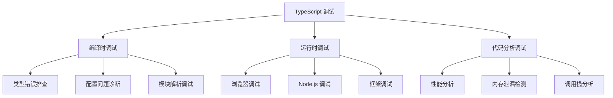

# TypeScript 调试技巧大全

## 🎯 TypeScript 调试策略总览

### 📊 调试工具生态



## 🔍 编译时类型调试

### 💡 TypeScript 编译器调试

```typescript
// 1. 详细的类型检查调试
// tsconfig.json 中添加详细输出
{
    "compilerOptions": {
        "diagnostics": true,
        "extendedDiagnostics": true,
        "listFiles": true,
        "listEmittedFiles": true,
        "traceResolution": true
    }
}

// 2. 类型错误深度分析
interface User {
    id: number;
    name: string;
    email: string;
}

// 常见类型错误的调试步骤
function processUser(user: User) {
    // ❌ 错误例：属性不存在
    // console.log(user.age);  // Error: Property 'age' does not exist on type 'User'
    
    // ✅ 正确的调试方法
    console.log('User details:', {
        id: user.id,
        name: user.name,
        email: user.email
    });
}

// 3. 泛型类型调试技巧
function debugGeneric<T>(value: T): T {
    // 使用类型断言来检查推断结果
    console.log('Type inferred:', typeof value);
    console.log('Value:', value);
    return value;
}

// 实际使用时的类型调试
const debugResult = debugGeneric({ name: 'Alice', age: 30 }); // T 被推断为 { name: string; age: number }
```

### 🛠️ 高级类型调试技术

```typescript
// 工具类型：类型检查器
type TypeCheck<T> = T extends string ? 'string' :
                   T extends number ? 'number' :
                   T extends boolean ? 'boolean' :
                   T extends object ? 'object' :
                   'unknown';

// 调试复杂的条件类型
type ComplexCondition<T, U> = T extends U ? 
    U extends keyof T ? 
        T[U] extends string ? 'string_value' : 'other_value' :
        'no_key' :
    'no_match';

// 使用示例调试类型
type Test1 = TypeCheck<string>;           // "string" 
type Test2 = TypeCheck<number>;          // "number"
type Test3 = TypeCheck<{ a: string }>;   // "object"

// 调试函数签名
function debuggingFunction<T extends Record<string, any>>(
    obj: T,
    key: keyof T
): void {
    // 使用类型守护来调试
    if (typeof obj === 'object' && obj !== null) {
        const value = obj[key];
        console.log(`Key: ${String(key)}, Value:`, value);
        console.log(`Value type:`, typeof value);
    }
}

// 实际调试示例
const testObj = { name: 'John', age: 25, active: true };
debuggingFunction(testObj, 'name');  // 调试 name 属性
debuggingFunction(testObj, 'age');   // 调试 age 属性
```

## 🌐 运行时调试技术

### 🔥 浏览器环境调试

```typescript
// 1. Source Map 调试配置
// webpack.config.js 中的调试配置
const webpackConfig = {
    devtool: 'source-map',  // 可选: 'cheap-module-source-map', 'eval-source-map'
    resolve: {
        extensions: ['.ts', '.tsx', '.js', '.jsx']
    }
};

// 2. TypeScript 运行时类型检查
class RuntimeTypeCheck {
    static isString(value: unknown): value is string {
        return typeof value === 'string';
    }
    
    static isNumber(value: unknown): value is number {
        return typeof value === 'number' && !isNaN(value);
    }
    
    static isUser(obj: unknown): obj is User {
        return typeof obj === 'object' && 
               obj !== null &&
               typeof (obj as any).id === 'number' &&
               typeof (obj as any).name === 'string';
    }
    
    // 运行时验证函数
    static validateUserData(data: unknown): User {
        if (!this.isUser(data)) {
            console.error('Invalid user data:', data);
            throw new Error('Invalid user data provided');
        }
        return data;
    }
}

// 3. 调试装饰器
function DebugMethod<T extends (...args: any[]) => any>(
    target: any,
    propertyKey: string,
    descriptor: TypedPropertyDescriptor<T>
): TypedPropertyDescriptor<T> {
    const originalMethod = descriptor.value!;
    
    descriptor.value = function (...args: any[]) {
        console.group(`🔍 Debug: ${target.constructor.name}.${propertyKey}`);
        console.log('Input arguments:', args);
        
        const startTime = performance.now();
        const result = originalMethod.apply(this, args);
        const endTime = performance.now();
        
        console.log('Output result:', result);
        console.log('Execution time:', `${endTime - startTime}ms`);
        console.groupEnd();
        
        return result;
    } as T;
    
    return descriptor;
}

// 使用调试装饰器
class ApiService {
    @DebugMethod
    async fetchUser(id: number): Promise<User> {
        // API 调用逻辑
        const response = await fetch(`/api/users/${id}`);
        return response.json();
    }
}
```

### 🖥️ Node.js 环境调试

```typescript
// 1. Node.js 调试器配置
// package.json 中的调试脚本
{
    "scripts": {
        "debug": "node --inspect-brk=9229 dist/index.js",
        "debug:chrome": "node --inspect dist/index.js",
        "debug:vscode": "node dist/index.js"
    }
}

// 2. VS Code 调试配置 (.vscode/launch.json)
{
    "version": "0.2.0",
    "configurations": [
        {
            "name": "Debug TypeScript",
            "type": "node",
            "request": "launch",
            "program": "${workspaceFolder}/src/index.ts",
            "outFiles": ["${workspaceFolder}/dist/**/*.js"],
            "runtimeArgs": ["-r", "ts-node/register"],
            "console": "integratedTerminal",
            "restart": true,
            "protocol": "inspector"
        }
    ]
}

// 3. 高级调试类
class AdvancedDebugger {
    private static logs: DebugLog[] = [];
    
    static log(level: 'info' | 'warn' | 'error', message: string, data?: any): void {
        const logEntry: DebugLog = {
            timestamp: new Date(),
            level,
            message,
            data: data ? JSON.parse(JSON.stringify(data)) : undefined,
            stack: new Error().stack
        };
        
        this.logs.push(logEntry);
        
        // 控制台输出
        switch (level) {
            case 'info':
                console.log(`🔵 [INFO] ${message}`, data);
                break;
            case 'warn':
                console.warn(`🟡 [WARN] ${message}`, data);
                break;
            case 'error':
                console.error(`🔴 [ERROR] ${message}`, data);
                break;
        }
    }
    
    static getLogs(): ReadonlyArray<DebugLog> {
        return [...this.logs];
    }
    
    static clearLogs(): void {
        this.logs = [];
    }
    
    static exportLogs(): string {
        return JSON.stringify(this.logs, null, 2);
    }
}

interface DebugLog {
    timestamp: Date;
    level: 'info' | 'warn' | 'error';
    message: string;
    data?: any;
    stack?: string;
}

// 使用高级调试器
class UserService {
    async getUserById(id: number): Promise<User> {
        AdvancedDebugger.log('info', 'Fetching user by ID', { id });
        
        try {
            // 业务逻辑
            const user = await this.fetchUser(id);
            AdvancedDebugger.log('info', 'User fetched successfully', { userId: user.id });
            return user;
        } catch (error) {
            AdvancedDebugger.log('error', 'Failed to fetch user', { id, error });
            throw error;
        }
    }
    
    private async fetchUser(id: number): Promise<User> {
        // 模拟 API 调用
        return new Promise((resolve, reject) => {
            setTimeout(() => {
                if (id > 0) {
                    resolve({ id, name: `User ${id}`, email: `user${id}@example.com` });
                } else {
                    reject(new Error('Invalid user ID'));
                }
            }, 1000);
        });
    }
}
```

## 🎯 框架特定调试

### ⚛️ React TypeScript 调试

```typescript
// 1. React 组件调试工具
interface DebugProps<T> {
    data?: T;
    onStateChange?: (state: T) => void;
}

function DebugProvider<T>({ data, onStateChange }: DebugProps<T>) {
    useEffect(() => {
        if (data && onStateChange) {
            console.group('🔄 Component State Change');
            console.log('Previous state:', data);
            console.log('Timestamp:', new Date().toISOString());
            console.groupEnd();
            
            onStateChange(data);
        }
    }, [data, onStateChange]);
    
    return null; // 无渲染的调试组件
}

// 2. 类型安全的调试 Hook
function useDebugValue<T>(value: T, formatter?: (value: T) => string): T {
    // React DevTools 中显示的调试值
    React.useDebugValue(value, formatter);
    return value;
}

// 自定义调试 Hook
function useApiCall<T>(
    url: string,
    options?: RequestInit
): { data: T | null; loading: boolean; error: string | null } {
    const [state, setState] = React.useState<{
        data: T | null;
        loading: boolean;
        error: string | null;
    }>({
        data: null,
        loading: true,
        error: null
    });
    
    useEffect(() => {
        const fetchData = async () => {
            try {
                setState(prev => ({ ...prev, loading: true, error: null }));
                
                const response = await fetch(url, options);
                if (!response.ok) {
                    throw new Error(`HTTP ${response.status}: ${response.statusText}`);
                }
                
                const data = await response.json();
                setState({ data, loading: false, error: null });
                
                AdvancedDebugger.log('info', 'API call successful', { url, data });
            } catch (error) {
                const errorMessage = error instanceof Error ? error.message : 'Unknown error';
                setState({ data: null, loading: false, error: errorMessage });
                
                AdvancedDebugger.log('error', 'API call failed', { url, error: errorMessage });
            }
        };
        
        fetchData();
    }, [url, JSON.stringify(options)]);
    
    // React DevTools 调试值
    useDebugValue(state, (state) => `Loading: ${state.loading}, Has data: ${state.data !== null}`);
    
    return state;
}

// 3. 使用示例
function UserProfile({ userId }: { userId: number }) {
    const userData = useApiCall<User>(`/api/users/${userId}`);
    
    return (
        <div>
            {userData.loading && <div>Loading...</div>}
            {userData.error && <div>Error: {userData.error}</div>}
            {userData.data && (
                <div>
                    <h2>{userData.data.name}</h2>
                    <p>{userData.data.email}</p>
                </div>
            )}
        </div>
    );
}
```

### 🔧 Vue 3 TypeScript 调试

```typescript
// Vue 3 Composition API 调试
import { ref, computed, onMounted, watchEffect } from 'vue';

// 调试工具函数
function createDebugRef<T>(initialValue: T, label: string) {
    const reactiveValue = ref(initialValue);
    
    // 监听值的变化
    watchEffect(() => {
        console.log(`🔍 [${label}] Value changed to:`, reactiveValue.value);
    });
    
    return reactiveValue;
}

// 调试函数包装器
function debugComposable<T, R>(
    composableFunction: (...args: T[]) => R,
    name: string
) {
    return (...args: T[]): R => {
        console.group(`🔧 Composable: ${name}`);
        console.log('Arguments:', args);
        
        const result = composableFunction(...args);
        console.log('Result:', result);
        console.groupEnd();
        
        return result;
    };
}

// 实际使用示例
function useUserData(userId: number) {
    const user = createDebugRef<User | null>(null, 'User Data');
    const loading = createDebugRef(false, 'Loading State');
    
    const fetchUser = async () => {
        loading.value = true;
        try {
            const response = await fetch(`/api/users/${userId}`);
            user.value = await response.json();
        } catch (error) {
            console.error('Failed to fetch user:', error);
        } finally {
            loading.value = false;
        }
    };
    
    onMounted(() => {
        fetchUser();
    });
    
    return {
        user: readonly(user),
        loading: readonly(loading),
        refetch: fetchUser
    };
}

// 包装调试功能
const debuggedUserData = debugComposable(useUserData, 'useUserData');
```

## 📊 性能调试与分析

### ⚡ 性能分析工具

```typescript
// 1. 函数性能分析装饰器
function PerformanceProfiler<T extends (...args: any[]) => any>(
    threshold: number = 100
) {
    return function (
        target: any,
        propertyKey: string,
        descriptor: TypedPropertyDescriptor<T>
    ): TypedPropertyDescriptor<T> {
        const originalMethod = descriptor.value!;
        
        descriptor.value = function (...args: any[]) {
            const startTime = performance.now();
            
            try {
                const result = originalMethod.apply(this, args);
                
                // 处理异步函数
                if (result instanceof Promise) {
                    return result.finally(() => {
                        const endTime = performance.now();
                        const duration = endTime - startTime;
                        
                        if (duration > threshold) {
                            console.warn(
                                `⚠️ Slow function detected: ${target.constructor.name}.${propertyKey}`,
                                `Duration: ${duration.toFixed(2)}ms`,
                                `Threshold: ${threshold}ms`
                            );
                        }
                        
                        AdvancedDebugger.log('info', 'Function execution completed', {
                            function: `${target.constructor.name}.${propertyKey}`,
                            duration: Math.round(duration),
                            threshold
                        });
                    }) as ReturnType<T>;
                } else {
                    const endTime = performance.now();
                    const duration = endTime - startTime;
                    
                    if (duration > threshold) {
                        console.warn(`⚠️ Slow function: ${target.constructor.name}.${propertyKey} (${duration.toFixed(2)}ms)`);
                    }
                    
                    return result;
                }
            } catch (error) {
                const endTime = performance.now();
                console.error(`❌ Function failed: ${target.constructor.name}.${propertyKey}`, {
                    error,
                    duration: endTime - startTime
                });
                throw error;
            }
        } as T;
        
        return descriptor;
    };
}

// 2. 内存使用分析
class MemoryProfiler {
    private static snapshots: MemorySnapshot[] = [];
    
    static takeSnapshot(label: string): void {
        if ('performance' in window && 'memory' not in window.performnce) {
            return; // 浏览器不支持内存API
        }
        
        const usage = (window as any).performance.memory;
        const snapshot: MemorySnapshot = {
            label,
            timestamp: new Date(),
            used: Math.round(usage.usedJSHeapSize / 1048576), // MB
            total: Math.round(usage.totalJSHeapSize / 1048576), // MB
            limit: Math.round(usage.jsHeapSizeLimit / 1048576) // MB
        };
        
        this.snapshots.push(snapshot);
        
        console.log(`📊 Memory Snapshot [${label}]`, {
            Used: `${snapshot.used}MB`,
            Total: `${snapshot.total}MB`,
            Limit: `${snapshot.limit}MB`
        });
    }
    
    static compareSnapshots(from: string, to: string): MemoryDiff | null {
        const fromSnapshot = this.snapshots.find(s => s.label === from);
        const toSnapshot = this.snapshots.find(s => s.label === to);
        
        if (!fromSnapshot || !toSnapshot) {
            return null;
        }
        
        return {
            label: `${from} → ${to}`,
            usedDiff: toSnapshot.used - fromSnapshot.used,
            totalDiff: toSnapshot.total - fromSnapshot.total,
            timeDiff: toSnapshot.timestamp.getTime() - fromSnapshot.timestamp.getTime()
        };
    }
    
    static getAllSnapshots(): ReadonlyArray<MemorySnapshot> {
        return [...this.snapshots];
    }
}

interface MemorySnapshot {
    label: string;
    timestamp: Date;
    used: number;
    total: number;
    limit: number;
}

interface MemoryDiff {
    label: string;
    usedDiff: number;
    totalDiff: number;
    timeDiff: number;
}

// 使用性能分析工具
class DataProcessor {
    @PerformanceProfiler(50)
    async processLargeDataset(data: any[]): Promise<any[]> {
        // 模拟大量数据处理
        await new Promise(resolve => setTimeout(resolve, Math.random() * 200));
        return data.map(item => ({ ...item, processed: true }));
    }
    
    @PerformanceProfiler(100)
    async validateData(data: any[]): Promise<boolean> {
        // 模拟数据验证
        await new Promise(resolve => setTimeout(resolve, Math.random() * 150));
        return data.every(item => item.id && item.name);
    }
}

// 内存分析示例
async function performMemoryAnalysis() {
    MemoryProfiler.takeSnapshot('Before processing');
    
    const processor = new DataProcessor();
    const largeDataset = Array.from({ length: 1000 }, (_, i) => ({ id: i, name: `Item ${i}` }));
    
    await processor.processLargeDataset(largeDataset);
    
    MemoryProfiler.takeSnapshot('After processing');
    
    const diff = MemoryProfiler.compareSnapshots('Before processing', 'After processing');
    if (diff) {
        console.log('📈 Memory Analysis:', diff);
    }
}
```

## 📚 调试最佳实践

### 🎯 调试策略总结

| 调试类型 | 工具选择 | 最佳时机 | 注意要点 |
|----------|----------|----------|----------|
| **类型错误** | TypeScript Compiler | 开发阶段 | 启用严格模式 |
| **运行时错误** | 浏览器/Node 调试器 | 测试阶段 | 使用 Source Map |
| **性能问题** | Performance API | 生产前优化 | 关注阈值设置 |
| **逻辑错误** | Console + 断点 | 任何阶段 | 保持调试日志简洁 |

### 🔧 调试工具链配置

```typescript
// 环境变量控制的调试级别
interface DebugConfig {
    level: 'none' | 'error' | 'warn' | 'info' | 'debug';
    enableConsole: boolean;
    enablePerformance: boolean;
    enableMemoryTracking: boolean;
}

const debugConfig: DebugConfig = {
    level: process.env.NODE_ENV === 'development' ? 'debug' : 'error',
    enableConsole: process.env.NODE_ENV !== 'production',
    enablePerformance: process.env.DEBUG_PERFORMANCE === 'true',
    enableMemoryTracking: process.env.DEBUG_MEMORY === 'true'
};

// 全局调试管理器
export class GlobalDebugger {
    static shouldLog(level: string): boolean {
        const levels = ['none', 'error', 'warn', 'info', 'debug'];
        return levels.indexOf(level) <= levels.indexOf(debugConfig.level);
    }
    
    static log(level: 'error' | 'warn' | 'info' | 'debug', message: string, data?: any): void {
        if (this.shouldLog(level) && debugConfig.enableConsole) {
            console[level](message, data);
        }
    }
    
    static trackPerformance(name: string, fn: () => any): any {
        if (debugConfig.enablePerformance) {
            const start = performance.now();
            const result = fn();
            const end = performance.now();
            
            this.log('info', `Performance ${name}`, { duration: end - start });
            return result;
        }
        
        return fn();
    }
}
```

### 🔗 相关深入学习

- [[03-Type-Errors-Debug指南]] - 类型错误专门调试指南
- [[02-Performance-Optimization性能优化]] - 性能优化策略
- [[02-Performance-Analysis性能分析]] - 性能分析方法

---
*💡 掌握TypeScript调试技巧是提高开发效率的关键，良好的调试习惯能帮助您快速定位和解决问题*
