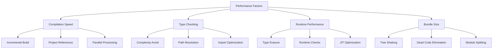

# TypeScript 性能优化完全指南

## 🎯 TypeScript 性能概览

### 📊 性能影响因素



## 🔧 编译时性能优化

### 💡 TypeScript 配置优化

```typescript
// tsconfig.json - 性能优化配置
{
  "compilerOptions": {
    // 增量编译
    "incremental": true,
    "tsBuildInfoFile": ".tsbuildinfo",
    
    // 跳过类型检查库文件
    "skipLibCheck": true,
    
    // 忽略错误快速构建
    "skipDefaultLibCheck": true,
    
    // 仅检查必需文件
    "isolatedModules": true,
    
    // 优化模块解析
    "moduleResolution": "node",
    
    // 禁用某些检查以提升速度
    "allowSyntheticDefaultImports": true,
    "esModuleInterop": true,
    
    // 启用类型缓存
    "assumeChangesOnlyAffectDirectDependencies": true
  },
  
  // 项目引用配置
  "references": [
    { "path": "./packages/core" },
    { "path": "./packages/ui" },
    { "path": "./apps/web" }
  ],
  
  // 文件包含优化
  "include": [
    "src/**/*",
    "types/**/*"
  ],
  
  // 排除不需要的文件
  "exclude": [
    "node_modules",
    "dist",
    "build",
    "**/*.test.ts",
    "**/*.spec.ts"
  ]
}
```

### 🎪 项目引用策略

```typescript
// 1. 根 tsconfig.json
{
  "files": [],
  "references": [
    { "path": "./packages/common" },
    { "path": "./packages/ui" },
    { "path": "./packages/api" },
    { "path": "./apps/web" }
  ],
  "compilerOptions": {
    "composite": true,
    "declarationMap": true,
    "sourceMap": true
  }
}

// 2. packages/common/tsconfig.json
{
  "extends": "../../tsconfig.base.json",
  "compilerOptions": {
    "outDir": "./dist",
    "rootDir": "./src",
    "composite": true
  },
  "include": ["src/**/*"]
}

// 3. packages/ui/tsconfig.json
{
  "extends": "../../tsconfig.base.json",
  "compilerOptions": {
    "composite": true,
    "outDir": "./dist"
  },
  "references": [
    { "path": "../common" }
  ],
  "include": ["src/**/*"]
}

// 4. 构建脚本优化
// build.js
const TypeScript = require('typescript');
const path = require('path');

async function buildProjects() {
    const configPath = TypeScript.findConfigFile('.', TypeScript.sys.fileExists, 'tsconfig.json');
    
    if (!configPath) {
        throw new Error('TSConfig not found');
    }
    
    const config = TypeScript.readConfigFile(configPath, TypeScript.sys.readFile);
    const parsedConfig = TypeScript.parseJsonConfigFileContent(
        config.config,
        TypeScript.sys,
        path.dirname(configPath)
    );
    
    // 并行构建所有引用项目
    const buildHost = TypeScript.createSolutionBuilderHost(
        TypeScript.sys,
        undefined,
        (reportDiagnostic) => console.log('Diagnostic:', reportDiagnostic),
        (reportStatusSummary) => console.log('Build complete')
    );
    
    const program = TypeScript.createSolutionBuilderWithWatch(
        buildHost,
        ['.'],
        parsedConfig.options
    );
    
    program.build();
}
```

## 🚀 类型复杂度优化

### 🎯 高级类型性能技巧

```typescript
// 1. 避免过度深度递归
// ❌ 性能问题：过度递归
type DeepRecursive<T> = {
    [K in keyof T]: T[K] extends object ? DeepRecursive<T[K]> : T[K];
};

// ✅ 性能优化：限制递归深度
type LimitedDepth<T, Depth extends number = 3> = 
    Depth extends 0 ? T :
    {
        [K in keyof T]: T[K] extends object 
            ? LimitedDepth<T[K], Prev<Depth>>
            : T[K];
    };

type Prev<T extends number> = [...Array<T>, never] extends [infer A, ...infer _] 
    ? A extends number ? A : never 
    : never;

// 2. 缓存重复计算
type CachedTransform<T> = T extends infer U
    ? U extends object
        ? { readonly [K in keyof U]: CachedTransform<U[K]> }
        : U
    : never;

// 3. 简化条件类型
// ❌ 复杂条件
type ComplexCondition<T> = T extends string 
    ? T extends 'a'
        ? 'A'
        : T extends 'b'
            ? 'B'
            : 'Unknown'
    : T extends number
        ? T extends 1
            ? 'One'
            : 'Number'
        : 'Other';

// ✅ 简化条件
type SimpleCondition<T> = 
    T extends 'a' ? 'A' :
    T extends 'b' ? 'B' :
    T extends string ? 'Unknown' :
    T extends 1 ? 'One' :
    T extends number ? 'Number' :
    'Other';

// 4. 工具类型预设
// 预计算复杂类型映射
type PresetMappings = {
    'system.admin': { permissions: ['read', 'write', 'delete', 'admin']; level: 4; };
    'system.user': { permissions: ['read']; level: 1; };
    'system.guest': { permissions: []; level: 0; };
};

type PreComputedRole<T extends keyof PresetMappings> = PresetMappings[T];

// 使用预设避免动态计算
type AdminRole = PreComputedRole<'system.admin'>;
```

### 🔍 导入优化策略

```typescript
// 1. 按需导入优化
// ❌ 全量导入
import * as Utils from './utils';

// ✅ 按需导入
import { formatDate, validateEmail } from './utils';

// 2. 类型专用导入
// ❌ 混合导入
import { ComponentType, componentConfig } from './components';

// ✅ 类型分离
import type { ComponentType } from './components';
import { componentConfig } from './components';

// 3. 重导出优化
// utils/index.ts
export { formatDate, parseDate } from './date-utils';
export { validateEmail, validatePhone } from './validation';
export type { DateFormat, ValidationResult } from './types';

// 4. 动态导入
// 按需加载模块
const loadModule = async (moduleName: string) => {
    const module = await import(`./modules/${moduleName}`);
    return module.default;
};

// 5. 条件加载
const getCurrentUserModule = async () => {
    const role = await getCurrentUserRole();
    
    if (role === 'admin') {
        return import('./admin-module');
    } else {
        return import('./user-module');
    }
};
```

## ⚡ 运行时性能优化

### 🔄 类型擦除优化

```typescript
// 1. 编译时类型优化
interface OptimizedData<T extends Record<string, any>> {
    // 使用泛型约束而非扩展复杂接口
    data: T;
    timestamp: number;
    version: string;
}

// 2. 避免运行时类型检查
// ❌ 频繁的运行时检查
function processData(value: unknown): string {
    if (typeof value === 'string') {
        return value.toUpperCase();
    }
    if (typeof value === 'number') {
        return value.toString();
    }
    return 'unknown';
}

// ✅ 编译时类型安全
function processTypedData(value: string | number): string {
    return typeof value === 'string' ? value.toUpperCase() : value.toString();
}

// 3. 函数重载优化
// ❌ 运行时类型检查
function fetchData(input: unknown) {
    if (typeof input === 'string') {
        return fetchFromURL(input);
    } else {
        return fetchFromID(input as number);
    }
}

// ✅ 编译时类型安全
function fetchData(input: string): Promise<WebData>;
function fetchData(input: number): Promise<UserData>;
function fetchData(input: string | number): Promise<WebData | UserData> {
    if (typeof input === 'string') {
        return fetchFromURL(input);
    } else {
        return fetchFromID(input);
    }
}

// 4. 数据结构优化
// ❌频繁的类型转换
interface FlexibleData {
    [key: string]: unknown;
}

// ✅ 类型特定的数据结构
interface TypedUserData {
    id: string;
    name: string;
    email: string;
    preferences: UserPreferences;
}

interface TypedProductData {
    id: string;
    title: string;
    price: number;
    category: ProductCategory;
}
```

### 🎭 内存优化技巧

```typescript
// 1. 对象池模式
class ObjectPool<T> {
    private pool: T[] = [];
    private createFn: () => T;
    
    constructor(createFn: () => T, initialSize: number = 10) {
        this.createFn = createFn;
        
        // 预创建对象池
        for (let i = 0; i < initialSize; i++) {
            this.pool.push(this.createFn());
        }
    }
    
    acquire(): T {
        if (this.pool.length > 0) {
            return this.pool.pop()!;
        }
        return this.createFn();
    }
    
    release(obj: T): void {
        if (this.pool.length < this.maxSize) {
            // 重置对象状态
            if ('reset' in obj && typeof obj.reset === 'function') {
                (obj as any).reset();
            }
            this.pool.push(obj);
        }
    }
}

// 2. 弱引用优化
class WeakCache<K extends object, V> {
    private cache = new WeakMap<K, V>();
    
    set(key: K, value: V): void {
        this.cache.set(key, value);
    }
    
    get(key: K): V | undefined {
        return this.cache.get(key);
    }
    
    has(key: K): boolean {
        return this.cache.has(key);
    }
}

// 3. 懒重复加载优化
class LazyFactory<T> {
    private factories = new Map<string, () => T>();
    private instances = new Map<string, T>();
    
    register(key: string, factory: () => T): void {
        this.factories.set(key, factory);
    }
    
    get(key: string): T {
        if (!this.instances.has(key)) {
            const factory = this.factories.get(key);
            if (!factory) {
                throw new Error(`No factory registered for key: ${key}`);
            }
            const instance = factory();
            this.instances.set(key, instance);
        }
        return this.instances.get(key)!;
    }
}
```

## 📚 Bundle 大小优化

### 🎯 Tree Shaking 优化

```typescript
// 1. 支持 Tree Shaking 的导出
// utils/math.ts
export function add(a: number, b: number): number {
    return a + b;
}

export function multiply(a: number, b: number): number {
    return a * b;
}

// 避免对象导出阻断 tree shaking
// ❌ 对象导出
export const MathUtils = {
    add: (a: number, b: number) => a + b,
    multiply: (a: number, b: number) => a * b
};

// ✅ 分别导出
export function MathAdd(a: number, b: number): number {
    return a + b;
}

export function MathMultiply(a: number, b: number): number {
    return a * b;
}

// 2. 条件导出
// index.ts
export * from './core';

// 根据环境条件导出
if (process.env.NODE_ENV === 'development') {
    export * from './dev-tools';
}

// 3. 按需导出配置
// package.json
{
    "sideEffects": false,
    "module": "dist/index.esm.js",
    "main": "dist/index.js",
    "types": "dist/index.d.ts"
}
```

### 🔧 代码分割策略

```typescript
// 1. 动态导入优化
// 路由级别的代码分割
const routes = [
    {
        path: '/dashboard',
        component: () => import('./views/Dashboard.vue'),
        children: [
            {
                path: 'analytics',
                component: () => import('./views/Analytics.vue')
            },
            {
                path: 'reports',
                component: () => import('./views/Reports.vue')
            }
        ]
    },
    {
        path: '/admin',
        component: () => import('./views/Admin.vue')
    }
];

// 2. 按需求加载类型定义
// types/index.ts
export type CoreTypes from './core';
export type ExtendedTypes from './extended';

// 条件导出类型
if (process.env.BUILD_TARGET === 'full') {
    export type AllTypes from './all';
}

// 3. 主题按需加载
const themeModules = {
    light: () => import('./themes/light'),
    dark: () => import('./themes/dark'),
    custom: () => import('./themes/custom')
};

async function loadTheme(themeName: string) {
    const themeLoader = themeModules[themeName as keyof typeof themeModules];
    if (themeLoader) {
        return await themeLoader();
    }
    throw new Error(`Unknown theme: ${themeName}`);
}
```

## 🎪 性能监控与分析

### 📊 性能指标收集

```typescript
// 1. TypeScript 编译性能监控
interface BuildMetrics {
    buildTime: number;
    typeCheckTime: number;
    emitTime: number;
    memoryUsage: number;
    fileCount: number;
}

class PerformanceMonitor {
    private startTime: number = 0;
    private metrics: BuildMetrics[] = [];
    
    startBuild(): void {
        this.startTime = performance.now();
    }
    
    endBuild(): BuildMetrics {
        const buildTime = performance.now() - this.startTime;
        const metrics: BuildMetrics = {
            buildTime,
            typeCheckTime: 0, // 需要从 TS compiler 获取
            emitTime: 0,
            memoryUsage: process.memoryUsage().heapUsed,
            fileCount: 0
        };
        
        this.metrics.push(metrics);
        return metrics;
    }
    
    getAverageBuildTime(): number {
        const totalTime = this.metrics.reduce((sum, m) => sum + m.buildTime, 0);
        return totalTime / this.metrics.length;
    }
    
    reportMetrics(): void {
        console.table(this.metrics);
    }
}

// 2. 运行时类型检查性能
class TypeCheckProfiler {
    private checks: Map<string, number[]> = new Map();
    
    profile<T>(name: string, checkFn: () => T): T {
        const start = performance.now();
        const result = checkFn();
        const end = performance.now();
        
        if (!this.checks.has(name)) {
            this.checks.set(name, []);
        }
        this.checks.get(name)!.push(end - start);
        
        return result;
    }
    
    getStats(name: string) {
        const times = this.checks.get(name) || [];
        return {
            count: times.length,
            average: times.reduce((a, b) => a + b, 0) / times.length,
            min: Math.min(...times),
            max: Math.max(...times)
        };
    }
}
```

### 🔗 相关深入学习

- [[01-Debugging调试技巧大全]] - 调试与性能分析
- [[04-Version-Migration升级指南]] - 版本迁移优化
- [[01-Type-System入门]] - 类型系统基础

---
*💡 TypeScript 性能优化是一个系统工程，需要在编译时、运行时和构建时多个层面进行优化*
