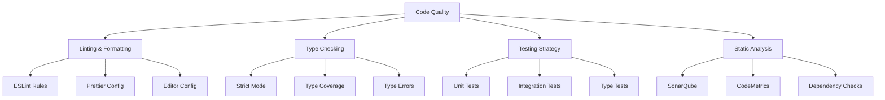

# TypeScript 代码质量保证

## 🎯 代码质量概览

### 📊 质量保证体系



## 🔧 代码规范与 Linting

### 💡 ESLint 配置

```typescript
// .eslintrc.js
module.exports = {
  root: true,
  parser: '@typescript-eslint/parser',
  parserOptions: {
    ecmaVersion: 2020,
    sourceType: 'module',
    ecmaFeatures: {
      jsx: true,
    },
  },
  plugins: ['@typescript-eslint', 'react', 'react-hooks'],
  extends: [
    'eslint:recommended',
    '@typescript-eslint/recommended',
    '@typescript-eslint/recommended-requiring-type-checking',
    'plugin:react/recommended',
    'plugin:react-hooks/recommended',
    'plugin:jsx-a11y/recommended',
    'prettier/@typescript-eslint',
  ],
  rules: {
    // TypeScript 特定规则
    '@typescript-eslint/no-unused-vars': 'error',
    '@typescript-eslint/no-explicit-any': 'warn',
    '@typescript-eslint/explicit-function-return-type': 'warn',
    '@typescript-eslint/no-non-null-assertion': 'warn',
    '@typescript-eslint/prefer-const': 'error',
    '@typescript-eslint/no-var-requires': 'error',
    
    // 代码质量规则
    'no-console': 'warn',
    'no-debugger': 'error',
    'no-duplicate-imports': 'error',
    'prefer-const': 'error',
    'no-var': 'error',
    
    // React 规则
    'react/prop-types': 'off', // TypeScript 替代 prop-types
    'react/react-in-jsx-scope': 'off', // Next.js 不需要导入 React
    'react-hooks/rules-of-hooks': 'error',
    'react-hooks/exhaustive-deps': 'warn',
    
    // 可访问性规则
    'jsx-a11y/anchor-is-valid': 'error',
    'jsx-a11y/img-redundant-alt': 'error',
  },
  env: {
    browser: true,
    node: true,
    es6: true,
  },
  settings: {
    react: {
      version: 'detect',
    },
  },
  ignorePatterns: ['dist/', 'build/', '*.js', '*.d.ts', 'node_modules/'],
};

// .eslintrc.custom.js - 自定义规则集
module.exports = {
  extends: ['./.eslintrc.js'],
  rules: {
    // 自定义业务规则
    '@typescript-eslint/naming-convention': [
      'error',
      {
        selector: 'interface',
        format: ['PascalCase'],
        prefix: ['I'],
      },
      {
        selector: 'typeAlias',
        format: ['PascalCase'],
        suffix: ['Type'],
      },
      {
        selector: 'variable',
        format: ['camelCase', 'UPPER_CASE'],
      },
    ],
    
    // 复杂度控制
    complexity: ['error', 10],
    'max-depth': ['error', 4],
    'max-lines': ['error', 300],
    'max-lines-per-function': ['error', 50],
    'max-params': ['error', 4],
    
    // 维护性规则
    'max-len': ['error', { code: 100 }],
    'max-statements': ['error', 20],
    'no-nested-ternary': 'error',
    'prefer-template': 'error',
    
    // 安全规则
    'no-eval': 'error',
    'no-implied-eval': 'error',
    'no-script-url': 'error',
  },
};
```

### 🎪 Prettier 配置

```typescript
// .prettierrc.js
module.exports = {
  // 基础配置
  semi: true,
  singleQuote: true,
  tabWidth: 2,
  useTabs: false,
  printWidth: 100,
  trailingComma: 'es5',
  
  // 括号配置
  bracketSpacing: true,
  bracketSameLine: false,
  arrowParens: 'avoid',
  
  // JSX 配置
  jsxSingleQuote: false,
  
  // 其他配置
  endOfLine: 'lf',
  quoteProps: 'as-needed',
  
  // TypeScript 特定
  parser: 'typescript',
  
  // 覆盖规则
  overrides: [
    {
      files: '*.json',
      options: {
        parser: 'json',
        printWidth: 80,
      },
    },
    {
      files: '*.md',
      options: {
        parser: 'markdown',
        printWidth: 80,
        proseWrap: 'always',
      },
    },
    {
      files: ['*.yml', '*.yaml'],
      options: {
        parser: 'yaml',
        tabWidth: 2,
      },
    },
  ],
};

// prettier.config.type.js - 类型化配置
import type { Options } from 'prettier';

const config: Options = {
  semi: true,
  singleQuote: true,
  tabWidth: 2,
  useTabs: false,
  printWidth: 100,
  trailingComma: 'es5' as const,
  bracketSpacing: true,
  bracketSameLine: false,
  arrowParens: 'avoid' as const,
  jsxSingleQuote: false,
  endOfLine: 'lf' as const,
  quoteProps: 'as-needed' as const,
};

export default config;
```

## 🚀 测试策略与实现

### 🔄 Unit Testing 框架

```typescript
// tests/utils/setup.ts
import '@testing-library/jest-dom';
import { configure } from '@testing-library/react';

// 配置测试库
configure({
  testIdAttribute: 'data-testid',
});

// Mock 全局对象
global.fetch = jest.fn();
global.matchMedia = jest.fn().mockImplementation(query => ({
  matches: false,
  media: query,
  onchange: null,
  addListener: jest.fn(),
  removeListener: jest.fn(),
  addEventListener: jest.fn(),
  removeEventListener: jest.fn(),
  dispatchEvent: jest.fn(),
}));

// Mock ResizeObserver
global.ResizeObserver = jest.fn().mockImplementation(() => ({
  observe: jest.fn(),
  unobserve: jest.fn().fn(),
  disconnect: jest.fn(),
}));

// Mock IntersectionObserver
global.IntersectionObserver = jest.fn().mockImplementation(() => ({
  observe: jest.fn(),
  unobserve: jest.fn(),
  disconnect: jest.fn(),
}));

// 测试环境变量
process.env.NODE_ENV = 'test';

// Jest 配置
export const jestConfig = {
  preset: 'ts-jest',
  testEnvironment: 'jsdom',
  setupFilesAfterEnv: ['<rootDir>/tests/utils/setup.ts'],
  moduleNameMapping: {
    '^@/(.*)$': '<rootDir>/src/$1',
    '^@tests/(.*)$': '<rootDir>/tests/$1',
    '^@types/(.*)$': '<rootDir>/src/types/$1',
    '^@components/(.*)$': '<rootDir>/src/components/$1',
    '^@utils/(.*)$': '<rootDir>/src/utils/$1',
  },
  transform: {
    '^.+\\.(ts|tsx)$': 'ts-jest',
    '^.+\\.(js|jsx)$': 'babel-jest',
  },
  testMatch: [
    '<rootDir>/src/**/__tests__/**/*.(ts|tsx)',
    '<rootDir>/src/**/?(*.)+(spec|test).(ts|tsx)',
  ],
  collectCoverageFrom: [
    'src/**/*.{ts,tsx}',
    '!src/**/__tests__/**',
    '!src/**/types/**',
    '!src/**/index.{ts,tsx}',
  ],
  coverageThreshold: {
    global: {
      branches: 80,
      functions: 80,
      lines: 80,
      statements: 80,
    },
  },
};

// JUnit reporter 配置
export const globalSetup = {
  collectCoverageFrom: [
    'src/**/*.{ts,tsx}',
    '!src/**/*.stories.{ts,tsx}',
    '!src/**/*.test.{ts,tsx}',
    '!src/**/*.spec.{ts,tsx}',
  ],
};

// Mock 实现示例
export const mockApiResponse = <T>(data: T): Promise<T> => {
  return Promise.resolve(data);
};

export const mockError = (message: string): Error => {
  return new Error(message);
};

// 自定义测试匹配器
declare global {
  namespace jest {
    interface Matchers<R> {
      toBeInTheDocument(): R;
      toHaveClass(className: string): R;
      toHaveStyleProperty(property: string, value: string): R;
    }
  }
}

expect.extend({
  toBeInTheDocument() {
    return {
      message: () => 'Element is not in document',
      pass: this.isNot,
    };
  },
});
```

### 🎯 Component Testing

```typescript
// tests/components/Button.test.tsx
import React from 'react';
import { render, screen, fireEvent, waitFor } from '@testing-library/react';
import userEvent from '@testing-library/user-event';
import { axe, toHaveNoViolations } from 'jest-axe';

import { Button, ButtonProps } from '@/components/Button';

// 扩展 Jest 匹配器
expect.extend(toHaveNoViolations);

interface TestButtonProps extends Partial<ButtonProps> {
  label?: string;
}

const renderButton = (props: TestButtonProps = {}) => {
  const { label = 'Test Button', ...buttonProps } = props;
  return render(<Button {...buttonProps}>{label}</Button>);
};

describe('Button Component', () => {
  describe('Rendering', () => {
    it('render button with children', () => {
      renderButton();
      expect(screen.getByRole('button', { name: /test button/i })).toBeInTheDocument();
    });

    it('applies correct CSS classes based on variant', () => {
      const { rerender } = renderButton({ variant: 'primary' });
      expect(screen.getByRole('button')).toHaveClass('btn-primary');

      rerender(<Button variant="secondary">Secondary Button</Button>);
      expect(screen.getByRole('button')).toHaveClass('btn-secondary');
    });

    it('handles disabled state correctly', () => {
      renderButton({ disabled: true });
      const button = screen.getByRole('button');
      expect(button).toBeDisabled();
      expect(button).toHaveClass('btn-disabled');
    });

    it('renders loading state with spinner', () => {
      renderButton({ loading: true });
      expect(screen.getByRole('button')).toBeDisabled();
      expect(screen.getByTestId('loading-spinner')).toBeInTheDocument();
    });
  });

  describe('Interactions', () => {
    it('calls onClick when clicked', async () => {
      const mockOnClick = jest.fn();
      renderButton({ onClick: mockOnClick });
      
      const button = screen.getByRole('button');
      await userEvent.click(button);
      
      expect(mockOnClick).toHaveBeenCalledTimes(1);
    });

    it('does not call onClick when disabled', async () => {
      const mockOnClick = jest.fn();
      renderButton({ disabled: true, onClick: mockOnClick });
      
      const button = screen.getByRole('button');
      await userEvent.click(button);
      
      expect(mockOnClick).not.toHaveBeenCalled();
    });

    it('handles keyboard press events', async () => {
      const mockOnClick = jest.fn();
      renderButton({ onClick: mockOnClick });
      
      const button = screen.getByRole('button');
      button.focus();
      await userEvent.keyboard('{Enter}');
      
      expect(mockOnClick).toHaveBeenCalledTimes(1);
    });
  });

  describe('Accessibility', () => {
    it('has no accessibility violations', async () => {
      const { container } = renderButton();
      const results = await axe(container);
      expect(results).toHaveNoViolations();
    });

    it('has proper ARIA attributes', () => {
      renderButton({ 
        'aria-label': 'Custom label',
        'aria-describedby': 'help-text'
      });
      
      const button = screen.getByRole('button');
      expect(button).toHaveAttribute('aria-label', 'Custom label');
      expect(button).toHaveAttribute('aria-describedby', 'help-text');
    });

    it('announces loading state to screen readers', () => {
      renderButton({ loading: true, 'aria-label': 'Loading...' });
      
      const button = screen.getByRole('button');
      expect(button).toHaveAttribute('aria-label', 'Loading...');
      expect(button).toHaveAttribute('aria-live', 'polite');
    });
  });

  describe('Edge Cases', () => {
    it('handles undefined props gracefully', () => {
      renderButton({});
      expect(screen.getByRole('button')).toBeInTheDocument();
    });

    it('merges custom className with default classes', () => {
      renderButton({ className: 'custom-class' });
      const button = screen.getByRole('button');
      expect(button).toHaveClass('btn');
      expect(button).toHaveClass('custom-class');
    });

    it('handles large content without breaking layout', () => {
      renderButton({ label: 'Very long button text that might overflow' });
      expect(screen.getByRole('button')).toBeInTheDocument();
      // 检查样式是否正确应用
      expect(screen.getByRole('button')).toHaveStyle('white-space: nowrap');
    });
  });
});
```

## 🎭 代码覆盖与性能分析

### 🔧 覆盖率配置

```typescript
// coverage.config.js
module.exports = {
  collectCoverageFrom: [
    'src/**/*.{ts,tsx}',
    '!src/**/*.stories.{ts,tsx}',
    '!src/**/*.test.{ts,tsx}',
    '!src/**/*.spec.{ts,tsx}',
    '!src/**/__tests__/**',
    '!src/**/types/**',
    '!**/node_modules/**',
  ],
  coverageDirectory: 'coverage',
  coverageReporters: [
    'text',
    'text-summary',
    'lcov',
    'html',
    'json',
    'clover',
  ],
  collectCoverage: true,
  coverageThreshold: {
    global: {
      branches: 80,
      functions: 80,
      lines: 80,
      statements: 80,
    },
    // 不同类型文件的特定阈值
    './src/components/': {
      branches: 85,
      functions: 85,
      lines: 85,
      statements: 85,
    },
    './src/utils/': {
      branches: 90,
      functions: 90,
      lines: 90,
      statements: 90,
    },
    './src/hooks/': {
      branches: 80,
      functions: 80,
      lines: 80,
      statements: 80,
    },
  },
  // HTML 报告配置
  reporters: [
    'default',
    ['jest-html-reporters', {
      publicPath: './coverage/html-report',
      filename: 'report.html',
      expand: true,
      hideIcon: true,
      hidePassed: false,
      hideFailed: false,
      showPassed: true,
      showFailed: true,
    }],
  ],
};

// 性能测试配置
// jest.config.js
module.exports = {
  ...require('./jest.config.base.js'),
  collectCoverageFrom: [
    'src/**/*.{ts,tsx}',
    '!src/**/*.stories.{ts,tsx}',
    '!src/**/*.test.{ts,tsx}',
    '!src/**/*.spec.{ts,tsx}',
  ],
  // 性能基准测试
  testEnvironment: 'node',
  transform: {
    '^.+\\.(ts|tsx)$': ['ts-jest', {
      diagnostics: false,
    }],
  },
  // Bundle size 测试
  reporters: [
    'default',
    ['jest-bundle-analyzer', {
      analyzerMode: 'static',
      openAnalyzer: false,
      reportFilename: 'bundle-report.html',
    }],
  ],
};
            return res;
        }
        
        throw new TypeError(`Unhandled error: ${JSON.stringify(err)}`);
    });
};

export default ApiClient;
```

```typescript
// utils/formatters.ts
export function formatCurrency(amount: number, currency: string = 'USD'): string {
    if (typeof amount !== 'number' || isNaN(amount)) {
        throw new Error('Amount must be a valid number');
    }
    
    return new Intl.NumberFormat('en-US', {
        style: 'currency',
        currency: currency.toUpperCase(),
        minimumFractionDigits: 2,
        maximumFractionDigits: 2,
    }).format(amount);
}

export function formatDate(date: Date | string | number): string {
    const dateObj = typeof date === 'number' ? new Date(date) : 
                   typeof date === 'string' ? new Date(date) : date;
    
    if (!(dateObj instanceof Date) || isNaN(dateObj.getTime())) {
        throw new Error('Invalid date provided');
    }
    
    return dateObj.toLocaleDateString('en-US', {
        year: 'numeric',
        month: 'long',
        day: 'numeric',
    });
}

export function formatPhoneNumber(phoneNumber: string): string {
    if (!phoneNumber || typeof phoneNumber !== 'string') {
        throw new Error('Phone number must be a non-empty string');
    }
    
    // 移除所有非数字字符
    const cleaned = phoneNumber.replace(/\D/g, '');
    
    // 检查长度
    if (cleaned.length !== 10 && cleaned.length !== 11) {
        throw new Error('Phone number must be 10 or 11 digits');
    }
    
    // 格式化美国电话号码
    if (cleaned.length === 10) {
        return `(${cleaned.slice(0, 3)}) ${cleaned.slice(3, 6)}-${cleaned.slice(6)}`;
    }
    
    // 国际号码处理
    const countryCode = cleaned.slice(0, 1);
    const areaCode = cleaned.slice(1, 4);
    const centralOffice = cleaned.slice(4, 7);
    const subscriberNumber = cleaned.slice(7);
    
    return `+${countryCode} (${areaCode}) ${centralOffice}-${subscriberNumber}`;
}
```

### 🔗 相关深入学习

- [[02-Performance-Optimization性能优化]] - 性能优化策略
- [[01-Debugging调试技巧大全]] - 调试技术
- [[04-Version-Migration升级指南]] - 版本迁移

---
*💡 代码质量保证是TypeScript项目的核心，通过完善的linting、测试和覆盖率控制，能确保项目的高可维护性和稳定性*
