# TypeScript Version Migration 升级指南

## 🎯 TypeScript 版本升级全景

### 📊 升级策略框架

```mermaid
graph TD
    A[Version Migration Strategy] --> B[Assessment Phase]
    A --> C[Planning Phase]
    A --> D[Execution Phase]
    A --> E[Validation Phase]
    A --> F[Optimization Phase]
    
    B --> B1[Current State Analysis]
    B --> B2[Breaking Changes Review]
    B --> B3[Compatibility Assessment]
    B --> B4[Risk Evaluation]
    
    C --> C1[Migration Timeline]
    C --> C2[Resource Allocation]
    C --> C3[Rollback Strategy]
    C --> C4[Testing Strategy]
    
    D --> D1[Incremental Upgrade]
    D --> D2[Code Refactoring]
    D --> D3[Dependency Updates]
    D --> D4[Configuration Updates]
    
    E --> E1[Functionality Testing]
    E --> E2[Performance Testing]
    E --> E3[Compatibility Testing]
    E --> E4[Regression Testing]
    
    F --> F1[Performance Optimization]
    F --> F2[New Feature Adoption]
    F --> F3[Best Practices Update]
    F --> F4[Documentation Update]
```



## 🔧 Migration Engine Implementation

### 💡 Comprehensive Migration System

```typescript
// TypeScript Version Migration System
namespace VersionMigration {
    // Migration Framework Interface
    interface MigrationFramework {
        assessmentEngine: MigrationAssessmentEngine;
        planningEngine: MigrationPlanningEngine;
        executionEngine: MigrationExecutionEngine;
        validationEngine: MigrationValidationEngine;
        optimizationEngine: MigrationOptimizationEngine;
    }
    
    // TypeScript Migration Manager
    class TypeScriptMigrationManager {
        private assessmentEngine: MigrationAssessmentEngine;
        private planningEngine: MigrationPlanningEngine;
        private executionEngine: MigrationExecutionEngine;
        private validationEngine: MigrationValidationEngine;
        private optimizationEngine: MigrationOptimizationEngine;
        
        constructor(config: MigrationConfiguration) {
            this.assessmentEngine = new MigrationAssessmentEngine(config.assessmentConfig);
            this.planningEngine = new MigrationPlanningEngine(config.planningConfig);
            this.executionEngine = new MigrationExecutionEngine(config.executionConfig);
            this.validationEngine = new MigrationValidationEngine(config.validationConfig);
            this.optimizationEngine = new MigrationOptimizationEngine(config.optimizationConfig);
        }
        
        // Complete Migration Process
        async executeMigration(
            currentVersion: TypeScriptVersion,
            targetVersion: TypeScriptVersion,
            projectContext: ProjectContext
        ): Promise<MigrationResult> {
            // Phase 1: Migration Assessment
            const assessment = await this.assessMigration(currentVersion, targetVersion, projectContext);
            
            // Phase 2: Migration Planning
            const migrationPlan = await this.planMigration(assessment, targetVersion);
            
            // Phase 3: Migration Execution
            const executionResult = await this.executeMigrationPlan(migrationPlan, projectContext);
            
            // Phase 4: Migration Validation
            const validationResult = await this.validateMigration(executionResult, targetVersion);
            
            // Phase 5: Migration Optimization
            const optimizationResult = await this.optimizeMigration(validationResult, targetVersion);
            
            return {
                migrationMetadata: {
                    fromVersion: currentVersion,
                    toVersion: targetVersion,
                    migrationDate: new Date().toISOString(),
                    duration: executionResult.duration,
                    success: validationResult.success
                },
                
                assessment: assessment,
                migrationPlan: migrationPlan,
                executionResult: executionResult,
                validationResult: validationResult,
                optimizationResult: optimizationResult,
                
                breakingChanges: assessment.breakingChanges,
                resolvedIssues: executionResult.resolvedIssues,
                newFeatures: optimizationResult.newFeatures,
                performanceImprovements: optimizationResult.performanceImprovements,
                
                recommendations: this.generateRecommendations(optimizationResult),
                nextSteps: this.generateNextSteps(optimizationResult),
                rollbackPlan: this.createRollbackPlan(executionResult)
            };
        }
        
        // Migration Assessment Implementation
        private async assessMigration(
            currentVersion: TypeScriptVersion,
            targetVersion: TypeScriptVersion,
            projectContext: ProjectContext
        ): Promise<MigrationAssessment> {
            return {
                currentState: {
                    typescriptVersion: currentVersion,
                    projectSize: await this.analyzeProjectSize(projectContext),
                    dependencyAnalysis: await this.analyzeDependencies(projectContext),
                    codebaseComplexity: await this.analyzeCodebaseComplexity(projectContext),
                    testCoverage: await this.analyzeTestCoverage(projectContext)
                },
                
                breakingChanges: await this.identifyBreakingChanges(currentVersion, targetVersion),
                compatibilityIssues: await this.identifyCompatibilityIssues(currentVersion, targetVersion, projectContext),
                migrationComplexity: await this.calculateMigrationComplexity(currentVersion, targetVersion, projectContext),
                
                riskAssessment: {
                    highRisk: await this.identifyHighRiskAreas(currentVersion, targetVersion, projectContext),
                    mediumRisk: await this.identifyMediumRiskAreas(currentVersion, targetVersion, projectContext),
                    lowRisk: await this.identifyLowRiskAreas(currentVersion, targetVersion, projectContext),
                    mitigationStrategies: await this.createMitigationStrategies(currentVersion, targetVersion)
                },
                
                resourceRequirements: {
                    estimatedTime: await this.estimateMigrationTime(currentVersion, targetVersion, projectContext),
                    requiredSkills: await this.identifyRequiredSkills(currentVersion, targetVersion),
                    toolingRequirements: await this.identifyToolingRequirements(currentVersion, targetVersion),
                    testingRequirements: await this.identifyTestingRequirements(currentVersion, targetVersion)
                }
            };
        }
        
        // Breaking Changes Analysis
        private async identifyBreakingChanges(
            currentVersion: TypeScriptVersion,
            targetVersion: TypeScriptVersion
        ): Promise<BreakingChange[]> {
            const versionHistory = this.getVersionHistory(currentVersion, targetVersion);
            const breakingChanges: BreakingChange[] = [];
            
            for (const version of versionHistory) {
                const changes = await this.getBreakingChangesForVersion(version);
                breakingChanges.push(...changes);
            }
            
            return breakingChanges.map(change => ({
                version: change.version,
                category: change.category,
                description: change.description,
                impact: change.impact,
                migrationGuide: change.migrationGuide,
                affectedCode: await this.findAffectedCode(change, currentVersion),
                severity: this.calculateSeverity(change),
                automatedFix: change.automatedFix,
                manualSteps: change.manualSteps
            }));
        }
        
        // Migration Planning Implementation
        private async planMigration(
            assessment: MigrationAssessment,
            targetVersion: TypeScriptVersion
        ): Promise<MigrationPlan> {
            return {
                migrationStrategy: {
                    approach: this.selectMigrationApproach(assessment),
                    phases: this.createMigrationPhases(assessment),
                    timeline: this.createMigrationTimeline(assessment),
                    milestones: this.createMigrationMilestones(assessment)
                },
                
                preparationSteps: {
                    backupStrategy: this.createBackupStrategy(assessment),
                    environmentSetup: this.createEnvironmentSetup(targetVersion),
                    toolingPreparation: this.prepareMigrationTools(targetVersion),
                    teamPreparation: this.prepareMigrationTeam(assessment)
                },
                
                executionPlan: {
                    incrementalSteps: this.createIncrementalSteps(assessment),
                    parallelTasks: this.identifyParallelTasks(assessment),
                    dependencies: this.identifyTaskDependencies(assessment),
                    rollbackPoints: this.createRollbackPoints(assessment)
                },
                
                testingStrategy: {
                    unitTests: this.updateUnitTests(assessment),
                    integrationTests: this.updateIntegrationTests(assessment),
                    e2eTests: this.updateE2ETests(assessment),
                    performanceTests: this.updatePerformanceTests(assessment)
                },
                
                validationCriteria: {
                    functionalityValidation: this.createFunctionalityValidation(assessment),
                    performanceValidation: this.createPerformanceValidation(assessment),
                    compatibilityValidation: this.createCompatibilityValidation(assessment),
                    regressionValidation: this.createRegressionValidation(assessment)
                }
            };
        }
        
        // Migration Execution Implementation
        private async executeMigrationPlan(
            migrationPlan: MigrationPlan,
            projectContext: ProjectContext
        ): Promise<MigrationExecutionResult> {
            const executionSteps = migrationPlan.executionPlan.incrementalSteps;
            const executionResults: ExecutionStepResult[] = [];
            
            for (const step of executionSteps) {
                try {
                    const stepResult = await this.executeMigrationStep(step, projectContext);
                    executionResults.push(stepResult);
                    
                    // Validate step completion
                    if (!stepResult.success) {
                        await this.handleStepFailure(step, stepResult);
                        break;
                    }
                } catch (error) {
                    await this.handleExecutionError(step, error);
                    break;
                }
            }
            
            return {
                executionSteps: executionResults,
                success: executionResults.every(step => step.success),
                duration: this.calculateExecutionDuration(executionResults),
                resolvedIssues: this.collectResolvedIssues(executionResults),
                remainingIssues: this.collectRemainingIssues(executionResults),
                performanceMetrics: this.collectPerformanceMetrics(executionResults),
                rollbackCapability: this.assessRollbackCapability(executionResults)
            };
        }
        
        // Migration Validation Implementation
        private async validateMigration(
            executionResult: MigrationExecutionResult,
            targetVersion: TypeScriptVersion
        ): Promise<MigrationValidationResult> {
            return {
                functionalityValidation: {
                    unitTestResults: await this.runUnitTests(targetVersion),
                    integrationTestResults: await this.runIntegrationTests(targetVersion),
                    e2eTestResults: await this.runE2ETests(targetVersion),
                    manualTestingResults: await this.runManualTests(targetVersion)
                },
                
                performanceValidation: {
                    buildTimeComparison: await this.compareBuildTimes(targetVersion),
                    runtimePerformanceComparison: await this.compareRuntimePerformance(targetVersion),
                    memoryUsageComparison: await this.compareMemoryUsage(targetVersion),
                    bundleSizeComparison: await this.compareBundleSizes(targetVersion)
                },
                
                compatibilityValidation: {
                    browserCompatibility: await this.testBrowserCompatibility(targetVersion),
                    nodeVersionCompatibility: await this.testNodeCompatibility(targetVersion),
                    dependencyCompatibility: await this.testDependencyCompatibility(targetVersion),
                    apiCompatibility: await this.testApiCompatibility(targetVersion)
                },
                
                regressionValidation: {
                    featureRegressionTests: await this.runFeatureRegressionTests(targetVersion),
                    performanceRegressionTests: await this.runPerformanceRegressionTests(targetVersion),
                    securityRegressionTests: await this.runSecurityRegressionTests(targetVersion),
                    accessibilityRegressionTests: await this.runAccessibilityRegressionTests(targetVersion)
                },
                
                overallSuccess: this.calculateOverallSuccess(targetVersion),
                validationScore: this.calculateValidationScore(targetVersion),
                recommendations: this.generateValidationRecommendations(targetVersion)
            };
        }
        
        // Migration Optimization Implementation
        private async optimizeMigration(
            validationResult: MigrationValidationResult,
            targetVersion: TypeScriptVersion
        ): Promise<MigrationOptimizationResult> {
            return {
                performanceOptimization: {
                    buildOptimization: await this.optimizeBuildPerformance(targetVersion),
                    runtimeOptimization: await this.optimizeRuntimePerformance(targetVersion),
                    bundleOptimization: await this.optimizeBundleSize(targetVersion),
                    memoryOptimization: await this.optimizeMemoryUsage(targetVersion)
                },
                
                newFeatureAdoption: {
                    newLanguageFeatures: await this.adoptNewLanguageFeatures(targetVersion),
                    newCompilerFeatures: await this.adoptNewCompilerFeatures(targetVersion),
                    newToolingFeatures: await this.adoptNewToolingFeatures(targetVersion),
                    newEcosystemFeatures: await this.adoptNewEcosystemFeatures(targetVersion)
                },
                
                bestPracticesUpdate: {
                    codingStandards: await this.updateCodingStandards(targetVersion),
                    architecturalPatterns: await this.updateArchitecturalPatterns(targetVersion),
                    testingPractices: await this.updateTestingPractices(targetVersion),
                    documentationPractices: await this.updateDocumentationPractices(targetVersion)
                },
                
                configurationOptimization: {
                    tsconfigOptimization: await this.optimizeTsConfig(targetVersion),
                    buildToolOptimization: await this.optimizeBuildTools(targetVersion),
                    lintingOptimization: await this.optimizeLinting(targetVersion),
                    testingOptimization: await this.optimizeTesting(targetVersion)
                },
                
                teamTraining: {
                    newFeatureTraining: await this.createNewFeatureTraining(targetVersion),
                    bestPracticesTraining: await this.createBestPracticesTraining(targetVersion),
                    toolingTraining: await this.createToolingTraining(targetVersion),
                    migrationTraining: await this.createMigrationTraining(targetVersion)
                }
            };
        }
        
        // Comprehensive Breaking Changes Database
        private breakingChangesDatabase: BreakingChangesDatabase = {
            '4.0': {
                breakingChanges: [
                    {
                        category: 'COMPILER',
                        description: 'Stricter type checking for function parameters',
                        impact: 'HIGH',
                        migrationGuide: 'Update function signatures to match stricter type requirements',
                        automatedFix: true,
                        manualSteps: ['Review function signatures', 'Update type annotations', 'Test parameter passing']
                    },
                    {
                        category: 'LIBRARY',
                        description: 'Updated DOM type definitions',
                        impact: 'MEDIUM',
                        migrationGuide: 'Update DOM API usage to match new type definitions',
                        automatedFix: false,
                        manualSteps: ['Review DOM API usage', 'Update type assertions', 'Test DOM interactions']
                    }
                ]
            },
            
            '4.1': {
                breakingChanges: [
                    {
                        category: 'LANGUAGE',
                        description: 'Template literal types changes',
                        impact: 'MEDIUM',
                        migrationGuide: 'Update template literal type usage',
                        automatedFix: true,
                        manualSteps: ['Review template literal types', 'Update type definitions', 'Test type inference']
                    }
                ]
            },
            
            '4.2': {
                breakingChanges: [
                    {
                        category: 'COMPILER',
                        description: 'Stricter checking for unused variables',
                        impact: 'LOW',
                        migrationGuide: 'Remove unused variables or mark them as used',
                        automatedFix: true,
                        manualSteps: ['Review unused variables', 'Remove or mark as used', 'Update code style']
                    }
                ]
            }
        };
        
        // Supporting Types
        interface MigrationResult {
            migrationMetadata: MigrationMetadata;
            assessment: MigrationAssessment;
            migrationPlan: MigrationPlan;
            executionResult: MigrationExecutionResult;
            validationResult: MigrationValidationResult;
            optimizationResult: MigrationOptimizationResult;
            
            breakingChanges: BreakingChange[];
            resolvedIssues: ResolvedIssue[];
            newFeatures: NewFeature[];
            performanceImprovements: PerformanceImprovement[];
            
            recommendations: MigrationRecommendation[];
            nextSteps: NextStep[];
            rollbackPlan: RollbackPlan;
        }
        
        interface MigrationAssessment {
            currentState: CurrentStateAnalysis;
            breakingChanges: BreakingChange[];
            compatibilityIssues: CompatibilityIssue[];
            migrationComplexity: MigrationComplexity;
            riskAssessment: RiskAssessment;
            resourceRequirements: ResourceRequirements;
        }
        
        interface MigrationPlan {
            migrationStrategy: MigrationStrategy;
            preparationSteps: PreparationSteps;
            executionPlan: ExecutionPlan;
            testingStrategy: TestingStrategy;
            validationCriteria: ValidationCriteria;
        }
        
        interface MigrationExecutionResult {
            executionSteps: ExecutionStepResult[];
            success: boolean;
            duration: number;
            resolvedIssues: ResolvedIssue[];
            remainingIssues: RemainingIssue[];
            performanceMetrics: PerformanceMetrics;
            rollbackCapability: RollbackCapability;
        }
        
        interface MigrationValidationResult {
            functionalityValidation: FunctionalityValidation;
            performanceValidation: PerformanceValidation;
            compatibilityValidation: CompatibilityValidation;
            regressionValidation: RegressionValidation;
            
            overallSuccess: boolean;
            validationScore: number;
            recommendations: ValidationRecommendation[];
        }
        
        interface MigrationOptimizationResult {
            performanceOptimization: PerformanceOptimization;
            newFeatureAdoption: NewFeatureAdoption;
            bestPracticesUpdate: BestPracticesUpdate;
            configurationOptimization: ConfigurationOptimization;
            teamTraining: TeamTraining;
        }
        
        type TypeScriptVersion = '3.0' | '3.1' | '3.2' | '3.3' | '3.4' | '3.5' | '3.6' | '3.7' | '3.8' | '3.9' | '4.0' | '4.1' | '4.2' | '4.3' | '4.4' | '4.5' | '4.6' | '4.7' | '4.8' | '4.9' | '5.0' | '5.1' | '5.2' | '5.3';
        type BreakingChangeCategory = 'COMPILER' | 'LANGUAGE' | 'LIBRARY' | 'TOOLING' | 'ECOSYSTEM';
        type ImpactLevel = 'LOW' | 'MEDIUM' | 'HIGH' | 'CRITICAL';
        type MigrationApproach = 'BIG_BANG' | 'INCREMENTAL' | 'PARALLEL' | 'PHASED';
    }
}
```

### 🔗 相关深入学习

- [[01-tsconfig-json大师级配置]] - TSConfig配置优化
- [[02-Production优化策略]] - 生产环境优化
- [[04-Build-Toolchain构建工具链]] - 构建工具链配置

---
*💡 TypeScript版本升级需要系统性的规划和执行，确保平滑过渡和最小化风险*
