# TypeScript Large Scale Project Management 大型项目管理

## 🎯 大型项目管理全景

### 📊 大型项目管理架构

```mermaid
graph TD
    A[Large Scale Project Management] --> B[Architecture Design]
    A --> C[Team Organization]
    A --> D[Code Organization]
    A --> E[Quality Assurance]
    A --> F[Performance Management]
    A --> G[Risk Management]
    
    B --> B1[System Architecture]
    B --> B2[Microservices Design]
    B --> B3[Data Architecture]
    B --> B4[Security Architecture]
    
    C --> C1[Team Structure]
    C --> C2[Role Definition]
    C --> C3[Communication]
    C --> C4[Knowledge Management]
    
    D --> D1[Module Organization]
    D --> D2[Package Structure]
    D --> D3[Code Standards]
    D --> D4[Documentation]
    
    E --> E1[Testing Strategy]
    E --> E2[Code Review]
    E --> E3[Quality Metrics]
    E --> E4[Continuous Integration]
    
    F --> F1[Performance Monitoring]
    F --> F2[Scalability Planning]
    F --> F3[Resource Optimization]
    F --> F4[Load Management]
    
    G --> G1[Technical Risks]
    G --> G2[Business Risks]
    G --> G3[Mitigation Strategies]
    G --> G4[Contingency Planning]
```



## 🔧 Large Scale Management Engine

### 💡 Enterprise Project Management System

```typescript
// Large Scale Project Management System
namespace LargeScaleProjectManagement {
    // Management Framework Interface
    interface LargeScaleFramework {
        architectureManager: ArchitectureManager;
        teamManager: TeamManager;
        codeManager: CodeManager;
        qualityManager: QualityManager;
        performanceManager: PerformanceManager;
        riskManager: RiskManager;
    }
    
    // TypeScript Large Scale Project Manager
    class TypeScriptLargeScaleProjectManager {
        private architectureManager: ArchitectureManager;
        private teamManager: TeamManager;
        private codeManager: CodeManager;
        private qualityManager: QualityManager;
        private performanceManager: PerformanceManager;
        private riskManager: RiskManager;
        
        constructor(config: LargeScaleConfiguration) {
            this.architectureManager = new ArchitectureManager(config.architectureConfig);
            this.teamManager = new TeamManager(config.teamConfig);
            this.codeManager = new CodeManager(config.codeConfig);
            this.qualityManager = new QualityManager(config.qualityConfig);
            this.performanceManager = new PerformanceManager(config.performanceConfig);
            this.riskManager = new RiskManager(config.riskConfig);
        }
        
        // Complete Large Scale Project Setup
        async setupLargeScaleProject(
            projectRequirements: LargeScaleProjectRequirements,
            organizationalContext: OrganizationalContext
        ): Promise<LargeScaleProjectArchitecture> {
            // Phase 1: Architecture Design
            const architectureDesign = await this.designSystemArchitecture(projectRequirements);
            
            // Phase 2: Team Organization
            const teamOrganization = await this.organizeTeamStructure(projectRequirements, organizationalContext);
            
            // Phase 3: Code Organization
            const codeOrganization = await this.organizeCodebase(architectureDesign, teamOrganization);
            
            // Phase 4: Quality Assurance Setup
            const qualityAssurance = await this.setupQualityAssurance(codeOrganization);
            
            // Phase 5: Performance Management
            const performanceManagement = await this.setupPerformanceManagement(qualityAssurance);
            
            // Phase 6: Risk Management
            const riskManagement = await this.setupRiskManagement(performanceManagement);
            
            return {
                architectureDesign,
                teamOrganization,
                codeOrganization,
                qualityAssurance,
                performanceManagement,
                riskManagement,
                
                governance: await this.createGovernanceFramework(riskManagement),
                monitoring: await this.setupMonitoringSystem(riskManagement),
                documentation: await this.createDocumentationFramework(riskManagement)
            };
        }
        
        // System Architecture Design
        private async designSystemArchitecture(
            requirements: LargeScaleProjectRequirements
        ): Promise<SystemArchitectureDesign> {
            return {
                architecturalPatterns: {
                    microservices: this.designMicroservicesArchitecture(requirements),
                    monolith: this.designMonolithArchitecture(requirements),
                    hybrid: this.designHybridArchitecture(requirements),
                    serverless: this.designServerlessArchitecture(requirements)
                },
                
                technologyStack: {
                    frontend: this.selectFrontendTechnology(requirements),
                    backend: this.selectBackendTechnology(requirements),
                    database: this.selectDatabaseTechnology(requirements),
                    infrastructure: this.selectInfrastructureTechnology(requirements)
                },
                
                integrationPatterns: {
                    apiGateway: this.designApiGateway(requirements),
                    eventDriven: this.designEventDrivenArchitecture(requirements),
                    messageQueues: this.designMessageQueueArchitecture(requirements),
                    dataSynchronization: this.designDataSynchronization(requirements)
                },
                
                scalabilityDesign: {
                    horizontalScaling: this.designHorizontalScaling(requirements),
                    verticalScaling: this.designVerticalScaling(requirements),
                    cachingStrategy: this.designCachingStrategy(requirements),
                    loadBalancing: this.designLoadBalancing(requirements)
                },
                
                securityArchitecture: {
                    authentication: this.designAuthenticationSystem(requirements),
                    authorization: this.designAuthorizationSystem(requirements),
                    dataEncryption: this.designDataEncryption(requirements),
                    networkSecurity: this.designNetworkSecurity(requirements)
                }
            };
        }
        
        // Team Organization Management
        private async organizeTeamStructure(
            requirements: LargeScaleProjectRequirements,
            context: OrganizationalContext
        ): Promise<TeamOrganizationStructure> {
            return {
                teamStructure: {
                    coreTeam: this.defineCoreTeam(requirements),
                    featureTeams: this.defineFeatureTeams(requirements),
                    platformTeams: this.definePlatformTeams(requirements),
                    supportTeams: this.defineSupportTeams(requirements)
                },
                
                roleDefinitions: {
                    technicalRoles: this.defineTechnicalRoles(requirements),
                    managementRoles: this.defineManagementRoles(requirements),
                    specialistRoles: this.defineSpecialistRoles(requirements),
                    crossFunctionalRoles: this.defineCrossFunctionalRoles(requirements)
                },
                
                communicationStructure: {
                    dailyStandups: this.setupDailyStandups(requirements),
                    sprintPlanning: this.setupSprintPlanning(requirements),
                    retrospectives: this.setupRetrospectives(requirements),
                    crossTeamMeetings: this.setupCrossTeamMeetings(requirements)
                },
                
                knowledgeManagement: {
                    documentationSystem: this.setupDocumentationSystem(requirements),
                    knowledgeSharing: this.setupKnowledgeSharing(requirements),
                    mentoringProgram: this.setupMentoringProgram(requirements),
                    trainingProgram: this.setupTrainingProgram(requirements)
                }
            };
        }
        
        // Code Organization Management
        private async organizeCodebase(
            architecture: SystemArchitectureDesign,
            teamStructure: TeamOrganizationStructure
        ): Promise<CodeOrganizationStructure> {
            return {
                moduleOrganization: {
                    domainModules: this.organizeDomainModules(architecture),
                    sharedModules: this.organizeSharedModules(architecture),
                    infrastructureModules: this.organizeInfrastructureModules(architecture),
                    utilityModules: this.organizeUtilityModules(architecture)
                },
                
                packageStructure: {
                    monorepoStructure: this.createMonorepoStructure(architecture),
                    packageDependencies: this.definePackageDependencies(architecture),
                    versionManagement: this.setupVersionManagement(architecture),
                    publishingStrategy: this.definePublishingStrategy(architecture)
                },
                
                codeStandards: {
                    codingConventions: this.defineCodingConventions(architecture),
                    typeScriptConfiguration: this.configureTypeScript(architecture),
                    lintingRules: this.defineLintingRules(architecture),
                    formattingRules: this.defineFormattingRules(architecture)
                },
                
                documentationStructure: {
                    apiDocumentation: this.setupApiDocumentation(architecture),
                    codeDocumentation: this.setupCodeDocumentation(architecture),
                    architectureDocumentation: this.setupArchitectureDocumentation(architecture),
                    userDocumentation: this.setupUserDocumentation(architecture)
                }
            };
        }
        
        // Quality Assurance Management
        private async setupQualityAssurance(
            codeOrganization: CodeOrganizationStructure
        ): Promise<QualityAssuranceStructure> {
            return {
                testingStrategy: {
                    unitTesting: this.setupUnitTesting(codeOrganization),
                    integrationTesting: this.setupIntegrationTesting(codeOrganization),
                    endToEndTesting: this.setupEndToEndTesting(codeOrganization),
                    performanceTesting: this.setupPerformanceTesting(codeOrganization)
                },
                
                codeReviewProcess: {
                    reviewGuidelines: this.defineReviewGuidelines(codeOrganization),
                    reviewTools: this.setupReviewTools(codeOrganization),
                    reviewMetrics: this.defineReviewMetrics(codeOrganization),
                    reviewTraining: this.setupReviewTraining(codeOrganization)
                },
                
                qualityMetrics: {
                    codeQualityMetrics: this.defineCodeQualityMetrics(codeOrganization),
                    testCoverageMetrics: this.defineTestCoverageMetrics(codeOrganization),
                    performanceMetrics: this.definePerformanceMetrics(codeOrganization),
                    securityMetrics: this.defineSecurityMetrics(codeOrganization)
                },
                
                continuousIntegration: {
                    buildPipeline: this.setupBuildPipeline(codeOrganization),
                    deploymentPipeline: this.setupDeploymentPipeline(codeOrganization),
                    qualityGates: this.setupQualityGates(codeOrganization),
                    monitoringIntegration: this.setupMonitoringIntegration(codeOrganization)
                }
            };
        }
        
        // Performance Management System
        private async setupPerformanceManagement(
            qualityAssurance: QualityAssuranceStructure
        ): Promise<PerformanceManagementStructure> {
            return {
                performanceMonitoring: {
                    applicationMonitoring: this.setupApplicationMonitoring(qualityAssurance),
                    infrastructureMonitoring: this.setupInfrastructureMonitoring(qualityAssurance),
                    userExperienceMonitoring: this.setupUserExperienceMonitoring(qualityAssurance),
                    businessMetricsMonitoring: this.setupBusinessMetricsMonitoring(qualityAssurance)
                },
                
                scalabilityPlanning: {
                    capacityPlanning: this.setupCapacityPlanning(qualityAssurance),
                    scalingStrategies: this.defineScalingStrategies(qualityAssurance),
                    performanceTesting: this.setupPerformanceTesting(qualityAssurance),
                    loadTesting: this.setupLoadTesting(qualityAssurance)
                },
                
                resourceOptimization: {
                    codeOptimization: this.setupCodeOptimization(qualityAssurance),
                    databaseOptimization: this.setupDatabaseOptimization(qualityAssurance),
                    networkOptimization: this.setupNetworkOptimization(qualityAssurance),
                    cachingOptimization: this.setupCachingOptimization(qualityAssurance)
                },
                
                loadManagement: {
                    loadBalancing: this.setupLoadBalancing(qualityAssurance),
                    autoScaling: this.setupAutoScaling(qualityAssurance),
                    trafficManagement: this.setupTrafficManagement(qualityAssurance),
                    disasterRecovery: this.setupDisasterRecovery(qualityAssurance)
                }
            };
        }
        
        // Risk Management System
        private async setupRiskManagement(
            performanceManagement: PerformanceManagementStructure
        ): Promise<RiskManagementStructure> {
            return {
                technicalRisks: {
                    architectureRisks: this.identifyArchitectureRisks(performanceManagement),
                    technologyRisks: this.identifyTechnologyRisks(performanceManagement),
                    performanceRisks: this.identifyPerformanceRisks(performanceManagement),
                    securityRisks: this.identifySecurityRisks(performanceManagement)
                },
                
                businessRisks: {
                    marketRisks: this.identifyMarketRisks(performanceManagement),
                    competitiveRisks: this.identifyCompetitiveRisks(performanceManagement),
                    regulatoryRisks: this.identifyRegulatoryRisks(performanceManagement),
                    operationalRisks: this.identifyOperationalRisks(performanceManagement)
                },
                
                mitigationStrategies: {
                    technicalMitigation: this.defineTechnicalMitigation(performanceManagement),
                    businessMitigation: this.defineBusinessMitigation(performanceManagement),
                    operationalMitigation: this.defineOperationalMitigation(performanceManagement),
                    contingencyPlanning: this.defineContingencyPlanning(performanceManagement)
                },
                
                riskMonitoring: {
                    riskIndicators: this.defineRiskIndicators(performanceManagement),
                    riskReporting: this.setupRiskReporting(performanceManagement),
                    riskEscalation: this.setupRiskEscalation(performanceManagement),
                    riskReview: this.setupRiskReview(performanceManagement)
                }
            };
        }
        
        // Governance Framework Creation
        private async createGovernanceFramework(
            riskManagement: RiskManagementStructure
        ): Promise<GovernanceFramework> {
            return {
                decisionMaking: {
                    technicalDecisions: this.defineTechnicalDecisionProcess(riskManagement),
                    architecturalDecisions: this.defineArchitecturalDecisionProcess(riskManagement),
                    businessDecisions: this.defineBusinessDecisionProcess(riskManagement),
                    operationalDecisions: this.defineOperationalDecisionProcess(riskManagement)
                },
                
                complianceManagement: {
                    regulatoryCompliance: this.setupRegulatoryCompliance(riskManagement),
                    securityCompliance: this.setupSecurityCompliance(riskManagement),
                    qualityCompliance: this.setupQualityCompliance(riskManagement),
                    operationalCompliance: this.setupOperationalCompliance(riskManagement)
                },
                
                changeManagement: {
                    changeProcess: this.defineChangeProcess(riskManagement),
                    changeApproval: this.setupChangeApproval(riskManagement),
                    changeTracking: this.setupChangeTracking(riskManagement),
                    changeCommunication: this.setupChangeCommunication(riskManagement)
                },
                
                accountabilityFramework: {
                    roleAccountability: this.defineRoleAccountability(riskManagement),
                    decisionAccountability: this.defineDecisionAccountability(riskManagement),
                    performanceAccountability: this.definePerformanceAccountability(riskManagement),
                    complianceAccountability: this.defineComplianceAccountability(riskManagement)
                }
            };
        }
        
        // Supporting Types
        interface LargeScaleProjectArchitecture {
            architectureDesign: SystemArchitectureDesign;
            teamOrganization: TeamOrganizationStructure;
            codeOrganization: CodeOrganizationStructure;
            qualityAssurance: QualityAssuranceStructure;
            performanceManagement: PerformanceManagementStructure;
            riskManagement: RiskManagementStructure;
            
            governance: GovernanceFramework;
            monitoring: MonitoringSystem;
            documentation: DocumentationFramework;
        }
        
        interface SystemArchitectureDesign {
            architecturalPatterns: ArchitecturalPatterns;
            technologyStack: TechnologyStack;
            integrationPatterns: IntegrationPatterns;
            scalabilityDesign: ScalabilityDesign;
            securityArchitecture: SecurityArchitecture;
        }
        
        interface TeamOrganizationStructure {
            teamStructure: TeamStructure;
            roleDefinitions: RoleDefinitions;
            communicationStructure: CommunicationStructure;
            knowledgeManagement: KnowledgeManagement;
        }
        
        interface CodeOrganizationStructure {
            moduleOrganization: ModuleOrganization;
            packageStructure: PackageStructure;
            codeStandards: CodeStandards;
            documentationStructure: DocumentationStructure;
        }
        
        interface QualityAssuranceStructure {
            testingStrategy: TestingStrategy;
            codeReviewProcess: CodeReviewProcess;
            qualityMetrics: QualityMetrics;
            continuousIntegration: ContinuousIntegration;
        }
        
        interface PerformanceManagementStructure {
            performanceMonitoring: PerformanceMonitoring;
            scalabilityPlanning: ScalabilityPlanning;
            resourceOptimization: ResourceOptimization;
            loadManagement: LoadManagement;
        }
        
        interface RiskManagementStructure {
            technicalRisks: TechnicalRisks;
            businessRisks: BusinessRisks;
            mitigationStrategies: MitigationStrategies;
            riskMonitoring: RiskMonitoring;
        }
        
        interface GovernanceFramework {
            decisionMaking: DecisionMaking;
            complianceManagement: ComplianceManagement;
            changeManagement: ChangeManagement;
            accountabilityFramework: AccountabilityFramework;
        }
        
        type ProjectScale = 'SMALL' | 'MEDIUM' | 'LARGE' | 'ENTERPRISE';
        type TeamSize = 'SMALL' | 'MEDIUM' | 'LARGE' | 'VERY_LARGE';
        type ComplexityLevel = 'LOW' | 'MEDIUM' | 'HIGH' | 'VERY_HIGH';
        type RiskLevel = 'LOW' | 'MEDIUM' | 'HIGH' | 'CRITICAL';
    }
}
```

### 🔗 相关深入学习

- [[02-Team-Collaboration团队协作]] - 团队协作最佳实践
- [[03-Type-Library-Maintenance类型库维护]] - 类型库维护策略
- [[04-Security-and-Testing安全与测试]] - 安全与测试策略

---
*💡 大型项目管理需要系统性的架构设计、团队组织和质量保证，确保项目的长期成功*
