# TypeScript Team Collaboration 团队协作

## 🎯 团队协作全景

### 📊 团队协作架构

```mermaid
graph TD
    A[Team Collaboration Framework] --> B[Communication]
    A --> C[Code Collaboration]
    A --> D[Knowledge Sharing]
    A --> E[Process Management]
    A --> F[Tool Integration]
    A --> G[Conflict Resolution]
    
    B --> B1[Daily Standups]
    B --> B2[Sprint Planning]
    B --> B3[Code Reviews]
    B --> B4[Retrospectives]
    
    C --> C1[Git Workflow]
    C --> C2[Branch Strategy]
    C --> C3[Merge Process]
    C --> C4[Conflict Resolution]
    
    D --> D1[Documentation]
    D --> D2[Knowledge Base]
    D --> D3[Mentoring]
    D --> D4[Training]
    
    E --> E1[Agile Process]
    E --> E2[Quality Gates]
    E --> E3[Release Management]
    E --> E4[Change Management]
    
    F --> F1[IDE Integration]
    F --> F2[CI/CD Tools]
    F --> F3[Project Management]
    F --> F4[Communication Tools]
    
    G --> G1[Technical Conflicts]
    G --> G2[Process Conflicts]
    G --> G3[Personality Conflicts]
    G --> G4[Resolution Strategies]
```



## 🔧 Team Collaboration Engine

### 💡 Comprehensive Collaboration System

```typescript
// Team Collaboration Management System
namespace TeamCollaboration {
    // Collaboration Framework Interface
    interface CollaborationFramework {
        communicationManager: CommunicationManager;
        codeCollaborationManager: CodeCollaborationManager;
        knowledgeManager: KnowledgeManager;
        processManager: ProcessManager;
        toolIntegrationManager: ToolIntegrationManager;
        conflictResolutionManager: ConflictResolutionManager;
    }
    
    // TypeScript Team Collaboration Manager
    class TypeScriptTeamCollaborationManager {
        private communicationManager: CommunicationManager;
        private codeCollaborationManager: CodeCollaborationManager;
        private knowledgeManager: KnowledgeManager;
        private processManager: ProcessManager;
        private toolIntegrationManager: ToolIntegrationManager;
        private conflictResolutionManager: ConflictResolutionManager;
        
        constructor(config: CollaborationConfiguration) {
            this.communicationManager = new CommunicationManager(config.communicationConfig);
            this.codeCollaborationManager = new CodeCollaborationManager(config.codeConfig);
            this.knowledgeManager = new KnowledgeManager(config.knowledgeConfig);
            this.processManager = new ProcessManager(config.processConfig);
            this.toolIntegrationManager = new ToolIntegrationManager(config.toolConfig);
            this.conflictResolutionManager = new ConflictResolutionManager(config.conflictConfig);
        }
        
        // Complete Team Collaboration Setup
        async setupTeamCollaboration(
            teamStructure: TeamStructure,
            projectContext: ProjectContext
        ): Promise<TeamCollaborationFramework> {
            // Phase 1: Communication Setup
            const communicationSetup = await this.setupCommunication(teamStructure, projectContext);
            
            // Phase 2: Code Collaboration Setup
            const codeCollaborationSetup = await this.setupCodeCollaboration(teamStructure, projectContext);
            
            // Phase 3: Knowledge Sharing Setup
            const knowledgeSharingSetup = await this.setupKnowledgeSharing(teamStructure, projectContext);
            
            // Phase 4: Process Management Setup
            const processManagementSetup = await this.setupProcessManagement(teamStructure, projectContext);
            
            // Phase 5: Tool Integration Setup
            const toolIntegrationSetup = await this.setupToolIntegration(processManagementSetup);
            
            // Phase 6: Conflict Resolution Setup
            const conflictResolutionSetup = await this.setupConflictResolution(toolIntegrationSetup);
            
            return {
                communicationSetup,
                codeCollaborationSetup,
                knowledgeSharingSetup,
                processManagementSetup,
                toolIntegrationSetup,
                conflictResolutionSetup,
                
                collaborationMetrics: await this.setupCollaborationMetrics(conflictResolutionSetup),
                continuousImprovement: await this.setupContinuousImprovement(conflictResolutionSetup)
            };
        }
        
        // Communication Management
        private async setupCommunication(
            teamStructure: TeamStructure,
            projectContext: ProjectContext
        ): Promise<CommunicationSetup> {
            return {
                dailyStandups: {
                    format: this.defineStandupFormat(teamStructure),
                    schedule: this.scheduleStandups(teamStructure),
                    tools: this.selectStandupTools(teamStructure),
                    metrics: this.defineStandupMetrics(teamStructure)
                },
                
                sprintPlanning: {
                    process: this.defineSprintPlanningProcess(teamStructure),
                    participants: this.defineSprintParticipants(teamStructure),
                    tools: this.selectSprintPlanningTools(teamStructure),
                    deliverables: this.defineSprintDeliverables(teamStructure)
                },
                
                codeReviews: {
                    process: this.defineCodeReviewProcess(teamStructure),
                    guidelines: this.defineCodeReviewGuidelines(teamStructure),
                    tools: this.selectCodeReviewTools(teamStructure),
                    metrics: this.defineCodeReviewMetrics(teamStructure)
                },
                
                retrospectives: {
                    format: this.defineRetrospectiveFormat(teamStructure),
                    frequency: this.scheduleRetrospectives(teamStructure),
                    facilitation: this.defineRetrospectiveFacilitation(teamStructure),
                    actionItems: this.defineActionItemProcess(teamStructure)
                },
                
                asyncCommunication: {
                    channels: this.setupCommunicationChannels(teamStructure),
                    protocols: this.defineCommunicationProtocols(teamStructure),
                    escalation: this.defineEscalationProcedures(teamStructure),
                    documentation: this.setupCommunicationDocumentation(teamStructure)
                }
            };
        }
        
        // Code Collaboration Management
        private async setupCodeCollaboration(
            teamStructure: TeamStructure,
            projectContext: ProjectContext
        ): Promise<CodeCollaborationSetup> {
            return {
                gitWorkflow: {
                    branchingStrategy: this.defineBranchingStrategy(teamStructure),
                    commitConventions: this.defineCommitConventions(teamStructure),
                    mergeStrategy: this.defineMergeStrategy(teamStructure),
                    releaseProcess: this.defineReleaseProcess(teamStructure)
                },
                
                codeStandards: {
                    typescriptConfiguration: this.configureTypeScriptStandards(teamStructure),
                    lintingRules: this.defineLintingRules(teamStructure),
                    formattingRules: this.defineFormattingRules(teamStructure),
                    namingConventions: this.defineNamingConventions(teamStructure)
                },
                
                pairProgramming: {
                    process: this.definePairProgrammingProcess(teamStructure),
                    tools: this.selectPairProgrammingTools(teamStructure),
                    scheduling: this.schedulePairProgramming(teamStructure),
                    metrics: this.definePairProgrammingMetrics(teamStructure)
                },
                
                codeOwnership: {
                    ownershipModel: this.defineOwnershipModel(teamStructure),
                    responsibilityMatrix: this.createResponsibilityMatrix(teamStructure),
                    knowledgeSharing: this.setupKnowledgeSharing(teamStructure),
                    crossTraining: this.setupCrossTraining(teamStructure)
                },
                
                conflictResolution: {
                    mergeConflicts: this.defineMergeConflictResolution(teamStructure),
                    codeConflicts: this.defineCodeConflictResolution(teamStructure),
                    architecturalConflicts: this.defineArchitecturalConflictResolution(teamStructure),
                    processConflicts: this.defineProcessConflictResolution(teamStructure)
                }
            };
        }
        
        // Knowledge Sharing Management
        private async setupKnowledgeSharing(
            teamStructure: TeamStructure,
            projectContext: ProjectContext
        ): Promise<KnowledgeSharingSetup> {
            return {
                documentationSystem: {
                    technicalDocumentation: this.setupTechnicalDocumentation(teamStructure),
                    apiDocumentation: this.setupApiDocumentation(teamStructure),
                    architectureDocumentation: this.setupArchitectureDocumentation(teamStructure),
                    processDocumentation: this.setupProcessDocumentation(teamStructure)
                },
                
                knowledgeBase: {
                    wikiSystem: this.setupWikiSystem(teamStructure),
                    faqSystem: this.setupFaqSystem(teamStructure),
                    troubleshootingGuide: this.setupTroubleshootingGuide(teamStructure),
                    bestPractices: this.setupBestPractices(teamStructure)
                },
                
                mentoringProgram: {
                    mentorAssignment: this.assignMentors(teamStructure),
                    mentoringProcess: this.defineMentoringProcess(teamStructure),
                    mentoringTools: this.selectMentoringTools(teamStructure),
                    mentoringMetrics: this.defineMentoringMetrics(teamStructure)
                },
                
                trainingProgram: {
                    onboardingTraining: this.setupOnboardingTraining(teamStructure),
                    skillDevelopment: this.setupSkillDevelopment(teamStructure),
                    certificationProgram: this.setupCertificationProgram(teamStructure),
                    continuousLearning: this.setupContinuousLearning(teamStructure)
                },
                
                knowledgeTransfer: {
                    handoverProcess: this.defineHandoverProcess(teamStructure),
                    documentationTransfer: this.setupDocumentationTransfer(teamStructure),
                    codeWalkthrough: this.setupCodeWalkthrough(teamStructure),
                    knowledgeRetention: this.setupKnowledgeRetention(teamStructure)
                }
            };
        }
        
        // Process Management
        private async setupProcessManagement(
            teamStructure: TeamStructure,
            projectContext: ProjectContext
        ): Promise<ProcessManagementSetup> {
            return {
                agileProcess: {
                    sprintManagement: this.setupSprintManagement(teamStructure),
                    backlogManagement: this.setupBacklogManagement(teamStructure),
                    userStoryManagement: this.setupUserStoryManagement(teamStructure),
                    velocityTracking: this.setupVelocityTracking(teamStructure)
                },
                
                qualityGates: {
                    definitionOfDone: this.defineDefinitionOfDone(teamStructure),
                    qualityCheckpoints: this.setupQualityCheckpoints(teamStructure),
                    testingRequirements: this.defineTestingRequirements(teamStructure),
                    approvalProcess: this.defineApprovalProcess(teamStructure)
                },
                
                releaseManagement: {
                    releasePlanning: this.setupReleasePlanning(teamStructure),
                    deploymentProcess: this.setupDeploymentProcess(teamStructure),
                    rollbackProcedures: this.setupRollbackProcedures(teamStructure),
                    releaseCommunication: this.setupReleaseCommunication(teamStructure)
                },
                
                changeManagement: {
                    changeRequestProcess: this.defineChangeRequestProcess(teamStructure),
                    impactAssessment: this.setupImpactAssessment(teamStructure),
                    changeApproval: this.setupChangeApproval(teamStructure),
                    changeCommunication: this.setupChangeCommunication(teamStructure)
                },
                
                continuousImprovement: {
                    processMetrics: this.defineProcessMetrics(teamStructure),
                    improvementIdentification: this.setupImprovementIdentification(teamStructure),
                    improvementImplementation: this.setupImprovementImplementation(teamStructure),
                    improvementTracking: this.setupImprovementTracking(teamStructure)
                }
            };
        }
        
        // Tool Integration Management
        private async setupToolIntegration(
            processManagement: ProcessManagementSetup
        ): Promise<ToolIntegrationSetup> {
            return {
                ideIntegration: {
                    vsCodeConfiguration: this.configureVSCode(processManagement),
                    intellijConfiguration: this.configureIntelliJ(processManagement),
                    sharedSettings: this.setupSharedSettings(processManagement),
                    extensionManagement: this.setupExtensionManagement(processManagement)
                },
                
                cicdIntegration: {
                    jenkinsIntegration: this.setupJenkinsIntegration(processManagement),
                    githubActionsIntegration: this.setupGitHubActionsIntegration(processManagement),
                    azureDevOpsIntegration: this.setupAzureDevOpsIntegration(processManagement),
                    customPipelineIntegration: this.setupCustomPipelineIntegration(processManagement)
                },
                
                projectManagementIntegration: {
                    jiraIntegration: this.setupJiraIntegration(processManagement),
                    confluenceIntegration: this.setupConfluenceIntegration(processManagement),
                    slackIntegration: this.setupSlackIntegration(processManagement),
                    customToolIntegration: this.setupCustomToolIntegration(processManagement)
                },
                
                monitoringIntegration: {
                    applicationMonitoring: this.setupApplicationMonitoring(processManagement),
                    performanceMonitoring: this.setupPerformanceMonitoring(processManagement),
                    errorTracking: this.setupErrorTracking(processManagement),
                    userAnalytics: this.setupUserAnalytics(processManagement)
                }
            };
        }
        
        // Conflict Resolution Management
        private async setupConflictResolution(
            toolIntegration: ToolIntegrationSetup
        ): Promise<ConflictResolutionSetup> {
            return {
                technicalConflicts: {
                    architectureConflicts: this.defineArchitectureConflictResolution(toolIntegration),
                    codeStyleConflicts: this.defineCodeStyleConflictResolution(toolIntegration),
                    technologyConflicts: this.defineTechnologyConflictResolution(toolIntegration),
                    performanceConflicts: this.definePerformanceConflictResolution(toolIntegration)
                },
                
                processConflicts: {
                    workflowConflicts: this.defineWorkflowConflictResolution(toolIntegration),
                    priorityConflicts: this.definePriorityConflictResolution(toolIntegration),
                    resourceConflicts: this.defineResourceConflictResolution(toolIntegration),
                    timelineConflicts: this.defineTimelineConflictResolution(toolIntegration)
                },
                
                personalityConflicts: {
                    communicationConflicts: this.defineCommunicationConflictResolution(toolIntegration),
                    workingStyleConflicts: this.defineWorkingStyleConflictResolution(toolIntegration),
                    responsibilityConflicts: this.defineResponsibilityConflictResolution(toolIntegration),
                    recognitionConflicts: this.defineRecognitionConflictResolution(toolIntegration)
                },
                
                resolutionStrategies: {
                    mediationProcess: this.defineMediationProcess(toolIntegration),
                    escalationProcedures: this.defineEscalationProcedures(toolIntegration),
                    conflictPrevention: this.setupConflictPrevention(toolIntegration),
                    resolutionTracking: this.setupResolutionTracking(toolIntegration)
                }
            };
        }
        
        // Collaboration Metrics Setup
        private async setupCollaborationMetrics(
            conflictResolution: ConflictResolutionSetup
        ): Promise<CollaborationMetrics> {
            return {
                communicationMetrics: {
                    meetingEffectiveness: this.measureMeetingEffectiveness(conflictResolution),
                    responseTime: this.measureResponseTime(conflictResolution),
                    informationSharing: this.measureInformationSharing(conflictResolution),
                    feedbackQuality: this.measureFeedbackQuality(conflictResolution)
                },
                
                codeCollaborationMetrics: {
                    codeReviewEffectiveness: this.measureCodeReviewEffectiveness(conflictResolution),
                    pairProgrammingSuccess: this.measurePairProgrammingSuccess(conflictResolution),
                    knowledgeSharing: this.measureKnowledgeSharing(conflictResolution),
                    codeQuality: this.measureCodeQuality(conflictResolution)
                },
                
                processMetrics: {
                    sprintVelocity: this.measureSprintVelocity(conflictResolution),
                    defectRate: this.measureDefectRate(conflictResolution),
                    deliveryTimeliness: this.measureDeliveryTimeliness(conflictResolution),
                    customerSatisfaction: this.measureCustomerSatisfaction(conflictResolution)
                },
                
                teamHealthMetrics: {
                    teamSatisfaction: this.measureTeamSatisfaction(conflictResolution),
                    collaborationEffectiveness: this.measureCollaborationEffectiveness(conflictResolution),
                    conflictResolution: this.measureConflictResolution(conflictResolution),
                    knowledgeRetention: this.measureKnowledgeRetention(conflictResolution)
                }
            };
        }
        
        // Supporting Types
        interface TeamCollaborationFramework {
            communicationSetup: CommunicationSetup;
            codeCollaborationSetup: CodeCollaborationSetup;
            knowledgeSharingSetup: KnowledgeSharingSetup;
            processManagementSetup: ProcessManagementSetup;
            toolIntegrationSetup: ToolIntegrationSetup;
            conflictResolutionSetup: ConflictResolutionSetup;
            
            collaborationMetrics: CollaborationMetrics;
            continuousImprovement: ContinuousImprovement;
        }
        
        interface CommunicationSetup {
            dailyStandups: DailyStandups;
            sprintPlanning: SprintPlanning;
            codeReviews: CodeReviews;
            retrospectives: Retrospectives;
            asyncCommunication: AsyncCommunication;
        }
        
        interface CodeCollaborationSetup {
            gitWorkflow: GitWorkflow;
            codeStandards: CodeStandards;
            pairProgramming: PairProgramming;
            codeOwnership: CodeOwnership;
            conflictResolution: ConflictResolution;
        }
        
        interface KnowledgeSharingSetup {
            documentationSystem: DocumentationSystem;
            knowledgeBase: KnowledgeBase;
            mentoringProgram: MentoringProgram;
            trainingProgram: TrainingProgram;
            knowledgeTransfer: KnowledgeTransfer;
        }
        
        interface ProcessManagementSetup {
            agileProcess: AgileProcess;
            qualityGates: QualityGates;
            releaseManagement: ReleaseManagement;
            changeManagement: ChangeManagement;
            continuousImprovement: ContinuousImprovement;
        }
        
        interface ToolIntegrationSetup {
            ideIntegration: IDEIntegration;
            cicdIntegration: CICDIntegration;
            projectManagementIntegration: ProjectManagementIntegration;
            monitoringIntegration: MonitoringIntegration;
        }
        
        interface ConflictResolutionSetup {
            technicalConflicts: TechnicalConflicts;
            processConflicts: ProcessConflicts;
            personalityConflicts: PersonalityConflicts;
            resolutionStrategies: ResolutionStrategies;
        }
        
        interface CollaborationMetrics {
            communicationMetrics: CommunicationMetrics;
            codeCollaborationMetrics: CodeCollaborationMetrics;
            processMetrics: ProcessMetrics;
            teamHealthMetrics: TeamHealthMetrics;
        }
        
        type TeamSize = 'SMALL' | 'MEDIUM' | 'LARGE' | 'VERY_LARGE';
        type CollaborationLevel = 'LOW' | 'MEDIUM' | 'HIGH' | 'VERY_HIGH';
        type ConflictType = 'TECHNICAL' | 'PROCESS' | 'PERSONALITY' | 'RESOURCE';
        type ResolutionStrategy = 'MEDIATION' | 'ARBITRATION' | 'COLLABORATION' | 'COMPROMISE';
    }
}
```

### 🔗 相关深入学习

- [[01-Large-Scale大型项目管理]] - 大型项目管理策略
- [[03-Type-Library-Maintenance类型库维护]] - 类型库维护策略
- [[04-Security-and-Testing安全与测试]] - 安全与测试策略

---
*💡 有效的团队协作需要清晰的沟通流程、代码协作规范和知识共享机制*
