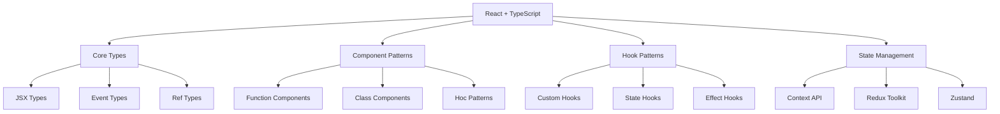

# React + TypeScript 生态集成

## 🎯 React TypeScript 生态概览

### 📊 生态架构图



## 🏗️ React 类型系统基础

### 🎪 JSX 与组件类型

```typescript
// 1. 基础组件类型定义
import React, { ReactElement, ReactNode, ComponentType } from 'react';

// Function Component 类型
interface ButtonProps {
    children: ReactNode;
    onClick?: () => void;
    variant?: 'primary' | 'secondary' | 'danger';
    disabled?: boolean;
}

declare function Button(props: ButtonProps): ReactElement;

// 或者使用 React.FC (Function Component)
const Button: React.FC<ButtonProps> = ({ 
    children, 
    onClick, 
    variant = 'primary',
    disabled = false 
}) => {
    return (
        <button 
            className={`btn btn-${variant}`}
            onClick={onClick}
            disabled={disabled}
        >
            {children}
        </button>
    );
};

// 2. 泛型组件
interface ListProps<T> {
    items: T[];
    renderItem: (item: T, index: number) => ReactNode;
    emptyMessage?: string;
}

function List<T extends { id: string }>({ 
    items, 
    renderItem, 
    emptyMessage = "No items found" 
}: ListProps<T>): ReactElement {
    if (items.length === 0) {
        return <div className="empty-state">{emptyMessage}</div>;
    }
    
    return (
        <ul className="list">
            {items.map((item, index) => (
                <li key={item.id}>
                    {renderItem(item, index)}
                </li>
            ))}
        </ul>
    );
}

// 使用泛型组件
interface User {
    id: string;
    name: string;
    email: string;
}

const users: User[] = [
    { id: '1', name: 'Alice', email: 'alice@example.com' },
    { id: '2', name: 'Bob', email: 'bob@example.com' }
];

// TypeScript 自动推断 T 为 User
<List
    items={users}
    renderItem={(user) => <span>{user.name}</span>}
/>
```

### 🔗 Props 与状态类型

```typescript
// 1. Props 类型设计最佳实践
interface ComponentProps {
    // 必需属性
    title: string;
    isVisible: boolean;
    
    // 可选属性
    subtitle?: string;
    onAction?: (action: string) => void;
    
    // 组件子元素
    children: ReactNode;
    
    // 事件处理器
    onMount?: () => void;
    onUnmount?: () => void;
    
    // 样式相关
    className?: string;
    style?: React.CSSProperties;
}

// 2. 状态类型定义
interface CounterState {
    count: number;
    isRunning: boolean;
    lastUpdated: Date;
}

// 状态更新类型
type CounterAction = 
    | { type: 'increment' }
    | { type: 'decrement' }
    | { type: 'reset' }
    | { type: 'set'; payload: number }
    | { type: 'toggle' };

function counterReducer(state: CounterState, action: CounterAction): CounterState {
    switch (action.type) {
        case 'increment':
            return { ...state, count: state.count + 1, lastUpdated: new Date() };
        case 'decrement':
            return { ...state, count: state.count - 1, lastUpdated: new Date() };
        case 'reset':
            return { ...state, count: 0, lastUpdated: new Date() };
        case 'set':
            return { ...state, count: action.payload, lastUpdated: new Date() };
        case 'toggle':
            return { ...state, isRunning: !state.isRunning, lastUpdated: new Date() };
        default:
            return state;
    }
}

// 使用 useReducer
const CounterComponent: React.FC = () => {
    const [state, dispatch] = React.useReducer(counterReducer, {
        count: 0,
        isRunning: false,
        lastUpdated: new Date()
    });
    
    return (
        <div>
            <p>Count: {state.count}</p>
            <button onClick={() => dispatch({ type: 'increment' })}>+</button>
            <button onClick={() => dispatch({ type: 'decrement' })}>-</button>
            <button onClick={() => dispatch({ type: 'reset' })}>Reset</button>
            <button onClick={() => dispatch({ type: 'toggle' })}>
                {this.state.isRunning ? 'Stop' : 'Start'}
            </button>
        </div>
    );
};
```

## 🎭 React Hooks 类型化

### 🔧 自定义 Hook 类型安全

```typescript
// 1. useState Hook 类型化
function useCounter(initialValue: number = 0) {
    const [count, setCount] = React.useState<number>(initialValue);
    
    const increment = React.useCallback(() => {
        setCount(prev => prev + 1);
    }, []);
    
    const decrement = React.useCallback(() => {
        setCount(prev => prev - 1);
    }, []);
    
    const reset = React.useCallback(() => {
        setCount(initialValue);
    }, [initialValue]);
    
    return {
        count,
        increment,
        decrement,
        reset
    } as const;  // 使用 const assertion 保证类型稳定
}

// 2. 异步 Hook 类型化
interface AsyncState<T> {
    data: T | null;
    loading: boolean;
    error: Error | null;
}

interface AsyncReturn<T> extends AsyncState<T> {
    execute: (...args: any[]) => Promise<void>;
    reset: () => void;
}

function useAsync<T>(
    asyncFunction: (...args: any[]) => Promise<T>,
    immediate: boolean = false
): AsyncReturn<T> {
    const [state, setState] = React.useState<AsyncState<T>>({
        data: null,
        loading: immediate,
        error: null
    });
    
    const execute = React.useCallback(async (...args: any[]) => {
        setState(prev => ({ ...prev, loading: true, error: null }));
        
        try {
            const data = await asyncFunction(...args);
            setState({ data, loading: false, error: null });
        } catch (error) {
            setState({ 
                data: null, 
                loading: false, 
                error: error instanceof Error ? error : new Error('Unknown error')
            });
        }
    }, [asyncFunction]);
    
    const reset = React.useCallback(() => {
        setState({ data: null, loading: false, error: null });
    }, []);
    
    React.useEffect(() => {
        if (immediate) {
            execute();
        }
    }, [execute, immediate]);
    
    return { ...state, execute, reset };
}

// 3. 本地存储 Hook
function useLocalStorage<T>(
    key: string,
    initialValue: T
): [T, (value: T | ((prevValue: T) => T)) => void] {
    // 获取初始值
    const [storedValue, setStoredValue] = React.useState<T>(() => {
        try {
            const item = window.localStorage.getItem(key);
            return item ? JSON.parse(item) : initialValue;
        } catch (error) {
            console.error(`Error reading localStorage key "${key}":`, error);
            return initialValue;
        }
    });
    
    // 更新函数
    const setValue = React.useCallback((value: T | ((prevValue: T) => T)) => {
        try {
            // 允许函数形式的值，用于基于前一个值的更新
            const valueToStore = value instanceof Function ? value(storedValue) : value;
            setStoredValue(valueToStore);
            window.localStorage.setItem(key, JSON.stringify(valueToStore));
        } catch (error) {
            console.error(`Error setting localStorage key "${key}":`, error);
        }
    }, [key, storedValue]);
    
    return [storedValue, setValue];
}

// 4. 使用示例
function SettingsComponent(): ReactElement {
    const [theme, setTheme] = useLocalStorage<'light' | 'dark'>('theme', 'light');
    const [language, setLanguage] = useLocalStorage<string>('language', 'en');
    
    const { data: userSettings, loading, error, execute: loadSettings } = useAsync<UserSettings>(
        () => fetchUserSettings(userId),
        true
    );
    
    if (loading) return <div>Loading...</div>;
    if (error) return <div>Error: {error.message}</div>;
    
    return (
        <div>
            <h1>Settings</h1>
            <select value={theme} onChange={(e) => setTheme(e.target.value as 'light' | 'dark')}>
                <option value="light">Light</option>
                <option value="dark">Dark</option>
            </select>
            <select value={language} onChange={(e) => setLanguage(e.target.value)}>
                <option value="en">English</option>
                <option value="zh">中文</option>
            </select>
        </div>
    );
}
```

### 🎯 复杂 Hook 模式

```typescript
// 1. 表单管理 Hook
interface FormField<T> {
    value: T;
    error?: string;
    touched: boolean;
}

interface FormReturn<T> {
    values: T;
    errors: Partial<Record<keyof T, string>>;
    touched: Partial<Record<keyof T, boolean>>;
    setValue: <K extends keyof T>(field: K, value: T[K]) => void;
    setError: <K extends keyof T>(field: K, error?: string) => void;
    handleChange: (field: keyof T) => (event: React.ChangeEvent<HTMLInputElement>) => void;
    handleBlur: (field: keyof T) => () => void;
    validate: () => boolean;
    reset: () => void;
    submit: () => void;
}

function useForm<T extends Record<string, any>>(
    initialValues: T,
    validationSchema?: (values: T) => Partial<Record<keyof T, string>>
): FormReturn<T> {
    const [values, setValues] = React.useState<T>(initialValues);
    const [errors, setErrors] = React.useState<Partial<Record<keyof T, string>>>({});
    const [touched, setTouched] = React.useState<Partial<Record<keyof T, boolean>>>({});
    
    const setValue = React.useCallback(<K extends keyof T>(field: K, value: T[K]) => {
        setValues(prev => ({ ...prev, [field]: value }));
        
        // 如果有验证，立即验证该字段
        if (validationSchema) {
            const newValues = { ...values, [field]: value };
            const fieldErrors = validationSchema(newValues);
            setErrors(prev => ({ ...prev, [field]: fieldErrors[field] }));
        }
    }, [values, validationSchema]);
    
    const setError = React.useCallback(<K extends keyof T>(field: K, error?: string) => {
        setErrors(prev => ({ ...prev, [field]: error }));
    }, []);
    
    const handleChange = React.useCallback((field: keyof T) => (event: React.ChangeEvent<HTMLInputElement>) => {
        const value = event.target.value as T[typeof field];
        setValue(field, value);
    }, [setValue]);
    
    const handleBlur = React.useCallback((field: keyof T) => () => {
        setTouched(prev => ({ ...prev, [field]: true }));
    }, []);
    
    const validate = React.useCallback(() => {
        if (!validationSchema) return true;
        
        const newErrors = validationSchema(values);
        setErrors(newErrors);
        setTouched(Object.keys(values).reduce((acc, key) => ({ ...acc, [key]: true }), {}));
        
        return Object.keys(newErrors).length === 0;
    }, [values, validationSchema]);
    
    const reset = React.useCallback(() => {
        setValues(initialValues);
        setErrors({});
        setTouched({});
    }, [initialValues]);
    
    const submit = React.useCallback(() => {
        if (validate()) {
            // 表单提交逻辑
            console.log('Form submitted:', values);
        }
    }, [values, validate]);
    
    return {
        values,
        errors,
        touched,
        setValue,
        setError,
        handleChange,
        handleBlur,
        validate,
        reset,
        submit
    };
}

// 使用示例
interface UserFormData {
    name: string;
    email: string;
    age: number;
}

function UserForm() {
    const validationSchema = (values: UserFormData) => {
        const errors: Partial<Record<keyof UserFormData, string>> = {};
        
        if (!values.name.trim()) {
            errors.name = 'Name is required';
        }
        
        if (!values.email.includes('@')) {
            errors.email = 'Invalid email format';
        }
        
        if (values.age < 18) {
            errors.age = 'Age must be at least 18';
        }
        
        return errors;
    };
    
    const { values, errors, touched, handleChange, handleBlur, submit } = useForm<UserFormData>(
        { name: '', email: '', age: 0 },
        validationSchema
    );
    
    return (
        <form onSubmit={(e) => { e.preventDefault(); submit(); }}>
            <div>
                <label>Name:</label>
                <input
                    type="text"
                    value={values.name}
                    onChange={handleChange('name')}
                    onBlur={handleBlur('name')}
                />
                {touched.name && errors.name && <span className="error">{errors.name}</span>}
            </div>
            
            <div>
                <label>Email:</label>
                <input
                    type="email"
                    value={values.email}
                    onChange={handleChange('email')}
                    onBlur={handleBlur('email')}
                />
                {touched.email && errors.email && <span className="error">{errors.email}</span>}
            </div>
            
            <div>
                <label>Age:</label>
                <input
                    type="number"
                    value={values.age}
                    onChange={handleChange('age')}
                    onBlur={handleBlur('age')}
                />
                {touched.age && errors.age && <span className="error">{errors.age}</span>}
            </div>
            
            <button type="submit">Submit</button>
        </form>
    );
}
```

## 🗃️ 状态管理类型化

### 🔄 Context API 类型化

```typescript
// 1. Context 类型定义
interface AppState {
    user: User | null;
    theme: 'light' | 'dark';
    language: string;
    notifications: Notification[];
}

type AppAction = 
    | { type: 'SET_USER'; payload: User | null }
    | { type: 'SET_THEME'; payload: 'light' | 'dark' }
    | { type: 'SET_LANGUAGE'; payload: string }
    | { type: 'ADD_NOTIFICATION'; payload: Notification }
    | { type: 'REMOVE_NOTIFICATION'; payload: string };

interface AppContextType {
    state: AppState;
    dispatch: React.Dispatch<AppAction>;
    actions: {
        setUser: (user: User | null) => void;
        setTheme: (theme: 'light' | 'dark') => void;
        setLanguage: (language: string) => void;
        addNotification: (notification: Notification) => void;
        removeNotification: (id: string) => void;
    };
}

// 2. Context 创建
const AppContext = React.createContext<AppContextType | null>(null);

// 3. Provider 组件
const AppProvider: React.FC<{ children: React.ReactNode }> = ({ children }) => {
    const initialState: AppState = {
        user: null,
        theme: 'light',
        language: 'en',
        notifications: []
    };
    
    const [state, dispatch] = React.useReducer((state: AppState, action: AppAction): AppState => {
        switch (action.type) {
            case 'SET_USER':
                return { ...state, user: action.payload };
            case 'SET_THEME':
                return { ...state, theme: action.payload };
            case 'SET_LANGUAGE':
                return { ...state, language: action.payload };
            case 'ADD_NOTIFICATION':
                return { ...state, notifications: [...state.notifications, action.payload] };
            case 'REMOVE_NOTIFICATION':
                return { 
                    ...state, 
                    notifications: state.notifications.filter(n => n.id !== action.payload)
                };
            default:
                return state;
        }
    }, initialState);
    
    const actions = React.useMemo(() => ({
        setUser: (user: User | null) => dispatch({ type: 'SET_USER', payload: user }),
        setTheme: (theme: 'light' | 'dark') => dispatch({ type: 'SET_THEME", payload: theme }),
        setLanguage: (language: string) => dispatch({ type: 'SET_LANGUAGE', payload: language }),
        addNotification: (notification: Notification) => 
            dispatch({ type: 'ADD_NOTIFICATION', payload: notification }),
        removeNotification: (id: string) => dispatch({ type: 'REMOVE_NOTIFICATION', payload: id })
    }), []);
    
    const contextValue: AppContextType = {
        state,
        dispatch,
        actions
    };
    
    return (
        <AppContext.Provider value={contextValue}>
            {children}
        </AppContext.Provider>
    );
};

// 4. 自定义 Hook
function useAppContext(): AppContextType {
    const context = React.useContext(AppContext);
    
    if (!context) {
        throw new Error('useAppContext must be used within an AppProvider');
    }
    
    return context;
}

// 5. 使用示例
function Header(): ReactElement {
    const { state, actions } = useAppContext();
    
    return (
        <header className={`header theme-${state.theme}`}>
            <div className="user-info">
                {state.user ? (
                    <span>Welcome, {state.user.name}!</span>
                ) : (
                    <button onClick={() => actions.setUser(mockUser)}>Login</button>
                )}
            </div>
            <div className="controls">
                <button onClick={() => actions.setTheme(state.theme === 'light' ? 'dark' : 'light')}>
                    Toggle Theme
                </button>
                <select value={state.language} onChange={(e) => actions.setLanguage(e.target.value)}>
                    <option value="en">English</option>
                    <option value="zh">中文</option>
                </select>
            </div>
        </header>
    );
}
```

## 📚 React TypeScript 最佳实践

### 🎯 性能优化

```typescript
// 1. React.memo 使用
interface ExpensiveComponentProps {
    data: ComplexData[];
    onItemClick: (item: ComplexData) => void;
}

const ExpensiveComponent = React.memo<ExpensiveComponentProps>(({ 
    data, 
    onItemClick 
}) => {
    return (
        <div>
            {data.map(item => (
                <div key={item.id} onClick={() => onItemClick(item)}>
                    {item.name}
                </div>
            ))}
        </div>
    );
}, (prevProps, nextProps) => {
    // 自定义比较函数
    return prevProps.data.length === nextProps.data.length &&
           prevProps.data.every((item, index) => 
               item.id === nextProps.data[index]?.id
           );
});

// 2. useCallback 和 useMemo
function OptimizedList({ items }: { items: Item[] }) {
    const [searchTerm, setSearchTerm] = React.useState('');
    
    const filteredItems = React.useMemo(() => {
        return items.filter(item => 
            item.name.toLowerCase().includes(searchTerm.toLowerCase())
        );
    }, [items, searchTerm]);
    
    const handleItemClick = React.useCallback((item: Item) => {
        console.log('Clicked:', item.name);
    }, []);
    
    return (
        <div>
            <input 
                value={searchTerm}
                onChange={(e) => setSearchTerm(e.target.value)}
            />
            <ExpensiveComponent data={filteredItems} onItemClick={handleItemClick} />
        </div>
    );
}
```

### 🔗 相关深入学习

- [[02-Vue3-plus-TypeScript最佳实践]] - Vue3 集成对比
- [[02-Hook-Design-Patterns]] - Hook 设计模式
- [[01-Component-Architecture]] - 组件架构设计

---
*💡 React + TypeScript 的结合提供了优秀的开发体验，掌握类型化组件和Hook是提升代码质量的关键*
