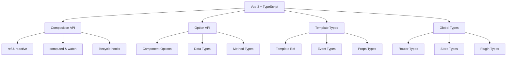

# Vue 3 + TypeScript 最佳实践

## 🎯 Vue 3 TypeScript 生态集成

### 📊 Vue 3 类型系统架构



## 🔧 Composition API 类型化

### 💡 响应式系统类型

```typescript
// 1. ref 类型注解
import { ref, computed, watch, onMounted } from 'vue';

// 基础 ref 类型
const count = ref<number>(0);
const message = ref<string>('');
const user = ref<User | null>(null);

// 复杂对象 ref
interface UserState {
    id: string;
    name: string;
    email: string;
    preferences: UserPreferences;
}

const userState = ref<UserState>({
    id: '',
    name: '',
    email: '',
    preferences: {
        theme: 'light',
        language: 'en'
    }
});

// 2. reactive 类型约束
const state = reactive<{
    loading: boolean;
    error: string | null;
    data: any[];
}>({
    loading: false,
    error: null,
    data: []
});

// 3. 计算属性类型
const doubleCount = computed<number>(() => count.value * 2);
const formattedUser = computed<string>(() => {
    if (user.value) {
        return `${user.value.name} (${user.value.email})`;
    }
    return 'No user';
});

// 复杂计算属性
const filteredUsers = computed<User[]>(() => {
    return users.value.filter(u => u.name.includes(searchTerm.value));
});
```

### 🎭 组件逻辑类型化

```typescript
// 1. 自定义组合函数 (Composable)
interface UseCounterOptions {
    initialValue?: number;
    step?: number;
}

interface UseCounterReturn {
    count: Ref<number>;
    increment: () => void;
    decrement: () => void;
    reset: () => void;
}

function useCounter(options: UseCounterOptions = {}): UseCounterReturn {
    const { initialValue = 0, step = 1 } = options;
    
    const count = ref<number>(initialValue);
    
    const increment = () => {
        count.value += step;
    };
    
    const decrement = () => {
        count.value -= step;
    };
    
    const reset = () => {
        count.value = initialValue;
    };
    
    return {
        count: readonly(count),  // 只读引用
        increment,
        decrement,
        reset
    };
}

// 2. API 状态管理组合函数
interface UseAsyncStateOptions {
    immediate?: boolean;
    resetOnExecute?: boolean;
}

function useAsyncState<T>(
    asyncFunction: (...args: any[]) => Promise<T>,
    initialState: T | null = null,
    options: UseAsyncStateOptions = {}
) {
    const { immediate = false, resetOnExecute = false } = options;
    
    const state = ref<T | null>(initialState);
    const loading = ref<boolean>(false);
    const error = ref<Error | null>(null);
    
    const execute = async (...args: any[]): Promise<T | null> => {
        if (resetOnExecute) {
            state.value = initialState;
            error.value = null;
        }
        
        loading.value = true;
        
        try {
            const result = await asyncFunction(...args);
            state.value = result;
            error.value = null;
            return result;
        } catch (err) {
            error.value = err instanceof Error ? err : new Error('Unknown error');
            state.value = initialState;
            return null;
        } finally {
            loading.value = false;
        }
    };
    
    if (immediate) {
        execute();
    }
    
    return {
        state: readonly(state),
        loading: readonly(loading),
        error: readonly(error),
        execute
    };
}

// 使用示例
const { state: user, loading, error, execute: fetchUser } = useAsyncState(
    async (id: string) => {
        const response = await fetch(`/api/users/${id}`);
        return response.json();
    },
    null,
    { resetOnExecute: true }
);
```

## 🎪 Option API 类型安全

### 🏗️ Class 组件类型

```typescript
import { Vue, Component, Prop, Watch } from 'vue-property-decorator';

// 1. Props 类型定义
@Component
export default class UserProfile extends Vue {
    @Prop({ required: true })
    userId!: string;
    
    @Prop({ type: String, default: 'en' })
    language!: string;
    
    @Prop({ validator: (value: string) => ['light', 'dark'].includes(value) })
    theme!: 'light' | 'dark';
    
    // 2. Data 类型
    user: User | null = null;
    loading = false;
    error: string | null = null;
    
    // 3. Computed 属性类型
    get formattedUserName(): string {
        if (!this.user) return '';
        return `${this.user.firstName} ${this.user.lastName}`;
    }
    
    get isAdmin(): boolean {
        return this.user?.role === 'admin';
    }
    
    // 4. Methods 类型
    async loadUser(): Promise<void> {
        this.loading = true;
        this.error = null;
        
        try {
            // API 调用逻辑
            const response = await this.$http.get(`/api/users/${this.userId}`);
            this.user = response.data;
        } catch (err) {
            this.error = err instanceof Error ? err.message : 'Unknown error';
        } finally {
            this.loading = false;
        }
    }
    
    updateUser(userData: Partial<User>): void {
        if (this.user) {
            Object.assign(this.user, userData);
        }
    }
    
    // 5. Watch 类型注解
    @Watch('userId')
    onUserIdChange(newId: string, oldId: string): void {
        if (newId !== oldId) {
            this.loadUser();
        }
    }
    
    @Watch('theme', { immediate: true })
    onThemeChange(newTheme: 'light' | 'dark'): void {
        document.documentElement.setAttribute('data-theme', newTheme);
    }
    
    // 6. 生命周期钩子类型
    created(): void {
        console.log('Component created with userId:', this.userId);
    }
    
    mounted(): void {
        this.loadUser();
    }
    
    beforeUnmount(): void {
        // 清理逻辑
        this.error = null;
    }
}
```

### 🔍 Mixins 和插件类型

```typescript
// 1. Mixin 类型定义
import { Vue, Component, VueConstructor } from 'vue';

interface ApiMethods {
    $api: {
        get: <T>(url: string) => Promise<T>;
        post: <T>(url: string, data: any) => Promise<T>;
        put: <T>(url: string, data: any) => Promise<T>;
        delete: (url: string) => Promise<void>;
    };
}

const ApiMixin = Vue.extend({
    data() {
        return {
            loading: false,
            error: null as string | null
        };
    },
    
    methods: {
        async apiRequest<T>(
            requestFn: () => Promise<T>
        ): Promise<T | null> {
            this.loading = true;
            this.error = null;
            
            try {
                const result = await requestFn();
                return result;
            } catch (error) {
                this.error = error instanceof Error ? error.message : 'Unknown error';
                return null;
            } finally {
                this.loading = false;
            }
        }
    }
});

// 2. 插件类型声明
declare module '@vue/runtime-core' {
    interface ComponentCustomProperties {
        $api: ApiMethods['$api'];
        $toast: (message: string) => void;
    }
}

// 插件实现
const ApiPlugin = {
    install(app: App) {
        const api = {
            async get<T>(url: string): Promise<T> {
                const response = await fetch(url);
                return response.json();
            },
            
            async post<T>(url: string, data: any): Promise<T> {
                const response = await fetch(url, {
                    method: 'POST',
                    headers: { 'Content-Type': 'application/json' },
                    body: JSON.stringify(data)
                });
                return response.json();
            },
            
            async put<T>(url: string, data: any): Promise<T> {
                const response = await fetch(url, {
                    method: 'PUT',
                    headers: { 'Content-Type': 'application/json' },
                    body: JSON.stringify(data)
                });
                return response.json();
            },
            
            async delete(url: string): Promise<void> {
                await fetch(url, { method: 'DELETE' });
            }
        };
        
        app.config.globalProperties.$api = api;
        
        app.config.globalProperties.$toast = (message: string) => {
            // Toast 实现
            console.log('Toast:', message);
        };
    }
};
```

## 🚀 模板类型安全

### 🎯 Template Refs 类型

```typescript
// 1. 模板引用类型
<template>
  <div>
    <input ref="inputRef" v-model="message" />
    <button ref="buttonRef" @click="handleSubmit">
      Submit
    </button>
    <div ref="containerRef" class="container">
      {{ userDisplay }}
    </div>
  </div>
</template>

<script setup lang="ts">
import { ref, onMounted } from 'vue';

const inputRef = ref<HTMLInputElement | null>(null);
const buttonRef = ref<HTMLButtonElement | null>(null);
const containerRef = ref<HTMLDivElement | null>(null);

const message = ref('');

onMounted(() => {
    // TypeScript 现在知道这些元素的类型
    inputRef.value?.focus();
    buttonRef.value?.addEventListener('click', () => {
        console.log('Button clicked');
    });
    containerRef.value?.scrollIntoView();
});

// 2. 组件引用类型
const childComponentRef = ref<InstanceType<typeof ChildComponent> | null>(null);

onMounted(() => {
    if (childComponentRef.value) {
        // 调用子组件方法
        childComponentRef.value.resetForm();
    }
});
</script>
```

### 🎪 事件类型处理

```typescript
// 1. 自定义事件类型
interface UserFormData {
    name: string;
    email: string;
    age: number;
}

// 组件定义
defineEmits<{
    submit: [data: UserFormData];
    cancel: [];
    error: [message: string];
}>();

const emit = defineEmits<{
    submit: [data: UserFormData];
    cancel: [];
    error: [message: string];
}>();

function handleSubmit(formData: UserFormData) {
    // 验证数据
    if (!formData.name.trim()) {
        emit('error', 'Name is required');
        return;
    }
    
    if (!/^[^\s@]+@[^\s@]+\.[^\s@]+$/.test(formData.email)) {
        emit('error', 'Invalid email format');
        return;
    }
    
    emit('submit', formData);
}

// 2. 原生事件类型
function handleInputChange(event: Event) {
    const target = event.target as HTMLInputElement;
    const value = target.value;
    message.value = value;
}

function handleKeyDown(event: KeyboardEvent) {
    if (event.key === 'Enter') {
        handleSubmit(createFormData());
    }
}

function createFormData(): UserFormData {
    // 从表单创建数据
    return {
        name: '',
        email: '',
        age: 0
    };
}
```

## 📚 进阶模式与实践

### 🔄 状态管理集成

```typescript
// 1. Pinia Store 类型化
import { defineStore } from 'pinia';

interface UserState {
    currentUser: User | null;
    users: User[];
    loading: boolean;
    error: string | null;
}

interface UserActions {
    setCurrentUser(user: User | null): void;
    addUser(user: User): void;
    removeUser(userId: string): void;
    updateUser(userId: string, updates: Partial<User>): void;
}

interface UserGetters {
    getUserCount: () => number;
    getUserById: (id: string) => User | undefined;
    isCurrentUserAdmin: () => boolean;
}

export const useUserStore = defineStore('user', {
    state: (): UserState => ({
        currentUser: null,
        users: [],
        loading: false,
        error: null
    }),
    
    getters: {
        getUserCount: (state) => state.users.length,
        
        getUserById: (state) => (id: string) => 
            state.users.find(user => user.id === id),
        
        isCurrentUserAdmin: (state) => 
            state.currentUser?.role === 'admin'
    },
    
    actions: {
        setCurrentUser(user: User | null) {
            this.currentUser = user;
        },
        
        addUser(user: User) {
            this.users.push(user);
        },
        
        removeUser(userId: string) {
            this.users = this.users.filter(user => user.id !== userId);
        },
        
        updateUser(userId: string, updates: Partial<User>) {
            const index = this.users.findIndex(user => user.id === userId);
            if (index !== -1) {
                this.users[index] = { ...this.users(index], ...updates };
            }
        },
        
        async fetchUsers() {
            this.loading = true;
            this.error = null;
            
            try {
                const users = await this.$api.get<User[]>('/api/users');
                this.users = users;
            } catch (error) {
                this.error = error instanceof Error ? error.message : 'Unknown error';
            } finally {
                this.loading = false;
            }
        }
    }
});

// 2. Composition API 中使用 Store
function useUserManagement() {
    const userStore = useUserStore();
    
    const fetchUsers = () => userStore.fetchUsers();
    const addUser = (user: User) => userStore.addUser(user);
    
    const usersCount = computed(() => userStore.getUserCount);
    const isAdmin = computed(() => userStore.isCurrentUserAdmin);
    
    return {
        users: computed(() => userStore.users),
        loading: computed(() => userStore.loading),
        error: computed(() => userStore.error),
        usersCount,
        isAdmin,
        fetchUsers,
        addUser
    };
}
```

### 🎯 性能优化技巧

```typescript
// 1. 组件懒加载类型
const AsyncComponent = defineAsyncComponent({
    loader: () => import('./HeavyComponent.vue'),
    loadingComponent: LoadingComponent,
    errorComponent: ErrorComponent,
    delay: 200,
    timeout: 3000
});

// 2. KeepAlive 组件类型
interface KeepAliveCache extends Map<string, VNode> {
    get(key: string): VNode | undefined;
    set(key: string, value: VNode): this;
}

const cache = ref<KeepAliveCache>(new Map());

// 3. 事件修饰符类型
function handleKeyUpWithModifiers(event: KeyboardEvent) {
    if (event.altKey && event.key === 'Enter') {
        // Alt + Enter pressed
        handleSubmit();
    }
}

// 4. 防抖和节流组合函数
function useDebouncedRef<T>(value: T, delay: number = 300) {
    const debouncedValue = ref<T>(value);
    let timeoutId: number | null = null;
    
    const updateValue = (newValue: T) => {
        if (timeoutId) {
            clearTimeout(timeoutId);
        }
        
        timeoutId = setTimeout(() => {
            debouncedValue.value = newValue;
        }, delay);
    };
    
    const originalValue = ref<T>(value);
    
    watch(originalValue, (newValue) => {
        updateValue(newValue);
    });
    
    return {
        value: originalValue,
        debouncedValue: readonly(debouncedValue)
    };
}
```

## 🎪 Vue 3 TypeScript 最佳实践

### 📋 项目配置

```json
// tsconfig.json
{
  "compilerOptions": {
    "target": "ES2020",
    "module": "ESNext",
    "lib": ["ES2020", "DOM", "DOM.Iterable"],
    "allowJs": false,
    "skipLibCheck": true,
    "esModuleInterop": true,
    "allowSyntheticDefaultImports": true,
    "strict": true,
    "forceConsistentSacing": true,
    "moduleResolution": "node",
    "resolveJsonModule": true,
    "isolatedModules": true,
    "noEmit": true,
    "jsx": "preserve",
    "types": ["vite/client"]
  },
  "include": ["src/**/*.ts", "src/**/*.vue"],
  "references": [{ "path": "./tsconfig.node.json" }]
}
```

### 🔗 类型声明文件

```typescript
// types/vue-shim.d.ts
declare module '*.vue' {
    import type { DefineComponent } from 'vue';
    const component: DefineComponent<{}, {}, any>;
    export default component;
}

// types/global.d.ts
declare global {
    interface Window {
        __APP_VERSION__: string;
        __API_BASE_URL__: string;
    }
}

// types/modules.d.ts
declare module '@/utils/format' {
    export function formatDate(date: Date): string;
    export function formatCurrency(amount: number): string;
}
```

### 🔗 相关深入学习

- [[01-React-plus-TypeScript生态]] - React 集成对比
- [[03-Node-js-plus-TypeScript全栈开发]] - 全栈开发实践
- [[01-Component-Architecture]] - 组件架构设计

---
*💡 Vue 3 + TypeScript 的组合提供了优秀的开发体验，Composition API 的类型支持特别强大，掌握这些技巧能大大提高代码质量*
