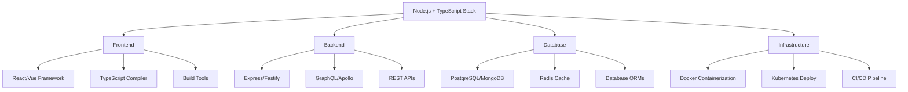

# TypeScript Node.js 全栈开发

## 🎯 Node.js + TypeScript 生态系统

### 📊 全栈架构概览



## 🔧 后端 TypeScript 开发

### 💡 Express 全栈应用

```typescript
// 1. 应用配置设置
// config/database.ts
interface DatabaseConfig {
    host: string;
    port: number;
    username: string;
    password: string;
    database: string;
    ssl?: boolean;
    pool?: {
        min: number;
        max: number;
        idleTimeoutMillis: number;
    };
}

const dbConfig: DatabaseConfig = {
    host: process.env.DB_HOST || 'localhost',
    port: parseInt(process.env.DB_PORT || '5432'),
    username: process.env.DB_USER || 'postgres',
    password: process.env.DB_PASSWORD || '',
    database: process.env.DB_NAME || 'myapp',
    ssl: process.env.NODE_ENV === 'production',
    pool: {
        min: 2,
        max: 20,
        idleTimeoutMillis: 30000
    }
};

export { dbConfig };

// 2. Express 应用服务器设置
// server/app.ts
import express, { Application, Request, Response, NextFunction } from 'express';
import cors from 'cors';
import helmet from 'helmet';
import compression from 'compression';
import rateLimit from 'express-rate-limit';

interface CustomRequest extends Request {
    requestId?: string;
    user?: AuthenticatedUser;
}

interface AuthenticatedUser {
    id: string;
    email: string;
    role: 'admin' | 'user' | 'guest';
    permissions: string[];
}

class AppServer {
    private app: Application;
    private port: number;
    
    constructor() {
        this.app = express();
        this.port = parseInt(process.env.PORT || '3000');
        this.setupMiddleware();
        this.setupRoutes();
        this.setupErrorHandling();
    }
    
    private setupMiddleware(): void {
        // Security middleware
        this.app.use(helmet());
        
        // CORS configuration
        this.app.use(cors({
            origin: process.env.FRONTEND_URL || 'http://localhost:3001',
            credentials: true
        }));
        
        // Compression
        this.app.use(compression());
        
        // Rate limiting
        const limiter = rateLimit({
            windowMs: 15 * 60 * 1000, // 15 minutes
            max: 100, // limit each IP to 100 requests per windowMs
            message: 'Too many requests from this IP'
        });
        this.app.use('/api', limiter);
        
        // Body parsing
        this.app.use(express.json({ limit: '10mb' }));
        this.app.use(express.urlencoded({ extended: true }));
        
        // Request logging middleware
        this.app.use((req: CustomRequest, res: Response, next: NextFunction) => {
            req.requestId = crypto.randomUUID();
            console.log(`[${req.requestId}] ${req.method} ${req.path}`);
            next();
        });
    }
    
    private setupRoutes(): void {
        // Health check endpoint
        this.app.get('/health', (req: Request, res: Response) => {
            res.json({
                status: 'ok',
                timestamp: new Date().toISOString(),
                uptime: process.uptime(),
                environment: process.env.NODE_ENV
            });
        });
        
        // API routes
        this.app.use('/api/auth', require('./routes/auth'));
        this.app.use('/api/users', require('./routes/users'));
        this.app.use('/api/products', require('./routes/products'));
    }
    
    private setupErrorHandling(): void {
        // 404 handler
        this.app.use((req: Request, res: Response) => {
            res.status(404).json({
                error: 'Route not found',
                message: `${req.method} ${req.path} not found`
            });
        });
        
        // Global error handler
        this.app.use((err: Error, req: CustomRequest, res: Response, next: NextFunction) => {
            console.error(`[${req.requestId}] Error:`, err.stack);
            
            res.status(500).json({
                error: 'Internal Server Error',
                requestId: req.requestId,
                timestamp: new Date().toISOString()
            });
        });
    }
    
    async start(): Promise<void> {
        try {
            // Database connection
            await this.connectDatabase();
            
            this.app.listen(this.port, () => {
                console.log(`🚀 Server running on port ${this.port}`);
                console.log(`📊 Environment: ${process.env.NODE_ENV}`);
            });
        } catch (error) {
            console.error('Failed to start server:', error);
            process.exit(1);
        }
    }
    
    private async connectDatabase(): Promise<void> {
        // Database connection logic
        console.log('🔗 Connecting to database...');
    }
}

export default AppServer;

// 3. 路由控制器示例
// routes/users.ts
import { Router, Request, Response } from 'express';
import { UserService } from '../services/UserService';
import { authMiddleware } from '../middleware/auth';
import { validationMiddleware } from '../middleware/validation';
import { CreateUserSchema, UpdateUserSchema } from '../schemas/user';

const router = Router();
const userService = new UserService();

// GET /users
router.get('/', authMiddleware(), async (req: Request, res: Response) => {
    try {
        const { page = 1, limit = 10, search } = req.query;
        
        const users = await userService.getUsers({
            page: Number(page),
            limit: Number(limit),
            search: search as string
        });
        
        res.json(users);
    } catch (error) {
        res.status(500).json({
            error: 'Failed to fetch users',
            details: error instanceof Error ? error.message : 'Unknown error'
        });
    }
});

// GET /users/:id
router.get('/:id', authMiddleware(), async (req: Request, res: Response) => {
    try {
        const { id } = req.params;
        const user = await userService.getUserById(id);
        
        if (!user) {
            return res.status(404).json({
                error: 'User not found'
            });
        }
        
        res.json(user);
    } catch (error) {
        res.status(500).json({
            error: 'Failed to fetch user',
            details: error instanceof Error ? error.message : 'Unknown error'
        });
    }
});

// POST /users
router.post('/', 
    authMiddleware(['admin']),
    validationMiddleware(CreateUserSchema),
    async (req: Request, res: Response) => {
        try {
            const userData = req.body;
            const user = await userService.createUser(userData);
            
            res.status(201).json(user);
        } catch (error) {
            res.status(400).json({
                error: 'Failed to create user',
                details: error instanceof Error ? error.message : 'Unknown error'
            });
        }
    }
);

export default router;
```

### 🎪 服务层架构

```typescript
// services/UserService.ts
import { UserRepository } from '../repositories/UserRepository';
import { EmailService } from './EmailService';
import { CacheService } from './CacheService';

export interface User {
    id: string;
    email: string;
    firstName: string;
    lastName: string;
    role: 'admin' | 'user';
    createdAt: Date;
    updatedAt: Date;
    isActive: boolean;
}

export interface CreateUserRequest {
    email: string;
    firstName: string;
    lastName: string;
    password: string;
    role?: 'admin' | 'user';
}

export interface UpdateUserRequest {
    firstName?: string;
    lastName?: string;
    isActive?: boolean;
}

export interface UserListOptions {
    page: number;
    limit: number;
    search?: string;
    role?: string;
}

export interface UserListResult {
    users: User[];
    pagination: {
        page: number;
        limit: number;
        total: number;
        pages: number;
    };
}

export class UserService {
    constructor(
        private userRepository: UserRepository = new UserRepository(),
        private emailService: EmailService = new EmailService(),
        private cacheService: CacheService = new CacheService()
    ) {}
    
    async getUserById(id: string): Promise<User | null> {
        // Check cache first
        const cacheKey = `user:${id}`;
        const cachedUser = await this.cacheService.get<User>(cacheKey);
        
        if (cachedUser) {
            return cachedUser;
        }
        
        // Fetch from database
        const user = await this.userRepository.findById(id);
        
        if (user) {
            // Cache for 5 minutes
            await this.cacheService.set(cacheKey, user, 300);
        }
        
        return user;
    }
    
    async getUsers(options: UserListOptions): Promise<UserListResult> {
        const cacheKey = `users:${JSON.stringify(options)}`;
        const cached = await this.cacheService.get<UserListResult>(cacheKey);
        
        if (cached) {
            return cached;
        }
        
        const result = await this.userRepository.findPaginated(options);
        
        // Cache for 2 minutes
        await this.cacheService.set(cacheKey, result, 120);
        
        return result;
    }
    
    async createUser(userData: CreateUserRequest): Promise<User> {
        // Validate email uniqueness
        const existingUser = await this.userRepository.findByEmail(emailData.email);
        if (existingUser) {
            throw new Error('Email already exists');
        }
        
        // Hash password
        const hashedPassword = await this.hashPassword(userData.password);
        
        // Create user
        const newUser = await this.userRepository.create({
            ...userData,
            password: hashedPassword,
            role: userData.role || 'user',
            isActive: true
        });
        
        // Send welcome email
        await this.emailService.sendWelcomeEmail(newUser);
        
        // Invalidate user list cache
        await this.cacheService.deletePattern('users:*');
        
        return newUser;
    }
    
    async updateUser(id: string, userData: UpdateUserRequest): Promise<User> {
        const user = await this.userRepository.findById(id);
        if (!user) {
            throw new Error('User not found');
        }
        
        const updatedUser = await this.userRepository.update(id, userData);
        
        // Update cache
        await this.cacheService.delete(`user:${id}`);
        await this.cacheService.deletePattern('users:*');
        
        return updatedUser;
    }
    
    async deleteUser(id: string): Promise<void> {
        const user = await this.userRepository.findById(id);
        if (!user) {
            throw new Error('User not found');
        }
        
        await this.userRepository.delete(id);
        
        // Clean up cache
        await this.cacheService.delete(`user:${id}`);
        await this.cacheService.deletePattern('users:*');
    }
    
    private async hashPassword(password: string): Promise<string> {
        const bcrypt = await import('bcrypt');
        const saltRounds = 12;
        return bcrypt.hash(password, saltRounds);
    }
}

// repositories/UserRepository.ts
import { Pool } from 'pg';
import { User } from '../services/UserService';
import { Database } from '../config/database';

export class UserRepository {
    private pool: Pool;
    
    constructor() {
        this.pool = new Pool(Database.config);
    }
    
    async findById(id: string): Promise<User | null> {
        const query = `
            SELECT id, email, first_name, last_name, role, created_at, updated_at, is_active
            FROM users 
            WHERE id = $1
        `;
        
        const result = await this.pool.query(query, [id]);
        return result.rows[0] || null;
    }
    
    async findByEmail(email: string): Promise<User | null> {
        const query = `
            SELECT id, email, first_name, last_name, role, created_at, updated_at, is_active
            FROM users 
            WHERE email = $1
        `;
        
        const result = await this.pool.query(query, [email]);
        return result.rows[0] || null;
    }
    
    async findPaginated(options: GetUserListOptions): Promise<UserListResult> {
        const { page, limit, search, role } = options;
        const offset = (page - 1) * limit;
        
        // Build WHERE clause dynamically
        const whereConditions: string[] = [];
        const queryParams: any[] = [];
        
        if (search) {
            whereConditions.push(`(first_name ILIKE $${queryParams.length + 1} OR last_name ILIKE $${queryParams.length + 1} OR email ILIKE $${queryParams.length + 1})`);
            queryParams.push(`%${search}%`);
        }
        
        if (role) {
            whereConditions.push(`role = $${queryParams.length + 1}`);
            queryParams.push(role);
        }
        
        const whereClause = whereConditions.length > 0 ? `WHERE ${whereConditions.join(' AND ')}` : '';
        
        // Get total count
        const countQuery = `SELECT COUNT(*) FROM users ${whereClause}`;
        const countResult = await this.pool.query(countQuery, queryParams);
        const total = parseInt(countResult.rows[0].count);
        
        // Get paginated results
        const dataQuery = `
            SELECT id, email, first_name, last_name, role, created_at, updated_at, is_active
            FROM users 
            ${whereClause}
            ORDER BY created_at DESC
            LIMIT $${queryParams.length + 1} OFFSET $${queryParams.length + 2}
        `;
        
        queryParams.push(limit, offset);
        const dataResult = await this.pool.query(dataQuery, queryParams);
        
        return {
            users: dataResult.rows,
            pagination: {
                page,
                limit,
                total,
                pages: Math.ceil(total / limit)
            }
        };
    }
    
    async create(userData: CreateUserData): Promise<User> {
        const query = `
            INSERT INTO users (id, email, first_name, last_name, password_hash, role, is_active)
            VALUES ($1, $2, $3, $4, $5, $6, $7)
            RETURNING id, email, first_name, last_name, role, created_at, updated_at, is_active
        `;
        
        const values = [
            crypto.randomUUID(),
            userData.email,
            userData.firstName,
            userData.lastName,
            userData.password,
            userData.role,
            userData.isActive
        ];
        
        const result = await this.pool.query(query, values);
        return result.rows[0];
    }
    
    async update(id: string, userData: UpdateUserData): Promise<User> {
        const fields = Object.keys(userData).map((key, index) => 
            `${key} = $${index + 2}`
        ).join(', ');
        
        const query = `
            UPDATE users 
            SET ${fields}, updated_at = NOW()
            WHERE id = $1
            RETURNING id, email, first_name, last_name, role, created_at, updated_at, is_active
        `;
        
        const values = [id, ...Object.values(userData)];
        const result = await this.pool.query(query, values);
        
        if (result.rows.length === 0) {
            throw new Error('User not found');
        }
        
        return result.rows[0];
    }
    
    async delete(id: string): Promise<void> {
        const query = 'DELETE FROM users WHERE id = $1';
        const result = await this.pool.query(query, [id]);
        
        if (result.rowCount === 0) {
            throw new Error('User not found');
        }
    }
}
```

## 🚀 数据库与缓存层

### 🔄 ORM 与数据库集成

```typescript
// config/database.ts
import { Pool } from 'pg';
import Redis from 'ioredis';

export interface DatabaseConfig {
    user: string;
    host: string;
    database: string;
    password: string;
    port: number;
    ssl?: boolean;
    max?: number;
    idleTimeoutMillis?: number;
    connectionTimeoutMillis?: number;
}

class Database {
    private static instance: Database;
    private pool: Pool;
    private redis: Redis;
    
    constructor() {
        this.pool = new Pool({
            user: process.env.DB_USER!,
            host: process.env.DB_HOST!,
            database: process.env.DB_NAME!,
            password: process.env.DB_PASSWORD!,
            port: parseInt(process.env.DB_PORT || '5432'),
            ssl: process.env.NODE_ENV === 'production' ? { rejectUnauthorized: false } : false,
            max: 20,
            idleTimeoutMillis: 30000,
            connectionTimeoutMillis: 2000,
        });
        
        this.redis = new Redis({
            host: process.env.REDIS_HOST || 'localhost',
            port: parseInt(process.env.REDIS_PORT || '6379'),
            password: process.env.REDIS_PASSWORD,
            retryDelayOnFailover: 100,
            enableReadyCheck: true,
            maxRetriesPerRequest: 3,
        });
        
        this.setupEventHandlers();
    }
    
    static getInstance(): Database {
        if (!Database.instance) {
            Database.instance = new Database();
        }
        return Database.instance;
    }
    
    private setupEventHandlers(): void {
        this.pool.on('error', (err) => {
            console.error('Unexpected error on idle client', err);
        });
        
        this.redis.on('error', (err) => {
            console.error('Redis connection error:', err);
        });
        
        this.redis.on('connect', () => {
            console.log('Connected to Redis');
        });
    }
    
    getPool(): Pool {
        return this.pool;
    }
    
    getRedis(): Redis {
        return this.redis;
    }
    
    async query<T = any>(text: string, params?: any[]): Promise<{ rows: T[]; rowCount: number }> {
        const start = Date.now();
        const res = await this.pool.query(text, params);
        const duration = Date.now() - start;
        
        console.log('Query executed:', { text, duration, rows: res.rowCount });
        return res;
    }
    
    async healthCheck(): Promise<{ postgres: boolean; redis: boolean }> {
        let postgres = false;
        let redis = false;
        
        try {
            await this.pool.query('SELECT 1');
            postgres = true;
        } catch (error) {
            console.error('PostgreSQL health check failed:', error);
        }
        
        try {
            await this.redis.ping();
            redis = true;
        } catch (error) {
            console.error('Redis health check failed:', error);
        }
        
        return { postgres, redis };
    }
    
    async close(): Promise<void> {
        await this.pool.end();
        this.redis.quit();
    }
}

export default Database.getInstance();
```

### 🎯 缓存服务实现

```typescript
// services/CacheService.ts
import Redis from 'ioredis';

interface CacheOptions {
    ttl?: number; // Time to live in seconds
    serialize?: boolean;
}

export class CacheService {
    private redis: Redis;
    
    constructor() {
        this.redis = new Redis({
            host: process.env.REDIS_HOST || 'localhost',
            port: parseInt(process.env.REDIS_PORT || '6379'),
            password: process.env.REDIS_PASSWORD,
            maxRetriesPerRequest: 3,
            lazyConnect: true,
        });
    }
    
    async get<T>(key: string): Promise<T | null> {
        try {
            const value = await this.redis.get(key);
            if (!value) return null;
            
            return JSON.parse(value) as T;
        } catch (error) {
            console.error('Cache get error:', error);
            return null;
        }
    }
    
    async set<T>(key: string, value: T, ttl?: number): Promise<boolean> {
        try {
            const serialized = JSON.stringify(value);
            if (ttl) {
                await this.redis.setex(key, ttl, serialized);
            } else {
                await this.redis.set(key, serialized);
            }
            return true;
        } catch (error) {
            console.error('Cache set error:', error);
            return false;
        }
    }
    
    async delete(key: string): Promise<boolean> {
        try {
            const result = await this.redis.del(key);
            return result > 0;
        } catch (error) {
            console.error('Cache delete error:', error);
            return false;
        }
    }
    
    async deletePattern(pattern: string): Promise<number> {
        try {
            const keys = await this.redis.keys(pattern);
            if (keys.length === 0) return 0;
            
            return await this.redis.del(...keys);
        } catch (error) {
            console.error('Cache delete pattern error:', error);
            return 0;
        }
    }
    
    async exists(key: string): Promise<boolean> {
        try {
            const result = await this.redis.exists(key);
            return result === 1;
        } catch (error) {
            console.error('Cache exists error:', error);
            return false;
        }
    }
    
    async expire(key: string, ttl: number): Promise<boolean> {
        try {
            const result = await this.redis.expire(key, ttl);
            return result === 1;
        } catch (error) {
            console.error('Cache expire error:', error);
            return false;
        }
    }
    
    async incr(key: string, ttl?: number): Promise<number> {
        try {
            const multi = this.redis.multi();
            multi.incr(key);
            if (ttl) {
                multi.expire(key, ttl);
            }
            
            const results = await multi.exec();
            return results?.[0]?.[1] as number || 0;
        } catch (error) {
            console.error('Cache incr error:', error);
            return 0;
        }
    }
    
    // Cache strategies
    async getOrSet<T>(
        key: string, 
        fetcher: () => Promise<T>, 
        ttl?: number
    ): Promise<T> {
        const cached = await this.get<T>(key);
        if (cached !== null) {
            return cached;
        }
        
        const value = await fetcher();
        await this.set(key, value, ttl);
        return value;
    }
    
    async invalidatePattern(pattern: string): Promise<void> {
        await this.deletePattern(pattern);
    }
    
    // Session management
    async setSession(sessionId: string, data: any, ttl: number = 86400): Promise<void> {
        await this.set(`session:${sessionId}`, data, ttl);
    }
    
    async getSession<T>(sessionId: string): Promise<T | null> {
        return await this.get<T>(`session:${sessionId}`);
    }
    
    async deleteSession(sessionId: string): Promise<void> {
        await this.delete(`session:${sessionId}`);
    }
}
```

## 📚 GraphQL 集成开发

### 🔄 Apollo Server 设置

```typescript
// graphql/schema.ts
import { gql } from 'apollo-server-express';
import { GraphQLScalarType } from 'graphql';
import { Kind } from 'graphql/language';

export const typeDefs = gql`
    scalar DateTime
    
    type User {
        id: ID!
        email: String!
        firstName: String!
        lastName: String!
        role: UserRole!
        createdAt: DateTime!
        updatedAt: DateTime!
        posts: [Post!]!
    }
    
    enum UserRole {
        ADMIN
        USER
    }
    
    type Post {
        id: ID!
        title: String!
        content: String!
        author: User!
        createdAt: DateTime!
        updatedAt: DateTime!
    }
    
    input CreateUserInput {
        email: String!
        firstName: String!
        lastName: String!
        password: String!
        role: UserRole
    }
    
    input UpdateUserInput {
        firstName: String
        lastName: String
        isActive: Boolean
    }
    
    type Query {
        user(id: ID!): User
        users(page: Int, limit: Int, search: String): UsersResult!
        posts: [Post!]!
        post(id: ID!): Post
    }
    
    type Mutation {
        createUser(input: CreateUserInput!): User!
        updateUser(id: ID!, input: UpdateUserInput!): User!
        deleteUser(id: ID!): Boolean!
    }
    
    type UsersResult {
        users: [User!]!
        pagination: Pagination!
    }
    
    type Pagination {
        page: Int!
        limit: Int!
        total: Int!
        pages: Int!
    }
`;

// Custom DateTime scalar
export const DateTimeScalar = new GraphQLScalarType({
    name: 'DateTime',
    description: 'Date custom scalar type',
    serialize(value: Date): number {
        if (value instanceof Date) {
            return value.getTime();
        }
        throw new Error('Value is not an instance of Date');
    },
    parseValue(value: number): Date {
        if (typeof value === 'number') {
            return new Date(value);
        }
        throw new Error('Value is not a number');
    },
    parseLiteral(ast) {
        if (ast.kind === Kind.INT) {
            return new Date(parseInt(ast.value, 10));
        }
        return null;
    },
});

// resolvers/user.ts
import { UserService } from '../services/UserService';
import { PostService } from '../services/PostService';

export const userResolvers = {
    DateTime: DateTimeScalar,
    
    Query: {
        user: async (_: any, { id }: { id: string }) => {
            return await UserService.getInstance().getUserById(id);
        },
        
        users: async (_: any, { page = 1, limit = 10, search }: { page: number; limit: number; search?: string }) => {
            return await UserService.getInstance().getUsers({ page, limit, search });
        },
    },
    
    Mutation: {
        createUser: async (_: any, { input }: { input: CreateUserInput }) => {
            return await UserService.getInstance().createUser(input);
        },
        
        updateUser: async (_: any, { id, input }: { id: string; input: UpdateUserInput }) => {
            return await UserService.getInstance().updateUser(id, input);
        },
        
        deleteUser: async (_: any, { id }: { id: string }) => {
            await UserService.getInstance().deleteUser(id);
            return true;
        },
    },
    
    User: {
        posts: async (user: User) => {
            return await PostService.getInstance().getPostsByAuthor(user.id);
        },
    },
};
```

### 🔗 相关深入学习

- [[01-React-plus-TypeScript生态]] - React 前端集成
- [[04-Full-Stack大项目实战]] - 全栈项目实战
- [[01-Large-Scale大型项目管理]] - 大型项目管理

---
*💡 Node.js + TypeScript 是构建现代全栈应用的最佳组合，强大的类型系统结合 Node.js 的生态系统提供了出色的开发体验*
