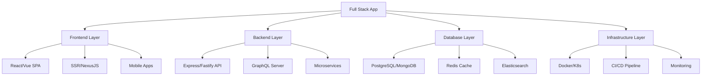

# TypeScript 全栈大项目实战

## 🎯 全栈项目架构概览

### 📊 现代全栈架构



## 🔧 项目初始化与架构

### 💡 现代化全栈项目结构

```typescript
// 项目根目录结构
interface ProjectStructure {
    // 前端应用
    apps: {
        web: string;          // Next.js 应用
        mobile: string;       // React Native 应用
        admin: string;        // Admin Dashboard
    };
    
    // 后端服务
    services: {
        api: string;          // 主 API 服务
        auth: string;         // 认证服务
        notification: string; // 通知服务
        payment: string;      // 支付服务
    };
    
    // 共享包
    packages: {
        ui: string;           // UI 组件库
        utils: string;        // 通用工具
        types: string;        // 类型定义
        config: string;       // 配置管理
        database: string;     // 数据库层
    };
    
    // 工具和脚本
    tools: {
        build: string;        // 构建工具
        scripts: string;     // 部署脚本
        migration: string;   // 数据库迁移
    };
}

// 1. 根目录 package.json 配置
interface RootPackageConfig {
    name: string;
    private: boolean;
    workspaces: string[];
    scripts: {
        dev: string;          // 启动开发环境
        build: string;        // 构建所有项目
        test: string;         // 运行测试
        lint: string;         // 代码检查
        type-check: string;   // 类型检查
        clean: string;        // 清理构建文件
        db:migrate: string;   // 数据库迁移
        deploy: string;       // 部署脚本
    };
    devDependencies: Record<string, string>;
}

// 2. 共享类型定义包
// packages/types/src/index.ts
export * from './user';
export * from './product';
export * from './order';
export * from './payment';
export * from './notification';
export * from './api';

// packages/types/src/user.ts
export interface User {
    id: string;
    email: string;
    firstName: string;
    lastName: string;
    role: UserRole;
    avatar?: string;
    preferences: UserPreferences;
    createdAt: Date;
    updatedAt: Date;
}

export interface UserPreferences {
    theme: 'light' | 'dark';
    language: string;
    notifications: NotificationSettings;
    privacy: PrivacySettings;
}

export interface NotificationSettings {
    email: boolean;
    push: boolean;
    marketing: boolean;
}

export interface PrivacySettings {
    profileVisibility: 'public' | 'private' | 'friends';
    showEmail: boolean;
    showActivity: boolean;
}

export enum UserRole {
    ADMIN = 'admin',
    MODERATOR = 'moderator',
    USER = 'user',
    GUEST = 'guest'
}

// packages/types/src/api.ts
export interface ApiResponse<T = any> {
    success: boolean;
    data: T;
    message: string;
    timestamp: string;
    requestId: string;
}

export interface PaginatedResponse<T> extends ApiResponse<T[]> {
    pagination: {
        page: number;
        limit: number;
        total: number;
        pages: number;
    };
}

export interface ApiError {
    code: string;
    message: string;
    details?: Record<string, any>;
    fields?: Record<string, string[]>;
}

export interface RequestContext {
    user?: User;
    ip: string;
    userAgent: string;
    requestId: string;
}

// 3. 配置管理包
// packages/config/src/index.ts
export * from './environment';
export * from './database';
export * from './redis';
export * from './email';
export * from './payment';
export * from './security';

// packages/config/src/environment.ts
export interface Environment {
    node: {
        env: 'development' | 'production' | 'test';
        port: number;
    };
    api: {
        baseUrl: string;
        timeout: number;
        retries: number;
        version: string;
    };
    jwt: {
        secret: string;
        expiresIn: string;
        issuer: string;
        audience: string;
    };
    redis: {
        url: string;
        password?: string;
        ttl: number;
    };
    email: {
        provider: 'smtp' | 'ses' | 'sendgrid';
        from: string;
        templates: string;
    };
    payment: {
        stripe: {
            secretKey: string;
            webhookSecret: string;
        };
        paypal: {
            clientId: string;
            clientSecret: string;
        };
    };
}
```

## 🚀 后端API服务架构

### 🔄 Express/Fastify 现代化服务器

```typescript
// services/api/src/app.ts
import express from 'express';
import cors from 'cors';
import helmet from 'helmet';
import compression from 'compression';
import rateLimit from 'express-rate-limit';

// 自定义中间件
import { errorHandler } from './middleware/error-handler';
import { requestLogger } from './middleware/request-logger';
import { validateAuth } from './middleware/auth';
import { validateRequest } from './middleware/validation';

// 路由模块
import { authRoutes } from './routes/auth';
import { userRoutes } from './routes/users';
import { productRoutes } from './routes/products';
import { orderRoutes } from './routes/orders';
import { paymentRoutes } from './routes/payments';

// 数据库和服务
import { DatabaseConnection } from '@myorg/database';
import { RedisCache } from '@myorg/cache';
import { EmailService } from '@myorg/email';
import { PaymentService } from '@myorg/payment';

class ApiServer {
    private app: express.Application;
    private db: DatabaseConnection;
    private cache: RedisCache;
    private emailService: EmailService;
    private paymentService: PaymentService;
    
    constructor() {
        this.app = express();
        this.setupServices();
        this.setupMiddleware();
        this.setupRoutes();
        this.setupErrorHandling();
    }
    
    private async setupServices(): Promise<void> {
        // 数据库连接
        this.db = new DatabaseConnection({
            host: process.env.DB_HOST,
            port: parseInt(process.env.DB_PORT || '5432'),
            database: process.env.DB_NAME,
            username: process.env.DB_USER,
            password: process.env.DB_PASSWORD,
        });
        
        await this.db.connect();
        
        // Redis 缓存
        this.cache = new RedisCache({
            url: process.env.REDIS_URL,
            password: process.env.REDIS_PASSWORD,
            ttl: 3600,
        });
        
        await this.cache.connect();
        
        // 邮件服务
        this.emailService = new EmailService({
            provider: process.env.EMAIL_PROVIDER as 'smtp' | 'ses',
            from: process.env.EMAIL_FROM,
            templates: './src/templates',
        });
        
        // 支付服务
        this.paymentService = new PaymentService({
            stripe: {
                secretKey: process.env.STRIPE_SECRET_KEY,
                webhookSecret: process.env.STRIPE_WEBHOOK_SECRET,
            },
        });
    }
    
    private setupMiddleware(): void {
        // 安全中间件
        this.app.use(helmet());
        
        // CORS 配置
        this.app.use(cors({
            origin: process.env.FRONTEND_URL,
            credentials: true,
            methods: ['GET', 'POST', 'PUT', 'DELETE', 'PATCH', 'OPTIONS'],
            allowedHeaders: ['Content-Type', 'Authorization', 'X-Requested-With'],
        }));
        
        // 压缩
        this.app.use(compression());
        
        // 请求解析
        this.app.use(express.json({ limit: '10mb' }));
        this.app.use(express.urlencoded({ extended: true, limit: '10mb' }));
        
        // 请求日志
        this.app.use(requestLogger());
        
        // 限流
        const limiter = rateLimit({
            windowMs: 15 * 60 * 1000, // 15 分钟
            max: 1000, // 每个 IP 限制 1000 请求
            message: 'Too many requests from this IP',
            standardHeaders: true,
            legacyHeaders: false,
        });
        
        this.app.use('/api', limiter);
        
        // API 版本管理
        this.app.use('/api/v1', express.Router());
    }
    
    private setupRoutes(): void {
        const apiV1 = this.app.locals.router || this.app.use('/api/v1', express.Router());
        
        // 健康检查
        this.app.get('/health', (req, res) => {
            res.json({
                status: 'healthy',
                timestamp: new Date().toISOString(),
                uptime: process.uptime(),
                version: process.env.API_VERSION || '1.0.0',
            });
        });
        
        // API 路由组
        this.app.use('/api/v1/auth', authRoutes);
        this.app.use('/api/v1/users', validateAuth(), userRoutes);
        this.app.use('/api/v1/products', validateAuth(), productRoutes);
        this.app.use('/api/v1/orders', validateAuth(), orderRoutes);
        this.app.use('/api/v1/payments', validateAuth(), paymentRoutes);
        
        // Webhook 路由（不需要认证）
        this.app.use('/api/v1/webhooks', express.Router());
        this.app.post('/api/v1/webhooks/stripe', 
            express.raw({ type: 'application/json' }),
            this.paymentService.handleStripeWebhook()
        );
    }
    
    private setupErrorHandling(): void {
        // 404 处理
        this.app.use('*', (req, res) => {
            res.status(404).json({
                success: false,
                message: 'Route not found',
                path: req.originalUrl,
            });
        });
        
        // 全局错误处理
        this.app.use(errorHandler());
    }
    
    async start(): Promise<void> {
        const port = process.env.PORT || 3000;
        
        this.app.listen(port, () => {
            console.log(`🚀 API Server running on port ${port}`);
            console.log(`📊 Environment: ${process.env.NODE_ENV}`);
            console.log(`🗄️ Database: Connected`);
            console.log(`🗄️ Redis: ${this.cache.isConnected() ? 'Connected' : 'Disconnected'}`);
        });
        
        // 优雅关闭处理
        process.on('SIGTERM', this.shutdown.bind(this));
        process.on('SIGINT', this.shutdown.bind(this));
    }
    
    private async shutdown(signal: string): Promise<void> {
        console.log(`Received ${signal}, shutting down gracefully...`);
        
        try {
            await this.db.disconnect();
            await this.cache.disconnect();
            process.exit(0);
        } catch (error) {
            console.error('Error during shutdown:', error);
            process.exit(1);
        }
    }
}

// 启动服务器
const server = new ApiServer();
server.start().catch(error => {
    console.error('Failed to start server:', error);
    process.exit(1);
});
```

### 🎪 路由和控制器实现

```typescript
// services/api/src/routes/auth.ts
import { Router } from 'express';
import { AuthController } from '../controllers/auth-controller';
import { validateRequest } from '../middleware/validation';
import { 
    LoginSchema, 
    RegisterSchema, 
    RefreshTokenSchema,
    ForgotPasswordSchema,
    ResetPasswordSchema 
} from '../schemas/auth-schemas';

const router = Router();
const authController = new AuthController();

// POST /api/v1/auth/login
router.post('/login',
    validateRequest(LoginSchema),
    authController.login.bind(authController)
);

// POST /api/v1/auth/register
router.post('/register',
    validateRequest(RegisterSchema),
    authController.register.bind(authController)
);

// POST /api/v1/auth/refresh
router.post('/refresh',
    validateRequest(RefreshTokenSchema),
    authController.refreshToken.bind(authController)
);

// POST /api/v1/auth/logout
router.post('/logout',
    authController.logout.bind(authController)
);

// POST /api/v1/auth/forgot-password
router.post('/forgot-password',
    validateRequest(ForgotPasswordSchema),
    authController.forgotPassword.bind(authController)
);

// POST /api/v1/auth/reset-password
router.post('/reset-password',
    validateRequest(ResetPasswordSchema),
    authController.resetPassword.bind(authController)
);

// GET /api/v1/auth/me
router.get('/me',
    authController.getCurrentUser.bind(authController)
);

export { router as authRoutes };

// services/api/src/controllers/auth-controller.ts
import { Request, Response } from 'express';
import { AuthService } from '../services/auth-service';
import { UserService } from '../services/user-service';
import { EmailService } from '../services/email-service';
import { ApiResponse, RequestContext } from '@myorg/types';
import { User } from '@myorg/types';

export class AuthController {
    constructor(
        private authService: AuthService = new AuthService(),
        private userService: UserService = new UserService(),
        private emailService: EmailService = new EmailService()
    ) {}
    
    async login(req: Request, res: Response): Promise<void> {
        const { email, password } = req.body;
        const context = this.getRequestContext(req);
        
        try {
            const result = await this.authService.login(email, password);
            
            const response: ApiResponse<{
                user: User;
                accessToken: string;
                refreshToken: string;
            }> = {
                success: true,
                data: result,
                message: 'Login successful',
                timestamp: new Date().toISOString(),
                requestId: context.requestId,
            };
            
            // 设置 HTTP-only cookies
            res.cookie('accessToken', result.accessToken, {
                httpOnly: true,
                secure: process.env.NODE_ENV === 'production',
                sameSite: 'strict',
                maxAge: 15 * 60 * 1000, // 15 分钟
            });
            
            res.cookie('refreshToken', result.refreshToken, {
                httpOnly: true,
                secure: process.env.NODE_ENV === 'production',
                sameSite: 'strict',
                maxAge: 7 * 24 * 60 * 60 * 1000, // 7 天
            });
            
            res.status(200).json(response);
            
        } catch (error) {
            this.handleError(res, error, 'Login failed', context.requestId);
        }
    }
    
    async register(req: Request, res: Response): Promise<void> {
        const { email, password, firstName, lastName } = req.body;
        const context = this.getRequestContext(req);
        
        try {
            const result = await this.authService.register({
                email,
                password,
                firstName,
                lastName,
            });
            
            const response: ApiResponse<User> = {
                success: true,
                data: result.user,
                message: 'Registration successful',
                timestamp: new Date().toISOString(),
                requestId: context.requestId,
            };
            
            res.status(201).json(response);
            
        } catch (error) {
            this.handleError(res, error, 'Registration failed', context.requestId);
        }
    }
    
    async refreshToken(req: Request, res: Response): Promise<void> {
        const { refreshToken } = req.body;
        const context = this.getRequestContext(req);
        
        try {
            const result = await this.authService.refreshAccessToken(refreshToken);
            
            const response: ApiResponse<{ accessToken: string }> = {
                success: true,
                données: { accessToken: result.accessToken },
                message: 'Token refreshed successfully',
                timestamp: new Date().toISOString(),
                requestId: context.requestId,
            };
            
            res.status(200).json(response);
            
        } catch (error) {
            this.handleError(res, error, 'Token refresh failed', context.requestId);
        }
    }
    
    async logout(req: Request, res: Response): Promise<void> {
        const context = this.getRequestContext(req);
        
        try {
            await this.authService.logout(context.user?.id);
            
            // 清除 cookies
            res.clearCookie('accessToken');
            res.clearCookie('refreshToken');
            
            const response: ApiResponse = {
                success: true,
                data: null,
                message: 'Logout successful',
                timestamp: new Date().toISOString(),
                requestId: context.requestId,
            };
            
            res.status(200).json(response);
            
        } catch (error) {
            this.handleError(res, error, 'Logout failed', context.requestId);
        }
    }
    
    async getCurrentUser(req: Request, res: Response): Promise<void> {
        const context = this.getRequestContext(req);
        
        try {
            const user = await this.userService.getById(context.user!.id);
            
            const response: ApiResponse<User> = {
                success: true,
                data: user,
                message: 'User retrieved successfully',
                timestamp: new Date().toISOString(),
                requestId: context.requestId,
            };
            
            res.status(200).json(response);
            
        } catch (error) {
            this.handleError(res, error, 'Failed to get current user', context.requestId);
        }
    }
    
    // 辅助方法
    private getRequestContext(req: Request): RequestContext {
        return {
            user: req.user,
            ip: req.ip || req.connection.remoteAddress || 'unknown',
            userAgent: req.get('User-Agent') || 'unknown',
            requestId: req.headers['x-request-id'] as string || crypto.randomUUID(),
        };
    }
    
    private handleError(res: Response, error: any, message: string, requestId: string): void {
        console.error(`[${requestId}] ${message}:`, error);

        const statusCode = error.statusCode || 500;
        const errorResponse: ApiResponse = {
            success: false,
            data: null,
            message: error.message || message,
            timestamp: new Date().toISOString(),
            requestId,
        };

        res.status(statusCode).json(errorResponse);
    }
}
```

## 🎭 数据库层架构

### 🔧 PostgreSQL + Prisma ORM

```typescript
// packages/database/src/schema.prisma
generator client {
  provider = "prisma-client-js"
}

datasource db {
  provider = "postgresql"
  url      = env("DATABASE_URL")
}

model User {
  id        String   @id @default(uuid())
  email     String   @unique
  firstName String
  lastName  String
  password  String
  role      UserRole @default(USER)
  avatar    String?
  verified  Boolean  @default(false)
  
  // 关联
  profile   UserProfile?
  orders    Order[]
  reviews   Review[]
  
  // 时间戳
  createdAt DateTime @default(now())
  updatedAt DateTime @updatedAt
  
  @@map("users")
}

model UserProfile {
  id          String   @id @default(uuid())
  userId      String   @unique
  user        User     @relation(fields: [userId], references: [id], onDelete: Cascade)
  
  bio         String?
  website     String?
  location    String?
  birthDate   DateTime?
  
  preferences Json?    // User preferences JSON
  
  createdAt   DateTime @default(now())
  updatedAt   DateTime @updatedAt
  
  @@map("user_profiles")
}

model Product {
  id          String   @id @default(uuid())
  name        String
  description String
  price       Decimal  @db.Decimal(10, 2)
  currency    String   @default("USD")
  sku         String   @unique
  image       String?
  status      ProductStatus @default(DRAFT)
  
  // 关联
  category    Category @relation(fields: [categoryId], references: [id])
  categoryId  String
  orders      OrderItem[]
  reviews     Review[]
  
  // 时间戳
  createdAt   DateTime @default(now())
  updatedAt   DateTime @updatedAt
  
  @@map("products")
}

model Order {
  id        String      @id @default(uuid())
  userId    String
  user      User        @relation(fields: [userId], references: [id])
  
  items     OrderItem[]
  status    OrderStatus @default(PENDING)
  
  // 价格信息
  subtotal  Decimal     @db.Decimal(10, 2)
  tax       Decimal     @db.Decimal(10, 2)
  shipping  Decimal     @db.Decimal(10, 2) @default(0)
  total     Decimal     @db.Decimal(10, 2)
  
  // 地址信息
  shippingAddress Json
  billingAddress  Json
  
  // 支付信息
  paymentId String?
  paidAt    DateTime?
  
  createdAt DateTime    @default(now())
  updatedAt DateTime    @updatedAt
  
  @@map("orders")
}

enum UserRole {
  ADMIN
  MODERATOR
  USER
  GUEST
}

enum ProductStatus {
  DRAFT
  ACTIVE
  INACTIVE
  ARCHIVED
}

enum OrderStatus {
  PENDING
  CONFIRMED
  PROCESSING
  SHIPPED
  DELIVERED
  CANCELLED
  REFUNDED
}

// packages/database/src/client.ts
import { PrismaClient } from '@prisma/client';

class DatabaseConnection {
    private client: PrismaClient;
    private connected: boolean = false;
    
    constructor(private config: DatabaseConfig) {
        this.client = new PrismaClient({
            datasources: {
                db: {
                    url: this.config.url,
                },
            },
            log: [
                { emit: 'event', level: 'query' },
                { emit: 'event', level: 'error' },
                { emit: 'event', level: 'info' },
                { emit: 'event', level: 'warn' },
            ],
        });
        
        this.setupEventHandlers();
    }
    
    private setupEventHandlers(): void {
        this.client.$on('query', (e) => {
            console.log('Query:', e.query);
            console.log('Duration:', `${e.duration}ms`);
        });
        
        this.client.$on('error', (e) => {
            console.error('Database error:', e);
        });
        
        this.client.$on('info', (e) => {
            console.info('Database info:', e);
        });
        
        this.client.$on('warn', (e) => {
            console.warn('Database warning:', e);
        });
    }
    
    async connect(): Promise<void> {
        try {
            await this.client.$connect();
            this.connected = true;
            
            // 运行健康检查
            await this.healthCheck();
            
            console.log('📦 Database connected successfully');
        } catch (error) {
            console.error('Database connection failed:', error);
            throw error;
        }
    }
    
    async disconnect(): Promise<void> {
        try {
            await this.client.$disconnect();
            this.connected = false;
            console.log('📦 Database disconnected');
        } catch (error) {
            console.error('Database disconnection failed:', error);
            throw error;
        }
    }
    
    private async healthCheck(): Promise<void> {
        await this.client.$queryRaw`SELECT 1`;
    }
    
    // 业务方法
    get users() {
        return this.client.user;
    }
    
    get products() {
        return this.client.product;
    }
    
    get orders() {
        return this.client.order;
    }
    
    get profiles() {
        return this.client.userProfile;
    }
    
    async transaction<T>(fn: (tx: PrismaClient) => Promise<T>): Promise<T> {
        return await this.client.$transaction(fn);
    }
    
    isConnected(): boolean {
        return this.connected;
    }
}

interface DatabaseConfig {
    url: string;
}

export { DatabaseConnection };
```

### 🔗 相关深入学习

- [[01-React-plus-TypeScript生态]] - React 前端集成
- [[02-Vue3-plus-TypeScript最佳实践]] - Vue3 集成实践  
- [[03-Node.js-plus-TypeScript全栈开发]] - Node.js 后端开发

---
*💡 全栈大项目涉及多个技术栈的深度集成，需要系统性的架构设计和工程实践*
