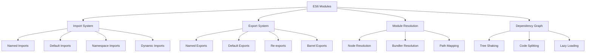

# TypeScript ES6 Modules 现代解析

## 🎯 ES6 Modules 系统概览

### 📊 模块系统架构



## 🔧 基础模块语法

### 💡 Import 系统详解

```typescript
// 1. Named Imports (命名导入)
import { UserService, ApiClient } from './services';
import { type User, type ApiConfig } from './types';
import type { ValidationRule } from './validation';

// 2. Default Imports (默认导入)
import React from 'react';
import express from 'express';
import App from './App';

// 3. Namespace Imports (命名空间导入)
import * as Utils from './utils';
import * as Lodash from 'lodash';

// 4. Mixed Imports (混合导入)
import React, { useState, useEffect } from 'react';
import express, { Request, Response } from 'express';
import UserService, { UserValidator } from './user-service';

// 5. Side-effect Imports (副作用导入)
import './global-styles.css';
import './polyfills';

// 6. Dynamic Imports (动态导入)
const loadModule = async () => {
    const { default: DynamicComponent } = await import('./DynamicComponent');
    const { UtilityFunction } = await import('./utils');
    
    return { DynamicComponent, UtilityFunction };
};

// 7. Conditional Dynamic Imports (条件动态导入)
const getEnvironmentModule = async () => {
    const isDevelopment = process.env.NODE_ENV === 'development';
    
    if (isDevelopment) {
        return await import('./dev-tools');
    } else {
        return await import('./prod-tools');
    }
};

// 8. Import with Assertion (断言导入)
import data from './config.json' assert { type: 'json' };
import config from './settings.yaml' assert { type: 'application/yaml' };
```

### 🎪 Export 系统详解

```typescript
// 1. Named Exports (命名导出)
export const VERSION = '1.0.0';
export const API_BASE_URL = 'https://api.example.com';

export function formatDate(date: Date): string {
    return date.toISOString().split('T')[0];
}

export class UserManager {
    constructor(private users: User[] = []) {}
    
    addUser(user: User): void {
        this.users.push(user);
    }
}

export interface Config {
    apiUrl: string;
    timeout: number;
    retries: number;
}

// 2. Default Exports (默认导出)
export default class AppService {
    async initialize(): Promise<void> {
        console.log('App Service initialized');
    }
}

// 3. Re-exports (重新导出)
export { UserService } from './user-service';
export type { User } from './types';
export { default as UiComponent } from './UIComponent';

// 4. Re-exports with Rename (重命名重新导出)
export { 
    UserService as UserAPI, 
    ProductService as ProductAPI 
} from './services';

export type { 
    User as UserType,
    Product as ProductType 
} from './types';

// 5. Barrel Exports (桶式导出)
// utils/index.ts
export * from './string-utils';
export * from './date-utils';
export * from './validation';
export { default } from './main-util';

// 6. Conditional Exports (条件导出)
export const getConfig = () => {
    if (process.env.NODE_ENV === 'development') {
        return require('./dev-config');
    } else {
        return require('./prod-config');
    }
};

// 7. Type-only Exports (仅类型导出)
export type { UserConfig };
export interface UserConfig {
    name: string;
    email: string;
}
```

## 🚀 高级模块模式

### 🔄 Module Augmentation

```typescript
// 1. 模块声明增强
declare module './typings' {
    interface GlobalConfig {
        appName: string;
        version: string;
        environment: 'development' | 'production';
        features: {
            darkMode: boolean;
            analytics: boolean;
            notifications: boolean;
        };
    }
}

// 2. 第三方库类型扩展
declare module 'external-library' {
    interface LibraryConfig {
        customOption?: boolean;
        extendedProperty?: string;
    }
    
    class LibraryClass {
        constructor(config: LibraryConfig);
        customMethod(param: string): void;
    }
    
    export = LibraryClass;
}

// 3. Node.js 模块扩展
declare module 'fs' {
    interface Stats {
        birthtimeMs: number;
    }
    
    function promises_readFile_enhanced(path: string): Promise<{
        buffer: Buffer;
        stats: Stats;
        metadata: {
            encoding: string;
            compressed: boolean;
        };
    }>;
}

// 4. JSON 模块导入类型
declare module '*.json' {
    const value: any;
    export default value;
}

declare module '*.png' {
    const content: string;
    export default content;
}

declare module '*.svg' {
    import { FC, SVGProps } from 'react';
    const Icon: FC<SVGProps<SVGSVGElement>>;
    export default Icon;
}

// 使用示例
import packageJson from './package.json';
import logo from './logo.svg';
import iconData from './icon.png';

type PackageInfo = typeof packageJson;
```

### 🎯 Module Federation

```typescript
// 1. Module Federation Configuration
// webpack.config.js
const ModuleFederationPlugin = require('@module-federation/webpack');

module.exports = {
    mode: 'production',
    plugins: [
        new ModuleFederationPlugin({
            name: 'shell',
            remotes: {
                'marketing': 'marketing@http://localhost:3001/remoteEntry.js',
                'dashboard': 'dashboard@http://localhost:3002/remoteEntry.js',
            },
        }),
    ],
};

// 2. TypeScript 类型声明
// types/federation.d.ts
declare module 'dashboard/DashboardModule' {
    export interface DashboardProps {
        userId: string;
        theme: 'light' | 'dark';
    }
    
    export class DashboardModule {
        render(props: DashboardProps): React.ReactElement;
        unmount(): void;
    }
}

declare module 'marketing/MarketingModule' {
    export interface MarketingConfig {
        campaignId: string;
        targetAudience: string[];
    }
    
    export class MarketingModule {
        initialize(config: MarketingConfig): Promise<void>;
        displayBanner(selector: string): void;
    }
}

// 3. 动态模块加载
class ModuleLoader {
    private loadedModules = new Map<string, any>();
    
    async loadDashboard(props: DashboardModuleProps) {
        try {
            const { DashboardModule } = await import('dashboard/DashboardModule');
            const module = new DashboardModule();
            this.loadedModules.set('dashboard', module);
            return module.render(props);
        } catch (error) {
            console.error('Failed to load dashboard module:', error);
            throw error;
        }
    }
    
    async loadMarketing(config: MarketingConfig) {
        try {
            const { MarketingModule } = await import('marketing/MarketingModule');
            const module = new MarketingModule();
            await module.initialize(config);
            this.loadedModules.set('marketing', module);
            return module;
        } catch (error) {
            console.error('Failed to load marketing module:', error);
            throw error;
        }
    }
    
    unloadModule(moduleName: string): void {
        const module = this.loadedModules.get(moduleName);
        if (module && typeof module.unmount === 'function') {
            module.unmount();
        }
        this.loadedModules.delete(moduleName);
    }
}
```

## 📚 Module Patterns & Best Practices

### 🔧 创建模块化架构

```typescript
// 1. Feature-based Modules (基于功能的模块)
// features/user/index.ts
export * from './user.service';
export * from './user.types';
export * from './user.hooks';
export * from './user.components';

// features/user/user.service.ts
export class UserService {
    async createUser(userData: CreateUserRequest): Promise<User> {
        // Implementation
    }
}

// features/user/user.types.ts
export interface User {
    id: string;
    username: string;
    email: string;
}

export interface CreateUserRequest {
    username: string;
    email: string;
    password: string;
}

// features/user/user.hooks.ts  
export function useUser(userId: string) {
    const [user, setUser] = useState<User | null>(null);
    const [loading, setLoading] = useState(false);
    
    useEffect(() => {
        // Fetch user logic
    }, [userId]);
    
    return { user, loading, updateUser: setUser };
}

// 2. Domain-based Modules (基于领域的模块)
// domains/identity/index.ts
export { AuthenticationService } from './auth-service';
export { AuthorizationService } from './authorization-service';
export { UserManagement } from './user-management';
export type { IdentityConfig } from './identity-types';

// domains/payment/index.ts
export { PaymentProcessor } from './payment-processor';
export { SubscriptionManager } from './subscription-manager';
export { InvoiceGenerator } from './invoice-generator';
export type { PaymentConfig } from './payment-types';

// 3. Layered Modules (分层模块)
// shared/index.ts
export * from './ui-components';
export * from './utils';
export * from './constants';
export * from './hooks';

// services/index.ts
export { ApiClient } from './api-client';
export { HttpClient } from './http-client';
export { CacheService } from './cache-service';
export { Logger } from './logger';

// infrastructure/index.ts
export { DatabaseConnection } from './database';
export { RedisConnection } from './redis';
export { MessageQueue } from './message-queue';
export { FileStorage } from './file-storage';
```

### 🎨 TypeScript Module Patterns

```typescript
// 1. Plugin System (插件系统)
interface PluginConfig {
    name: string;
    version: string;
    dependencies?: string[];
}

interface Plugin<T = any> {
    config: PluginConfig;
    install(app: Application, options?: T): void;
    uninstall(app: Application): void;
}

class PluginManager {
    private plugins = new Map<string, Plugin>();
    
    register(plugin: Plugin): void {
        this.plugins.set(plugin.config.name, plugin);
    }
    
    async install(name: string, app: Application, options?: any): Promise<void> {
        const plugin = this.plugins.get(name);
        if (!plugin) {
            throw new Error(`Plugin ${name} not found`);
        }
        
        plugin.install(app, options);
    }
}

// Plugin implementations
const authPlugin: Plugin = {
    config: {
        name: 'auth',
        version: '1.0.0',
        dependencies: ['core']
    },
    
    install(app: Application): void {
        app.addMiddleware(authMiddleware);
        app.addGuard(authGuard);
    },
    
    uninstall(app: Application): void {
        app.removeMiddleware(authMiddleware);
        app.removeGuard(authGuard);
    }
};

// 2. Strategy Pattern with Modules (策略模式的模块化)
interface CompressionStrategy {
    compress(data: Buffer): Promise<Buffer>;
    decompress(data: Buffer): Promise<Buffer>;
}

// 压缩策略实现
export class GzipCompression implements CompressionStrategy {
    async compress(data: Buffer): Promise<Buffer> {
        // Gzip implementation
        return data;
    }
    
    async decompress(data: Buffer): Promise<Buffer> {
        // Gzip decompression
        return data;
    }
}

export class DeflateCompression implements CompressionStrategy {
    async compress(data: Buffer): Promise<Buffer> {
        // Deflate implementation
        return data;
    }
    
    async decompress(data: Buffer): Promise<Buffer> {
        // Deflate decompression
        return data;
    }
}

// 策略工厂
export class CompressionFactory {
    static create(type: 'gzip' | 'deflate'): CompressionStrategy {
        switch (type) {
            case 'gzip':
               	return new GzipCompression();
            case 'deflate':
                return new DeflateCompression();
            default:
                throw new Error(`Unknown compression type: ${type}`);
        }
    }
}

// 使用策略
const compressor = CompressionFactory.create('gzip');
const compressed = await compressor.compress(fileBuffer);
```

### 📁 Module Organization

```typescript
// 1. 模块目录结构
src/
  components/           # 组件模块
    ├── common/         # 通用组件
    │   ├── index.ts
    │   ├── Button.tsx
    │   └── Modal.tsx
    ├── forms/          # 表单组件
    │   ├── index.ts
    │   ├── UserForm.tsx
    │   └── ContactForm.tsx
    └── layout/          # 布局组件
        ├── index.ts
        ├── Header.tsx
        └── Sidebar.tsx
  
  services/              # 服务模块
    ├── index.ts
    ├── api.service.ts
    ├── auth.service.ts
    └── user.service.ts
  
  utils/                 # 工具模块
    ├── index.ts
    ├── helpers.ts
    ├── constants.ts
    └── formatters.ts

// 2. 模块索引文件
// components/index.ts
export { Button, Modal } from './common';
export { UserForm, ContactForm } from './forms';
export { Header, Sidebar } from './layout';

export type ButtonProps = import('./common/Button').ButtonProps;
export type ModalProps = import('./common/Modal').ModalProps;

// 3. 类型集中管理
// types/index.ts
export type { ButtonProps, ModalProps } from '../components';
export type { ApiResponse, ApiError } from '../services';
export type { User, Product, Order } from '../models';

// Global type declarations
declare global {
    interface Window {
        __APP_CONFIG__: {
            apiUrl: string;
            version: string;
        };
    }
}
```

### 🚀 性能优化策略

```typescript
// 1. Lazy Loading Modules (懒加载模块)
class ModuleLazyLoader {
    private cache = new Map<string, Promise<any>>();
    
    async loadModule<T>(modulePath: string): Promise<T> {
        if (this.cache.has(modulePath)) {
            return this.cache.get(modulePath);
        }
        
        const loadPromise = `import(${'${modulePath}'})` as any;
        this.cache.set(modulePath, loadPromise);
        
        return loadPromise;
    }
    
    // Preload modules based on user behavior
    preloadModules(paths: string[]): void {
        paths.forEach(path => {
            if (!this.cache.has(path)) {
                this.loadModule(path);
            }
        });
    }
}

// 2. Tree Shaking Optimization (Tree Shaking 优化)
// utils/array.ts
export function filter<T>(array: T[], predicate: (item: T) => boolean): T[] {
    return array.filter(predicate);
}

export function map<T, U>(array: T[], mapper: (item: T) => U): U[] {
    return array.map(mapper);
}

export function reduce<T, U>(array: T[], reducer: (acc: U, item: T) => U, initial: U): U {
    return array.reduce(reducer, initial);
}

// 禁用默认导出以支持 tree shaking
// ❌ Avoid default exports for utilities
// export default { filter, map, reduce };

// ✅ Use named exports
export { filter, map, reduce };

// 3. Module Prefetching (模块预取)
class ModulePrefetcher {
    private prefetchedModules = new Set<string>();
    
    prefetchModule(modulePath: string): void {
        if (this.prefetchedModules.has(modulePath)) return;
        
        // Prefetch module
        this.createModuleLink(modulePath);
        this.prefetchedModules.add(modulePath);
    }
    
    private createModuleLink(modulePath: string): void {
        const link = document.createElement('link');
        link.rel = 'modulepreload';
        link.href = modulePath;
        document.head.appendChild(link);
    }
    
    // Smart prefetching based on route patterns
    prefetchByRoute(route: string): void {
        const patterns = {
            '/dashboard': ['dashboard', 'charts', 'analytics'],
            '/user/profile': ['profile', 'settings', 'avatar'],
            '/admin': ['admin', 'users', 'roles', 'permissions']
        };
        
        const modules = patterns[route as keyof typeof patterns];
        if (modules) {
            modules.forEach(module => {
                this.prefetchModule(`/modules/${module}.js`);
            });
        }
    }
}
```

### 🔗 相关深入学习

- [[02-Declaration-Files声明文件]] - 声明文件机制
- [[03-Module-Resolution策略]] - 模块解析策略
- [[04-Third-party-Integration第三方集成]] - 第三方库整合

---
*💡 ES6 Modules 是现代 TypeScript 开发的基础，掌握导入导出模式和最佳实践对于构建可维护的大型应用至关重要*
