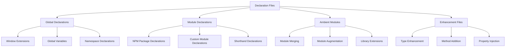

# TypeScript Declaration Files 声明文件完全指南

## 🎯 Declaration Files 系统概览

### 📊 声明文件分类



## 🔧 基础声明文件语法

### 💡 Global Declarations

```typescript
// 1. 全局变量声明
declare const __VERSION__: string;
declare const __BUILD_TIME__: number;
declare const APP_CONFIG: {
    apiUrl: string;
    env: 'development' | 'production';
    features: Record<string, boolean>;
};

// 使用全局变量
const config = APP_CONFIG;
const version = __VERSION__;

// 2. 全局函数声明
declare function gtag(command: string, action: string, parameters: any): void;
declare function dataLayer(data: any[]): void;

// Google Analytics 使用
gtag('config', 'GA_MEASUREMENT_ID', {
    custom_map: { dimension1: 'age' }
});

// 3. Window 对象扩展
declare global {
    interface Window {
        // Google Analytics
        gtag: typeof gtag;
        dataLayer: typeof dataLayer;
        
        // 自定义全局方法
        __APP_INSTANCE__: {
            version: string;
            apiClient: any;
            router: any;
        };
        
        // IE 兼容属性
        attachEvent?: (event: string, handler: Function) => void;
        detachEvent?: (event: string, handler: Function) => void;
    }
    
    // 扩展全局命名空间
    namespace NodeJS {
        interface Global {
            customGlobalVariable: any;
        }
    }
}

// 使用扩展的全局对象
window.__APP_INSTANCE__ = {
    version: '1.0.0',
    apiClient: new ApiClient(),
    router: new Router()
};

// 4. 全局枚举和常量
declare const enum ErrorCode {
    UNAUTHORIZED = 401,
    FORBIDDEN = 403,
    NOT_FOUND = 404,
    SERVER_ERROR = 500
}

declare const API_ENDPOINTS: {
    readonly USERS: '/api/users';
    readonly POSTS: '/api/posts';
    readonly COMMENTS: '/api/comments';
};

// 类型安全的常量使用
function handleError(code: ErrorCode): string {
    switch (code) {
        case ErrorCode.UNAUTHORIZED:
            return 'Unauthorized access';
        case ErrorCode.FORBIDDEN:
            return 'Access forbidden';
        case ErrorCode.NOT_FOUND:
            return 'Resource not found';
        case ErrorCode.SERVER_ERROR:
            return 'Server error occurred';
        default:
            return 'Unknown error';
    }
}
```

### 🎪 Module Declarations

```typescript
// 1. NPM 包声明
// types/express/index.d.ts
declare module 'express' {
    interface Request {
        user?: User;
        session?: Session;
        flash?: FlashMessage;
    }
    
    interface Response {
        locals: any;
        render(view: string, options?: any): void;
        redirect(url: string): void;
    }
    
    interface NextFunction {
        (err?: any): void;
    }
    
    function express(): Application;
    namespace express {
        interface Application {
            get(path: string, handler: RequestHandler): Application;
            post(path: string, handler: RequestHandler): Application;
            use(middleware: any): Application;
        }
        
        interface RequestHandler {
            (req: Request, res: Response, next: NextFunction): void;
        }
    }
    
    export = express;
}

// 2. JSON 模块声明
declare module '*.json' {
    const value: any;
    export default value;
}

declare module 'application/json' {
    interface JsonSchema {
        type: string;
        properties: Record<string, any>;
        required?: string[];
    }
    
    function validate(data: any, schema: JsonSchema): boolean;
    function parse(json: string): any;
    
    export { validate, parse };
}

// 3. CSS/SCSS 模块声明
declare module '*.css' {
    const classes: { readonly [key: string]: string };
    export default classes;
}

declare module '*.scss' {
    const classes: { readonly [key: string]: string };
    export default classes;
}

declare module '*.module.css' {
    interface IClassNames {
        [className: string]: string;
    }
    const classNames: IClassNames;
    export = classNames;
}

// React 组件中使用
import styles from './Button.module.css';
const Button = () => <button className={styles['primary-button']}>Click me</button>;

// 4. 图片资源模块声明
declare module '*.svg' {
    import { FC, SVGProps } from 'react';
    const IconComponent: FC<SVGProps<SVGSVGElement>>;
    export default IconComponent;
}

declare module '*.png' {
    const content: string;
    export default content;
}

declare module '*.jpg' {
    const content: string;
    export default content;
}

declare module '*.jpeg' {
    const content: string;
    export default content;
}

declare module '*.gif' {
    const content: string;
    export default content;
}

declare module '*.webp' {
    const content: string;
    export default content;
}
```

## 🚀 高级声明模式

### 🔄 Module Augmentation

```typescript
// 1. 声明模块增强
declare module 'some-library' {
    // 添加新的类型
    interface LibraryConfig {
        customOption?: boolean;
        enhancedProperty?: string;
    }
    
    // 扩展现有类
    interface LibraryClass {
        newFeature(): void;
        customMethod(param: string): Promise<any>;
    }
    
    // 添加新的导出
    export function customHelperFunction(): void;
    export const CUSTOM_CONSTANT: string;
}

// 使用扩展的库
import { LibraryClass } from 'some-library';

class MyLibraryService extends LibraryClass {
    constructor(config: LibraryConfig) {
        super();
        if (config.customOption) {
            this.newFeature();
        }
    }
    
    async processData(): Promise<void> {
        await this.customMethod('data');
        LibraryHelperFunction();
    }
}

// 2. Vue 组件类型增强
declare module '@vue/runtime-core' {
    interface ComponentCustomProperties {
        $api: ApiClient;
        $logger: Logger;
        $permissions: PermissionChecker;
    }
    
    interface GlobalComponents {
        CustomButton: typeof import('./components/CustomButton.vue').default;
        DataTable: typeof import('./components/DataTable.vue').default;
    }
}

// Vue 3 中使用
import { ref } from 'vue';

export default {
    setup() {
        const apiClient = ref();
        
        // API 客户端类型安全使用
        const fetchData = async () => {
            const data = await apiClient.value.get('/api/data');
            return data;
        };
        
        return { fetchData };
    }
};

// 3. Express 中间件增强
declare module 'express-serve-static-core' {
    interface Request {
        readonly user?: AuthenticatedUser;
        readonly requestId: string;
        readonly startTime: number;
    }
    
    interface Response {
        readonly requestId: string;
        success<T>(data: T): void;
        error(code: number, message: string): void;
    }
}

// Express 中间件使用扩展
app.use((req: Request, res: Response, next: NextFunction) => {
    req.requestId = generateRequestId();
    req.startTime = Date.now();
    
    // 类型安全的方法调用
    res.success({ message: 'Request processed' });
    next();
});
```

### 🎯 Ambient Module Patterns

```typescript
// 1. 第三方库完整声明
declare module 'lodash' {
    interface LoDashStatic {
        // 重新声明以确保类型安全
        chunk<T>(array: T[], size?: number): T[][];
        groupBy<T>(array: T[], iteratee?: string | ((value: T) => string)): Record<string, T[]>;
        debounce<T extends (...args: any[]) => any>(
            func: T,
            wait?: number,
            options?: { leading?: boolean; trailing?: boolean }
        ): T & { cancel(): void };
    }
    
    export default _;
}

// Lodash 使用
import _ from 'lodash';

const chunks = _.chunk([1, 2, 3, 4, 5], 2);
const grouped = _.groupBy(['one', 'two', 'three'], 'length');
const debouncedFn = _.debounce(() => console.log('called'), 300);

// 2. Chart.js 声明增强
declare module 'chart.js' {
    interface ChartOptions {
        customPlugin?: {
            enabled: boolean;
            customProperty: string;
        };
    }
    
    interface ChartData {
        customDataset?: {
            label: string;
            data: number[];
            backgroundColor: string[];
        };
    }
}

// Chart.js 增强使用
import Chart from 'chart.js';

const chart = new Chart(ctx, {
    type: 'bar',
    data: {
        labels: ['A', 'B', 'C'],
        datasets: [{
            label: 'Custom Dataset',
            data: [10, 20, 30],
            backgroundColor: ['red', 'green', 'blue'],
            customDataset: {
                label: 'Enhanced Data',
                data: [15, 25, 35],
                backgroundColor: ['purple', 'orange', 'yellow']
            }
        }]
    },
    options: {
        plugins: {
            customPlugin: {
                enabled: true,
                customProperty: 'custom value'
            }
        }
    }
});

// 3. Webpack 环境变量扩展
declare module 'webpack-env' {
    interface ProcessEnv {
        readonly NODE_ENV: 'development' | 'production' | 'test';
        readonly REACT_APP_API_URL: string;
        readonly REACT_APP_VERSION: string;
        readonly REACT_APP_FEATURE_FLAGS: string;
    }
}

// Webpack 环境变量使用
const apiUrl = process.env.REACT_APP_API_URL!;
const isDevelopment = process.env.NODE_ENV === 'development';
const featureFlags = JSON.parse(process.env.REACT_APP_FEATURE_FLAGS || '{}');
```

## 🎭 实用工具声明

### 🔧 JS 库到 TS 的类型化

```typescript
// 1. jQuery 插件声明
declare global {
    interface JQuery {
        // jQuery 插件类型声明
        datepicker(options?: DatePickerOptions): JQuery;
        typeAhead(data: any[], options?: TypeAheadOptions): JQuery;
        stickyHeader(options?: StickyOptions): JQuery;
    }
}

interface DatePickerOptions {
    dateFormat?: string;
    onSelect?: (dateText: string) => void;
    showButtonPanel?: boolean;
}

interface TypeAheadOptions {
    highlight?: boolean;
    hint?: boolean;
    minLength?: number;
}

interface StickyOptions {
    offset?: number;
    parent?: string;
    stuckClass?: string;
}

// jQuery 插件使用
import $ from 'jquery';

$('#dateInput').datepicker({
    dateFormat: 'dd/mm/yy',
    onSelect: (dateText) => console.log('Selected date:', dateText)
});

$('#searchInput').typeAhead(['apple', 'banana', 'cherry'], {
    highlight: true,
    minLength: 1
});

// 2. Web APIs 扩展声明
declare global {
    interface Navigator {
        // 添加新 API
        share(data?: ShareData): Promise<void>;
        clipboard: Clipboard;
        geolocation: Geolocation & {
            watchPositionEx(success: PositionCallback, error?: PositionErrorCallback, options?: PositionOptions): number;
        };
    }
    
    interface Clipboard {
        writeText(text: string): Promise<void>;
        readText(): Promise<string>;
        writeImage(image: ImageData): Promise<void>;
    }
    
    interface ShareData {
        title?: string;
        text?: string;
        url?: string;
        files?: FileList;
    }
    
    interface Window {
        // PWA 相关
        serviceWorker: ServiceWorkerContainer;
        PushManager: typeof PushManager;
        Notification: typeof Notification;
        
        // 新 API
        requestAnimationFrameEx(callback: FrameRequestCallback, priority?: number): number;
    }
}

// 使用扩展的 API
async function shareContent(title: string, text: string, url: string) {
    if ('share' in navigator) {
        try {
            await navigator.share({ title, text, url });
            console.log('Content shared successfully');
        } catch (error) {
            console.error('Error sharing content:', error);
        }
    } else {
        console.log('Web Share API not supported');
    }
}

async function copyToClipboard(text: string) {
    try {
        await navigator.clipboard.writeText(text);
        console.log('Text copied to clipboard');
    } catch (error) {
        console.error('Failed to copy text:', error);
    }
}
```

### 📚 Database & ORM 声明

```typescript
// 1. Sequelize 模型增强
declare module 'sequelize' {
    interface ModelStatic<TInstance = any, TAttributes = any> {
        findAllWithPagination(options?: FindOptions & {
            page?: number;
            limit?: number;
        }): Promise<{
            items: TInstance[];
            pagination: {
                page: number;
                limit: number;
                total: number;
                pages: number;
            };
        }>;
        
        bulkCreateWithValidation(items: TAttributes[]): Promise<TInstance[]>;
        
        upsertWithTimestamp(attributes: TAttributes): Promise<[TInstance, boolean]>;
    }
}

// 2. MongoDB & Mongoose 扩展
declare module 'mongoose' {
    interface DocumentQuery<T, DocType extends Document, QueryHelpers = {}> {
        paginate(page: number, limit: number): Promise<{
            docs: T[];
            totalDocs: number;
            limit: number;
            page: number;
            totalPages: number;
            hasNextPage: boolean;
            hasPrevPage: boolean;
        }>;
        
        selectFields(fields: string | string[]): DocumentQuery<T, DocType>;
        
        populateVirtual(virtual: string, select?: string): DocumentQuery<T, DocType>;
    }
    
    interface SchemaOptions {
        timestamps?: boolean | {
            createdAt?: string | boolean;
            updatedAt?: string | boolean;
        };
        
        toJSON?: {
            transform?: (doc: any, ret: any) => any;
            virtuals?: boolean;
        };
        
        toObject?: {
            transform?: (doc: any, ret: any) => any;
            virtuals?: boolean;
        };
    }
    
    // 自定义类型
    interface LeanDocument<T> extends Document {
        toJSON(): T;
        toObject(): T;
    }
}

// Mongoose 模型使用增强
import mongoose, { Schema, Document } from 'mongoose';

interface UserLean {
    _id: string;
    name: string;
    email: string;
    createdAt: Date;
    updatedAt: Date;
}

interface UserDocument extends Document {
    name: string;
    email: string;
    
    // 虚拟字段
    fullName: string;
    
    // 实例方法
    comparePassword(password: string): Promise<boolean>;
    toLeanDocument(): UserLean;
}

const UserSchema = new Schema<UserDocument>({
    name: { type: String, required: true },
    email: { type: String, required: true, unique: true }
}, {
    timestamps: true,
    toJSON: {
        virtuals: true,
        transform(doc, ret) {
            delete ret._id;
            delete ret.__v;
            return ret;
        }
    }
});

const User = mongoose.model<UserDocument>('User', UserSchema);

// 使用增强的 Mongoose 方法
async function getUserList() {
    const result = await User.find().paginate(1, 10);
    return result.docs; // T[] 类型安全
}
```

### 🔗 相关深入学习

- [[01-ES6-Modules现代解析]] - ES6 模块系统
- [[03-Module-Resolution策略]] - 模块解析机制
- [[04-Third-party-Integration第三方集成]] - 第三方库整合

---
*💡 声明文件是将 JavaScript 库迁移到 TypeScript 的关键技术，掌握声明文件的编写技巧能显著提升开发效率和类型安全性*
