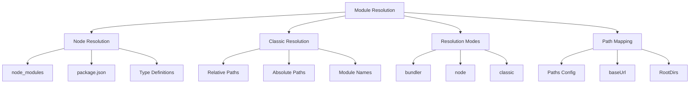

# TypeScript Module Resolution 策略详解

## 🎯 Module Resolution 概览

### 📊 解析策略分类



## 🔧 基础解析策略

### 💡 Node.js 解析机制

```typescript
// 1. tsconfig.json - 解析策略配置
{
  "compilerOptions": {
    // 模块解析策略
    "moduleResolution": "node", // "node" | "classic" | "bundler"
    "baseUrl": "./src",
    
    // 路径映射配置
    "paths": {
      "@/*": ["*"],
      "@/components/*": ["components/*"],
      "@/utils/*": ["utils/*"],
      "@/types/*": ["types/*"],
      "@/config/*": ["config/*"]
    },
    
    // 根目录配置
    "rootDirs": [
      "./src/modules",
      "./src/shared"
    ],
    
    // 类型根目录
    "typeRoots": [
      "./node_modules/@types",
      "./custom-types"
    ],
    
    // 模块名映射
    "moduleNameMapping": {
      "^@/(.*)$": "<rootDir>/src/$1",
      "^components/(.*)$": "<rootDir>/src/components/$1"
    }
  }
}

// 2. 模块解析算法实现
class ModuleResolver {
    private baseUrl: string;
    private paths: Record<string, string[]>;
    private typeRoots: string[];
    
    constructor(
        baseUrl: string = './src',
        paths: Record<string, string[]> = {},
        typeRoots: string[] = ['./node_modules/@types']
    ) {
        this.baseUrl = path.resolve(baseUrl);
        this.paths = paths;
        this.typeRoots = typeRoots;
    }
    
    // 解析非相对模块名
    resolveModuleName(moduleName: string, containingFile: string): string | undefined {
        // 1. 检查是否为相对路径
        if (moduleName.startsWith('./') || moduleName.startsWith('../')) {
            return path.resolve(path.dirname(containingFile), moduleName);
        }
        
        // 2. 检查路径映射
        const mappedPath = this.resolvePathMapping(moduleName);
        if (mappedPath) {
            return mappedPath;
        }
        
        // 3. Node.js 模块解析
        return this.resolveNodeModule(moduleName, containingFile);
    }
    
    private resolvePathMapping(moduleName: string): string | undefined {
        for (const [pattern, paths] of Object.entries(this.paths)) {
            if (pattern.endsWith('*')) {
                const prefix = pattern.slice(0, -1);
                if (moduleName.startsWith(prefix)) {
                    const suffix = moduleName.slice(prefix.length);
                    
                    for (const mappedPath of paths) {
                        const resolvedPath = mappedPath.replace('*', suffix);
                        const fullPath = path.resolve(this.baseUrl, resolvedPath);
                        
                        if (this.isFileOrDirectory(fullPath)) {
                            return fullPath;
                        }
                        
                        // 尝试添加 TypeScript 扩展名
                        const tsPath = fullPath + '.ts';
                        if (this.isFileOrDirectory(tsPath)) {
                            return tsPath;
                        }
                        
                        // 尝试添加 index.ts
                        const indexPath = path.join(fullPath, 'index.ts');
                        if (this.isFileOrDirectory(indexPath)) {
                            return indexPath;
                        }
                    }
                }
            } else if (pattern === moduleName) {
                for (const mappedPath of paths) {
                    const fullPath = path.resolve(this.baseUrl, mappedPath);
                    
                    if (this.isFileOrDirectory(fullPath)) {
                        return fullPath;
                    }
                }
            }
        }
        
        return undefined;
    }
    
    private resolveNodeModule(moduleName: string, containingFile: string): string | undefined {
        const nodeModulesPath = this.findNodeModulesFolder(containingFile);
        if (!nodeModulesPath) {
            return undefined;
        }
        
        // 解析模块路径
        const modulePath = path.resolve(nodeModulesPath, moduleName);
        
        // 检查 package.json 主入口
        const packageJsonPath = path.join(modulePath, 'package json');
        if (this.isFileOrDirectory(packageJsonPath)) {
            const packageJson = require(packageJsonPath);
            
            // 检查 package.json 中的字段优先级
            const mainFields = ['exports', 'module', 'main', 'browser'];
            for (const field of mainFields) {
                if (packageJson[field]) {
                    const mainPath = path.resolve(modulePath, packageJson[field]);
                    if (this.fileOrDirectory(mainPath)) {
                        return mainPath;
                    }
                }
            }
            
            // 检查 index 文件
            const indexPath = path.join(modulePath, 'index.ts');
            if (this.isFileOrDirectory(indexPath)) {
                return indexPath;
            }
            
            const indexJsPath = path.join(modulePath, 'index.js');
            if (this.isFileOrDirectory(indexJsPath)) {
                return indexJsPath;
            }
        }
        
        return undefined;
    }
    
    private findNodeModulesFolder(fromFile: string): string | undefined {
        let currentDir = path.dirname(fromFile);
        
        while (currentDir !== path.dirname(currentDir)) {
            const nodeModulesDir = path.join(currentDir, 'node_modules');
            
            if (this.isFileOrDirectory(nodeModulesDir)) {
                return nodeModulesDir;
            }
            
            currentDir = path.dirname(currentDir);
        }
        
        return undefined;
    }
    
    // 解析类型定义
    resolveTypeDefinitions(moduleName: string): string[] {
        const typePaths: string[] = [];
        
        // 1. 检查模块是否有内置类型定义
        const builtInTypes = this.findBuiltInTypes(moduleName);
        if (builtInTypes) {
            typePaths.push(...builtInTypes);
        }
        
        // 2. 检查 @types 包
        const typesPackagePath = path.join(nodeModulesPath, '@types', moduleName);
        if (this.isFileOrDirectory(typesPackagePath)) {
            const typesIndexPath = path.join(typesPackagePath, 'index.d.ts');
            if (this.isFileOrDirectory(typesIndexPath)) {
                typePaths.push(typesIndexPath);
            }
        }
        
        // 3. 检查自定义类型根目录
        for (const typeRoot of this.typeRoots) {
            const customTypePath = path.resolve(typeRoot, `${moduleName}.d.ts`);
            if (this.isFileOrDirectory(customTypePath)) {
                typePaths.push(customTypePath);
            }
        }
        
        return typePaths;
    }
    
    private findBuiltInTypes(moduleName: string): string[] | undefined {
        const builtInModules = [
            'fs', 'path', 'util', 'events', 'stream', 'crypto',
            'buffer', 'process', 'cluster', 'child_process'
        ];
        
        if (builtInModules.includes(moduleName)) {
            return [
                path.join(this.typeRoots[0], 'node'),
                path.join(this.typeRoots[0], 'node_modules', '@types', 'node')
            ];
        }
        
        return undefined;
    }
    
    private isFileOrDirectory(filePath: string): boolean {
        try {
            const stats = fs.statSync(filePath);
            return stats.isFile() || stats.isDirectory();
        } catch {
            return false;
        }
    }
}
```

## 🚀 高级解析策略

### 🔄 Bundler 模式解析

```typescript
// 1. Vite 配置 - 路径别名解析
// vite.config.ts
import { defineConfig } from 'vite';
import path from 'path';

export default defineConfig({
  resolve: {
    alias: {
      '@': path.resolve(__dirname, './src'),
      '@/components': path.resolve(__dirname, './src/components'),
      '@/utils': path.resolve(__dirname, './src/utils'),
      '@/types': path.resolve(__dirname, './src/types'),
      '@/assets': path.resolve(__dirname, './src/assets'),
    },
    extensions: ['.ts', '.tsx', '.js', '.jsx', '.json'],
  },
  
  optimizeDeps: {
    include: [
      'react',
      'react-dom',
      'react-router-dom',
      '@tanstack/react-query'
    ],
    exclude: [
      '@myorg/core',
      '@myorg/ui'
    ]
  },
  
  build: {
    rollupOptions: {
      external: (id) => {
        // 外部化某些依赖
        return ['react', 'react-dom'].includes(id);
      },
      output: {
        manualChunks: {
          vendor: ['lodash', 'moment'],
          ui: ['@myorg/ui', '@myorg/components'],
          utils: ['@myorg/utils', '@myorg/core']
        }
      }
    }
  }
});

// 2. Webpack 解析配置
// webpack.config.js
const path = require('path');

module.exports = {
  resolve: {
    // 解析配置
    modules: [
      path.resolve(__dirname, 'src'),
      'node_modules'
    ],
    
    // 路径别名
    alias: {
      '@': path.resolve(__dirname, 'src'),
      '@/components': path.resolve(__dirname, 'src/components'),
      '@/utils': path.resolve(__dirname, 'src/utils'),
      '@/hooks': path.resolve(__dirname, 'src/hooks'),
      '@/services': path.resolve(__dirname, 'src/services'),
      '@/types': path.resolve(__dirname, 'src/types'),
    },
    
    // 文件扩展名解析顺序
    extensions: ['.tsx', '.ts', '.jsx', '.js', '.json'],
    
    // 解析插件
    plugins: [
      new TypescriptPathsPlugin(__dirname, 'tsconfig.json')
    ],
    
    // 解析策略
    mainFields: ['browser', 'module', 'main'],
    conditionNames: ['import', 'require', 'node']
  },
  
  // 模块规则
  module: {
    rules: [
      {
        test: /\.tsx?$/,
        use: [
          {
            loader: 'babel-loader',
            options: {
              presets: [
                '@babel/preset-env',
                '@babel/preset-typescript',
                '@babel/preset-react'
              ],
              plugins: [
                '@babel/plugin-proposal-class-properties',
                '@babel/plugin-proposal-object-rest-spread'
              ]
            }
          }
        ],
        exclude: /node_modules/
      }
    ]
  }
};

// 3. Rollup 解析插件
import { Plugin } from 'rollup';
import typescript from '@rollup/plugin-typescript';
import resolve from '@rollup/plugin-node-resolve';
import alias from '@rollup/plugin-alias';

const aliases = [
  { find: /^@\/(.*)$/, replacement: 'src/$1' },
  { find: /^@components\/(.*)$/, replacement: 'src/components/$1' },
  { find: /^@utils\/(.*)$/, replacement: 'src/utils/$1' },
  { find: /^@types\/(.*)$/, replacement: 'src/types/$1' }
];

export const rollupConfig = {
  plugins: [
    alias({ entries: aliases }),
    resolve({
      preferBuiltins: false,
      moduleDirectories: ['node_modules', 'src']
    }),
    typescript({
      tsconfig: './tsconfig.json',
      declaration: true,
      declarationMap: true
    })
  ]
};
```

### 🎯 动态导入解析

```typescript
// 1. 动态模块加载器
class DynamicModuleLoader {
    private cache = new Map<string, any>();
    private loading = new Map<string, Promise<any>>();
    
    async loadModule<T>(modulePath: string): Promise<T> {
        // 检查缓存
        if (this.cache.has(modulePath)) {
            return this.cache.get(modulePath);
        }
        
        // 检查是否正在加载
        if (this.loading.has(modulePath)) {
            return this.loading.get(modulePath);
        }
        
        // 创建加载承诺
        const loadPromise = this.doLoadModule<T>(modulePath);
        this.loading.set(modulePath, loadPromise);
        
        try {
            const module = await loadPromise;
            this.cache.set(modulePath, module);
            this.loading.delete(modulePath);
            return module;
        } catch (error) {
            this.loading.delete(modulePath);
            throw error;
        }
    }
    
    private async doLoadModule<T>(modulePath: string): Promise<T> {
        // 解析模块路径
        const resolvedPath = this.resolveModule(modulePath);
        
        // 动态导入
        const module = await import(resolvedPath);
        return module.default || module;
    }
    
    private resolveModule(modulePath: string): string {
        // 处理路径别名
        if (modulePath.startsWith('@/')) {
            return modulePath.replace('@/', './src/');
        }
        
        if (modulePath.startsWith('@components/')) {
            return modulePath.replace('@components/', './src/components/');
        }
        
        if (modulePath.startsWith('@utils/')) {
            return modulePath.replace('@utils/', './src/utils/');
        }
        
        return modulePath;
    }
    
    // 批量预加载
    async preloadModules(modulePaths: string[]): Promise<void> {
        const loadPromises = modulePaths.map(path => this.loadModule(path));
        await Promise.allSettled(loadPromises);
    }
    
    // 错误重试机制
    async loadModuleWithRetry<T>(
        modulePath: string,
        maxRetries: number = 3
    ): Promise<T> {
        let lastError: Error | undefined;
        
        for (let attempt = 1; attempt <= maxRetries; attempt++) {
            try {
                return await this.loadModule<T>(modulePath);
            } catch (error) {
                lastError = error as Error;
                
                if (attempt < maxRetries) {
                    // 指数退避
                    const delay = Math.pow(2, attempt - 1) * 1000;
                    await new Promise(resolve => setTimeout(resolve, delay));
                }
            }
        }
        
        throw lastError!;
    }
}

// 2. 条件模块加载
class ConditionalModuleLoader {
    private conditions = new Map<string, () => boolean>();
    private fallbackModules = new Map<string, string>();
    
    register<T>(
        moduleName: string,
        modulePath: string,
        condition?: () => boolean
    ): void {
        if (condition) {
            this.conditions.set(moduleName, condition);
        }
    }
    
    registerFallback(moduleName: string, fallbackPath: string): void {
        this.fallbackModules.set(moduleName, fallbackPath);
    }
    
    async loadModule<T>(moduleName: string): Promise<T> {
        const condition = this.conditions.get(moduleName);
        
        // 检查条件
        if (condition && !condition()) {
            // 加载回退模块
            const fallbackPath = this.fallbackModules.get(moduleName);
            if (fallbackPath) {
                return dynamicImport(fallbackPath);
            }
            
            throw new Error(`Module ${moduleName} condition not met and no fallback available`);
        }
        
        // 动态解析模块路径
        const modulePath = this.resolveModulePath(moduleName);
        return dynamicImport(modulePath);
    }
    
    private resolveModulePath(moduleName: string): string {
        // 根据环境或配置解析不同路径
        if (process.env.NODE_ENV === 'development') {
            return `./dev-modules/${moduleName}`;
        } else if (process.env.NODE_ENV === 'test') {
            return `./test-mocks/${moduleName}`;
        } else {
            return `./modules/${moduleName}`;
        }
    }
}

// 3. 模块状态管理
interface ModuleState {
    loaded: boolean;
    loading: boolean;
    error: Error | null;
    module: any;
    lastAccessed: Date;
}

class ModuleStateManager {
    private states = new Map<string, ModuleState>();
    
    async getModule<T>(moduleName: string): Promise<T> {
        const state = this.states.get(moduleName);
        
        if (!state) {
            // 创建新的加载状态
            const newState: ModuleState = {
                loaded: false,
                loading: false,
                error: null,
                module: null,
                lastAccessed: new Date()
            };
            
            this.states.set(moduleName, newState);
            return this.loadModule<T>(moduleName);
        }
        
        if (state.loaded) {
            state.lastAccessed = new Date();
            return state.module;
        }
        
        if (state.loading) {
            // 等待加载完成
            return this.waitForModule<T>(moduleName);
        }
        
        if (state.error) {
            throw state.error;
        }
        
        return this.loadModule<T>(moduleName);
    }
    
    private async loadModule<T>(moduleName: string): Promise<T> {
        const state = this.states.get(moduleName)!;
        state.loading = true;
        
        try {
            state.module = await import(moduleName);
            state.loaded = true;
            state.loading = false;
            state.error = null;
            
            return state.module;
        } catch (error) {
            state.loading = false;
            state.error = error as Error;
            throw error;
        }
    }
    
    private async waitForModule<T>(moduleName: string): Promise<T> {
        // 简化的等待实现
        return new Promise((resolve, reject) => {
            const checkState = () => {
                const state = this.states.get(moduleName);
                
                if (state!.loaded) {
                    resolve(state!.module);
                } else if (state!.error) {
                    reject(state!.error);
                } else {
                    setTimeout(checkState, 50);
                }
            };
            
            checkState();
        });
    }
    
    // 清理未使用的模块
    cleanup(maxAge: number = 300000): void { // 5 minutes
        const now = Date.now();
        
        for (const [moduleName, state] of this.states) {
            if (now - state.lastAccessed.getTime() > maxAge) {
                this.states.delete(moduleName);
            }
        }
    }
}
```

## 📚 环境特定解析

### 🔧 开发环境配置

```typescript
// 1. 开发环境模块解析
class DevelopmentResolver {
    private hotModuleReplacements = new Map<string, boolean>();
    
    constructor(
        private baseResolver: ModuleResolver,
        private watchMode: boolean = false
    ) {}
    
    resolveDevelopmentModule(
        moduleName: string,
        containingFile: string
    ): string | undefined {
        // 开发环境特殊解析逻辑
        if (this.hotModuleReplacements.get(moduleName)) {
            return this.resolveHMRVersion(moduleName);
        }
        
        // 代理到基础解析器
        return this.baseResolver.resolveModuleName(moduleName, containingFile);
    }
    
    private resolveHMRVersion(moduleName: string): string {
        // HMR 版本解析
        const hmrPath = `${moduleName}?hmr=${Date.now()}`;
        return hmrPath;
    }
    
    // 热模块替换支持
    enableHMR(moduleName: string): void {
        this.hotModuleReplacements.set(moduleName, true);
    }
    
    disableHMR(moduleName: string): void {
        this.hotModuleReplacements.delete(moduleName);
    }
    
    // 调试信息
    getResolutionInfo(moduleName: string): ResolutionInfo {
        return {
            moduleName,
            resolvedPath: this.resolveModuleName(moduleName, ''),
            timestamp: new Date(),
            environment: 'development',
            hmrEnabled: this.hotModuleReplacements.has(moduleName)
        };
    }
}

// 2. 生产环境优化
class ProductionResolver {
    constructor(
        private baseResolver: ModuleResolver
    ) {}
    
    resolveOptimizedModule(
        moduleName: string,
        containingFile: string
    ): string | undefined {
        // 生产环境优化解析
        
        // 1. 检查 bundle 映射
        const bundlePath = this.getBundlePath(moduleName);
        if (bundlePath) {
            return bundlePath;
        }
        
        // 2. CDN 解析
        const cdnPath = this.resolveCDNPath(moduleName);
        if (cdnPath) {
            return cdnPath;
        }
        
        // 3. 回退到基础解析
        return this.baseResolver.resolveModuleName(moduleName, containingFile);
    }
    
    private getBundlePath(moduleName: string): string | undefined {
        // 检查是否有预构建的 bundle
        return undefined; // 简化实现
    }
    
    private resolveCDNPath(moduleName: string): string | undefined {
        // CDN 解析逻辑
        return undefined; // 简化实现
    }
}

// 3. 测试环境模块模拟
class TestResolver {
    private mocks = new Map<string, any>();
    private stubs = new Map<string, () => any>();
    
    constructor(private baseResolver: ModuleResolver) {}
    
    resolveTestModule(moduleName: string): any {
        // 检查是否有 mock
        if (this.mocks.has(moduleName)) {
            return this.mocks.get(moduleName);
        }
        
        // 检查是否有 stub
        if (this.stubs.has(moduleName)) {
            const stub = this.stubs.get(moduleName)!;
            return stub();
        }
        
        // 回退到实际模块
        return this.baseResolver.resolveModuleName(moduleName, '');
    }
    
    mockModule(moduleName: string, mockImplementation: any): void {
        this.mocks.set(moduleName, mockImplementation);
    }
    
    stubModule(moduleName: string, stubFactory: () => any): void {
        this.stubs.set(moduleName, stubFactory);
        this.mocks.delete(moduleName);
    }
    
    restoreModule(moduleName: string): void {
        this.mocks.delete(moduleName);
        this.stubs.delete(moduleName);
    }
    
    clearAllMocks(): void {
        this.mocks.clear();
        this.stubs.clear();
    }
}

interface ResolutionInfo {
    moduleName: string;
    resolvedPath: string | undefined;
    timestamp: Date;
    environment: string;
    hmrEnabled?: boolean;
}
```

### 🔗 相关深入学习

- [[01-ES6-Modules现代解析]] - ES6 模块系统  
- [[02-Declaration-Files声明文件]] - 声明文件机制
- [[04-Third-party-Integration第三方集成]] - 第三方模块集成

---
*💡 Module Resolution 是 TypeScript 项目组织的基础，掌握不同的解析策略能解决复杂的模块依赖和管理问题*
