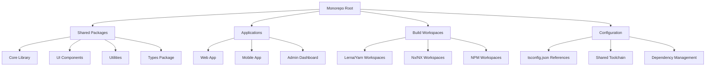

# TypeScript Multi-Project 多项目管理

## 🎯 Multi-Project 架构概览

### 📊 Monorepo 组织结构



## 🔧 Project References 配置

### 💡 核心项目结构

```json
// packages/core/tsconfig.json
{
  "extends": "../../tsconfig.base.json",
  "compilerOptions": {
    "rootDir": "./src",
    "outDir": "./dist",
    "declaration": true,
    "declarationMap": true,
    "sourceMap": true,
    "composite": true
  },
  "include": [
    "src/**/*"
  ],
  "exclude": [
    "dist",
    "node_modules",
    "**/*.test.ts"
  ]
}

// packages/ui/tsconfig.json
{
  "extends": "../../tsconfig.base.json",
  "compilerOptions": {
    "composite": true,
    "jsx": "react-jsx"
  },
  "references": [
    { "path": "../core" }
  ],
  "include": [
    "src/**/*"
  ]
}

// apps/web/tsconfig.json
{
  "extends": "../../tsconfig.base.json",
  "compilerOptions": {
    "composite": true,
    "jsx": "react-jsx"
  },
  "references": [
    { "path": "../../packages/core" },
    { "path": "../../packages/ui" },
    { "path": "../../packages/utils" }
  ],
  "include": [
    "src/**/*",
    "public/**/*"
  ]
}

// tsconfig.base.json
{
  "compilerOptions": {
    "target": "ES2020",
    "lib": ["ES2020", "DOM", "DOM.Iterable"],
    "module": "ESNext",
    "skipLibCheck": true,
    "isolatedModules": true,
    "resolveJsonModule": true,
    "allowSyntheticDefaultImports": true,
    "esModuleInterop": true,
    "forceConsistentCasingInFileNames": true,
    "moduleResolution": "node",
    "allowJs": true,
    "strict": true,
    "noEmit": true,
    "incremental": true,
    "noUncheckedIndexedAccess": true
  },
  "exclude": [
    "node_modules",
    "dist",
    "build"
  ]
}

// 根目录 tsconfig.json
{
  "files": [],
  "references": [
    { "path": "./packages/core" },
    { "path": "./packages/ui" },
    { "path": "./packages/utils" },
    { "path": "./apps/web" },
    { "path": "./apps/admin" },
    { "path": "./apps/mobile" }
  ]
}
```

### 🎪 工作区依赖管理

```json
// 根目录 package.json
{
  "name": "my-monorepo",
  "private": true,
  "workspaces": [
    "packages/*",
    "apps/*",
    "tools/*"
  ],
  "devDependencies": {
    "typescript": "^5.0.0",
    "@types/node": "^20.0.0",
    "lerna": "^7.0.0",
    "concurrently": "^8.0.0"
  },
  "scripts": {
    "build": "lerna run build",
    "build:packages": "lerna run build --scope=@myorg/core",
    "build:apps": "lerna run build --scope=@myorg/web",
    "type-check": "tsc --build",
    "clean": "lerna clean",
    "install-all": "lerna bootstrap",
    "test": "lerna run test",
    "lint": "lerna run lint"
  }
}

// packages/core/package.json
{
  "name": "@myorg/core",
  "version": "1.0.0",
  "main": "dist/index.js",
  "types": "dist/index.d.ts",
  "exports": {
    ".": {
      "import": "./dist/index.js",
      "require": "./dist/index.js",
      "types": "./dist/index.d.ts"
    },
    "./types": {
      "import": "./dist/types.js",
      "types": "./dist/types.d.ts"
    }
  },
  "scripts": {
    "build": "tsc",
    "build:watch": "tsc --watch",
    "type-check": "tsc --noEmit",
    "lint": "eslint src/**/*.ts"
  },
  "dependencies": {
    "rxjs": "^7.8.0"
  },
  "devDependencies": {
    "typescript": "^5.0.0"
  }
}

// packages/ui/package.json
{
  "name": "@myorg/ui",
  "version": "1.0.0",
  "main": "dist/index.js",
  "types": "dist/index.d.ts",
  "scripts": {
    "build": "tsc",
    "storybook": "start-storybook -p 6006",
    "build-storybook": "build-storybook"
  },
  "dependencies": {
    "@myorg/core": "^1.0.0",
    "@types/react": "^18.0.0",
    "react": "^18.0.0"
  },
  "peerDependencies": {
    "react": "^18.0.0"
  },
  "devDependencies": {
    "@storybook/react": "^7.0.0",
    "typescript": "^5.0.0"
  }
}

// apps/web/package.json
{
  "name": "@myorg/web",
  "version": "1.0.0",
  "private": true,
  "scripts": {
    "dev": "next dev",
    "build": "next build",
    "start": "next start",
    "type-check": "tsc --noEmit",
    "lint": "eslint src/**/*.{ts,tsx}"
  },
  "dependencies": {
    "@myorg/core": "^1.0.0",
    "@myorg/ui": "^1.0.0",
    "@myorg/utils": "^1.0.0",
    "next": "^14.0.0",
    "react": "^18.0.0",
    "react-dom": "^18.0.0"
  }
}
```

## 🚀 构建与开发工具链

### 🔄 Lerna 多包管理

```typescript
// lerna.json 配置
{
  "version": "1.0.0",
  "npmClient": "yarn",
  "useWorkspaces": true,
  "command": {
    "publish": {
      "conventionalCommits": true,
      "message": "chore(release): publish",
      "registry": "https://npm.registry.com"
    },
    "version": {
      "allowBranch": ["main", "release/*"],
      "conventionalCommits": true,
      "createRelease": "github",
      "exact": true,
      "push": true
    }
  },
  "packages": ["packages/*", "apps/*"],
  "registry": "https://npm.registry.com"
}

// 构建脚本工具
// tools/build-system/index.ts
import { execSync } from 'child_process';
import { join } from 'path';
import { readFileSync, writeFileSync } from 'fs';

interface PackageConfig {
  name: string;
  path: string;
  dependencies: string[];
  buildOrder: number;
}

class BuildSystem {
  private packages: PackageConfig[] = [];
  
  constructor() {
    this.loadPackages();
  }
  
  private loadPackages(): void {
    // 扫描所有包配置
    const packagesPath = join(process.cwd(), 'packages');
    const appsPath = join(process.cwd(), 'apps');
    
    const packageDirs = [...packagesPath, ...appsPath];
    
    packageDirs.forEach(dir => {
      const packageJsonPath = join(dir, 'package.json');
      try {
        const packageJson = JSON.parse(readFileSync(packageJsonPath, 'utf8'));
        this.packages.push({
          name: packageJson.name,
          path: dir,
          dependencies: Object.keys(packageJson.dependencies || {}),
          buildOrder: 0
        });
      } catch (error) {
        console.warn(`Failed to load package at ${dir}:`, error);
      }
    });
    
    this.calculateBuildOrder();
  }
  
  private calculateBuildOrder(): void {
    // 拓扑排序计算构建顺序
    const visited = new Set<string>();
    const visiting = new Set<string>();
    
    const visit = (pkg: PackageConfig): void => {
      if (visiting.has(pkg.name)) {
        throw new Error(`Circular dependency detected: ${pkg.name}`);
      }
      
      if (visited.has(pkg.name)) {
        return;
      }
      
      visiting.add(pkg.name);
      
      // 处理内部依赖
      pkg.dependencies
        .filter(dep => dep.startsWith('@myorg/'))
        .forEach(depName => {
          const depPkg = this.packages.find(p => p.name === depName);
          if (depPkg) {
            visit(depPkg);
          }
        });
      
      visiting.delete(pkg.name);
      visited.add(pkg.name);
      
      // 设置构建顺序
      pkg.buildOrder = visited.size;
    };
    
    this.packages.forEach(visit);
    this.packages.sort((a, b) => a.buildOrder - b.buildOrder);
  }
  
  async buildInOrder(): Promise<void> {
    console.log('Building packages in dependency order...');
    
    for (const pkg of this.packages) {
      console.log(`Building ${pkg.name} (order: ${pkg.buildOrder})`);
      
      try {
        execSync('npm run build', {
          cwd: pkg.path,
          stdio: 'inherit'
        });
        
        console.log(`✅ ${pkg.name} built successfully`);
      } catch (error) {
        console.error(`❌ Failed to build ${pkg.name}:`, error);
        throw error;
      }
    }
    
    console.log('🎉 All packages built successfully!');
  }
  
  async buildChangedPackages(changedFiles: string[]): Promise<void> {
    const affectedPackages = new Set<string>();
    
    // 分析变更的文件影响哪些包
    changedFiles.forEach(file => {
      const pkg = this.packages.find(p => file.startsWith(p.path));
      if (pkg) {
        affectedPackages.add(pkg.name);
        
        // 添加依赖此包的其他包
        this.packages
          .filter(other => other.dependencies.includes(pkg.name))
          .forEach(dep => affectedPackages.add(dep.name));
      }
    });
    
    console.log('Affected packages:', Array.from(affectedPackages));
    
    const packagesToBuild = this.packages.filter(p => affectedPackages.has(p.name));
    packagesToBuild.sort((a, b) => a.buildOrder - b.buildOrder);
    
    for (const pkg of packagesToBuild) {
      await this.buildPackage(pkg);
    }
  }
  
  private async buildPackage(pkg: PackageConfig): Promise<void> {
    console.log(`Building ${pkg.name}...`);
    
    // 实现单个包的构建逻辑
    execSync('npm run build', {
      cwd: pkg.path,
      stdio: 'inherit'
    });
  }
}

// 使用构建系统
const buildSystem = new BuildSystem();

if (process.argv.includes('--changed')) {
  // 检查 git 变更
  const changedFiles = execSync('git diff --name-only HEAD~1', {
    encoding: 'utf8'
  }).split('\n').filter(Boolean);
  
  buildSystem.buildChangedPackages(changedFiles);
} else {
  buildSystem.buildInOrder();
}
```

### 🎯 开发工作流

```typescript
// tools/dev-scripts/watch-build.ts
import { readFileSync, writeFileSync, watchFile } from 'fs';
import { exec } from 'child_process';
import { join } from 'path';

interface WatchConfig {
  packages: string[];
  scripts: string[];
  debounce: number;
}

class WatchBuilder {
  private config: WatchConfig;
  private timers: Map<string, NodeJS.Timeout> = new Map();
  
  constructor() {
    this.config = this.loadConfig();
  }
  
  private loadConfig(): WatchConfig {
    const configPath = join(process.cwd(), 'watch.config.json');
    
    try {
      return JSON.parse(readFileSync(configPath, 'utf8'));
    } catch {
      // 默认配置
      return {
        packages: ['@myorg/core', '@myorg/ui', '@myorg/utils'],
        scripts: ['build', 'type-check'],
        debounce: 1000
      };
    }
  }
  
  startWatching(): void {
    console.log('🔍 Starting watch mode...');
    
    this.config.packages.forEach(packageName => {
      const packagePath = this.findPackagePath(packageName);
      if (packagePath) {
        this.watchPackage(packagePath, packageName);
      }
    });
    
    console.log('✅ Watch mode is running. Press Ctrl+C to stop.');
  }
  
  private findPackagePath(packageName: string): string | null {
    // 在 packages/ 和 apps/ 目录中查找
    const possiblePaths = [
      join(process.cwd(), 'packages', packageName.replace('@myorg/', '')),
      join(process.cwd(), 'apps', packageName.replace('@myorg/', ''))
    ];
    
    return possiblePaths.find(path => {
      try {
        readFileSync(join(path, 'package.json'), 'utf8');
        return true;
      } catch {
        return false;
      }
    }) || null;
  }
  
  private watchPackage(packagePath: string, packageName: string): void {
    console.log(`👀 Watching ${packageName} at ${packagePath}`);
    
    // 监听源代码目录
    const srcPath = join(packagePath, 'src');
    watchFile(srcPath, { recursive: true }, () => {
      this.debounceBuild(packageName, packagePath);
    });
    
    // 监听 TypeScript 配置文件
    watchFile(join(packagePath, 'tsconfig.json'), () => {
      this.debounceBuild(packageName, packagePath);
    });
  }
  
  private debounceBuild(packageName: string, packagePath: string): void {
    const timerKey = packageName;
    const existingTimer = this.timers.get(timerKey);
    
    if (existingTimer) {
      clearTimeout(existingTimer);
    }
    
    const timer = setTimeout(() => {
      console.log(`🔨 Rebuilding ${packageName}...`);
      this.buildPackage(packagePath, packageName);
      this.timers.delete(timerKey);
    }, this.config.debounce);
    
    this.timers.set(timerKey, timer);
  }
  
  private buildPackage(packagePath: string, packageName: string): void {
    this.config.scripts.forEach(script => {
      exec(`npm run ${script}`, {
        cwd: packagePath
      }, (error, stdout, stderr) => {
        if (error) {
          console.error(`❌ ${packageName} ${script} failed:`, error);
          return;
        }
        
        if (stderr) {
          console.warn(`⚠️ ${packageName} ${script} warnings:`, stderr);
        }
        
        console.log(`✅ ${packageName} ${script} completed`);
      });
    });
  }
}

// 启动监听
const watchBuilder = new WatchBuilder();
watchBuilder.startWatching();
```

### 🔧 统一的开发体验

```typescript
// tools/dev-commands/index.ts
import { Command } from 'commander';
import chalk from 'chalk';

const program = new Command();

program
  .name('myorg-dev')
  .description('MyOrg development toolkit')
  .version('1.0.0');

// 创建新包命令
program
  .command('create-package <name>')
  .description('Create a new package')
  .option('-t, --type <type>', 'Package type (lib, app)', 'lib')
  .option('-d, --directory <dir>', 'Target directory', 'packages')
  .action(async (name: string, options) => {
    console.log(chalk.blue(`Creating package: ${name}`));
    
    const packageName = `@myorg/${name}`;
    const targetDir = `${options.directory}/${name}`;
    
    // 创建包目录结构
    await createPackageStructure(packageName, targetDir, options.type);
    
    console.log(chalk.green(`✅ Package ${packageName} created successfully!`));
    console.log(chalk.yellow('Run: npm run install-all'));
  });

// 类型检查命令
program
  .command('type-check')
  .description('Run TypeScript type checking across all packages')
  .option('-p, --package <name>', 'Check specific package only')
  .action(async (options) => {
    if (options.package) {
      console.log(chalk.blue(`Type checking: ${options.package}`));
      await typeCheckPackage(options.package);
    } else {
      console.log(chalk.blue('Type checking all packages...'));
      await typeCheckAllPackages();
    }
  });

// 测试命令
program
  .command('test')
  .description('Run tests across all packages')
  .option('-p, --package <name>', 'Test specific package only')
  .option('-w, --watch', 'Run in watch mode')
  .action(async (options) => {
    if (options.package) {
      await runPackageTests(options.package, options.watch);
    } else {
      await runAllTests();
    }
  });

// 发布命令
program
  .command('publish')
  .description('Publish packages to npm')
  .option('--dry-run', 'Perform a dry run without publishing')
  .option('--version <version>', 'Version to publish')
  .action(async (options) => {
    console.log(chalk.blue('Publishing packages...'));
    
    if (options.dryRun) {
      console.log(chalk.yellow('Dry run mode - no packages will be published'));
    }
    
    await publishPackages(options);
  });

// 工具函数实现
async function createPackageStructure(
  packageName: string,
  targetDir: string,
  type: string
): Promise<void> {
  // 实现包创建逻辑
}

async function typeCheckAllPackages(): Promise<void> {
  // 并行执行类型检查
}

async function typeCheckPackage(packageName: string): Promise<void> {
  // 单个包类型检查
}

async function runAllTests(): Promise<void> {
  // 运行所有测试
}

async function runPackageTests(packageName: string, watch: boolean): Promise<void> {
  // 运行单个包测试
}

async function publishPackages(options: any): Promise<void> {
  // 发布包逻辑
}

program.parse();
```

## 📚 最佳实践总结

### 🎯 多项目管理原则

```typescript
// 1. 统一的代码风格配置
// .eslintrc.js (根目录)
module.exports = {
  root: true,
  extends: ['@myorg/eslint-config'],
  env: {
    node: true,
    es6: true
  },
  overrides: [
    {
      files: ['packages/*/src/**/*.ts'],
      extends: ['@myorg/eslint-config/library']
    },
    {
      files: ['apps/*/src/**/*.{ts,tsx}'],
      extends: ['@myorg/eslint-config/app'],
      env: {
        browser: true
      }
    }
  ]
};

// .prettierrc.json
{
  "semi": true,
  "trailingComma": "es5",
  "singleQuote": true,
  "printWidth": 80,
  "tabWidth": 2,
  "useTabs": false
}

// packages/components/docs/custom-classnames.md
export { default } from './custom-classnames';
```

### 🔗 相关深入学习

- [[01-tsconfig-json大师级配置]] - TypeScript 配置
- [[02-Production优化策略]] - 生产环境优化
- [[04-Build-Toolchain构建工具链]] - 构建工具链

---
*💡 多项目管理是现代 TypeScript 开发的核心技能，合理的 Monorepo 架构能显著提升团队协作效率和代码复用性*
