# TypeScript Quick Check 快速知识检查

## 🎯 快速评估体系

### 📊 知识快检矩阵

```mermaid
graph TD
    A[Quick Knowledge Assessment] --> B[Fundamental Concepts]
    A --> C[Core Syntax]
    A --> D[Advanced Features]
    A --> E[Practical Skills]
    A --> F[Best Practices]
    A --> G[Tool Knowledge]
    
    B --> B1[Basic Types]
    B --> B2[Type Inference]
    B --> B3[Core Syntax Concepts]
    B --> B4[Language Philosophy]
    
    C --> C1[Variable Declarations]
    C --> C2[Functions & Classes]
    C --> C3[Interface & Types]
    C --> C4[Modules & Imports]
    
    D --> D1[Generic Programming]
    D --> D2[Advanced Types]
    D --> D3[Decorators]
    D --> D4[Conditional Types]
    
    E --> E1[Problem Solving]
    E --> E2[Code Review Skills]
    E --> E3[Debugging Ability]
    E --> E4[Architecture Thinking]
    
    F --> F1[Coding Standards]
    F --> F2[Error Handling]
    F --> F3[Performance Optimization]
    F --> F4[Maintainability]
    
    G --> G1[TSConfig Skills]
    G --> G2[Build Tools]
    G --> G3[IDE Usage]
    G --> G4[Testing Tools]
```



## 🔧 Rapid Assessment Engine

### 💡 Instant Knowledge Evaluation

```typescript
// Quick Assessment System
namespace QuickKnowledgeCheck {
    // Assessment Engine Interface
    interface AssessmentEngine {
        questionBank: QuestionBankEngine;
        answerEvaluator: AnswerEvaluator;
        scoreCalculator: ScoreCalculator;
        feedbackGenerator: FeedbackGenerator;
        progressTracker: ProgressTracker;
    }
    
    // Quick Check Engine Implementation
    class TypeScriptQuickCheckEngine {
        private questionBank: IntelligentQuestionBank;
        private evaluatorEngine: IntelligentEvaluator;
        private scoreCalculator: AdaptiveScoreCalculator;
        private feedbackEngine: AdaptiveFeedbackEngine;
        
        constructor(config: AssessmentConfiguration) {
            this.questionBank = new IntelligentQuestionBank(config.questionDB);
            this.evaluatorEngine = new IntelligentEvaluator(config.evaluatorConfig);
            this.scoreCalculator = new AdaptiveScoreCalculator(config.scoringConfig);
            this.feedbackEngine = new AdaptiveFeedbackEngine(config.feedbackConfig);
        }
        
        // Core Assessment Execution
        async conductQuickAssessment(
            participant: ParticipantProfile,
            scope: AssessmentScope
        ): Promise<QuickAssessmentReport> {
            const selectedQuestions = await this.educateQuestions(participant, scope);
            const assessmentSession = await this.startAssessmentSession(participant, selectedQuestions);
            
            const responses = await assessmentSession.collectResponses();
            const evaluationResults = await this.evalateResponses(responses, selectedQuestions);
            const scoreCalculation = await this.calculateScore(evaluationResults, participant);
            const interpretationReport = await this.interpretResults(scoreCalculation, participant);
            
            return {
                assessmentMetadata: {
                    sessionId: assessmentSession.sessionId,
                    participant: participant,
                    scope: scope,
                    timestamp: new Date().toISOString(),
                    durationMinutes: assessmentSession.durationMinutes
                },
                
                scoreSummary: scoreCalculation,
                detailedResults: evaluationResults,
                interpretationReport: interpretationReport,
                
                feedbackSummary: await this.generateFeedbackSummary(evaluationResults),
                strengths: await this.identifyStrengths(evaluationResults),
                weaknesses: await this.identifyWeaknesses(evaluationResults),
                
                recommendations: await this.generateRecommendations(evaluationResults, participant),
                nextSteps: await this.suggestNextSteps(evaluationResults, participant),
                studyPlanSuggested: await this.createStudyPlan(evaluationResults, participant)
            };
        }
        
        // Comprehensive Question Bank Definition
        private questionDatabase: ComprehensiveQuestionBank = {
            // Fundamental Concepts
            fundamentalConcepts: [
                {
                    id: 'QC001',
                    category: 'Fundamental Concepts',
                    difficulty: 'Basic',
                    topic: 'Type Annotation',
                    timeEstimate: 'Duration: 30 seconds',
                    
                    question: `
Which of the following type annotations is correct for declaring a variable that stores user email addresses?

A. let email: string;
B. let email: string[];  
C. let email: email;
D. let email: String;
                    `,
                    
                    correctAnswer: 'A',
                    explanation: 'TypeScript uses lowercase primitive types. string is correct for storing individual email addresses.',
                    
                    alternatives: {
                        B: 'string[] would be for arrays of strings, not individual strings',
                        C: 'Custom type names need to be defined with interfaces or types',
                        D: 'String (capital S) refers to the String constructor, not primitive'
                    },
                    
                    learningObjectives: ['Understand primitive type annotations'],
                    skillFlags: ['TYPE_ANNOTATIONS', 'BASIC_TYPES']
                },
                
                {
                    id: 'QC002', 
                    category: 'Fundamental Concepts',
                    difficulty: 'Basic',
                    topic: 'Type Inference',
                    timeEstimate: 'Duration: 45 seconds',
                    
                    question: `
What is the inferred type of the variable 'score' in this code?

const score = 95;
score = 100;

A. number
B. 95  
C. const number
D. readonly number
                    `,
                    
                    correctAnswer: 'B',
                    explanation: 'Using const inference narrows the type to the literal value. score has type 95, not the broader number.',
                    
                    challengeLevel: 'MEDIUM',
                    relatedConcepts: ['literal_types', 'const_assertions']
                },
                
                {
                    id: 'QC003',
                    category: 'Fundamental Concepts', 
                    difficulty: 'Intermediate',
                    topic: 'Union Types',
                    timeEstimate: 'Duration: 60 seconds',
                    
                    question: `
Consider this function signature:

function process(input: string | number): string {
    return typeof input === 'number' ? input.toString() : input.toUpperCase();
}

What output will occur for process(42)?

A. 42
B. "42"  
C. NUMBER
D. Compile error
                    `,
                    
                    correctAnswer: 'B',
                    explanation: 'Since typeof 42 === "number", the ternary resolves to input.toString(), which converts 42 to "42".',
                    
                    alternatives: {
                        A: 'Direct return of 42, but function returns string',
                        C: 'TYPE "number" as a string literal, not toString()',
                        D: 'Valid union type narrowing with typeof check'
                    }
                }
            ],
            
            // Core Syntax Assessment
            coreSyntax: [
                {
                    id: 'QC004',
                    category: 'Core Syntax',
                    difficulty: 'Basic', 
                    topic: 'Interface Definition',
                    timeEstimate: 'Duration: 90 seconds',
                    
                    question: `
Complete this interface definition. User interface should have:
- id (number)
- email (string) 
- name (optional string)

interface User {
    // Choose the correct definition
}

A. id: number; email: string; name: string;
B. id: number; email: string[?]; name: string;  
C. id: number; email: string; name?: string;
D. id: number; email: string; name: string | undefined;
                    `,
                    
                    correctAnswer: 'C',
                    explanation: 'Optional properties use ? after the property name. name?: string makes the name property optional.',
                    
                    alternatives: {
                        A: 'Makes all properties required',
                        B: 'Invalid optional syntax with square brackets', 
                        D: 'Union with undefined, but the preferred way is using ?'
                    }
                },
                
                {
                    id: 'QC005',
                    category: 'Core Syntax',
                    difficulty: 'Intermediate',
                    topic: 'Function Overloads', 
                    timeEstimate: 'Duration: 120 seconds',
                    
                    question: `
Analyze this function overload definition:

function process(val: string): boolean;
function process(val: number): boolean;
function process(val: string | number): boolean {
    return typeof val === 'string' ? val.length > 0 : val > 0;
}

What will process(0) return?

A. true
B. false
C. undefined  
D. TypeScript error
                    `,
                    
                    correctAnswer: 'B',
                    explanation: 'process(0) calls the implementation with number argument. val > 0 evaluates to 0 > 0, which is false.',
                    
                    alternatives: {
                        A: 'Would be true for any positive number',
                        C: 'Function always returns boolean, never undefined',
                        D: 'Valid overload syntax with proper return type'
                    }
                },
                
                {
                    id: 'QC006',
                    category: 'Core Syntax',
                    difficulty: 'Advanced',
                    topic: 'Generic Constraints',
                    timeEstimate: 'Duration: 90 seconds', 
                    
                    question: `
What does this generic constraint accomplish?

interface LengthComparable {
    length: number;
}

function getLongest<T extends LengthComparable>(items: T[]): T {
    return items.reduce(/* implementation */);
}

A. Allows T to be any array type
B. Constrains T to types having the property 'length'  
C. Generates compile-time error
D. No constraint effect
                    `,
                    
                    correctAnswer: 'B',
                    explanation: 'T extends LengthComparable means T must have at least a length property of number type.',
                    
                    alternatives: {
                        A: 'Constraint applies to T, not array type',
                        C: 'Valid constraint syntax',
                        D: 'Constraint enforces length property requirement'
                    }
                }
            ],
            
            // Advanced Features Assessment
            advancedFeatures: [
                {
                    id: 'QC007',
                    category: 'Advanced Features',
                    difficulty: 'Advanced',
                    topic: 'Conditional Types',
                    timeEstimate: 'Duration: 120 seconds',
                    
                    question: `
Given this conditional type:

type ConvertToString<T> = T extends number ? string : T;

Evaluate: ConvertToString<42 | string>

A. string
B. string | string  
C. string | T
D. TypeScript error
                    `,
                    
                    correctAnswer: 'B',
                    explanation: 'Distributive conditional types apply to union members. number converts to string, string stays string.',
                    
                    distributedUnionBehavior: 'Key concept: conditional types distribute across union members'
                },
                
                {
                    id: 'QC008', 
                    category: 'Advanced Features',
                    difficulty: 'Expert',
                    topic: 'Template Literal Types',
                    timeEstimate: 'Duration: 150 seconds',
                    
                    question: `
Consider this template literal type:

type EventName = 'click' | 'keydown' | 'submit';
type EventHandler<T extends EventName> = `on${Capitalize<T>}`;

What will EventHandler<'click'> resolve to?

A. 'onClick'
B. 'onClick' | 'onClick'  
C. Template literal
D. Compile error
                    `,
                    
                    correctAnswer: 'A',
                    explanation: 'Capitalize<'click'> = 'Click', then `on${'Click'}` evaluates to 'onClick'.',
                    
                    advancedPatternExplanation: 'Template literal types with utility types create complex string manipulations'
                }
            ],
            
            // Practical Skills Assessment  
            practicalSkills: [
                {
                    id: 'QC009',
                    category: 'Practical Skills', 
                    difficulty: 'Intermediate',
                    topic: 'Error Handling',
                    timeEstimate: 'Duration: 120 seconds',
                    
                    question: `
Given this async function:

async function fetchData(): Promise<User | null> {
    try {
        const response = await fetch('/api/user');
        return response.ok ? await response.json() : null;
    } catch {
        return null;
    }
}

How should this function be enhanced for production?

A. The implementation is sufficient
B. Add logging for debugging  
C. Add retry logic and better error types
D. Remove try-catch block
                    `,
                    
                    correctAnswer: 'C',
                    explanation: 'Production code needs retry logic, specific error types, and proper error handling.',
                    
                    alternatives: {
                        A: 'Basic implementation lacks production robustness',
                        B: 'Logging helps but doesn\'t address retry/logic needs',
                        D: 'Removing try-catch would cause unhandled rejections'
                    }
                },
                
                {
                    id: 'QC010',
                    category: 'Practical Skills',
                    difficulty: 'Advanced', 
                    topic: 'Architecture Patterns',
                    timeEstimate: 'Duration: 180 seconds',
                    
                    question: `
You have multiple data sources (API, Database, Cache) all returning User objects.  
Which TypeScript pattern best ensures type safety across all sources?

A. create multiple separate interfaces per source
B. create a unified interface extending all variants  
C. use union types combining all source-specific user types
D. create a generic User<T> wrapper interface
                    `,
                    
                    correctAnswer: 'B',
                    explanation: 'Unified interface maintains consistency while allowing source-specific extensions.',
                    
                    architecturalReasoning: 'Consistency across sources prevents runtime errors and improves maintainability'
                }
            ],
            
            // Best Practices Assessment
            bestPractices: [
                {
                    id: 'QC011',
                    category: 'Best Practices',
                    difficulty: 'Intermediate', 
                    topic: 'Code Organization',
                    timeEstimate: 'Duration: 90 seconds',
                    
                    question: `
What is the primary benefit of using readonly for object properties in TypeScript?

A. Improves runtime performance
B. Prevents accidental mutations  
C. Creates immutable objects
D. Enables tree-shaking
                    `,
                    
                    correctAnswer: 'B',
                    explanation: 'readonly prevents accidental mutations at compile time, catching errors early.',
                    
                    alternatives: {
                        A: 'Compile-time feature, not runtime optimization',
                        C: 'Objects remain mutable except specific readonly properties', 
                        D: 'Tree-shaking unrelated to readonly modifier'
                    }
                },
                
                {
                    id: 'QC012',
                    category: 'Best Practices',
                    difficulty: 'Advanced',
                    topic: 'Type Safety',
                    timeEstimate: 'Duration: 120 seconds',
                    
                    question: `
Rank these approaches by type safety effectiveness (highest to lowest):

1. any types
2. unknown with type guards  
3. union types with narrowing
4. specific interfaces

A. 4 > 3 > 2 > 1
B. 3 > 4 > 2 > 1  
C. 4 > 2 > 3 > 1
D. 2 > 4 > 3 > 1
                    `,
                    
                    correctAnswer: 'A', 
                    explanation: 'Specific interfaces > narrowable unions > unknown with guards > any types. Specific types offer most safety.',
                    
                    rankingRationale: 'Specificity increases type safety, while any reduces safety to JavaScript level'
                }
            ],
            
            // Tool Knowledge Assessment
            toolKnowledge: [
                {
                    id: 'QC013',
                    category: 'Tools Knowledge',
                    difficulty: 'Intermediate',
                    topic: 'TSConfig Understanding', 
                    timeEstimate: 'Duration: 90 seconds',
                    
                    question: `
Which TSConfig option has the most significant impact on build performance?

A. target: "es2020"
B. module: "esnext"  
C. skipLibCheck: true
D. isolatedModules: true
                    `,
                    
                    correctAnswer: 'C',
                    explanation: 'skipLibCheck skips type checking of .d.ts files, significantly speeding up compilation.',
                    
                    alternatives: {
                        A: 'Target affects output but not compilation speed considerably',
                        B: 'Module affects output format, minor impact on speed',
                        D: 'IsolatedModules aids correctness, adds overhead'
                    }
                },
                
                {
                    id: 'QC014',
                    category: 'Tools Knowledge', 
                    difficulty: 'Advanced',
                    topic: 'Integration Tools',
                    timeEstimate: 'Duration: 120 seconds',
                    
                    question: `
Which approach best integrates TypeScript performance monitoring into CI/CD?

A. tsc --noEmit only
B. Include type check command with build steps  
C. Skip TS checks, rely on runtime tests
D. Add incremental compilation
                    `,
                    
                    correctAnswer: 'B',
                    explanation: 'Integrated type checking catches errors early, balancing speed with correctness.',
                    
                    alternatives: {
                        A: '--noEmit checks types but doesn\'t optimize for performance',
                        C: 'Runtime-only misses compile-time errors',
                        D: 'Incremental helps performance but doesn\'t address CI/CD integration'
                    }
                }
            ]
        };
        
        // Scoring Engine Implementation
        createScoringEngine(): ScoringEngine {
            return {
                adaptiveScoring: {
                    difficultyWeighting: this.configureDifficultyWeighting(),
                    categoryWeighting: this.configureCategoryWeighting(),
                    temporalPenalty: this.configureTemporalPenalty(),
                    confidenceAssessment: this.configureConfidenceAssessment()
                },
                
                intelligentFeedback: {
                    contextualFeedback: this.generateContextualFeedback(),
                    improvementSuggestions: this.generateImprovementSuggestions(),
                    nextChallenge: this.generateNextChallenge(),
                    mistakePatternAnalysis: this.analyzeMistakePatterns()
                },
                
                progressAnalysis: {
                    skillTrendAnalysis: this.performSkillTrendAnalysis(),
                    competencyGaps: this.identifyCompetencyGaps(),
                    masteryPredictions: this.predictMastery(),
                    personalizedLearningPath: this.generatePersonalizedPath()
                }
            };
        }
        
        // Comprehensive Assessment Reports
        generateAssessmentReport(): AssessmentReportTemplate {
            return {
                overallScore: {
                    totalScorePercentage: 'number (0-100)',
                    competencyLevel: 'NOVICE | APPRENTICE | PRACTITIONER | PROFICIENT | EXPERT',
                    percentileRanking: 'ranking within peer group'
                },
                
                detailedBreakdown: {
                    fundamentalConcepts: 'ScoreBreakdown',
                    coreSyntax: 'ScoreBreakdown', 
                    advancedFeatures: 'ScoreBreakdown',
                    practicalSkills: 'ScoreBreakdown',
                    bestPractices: 'ScoreBreakdown',
                    toolKnowledge: 'ScoreBreakdown'
                },
                
                strengthsWeaknesses: {
                    strengths: 'IdentifiedStrongAreas[]',
                    weaknesses: 'IdentifiedWeakAreas[]',
                    improvementPriorities: 'PrioritizedAreasForImprovement[]'
                },
                
                recommendations: {
                    immediateImprovements: 'ImmediateImprovement[]',
                    mediumTermGoals: 'MediumTermGoal[]',
                    longTermSkillDevelopment: 'LongTermDevelopmentPlan[]',
                    resourceRecommendations: 'RecommendedResource[]'
                },
                
                nextSteps: {
                    assessmentSchedule: 'NextAssessmentSchedule',
                    practiceExercises: 'RecommendedPracticeExercise[]',
                    certificationPreparation: 'CertificationPrepRecommendation',
                    careerGuidance: 'CareerGuidanceRecommendation'
                }
            };
        }
        
        // Supporting Types
        interface ComprehensiveQuestionBank {
            fundamentalConcepts: QuestionDefinition[];
            coreSyntax: QuestionDefinition[];
            advancedFeatures: QuestionDefinition[];
            practicalSkills: QuestionDefinition[];
            bestPractices: QuestionDefinition[];
            toolKnowledge: QuestionDefinition[];
        }
        
        interface QuestionDefinition {
            id: string;
            category: string;
            difficulty: DifficultyLevel;
            topic: string;
            timeEstimate: string;
            question: string;
            correctAnswer: string;
            explanation: string;
            alternatives?: Record<string, string>;
            learningObjectives?: string[];
            skillFlags?: string[];
            challengeLevel?: ChallengeLevel;
            relatedConcepts?: string[];
        }
        
        interface QuickAssessmentReport {
            assessmentMetadata: AssessmentMetadata;
            scoreSummary: ScoreSummary;
            detailedResults: DetailedResult[];
            interpretationReport: InterpretationReport;
            
            feedbackSummary: FeedbackSummary;
            strengths: IdentifiedStrength[];
            weaknesses: IdentifiedWeakness[];
            
            recommendations: Recommendation[];
            nextSteps: NextStep[];
            studyPlanSuggested: StudyPlanSuggestion;
        }
        
        interface ScoringEngine {
            adaptiveScoring: AdaptiveScoringConfiguration;
            intelligentFeedback: IntelligentFeedbackConfiguration;
            progressAnalysis: ProgressAnalysisConfiguration;
        }
        
        type DifficultyLevel = 'BASIC' | 'INTERMEDIATE' | 'ADVANCED' | 'EXPERT';
        type AssessmentScope = 'QUICK_CHECK' | 'COMPREHENSIVE_REVIEW' | 'TOPIC_SPECIFIC' | 'DIAGNOSTIC';
        type ChallengeLevel = 'LOW' | 'MEDIUM' | 'HIGH';
        type CompetencyLevel = 'NOVICE' | 'APPRENTICE' | 'PRACTITIONER' | 'PROFICIENT' | 'EXPERT';
    }
}
```

### 🔗 相关深入学习

- [[02-Level-Tests分层测试]] - 分层测试体系
- [[03-Certification-Prep认证预备]] - 认证预备指南
- [[01-Exercises练习题]] - 综合练习题集

---
*💡 快速检查评估能够迅速定位知识盲点，为后续学习提供明确方向*