# TypeScript Level Tests 分层测试体系

## 🎯 分层测试评估框架

### 📊 测试分级体系图

```mermaid
graph TD
    A[Level Testing System] --> B[Novice Level]
    A --> C[Apprentice Level]
    A --> D[Practitioner Level]
    A --> E[Proficient Level]
    A --> F[Expert Level]
    A --> G[Master Level]
    
    B --> B1[Basic Syntax]
    B --> B2[Simple Types]
    B --> B3[Basic Functions]
    B --> B4[Simple Interfaces]
    
    C --> C1[Complex Types]
    C --> C2[Generics Basics]
    C --> C3[Classes & Inheritance]
    C --> C4[Modules & Imports]
    
    D --> D1[Advanced Generics]
    D --> D2[Design Patterns]
    D --> D3[Error Handling]
    D --> D4[Testing Strategies]
    
    E --> E1[Type System Design]
    E --> E2[Architecture Patterns]
    E --> E3[Performance Optimization]
    E --> E4[Tool Integration]
    
    F --> F1[Compiler Internals]
    F --> F2[Custom Transforms]
    F --> F3[Language Extensions]
    F --> F4[Research Projects]
    
    G --> G1[TypeScript Core Contribution]
    G --> G2[Language Design]
    G --> G3[Community Leadership]
    G --> G4[Industry Innovation]
```



## 🔧 Comprehensive Level Testing Engine

### 💡 Adaptive Assessment System

```typescript
// Comprehensive Level Testing System
namespace LevelTestingSystem {
    // Level Testing Framework Interface
    interface LevelTestingFramework {
        levelAssessor: LevelAssessmentEngine;
        testGenerator: AdaptiveTestGenerator;
        scoreAnalyzer: ScoreAnalysisEngine;
        progressTracker: ProgressTrackingEngine;
        certificationManager: CertificationManager;
    }
    
    // TypeScript Level Testing Engine
    class TypeScriptLevelTestingEngine {
        private levelRepository: LevelRepository;
        private testBank: ComprehensiveTestBank;
        private adaptiveEngine: AdaptiveTestingEngine;
        private scoringEngine: IntelligentScoringEngine;
        private certificationEngine: CertificationEngine;
        
        constructor(config: LevelTestingConfiguration) {
            this.levelRepository = new LevelRepository(config.levelDB);
            this.testBank = new ComprehensiveTestBank(config.testBank);
            this.adaptiveEngine = new AdaptiveTestingEngine(config.adaptivityConfig);
            this.scoringEngine = new IntelligentScoringEngine(config.scoringConfig);
            this.certificationEngine = new CertificationEngine(config.certificationConfig);
        }
        
        // Complete Level Assessment Process
        async conductLevelAssessment(
            candidate: CandidateProfile,
            targetLevel: TargetLevel
        ): Promise<LevelAssessmentReport> {
            // Phase 1: Initial Level Estimation
            const initialEstimation = await this.estimateInitialLevel(candidate);
            
            // Phase 2: Adaptive Test Generation
            const adaptiveTests = await this.generateAdaptiveTests(initialEstimation, targetLevel);
            
            // Phase 3: Test Execution
            const testResults = await this.executeAdaptiveTests(adaptiveTests, candidate);
            
            // Phase 4: Comprehensive Analysis
            const analysisResults = await this.performComprehensiveAnalysis(testResults);
            
            // Phase 5: Level Determination
            const levelDetermination = await this.determineFinalLevel(analysisResults, targetLevel);
            
            // Phase 6: Certification Assessment
            const certificationAssessment = await this.assessCertificationEligibility(levelDetermination);
            
            return {
                assessmentMetadata: {
                    candidateId: candidate.id,
                    assessmentDate: new Date().toISOString(),
                    targetLevel: targetLevel,
                    duration: testResults.totalDuration,
                    testCount: testResults.testCount
                },
                
                levelDetermination: levelDetermination,
                certificationAssessment: certificationAssessment,
                
                detailedResults: {
                    noviceLevel: analysisResults.noviceLevel,
                    apprenticeLevel: analysisResults.apprenticeLevel,
                    practitionerLevel: analysisResults.practitionerLevel,
                    proficientLevel: analysisResults.proficientLevel,
                    expertLevel: analysisResults.expertLevel,
                    masterLevel: analysisResults.masterLevel
                },
                
                competencyAnalysis: {
                    strengths: analysisResults.strengths,
                    weaknesses: analysisResults.weaknesses,
                    competencyGaps: analysisResults.competencyGaps,
                    improvementAreas: analysisResults.improvementAreas
                },
                
                recommendations: {
                    immediateActions: this.generateImmediateActions(analysisResults),
                    skillDevelopmentPlan: this.createSkillDevelopmentPlan(analysisResults),
                    certificationPath: this.recommendCertificationPath(certificationAssessment),
                    careerGuidance: this.provideCareerGuidance(levelDetermination)
                },
                
                nextSteps: {
                    retakeSchedule: this.scheduleRetakeAssessment(levelDetermination),
                    practiceRecommendations: this.recommendPracticeAreas(analysisResults),
                    learningResources: this.selectLearningResources(analysisResults),
                    mentorshipSuggestions: this.suggestMentorship(levelDetermination)
                }
            };
        }
        
        // Comprehensive Test Bank Definition
        private comprehensiveTestBank: LevelTestBank = {
            // Novice Level Tests
            noviceLevel: {
                basicSyntax: [
                    {
                        id: 'NOV001',
                        title: 'Basic Type Annotations',
                        difficulty: 'NOVICE',
                        timeLimit: 'Duration: 10 minutes',
                        description: 'Demonstrate understanding of basic TypeScript type annotations',
                        
                        questions: [
                            {
                                id: 'NOV001Q1',
                                type: 'MULTIPLE_CHOICE',
                                question: 'What is the correct way to declare a variable that stores a user\'s age?',
                                options: [
                                    'let age: number;',
                                    'let age: Number;',
                                    'let age: int;',
                                    'let age: integer;'
                                ],
                                correctAnswer: 0,
                                explanation: 'TypeScript uses lowercase primitive types. number is correct for numeric values.',
                                points: 10
                            },
                            
                            {
                                id: 'NOV001Q2',
                                type: 'CODE_COMPLETION',
                                question: 'Complete this function with proper type annotations:',
                                code: `
function greetUser(name: ___, age: ___): ___ {
    return "Hello, " + name + "! You are " + age + " years old.";
}
                                `,
                                expectedAnswer: 'string, number, string',
                                explanation: 'name should be string, age should be number, return type should be string',
                                points: 15
                            },
                            
                            {
                                id: 'NOV001Q3',
                                type: 'TRUE_FALSE',
                                question: 'TypeScript type annotations are mandatory for all variables.',
                                correctAnswer: false,
                                explanation: 'TypeScript can infer types automatically in many cases, making explicit annotations optional.',
                                points: 5
                            }
                        ],
                        
                        passingScore: 70,
                        learningObjectives: ['Understand basic type annotations', 'Recognize primitive types'],
                        skillFlags: ['TYPE_ANNOTATIONS', 'BASIC_TYPES']
                    },
                    
                    {
                        id: 'NOV002',
                        title: 'Interface Basics',
                        difficulty: 'NOVICE',
                        timeLimit: 'Duration: 15 minutes',
                        description: 'Create and use basic interfaces',
                        
                        questions: [
                            {
                                id: 'NOV002Q1',
                                type: 'CODE_WRITING',
                                question: 'Create an interface for a Product with name (string), price (number), and inStock (boolean) properties.',
                                expectedCode: `
interface Product {
    name: string;
    price: number;
    inStock: boolean;
}
                                `,
                                points: 20,
                                partialCredit: true
                            },
                            
                            {
                                id: 'NOV002Q2',
                                type: 'MULTIPLE_CHOICE',
                                question: 'Which property makes the email field optional in this interface?',
                                code: `
interface User {
    id: number;
    name: string;
    email?: string;
}
                                `,
                                options: ['The ? symbol', 'The undefined type', 'The optional keyword', 'The null type'],
                                correctAnswer: 0,
                                explanation: 'The ? symbol makes properties optional in TypeScript interfaces.',
                                points: 10
                            }
                        ],
                        
                        passingScore: 75,
                        learningObjectives: ['Create interfaces', 'Understand optional properties'],
                        skillFlags: ['INTERFACES', 'OPTIONAL_PROPERTIES']
                    }
                ],
                
                simpleTypes: [
                    {
                        id: 'NOV003',
                        title: 'Union Types and Literals',
                        difficulty: 'NOVICE',
                        timeLimit: 'Duration: 12 minutes',
                        description: 'Work with union types and literal types',
                        
                        questions: [
                            {
                                id: 'NOV003Q1',
                                type: 'MULTIPLE_CHOICE',
                                question: 'What is the type of the variable status in this declaration?',
                                code: 'let status: "loading" | "success" | "error";',
                                options: ['string', 'literal union', 'enum', 'any'],
                                correctAnswer: 1,
                                explanation: 'This is a union of literal types, restricting values to specific strings.',
                                points: 10
                            },
                            
                            {
                                id: 'NOV003Q2',
                                type: 'CODE_COMPLETION',
                                question: 'Complete this function to handle both string and number inputs:',
                                code: `
function processValue(value: string | number): string {
    if (typeof value === "string") {
        return value.___();
    } else {
        return value.___();
    }
}
                                `,
                                expectedAnswer: 'toUpperCase, toString',
                                explanation: 'String values should be uppercased, numbers should be converted to strings.',
                                points: 15
                            }
                        ],
                        
                        passingScore: 70,
                        learningObjectives: ['Understand union types', 'Use type guards'],
                        skillFlags: ['UNION_TYPES', 'TYPE_GUARDS']
                    }
                ]
            },
            
            // Apprentice Level Tests
            apprenticeLevel: {
                complexTypes: [
                    {
                        id: 'APP001',
                        title: 'Advanced Type Manipulation',
                        difficulty: 'APPRENTICE',
                        timeLimit: 'Duration: 25 minutes',
                        description: 'Demonstrate understanding of complex type operations',
                        
                        questions: [
                            {
                                id: 'APP001Q1',
                                type: 'CODE_WRITING',
                                question: 'Create a generic function that returns the length of any array-like object.',
                                expectedCode: `
function getLength<T extends { length: number }>(arr: T): number {
    return arr.length;
}
                                `,
                                points: 25,
                                explanation: 'Generic constraints allow type-safe operations on objects with specific properties.'
                            },
                            
                            {
                                id: 'APP001Q2',
                                type: 'MULTIPLE_CHOICE',
                                question: 'What does this mapped type accomplish?',
                                code: `
type Partial<T> = {
    [P in keyof T]?: T[P];
};
                                `,
                                options: [
                                    'Makes all properties required',
                                    'Makes all properties optional',
                                    'Creates a union type',
                                    'Removes all properties'
                                ],
                                correctAnswer: 1,
                                explanation: 'Mapped types iterate over properties and modify them. The ? makes each property optional.',
                                points: 15
                            }
                        ],
                        
                        passingScore: 80,
                        learningObjectives: ['Generic constraints', 'Mapped types'],
                        skillFlags: ['GENERIC_CONSTRAINTS', 'MAPPED_TYPES']
                    }
                ],
                
                genericsBasics: [
                    {
                        id: 'APP002',
                        title: 'Generic Classes and Functions',
                        difficulty: 'APPRENTICE',
                        timeLimit: 'Duration: 30 minutes',
                        description: 'Implement generic classes and functions',
                        
                        questions: [
                            {
                                id: 'APP002Q1',
                                type: 'CODE_WRITING',
                                question: 'Create a generic Stack class with push, pop, and peek methods.',
                                expectedCode: `
class Stack<T> {
    private items: T[] = [];
    
    push(item: T): void {
        this.items.push(item);
    }
    
    pop(): T | undefined {
        return this.items.pop();
    }
    
    peek(): T | undefined {
        return this.items[this.items.length - 1];
    }
    
    isEmpty(): boolean {
        return this.items.length === 0;
    }
}
                                `,
                                points: 30,
                                partialCredit: true
                            },
                            
                            {
                                id: 'APP002Q2',
                                type: 'MULTIPLE_CHOICE',
                                question: 'What is the inferred type of result in this code?',
                                code: `
function identity<T>(arg: T): T {
    return arg;
}
const result = identity("hello");
                                `,
                                options: ['string', 'T', 'any', 'unknown'],
                                correctAnswer: 0,
                                explanation: 'TypeScript infers T as string from the argument "hello".',
                                points: 10
                            }
                        ],
                        
                        passingScore: 75,
                        learningObjectives: ['Generic classes', 'Type inference'],
                        skillFlags: ['GENERIC_CLASSES', 'TYPE_INFERENCE']
                    }
                ]
            },
            
            // Practitioner Level Tests
            practitionerLevel: {
                advancedGenerics: [
                    {
                        id: 'PRAC001',
                        title: 'Complex Generic Patterns',
                        difficulty: 'PRACTITIONER',
                        timeLimit: 'Duration: 45 minutes',
                        description: 'Implement complex generic patterns and constraints',
                        
                        questions: [
                            {
                                id: 'PRAC001Q1',
                                type: 'CODE_WRITING',
                                question: 'Create a generic repository pattern with CRUD operations and proper error handling.',
                                expectedCode: `
interface Entity {
    id: number;
}

interface Repository<T extends Entity> {
    findById(id: number): Promise<T | null>;
    findAll(): Promise<T[]>;
    create(entity: Omit<T, 'id'>): Promise<T>;
    update(id: number, entity: Partial<T>): Promise<T | null>;
    delete(id: number): Promise<boolean>;
}

class GenericRepository<T extends Entity> implements Repository<T> {
    private entities: Map<number, T> = new Map();
    private nextId = 1;
    
    async findById(id: number): Promise<T | null> {
        return this.entities.get(id) || null;
    }
    
    async findAll(): Promise<T[]> {
        return Array.from(this.entities.values());
    }
    
    async create(entity: Omit<T, 'id'>): Promise<T> {
        const newEntity = { ...entity, id: this.nextId++ } as T;
        this.entities.set(newEntity.id, newEntity);
        return newEntity;
    }
    
    async update(id: number, entity: Partial<T>): Promise<T | null> {
        const existing = this.entities.get(id);
        if (!existing) return null;
        
        const updated = { ...existing, ...entity } as T;
        this.entities.set(id, updated);
        return updated;
    }
    
    async delete(id: number): Promise<boolean> {
        return this.entities.delete(id);
    }
}
                                `,
                                points: 50,
                                partialCredit: true
                            }
                        ],
                        
                        passingScore: 85,
                        learningObjectives: ['Generic constraints', 'Repository pattern', 'Error handling'],
                        skillFlags: ['GENERIC_CONSTRAINTS', 'DESIGN_PATTERNS', 'ERROR_HANDLING']
                    }
                ],
                
                designPatterns: [
                    {
                        id: 'PRAC002',
                        title: 'TypeScript Design Patterns',
                        difficulty: 'PRACTITIONER',
                        timeLimit: 'Duration: 50 minutes',
                        description: 'Implement common design patterns with TypeScript',
                        
                        questions: [
                            {
                                id: 'PRAC002Q1',
                                type: 'CODE_WRITING',
                                question: 'Implement the Observer pattern with proper TypeScript typing.',
                                expectedCode: `
interface Observer<T> {
    update(data: T): void;
}

interface Subject<T> {
    attach(observer: Observer<T>): void;
    detach(observer: Observer<T>): void;
    notify(data: T): void;
}

class ConcreteSubject<T> implements Subject<T> {
    private observers: Observer<T>[] = [];
    
    attach(observer: Observer<T>): void {
        if (!this.observers.includes(observer)) {
            this.observers.push(observer);
        }
    }
    
    detach(observer: Observer<T>): void {
        const index = this.observers.indexOf(observer);
        if (index > -1) {
            this.observers.splice(index, 1);
        }
    }
    
    notify(data: T): void {
        this.observers.forEach(observer => observer.update(data));
    }
}
                                `,
                                points: 40,
                                partialCredit: true
                            }
                        ],
                        
                        passingScore: 80,
                        learningObjectives: ['Observer pattern', 'Generic interfaces'],
                        skillFlags: ['DESIGN_PATTERNS', 'GENERIC_INTERFACES']
                    }
                ]
            },
            
            // Proficient Level Tests
            proficientLevel: {
                typeSystemDesign: [
                    {
                        id: 'PROF001',
                        title: 'Advanced Type System Design',
                        difficulty: 'PROFICIENT',
                        timeLimit: 'Duration: 60 minutes',
                        description: 'Design complex type systems and utilities',
                        
                        questions: [
                            {
                                id: 'PROF001Q1',
                                type: 'CODE_WRITING',
                                question: 'Create a type-safe event system with automatic type inference.',
                                expectedCode: `
type EventMap = {
    'user:created': { id: number; name: string };
    'user:updated': { id: number; changes: Partial<{ name: string; email: string }> };
    'user:deleted': { id: number };
};

class TypedEventEmitter {
    private listeners: Map<string, Function[]> = new Map();
    
    on<K extends keyof EventMap>(
        event: K,
        listener: (data: EventMap[K]) => void
    ): void {
        if (!this.listeners.has(event)) {
            this.listeners.set(event, []);
        }
        this.listeners.get(event)!.push(listener);
    }
    
    emit<K extends keyof EventMap>(
        event: K,
        data: EventMap[K]
    ): void {
        const eventListeners = this.listeners.get(event);
        if (eventListeners) {
            eventListeners.forEach(listener => listener(data));
        }
    }
}
                                `,
                                points: 60,
                                partialCredit: true
                            }
                        ],
                        
                        passingScore: 90,
                        learningObjectives: ['Type-safe APIs', 'Event systems'],
                        skillFlags: ['TYPE_SAFE_APIS', 'EVENT_SYSTEMS']
                    }
                ],
                
                architecturePatterns: [
                    {
                        id: 'PROF002',
                        title: 'Enterprise Architecture Patterns',
                        difficulty: 'PROFICIENT',
                        timeLimit: 'Duration: 75 minutes',
                        description: 'Implement enterprise-level architectural patterns',
                        
                        questions: [
                            {
                                id: 'PROF002Q1',
                                type: 'CODE_WRITING',
                                question: 'Design a CQRS (Command Query Responsibility Segregation) pattern implementation.',
                                expectedCode: `
// Command side
interface Command {
    readonly type: string;
}

interface CommandHandler<T extends Command> {
    handle(command: T): Promise<void>;
}

// Query side
interface Query {
    readonly type: string;
}

interface QueryHandler<TQuery extends Query, TResult> {
    handle(query: TQuery): Promise<TResult>;
}

// Example implementations
interface CreateUserCommand extends Command {
    type: 'CREATE_USER';
    name: string;
    email: string;
}

interface GetUserQuery extends Query {
    type: 'GET_USER';
    id: number;
}

class CreateUserHandler implements CommandHandler<CreateUserCommand> {
    async handle(command: CreateUserCommand): Promise<void> {
        // Implementation
    }
}

class GetUserHandler implements QueryHandler<GetUserQuery, User> {
    async handle(query: GetUserQuery): Promise<User> {
        // Implementation
    }
}
                                `,
                                points: 70,
                                partialCredit: true
                            }
                        ],
                        
                        passingScore: 85,
                        learningObjectives: ['CQRS pattern', 'Enterprise architecture'],
                        skillFlags: ['CQRS_PATTERN', 'ENTERPRISE_ARCHITECTURE']
                    }
                ]
            },
            
            // Expert Level Tests
            expertLevel: {
                compilerInternals: [
                    {
                        id: 'EXP001',
                        title: 'TypeScript Compiler Internals',
                        difficulty: 'EXPERT',
                        timeLimit: 'Duration: 90 minutes',
                        description: 'Deep understanding of TypeScript compiler behavior',
                        
                        questions: [
                            {
                                id: 'EXP001Q1',
                                type: 'ESSAY',
                                question: 'Explain the TypeScript compilation process and how type checking affects performance.',
                                expectedPoints: [
                                    'Lexical analysis and parsing',
                                    'Type checking phase',
                                    'Emit phase',
                                    'Performance implications',
                                    'Optimization strategies'
                                ],
                                points: 80,
                                evaluationCriteria: [
                                    'Technical accuracy',
                                    'Depth of understanding',
                                    'Practical implications',
                                    'Optimization knowledge'
                                ]
                            }
                        ],
                        
                        passingScore: 90,
                        learningObjectives: ['Compiler internals', 'Performance optimization'],
                        skillFlags: ['COMPILER_INTERNALS', 'PERFORMANCE_OPTIMIZATION']
                    }
                ],
                
                customTransforms: [
                    {
                        id: 'EXP002',
                        title: 'Custom TypeScript Transformers',
                        difficulty: 'EXPERT',
                        timeLimit: 'Duration: 120 minutes',
                        description: 'Create custom TypeScript transformers',
                        
                        questions: [
                            {
                                id: 'EXP002Q1',
                                type: 'CODE_WRITING',
                                question: 'Create a custom transformer that automatically adds logging to all function calls.',
                                expectedCode: `
import * as ts from 'typescript';

export function createLoggingTransformer(): ts.TransformerFactory<ts.SourceFile> {
    return (context: ts.TransformationContext) => {
        return (sourceFile: ts.SourceFile) => {
            function visit(node: ts.Node): ts.Node {
                if (ts.isCallExpression(node)) {
                    const loggingCall = ts.factory.createCallExpression(
                        ts.factory.createIdentifier('console.log'),
                        undefined,
                        [ts.factory.createStringLiteral(`Calling: ${node.expression.getText()}`)]
                    );
                    
                    return ts.factory.createBlock([
                        loggingCall,
                        node
                    ]);
                }
                
                return ts.visitEachChild(node, visit, context);
            }
            
            return ts.visitNode(sourceFile, visit) as ts.SourceFile;
        };
    };
}
                                `,
                                points: 100,
                                partialCredit: true
                            }
                        ],
                        
                        passingScore: 95,
                        learningObjectives: ['Custom transformers', 'AST manipulation'],
                        skillFlags: ['CUSTOM_TRANSFORMERS', 'AST_MANIPULATION']
                    }
                ]
            },
            
            // Master Level Tests
            masterLevel: {
                languageDesign: [
                    {
                        id: 'MAST001',
                        title: 'TypeScript Language Design',
                        difficulty: 'MASTER',
                        timeLimit: 'Duration: 150 minutes',
                        description: 'Design language features and contribute to TypeScript evolution',
                        
                        questions: [
                            {
                                id: 'MAST001Q1',
                                type: 'RESEARCH_PROJECT',
                                question: 'Design a new TypeScript feature that improves type safety for async operations.',
                                expectedDeliverables: [
                                    'Feature specification',
                                    'Implementation plan',
                                    'Type system integration',
                                    'Backward compatibility analysis',
                                    'Performance impact assessment'
                                ],
                                points: 150,
                                evaluationCriteria: [
                                    'Innovation and creativity',
                                    'Technical feasibility',
                                    'Type safety improvements',
                                    'Implementation complexity',
                                    'Community impact'
                                ]
                            }
                        ],
                        
                        passingScore: 95,
                        learningObjectives: ['Language design', 'Feature specification'],
                        skillFlags: ['LANGUAGE_DESIGN', 'FEATURE_SPECIFICATION']
                    }
                ],
                
                communityLeadership: [
                    {
                        id: 'MAST002',
                        title: 'TypeScript Community Leadership',
                        difficulty: 'MASTER',
                        timeLimit: 'Duration: 180 minutes',
                        description: 'Demonstrate leadership in TypeScript community',
                        
                        questions: [
                            {
                                id: 'MAST002Q1',
                                type: 'PORTFOLIO_REVIEW',
                                question: 'Present your contributions to the TypeScript ecosystem.',
                                expectedComponents: [
                                    'Open source contributions',
                                    'Community engagement',
                                    'Educational content',
                                    'Mentoring activities',
                                    'Industry impact'
                                ],
                                points: 200,
                                evaluationCriteria: [
                                    'Quality of contributions',
                                    'Community impact',
                                    'Leadership demonstration',
                                    'Innovation and creativity',
                                    'Long-term commitment'
                                ]
                            }
                        ],
                        
                        passingScore: 95,
                        learningObjectives: ['Community leadership', 'Ecosystem contribution'],
                        skillFlags: ['COMMUNITY_LEADERSHIP', 'ECOSYSTEM_CONTRIBUTION']
                    }
                ]
            }
        };
        
        // Adaptive Testing Engine
        createAdaptiveTestingEngine(): AdaptiveTestingEngine {
            return {
                difficultyAdjustment: {
                    performanceBasedAdjustment: this.configurePerformanceBasedAdjustment(),
                    knowledgeGapDetection: this.configureKnowledgeGapDetection(),
                    personalizedPacing: this.configurePersonalizedPacing(),
                    realTimeAdaptation: this.configureRealTimeAdaptation()
                },
                
                intelligentRouting: {
                    skillBasedRouting: this.configureSkillBasedRouting(),
                    competencyPathOptimization: this.configureCompetencyPathOptimization(),
                    adaptiveQuestionSelection: this.configureAdaptiveQuestionSelection(),
                    dynamicTimeAllocation: this.configureDynamicTimeAllocation()
                },
                
                progressOptimization: {
                    learningCurveAnalysis: this.configureLearningCurveAnalysis(),
                    retentionOptimization: this.configureRetentionOptimization(),
                    masteryAcceleration: this.configureMasteryAcceleration(),
                    remediationEfficiency: this.configureRemediationEfficiency()
                }
            };
        }
        
        // Supporting Types
        interface LevelTestBank {
            noviceLevel: NoviceLevelTests;
            apprenticeLevel: ApprenticeLevelTests;
            practitionerLevel: PractitionerLevelTests;
            proficientLevel: ProficientLevelTests;
            expertLevel: ExpertLevelTests;
            masterLevel: MasterLevelTests;
        }
        
        interface LevelAssessmentReport {
            assessmentMetadata: AssessmentMetadata;
            levelDetermination: LevelDetermination;
            certificationAssessment: CertificationAssessment;
            
            detailedResults: DetailedResults;
            competencyAnalysis: CompetencyAnalysis;
            
            recommendations: Recommendations;
            nextSteps: NextSteps;
        }
        
        interface AdaptiveTestingEngine {
            difficultyAdjustment: DifficultyAdjustmentConfiguration;
            intelligentRouting: IntelligentRoutingConfiguration;
            progressOptimization: ProgressOptimizationConfiguration;
        }
        
        type DifficultyLevel = 'NOVICE' | 'APPRENTICE' | 'PRACTITIONER' | 'PROFICIENT' | 'EXPERT' | 'MASTER';
        type QuestionType = 'MULTIPLE_CHOICE' | 'CODE_COMPLETION' | 'CODE_WRITING' | 'TRUE_FALSE' | 'ESSAY' | 'RESEARCH_PROJECT' | 'PORTFOLIO_REVIEW';
        type CompetencyLevel = 'NOVICE' | 'APPRENTICE' | 'PRACTITIONER' | 'PROFICIENT' | 'EXPERT' | 'MASTER';
    }
}
```

### 🔗 相关深入学习

- [[01-Quick-Check快速检查]] - 快速知识检查
- [[03-Certification-Prep认证预备]] - 认证预备指南
- [[01-Exercises练习题]] - 综合练习题集

---
*💡 分层测试体系提供科学的能力评估，从新手到大师的完整技能认证路径*