# TypeScript Certification Prep 认证预备指南

## 🎯 TypeScript 认证体系全景

### 📊 认证路径图

```mermaid
graph TD
    A[TypeScript Certification Ecosystem] --> B[Microsoft Certifications]
    A --> C[Industry Certifications]
    A --> D[Community Certifications]
    A --> E[Specialized Certifications]
    A --> F[Academic Certifications]
    
    B --> B1[Microsoft TypeScript Fundamentals]
    B --> B2[Microsoft Advanced TypeScript]
    B --> B3[Microsoft TypeScript Expert]
    B --> B4[Microsoft TypeScript Architect]
    
    C --> C1[CompTIA TypeScript+]
    C --> C2[Oracle TypeScript Professional]
    C --> C3[IBM TypeScript Specialist]
    C --> C4[AWS TypeScript Developer]
    
    D --> D1[TypeScript Community Expert]
    D --> D2[Open Source Contributor]
    D3[Community Mentor]
    D --> D4[Technical Writer]
    
    E --> E1[Frontend TypeScript Specialist]
    E --> E2[Backend TypeScript Specialist]
    E --> E3[Full-Stack TypeScript Expert]
    E --> E4[TypeScript Performance Engineer]
    
    F --> F1[University TypeScript Course]
    F --> F2[Graduate TypeScript Research]
    F --> F3[PhD TypeScript Studies]
    F --> F4[Academic TypeScript Publications]
```



## 🔧 Certification Preparation Engine

### 💡 Comprehensive Certification System

```typescript
// TypeScript Certification Preparation System
namespace CertificationPreparation {
    // Certification Framework Interface
    interface CertificationFramework {
        examAnalyzer: ExamAnalysisEngine;
        studyPlanner: StudyPlanningEngine;
        practiceEngine: PracticeTestEngine;
        progressTracker: CertificationProgressTracker;
        resourceManager: CertificationResourceManager;
    }
    
    // TypeScript Certification Preparation Engine
    class TypeScriptCertificationPreparationEngine {
        private examRepository: ExamRepository;
        private studyPlanner: IntelligentStudyPlanner;
        private practiceEngine: AdaptivePracticeEngine;
        private progressTracker: CertificationProgressTracker;
        private resourceManager: CertificationResourceManager;
        
        constructor(config: CertificationConfiguration) {
            this.examRepository = new ExamRepository(config.examDB);
            this.studyPlanner = new IntelligentStudyPlanner(config.studyConfig);
            this.practiceEngine = new AdaptivePracticeEngine(config.practiceConfig);
            this.progressTracker = new CertificationProgressTracker(config.trackingConfig);
            this.resourceManager = new CertificationResourceManager(config.resourceConfig);
        }
        
        // Complete Certification Preparation Process
        async prepareForCertification(
            candidate: CandidateProfile,
            certificationTarget: CertificationTarget
        ): Promise<CertificationPreparationPlan> {
            // Phase 1: Current Knowledge Assessment
            const currentKnowledge = await this.assessCurrentKnowledge(candidate);
            
            // Phase 2: Certification Requirements Analysis
            const requirements = await this.analyzeCertificationRequirements(certificationTarget);
            
            // Phase 3: Knowledge Gap Analysis
            const knowledgeGaps = await this.analyzeKnowledgeGaps(currentKnowledge, requirements);
            
            // Phase 4: Study Plan Generation
            const studyPlan = await this.generateStudyPlan(knowledgeGaps, certificationTarget);
            
            // Phase 5: Practice Test Schedule
            const practiceSchedule = await this.createPracticeTestSchedule(studyPlan);
            
            // Phase 6: Resource Allocation
            const resources = await this.allocateResources(studyPlan, candidate);
            
            return {
                preparationMetadata: {
                    candidateId: candidate.id,
                    certificationTarget: certificationTarget,
                    preparationStartDate: new Date().toISOString(),
                    estimatedCompletionDate: this.calculateEstimatedCompletion(studyPlan),
                    totalStudyHours: this.calculateTotalStudyHours(studyPlan)
                },
                
                currentKnowledgeAssessment: currentKnowledge,
                certificationRequirements: requirements,
                knowledgeGapAnalysis: knowledgeGaps,
                
                studyPlan: studyPlan,
                practiceTestSchedule: practiceSchedule,
                resourceAllocation: resources,
                
                preparationStrategy: {
                    studyMethodology: this.recommendStudyMethodology(candidate),
                    timeManagement: this.createTimeManagementStrategy(candidate),
                    practiceStrategy: this.createPracticeStrategy(candidate),
                    examStrategy: this.createExamStrategy(certificationTarget)
                },
                
                progressTracking: {
                    milestones: this.createProgressMilestones(studyPlan),
                    checkpoints: this.createProgressCheckpoints(studyPlan),
                    successMetrics: this.defineSuccessMetrics(certificationTarget),
                    adjustmentTriggers: this.createAdjustmentTriggers(studyPlan)
                },
                
                supportResources: {
                    studyGroups: await this.findStudyGroups(candidate, certificationTarget),
                    mentors: await this.findMentors(candidate, certificationTarget),
                    practicePartners: await this.findPracticePartners(candidate),
                    onlineCommunities: await this.findOnlineCommunities(certificationTarget)
                }
            };
        }
        
        // Comprehensive Certification Database
        private certificationDatabase: ComprehensiveCertificationDatabase = {
            // Microsoft TypeScript Certifications
            microsoftCertifications: {
                fundamentals: {
                    id: 'MS-TS-FUND',
                    name: 'Microsoft TypeScript Fundamentals',
                    level: 'FUNDAMENTAL',
                    duration: 'Duration: 90 minutes',
                    passingScore: 70,
                    cost: '$99',
                    validity: '2 years',
                    
                    examFormat: {
                        questionCount: 50,
                        questionTypes: ['Multiple Choice', 'Multiple Select', 'Drag and Drop', 'Case Studies'],
                        timeLimit: '90 minutes',
                        passingScore: 70,
                        retakePolicy: 'Unlimited retakes with 24-hour cooldown'
                    },
                    
                    examObjectives: {
                        'TypeScript Fundamentals': {
                            weight: 30,
                            topics: [
                                'Basic type annotations',
                                'Type inference',
                                'Primitive types',
                                'Type checking',
                                'Compilation process'
                            ]
                        },
                        
                        'Object-Oriented Programming': {
                            weight: 25,
                            topics: [
                                'Classes and interfaces',
                                'Inheritance and polymorphism',
                                'Access modifiers',
                                'Abstract classes',
                                'Static members'
                            ]
                        },
                        
                        'Advanced Types': {
                            weight: 20,
                            topics: [
                                'Union and intersection types',
                                'Literal types',
                                'Type aliases',
                                'Generic types',
                                'Conditional types'
                            ]
                        },
                        
                        'Modules and Namespaces': {
                            weight: 15,
                            topics: [
                                'ES6 modules',
                                'Namespace declarations',
                                'Module resolution',
                                'Declaration files',
                                'Ambient modules'
                            ]
                        },
                        
                        'Error Handling and Debugging': {
                            weight: 10,
                            topics: [
                                'Type errors',
                                'Runtime errors',
                                'Debugging techniques',
                                'Error handling patterns',
                                'Testing strategies'
                            ]
                        }
                    },
                    
                    preparationResources: {
                        officialStudyGuide: 'Microsoft TypeScript Fundamentals Study Guide',
                        practiceTests: 'Official Practice Test Suite',
                        handsOnLabs: 'Interactive TypeScript Labs',
                        videoTraining: 'Microsoft Learn TypeScript Path',
                        communityResources: 'TypeScript Community Forums'
                    },
                    
                    prerequisites: {
                        required: ['Basic JavaScript knowledge', 'Programming fundamentals'],
                        recommended: ['ES6+ features', 'Object-oriented programming concepts'],
                        experience: '6+ months programming experience'
                    }
                },
                
                advanced: {
                    id: 'MS-TS-ADV',
                    name: 'Microsoft Advanced TypeScript',
                    level: 'ADVANCED',
                    duration: 'Duration: 120 minutes',
                    passingScore: 75,
                    cost: '$149',
                    validity: '2 years',
                    
                    examFormat: {
                        questionCount: 60,
                        questionTypes: ['Multiple Choice', 'Code Analysis', 'Scenario-based', 'Performance Analysis'],
                        timeLimit: '120 minutes',
                        passingScore: 75,
                        retakePolicy: 'Unlimited retakes with 48-hour cooldown'
                    },
                    
                    examObjectives: {
                        'Advanced Type System': {
                            weight: 25,
                            topics: [
                                'Mapped types',
                                'Template literal types',
                                'Conditional types',
                                'Recursive types',
                                'Type-level programming'
                            ]
                        },
                        
                        'Generic Programming': {
                            weight: 25,
                            topics: [
                                'Generic constraints',
                                'Generic utility types',
                                'Generic design patterns',
                                'Generic type inference',
                                'Generic variance'
                            ]
                        },
                        
                        'Design Patterns': {
                            weight: 20,
                            topics: [
                                'Creational patterns',
                                'Structural patterns',
                                'Behavioral patterns',
                                'Architectural patterns',
                                'TypeScript-specific patterns'
                            ]
                        },
                        
                        'Performance and Optimization': {
                            weight: 15,
                            topics: [
                                'Compilation performance',
                                'Runtime performance',
                                'Bundle optimization',
                                'Memory management',
                                'Profiling techniques'
                            ]
                        },
                        
                        'Tooling and Integration': {
                            weight: 15,
                            topics: [
                                'TSConfig optimization',
                                'Build tool integration',
                                'IDE configuration',
                                'Linting and formatting',
                                'Testing frameworks'
                            ]
                        }
                    },
                    
                    prerequisites: {
                        required: ['Microsoft TypeScript Fundamentals', 'Advanced JavaScript', 'Design patterns'],
                        recommended: ['Functional programming', 'System design', 'Performance optimization'],
                        experience: '2+ years TypeScript development experience'
                    }
                },
                
                expert: {
                    id: 'MS-TS-EXP',
                    name: 'Microsoft TypeScript Expert',
                    level: 'EXPERT',
                    duration: 'Duration: 180 minutes',
                    passingScore: 80,
                    cost: '$199',
                    validity: '3 years',
                    
                    examFormat: {
                        questionCount: 80,
                        questionTypes: ['Complex Scenarios', 'Architecture Design', 'Code Review', 'Performance Analysis', 'Research Questions'],
                        timeLimit: '180 minutes',
                        passingScore: 80,
                        retakePolicy: 'Unlimited retakes with 72-hour cooldown'
                    },
                    
                    examObjectives: {
                        'TypeScript Compiler Internals': {
                            weight: 20,
                            topics: [
                                'Compiler architecture',
                                'Type checking algorithms',
                                'Emit phase optimization',
                                'Custom transformers',
                                'Language service'
                            ]
                        },
                        
                        'Enterprise Architecture': {
                            weight: 25,
                            topics: [
                                'Large-scale applications',
                                'Microservices architecture',
                                'Monorepo management',
                                'Team collaboration',
                                'Code organization'
                            ]
                        },
                        
                        'Advanced Tooling': {
                            weight: 20,
                            topics: [
                                'Custom tooling development',
                                'Build system optimization',
                                'CI/CD integration',
                                'Performance monitoring',
                                'Debugging tools'
                            ]
                        },
                        
                        'Language Design': {
                            weight: 15,
                            topics: [
                                'Type system design',
                                'Language evolution',
                                'Feature proposal',
                                'Backward compatibility',
                                'Community contribution'
                            ]
                        },
                        
                        'Research and Innovation': {
                            weight: 20,
                            topics: [
                                'Emerging technologies',
                                'Research methodologies',
                                'Innovation strategies',
                                'Future trends',
                                'Academic collaboration'
                            ]
                        }
                    },
                    
                    prerequisites: {
                        required: ['Microsoft Advanced TypeScript', '5+ years TypeScript experience', 'Architecture design experience'],
                        recommended: ['Open source contributions', 'Technical leadership', 'Research experience'],
                        experience: '5+ years senior TypeScript development'
                    }
                }
            },
            
            // Industry Certifications
            industryCertifications: {
                comptiaTypeScriptPlus: {
                    id: 'COMPTIA-TS+',
                    name: 'CompTIA TypeScript+',
                    level: 'INTERMEDIATE',
                    duration: 'Duration: 90 minutes',
                    passingScore: 75,
                    cost: '$329',
                    validity: '3 years',
                    
                    examObjectives: {
                        'TypeScript Fundamentals': 30,
                        'Advanced Type Features': 25,
                        'Development Practices': 20,
                        'Testing and Quality': 15,
                        'Deployment and Operations': 10
                    },
                    
                    prerequisites: {
                        required: ['CompTIA IT Fundamentals+', 'Basic programming experience'],
                        recommended: ['JavaScript proficiency', 'Web development experience'],
                        experience: '1+ year programming experience'
                    }
                },
                
                awsTypeScriptDeveloper: {
                    id: 'AWS-TS-DEV',
                    name: 'AWS TypeScript Developer',
                    level: 'INTERMEDIATE',
                    duration: 'Duration: 130 minutes',
                    passingScore: 72,
                    cost: '$150',
                    validity: '3 years',
                    
                    examObjectives: {
                        'AWS Services Integration': 30,
                        'TypeScript Best Practices': 25,
                        'Serverless Development': 20,
                        'Performance Optimization': 15,
                        'Security Implementation': 10
                    },
                    
                    prerequisites: {
                        required: ['AWS Cloud Practitioner', 'TypeScript fundamentals'],
                        recommended: ['AWS Lambda experience', 'Serverless architecture'],
                        experience: '1+ year AWS development experience'
                    }
                }
            },
            
            // Community Certifications
            communityCertifications: {
                typescriptCommunityExpert: {
                    id: 'TS-COMM-EXP',
                    name: 'TypeScript Community Expert',
                    level: 'EXPERT',
                    duration: 'Duration: Portfolio Review',
                    passingScore: 'Portfolio Assessment',
                    cost: 'Free',
                    validity: '2 years',
                    
                    requirements: {
                        'Community Contributions': [
                            'Active participation in TypeScript community',
                            'Helpful answers on Stack Overflow',
                            'Contributions to TypeScript discussions',
                            'Mentoring other developers'
                        ],
                        
                        'Technical Expertise': [
                            'Advanced TypeScript knowledge demonstration',
                            'Open source project contributions',
                            'Technical writing and documentation',
                            'Conference speaking or workshops'
                        ],
                        
                        'Leadership Qualities': [
                            'Community building activities',
                            'Knowledge sharing initiatives',
                            'Mentoring and teaching',
                            'Industry thought leadership'
                        ]
                    },
                    
                    assessmentCriteria: {
                        'Technical Depth': 40,
                        'Community Impact': 30,
                        'Leadership Demonstration': 20,
                        'Innovation and Creativity': 10
                    }
                }
            }
        };
        
        // Study Plan Generation
        generateStudyPlan(
            knowledgeGaps: KnowledgeGapAnalysis,
            certificationTarget: CertificationTarget
        ): ComprehensiveStudyPlan {
            return {
                studySchedule: {
                    totalDuration: this.calculateStudyDuration(knowledgeGaps),
                    weeklyHours: this.recommendWeeklyHours(certificationTarget),
                    studySessions: this.createStudySessions(knowledgeGaps),
                    milestoneSchedule: this.createMilestoneSchedule(knowledgeGaps)
                },
                
                learningPath: {
                    phase1: this.createFoundationPhase(knowledgeGaps),
                    phase2: this.createIntermediatePhase(knowledgeGaps),
                    phase3: this.createAdvancedPhase(knowledgeGaps),
                    phase4: this.createExpertPhase(knowledgeGaps)
                },
                
                practiceStrategy: {
                    practiceTests: this.schedulePracticeTests(certificationTarget),
                    handsOnProjects: this.createHandsOnProjects(knowledgeGaps),
                    codeReviewSessions: this.scheduleCodeReviewSessions(),
                    mockExams: this.scheduleMockExams(certificationTarget)
                },
                
                resourceAllocation: {
                    studyMaterials: this.selectStudyMaterials(knowledgeGaps),
                    onlineCourses: this.recommendOnlineCourses(knowledgeGaps),
                    practicePlatforms: this.selectPracticePlatforms(certificationTarget),
                    communityResources: this.findCommunityResources(certificationTarget)
                },
                
                progressTracking: {
                    weeklyAssessments: this.scheduleWeeklyAssessments(),
                    monthlyReviews: this.scheduleMonthlyReviews(),
                    adjustmentTriggers: this.createAdjustmentTriggers(),
                    successMetrics: this.defineSuccessMetrics(certificationTarget)
                }
            };
        }
        
        // Practice Test Engine
        createPracticeTestEngine(): PracticeTestEngine {
            return {
                adaptiveTesting: {
                    difficultyAdjustment: this.configureDifficultyAdjustment(),
                    personalizedQuestions: this.configurePersonalizedQuestions(),
                    performanceTracking: this.configurePerformanceTracking(),
                    realTimeFeedback: this.configureRealTimeFeedback()
                },
                
                examSimulation: {
                    examEnvironment: this.createExamEnvironment(),
                    timeManagement: this.configureTimeManagement(),
                    questionRandomization: this.configureQuestionRandomization(),
                    scoringAlgorithm: this.configureScoringAlgorithm()
                },
                
                performanceAnalysis: {
                    strengthIdentification: this.configureStrengthIdentification(),
                    weaknessAnalysis: this.configureWeaknessAnalysis(),
                    improvementRecommendations: this.configureImprovementRecommendations(),
                    progressTracking: this.configureProgressTracking()
                }
            };
        }
        
        // Supporting Types
        interface ComprehensiveCertificationDatabase {
            microsoftCertifications: MicrosoftCertifications;
            industryCertifications: IndustryCertifications;
            communityCertifications: CommunityCertifications;
        }
        
        interface CertificationPreparationPlan {
            preparationMetadata: PreparationMetadata;
            currentKnowledgeAssessment: KnowledgeAssessment;
            certificationRequirements: CertificationRequirements;
            knowledgeGapAnalysis: KnowledgeGapAnalysis;
            
            studyPlan: ComprehensiveStudyPlan;
            practiceTestSchedule: PracticeTestSchedule;
            resourceAllocation: ResourceAllocation;
            
            preparationStrategy: PreparationStrategy;
            progressTracking: ProgressTracking;
            supportResources: SupportResources;
        }
        
        interface ComprehensiveStudyPlan {
            studySchedule: StudySchedule;
            learningPath: LearningPath;
            practiceStrategy: PracticeStrategy;
            resourceAllocation: ResourceAllocation;
            progressTracking: ProgressTracking;
        }
        
        interface PracticeTestEngine {
            adaptiveTesting: AdaptiveTestingConfiguration;
            examSimulation: ExamSimulationConfiguration;
            performanceAnalysis: PerformanceAnalysisConfiguration;
        }
        
        type CertificationLevel = 'FUNDAMENTAL' | 'INTERMEDIATE' | 'ADVANCED' | 'EXPERT' | 'MASTER';
        type ExamFormat = 'MULTIPLE_CHOICE' | 'CODE_ANALYSIS' | 'SCENARIO_BASED' | 'PORTFOLIO_REVIEW';
        type StudyPhase = 'FOUNDATION' | 'INTERMEDIATE' | 'ADVANCED' | 'EXPERT' | 'REVIEW';
    }
}
```

### 🔗 相关深入学习

- [[01-Quick-Check快速检查]] - 快速知识检查
- [[02-Level-Tests分层测试]] - 分层测试体系
- [[01-Exercises练习题]] - 综合练习题集

---
*💡 认证预备指南提供完整的认证路径规划，从基础到专家级的全方位认证准备策略*