# TypeScript Practice Exercises 综合练习题集

## 🎯 分级练习体系

### 📊 练习难度分级图

```mermaid
graph TD
    A[TypeScript Exercise System] --> B[Beginner Level]
    A --> C[Intermediate Level]
    A --> D[Advanced Level]
    A --> E[Expert Level]
    A --> F[Master Level]
    
    B --> B1[Basic Types]
    B --> B2[Variable Declarations]
    B --> B3[Functions Basics]
    B --> B4[Interfaces Introduction]
    
    C --> C1[Advanced Types]
    C --> C2[Generics Basics]
    C --> C3[Classes & Inheritance]
    C --> C4[Modules & Namespaces]
    
    D --> D1[Complex Generics]
    D --> D2[Design Patterns]
    D --> D3[Advanced Features]
    D --> D4[Error Handling]
    
    E --> E1[Type System Design]
    E --> E2[Architecture Patterns]
    E --> E3[Performance Optimization]
    E --> E4[Tool Integration]
    
    F --> F1[Compiler Internals]
    F --> F2[Custom Transforms]
    F --> F3[Language Extensions]
    F --> F4[Research Projects]
```



## 🔧 Comprehensive Exercise System

### 💡 Interactive Learning Platform

```typescript
// TypeScript Practice Exercise Platform
namespace ExerciseSystem {
    // Exercise Framework Interface
    interface ExerciseFramework {
        exerciseGenerator: ExerciseGenerator;
        solutionValidator: SolutionValidator;
        hintProvider: HintProvider;
        progressTracker: ProgressTracker;
        analyticsEngine: ExerciseAnalyticsEngine;
        adaptiveLearning: AdaptiveLearningEngine;
    }
    
    // TypeScript Exercise Engine
    class TypeScriptExerciseEngine {
        private exerciseRepository: ExerciseRepository;
        private solutionAnalyzer: SolutionAnalyzer;
        private hintSystem: IntelligentHintSystem;
        private progressTracker: StudentProgressTracker;
        private adaptivityEngine: AdaptiveExerciseEngine;
        
        constructor(config: ExerciseEngineConfiguration) {
            this.exerciseRepository = new ExerciseRepository(config.database);
            this.solutionAnalyzer = new SolutionAnalyzer(config.analysisRules);
            this.hintSystem = new IntelligentHintSystem(config.hintAlgorithms);
            this.progressTracker = new StudentProgressTracker(config.trackingConfig);
            this.adaptivityEngine = new AdaptiveExerciseEngine(config.adaptivityConfig);
        }
        
        // Complete Exercise System Generation
        async generateExerciseSystem(
            studentProfile: StudentProfile,
            learningGoals: LearningGoals
        ): Promise<ExerciseSystemConfiguration> {
            const abilityLevel = await this.assessCurrentAbility(studentProfile);
            const recommendedExercisePath = this.generateAdaptivePath(abilityLevel, learningGoals);
            const exerciseConfiguration = await this.createExerciseConfiguration(studentProfile, recommendedExercisePath);
            
            return {
                studentAbilityProfile: abilityLevel,
                recommendedLearningPath: recommendedExercisePath,
                exerciseConfiguration: exerciseConfiguration,
                adaptivityRules: this.createAdaptivityRules(studentProfile),
                progressMilestones: this.generateProgressMilestones(learningGoals),
                assessmentSchedule: this.createAssessmentSchedule(studentProfile),
                learningResources: await this.selectLearningResources(studentProfile, recommendedExercisePath),
                hintsAccessConfiguration: this.configureHintsAccess(studentProfile),
                peerLearningRecommendations: await this.recommendPeerLearning(studentProfile)
            };
        }
        
        // Exercise Database Definition
        private comprehensiveExerciseDatabase: ExerciseDatabaseStructure = {
            // Beginner Level Exercises
            beginner: {
                basicTypes: [
                    {
                        id: 'EX001',
                        title: 'Basic Type Annotations',
                        description: 'Practice declaring variables with explicit type annotations',
                        difficulty: 'BEGINNER',
                        timeEstimate: 'Duration: 15 minutes',
                        
                        problem: `
// Your task: Add type annotations to all variables
let username;  // What type should this be?
let age;      // What type should this be?
let isActive; // What type should this be?
let scores;   // What type should this be?
let person;   // What type should this be?

// Modify the following function to include proper typing
function greetUser(user) {
    return "Hello, " + user.name + "!";
}

// Modify this function to include parameter and return types
function calculateTotal(prices) {
    let total = 0;
    for (let price of prices) {
        total += price;
    }
    return total;
}
                        `,
                        
                        solution: `
let username: string;
let age: number;
let isActive: boolean;
let scores: number[];
let person: { name: string; age: number };

function greetUser(user: { name: string }): string {
    return "Hello, " + user.name + "!";
}

function calculateTotal(prices: number[]): number {
    return prices.reduce((total, price) => total + price, 0);
}
                        `,
                        
                        difficultyFlags: ['TYPE_ANNOTATIONS', 'VARIABLE_DECLARATIONS'],
                        learningObjectives: ['Understand type annotations', 'Practice explicit typing'],
                        hints: [
                            'Think about what each variable will store',
                            'Use descriptive type names',
                            'Array types use square brackets',
                            'Objects need to define property structure'
                        ]
                    },
                    
                    {
                        id: 'EX002',
                        title: 'Interface Definition',
                        description: 'Create interfaces for common data structures',
                        difficulty: 'BEGINNER',
                        timeEstimate: 'Duration: 25 minutes',
                        
                        problem: `
// Your task: Define interfaces for the following objects

// Create an interface for a Product
interface Product {
    // Define properties: name (string), price (number), inStock (boolean)
}

// Create an interface for a User with nested Address
interface User {
    // Define properties: id (number), email (string), address (Address object)
}

interface Address {
    // Define properties: street (string), city (string), zipCode (string), country (string)
}

// Create an interface for a Book that extends Product
interface Book extends Product {
    // Add properties: author (string), pages (number), genre (string)
}
                        `,
                        
                        hints: [
                            'Use interface keyword to define structure',
                            'Extend interfaces using extends keyword',
                            'Optional properties use ? modifier',
                            'Think about property types carefully'
                        ]
                    }
                ],
                
                functionsAndClasses: [
                    {
                        id: 'EX003',
                        title: 'Function Types and Overloads',
                        description: 'Practice function signatures, overloads, and callbacks',
                        difficulty: 'BEGINNER',
                        timeEstimate: 'Duration: 35 minutes',
                        
                        problem: `
// Your task: Complete the following function definitions

// 1. Create a function overload for the following function
function processData(data: string | number): string {
    return typeof data === 'number' ? data.toString() : data.toUpperCase();
}

// 2. Implement a function with optional parameters
function createUser(name: string, email: ?, age?: number): { name: string; email: string; age?: number } {
    // Implement function body
}

// 3. Create a callback function type
type EventCallback = ?;

// 4. Implement an event system with proper typing
class EventEmitter {
    private listeners: Map<string, EventCallback[]> = new Map();
    
    on(event: string, callback: EventCallback): void {
        // Implement method
    }
    
    emit(event: string, ...args: any[]): void {
        // Implement method
    }
}
                        `,
                        
                        solution: `
// Function overloads
function processData(data: string): string;
function processData(data: number): string;
function processData(data: string | number): string {
    return(typeof data === 'number' ? data.toString() : data.toUpperCase());
}

function createUser(name: string, email: string, age?: number): { name: string; email: string; age?: number } {
    return { name, email, ...(age !== undefined && { age }) };
}

type EventCallback = (...args: any[]) => void;

class EventEmitter {
    private listeners: Map<string, EventCallback[]> = new Map();
    
    on(event: string, callback: EventCallback): void {
        if (!this.listeners.has(event)) {
            this.listeners.set(event, []);
        }
        this.listeners.get(event)!.push(callback);
    }
    
    emit(event: string, ...args: any[]): void {
        const callbacks = this.listeners.get(event);
        if (callbacks) {
            callbacks.forEach(callback => callback(...args));
        }
    }
}
                        `
                    }
                ]
            },
            
            // Intermediate Level Exercises
            intermediate: {
                generics: [
                    {
                        id: 'EX101',
                        title: 'Generic Classes and Methods',
                        description: 'Implement generic classes and methods',
                        difficulty: 'INTERMEDIATE',
                        timeEstimate: 'Duration: 45 minutes',
                        
                        problem: `
// Your task: Create generic implementations

// 1. Generic Stack class
class GenericStack<T> {
    private items: T[] = [];
    
    // Implement methods: push, pop, peek, isEmpty, size
}

// 2. Generic Identity function
function generateId<T>(value: T): T {
    // Implement function
}

// 3. Generic function with constraints
interface LengthComparable {
    lenght: number;
}

function getLongest<T extends LengthComparable>(items: T[]): T {
    // Implement function
}

// 4. Generic API response wrapper
interface ApiResponse<T> {
    data: T;
    success: boolean;
    message?: string;
    timestamp: string;
}

// Create factory function for API responses
function createApiResponse<T>(data: T, success: boolean = true, message?: string): ApiResponse<T> {
    // Implement function
}
                        `,
                        
                        hints: [
                            'Use angle brackets for generic type parameters',
                            'Constraints use extends keyword',
                            'Think about type safety for each implementation',
                            'Consider edge cases like empty arrays'
                        ]
                    }
                ],
                
                advancedTypes: [
                    {
                        id: 'EX102',
                        title: 'Conditional Types and Mapped Types',
                        description: 'Advanced TypeScript type manipulation',
                        difficulty: 'INTERMEDIATE',
                        timeEstimate: 'Duration: 60 minutes',
                        
                        problem: `
// Your task: Implement advanced type manipulations

// 1. Conditional type for non-nullable types
type NonNullable<T> = ?;

// 2. Mapped type to make all properties optional
type Partial<T> = ?;

// 3. Conditional type for function return types
type ReturnType<T> = ?;

// 4. Mapped type with conditional logic
type Exclude<T, U> = ?;

// 5. Recursive type for nested partial
type DeepPartial<T> = ?;

// 6. Utility type to extract function parameters
type Parameters<T extends (...args: any) => any> = ?;
                        `,
                        
                        solution: `
type NonNullable<T> = T extends null | undefined ? never : T;

type Partial<T> = {
    [P in keyof T]?: T[P];
};

type ReturnType<T extends (...args: any) => any> = T extends (...args: any) => infer R ? R : never;

type Exclude<T, U> = T extends U ? never : T;

type DeepPartial<T> = {
    [P in keyof T]?: T[P] extends object ? DeepPartial<T[P]> : T[P];
};

type Parameters<T extends (...args: any) => any> = T extends (...args: infer P) => any ? P : never;
                        `
                    }
                ]
            },
            
            // Advanced Level Exercises
            advanced: {
                designPatterns: [
                    {
                        id: 'EX201',
                        title: 'Implement Observer Pattern with TypeScript',
                        description: 'Create a robust observer pattern implementation',
                        difficulty: 'ADVANCED',
                        timeEstimate: 'Duration: 90 minutes',
                        
                        problem: `
// Your task: Implement Observer Pattern with proper TypeScript typing

// 1. Define necessary interfaces
interface Observer<T> {
    // Define update method signature
}

interface Subject<T> {
    // Define attach, detach, notify method signatures
}

// 2. Implement concrete Observer
class ConcreteObserver<T> implements Observer<T> {
    constructor(
        private identifier: string,
        private updateCallback: (data: T) => void
    ) {}
    
    // Implement update method
}

// 3. Implement concrete Subject
class ConcreteSubject<T> implements Subject<T> {
    private observers: Observer<T>[] = [];
    private state: T;
    
    constructor(initialState: T) {
        this.state = initialState;
    }
    
    // Implement all required methods
    
    // Add method to change state
    setState(newState: T): void {
        // Implement method
    }
    
    // Add method to get current state
    getState(): T {
        // Implement method
    }
}

// 4. Create factory function
function createObservableState<T>(initialValue: T): ConcreteSubject<T> {
    // Implement function
}
                        `,
                        
                        hints: [
                            'Use generic types for flexibility',
                            'Maintain type safety throughout',
                            'Consider performance implications',
                            'Exception handling for robustness'
                        ]
                    }
                ],
                
                architecturalPatterns: [
                    {
                        id: 'EX202',
                        title: 'Repository Pattern Implementation',
                        description: 'Implement Repository pattern with generic constraints',
                        difficulty: 'ADVANCED',
                        timeEstimate: 'Duration: 120 minutes',
                        
                        problem: `
// Your task: Implement Repository Pattern with advanced TypeScript

// 1. Define base entity interface
interface BaseEntity {
    id: number;
    createdAt: Date;
    updatedAt: Date;
}

// 2. Create generic Repository interface
interface Repository<T extends BaseEntity> {
    // Define CRUD operations with proper typing
}

// 3. Implement abstract base repository
abstract class BaseRepository<T extends BaseEntity> implements Repository<T> {
    protected entities: Map<number, T> = new Map();
    
    // Implement methods with proper error handling
    
    // Add query capabilities
    findBy<K extends keyof T>(key: K, value: T[K]): Promise<T[]> {
        // Implement method
    }
    
    // Add bulk operations
    bulkInsert(entities: Omit<T, 'id' | 'createdAt' | 'updatedAt'>[]): Promise<T[]> {
        // Implement method
    }
}

// 4. Create concrete implementation
interface User extends BaseEntity {
    username: string;
    email: string;
    isActive: boolean;
}

class UserRepository extends BaseRepository<User> {
    findByUsername(username: string): Promise<User> {
        // Implement method
    }
    
    findByEmail(email: string): Promise<User> {
        // Implement method
    }
}
                        `
                    }
                ]
            },
            
            // Expert Level Exercises
            expert: {
                typeSystemMastery: [
                    {
                        id: 'EX301',
                        title: 'Recursive Type Functions',
                        description: 'Implement complex recursive type computations',
                        difficulty: 'EXPERT',
                        timeEstimate: 'Duration: 150 minutes',
                        
                        problem: `
// Your task: Implement recursive type functions

// 1. Recursive array flattening type
type Flatten<T> = ?;

// 2. Reverse tuple type
type Reverse<T extends readonly any[]> = ?;

// 3. Compute array length type
type Length<T extends readonly any[]> = ?;

// 4. Map over tuple types
type MapTuple<T, Mapper> = ?;

// 5. Zip two tuples together
type Zip<T1 extends readonly any[], T2 extends readonly any[]> = ?;

// 6. Get paths to all nested properties
type NestedPaths<T> = ?;

// 7. Create permutation type
type Permutation<T> = ?;
                        `,
                        
                        hints: [
                            'Use conditional types for pattern matching',
                            'Utilize template literal types for strings',
                            'Recursive types need proper base cases',
                            'Consider performance implications of deep recursion'
                        ]
                    }
                ],
                
                performanceOptimization: [
                    {
                        id: 'EX302',
                        title: 'TypeScript Performance Optimization',
                        description: 'Optimize TypeScript compilation performance',
                        difficulty: 'EXPERT',
                        timeEstimate: 'Duration: 180 minutes',
                        
                        problem: `
// Your task: Optimize the following TypeScript code for performance

// Original slow implementation
class UnoptimizedDataProcessor<T> {
    private data: T[] = [];
    private cache: Map<string, T> = new Map();
    
    add(item: T): void {
        // Implement with performance considerations
    }
    
    find(predicate: (item: T) => boolean): T | undefined {
        // Implement optimized search
    }
    
    transform<R>(mapper: (item: T) => R): OptimizedDataProcessor<R> {
        // Implement efficient transformation
    }
}

// 1. Create optimized version
class OptimizedDataProcessor<T> {
    // Implement with focus on:
    // - Leveraging immutable data structures where appropriate
    // - Smart caching strategies
    // - Lazy evaluation patterns
    // - Memory-efficient operations
    // - Preventative measures against common performance pitfalls
    
    // Add benchmarking capabilities
}
                        `
                    }
                ]
            }
        };
        
        // Adaptive Exercise Path Generation
        generateAdaptivePath(
            abilityLevel: AbilityAssessment,
            learningGoals: LearningGoals
        ): AdaptiveExercisePath {
            return {
                startingPoint: abilityLevel.currentLevel,
                targetLevel: learningGoals.targetLevel,
                
                pathSegments: this.createPathSegments(abilityLevel, learningGoals),
                adaptiveRules: this.createAdaptiveRules(abilityLevel),
                progressCheckpoints: this.createProgressCheckpoints(learningGoals),
                
                personalizedExercises: this.selectPersonalizedExercises(abilityLevel, learningGoals),
                difficultyAdjustmentRules: this.createDifficultyAdjustmentRules(abilityLevel),
                masteryThresholds: this.defineMasteryThresholds(learningGoals),
                
                remediationExercises: this.createRemediationExercises(abilityLevel),
                accelerationExercises: this.createAccelerationExercises(learningGoals),
                confidenceBoostExercises: this.createConfidenceBoostExercises(abilityLevel)
            };
        }
        
        // Intelligent Hint System
        createIntelligentHintSystem(): IntelligentHintSystem {
            return {
                contextualHints: {
                    syntaxHints: this.createSyntaxHints(),
                    conceptsHints: this.createConceptHints(),
                    bestPracticesHints: this.createBestPracticesHints(),
                    commonMistakesHints: this.createCommonMistakesHints()
                },
                
                progressiveHints: {
                    hintLevel1: this.createLevel1Hints(),
                    hintLevel2: this.createLevel2Hints(),
                    hintLevel3: this.createLevel3Hints(),
                    fullSolution: this.createFullSolution()
                },
                
                adaptiveHints: {
                    personalizationHints: this.createPersonalizedHints(),
                    historyAwareHints: this.createHistoryHints(),
                    contextSensitiveHints: this.createContextHints()
                }
            };
        }
        
        // Solution Analysis Engine
        createSolutionAnalysisEngine(): SolutionAnalyzerEngine {
            return {
                codeAnalysis: {
                    syntaxValidation: this.configureSyntaxValidation(),
                    semanticAnalysis: this.configureSemanticAnalysis(),
                    typeChecking: this.configureTypeChecking(),
                    bestPracticesAnalysis: this.configureBestPracticesAnalysis()
                },
                
                feedbackGeneration: {
                    correctiveFeedback: this.generateCorrectiveFeedback(),
                    explanatoryFeedback: this.generateExplanatoryFeedback(),
                    encouragingFeedback: this.generateEncouragingFeedback(),
                    improvementSuggestions: this.generateImprovementSuggestions()
                },
                
                assessmentScoring: {
                    correctnessScoring: this.configureCorrectnessScoring(),
                    completenessScoring: this.configureCompletenessScoring(),
                    efficiencyScoring: this.configureEfficiencyScoring(),
                    styleScoring: this.configureStyleScoring()
                }
            };
        }
        
        // Supporting Types
        interface ExerciseDatabaseStructure {
            beginner: BeginnerExercises;
            intermediate: IntermediateExercises;
            advanced: AdvancedExercises;
]
            expert: ExpertExercises;
        }
        
        interface ExerciseDefinition {
            id: string;
            title: string;
            description: string;
            difficulty: DifficultyLevel;
            timeEstimate: string;
            problem: string;
            solution?: string;
            hints?: string[];
            tests?: TestCase[];
            learningObjectives?: string[];
            skillFlags?: string[];
        }
        
        interface AdaptiveExercisePath {
            startingPoint: AbilityLevel;
            targetLevel: AbilityLevel;
            pathSegments: PathSegment[];
            adaptiveRules: AdaptiveRule[];
            progressCheckpoints: ProgressCheckpoint[];
            
            personalizedExercises: ExerciseDefinition[];
            difficultyAdjustmentRules: DifficultyAdjustmentRule[];
            masteryThresholds: MasteryThreshold[];
            
            remediationExercises: ExerciseDefinition[];
            accelerationExercises: ExerciseDefinition[];
            confidenceBoostExercises: ExerciseDefinition[];
        }
        
        interface IntelligentHintSystem {
            contextualHints: ContextualHints;
            progressiveHints: ProgressiveHints;
            adaptiveHints: AdaptiveHints;
        }
        
        interface SolutionAnalyzerEngine {
            codeAnalysis: CodeAnalysisConfiguration;
            feedbackGeneration: FeedbackGenerationConfiguration;
            assessmentScoring: AssessmentScoringConfiguration;
        }
        
        type DifficultyLevel = 'BEGINNER' | 'INTERMEDIATE' | 'ADVANCED' | 'EXPERT' | 'MASTER';
        type AbilityLevel = 'NOVICE' | 'APPRENTICE' | 'PRACTITIONER' | 'PROFICIENT' | 'EXPERT';
        type LearningStyle = 'VISUAL' | 'KINESTHETIC' | 'AUDITORY' | 'READING';
    }
}
```

### 🔗 相关深入学习

- [[02-Coding-Challenges编码挑战]] - 编码挑战题库
- [[03-Project-Templates项目模板]] - 项目模板与练习结合
- [[01-Quick-Check快速检查]] - 快速检查练习成果

---
*💡 分级练习体系帮助循序渐进地掌握TypeScript技能，从基础语法到高级类型系统，全面覆盖学习目标*