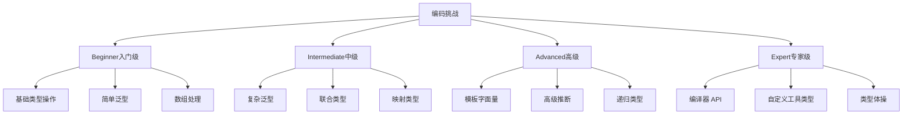

# TypeScript 编码挑战与实战练习

## 🎯 编码挑战概览

### 📊 挑战难度分级



## 🔧 基础挑战 (Beginner)

### 💡 类型操作挑战

```typescript
// Challenge 1: 类型合并器
/**
 * 挑战：创建一个类型合并器，能够将两个对象类型合并，
 * 如果键重复，后者的值类型优先
 */
type MergeObjects<T, U> = {
    // 你的实现
    [K in keyof T | keyof U]: K extends keyof U 
        ? U[K] 
        : K extends keyof T 
            ? T[K] 
            : never;
};

// 解决方案验证
type TestMerge = MergeObjects<
    { a: number; b: string },
    { b: number; c: boolean }
>; // Expected: { a: number; b: number; c: boolean }

// Challenge 2: 深度只读类型
/**
 * 挑战：创建一个深度只读类型，使所有嵌套属性都变为只读
 */
type DeepReadonly<T> = {
    readonly [K in keyof T]: T[K] extends object
        ? T[K] extends Function
            ? T[K]
            : DeepReadonly<T[K]>
        : T[K];
};

// 测试用例
interface TestData {
    id: number;
    user: {
        name: string;
        settings: {
            theme: string;
            notifications: boolean;
        };
    };
    items: Array<{
        id: string;
        title: string;
    }>;
}

type DeepReadonlyTest = DeepReadonly<TestData>;
// user.name, user.settings.theme 等都应该是 readonly

// Challenge 3: 条件类型替代
/**
 * 挑战：不使用 extends，实现一个提取所有字符串类型属性的工具类型
 */
type ExtractStringKeys<T> = {
    [K in keyof T as T[K] extends string ? K : never]: T[K];
};

// 解决方案替代：使用映射类型
type ExtractStringKeysAlt<T> = {
    [K in keyof T]: T[K] extends string ? T[K] : never;
} extends infer U 
    ? { [K in keyof U as U[K] extends never ? never : K]: U[K] }
    : never;

// Challenge 4: 数组去重类型
/**
 * 挑战：创建一个能够去重元组类型的工具类型
 */
type DeduplicateTuple<T extends readonly any[]> = T extends readonly [infer First, ...infer Rest]
    ? First extends Rest[number]
        ? DeduplicateTuple<Rest>
        : [First, ...DeduplicateTuple<Rest>]
    : [];

// 测试用例
type TestDedup = DeduplicateTuple<[1, 2, 3, 2, 1, 4]>; // Expected: [1, 2, 3, 4]
```

### 🎪 泛型挑战

```typescript
// Challenge 5: 泛型约束进阶
/**
 * 挑战：创建一个约束泛型类型，确保 T 必须有一个特定的键
 */
type RequireKey<T, K extends PropertyKey, V = any> = T & Record<K, V>;

// 应用：确保用户必须有 email
type ValidUser<T> = RequireKey<T, 'email', string>;

// Challenge 6: 递归类型深度限制
/**
 * 挑战：创建一个有限深度的递归类型，防止无限递归
 */
type LimitedDepth<T, Depth extends number = 3> = 
    Depth extends 0 
        ? T 
        : T extends object 
            ? {
                  [K in keyof T]: T[K] extends object 
                      ? LimitedDepth<T[K], Prev<Depth>>
                      : T[K];
              }
            : T;

type Prev<T extends number> = [...Array<T>, never] extends [infer A, ...infer _]
    ? A extends number ? A : never 
    : never;

// Challenge 7: 函数重载类型
/**
 * 挑战：创建一个函数类型，根据参数类型返回不同的类型
 */
type ConditionalFunction<T> = T extends number 
    ? (value: T) => string
    : T extends string 
        ? (value: T) => number
        : (value: T) => boolean;

// 使用示例
type TestNumber = ConditionalFunction<number>; // (value: number) => string
type TestString = ConditionalFunction<string>; // (value: string) => number
```

## 🚀 中级挑战 (Intermediate)

### 🔄 高级泛型应用

```typescript
// Challenge 8: 类型安全的 API 客户端
/**
 * 挑战：创建一个类型安全的 API 客户端，支持不同的 HTTP 方法
 */
interface ApiResponse<T> {
    data: T;
    status: number;
    message: string;
}

type ApiMethod = 'GET' | 'POST' | 'PUT' | 'DELETE';

type ApiConfig<T extends ApiMethod, U = any, V = any> = 
    T extends 'GET' ? {
        method: T;
        url: string;
        params?: Record<string, string>;
        response: U;
    } : {
        method: T;
        url: string;
        body: U;
        response: V;
    };

class ApiClient {
    async request<T extends ApiMethod, U, V>(
        config: ApiConfig<T, U, V>
    ): Promise<ApiResponse<V>> {
        // 实现请求逻辑
        return { data: {} as V, status: 200, message: 'Success' };
    }
}

// Challenge 9: 状态机类型
/**
 * 挑战：创建一个类型安全的状态机，确保状态转换的合法性
 */
type StateTransitionMap = {
    'idle': 'loading' | 'error';
    'loading': 'success' | 'error';
    'success': 'idle' | 'loading';
    'error': 'idle' | 'loading';
};

type AllowedTransition<From extends keyof StateTransitionMap> = 
    StateTransitionMap[From];

class StateMachine<T extends keyof StateTransitionMap> {
    private currentState: T;
    
    constructor(initialState: T) {
        this.currentState = initialState;
    }
    
    transition<U extends AllowedTransition<T>>(newState: U): void {
        // 类型安全的状态转换
        this.currentState = newState as any;
    }
    
    getState(): T {
        return this.currentState;
    }
}

// Challenge 10: 验证器类型系统
/**
 * 挑战：创建一个类型安全的验证器系统
 */
interface Validator<T, U extends T> {
    validate(value: T): value is U;
    errorMessage: string;
}

interface StringValidator extends Validator<string, string> {}
interface NumberValidator extends Validator<number, number> {}
interface EmailValidator extends Validator<string, string> {}

class TypeSafeValidator {
    static createStringValidator(minLength?: number): StringValidator {
        return {
            validate: (value): value is string => 
                typeof value === 'string' && 
                (minLength === undefined || value.length >= minLength),
            errorMessage: minLength ? 
                `String must be at least ${minLength} characters long` :
                'Value must be a valid string'
        };
    }
    
    static createEmailValidator(): EmailValidator {
        return {
            validate: (value): value is string => 
                /^[^\s@]+@[^\s@]+\.[^\s@]+$/.test(value),
            errorMessage: 'Value must be a valid email address'
        };
    }
    
    static validateValue<T, U extends T>(
        value: T,
        validator: Validator<T, U>
    ): U | string {
        if (validator.validate(value)) {
            return value;
        }
        
        return validator.errorMessage;
    }
}
```

### 🎯 模板字面量挑战

```typescript
// Challenge 11: CSS 类名生成器
/**
 * 挑战：创建一个类型安全的 CSS 类名生成器
 */
type BEMBlock = string;
type BEMModifier = string;
type BEMElement = string;

type BEMClass<
    B extends BEMBlock,
    E extends BEMElement | never = never,
    M extends BEMModifier | never = never
> = E extends never
    ? M extends never
        ? B
        : `${B}--${M}`
    : M extends never
        ? `${B}__${E}`
        : `${B}__${E}--${M}`;

// 使用示例
const buttonClass = 'button';
const primaryModifier = 'primary';
const labelElement = 'label';

type ButtonClass = BEMClass<typeof buttonClass>;
type ButtonPrimaryClass = BEMClass<typeof buttonClass, never, typeof primaryModifier>;
type ButtonLabelClass = BEMClass<typeof buttonClass, typeof labelElement>;

// Challenge 12: URL 路径验证器
/**
 * 挑战：创建一个类型安全的 URL 路径验证器
 */
type AllowedPaths = 
    | '/users'
    | '/users/:id'
    | '/posts'
    | '/posts/:id'
    | '/posts/:id/comments'
    | '/login'
    | '/register';

type ExtractParams<T extends string> = T extends `${infer _}:${infer Param}/${infer Rest}`
    ? Param | ExtractParams<`/${Rest}`>
    : T extends `${infer _}:${infer Param}`
        ? Param
        : never;

type ValidatePath<T extends string> = T extends AllowedPaths ? T : never;

type RequiredParams<P extends string> = ExtractParams<P>;

// API 路由类型
interface ApiRoute<T extends AllowedPaths> {
    path: ValidatePath<T>;
    method: 'GET' | 'POST' | 'PUT' | 'DELETE';
    params: RequiredParams<T>;
}

// Challenge 13: SQL 查询构建器
/**
 * 挑战：创建一个类型安全的 SQL 查询构建器
 */
type TableName = 'users' | 'posts' | 'comments';

type ColumnMap = {
    users: {
        id: number;
        name: string;
        email: string;
        created_at: Date;
    };
    posts: {
        id: number;
        user_id: number;
        title: string;
        content: string;
        created_at: Date;
    };
    comments: {
        id: number;
        post_id: number;
        user_id: number;
        content: string;
        created_at: Date;
    };
};

type SelectQuery<T extends TableName, K extends keyof ColumnMap[T]> = {
    type: 'SELECT';
    table: T;
    columns: K[];
    where?: WhereCondition<T>;
    orderBy?: OrderByClause<T>;
    limit?: number;
};

type WhereCondition<T extends TableName> = Partial<{
    [K in keyof ColumnMap[T]]: {
        eq?: ColumnMap[T][K];
        ne?: ColumnMap[T][K];
        gt?: ColumnMap[T][K];
        gte?: ColumnMap[T][K];
        lt?: ColumnMap[T][K];
        lte?: ColumnMap[T][K];
        in?: ColumnMap[T][K][];
        like?: string;
    };
}>;

type OrderByClause<T extends TableName> = {
    [K in keyof ColumnMap[T]]: 'ASC' | 'DESC';
};

class QueryBuilder<T extends TableName> {
    private query: Partial<SelectQuery<T, keyof ColumnMap[T]>> = {};

    from(table: T): this {
        this.query.table = table;
        this.query.type = 'SELECT';
        this.query.columns = [];
        return this;
    }

    select<K extends keyof ColumnMap[T]>(columns: K[]): SelectQuery<T, K> {
        (this.query as SelectQuery<T, K>).columns = columns;
        return this.query as SelectQuery<T, K>;
    }

    where(condition: WhereCondition<T>): this {
        this.query.where = condition;
        return this;
    }

    orderBy(clause: OrderByClause<T>): this {
        this.query.orderBy = clause;
        return this;
    }

    limit(count: number): this {
        this.query.limit = count;
        return this;
    }
}
```

## 🎭 高级挑战 (Advanced)

### 🔧 类型体操

```typescript
// Challenge 14: 深度对象操作
/**
 * 挑战：创建一个能够深度操作对象路径的工具类型
 */
type DeepPathKeys<T> = T extends object 
    ? {
          [K in keyof T]: K extends string | number
              ? T[K] extends object
                  ? T[K] extends any[]
                      ? `${K}.${number}` | `${K}.${number}.${DeepPathKeys<T[K][number]>}`
                      : `${K}.${DeepPathKeys<T[K]>}`
                  : `${K}`
              : never;
      }[keyof T]
    : never;

type DeepGet<T, Path extends string> = Path extends keyof T
    ? T[Path]
    : Path extends `${infer K}.${infer Rest}`
        ? K extends keyof T
            ? DeepGet<T[K], Rest>
            : never
        : never;

// Challenge 15: 类型安全的 JSON Schema 生成器
/**
 * 挑战：从 TypeScript 类型生成对应的 JSON Schema
 */
interface JSONSchema {
    type: string;
    properties?: Record<string, JSONSchema>;
    required?: string[];
    items?: JSONSchema;
    enum?: any[];
}

type TypeToJSONSchema<T> = T extends string
    ? { type: 'string' }
    : T extends number
        ? { type: 'number' }
        : T extends boolean
            ? { type: 'boolean' }
            : T extends undefined
                ? { type: 'null' }
                : T extends any[]
                    ? { type: 'array'; items: TypeToJSONSchema<T[number]> }
                    : T extends object
                        ? {
                              type: 'object';
                              properties: {
                                  [K in keyof T]: TypeToJSONSchema<T[K]>;
                              };
                              required: Array<Extract<keyof T, string>>;
                          }
                        : { type: 'string' }; // fallback

interface UserInterface {
    id: number;
    name: string;
    email: string;
    preferences: {
        theme: 'light' | 'dark';
        notifications: boolean;
    };
    tags: string[];
}

type UserSchema = TypeToJSONSchema<UserInterface>;

// Challenge 16: 插件系统类型
/**
 * 挑战：创建一个类型安全的插件系统
 */
interface Plugin<TConfig = any> {
    name: string;
    version: string;
    config: TConfig;
    install(app: Application<TConfig>, config: TConfig): void;
    uninstall(app: Application<TConfig>): void;
}

type PluginConfig<TPlugin extends Plugin> = TPlugin extends Plugin<infer T>
    ? T
    : never;

class Application<TPluginConfigs = {}> {
    private plugins: Map<string, Plugin<any>> = new Map();
    private configs: Map<string, any> = new Map();

    install<TPlugin extends Plugin>(
        plugin: TPlugin,
        config: PluginConfig<TPlugin>
    ): void {
        const key = `${plugin.name}@${plugin.version}`;
        
        if (this.plugins.has(key)) {
            throw new Error(`Plugin ${key} is already installed`);
        }

        plugin.install(this, config);
        this.plugins.set(key, plugin);
        this.configs.set(key, config);
    }

    uninstall<TPlugin extends Plugin>(pluginName: string): void {
        const plugin = this.plugins.get(pluginName);
        if (!plugin) {
            throw new Error(`Plugin ${pluginName} is not installed`);
        }

        plugin.uninstall(this);
        this.plugins.delete(pluginName);
        this.configs.delete(pluginName);
    }

    getPlugin<TPlugin extends Plugin>(name: string): TPlugin | undefined {
        const plugin = this.plugins.get(name);
        return plugin as TPlugin | undefined;
    }

    getAllPlugins(): Plugin<any>[] {
        return Array.from(this.plugins.values());
    }

    hasPlugin(name: string): boolean {
        return this.plugins.has(name);
    }
}
```

### 🎯 专家级挑战 (Expert)

```typescript
// Challenge 17: 编译器 API 类型
/**
 * 挑战：创建类型安全的 AST 操作工具
 */
import ts from 'typescript';

type NodeTypeVisitor<T extends ts.Node> = (node: T) => void;

class TypeScriptTransformer {
    private sourceFile: ts.SourceFile;
    private context: ts.TransformationContext;
    
    constructor(sourceFile: ts.SourceFile, context: ts.TransformationContext) {
        this.sourceFile = sourceFile;
        this.context = context;
    }
    
    transform<T extends ts.Node>(
        nodeType: ts.SyntaxKind,
        visitor: NodeTypeVisitor<T>
    ): ts.Node {
        const visit = (node: ts.Node): ts.Node => {
            if (node.kind === nodeType) {
                visitor(node as T);
                return node;
            }
            
            return ts.visitNode(node, visit);
        };
        
        return ts.visitNode(this.sourceFile, visit);
    }
    
    // 类型安全的节点查找器
    static findNodesOfType<T extends ts.Node>(
        sourceFile: ts.SourceFile,
        nodeType: ts.SyntaxKind
    ): T[] {
        const nodes: T[] = [];
        
        const visit = (node: ts.Node): void => {
            if (node.kind === nodeType) {
                nodes.push(node as T);
            }
            
            ts.forEachChild(node, visit);
        };
        
        visit(sourceFile);
        return nodes;
    }
    
    // 类型安全的转换器创建
    static createTransformer<T extends ts.Node>(
        nodeType: ts.SyntaxKind,
        transformer: (node: T) => ts.Node | undefined
    ): ts.TransformerFactory<ts.SourceFile> {
        return (context: ts.TransformationContext) => {
            return (sourceFile: ts.SourceFile) => {
                const visit = (node: ts.Node): ts.Node | undefined => {
                    if (node.kind === nodeType) {
                        return transformer(node as T);
                    }
                    
                    return ts.visitNode(node, visit);
                };
                
                return ts.visitNode(sourceFile, visit);
            };
        };
    }
}

// Challenge 18: 类型级别的计算器
/**
 * 挑战：在类型级别实现基本数学运算
 */
type ToNumber<S extends string> = S extends `${infer N}` 
    ? N extends keyof StringToNumberMap 
        ? StringToNumberMap[N]
        : never
    : never;

type StringToNumberMap = {
    '0': 0; '1': 1; '2': 2; '3': 3; '4': 4;
    '5': 5; '6': 6; '7': 7; '8': 8; '9': 9;
};

type Add<A extends number, B extends number> = 
    A extends 0 ? B :
    B extends 0 ? A :
    A extends 1 ? B extends 1 ? 2 : 
                   B extends 2 ? 3 : 
                   B extends 3 ? 4 : 
                   B extends 4 ? 5 : 
                   B extends 5 ? 6 : 
                   B extends 6 ? 7 : 
                   B extends 7 ? 8 : 
                   B extends 8 ? 9 : 
                   B extends 9 ? 10 : never :
    never; // 简化版，仅支持小数字

// Challenge 19: 依赖注入类型系统
/**
 * 挑战：创建类型安全的依赖注入容器
 */
interface ServiceDefinition<T = any, TDependencyMap = any> {
    token: string | symbol;
    factory: (...args: any[]) => T;
    dependencies: Array<keyof TDependencyMap>;
    singleton: boolean;
}

class TypeSafeContainer {
    private services = new Map<string | symbol, ServiceDefinition>();
    private instances = new Map<string | symbol, any>();

    register<TService, TDependencyMap = {}>(
        token: string | symbol,
        serviceDef: ServiceDefinition<TService, TDependencyMap>
    ): void {
        this.services.set(token, serviceDef);
    }

    resolve<TService>(token: string | symbol): TService {
        const serviceDef = this.services.get(token);
        
        if (!serviceDef) {
            throw new Error(`Service ${String(token)} not found`);
        }

        if (serviceDef.singleton && this.instances.has(token)) {
            return this.instances.get(token);
        }

        const dependencies = serviceDef.dependencies.map(dep => this.resolve(dep));
        const instance = serviceDef.factory(...dependencies);

        if (serviceDef.singleton) {
            this.instances.set(token, instance);
        }

        return instance;
    }
}
```

## 📚 挑战解决方案

### 🔍 测试与验证

```typescript
// 解决方案验证工具
class ChallengeValidator {
    static validateChallenge<T>(
        challengeId: string,
        testCases: Array<{ input: any; expected: any }>,
        implementation: (input: any) => any
    ): ValidationResult {
        const results: Array<{ passed: boolean; error?: string }> = [];
        
        for (const testCase of testCases) {
            try {
                const result = implementation(testCase.input);
                
                if (this.deepEqual(result, testCase.expected)) {
                    results.push({ passed: true });
                } else {
                    results.push({
                        passed: false,
                        error: `Expected ${JSON.stringify(testCase.expected)}, got ${JSON.stringify(result)}`
                    });
                }
            } catch (error) {
                results.push({
                    passed: false,
                    error: `Implementation error: ${error instanceof Error ? error.message : 'Unknown error'}`
                });
            }
        }
        
        const passed = results.filter(r => r.passed).length;
        const total = results.length;
        
        return {
            challengeId,
            passed,
            total,
            success: passed === total,
            failures: results.filter(r => !r.passed).map(r => r.error)
        };
    }
    
    private static deepEqual(a: any, b: any): boolean {
        if (a === b) return true;
        
        if (typeof a !== typeof b) return false;
        
        if (typeof a !== 'object' || a === null || b === null) return false;
        
        const keysA = Object.keys(a);
        const keysB = Object.keys(b);
        
        if (keysA.length !== keysB.length) return false;
        
        for (const key of keysA) {
            if (!keysB.includes(key)) return false;
            if (!this.deepEqual(a[key], b[key])) return false;
        }
        
        return true;
    }
}

interface ValidationResult {
    challengeId: string;
    passed: number;
    total: number;
    success: boolean;
    failures: string[];
}
```

### 🔗 相关深入学习

- [[01-Type-System入门]] - 类型系统基础
- [[02-Primitive-Types完全指南]] - 基础类型操作
- [[01-Generics泛型精通]] - 泛型高级应用

---
*💡 编码挑战是掌握 TypeScript 类型系统的最佳方式，通过实际问题和解决方案，能迅速提升类型编程能力*
