# TypeScript 项目模板集合

## 🎯 项目模板概览

### 📊 模板分类体系

```mermaid
graph TD
    A[TypeScript Project Templates] --> B[Frontend Templates]
    A --> C[Backend Templates]
    A --> D[Full Stack Templates]
    A --> E[Library Templates]
    A --> F[CLI Templates]
    
    B --> B1[React Applications]
    B --> B2[Vue Applications]
    B --> B3[Svelte Applications]
    B --> B4[Angular Applications]
    
    C --> C1[Express APIs]
    C --> C2[NestJS Applications]
    C --> C3[Fastify Services]
    C --> C4[GraphQL Servers]
    
    D --> D1[Next.js Full Stack]
    D --> D2[Nuxt.js Applications]
    D --> D3[T3 Stack Projects]
    D --> D4[MERN Stack Apps]
    
    E --> E1[NPM Libraries]
    E --> E2[UI Component Libraries]
    E --> E3[Utility Libraries]
    E --> E4[Type-only Libraries]
    
    F --> F1[Development Tools]
    F --> F2[Build Scripts]
    F --> F3[Code Generators]
    F --> F4[DevOps Tools]
```



## 🔧 Frontend Application Templates

### 💡 React + TypeScript Template

```typescript
// React + TypeScript Starter Template
// 项目结构
interface ReactTemplateStructure {
    components: ComponentStructure[];
    hooks: HookStructure[];
    pages: PageStructure[];
    services: ServiceStructure[];
    utils: UtilityStructure[];
    types: TypeStructure[];
}

interface ComponentStructure {
    directory: string;
    component: ComponentDefinition;
    stories?: StorybookStories;
    tests: TestSuite;
    exportFile: ExportFile;
}

interface ComponentDefinition {
    name: string;
    props: PropsDefinition;
    defaultProps?: DefaultProps;
    examples: Example[];
}

// Implementation
const ReactTypeScriptTemplate = {
    name: "react-typescript-starter",
    version: "1.0.0",
    description: "Production-ready React + TypeScript starter template",
    
    dependencies: {
        react: "^18.0.0",
        "react-dom": "^18.0.0",
        "@types/react": "^18.0.0",
        "@types/react-dom": "^18.0.0",
        "typescript": "^5.0.0",
        "@types/node": "^20.0.0"
    },
    
    devDependencies: {
        vite: "^5.0.0",
        "@vitejs/plugin-react": "^4.0.0",
        "eslint": "^8.0.0",
        "prettier": "^3.0.0",
        "@storybook/react": "^7.0.0",
        "vitest": "^1.0.0",
        "jsdom": "^23.0.0"
    },
    
    scripts: {
        "dev": "vite",
        "build": "tsc && vite build",
        "preview": "vite preview",
        "test": "vitest",
        "test:ui": "vitest --ui",
        "storybook": "storybook dev -p 6006",
        "build-storybook": "storybook build",
        "lint": "eslint . --ext ts,tsx --report-unused-disable-directives --max-warnings 0",
        "format": "prettier --write ."
    },
    
    // 组件模板生成器
    generateComponent: async (name: string): Promise<void> => {
        const componentTemplate = `
import React from 'react';
import clsx from 'clsx';

export interface ${name}Props {
  className?: string;
  children?: React.ReactNode;
  // Add more props as needed
}

export const ${name}: React.FC<${name}Props> = ({
  className,
  children,
  ...rest
}) => {
  return (
    <div 
      className={clsx('[component-base-classes]', className)}
      {...rest}
    >
      {children}
    </div>
  );
};

${name}.displayName = '${name}';
`;

        const testTemplate = `
import React from 'react';
import { render, screen } from '@testing-library/react';
import { ${name} } from './${name}';

describe('${name}', () => {
  it('renders correctly', () => {
    render(<${name}>Test content</${name}>);
    expect(screen.getByText('Test content')).toBeInTheDocument();
  });

  it('applies custom className', () => {
    render(<${name} className="custom-class">Test</${name}>);
    expect(screen.getByText('Test').parentElement).toHaveClass('custom-class');
  });
});
`;

        const storyTemplate = `
import type { Meta, StoryObj } from '@storybook/react';
import { ${name} } from './${name}';

const meta: Meta<typeof ${name}> = {
  title: 'Components/${name}',
  component: ${name},
  parameters: {
    layout: 'centered',
  },
  tags: ['autodocs'],
};

export default meta;
type Story = StoryObj<typeof meta>;

export const Default: Story = {
  args: {
    children: 'Default ${name} content',
  },
};

export const WithCustomClass: Story = {
  args: {
    position: 'Custom className',
    children: 'Custom styled ${name}',
    className: 'custom-class',
  },
};
`;

        // 写入文件
        await Promise.all([
            writeFile(`src/components/${name}/${name}.tsx`, componentTemplate),
            writeFile(`src/components/${name}/${name}.test.tsx`, testTemplate),
            writeFile(`src/components/${name}/${name}.stories.tsx`, storyTemplate),
            writeFile(`src/components/${name}/index.ts`, `export { ${name} } from './${name}';`)
        ]);
    }
};

// Hook模板生成器
const generateHook = async (name: string): Promise<void> => {
    const hookTemplate = `
import { useState, useEffect, useCallback } from 'react';

interface Use${name}Options {
  // Define options interface
}

interface Use${name}Return {
  // Define return interface
}

export function use${name}(options?: Use${name}Options): Use${name}Return {
  // Implementation here
  throw new Error('Not implemented');
}
`;

    await writeFile(`src/hooks/use${name}.ts`, hookTemplate);
    await writeFile(`src/hooks/use${name}.test.ts`, `
import { renderHook } from '@testing-library/react';
import { use${name} } from './use${name}';

describe('use${name}', () => {
  it('should return expected interface', () => {
    const { result } = renderHook(() => use${name}());
    expect(result.current).toBeDefined();
  });
});
`);
};
```

### 🎪 Vue.js + TypeScript Template

```typescript
// Vue.js + TypeScript Template
const VueTypeScriptTemplate = {
    name: "vue-typescript-starter",
    version: "1.0.0",
    description: "Production-ready Vue.js + TypeScript template",
    
    dependencies: {
        vue: "^3.4.0",
        "@vue/runtime-core": "^3.4.0",
        "@vue/runtime-dom": "^3.4.0",
        typescript: "^5.0.0"
    },
    
    devDependencies: {
        vite: "^5.0.0",
        "@vitejs/plugin-vue": "^4.0.0",
        vue-tsc: "^1.8.0",
        vue-tsc: "^1.8.0",
        "@vue/test-utils": "^2.4.0",
        "vitest": "^1.0.0"
    },
    
    // Vue组件模板
    generateVueComponent: async (name: string): Promise<void> => {
        const vueTemplate = `
<template>
  <div :class="[$style.container, className]">
    <slot />
  </div>
</template>

<script setup lang="ts">
import { computed } from 'vue';
import { $style } from './${name}.module.scss';

interface Props {
  className?: string;
  variant?: 'default' | 'primary' | 'secondary';
}

const props = withDefaults(defineProps<Props>(), {
  variant: 'default'
});

const variantClass = computed(() => $style[\`variant-\${props.variant}\`]);
</script>

<style module lang="scss">
.container {
  padding: 1rem;
  border-radius: 4px;
  
  &.variant-default {
    background-color: var(--color-background-default);
  }
  
  &.variant-primary {
    background-color: var(--color-background-primary);
    color: var(--color-text-primary);
  }
  
  &.variant-secondary {
    background-color: var(--color-background-secondary);
    color: var(--color-text-secondary);
  }
}
</style>
`;

        const testTemplate = `
import { mount } from '@vue/test-utils';
import { ${name} } from './${name}.vue';

describe('${name}', () => {
  it('renders correctly', () => {
    const wrapper = mount(${name}, {
      slots: {
        default: 'Test content'
      }
    });
    
    expect(wrapper.text()).toBe('Test content');
    expect(wrapper.classes()).toContain('container');
  });

  it('applies variant class', () => {
    const wrapper = mount(${name}, {
      props: {
        variant: 'primary'
      }
    });
    
    expect(wrapper.classes()).toContain('variant-primary');
  });
});
`;

        await Promise.all([
            writeFile(`src/components/${name}/${name}.vue`, vueTemplate),
            writeFile(`src/components/${name}/${name}.test.ts`, testTemplate)
        ]);
    }
};
```

## 🚀 Backend Service Templates

### 🔄 Express.js + TypeScript Template

```typescript
// Express.js + TypeScript Backend Template
const ExpressTypeScriptTemplate = {
    name: "express-typescript-api",
    version: "1.0.0",
    description: "Production-ready Express.js + TypeErrorScript API template",
    
    dependencies: {
        express: "^4.18.0",
        cors: "^2.8.5",
        helmet: "^7.1.0",
        "express-rate-limit": "^7.1.0",
        morgan: "^1.10.0",
        typescript: "^5.0.0"
    },
    
    devDependencies: {
        "@types/express": "^4.17.0",
        "@types/cors": "^2.8.0",
        "@types/morgan": "^1.9.0",
        "nodemon": "^3.0.0",
        "ts-node": "^10.9.0",
        "jest": "^29.0.0",
        "@types/jest": "^29.0.0",
        "supertest": "^6.3.0",
        "@types/supertest": "^2.0.0"
    },
    
    // 控制器模板
    generateController: async (name: string): Promise<void> => {
        const controllerTemplate = `
import { Request, Response } from 'express';
import { ${name}Service } from '../services/${name}Service';
import { asyncHandler } from '../utils/asyncHandler';
import { ApiResponse } from '../types/api';

export class ${name}Controller {
  private service: ${name}Service;

  constructor(service: ${name}Service) {
    this.service = service;
  }

  getAll = asyncHandler(async (req: Request, res: Response): Promise<void> => {
    const results = await this.service.getAll(req.query);
    
    const response: ApiResponse = {
      success: true,
      data: results,
      message: '${name} retrieved successfully',
      timestamp: new Date().toISOString()
    };
    
    res.status(200).json(response);
  });

  getById = asyncHandler(async (req: Request, res: Response): Promise<void> => {
    const { id } = req.params;
    const result = await this.service.getById(id);
    
    if (!result) {
      res.status(404).json({
        success: false,
        message: '${name} not found',
        timestamp: new Date().toISOString()
      });
      return;
    }

    res.status(200).json({
      success: true,
      data: result,
      message: '${name} retrieved successfully',
      timestamp: new Date().toISOString()
    });
  });

  create = asyncHandler(async (req: Request, res: Response): Promise<void> => {
    const data = req.body;
    const result = await this.service.create(data);
    
    res.status(201).json({
      success: true,
      data: result,
      message: '${name} created successfully',
      timestamp: new Date().toISOString()
    });
  });

  update = asyncHandler(async (req: Request, res: Response): Promise<void> => {
    const { id } = req.params;
    const data = req.body;
    
    const result = await this.service.update(id, data);
    
    if (!result) {
      res.status(404).json({
        success: false,
        message: '${name} not found',
        timestamp: new Date().toISOString()
      });
      return;
    }

    res.status(200).json({
      success: true,
      data: result,
      message: '${name} updated successfully',
      timestamp: new Date().toISOString()
    });
  });

  delete = asyncHandler(async (req: Request, res: Response): Promise<void> => {
    const { id } = req.params;
    const deleted = await this.service.delete(id);
    
    if (!deleted) {
      res.status(404).json({
        success: false,
        message: '${name} not found',
        timestamp: new Date().toISOString()
      });
      return;
    }

    res.status(200).json({
      success: true,
      message: '${name} deleted successfully',
      timestamp: new Date().toISOString()
    });
  });
}
`;

        const serviceTemplate = `
import { ${name} } from '../models/${name}';

export class ${name}Service {
  constructor(private repository: ${name}Repository) {}

  async getAll(filters?: any): Promise<${name}[]> {
    return await this.repository.findAll(filters);
  }

  async getById(id: string): Promise<${name} | null> {
    return await this.repository.findById(id);
  }

  async create(data: Create${name}Data): Promise<${name}> {
    // Add business logic here
    return await this.repository.create(data);
  }

  async update(id: string, data: Partial<${name}>): Promise<${name} | null> {
    const exists = await this.repository.findById(id);
    if (!exists) return null;
    
    return await this.repository.update(id, data);
  }

  async delete(id: string): Promise<boolean> {
    const exists = await this.repository.findById(id);
    if (!exists) return false;
    
    await this.repository.delete(id);
    return true;
  }
}

interface Create${name}Data {
  // Define creation data structure
}

interface ${name}Repository {
  findAll(filters?: any): Promise<${name}[]>;
  findById(id: string): Promise<${name} | null>;
  create(data: Create${name}Data): Promise<${name}>;
  update(id: string, data: Partial<${name}>): Promise<${name}>;
  delete(id: string): Promise<void>;
}
`;

        const testTemplate = `
import request from 'supertest';
import { app } from '../app';

describe('/api/${name.toLowerCase()}s', () => {
  describe('GET /', () => {
    it('should return list of ${name}s', async () => {
      const response = await request(app)
        .get('/api/${name.toLowerCase()}s')
        .expect(200);

      expect(response.body.success).toBe(true);
      expect(Array.isArray(response.body.data)).toBe(true);
    });
  });

  describe('GET /:id', () => {
    it('should return ${name} by id', async () => {
      const response = await request(app)
        .get('/api/${name.toLowerCase()}s/valid-id')
        .expect(200);

      expect(response.body.success).toBe(true);
      expect(response.body.data).toBeDefined();
    });

    it('should return 404 for non-existent ${name}', async () => {
      await request(app)
        .get('/api/${name.toLowerCase()}s/non-existent-id')
        .expect(404);
    });
  });
});
`;

        await Promise.all([
            writeFile(`src/controllers/${name}Controller.ts`, controllerTemplate),
            writeFile(`src/services/${name}Service.ts`, serviceTemplate),
            writeFile(`src/tests/${name}Controller.test.ts`, testTemplate)
        ]);
    }
};
```

### 🎯 NestJS Template Generator

```typescript
// NestJS + TypeScript Template
const NestJSTemplate = {
    name: "nestjs-typescript-template",
    description: "Production-ready NestJS application template",
    
    generateNestModule: async (name: string): Promise<void> => {
        const moduleTemplate = `
import { Module } from '@nestjs/common';
import { ${name}Controller } from './${name.toLowerCase()}.controller';
import { ${name}Service } from './${name.toLowerCase()}.service';

@Module({
  controllers: [${name}Controller],
  providers: [${name}Service],
  exports: [${name}Service],
})
export class ${name}Module {}
`;

        const controllerTemplate = `
import {
  Controller,
  Get,
  Post,
  Body,
  Patch,
  Param,
  Delete,
  HttpStatus,
  HttpCode,
} from '@nestjs/common';
import { ${name}Service } from './${name.toLowerCase()}.service';
import { Create${name}Dto } from './dto/create-${name.toLowerCase()}.dto';
import { Update${name}Dto } from './dto/update-${name.toLowerCase()}.dto';

@Controller('${name.toLowerCase()}')
export class ${name}Controller {
  constructor(private readonly ${name.toLowerCase()}Service: ${name}Service) {}

  @Post()
  @HttpCode(HttpStatus.CREATED)
  create(@Body() create${name}Dto: Create${name}Dto) {
    return this.${name.toLowerCase()}Service.create(create${name}Dto);
  }

  @Get()
  findAll() {
    return this.${name.toLowerCase()}Service.findAll();
  }

  @Get(':id')
  findOne(@Param('id') id: string) {
    return this.${name.toLowerCase()}Service.findOne(+id);
  }

  @Patch(':id')
  update(@Param('id') id: string, @Body() update${name}Dto: Update${name}Dto) {
    return this.${name.toLowerCase()}Service.update(+id, update${name}Dto);
  }

  @Delete(':id')
  @HttpCode(HttpStatus.NO_CONTENT)
  remove(@Param('id') id: string) {
    return this.${name.toLowerCase()}Service.remove(+id);
  }
}
`;

        const dtoTemplate = `
import { IsString, IsOptional, IsEmail } from 'class-validator';

export class Create${name}Dto {
  @IsString()
  name: string;

  @IsEmail()
  @IsOptional()
  email?: string;

  @IsOptional()
  @IsString()
  description?: string;
}

export class Update${name}Dto {
  @IsOptional()
  @IsString()
  name?: string;

  @IsOptional()
  @IsEmail()
  email?: string;

  @IsOptional()
  @IsString()
  description?: string;
}
`;

        await Promise.all([
            writeFile(`src/${name.toLowerCase()}/${name.toLowerCase()}.module.ts`, модульTemplate),
            writeFile(`src/${name.toLowerCase()}/${name.toLowerCase()}.controller.ts`, controllerTemplate),
            writeFile(`src/${name.toLowerCase()}/dto/create-${name.toLowerCase()}.dto.ts`, dtoTemplate),
            writeFile(`src/${name.toLowerCase()}/dto/update-${name.toLowerCase()}.dto.ts`, dtoTemplate.replace('Create', 'Update'))
        ]);
    }
};
```

## 🌐 Full Stack Templates

### 📦 Next.js Full Stack Template

```typescript
// Next.js 14 Full Stack Template
const NextJSFullStackTemplate = {
    name: "nextjs-fullstack-template",
    description: "Production-ready Next.js 14 with App Router template",
    
    generatePage: async (name: string): Promise<void> => {
        const pageTemplate = `
import { Metadata } from 'next';
import { ${name}Client } from './components/${name}Client';

export const metadata: Metadata = {
  title: '${name} | Your App Name',
  description: '${name} page description',
};

interface ${name}PageProps {
  searchParams: { [key: string]: string | string[] | undefined };
}

export default function ${name}Page({ searchParams }: ${name}PageProps) {
  return (
    <div className="container mx-auto px-4 py-8">
      <h1 className="text-3xl font-bold mb-6">${name}</h1>
      <${name}Client searchParams={searchParams} />
    </div>
  );
}
`;

        const clientTemplate = `
'use client';

import { useState, useEffect } from 'react';
import { useRouter } from 'next/navigation';

interface ${name}ClientProps {
  searchParams: { [key: string]: string | string[] | undefined };
}

export function ${name}Client({ searchParams }: ${name}ClientProps) {
  const [loading, setLoading] = useState(false);
  const router = useRouter();

  // Client-side logic here

  return (
    <div>
      {/* Component JSX */}
    </div>
  stored );
}
`;

        const apiRouteTemplate = `
import { NextRequest, NextResponse } from 'next/server';

export async function GET(request: NextRequest) {
  try {
    // API logic here
    
    return NextResponse.json({ 
      success: true, 
      data: {}, 
      message: 'Success' 
    });
  } catch (error) {
    return NextResponse.json(
      { success: false, message: 'Internal Server Error' },
      { status: 500 }
    );
  }
}

export async function POST(request: NextRequest) {
  try {
    const body = await request.json();
    
    // API logic here
    
    return NextResponse.json({ 
      success: true, 
      data: {}, 
      message: 'Created' 
    }, { status: 201 });
  } catch (error) {
    return NextResponse.json(
      { success: false, message: 'Bad Request' },
      { status: 400 }
    );
  }
}
`;

        await Promise.all([
            writeFile(`app/${name.toLowerCase()}/page.tsx`, pageTemplate),
            writeFile(`app/${name.toLowerCase()}/components/${name}Client.tsx`, clientTemplate),
            writeFile(`app/api/${name.toLowerCase()}/route.ts`, apiRouteTemplate)
        ]);
    }
};
```

### 🔗 相关深入学习

- [[01-Exercises练习题]] - 实践练习题集
- [[02-Coding-Challenges编码挑战]] - 编码挑战题库
- [[01-Quick-Check快速检查]] - 快速知识检查

---
*💡 项目模板能够快速启动开发工作，选择合适的模板可以显著提高开发效率和代码质量*
