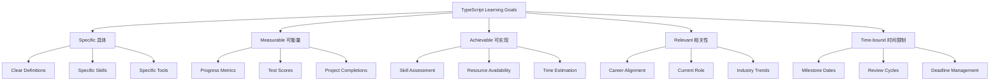

# TypeScript 学习目标规划指南

## 🎯 个性化学习目标设定

### 📊 SMART目标框架



## 🔧 目标设定与跟踪系统

### 💡 智能目标规划器

```typescript
// Learning Goals Planning System
interface LearningGoal {
    id: GoalId;
    title: string;
    description: string;
    category: GoalCategory;
    level: DifficultyLevel;
    priority: GoalPriority;
    relevance: RelevanceScore;
    
    // SMART Criteria
    smart: SMARTCriteria;
    
    // Timeline and Progress
    timeline: GoalTimeline;
    milestones: Milestone[];
    progress: ProgressTracker;
    
    // Resources and Dependencies
    resources: ResourceRequirement[];
    prerequisites: GoalId[];
    dependencies: DependencyMap;
    
    // Assessment and Validation
    assessment: AssessmentCriteria;
    validation: ValidationDefinition;
    
    // Context and Environment
    context: LearningContext;
    tags: string[];
    
    // Status and Management
    status: GoalStatus;
    createdAt: Date;
    updatedAt: Date;
    targetCompletion: Date;
    actualCompletion?: Date;
}

interface SMARTCriteria {
    specific: {
        what: string;           // What exactly will be accomplished?
        why: string;            // Why is this important?
        where: string;          // Where will this be applied?
        when: string;           // When will this be achieved?
        who: string;            // Who is this for?
    };
    
    measurable: {
        quantifiableMetrics: Metric[];
        successCriteria: SuccessCriterion[];
        progressIndicators: ProgressIndicator[];
    };
    
    achievable: {
        resourceAssessment: ResourceAssessment;
        skillGapAnalysis: SkillGap;
        feasibilityScore: number;
        riskFactors: RiskFactor[];
    };
    
    relevant: {
        careerAlignment: AlignmentScore;
        personalGoals: string[];
        industryTrends: TrendRelevance;
        businessValue: ValueScore;
    };
    
    timeBound: {
        timeline: TimelineDefinition;
        milestones: MilestoneDate[];
        reviews: ReviewSchedule;
        contingencies: ContingencyPlan[];
    };
}

interface ProgressTracker {
    overallProgress: ProgressPercentage;
    milestoneProgress: Map<MilestoneId, ProgressPercentage>;
    timeSpent: Duration;
    timeRemaining: Duration;
    velocity: ProgressVelocity;
    efficiency: EfficiencyScore;
    
    // Detailed tracking
    activities: LearningActivity[];
    achievements: Achievement[];
    challenges: Challenge[];
    reflections: Reflection[];
    
    // Analytics
    analytics: ProgressAnalytics;
    trends: ProgressTrend[];
    predictions: ProgressPrediction[];
}

// Goal Categories and Templates
interface GoalTemplate {
    id: string;
    name: string;
    category: GoalCategory;
    level: DifficultyLevel;
    estimatedDuration: Duration;
    coreContent: ContentOutline;
    assessmentStrategy: AssessmentStrategy;
    recommendedResources: string[];
    successMetric: SuccessMetric[];
}

const GoalTemplates: Record<GoalCategory, GoalTemplate[]> = {
    FOUNDATION: [
        {
            id: 'ts-fundamentals',
            name: 'TypeScript Fundamentals Mastery',
            category: 'FOUNDATION',
            level: 'BEGINNER',
            estimatedDuration: 'Duration: 4-6 weeks',
            coreContent: {
                topics: [
                    'Basic Types (string, number, boolean, array, object)',
                    'Interfaces and Type Aliases',
                    'Functions and their types',
                    'Classes and Inheritance',
                    'Module Systems',
                    'Configuration (tsconfig.json)'
                ],
                practicalProjects: [
                    'Simple Calculator Application',
                    'Basic CRUD Operations',
                    'Input Validation System'
                ]
            },
            assessmentStrategy: {
                knowledgeTests: ['Basic Type Quiz', 'Interface Design Test'],
                practicalAssessments: ['Code Review Exercise', 'Debugging Challenge'],
                milestoneCheckpoints: ['Type System Understanding', 'Project Completion']
            },
            recommendedResources: [
                'TypeScript Official Handbook',
                'TypeScript Playground',
                'Basic TypeScript Tutorial'
            ],
            successMetric: [
                'Score 90%+ on basic type knowledge test',
                'Complete 3 practical projects',
                'Demonstrate understanding in code review'
            ]
        }
    ],
    
    INTERMEDIATE: [
        {
            id: 'advanced-types',
            name: 'Advanced Type System Proficiency',
            category: 'INTERMEDIATE',
            level: 'INTERMEDIATE',
            estimatedDuration: 'Duration: 6-8 weeks',
            coreContent: {
                topics: [
                    'Generic Programming',
                    'Conditional Types',
                    'Mapped Types',
                    'Template Literal Types',
                   <｜tool▁calls▁end｜>Utility Types',
                    'Type Guards and Assertions'
                ],
                practicalProjects: [
                    'Generic Utility Library',
                    'API Response Type System',
                    'Form Validation Framework'
                ]
            },
            assessmentStrategy: {
                knowledgeTests: ['Advanced Types Quiz', 'Generic Programming Challenge'],
                practicalAssessments: ['Complex Type Design', 'Performance Optimization'],
                milestoneCheckpoints: ['Generic Mastery', 'Type Design Patterns']
            },
            recommendedResources: [
                'TypeScript Deep Dive',
                'Type Challenges Repository',
                'Advanced TypeScript Patterns'
            ],
            successMetric: [
                'Solve 20+ Type Challenges',
                'Design 5+ complex type systems',
                'Optimize existing codebase with advanced types'
            ]
        }
    ],
    
    ADVANCED: [
        {
            id: 'enterprise-patterns',
            name: 'Enterprise TypeScript Patterns',
            category: 'ADVANCED',
            level: 'ADVANCED',
            estimatedDuration: 'Duration: 8-12 weeks',
            coreContent: {
                topics: [
                    'Design Patterns Implementation',
                    'Architecture Patterns (DDD, Clean Architecture)',
                    'Performance Optimization',
                    'Testing Strategies',
                    'CI/CD Integration',
                    'Code Quality and Maintainability'
                ],
                practicalProjects: [
                    'Microservices Architecture',
                    'Complete E-commerce Platform',
                    'Real-time Dashboard System'
                ]
            },
            assessmentStrategy: {
                knowledgeTests: ['Architecture Design Test', 'Performance Optimization Quiz'],
                practicalAssessments: ['Large-scale Project', 'Team Code Review'],
                milestoneCheckpoints: ['Pattern Implementation', 'Architecture Decision']
            },
            recommendedResources: [
                'Enterprise TypeScript Patterns',
                'Clean Architecture in TypeScript',
                'Performance Optimization Guide'
            ],
            successMetric: [
                'Lead architecture design for large project',
                'Implement 5+ design patterns',
                'Achieve 90%+ code coverage'
            ]
        }
    ]
};

// Personalized Goal Generator
class PersonalizedGoalGenerator {
    constructor(
        private userProfile: UserProfile,
        private skillAssessment: SkillAssessment,
        private careerGoals: CareerGoals
    ) {}
    
    generateGoals(): PersonalizedGoalPlan {
        const analysis = this.analyzeUserProfile();
        const gaps = this.identifySkillGaps();
        const opportunities = this.identifyOpportunities();
        
        return {
            strategicGoals: this.generateStrategicGoals(analysis),
            tacticalGoals: this.generateTacticalGoals(gaps),
            operationalGoals: this.generateOperationalGoals(),
            
            timeline: this.createTimeline(),
            riskMitigation: this.identifyRiskMitigation(),
            
            successMetrics: this.defineSuccessMetrics(),
            reviewSchedule: this.createReviewSchedule(),
            
            personalizedRecommendations: this.generateRecommendations()
        };
    }
    
    private analyzeUserProfile(): UserAnalysis {
        return {
            currentSkills: this.assessCurrentSkills(),
            experienceLevel: this.determineExperienceLevel(),
            learningStyle: this.identifyLearningStyle(),
            
            timeAvailability: this.assessTimeAvailability(),
            resourceConstraints: this.identifyConstraints(),
            motivationFactors: this.analyzeMotivation(),
            
            careerStage: this.determineCareerStage(),
            industryContext: this.analyzeIndustryContext(),
            technologyStack: this.assessCurrentTechStack()
        };
    }
    
    private generateStrategicGoals(analysis: UserAnalysis): StrategicGoal[] {
        const goals: StrategicGoal[] = [];
        
        // Career-focused strategic goals
        if (analysis.careerStage === 'MID_LEVEL') {
            goals.push(this.createStrategicGoal({
                title: 'Become Senior TypeScript Developer',
                timeframe: 'Duration: 12-18 months',
                focus: 'Leadership and Architecture',
                outcome: 'Ready for senior developer role'
            }));
        }
        
        // Industry-specific goals
        if (analysis.industryContext.includes('FINANCIAL_SERVICES')) {
            goals.push(this.createStrategicGoal({
                title: 'Master TypeScript for Financial Applications',
                timeframe: 'Duration: 8-10 months', 
                focus: 'Security and Performance',
                outcome: 'Financial industry expertise'
            }));
        }
        
        return goals;
    }
    
    private generateTacticalGoals(gaps: SkillGap[]): TacticalGoal[] {
        return gaps.map(gap => this.createTacticalGoal(gap));
    }
    
    private createStrategicGoal(params: StrategicGoalParams): StrategicGoal {
        return {
            id: this.generateGoalId(),
            ...params,
            category: 'STRATEGIC',
            priority: 'HIGH',
            relevance: this.calculateRelevance(params),
            smart: this.developSMARTCriteria(params),
            assessment: this.designStrategicAssessment(params),
            progressTracking: this.setupProgressTracking()
        };
    }
}

// Progress Tracking Dashboard
interface ProgressDashboard {
    overviewCards: OverviewCard[];
    progressCharts: ProgressChart[];
    achievementFeed: Achievement[];
    upcomingMilestones: UpcomingMilestone[];
    recommendations: Recommendation[];
    
    // Performance metrics
    performanceMetrics: PerformanceMetrics;
    efficiencyTrends: EfficiencyTrend[];
    productivityInsights: ProductivityAnalysis;
    
    // Social features
    leaderboard?: LeaderboardEntry[];
    communityAchievements: CommunityAchievement[];
    peerComparison: PeerComparisonData;
}

interface ProgressAnalytics {
    timeSeriesData: ProgressDataPoint[];
    trendAnalysis: TrendAnalysis[];
    predictiveModeling: PredictiveAnalysis;
    
    // Behavioral analysis
    learningPatterns: LearningPattern[];
    optimalStudyTimes: StudyTimeAnalysis;
    effectiveResources: ResourceEffectiveness[];
    
    // Performance optimization
    bottlenecks: BottleneckAnalysis[];
    improvementOpportunities: ImprovementOpportunity[];
    personalizedRecommendations: PersonalizedRecommendation[];
}

// Achievement System
interface AchievementSystem {
    achievements: Achievement[];
    badges: Badge[];
    certifications: Certification[];
    
    // Levels and progression
    levels: Level[]; 
    progressionPath: ProgressionPath;
    rewards: Reward[];
    
    // Social features
    sharing: SocialSharing;
    competitions: Competition[];
    
    // Gamification
    points: PointsSystem;
    streaks: StreakTracking;
    challenges: Challenge[];
}

interface Achievement {
    id: AchievementId;
    title: string;
    description: string;
    category: AchievementCategory;
    rarity: AchievementRarity;
    
    criteria: AchievementCriteria;
    unlockedAt?: Date;
    
    // Rewards and benefits
    rewards: Reward[];
    unlocks: Unlockable[];
    
    // Metadata
    icon: string;
    color: string;
    displayOrder: number;
}

// Goal Review and Optimization
class GoalOptimizer {
    constructor(private progressData: ProgressData) {}
    
    optimizeGoals(): OptimizedGoalPlan {
        return {
            optimizedGoals: this.applyOptimizations(),
            resourceRecommendations: this.recommendResources(),
            scheduleAdjustments: this.adjustSchedule(),
            
            riskAssessment: this.assessRisks(),
            mitigationStrategies: this.developMitigation(),
            
            successPrediction: this.predictSuccess(),
            alternativePaths: this.alternativePaths()
        };
    }
    
    private applyOptimizations(): OptimizedGoal[] {
        const optimizations: GoalOptimization[] = [];
        
        // Performance-based optimizations
        if (this.progressData.efficiency < 0.7) {
            optimizations.push({
                type: 'EFFICIENCY_IMPROVEMENT',
                targetedGoals: this.identifyInefficientGoals(),
                strategies: [
                    'Adjust study schedule to optimal times',
                    'Focus on high-impact learning activities',
                    'Eliminate low-value material'
                ]
            });
        }
        
        // Time-based optimizations
        if (this.progressData.behindSchedule) {
            optimizations.push({
                type: 'TIMELINE_ADJUSTMENT',
                targetedGoals: this.identifyBehindGoals(),
                strategies: [
                    'Prioritize high-value objectives',
                    'Increase time investment',
                    'Seek additional resources'
                ]
            });
        }
        
        return this.applyOptimizationStrategies(optimizations);
    }
    
    private predictSuccess(): SuccessPrediction {
        const model = new PredictiveModel(this.progressData);
        
        return {
            currentPathSuccessProbability: model.predictSuccess(),
            alternativePathSuccessRates: model.compareAlternatives(),
            recommendedAdjustments: model.recommendAdjustments(),
            
            confidenceLevel: model.getConfidence(),
            riskFactors: model.identifyRiskFactors(),
            criticalSuccessFactors: model.getCriticalFactors()
        };
    }
}

// Supporting Types
type GoalId = Brand<string, 'GoalId'>;
type AchievementId = Brand<string, 'AchievementId'>;
type MilestoneId = Brand<string, 'MilestoneId'>;

type GoalCategory = 'FOUNDATION' | 'INTERMEDIATE' | 'ADVANCED' | 'SPECIALIZED';
type DifficultyLevel = 'BEGINNER' | 'INTERMEDIATE' | 'ADVANCED' | 'EXPERT';
type GoalPriority = 'LOW' | 'MEDIUM' | 'HIGH' | 'CRITICAL';
type GoalStatus = 'PLANNING' | 'ACTIVE' | 'PAUSED' | 'COMPLETED' | 'CANCELLED';

interface AchievementCategory {
    technical: 'SKILL_MASTERY' | 'PROJECT_COMPLETION' | 'INNOVATION';
    social: 'COMMUNITY_ENGAGEMENT' | 'MENTORING' | 'KNOWLEDGE_SHARING';
    personal: 'GOAL_ACHIEVEMENT' | 'CHALLENGE_OVERCOME' | 'GROWTH_MILESTONE';
}

interface UserProfile {
    experience: ExperienceLevel;
    currentRole: CareerRole;
    targetRole: CareerRole;
    industry: IndustryType;
    
    timeCommitment: TimeCommitment;
    learningStyle: LearningStyle;
    motivationLevel: MotivationLevel;
    
    skillAssessment: SkillAssessment;
    careerGoals: CareerGoals;
    personalInterests: PersonalInterest[];
}
```

### 🔗 相关深入学习

- [[02-Progress-Metrics进度指标]] - 进度跟踪指标
- [[03-Achievement-System成就系统]] - 成就系统设计
- [[01-Quick-Check快速检查]] - 快速知识检查

---
*💡 科学的目标设定是学习成功的关键，SMART框架确保目标既有挑战性又可达成，系统化的进度跟踪帮助持续优化学习策略*
