# TypeScript Progress Metrics 进度指标跟踪系统

## 🎯 智能进度监控体系

### 📊 多维度进度跟踪

```mermaid
graph TD
    A[Progress Metrics System] --> B[Knowledge Metrics]
    A --> C[Skill Development Metrics]
    A --> D[Project Completion Metrics]
    A --> E[Time Tracking Metrics]
    A --> F[Quality Metrics]
    
    B --> B1[Concepts Learned]
    B --> B2[Patterns Mastered]
    B --> B3[Frameworks Understood]
    B --> B4[Algorithms Implemented]
    
    C --> C1[Coding Proficiency]
    C --> C2[Architecture Skills]
    C --> C3[Problem Solving]
    C --> C4[Debugging Abilities]
    
    D --> D1[Project Milestones]
    D --> D2[Feature Implementation]
    D --> D3[Code Quality Score]
    D --> D4[Performance Benchmarks]
    
    E --> E1[Learning Time]
    E --> E2[Practice Time]
    E --> E3[Study Sessions]
    E --> E4[Break Time]
    
    F --> F1[Code Review Score]
    F --> F2[Test Coverage]
    F --> F3[Bug Density]
    F --> F4[Documentation Quality]
```



## 🔧 科学度量指标系统

### 💡 进度分析引擎

```typescript
// Comprehensive Progress Metrics System
namespace ProgressMetrics {
    // Progress Metrics Engine
    interface ProgressMetricsEngine {
        learningProgress: LearningProgressAnalysis;
        skillDevelopment: SkillDevelopmentAnalysis;
        projectMetrics: ProjectCompletionMetrics;
        timeAnalysis: TimeTrackingAnalysis;
        qualityMetrics: CodeQualityAnalysis;
    }
    
    // Intelligent Progress Tracker
    class TypeScriptProgressTracker {
        private dataCollector: MetricsDataCollector;
        private analyzer: ProgressAnalyzer;
        private predictor: ProgressPredictor;
        private optimizer: LearningOptimizer;
        
        constructor(config: ProgressTrackerConfig) {
            this.dataCollector = new MetricsDataCollector(config.collectionRules);
            this.analyzer = new ProgressAnalyzer(config.analysisConfig);
            this.predictor = new ProgressPredictor(config.predictionModel);
            this.optimizer = new LearningOptimizer(config.optimizationRules);
        }
        
        // Track learning session
        async trackLearningSession(
            session: LearningSession,
            activities: LearningActivity[]
        ): Promise<LearningSessionMetrics> {
            const sessionMetrics: LearningSessionMetrics = {
                sessionId: session.id,
                startTime: session.startTime,
                endTime: session.endTime,
                duration: session.endTime.getTime() - session.startTime.getTime(),
                activities: activities.length,
                conceptsLearned: this.extractConceptsLearned(activities),
                skillsPracticed: this.extractSkillsPracticed(activities),
                challengesEncountered: this.extractChallenges(activities),
                achievementsEarned: this.extractAchievements(activities),
                focusQuality: this.analyzeFocusQuality(session),
                retentionScore: this.calculateRetentionScore(session),
                efficiencyScore: this.calculateEfficiencyScore(session),
                engagementLevel: this.analyzeEngagement(activities)
            };
            
            await this.dataCollector.recordSessionMetrics(sessionMetrics);
            await this.analyzer.updateProgressAnalysis(sessionMetrics);
            
            return sessionMetrics;
        }
        
        // Track skill development progress
        async trackSkillDevelopment(
            skillArea: SkillArea,
            assessment: SkillAssessment,
            exercises: Exercise[]
        ): Promise<SkillDevelopmentMetrics> {
            const skillMetrics: SkillDevelopmentMetrics = {
                skillArea,
                currentLevel: assessment.level,
                previousLevel: await this.getPreviousLevel(skillArea),
                progressIncrement: this.calculateProgressIncrement(assessment),
                exercisesCompleted: exercises.length,
                accuracyScore: this.calculateAccuracyScore(exercises),
                speedImprovement: this.calculateSpeedImprovement(exercises),
                conceptMastery: this.analyzeConceptMastery(assessment),
                patternRecognition: this.analyzePatternRecognition(exercises),
                errorPatterns: this.analyzeErrorPatterns(exercises),
                confidenceLevel: this.measureConfidence(assessment),
                nextMilestone: this.predictNextMilestone(skillArea, assessment),
                estimatedTimeToMilestone: this.predictTimeToNextMilestone(skillArea)
            };
            
            await this.dataCollector.recordSkillMetrics(skillMetrics);
            return skillMetrics;
        }
        
        // Track project progression
        async trackProjectProgress(
            project: Project,
            commits: GitCommit[],
            issues: Issue[],
            tests: TestResult[]
        ): Promise<ProjectProgressMetrics> {
            const projectMetrics: ProjectProgressMetrics = {
                projectId: project.id,
                completionPercentage: this.calculateCompletionPercentage(project),
                featureImplementation: this.trackFeatureImplementation(project),
                codeMetrics: this.analyzeCodeMetrics(commits),
                qualityMetrics: this.analyzeQualityMetrics(tests, commits),
                complexityTrend: this.analyzeComplexityTrend(commits),
                technicalDebt: this.calculateTechnicalDebt(issues),
                performanceMeasures: this.analyzePerformanceMeasures(commits),
                collaborationMetrics: this.analyzeCollaborationMetrics(commits),
                learningAcceleration: this.calculateLearningAcceleration(project),
                milestoneProgress: this.trackMilestoneProgress(project),
                estimatedCompletion: this.predictCompletionDate(project)
            };
            
            await this.dataCollector.recordProjectMetrics(projectMetrics);
            return projectMetrics;
        }
        
        // Advanced Analytics Dashboard
        generateProgressDashboard(
            timeframe: TimeFrame
        ): ProgressDashboard {
            return {
                overviewCards: this.generateOverviewCards(timeframe),
                progressCharts: this.generateProgressCharts(timeframe),
                achievementSummary: this.generateAchievementSummary(timeframe),
                skillRadar: this.generateSkillRadar(timeframe),
                learningVelocity: this.calculateLearningVelocity(timeframe),
                qualityTrends: this.analyzeQualityTrends(timeframe),
                predictions: this.generatePredictions(timeframe),
                recommendations: this.generateRecommendations(timeframe),
                comparativeAnalysis: this.performComparativeAnalysis(timeframe)
            };
        }
        
        // Predictive Analysis
        private predictNextMilestone(
            skillArea: SkillArea,
            currentAssessment: SkillAssessment
        ): MilestonePrediction {
            const historicalData = this.dataCollector.getSkillHistoricalData(skillArea);
            const model = this.predictor.trainProgressModel(historicalData);
            
            return {
                nextLevel: model.predictNextLevel(),
                probability: model.calculateSuccessProbability(),
                timeframe: model.predictTimeframe(),
                prerequisites: model.identifyPrerequisites(),
                challenges: model.predictUpcomingChallenges(),
                suggestedActivities: model.recommendActivities()
            };
        }
        
        private analyzeLearningVelocity(
            timeframe: TimeFrame
        ): LearningVelocityAnalysis {
            const sessions = this.dataCollector.getSessionsInTimeframe(timeframe);
            
            return {
                velocityByWeek: this.calculateWeeklyVelocity(sessions),
                accelerationTrend: this.calculateAccelerationTrend(sessions),
                consistencyScore: this.calculateConsistencyScore(sessions),
                momentumFactor: this.calculateMomentumFactor(sessions),
                burnOutRisk: this.assessBurnOutRisk(sessions),
                optimalSchedule: this.recommendOptimalSchedule(sessions)
            };
        }
        
        // Learning Optimization
        private generateRecommendations(
            timeframe: TimeFrame
        ): OptimizationRecommendation[] {
            const currentMetrics = this.getCurrentMetrics(timeframe);
            const recommendations: OptimizationRecommendation[] = [];
            
            // Performance-based recommendations
            if (currentMetrics.focusQuality < 0.7) {
                recommendations.push({
                    type: 'FOCUS_IMPROVEMENT',
                    priority: 'HIGH',
                    description: 'Improve learning focus and reduce distractions',
                    suggestions: [
                        'Use time-blocking technique',
                        'Implement Pomodoro technique',
                        'Reduce multitasking',
                        'Create dedicated learning environment'
                    ],
                    expectedImpact: 0.15
                });
            }
            
            // Retention-based recommendations
            if (currentMetrics.retentionScore < 0.6) {
                recommendations.push({
                    type: 'RETENTION_ENHANCEMENT',
                    priority: 'MEDIUM',
                    description: 'Improve knowledge retention through better practice',
                    suggestions: [
                        'Implement spaced repetition',
                        'Increase active recall exercises',
                        'Use spaced repetition flashcards',
                        'Schedule practice reviews'
                    ],
                    expectedImpact: 0.12
                });
            }
            
            // Pace-based recommendations
            if (currentMetrics.learningVelocity < 0.5) {
                recommendations.push({
                    type: 'PACING_ADJUSTMENT',
                    priority: 'HIGH',
                    description: 'Adjust learning pace for better progression',
                    suggestions: [
                        'Reduce learning material per session',
                        'Focus on mastery before advancing',
                        'Break down complex topics',
                        'Increase practice frequency'
                    ],
                    expectedImpact: 0.18
                });
            }
            
            // Skills gap recommendations
            const skillGapAnalysis = this.analyzeSkillGaps(currentMetrics);
            recommendations.push(...this.generateSkillGapRecommendations(skillGapAnalysis));
            
            return recommendations;
        }
    }
    
    // Advanced Skill Assessment System
    class SkillAssessmentEngine {
        private skillEvaluation: SkillEvaluator;
        private competencyMapping: CompetencyMapper;
        private benchmarking: BenchmarkComparer;
        
        constructor(config: AssessmentConfig) {
            this.skillEvaluation = new SkillEvaluator(config.evaluationCriteria);
            this.competencyMapping = new CompetencyMapper(config.competencyModels);
            this.benchmarking = new BenchmarkComparer(config.benchmarkData);
        }
        
        // Comprehensive skill evaluation
        async evaluateSkillComprehensiveness(
            skillArea: SkillArea,
            evaluationContext: EvaluationContext
        ): Promise<ComprehensiveSkillReport> {
            const knowledgeAssessment = await this.assessKnowledge(skillArea);
            const practicalSkillsAssessment = await this.assessPracticalSkills(skillArea);
            const problemSolvingAssessment = await this.assessProblemSolving(skillArea;
            const adaptabilityAssessment = await this.assessAdaptability(skillArea);
            
            const integrativeReport: ComprehensiveSkillReport = {
                skillArea,
                overallLevel: this.calculateOverallLevel([
                    knowledgeAssessment,
                    practicalSkillsAssessment,
                    problemSolvingAssessment,
                    adaptabilityAssessment
                ]),
                competencyBreakdown: {
                    knowledgeDepth: knowledgeAssessment,
                    executionSkills: practicalSkillsAssessment,
                    analyticalThinking: problemSolvingAssessment,
                    adaptiveCapacity: adaptabilityAssessment
                },
                strengths: this.identifyStrengths(results),
                improvementAreas: this.identifyImprovementAreas(results),
                benchmarkComparison: await this.benchmark.compare(skillArea, results),
                developmentPath: this.generateDevelopmentPath(results),
                timeInvestment: this.recommendTimeInvestment(results),
                skillInterconnections: this.analyzeSkillInterconnections(skillArea),
                nextAssessmentDate: this.scheduleNextAssessment(results)
            };
            
            return integrativeReport;
        }
        
        // Dynamic assessment adaptation
        private adaptAssessmentToContext(
            baseAssessment: AssessmentTemplate,
            context: EvaluationContext
        ): AdaptiveAssessment {
            const adaptiveAssessment: AdaptiveAssessment = {
                ...baseAssessment,
                modifiedCriteria: this.adjustCriteria(baseAssessment.criteria, context),
                suggestedActivities: this.selectContextualActivities(baseAssessment.activities, context),
                evaluationMethods: this.adaptEvaluationMethods(baseAssessment.methods, context),
                scoringSystem: this.calibrateScoringSystem(baseAssessment.scoring, context),
                feedbackMechanisms: this.optimizeFeedbackMechanisms(baseAssessment.feedback, context)
            };
            
            return adaptiveAssessment;
        }
        
        // Benchmark comparison
        private async compareToBenchmarks(
            skillArea: SkillArea,
            assessmentResults: AssessmentResults
        ): Promise<BenchmarkAnalysis> {
            const benchmarkData = await this.benchmarkDatabase.getBenchmarks(skillArea);
            
            return {
                percentile: this.calculatePercentile(assessmentResults, benchmarkData),
                peerComparison: this.compareToPeers(assessmentResults, benchmarkData),
                industryStandards: this.compareToIndustryStandards(assessmentResults, benchmarkData),
                competitiveAdvantage: this.assessCompetitiveAdvantage(assessmentResults),
                gaps: this.identifyBenchmarkGaps(assessmentResults, benchmarkData),
                recommendations: this.generateImprovementStrategies(assessmentResults, benchmarkData)
            };
        }
    }
    
    // Project Metrics Analyzer
    class ProjectMetricsAnalyzer {
        private complexityAnalyzer: ComplexityAnalyzer;
        private qualityAnalyzer: QualityAnalyzer;
        private productivityAnalyzer: ProductivityAnalyzer;
        
        // Project complexity analysis
        async analyzeProjectComplexity(
            project: Project,
            codebase: CodebaseMetrics
        ): Promise<ProjectComplexityReport> {
            const technicalComplexity = this.analyzeTechnicalComplexity(codebase);
            const architecturalComplexity = this.analyzeArchitecturalComplexity(project);
            const cognitiveComplexity = this.analyzeCognitiveComplexity(codebase);
            
            return {
                projectId: project.id,
                overallComplexityScore: this.calculateOverallComplexity([
                    technicalComplexity,
                    architecturalComplexity,
                    cognitiveComplexity
                ]),
                complexityBreakdown: {
                    technical: technicalComplexity,
                    architectural: architecturalComplexity,
                    cognitive: cognitiveComplexity
                },
                complexityTrend: this.analyzeComplexityTrend(project),
                optimizationRecommendations: this.generateOptimizationRecommendations(
                    technicalComplexity,
                    architecturalComplexity,
                    cognitiveComplexity
                ),
                scalabilityAssessment: this.assessScalability(codebase),
                maintenancePredictions: this.predictMaintenanceEffort(codebase)
            };
        }
        
        // Code quality progression
        async trackQualityProgression(
            project: Project,
            timeframe: TimeFrame
        ): Promise<QualityProgressionReport> {
            const commits = await this.gitService.getCommits(project.id, timeframe);
            const qualityMetricsHistory: QualityMetrics[] = [];
            
            for (const commit of commits) {
                const qualityMetrics = await this.analyzeCommitQuality(commit);
                qualityMetricsHistory.push(qualityMetrics);
            }
            
            return {
                projectId: project.id,
                qualityTrends: this.analyzeQualityTrends(qualityMetricsHistory),
                qualityScore: this.calculateCurrentQualityScore(qualityMetricsHistory),
                improvementAreas: this.identifyImprovementAreas(qualityMetricsHistory),
                bestPracticesAdoption: this.trackBestPracticesAdoption(qualityMetricsHistory),
                qualityVelocity: this.calculateQualityVelocity(qualityMetricsHistory),
                predictiveQuality: this.predictFutureQuality(qualityMetricsHistory)
            };
        }
        
        // Learning acceleration analysis
        private analyzeLearningAcceleration(
            project: Project
        ): LearningAccelerationMetrics {
            const learningEvents = this.trackLearningEvents(project);
            
            return {
                accelerationRate: this.calculateAccelerationRate(learningEvents),
                conceptMasteryRate: this.calculateConceptMasteryRate(learningEvents),
                skillTransferEfficiency: this.calculateSkillTransferEfficiency(learningEvents),
                knowledgeRetentionRate: this.calculateKnowledgeRetentionRate(learningEvents),
                complexityHandlingPower: this.calculateComplexityHandlingPower(project),
                innovationIndex: this.calculateInnovationIndex(project),
                adaptiveCapacity: this.calculateAdaptiveCapacity(project)
            };
        }
    }
    
    // Time Analysis System
    class TimeAnalysisEngine {
        private timeTracker: TimeTracker;
        private patternAnalyzer: PatternAnalyzer;
        private optimizer: TimeOptimizer;
        
        // Advanced time analysis
        analyzeLearningPatterns(
            timeframe: TimeFrame
        ): LearningPatternAnalysis {
            const timeData = this.timeTracker.getData(timeframe);
            
            return {
                optimalLearningTimes: this.identifyOptimalLearningTimes(timeData),
                productivityPeaks: this.identifyProductivityPeaks(timeData),
                fatiguePatterns: this.identifyfatiguePatterns(timeData),
                sessionOptimization: this.optimizeSessionTiming(timeData),
                breakEffectiveness: this.analyzeBreakEffectiveness(timeData),
                consistencyMetrics: this.calculateTimeConsistency(timeData),
                scheduleRecommendations: this.generateScheduleRecommendations(timeData)
            };
        }
        
        // Productivity optimization
        private optimizeLearningSchedule(
            constraints: ScheduleConstraints,
            preferences: LearningPreferences
        ): OptimizedSchedule {
            return {
                dailySchedule: this.optimizeDailySchedule(constraints, preferences),
                weeklySchedule: this.optimizeWeeklySchedule(constraints, preferences),
                seasonalAdjustments: this.optimizeSeasonalSchedule(constraints, preferences),
                bufferTime: this.calculateBufferTime(constraints),
                flexibilityWindows: this.identifyFlexibilityWindows(constraints),
                adaptationRules: this.generateAdaptationRules(preferences)
            };
        }
    }
    
    // Supporting Types
    interface LearningSessionMetrics {
        sessionId: string;
        startTime: Date;
        endTime: Date;
        duration: number;
        activities: number;
        conceptsLearned: string[];
        skillsPracticed: string[];
        challengesEncountered: Challenge[];
        achievementsEarned: Achievement[];
        focusQuality: number;
        retentionScore: number;
        efficiencyScore: number;
        engagementLevel: EngagementLevel;
    }
    
    interface SkillDevelopmentMetrics {
        skillArea: SkillArea;
        currentLevel: SkillLevel;
        previousLevel: SkillLevel;
        progressIncrement: number;
        exercisesCompleted: number;
        accuracyScore: number;
        speedImprovement: number;
        conceptMastery: MasteryLevel[];
        patternRecognition: PatternRecognitionScore;
        errorPatterns: ErrorPattern[];
        confidenceLevel: ConfidenceLevel;
        nextMilestone: MilestonePrediction;
        estimatedTimeToMilestone: Duration;
    }
    
    interface ProjectProgressMetrics {
        projectId: string;
        completionPercentage: number;
        featureImplementation: FeatureProgress[];
        codeMetrics: CodeMetrics;
        qualityMetrics: QualityMetrics;
        complexityTrend: ComplexityTrend;
        technicalDebt: TechnicalDebtAssessment;
        performanceMeasures: PerformanceMetrics;
        collaborationMetrics: CollaborationMetrics;
        learningAcceleration: LearningAccelerationMetrics;
        milestoneProgress: MilestoneProgress[];
        estimatedCompletion: Date;
    }
    
    interface ProgressDashboard {
        overviewCards: OverviewCard[];
        progressCharts: ProgressChart[];
        achievementSummary: AchievementSummary;
        skillRadar: SkillRadarChart;
        learningVelocity: LearningVelocityAnalysis;
        qualityTrends: QualityTrendAnalysis;
        predictions: PredictionReport;
        recommendations: OptimizationRecommendation[];
        comparativeAnalysis: ComparativeAnalysis;
    }
    
    interface OptimizationRecommendation {
        type: RecommendationType;
        priority: PriorityLevel;
        description: string;
        suggestions: string[];
        expectedImpact: number;
    }
    
    interface MilestonePrediction {
        nextLevel: SkillLevel;
        probability: number;
        timeframe: Duration;
        prerequisites: string[];
        challenges: string[];
        suggestedActivities: Activity[];
    }
    
    type SkillArea = 
        | 'BASIC_TYPES' | 'ADVANCED_TYPES' | 'GENERICS' | 'DEBUGGING'
        | 'TESTING' | 'DESIGN_PATTERNS' | 'ARCHITECTURE' | 'PERFORMANCE';
        
    type SkillLevel = 'BEGINNER' | 'INTERMEDIATE' | 'ADVANCED' | 'EXPERT';
    type EngagementLevel = 'LOW' | 'MEDIUM' | 'HIGH' | 'FOCUSED';
    type RecommendationType = 'FOCUS_IMPROVEMENT' | 'RETENTION_ENHANCEMENT' | 'PACING_ADJUSTMENT';
    type PriorityLevel = 'LOW' | 'MEDIUM' | 'HIGH' | 'CRITICAL';
}
```

### 🔗 相关深入分析

- [[01-Learning-Goals学习目标]] - 学习目标与进度跟踪
- [[03-Achievement-System成就系统]] - 成就系统与进度指标
- [[01-Quick-Check快速检查]] - 快速检查与进度评估

---
*💡 科学的进度指标系统是学习成功的关键，通过多维度的度量和智能分析，能够有效跟踪学习进展并优化学习策略*
