# TypeScript Achievement System 成就系统设计

## 🎯 智能化成就体系

### 📊 多元化成就架构

```mermaid
graph TD
    A[Achievement System] --> B[Learning Achievements]
    A --> C[Skill Achievements]
    A --> D[Project Achievements]
    A --> E[Innovation Achievements]
    A --> F[Community Achievements]
    A --> G[Career Achievements]
    
    B --> B1[Concept Mastery]
    B --> B2[Pattern Recognition]
    B --> B3[Theory Understanding]
    B --> B4[Knowledge Application]
    
    C --> C1[Coding Proficiency]
    C --> C2[Problem Solving]
    C --> C3[Code Quality]
    C --> C4[Performance Optimization]
    
    D --> D1[Milestone Completion]
    D --> D2[Feature Implementation]
    D --> D3[Code Review Quality]
    D --> D4[Architecture Design]
    
    E --> E1[Novel Solutions]
    E --> E2[Open Source Contributions]
    E --> E3[Technical Innovation]
    E --> E4[Best Practices]
    
    F --> F1[Knowledge Sharing]
    F --> F2[Mentoring Others]
    F --> F3[Community Building]
    F --> F4[Event Organization]
    
    G --> G1[Certification Achievements]
    G --> G2[Career Milestones]
    G --> G3[Industry Recognition]
    G --> G4[Leadership Development]
```



## 🔧 智能成就引擎

### 💡 成就系统核心引擎

```typescript
// Comprehensive Achievement System
namespace AchievementSystem {
    // Achievement Engine Core
    interface AchievementEngine {
        badges: AchievementBadge[];
        levels: AchievementLevel[];
        certificates: AchievementBadge[];
        rewards: AchievementReward[];
        competitions: AchievementCompetition[];
        socialFeatures: SocialAchievementFeatures;
        gamificationElements: GamificationElement[];
    }
    
    // Advanced Achievement Manager
    class TypeScriptAchievementManager {
        private achievementRepository: AchievementRepository;
        private eventListener: AchievementEventListener;
        private progressTracker: AchievementProgressTracker;
        private notificationSystem: NotificationSystem;
        private socialSharingSystem: SocialSharingSystem;
        
        constructor(config: AchievementConfig) {
            this.achievementRepository = new AchievementRepository(config.database);
            this.eventListener = new AchievementEventListener(this);
            this.progressTracker = new AchievementProgressTracker(this);
            this.notificationSystem = new NotificationSystem(config.notifications);
            this.socialSharingSystem = new SocialSharingSystem(config.social);
        }
        
        // Comprehensive achievement initialization
        async initializeAchievementSystem(): Promise<void> {
            // Initialize core achievement definitions
            await this.createCoreAchievements(coreAchievementsDefinations);
            
            // Initialize skill-specific achievements
            await this.createSkillAchievements(typeScriptSkillDefinitions);
            
            // Initialize social achievements
            await this.createSocialAchievements(socialDefinitions);
            
            // Initialize learning path achievements
            await this.createLearningPathAchievements(learningPathDefinitions);
            
            // Initialize project-based achievements
            await this.createProjectAchievements(projectAchievementDefinitions);
            
            // Setup achievement dependencies
            this.setupAchievementDependencies();
            
            // Initialize leaderboard
            this.createLeaderboardSystem();
            
            // Start event monitoring
            this.startEventMonitoring();
        }
        
        // Core Achievement Definitions
        private coreAchievementsDefinitions: AchievementDefinition[] = [
            // Foundation Achievements
            {
                id: 'typescript-basics-master',
                name: 'TypeScript Basics Master',
                description: 'Master fundamental TypeScript concepts',
                category: 'LEARNING',
                difficulty: 'BEGINNER',
                rarity: 'COMMON',
                icon: '🎯',
                criteria: {
                    type: 'LOGICAL_AND',
                    conditions: [
                        {
                            type: 'SKILL_PROGRESS',
                            skillId: 'BASIC_TYPES',
                            targetLevel: 'PROFICIENT',
                            minScore: 85
                        },
                        {
                            type: 'PROJECT_COMPLETION',
                            projectType: 'HELLO_TYPESCRIPT',
                            requiresSuccess: true
                        },
                        {
                            type: 'ASSESSMENT_PASSED',
                            assessmentId: 'basic-types-quiz',
                            minScore: 80
                        }
                    ]
                },
                rewards: {
                    xp: 100,
                    badges: ['typescript-learner'],
                    unlockables: ['intermediate-course-access'],
                    cosmeticItems: ['learner-avatar']
                },
                prerequisites: [],
                unlockOrder: 1,
                isPublic: true,
                isSecret: false,
                expirationDate: null
            },
            
            // Advanced Achievements
            {
                id: 'generics-guru',
                name: 'Generics Master',
                description: 'Deep understanding of TypeScript generics',
                category: 'SKILL',
                difficulty: 'EXPERT',
                rarity: 'RARE',
                icon: '🧙‍♂️',
                criteria: {
                    type: 'LOGICAL_AND',
                    conditions: [
                        {
                            type: 'CODE_ANALYSIS',
                            feature: 'GENERIC_IMPLEMENTATION',
                            complexityScore: 'HIGH',
                            implementations: 5
                        },
                        {
                            type: 'PEER_REVIEW',
                            reviewType: 'GENERIC_CODE',
                            approvalRate: 90,
                            minReviews: 10
                        },
                        {
                            type: 'COMPLEX_TYPES_CHALLENGE',
                            challengeLevel: 'EXPERT',
                            completionStatus: 'SUCCESSFUL'
                        }
                    ]
                },
                rewards: {
                    xp: 500,
                    badges: ['generics-expert'],
                    title: 'Generic Wizard',
                    unlockables: ['advanced-type-challenges'],
                    accessRights: ['expert-forum-access']
                },
                prerequisites: ['advanced-types-master'],
                unlockOrder: 20,
                isPublic: true,
                isSecret: false
            },
            
            // Project-based Achievements
            {
                id: 'master-architect',
                name: 'Software Architecture Master',
                description: 'Design and implement complex software architectures',
                category: 'PROJECT',
                difficulty: 'EXPERT',
                rarity: 'EPIC',
                icon: '🏗️',
                criteria: {
                    type: 'LOGICAL_OR',
                    conditions: [
                        {
                            type: 'ARCHITECTURE_DESIGN',
                            designReviews: 3,
                            approvalRate: 95,
                            complexityLevel: 'ENTERPRISE'
                        },
                        {
                            type: 'EXPERT_PROJECT_COMPLETION',
                            projectScale: 'ENTERPRISE',
                            clientSatisfaction: 'EXCELLENT',
                            technicalQuality: 'OUTSTANDING'
                        }
                    ]
                },
                rewards: {
                    xp: 1000,
                    title: 'Chief Architect',
                    badges: ['master-architect'],
                    unlockables: ['architecture-leadership-program'],
                    careerBoosts: ['senior-architect-nomination']
                },
                prerequisites: ['advanced-patterns-expert'],
                unlockOrder: 50
            },
            
            // Social Achievements
            {
                id: 'community-champion',
                name: 'Community Knowledge Champion',
                description: 'Inspire others through knowledge sharing',
                category: 'COMMUNITY',
                difficulty: 'ADVANCED',
                rarity: 'UNCOMMON',
                icon:或'★★',
                criteria: {
                    type: 'LOGICAL_AND',
                    conditions: [
                        {
                            type: 'MENTORING_EVALUATION',
                            menteesHelped: 5,
                            satisfactionRating: 85
                        },
                        {
                            type: 'KNOWLEDGE_SHARING',
                            articlesPublished: 3,
                            tutorialDownloads: 1000,
                            positiveReviews: 50
                        },
                        {
                            type: 'COMMUNITY_CONTRIBUTION',
                            forumResponses: 100,
                            helpfulVotes: 80
                        }
                    ]
                },
                rewards: {
                    xp: 300,
                    title: 'Community Champion',
                    badges: ['knowledge-sharing-expert'],
                    unlockables: ['mentoring-leadership-program']
                }
            }
        ];
        
        // Dynamic Achievement Creation
        createDynamicAchievement(
            template: AchievementTemplate,
            contextualData: AchievementContextData
        ): AchievementDefinition {
            const achievementDefinition: AchievementDefinition = {
                id: this.generateDynamicId(template, contextualData),
                name: this.generateDynamicName(template, contextualData),
                description: this.generateDynamicDescription(template, contextualData),
                category: template.category,
                difficulty: this.calculateDynamicDifficulty(contextualData),
                rarity: this.calculateDynamicRarity(contextualData),
                icon: template.icon,
                criteria: this.buildDynamicCriteria(template.criteriaTemplate, contextualData),
                rewards: this.generateDynamicRewards(template.rewardTemplate, contextualData),
                prerequisites: template.prerequisites,
                unlockOrder: template.unlockOrder,
                isPublic: template.isPublic,
                isSecret: template.isSecret,
                expiryDate: template.expires ? this.calculateExpiryDate(template, contextualData) : null
            };
            
            return achievementDefinition;
        }
        
        // Smart Achievement Evaluation
        async evaluateAchievementProgress(
            achievementId: string,
            userId: string
        ): Promise<AchievementProgressEvaluation> {
            const achievement = await this.achievementRepository.findById(achievementId);
            const userProgress = await this.achievementRepository.findUserProgress(userId, achievedId);
            
            const evaluation: AchievementProgressEvaluation = {
                achievementId,
                userId,
                currentProgress: await this.calculateCurrentProgress(achievement, userId),
                criteriaEvalution: await this.evaluateCriteria(achievement.criteria, userId),
                remainingCriteria: await this.calculateRemainingCriteria(achievement, userId),
                estimatedCompletion: await this.predictCompletionDate(achievement, userId),
                recommendedActions: await this.generateRecommendedActions(achievement, userId),
                progressInsights: await this.generateProgressInsights(achievement, userProgress)
            };
            
            // Update progress
            await this.updateAchievementProgress(evaluation);
            
            // Check for completion
            if (this.isAchievementCompleted(evaluation)) {
                await this.awardAchievement(userId, achievement);
            }
            
            return evaluation;
        }
        
        // Intelligent Badge System
        createSmartBadgeSystem(): SmartBadgeSystem {
            return {
                adaptiveBadges: this.createAdaptiveBadges(),
                contextualBadges: this.createContextualBadges(),
                skillBadges: this.createSkillBadges(),
                milestoneBadges: this.createMilestoneBadges(),
                creativeBadges: this.createCreativeBadges(),
                leadershipBadges: this.createLeadershipBadges()
            };
        }
        
        private createAdaptiveBadges(): AdaptiveBadge[] {
            return [
                {
                id: 'learning-streak-master',
                name: 'Learning Streak Master',
                description: 'Maintains consistent learning streak',
                adaptiveCriteria: (userProfile) => ({
                    streakLength: userProfile.experienceLevel === 'BEGINNER' ? 30 : 
                                 userProfile.experienceLevel === 'INTERMEDIATE' ? 60 :
                                 userProfile.experienceLevel === 'ADVANCED' ? 90 : 120,
                    qualityThreshold: userProfile.experienceLevel === 'BEGINNER' ? 70 :
                                    userProfile.experienceLevel === 'INTERMEDIATE' ? 80 :
                                    userProfile.experienceLevel === 'ADVANCED' ? 85 : 90
                }),
                adaptationRules: [
                    {
                        condition: 'userLevel === "EXPERT"',
                        adjustment: {
                            streakLength: 150,
                            qualityThreshold: 92
                        }
                    }
                ]
            }
            ];
        }
        
        // Achievement Competition System
        createCompetitionSystem(): CompetitionSystem {
            return {
                competitions: {
                    weekly: this.createWeeklyCompetitions(),
                    monthly: this.createMonthlyCompetitions(),
                    seasonal: this.createSeasonalCompetitions(),
                    special: this.createSpecialCompetitions()
                },
                leaderboards: this.createLeaderboardCategories(),
                tournaments: this.createTournamentSystem(),
                teamCompetitions: this.createTeamCompetitionSystem()
            };
        }
        
        private createWeeklyCompetitions(): CompetitionCategory[] {
            return [
                {
                    id: 'weekly-coders-challenge',
                    name: 'Weekly Coders Challenge',
                    description: 'Complete coding challenges within one week',
                    duration: 'Duration: 1 week',
                    criteria?: {
                        type: 'LOGICAL_AND',
                        conditions: [
                            { type: 'CHALLENGE_COMPLETION', challengesCompleted: 5 },
                            { type: 'QUOTITY_SCORE', minQualityScore: 80 },
                            { type: 'TIME_CONSTRAINT', maxDurationDays: 7 }
                        ]
                    },
                    rewards?: {
                        firstPlace: { xp: 200, badge: 'weekly-champion', title: 'Weekly Champion' },
                        topThree: { xp: 100, badge: 'weekend-warrior' },
                        completion: { xp: 50, participationTrophy: true }
                    },
                    participants: [],
                    leaderboard: {},
                    startDate: this.calculateNextMonday(),
                    endDate: this.calculateNextSunday()
                }
            ];
        }
        
        // Social Achievement Features
        createSocialFeatures(): SocialAchievementFeatures {
            return {
                sharing: this.createSharingSystem(),
                collaboration: this.createCollaborationAchievements(),
                mentoring: this.createMentoringAchievements(),
                communityBuilding: this.createCommunityBuildingAchievements(),
                peerRecognition: this.createPeerRecognitionSystem()
            };
        }
        
        private createMentoringAchievements(): SocialAchievement[] {
            return [
                {
                    id: 'mentor-pro',
                    name: 'Mentor Pro',
                    description: 'Successfully mentor multiple learners to completion',
                    criteria?: {
                        type: 'LOGICAL_AND',
                        conditions: [
                            { type: 'MENTORING_EVALUATION', menteesHelped: 10 },
                            { type: 'MENTEE_SUCCESS_RATE', successRate: 85 },
                            { type: 'MENTOR_RATING', avgRating: 4.5 }
                        ]
                    },
                    rewards?: {
                        title: 'Mentor Elite',
                        badge: 'mentoring-master',
                        unlockables: ['senior-mentor-program']
                    }
                }
            ];
        }
        
        // Advanced Reward System
        createAdvancedRewardSystem(): AdvancedRewardSystem {
            return {
                xpSystem: this.createXPManagementSystem(),
                levelSystem: this.createProgressiveLevelSystem',
                unlockables: this.createUnlockableContentSystem(),
                cosmetic: this.createCosmeticRewardSystem(),
                functional: this.createFunctionalRewardSystem(),
                career: this.createCareerRewardSystem()
            };
        }
        
        private createXPManagementSystem(): XPSystem {
            return {
                categories: {
                    learning: { multiplier: 1.0, description: 'Learning activities XP' },
                    practice: { multiplier: 1.2, description: 'Practice exercises XP' },
                    projects: { multiplier: 1.5, description: 'Project completion XP' },
                    sharing: { multiplier: 1.3, description: 'Knowledge sharing XP' },
                    mentoring: { multiplier: 2.0, description: 'Mentoring activities XP' }
                },
                bonuses: [
                    { condition: 'streak_length >= 7', xpMultiplier: 1.5, name: 'Streak Bonus' },
                    { condition: 'early_completion', xpMultiplier: 1.2, name: 'Early Bird Bonus' },
                    { condition: 'perfect_score >= 3', xpMultiplier: 1.3, name: 'Excellence Bonus' }
                ],
                decayRules: this.createXPDecayRules(),
                transferMechanisms: this.createXPTransferRules()
            };
        }
        
        // Achievement Analytics
        generateAchievementAnalytics(
            timeframe: TimeFrame
        ): AchievementAnalyticsReport {
            return {
                engagementMetrics: this.calculateEngagementMetrics(timeframe),
                progressAnalytics: this.generateProgressAnalytics(timeframe),
                socialFeaturesUsage: this.analyzeSocialFeaturesUsage(timeframe),
                rewardEffectiveness: this.analyzeRewardEffectiveness(timeframe),
                achievementVelocity: this.calculateAchievementVelocity(timeframe),
                predictiveModeling: this.generateAchievementPredictions(timeframe),
                optimizationRecommendations: this.generateOptimizationRecommendations(timeframe)
            };
        }
        
        private calculateEngagementMetrics(timeframe: TimeFrame): EngagementAnalytics {
            const activities = this.getUserActivities(timeframe);
            
            return {
                dailyActiveUsers: this.calculateDAU(activities),
                sessionDuration: this.calculateAvgSessionDuration(activities),
                achievementCompletionRate: this.calculateCompletionRate(activities),
                socialInteractionRate: this.calculateSocialInteractionRate(activities),
                competitionParticipationRate: this.calculateCompetitionParticipation(activities),
                rewardRedemptionRate: this.calculateRewardRedemptionRate(activities),
                userRetentionRate: this.calculateRetentionRate(activities)
            };
        }
    }
    
    // Supporting Types
    interface AchievementDefinition {
        id: string;
        name: string;
        description: string;
        category: AchievementCategory;
        difficulty: DifficultyLevel;
        rarity: RarityLevel;
        icon?: string;
        criteria: AchievementCriteria;
        rewards: AchievementRewards;
        prerequisites: string[];
        unlockOrder: number;
        isPublic: boolean;
        isSecret: boolean;
        expiryDate?: Date | null;
    }
    
    interface AchievementCriteria {
        type: CriteriaLogicalType;
        conditions: CriteriaCondition[];
    }
    
    interface CriteriaCondition {
        type: ConditionType;
        [key: string]: any;
    }
    
    interface AchievementRewards {
        xp?: number;
        badges?: string[];
        title?: string;
        unlockables?: string[];
        cosmeticItems?: string[];
        careerBoosts?: string[];
        accessRights?: string[];
        participationTrophy?: boolean;
    }
    
    interface AchievementProgressEvaluation {
        achievementId: string;
        userId: string;
        currentProgress: ProgressPercentage;
        criteriaEvaluation: CriteriaEvaluationResult[];
        remainingCriteria: CriteriaCondition[];
        estimatedCompletion: Date;
        recommendedActions: string[];
        progressInsights: ProgressInsight[];
    }
    
    interface SmartBadgeSystem {
        adaptiveBadges: AdaptiveBadge[];
        contextualBadges: ContextualBadge[];
        skillBadges: SkillBadge[];
        milestoneBadges: MilestoneBadge[];
        creativeBadges: CreativeBadge[];
        leadershipBadges: LeadershipBadge[];
    }
    
    interface XPSystem {
        categories: Record<string, XPCategory>;
        bonuses: BonusCondition[];
        decayRules: XPDecayRule[];
        transferMechanisms: XPTransferRule[];
    }
    
    type AchievementCategory = 'LEARNING' | 'SKILL' | 'PROJECT' | 'COMMUNITY' | 'INNOVATION' | 'CAREER';
    type DifficultyLevel = 'BEGINNER' | 'INTERMEDIATE' | 'ADVANCED' | 'EXPERT';
    type RarityLevel = 'COMMON' | 'UNCOMMON' | 'RARE' | 'EPIC' | 'LEGENDARY';
    type CriteriaLogicalType = 'LOGICAL_AND' | 'LOGICAL_OR' | 'LOGICAL_XOR';
    type ConditionType = 'SKILL_PROGRESS' | 'PROJECT_COMPLETION' | 'ASSESSMENT_PASSED' | 'PEER_REVIEW' | 'CODE_ANALYSIS';
}
```

### 🔗 相关深入学习

- [[01-Learning-Goals学习目标]] - 学习目标与成就系统
- [[02-Progress-Metrics进度指标]] - 进度跟踪与成就关联
- [[01-Quick-Check快速检查]] - 快速评估与成就获取

---
*💡 智能成就系统通过多样化的激励机制和社交功能，有效提升学习动力和参与度，促持续进步*
