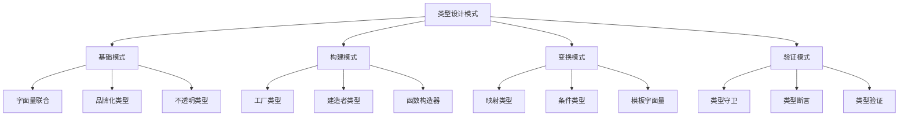

# TypeScript 类型设计模式

## 🎯 类型设计模式概览

### 📊 类型模式分类体系



## 🔧 基础类型模式

### 💡 字面量联合模式

```typescript
// 状态管理模式
type LoadingState = 'idle' | 'loading' | 'success' | 'error';

interface StateMachine<S extends string, T> {
    state: S;
    data: T;
    error?: string;
}

type AppState = 
    | StateMachine<'idle', null>
    | StateMachine<'loading', null>
    | StateMachine<'success', UserData>
    | StateMachine<'error', null>;

// 事件系统模式
type EventType = 'click' | 'hover' | 'scroll' | 'drag';
type PayloadMap = {
    click: MouseEvent;
    hover: HoverState;
    scroll: ScrollData;
    drag: DragData;
};

type EventHandler<T extends EventType> = (payload: PayloadMap[T]) => void;
```

### 🏷️ 品牌化类型模式

```typescript
// 防止原始类型误用
type Brand<K, T> = K & { __brand: T };
type UserId = Brand<number, 'UserId'>;
type OrderId = Brand<number, 'OrderId'>;
type ProductId = Brand<number, 'ProductId'>;

// 品牌化类型创建函数
function createUserId(value: number): UserId {
    return value as UserId;
}

function createOrderId(value: number): OrderId {
    return value as OrderId;
}

// 实现安全操作
function getUserById(id: UserId): User {
    // UserId 和 OrderId 是不可互换的
    return users.find(user => user.id === id)!;
}

function processOrder(orderId: OrderId): void {
    // 类型安全：无法传递 UserId
    processOrderById(orderId);
}

// 实际应用示例
const userId = createUserId(123);
const orderId = createOrderId(456);

getUserById(userId);      // ✅ 正确
getUserById(orderId);     // ❌ 类型错误
```

## 🏗️ 类型构建模式

### 🎪 工厂类型模式

```typescript
// 基础产品类型
interface Product {
    id: string;
    name: string;
    price: number;
}

// 工厂函数类型
type ProductFactory = () => Product;
type ProductFactoryWithConfig<T> = (config: T) => Product;

// 具体产品类型
type BookProduct = Product & {
    type: 'book';
    author: string;
    isbn: string;
};

type ElectronicsProduct = Product & {
    type: 'electronics';
    brand: string;
    warranty: number;
};

// 工厂函数重载
function createProduct(): BookProduct;
function createProduct(config: { type: 'electronics'; brand: string }): ElectronicsProduct;
function createProduct(config?: any): BookProduct | ElectronicsProduct {
    if (config?.type === 'electronics') {
        return {
            id: crypto.randomUUID(),
            name: '电子产品',
            price: 999,
            type: 'electronics',
            brand: config.brand,
            warranty: 1
        };
    }
    
    return {
        id: crypto.randomUUID(),
        name: '书籍',
        price: 29.99,
        type: 'book',
        author: '未知作者',
        isbn: '978-0-123456-78-9'
    };
}

// 高级工厂类型
interface CreateOptions {
    readonly category: 'premium' | 'standard' | 'budget';
    readonly features?: string[];
}

type ProductCreator<K extends string> = (
    type: K,
    options: CreateOptions
) => Extract<Product, { type: K }>;

const productCreator: ProductCreator<'book' | 'electronics'> = (type, options) => {
    // 实现逻辑...
};
```

### 🔨 建造者类型模式

```typescript
// 建造者模式类型定义
interface Builder<T> {
    build(): T;
}

// 分步建造类型
interface StepBuilder<T, K extends keyof T> {
    set<K2 extends keyof T>(key: K2, value: T[K2]): StepBuilder<T, K | K2>;
    build(): Pick<T, K>;
}

// 具体实现示例
interface DatabaseConfig {
    host: string;
    port: number;
    username: string;
    password: string;
    database: string;
    ssl: boolean;
}

class DatabaseConfigBuilder implements Builder<DatabaseConfig> {
    private config: Partial<DatabaseConfig> = {};

    public host(host: string): this {
        this.config.host = host;
        return this;
    }

    public port(port: number): this {
        this.config.port = port;
        return this;
    }

    public credentials(username: string, password: string): this {
        this.config.username = username;
        this.config.password = password;
        return this;
    }

    public database(dbName: string): this {
        this.config.database = dbName;
        return this;
    }

    public useSSL(ssl: boolean = true): this {
        this.config.ssl = ssl;
        return this;
    }

    public build(): DatabaseConfig {
        if (!this.config.host || !this.config.port || !this.config.username) {
            throw new Error('Missing required database configuration');
        }
        
        return this.config as DatabaseConfig;
    }
}

// 使用建造者
const config = new DatabaseConfigBuilder()
    .host('localhost')
    .port(5432)
    .credentials('admin', 'password')
    .database('myapp')
    .useSSL(false)
    .build();
```

## 🔄 类型变换模式

### 🌪️ 高级映射类型

```typescript
// 深度只读类型
type DeepReadonly<T> = {
    readonly [P in keyof T]: T[P] extends object ? DeepReadonly<T[P]> : T[P];
};

// 深度可选类型
type DeepPartial<T> = {
    [P in keyof T]?: T[P] extends object ? DeepPartial<T[P]> : T[P];
};

// 深度必需类型
type DeepRequired<T> = {
    [P in keyof T]-?: T[P] extends object ? DeepRequired<T[P]> : T[P];
};

// 路径类型提取
type Paths<T> = T extends object ? {
    [K in keyof T]: `${K & string}` | `${K & string}.${Paths<T[K]>}`;
}[keyof T] : '';

// 路径值类型
type PathValues<T, P extends string> = 
    P extends `${infer K}.${infer Rest}`
        ? K extends keyof T
            ? PathValues<T[K], Rest>
            : never
        : P extends keyof T
            ? T[P]
            : never;

// 实际应用
interface User {
    id: number;
    profile: {
        name: string;
        avatar: {
            url: string;
            colors: string[];
        };
    };
    settings: {
        theme: 'light' | 'dark';
        notifications: boolean;
    };
}

type UserPaths = Paths<User>; // "id" | "profile" | "profile.name" | ...
type AvatarUrl = PathValues<User, 'profile.avatar.url'>; // string
```

### 🎯 条件类型变换

```typescript
// 类型谓词
type IsArray<T> = T extends readonly any[] ? true : false;

// 非空类型提取
type NonNullable<T> = T extends null | undefined ? never : T;

// 展开数组类型
type Flatten<T> = T extends readonly (infer U)[] ? U : never;

// 深度展开
type DeepFlatten<T> = T extends readonly (infer U)[] 
    ? U extends readonly any[] 
        ? DeepFlatten<U> 
        : U 
    : never;

// 条件映射
type ConditionalMap<T> = {
    [K in keyof T]: T[K] extends string 
        ? `prefix_${T[K]}` 
        : T[K] extends number 
            ? T[K] | 0 
            : T[K];
};

// 实例检查模式
type InstanceOf<T, U> = U extends new (...args: any[]) => T ? true : false;
type IsString = InstanceOf<string, StringConstructor>; // false
type IsArrayConstructor = InstanceOf<Array<any>, ArrayConstructor>; // true
```

## 🛡️ 验证和守卫模式

### 🔍 类型守卫增强

```typescript
// 精确类型守卫
function isStringArray(value: unknown): value is string[] {
    return Array.isArray(value) && value.every(item => typeof item === 'string');
}

// 泛型类型守卫
function hasProperty<K extends string>(
    obj: unknown,
    key: K
): obj is Record<K, unknown> {
    return typeof obj === 'object' && obj !== null && key in obj;
}

// 品牌类型守卫
function isUserId(value: unknown): value is UserId {
    return typeof value === 'number' && Number.isInteger(value) && value > 0;
}

// 深度验证守卫
function isValidUser(user: unknown): user is User {
    const u = user as any;
    return (
        typeof u === 'object' &&
        u !== null &&
        typeof u.id === 'number' &&
        typeof u.name === 'string' &&
        typeof u.email === 'string' &&
        u.email.includes('@') &&
        u.profile === undefined || (
            typeof u.profile === 'object' &&
            typeof u.profile.age === 'number'
        )
    );
}

// 守卫链模式
function validateData(data: unknown): data is ValidatedData {
    return (
        hasProperty(data, 'type') &&
        data.type === 'validated' &&
        hasProperty(data, 'content') &&
        isStringArray(data.content)
    );
}

// 验证器组合
type Validator<T> = (value: unknown) => value is T;
type CompoundValidator<T> = Validator<T>[];

function createCompoundValidator<T>(
    validators: CompoundValidator<T>
): Validator<T> {
    return (value: unknown): value is T => {
        return validators.every(validator => validator(value));
    };
}
```

### 🎪 类型安全验证器

```typescript
// Schema 定义
interface SchemaField<T> {
    validate(value: unknown): value is T;
    defaultValue?: T;
    required?: boolean;
}

// Schema 构建器
class SchemaBuilder<T> {
    private fields: Record<string, SchemaField<any>> = {};
    
    field<K extends keyof T>(
        key: K,
        validator: SchemaField<T[K]>
    ): SchemaBuilder<T> {
        this.fields[key as string] = validator;
        return this;
    }
    
    build(): Schema<T> {
        return new Schema(this.fields);
    }
}

// Schema 实现
class Schema<T> {
    constructor(private fields: Record<string, SchemaField<any>>) {}
    
    validate(data: unknown): { valid: boolean; data?: T; errors?: string[] } {
        if (typeof data !== 'object' || data === null) {
            return { valid: false, errors: ['Data must be an object'] };
        }
        
        const errors: string[] = [];
        const result: any = {};
        
        for (const [key, field] of Object.entries(this.fields)) {
            const value = (data as any)[key];
            
            if (!field.validate(value)) {
                if (field.required) {
                    errors.push(`Invalid value for field '${key}'`);
                } else if (field.defaultValue !== undefined) {
                    result[key] = field.defaultValue;
                }
            } else {
                result[key] = value;
            }
        }
        
        return errors.length > 0 
            ? { valid: false, errors }
            : { valid: true, data: result };
    }
}

// 使用示例
const userSchema = new SchemaBuilder<User>()
    .field('id', {
        validate: (v): v is number => typeof v === 'number',
        required: true
    })
    .field('name', {
        validate: (v): v is string => typeof v === 'string',
        required: true
    })
    .field('email', {
        validate: (v): v is string => typeof v === 'string' && v.includes('@'),
        required: true
    })
    .build();

const validationResult = userSchema.validate(inputData);
if (validationResult.valid) {
    // TypeScript 知道这里 data 是 User 类型
    console.log('Valid user:', validationResult.data!);
}
```

## 📚 类型设计最佳实践

### 🎯 类型设计原则

| 原则 | 描述 | 示例 |
|------|------|------|
| **最小意外** | 类型行为符合直觉 | `string[]` 不是 `ReadonlyArray<string>` |
| **渐进增强** | 从简单到复杂 | `User` → `UserWithProfile` → `ValidatedUser` |
| **组合优于继承** | 使用 intersection types | `User & Timestamp & Visible` |
| **防御性编程** | 预设边界情况 | API 返回 `T \| Error` |
| **文档即代码** | 类型即文档 | 清晰的命名和注释 |

### 🔗 相关深入学习

- [[01-Type-System入门]] - 基础类型系统
- [[03-Conditional-Types深度应用]] - 条件类型高级应用
- [[04-Mapped-Types工具类型库]] - 映射类型工具

---
*💡 良好的类型设计是 TypeScript 项目的基石，值得深入研究每个模式的应用场景*
