# TypeScript Code Organization 代码组织最佳实践

## 🎯 企业级代码架构设计

### 📊 代码组织结构图

```mermaid
graph TD
    A[Code Organization Strategy] --> B[Modular Architecture]
    A --> C[Naming Conventions]
    A --> D[File Structure]
    A --> E[Import Strategies]
    A --> F[Code Splitting]
    
    B --> B1[Domain-Driven Design]
    B --> B2[Feature-Based Structure]
    B --> B3[Layer-Based Structure]
    B --> B4[Component-Based Structure]
    
    C --> C1[Consistent Naming]
    C --> C2[Meaningful Names]
    C --> C3[Abbreviation Rules]
    C --> C4[Context Prefixes]
    
    D --> D1[Barrel Exports]
    D --> D2[Index Files]
    D --> D3[Symlinks]
    D --> D4[Tree Structure]
    
    E --> E1[Circular Dependencies]
    E --> E2[Dependency Injection]
    E --> E3[Interface Segregation]
    E --> E4[Import Maps]
    
    F --> F1[Dynamic Imports]
    F --> F2[Code Splitting]
    F --> F3[Tree Shaking]
    F --> F4[Bundle Optimization]
```



## 🔧 模块化架构设计

### 💡 Domain-Driven Code Organization

```typescript
// Domain-Driven Architecture Implementation
namespace CodeOrganization {
    // Domain Module Structure
    interface DomainModuleStructure {
        domain: DomainDefinition;
        aggregates: Aggregate[];
        entities: Entity[];
        valueObjects: ValueObject[];
        
        repositories: RepositoryInterface[];
        domainServices: DomainService[];
        specifications: Specification[];
        
        factories: Factory[];
        events: DomainEvent[];
        
        // Export structure
        index: ModuleIndex;
        tests: TestStructure;
    }
    
    interface DomainDefinition {
        name: string;
        slug: string;
        boundedContext: string;
        responsibilities: Responsibility[];
        businessRules: BusinessRule[];
        invariants: Invariant[];
    }
    
    // File Organization Template
    class FileOrganizationTemplate {
        generateModuleStructure(
            domainSlug: string,
            config: ModuleConfiguration
        ): ModuleStructure {
            return {
                domain: `${domainSlug}/domain`,
                application: `${domainSlug}/application`,
                infrastructure: `${domainSlug}/infrastructure`,
                presentation: `${domainSlug}/presentation`,
                
                // Domain structure
                domainModels: config.domainModels.map(model => ({
                    entity: `${domainSlug}/domain/entities/${model.name}Entity.ts`,
                    repository: `${domainSlug}/domain/repositories/I${model.name}Repository.ts`,
                    service: `${domainSlug}/domain/services/${model.name}DomainService.ts`,
                    valueObject: model.valueObjects?.map(vo => 
                        `${domainSlug}/domain/value-objects/${vo.name}.ts`
                    ),
                    specifications: model.specifications?.map(spec => 
                        `${domainSlug}/domain/specifications/${spec.name}Specification.ts`
                    )
                })),
                
                // Application structure
                useCases: config.useCases.map(useCase => ({
                    command: `${domainSlug}/application/commands/${useCase.name}Command.ts`,
                    handler: `${domainSlug}/application/handlers/${useCase.name}Handler.ts`,
                    validator: `${domainSlug}/application/validators/${useCase.name}Validator.ts`,
                    dto: `${domainSlug}/application/dtos/${useCase.name}Dto.ts`
                })),
                
                queries: config.queries.map(query => ({
                    query: `${domainSlug}/application/queries/${query.name}Query.ts`,
                    handler: `${domainSlug}/application/query-handlers/${query.name}Handler.ts`,
                    readModel: `${domainSlug}/application/read-models/${query.name}ReadModel.ts`
                })),
                
                // Infrastructure structure
                repositories: config.infrastructureRepositories.map(repo => ({
                    implementation: `${domainSlug}/infrastructure/repositories/${repo.name}Implementation.ts`,
                    database: `${domainSlug}/infrastructure/database/entities/${repo.name}Entity.ts`,
                    migration: `${domainSlug}/infrastructure/database/migrations/Create${repo.name}Table.ts`
                })),
                
                externalServices: config.externalServices.map(service => ({
                    client: `${domainSlug}/infrastructure/external-services/${service.name}Client.ts`,
                    adapter: `${domainSlug}/infrastructure/external-services/${service.name}Adapter.ts`,
                    mock: `${domainSlug}/infrastructure/external-services/mocks/${service.name}MockClient.ts`
                })),
                
                // Presentation structure
                controllers: config.controllers.map(controller => ({
                    controller: `${domainSlug}/presentation/controllers/${controller.name}Controller.ts`,
                    middleware: `${domainSlug}/presentation/middleware/${controller.name}Middleware.ts`,
                    validator: `${domainSlug}/presentation/validators/${controller.name}Validator.ts`
                })),
                
                views: config.views?.map(view => ({
                    component: `${domainSlug}/presentation/views/${view.name}.tsx`,
                    styles: `${domainSlug}/presentation/styles/${view.name}.scss`,
                    tests: `${domainSlug}/presentation/views/__tests__/${view.name}.test.tsx`
                })),
                
                // Tests
                tests: {
                    unit: `${domainSlug}/tests/unit`,
                    integration: `${domainSlug}/tests/integration`,
                    e2e: `${domainSlug}/tests/e2e`
                }
            };
        }
        
        // Generate barrel exports
        generateBarrelExports(moduleStructure: ModuleStructure): BarrelExportStructure {
            return {
                domainIndex: this.createDomainIndex(moduleStructure),
                applicationIndex: this.createApplicationIndex(moduleStructure),
                infrastructureIndex: this.createInfrastructureIndex(moduleStructure),
                presentationIndex: this.createPresentationIndex(moduleStructure),
                mainIndex: this.createMainIndex(moduleStructure)
            };
        }
        
        private createDomainIndex(structure: ModuleStructure): string {
            const exports: string[] = [];
            
            // Export entities
            structure.domainModels.forEach(model => {
                exports.push(`export { ${model.name}Entity } from './entities/${model.name}Entity';`);
                exports.push(`export { ${model.name}EntityId } from './entities/${model.name}EntityId';`);
                
                // Export repositories
                exports.push(`export type { I${model.name}Repository } from './repositories/I${model.name}Repository';`);
                
                // Export services
                exports.push(`export { ${model.name}DomainService } from './services/${model.name}DomainService';`);
                
                // Export value objects
                model.valueObjects?.forEach(vo => {
                    exports.push(`export { ${vo.name} } from './value-objects/${vo.name}';`);
                });
                
                // Export specifications
                model.specifications?.forEach(spec => {
                    exports.push(`export { ${spec.name}Specification } from './specifications/${spec.name}Specification';`);
                });
            });
            
            // Export domain events
            exports.push(`export * from './events';`);
            
            // Export factories
            exports.push(`export * from './factories';`);
            
            return exports.join('\n');
        }
        
        private createMainIndex(structure: ModuleStructure): string {
            return `
// Main module exports
export * from './domain';
export * from './application';
export * from './infrastructure';
export * from './presentation';

// Configuration
export { ModuleConfiguration } from './config/ModuleConfiguration';
export { ModuleDependencies } from './config/ModuleDependencies';

// Types
export type { ModuleMetadata } from './types/ModuleMetadata';
export type { ModuleContext } from './types/ModuleContext';
            `.trim();
        }
    }
    
    // Advanced Naming Conventions
    class NamingConventionManager {
        // File naming patterns
        generateFileName(entityType: EntityType, entityName: string): string {
            const conventions = {
                entity: `${entityName}Entity.ts`,
                valueObject: `${entityName}.ts`,
                aggregate: `${entityName}Aggregate.ts`,
                repository: `I${entityName}Repository.ts`,
                service: `${entityName}DomainService.ts`,
                factory: `${entityName}Factory.ts`,
                specification: `${entityName}Specification.ts`,
                event: `${entityName}DomainEvent.ts`,
                command: `${entityName}Command.ts`,
                handler: `${entityName}Handler.ts`,
                query: `${entityName}Query.ts`,
                dto: `${entityName}Dto.ts`,
                controller: `${entityName}Controller.ts`,
                middleware: `${entityName}Middleware.ts`,
                validator: `${entityName}Validator.ts`,
                adapter: `${entityName}Adapter.ts`,
                client: `${entityName}Client.ts`,
                mock: `${entityName}MockClient.ts`,
                test: `${entityName}.ts`,
                spec: `${entityName}.spec.ts`,
                fixture: `${entityName}.fixture.ts`,
                migration: `Create${entityName}sTable.ts`,
                seed: `Seed${entityName}s.ts`
            };
            
            return conventions[entityType] || `${entityName}.ts`;
        }
        
        // Interface naming
        generateInterfaceName(entityName: string, interfaceType: InterfaceType): string {
            const prefixes = {
                repository: 'I',
                service: 'I',
                factory: 'I',
                specification: 'I',
                handler: 'I',
                adapter: 'I',
                client: 'I',
                validator: 'I',
                event: 'I',
                command: 'I',
                query: 'I'
            };
            
            const suffix = interfaceType.charAt(0).toUpperCase() + interfaceType.slice(1);
            const prefix = prefixes[interfaceType] || 'I';
            
            return `${prefix}${prefix === 'I' ? entityName : entityName}${suffix}`;
        }
        
        // Constant naming
        generateConstantName(domain: string, constantType: ConstantType): string {
            const patterns = {
                actionType: `${domain.toUpperCase()}_ACTION_TYPE`,
                errorCode: `${domain.toUpperCase()}_ERROR_CODE`,
                eventType: `${domain.toUpperCase()}_EVENT_TYPE`,
                status: `${domain.toUpperCase()}_STATUS`,
                validationRule: `${domain.toUpperCase()}_VALIDATION_RULE`,
                config: `${domain.toUpperCase()}_CONFIG`
            };
            
            return patterns[constantType] || `${domain.toUpperCase()}_CONSTANT`;
        }
    }
    
    // Dependency Management
    class DependencyManager {
        private dependencyGraph: Map<string, Set<string>> = new Map();
        private circularDependencyDetector: CircularDependencyDetector;
        
        constructor() {
            this.circularDependencyDetector = new CircularDependencyDetector();
        }
        
        // Analyze dependencies
        analyzeModuleDependencies(basePath: string): DependencyAnalysis {
            const modules = this.findAllModules(basePath);
            const dependencies = new Map<string, ModuleDependencies>();
            
            for (const modulePath of modules) {
                const imports = this.ext lImportStatements(modulePath);
                dependencies.set(modulePath, {
                    imports,
                    circularDependencies: this.circularDependencyDetector.detect(modulePath, imports),
                    dependencyDepth: this.calculateDependencyDepth(modulePath, dependencies)
                });
            }
            
            return {
                modules,
                dependencies,
                circularDependencies: this.findAllCircularDependencies(dependencies),
                architecturalViolations: this.detectArchitecturalViolations(dependencies),
                optimizationSuggestions: this.generateOptimizationSuggestions(dependencies)
            };
        }
        
        private findAllModules(basePath: string): string[] {
            // Recursively find all TypeScript modules
            throw new Error('Implementation required');
        }
        
        private extractImportStatements(filePath: string): ImportStatement[] {
            // Parse file and extract import statements
            throw new Error('Implementation required');
        }
        
        // Dependency injection setup
        createDependencyGraph(modules: ModuleDefinition[]): DependencyInjectionGraph {
            const container = new DependencyInjectionContainer();
            
            // Register all modules
            modules.forEach(module => {
                this.registerModuleInContainer(container, module);
            });
            
            // Build dependency graph
            const graph = this.buildDependencyGraph(modules);
            
            // Validate dependencies
            this.validateDependencyGraph(graph);
            
            return {
                container,
                graph,
                resolvingStrategy: this.selectResolvingStrategy(graph)
            };
        }
        
        private registerModuleInContainer(
            container: DependencyInjectionContainer,
            module: ModuleDefinition
        ): void {
            // Register interfaces
            module.interfaces.forEach(interfaceDef => {
                container.registerInterface(
                    interfaceDef.name,
                    interfaceDef.implementationClass || null
                );
            });
            
            // Register concrete implementations
            module.services.forEach(service => {
                container.registerSingleton(
                    service.name,
                    service.implementationClass,
                    service.dependencies || []
                );
            });
            
            // Register factories
            module.factories.forEach(factory => {
                container.registerFactory(
                    factory.name,
                    factory.factoryFunction,
                    factory.dependencies || []
                );
            });
        }
    }
    
    // Import Strategy Management
    class ImportStrategyManager {
        // Barrel export management
        createBarrelExport(path: string, exports: ExportDefinition[]): string {
            const file = new File(path);
            
            const exportStatements = exports.map(exportDef => {
                switch (exportDef.type) {
                    case 'named':
                        return `export { ${exportDef.name} } from '${exportDef.source}';`;
                    case 'default':
                        return `export { default as ${exportDef.alias || exportDef.name} } from '${exportDef.source}';`;
                    case 'namespace':
                        return `export * as ${exportDef.namespace} from '${exportDef.source}';`;
                    case 'type':
                        return `export type { ${exportDef.name} } from '${exportDef.source}';`;
                    case 'value':
                        return `export const { ${exportDef.name} } = require('${exportDef.source}');`;
                    default:
                        throw new Error(`Unsupported export type: ${exportDef.type}`);
                }
            });
            
            const code = `
${exportStatements.join('\n')}
`.trim();
            
            file.write(code);
            return code;
        }
        
        // Import optimization
        optimizeImports(filePath: string): OptimizedImports {
            const file = this.readFile(filePath);
            const imports = this.parseImports(file);
            
            const optimized: OptimizedImports = {
                originalImports: imports,
                optimizedImports: [],
                removedImports: [],
                addedImports: [],
                suggestions: []
            };
            
            // Remove unused imports
            const usedImports = this.findUsedImports(file, imports);
            optimized.removedImports = imports.filter(imp => !usedImports.includes(imp));
            
            // Consolidate imports from same module
            const consolidatedImports = this.consolidateImports(usedImports);
            optimized.optimizedImports = consolidatedImports;
            
            // Suggest import optimizations
            optimized.suggestions = this.generateImportOptimizationSuggestions(consolidatedImports);
            
            return optimized;
        }
        
        // Circular dependency prevention
        preventCircularDependencies(
            modules: string[],
            dependencies: Map<string, string[]>
        ): DependencyResolutionPlan {
            const circularCycles = this.findCircularCycles(modules, dependencies);
            const resolutionStrategies: DependencyResolutionStrategy[] = [];
            
            circularCycles.forEach(cycle => {
                const strategy = this.resolveCircularCycle(cycle, dependencies);
                resolutionStrategies.push(strategy);
            });
            
            return {
                cycles: circularCycles,
                strategies: resolutionStrategies,
                recommendations: this.generateRecommendations(resolutionStrategies)
            };
        }
        
        private resolveCircularCycle(
            cycle: string[],
            dependencies: Map<string, string[]>
        ): DependencyResolutionStrategy {
            // Strategy 1: Extract shared interfaces
            const sharedInterfaces = this.findSharedInterfaces(cycle);
            if (sharedInterfaces.length > 0) {
                return {
                    type: 'EXTRACT_INTERFACE',
                    description: 'Extract shared interfaces to break circular dependency',
                    actions: [
                        'Create shared interfaces module',
                        'Move shared interfaces to shared module',
                        'Update imports to use shared interfaces'
                    ],
                    affectedFiles: cycle
                };
            }
            
            // Strategy 2: Dependency injection
            const injectableDependencies = this.findInjectableDependencies(cycle);
            if (injectableDependencies.length > 0) {
                return {
                    type: 'DEPENDENCY_INJECTION',
                    description: 'Use dependency injection to break circular dependency',
                    actions: [
                        'Introduce dependency injection container',
                        'Register dependencies in container',
                        'Inject dependencies at runtime'
                    ],
                    affectedFiles: cycle
                };
            }
            
            // Strategy 3: Event-driven architecture
            const eventableDependencies = this.findEventableDependencies(cycle);
            if (eventableDependencies.length > 0) {
                return {
                    type: 'EVENT_DRIVEN',
                    description: 'Use events to decouple modules',
                    actions: [
                        'Introduce event bus',
                        'Convert direct dependencies to events',
                        'Publish and subscribe to events'
                    ],
                    affectedFiles: cycle
                };
            }
            
            // Strategy 4: Refactor module boundaries
            return {
                type: 'REFACTOR_BOUNDARIES',
                description: 'Refactor module boundaries to eliminate circular dependencies',
                actions: [
                    'Analyze module responsibilities',
                    'Redesign module boundaries',
                    'Move misplaced functionality',
                    'Create new modules for shared functionality'
                ],
                affectedFiles: cycle
            };
        }
    }
    
    // Code Splitting Strategy
    class CodeSplittingStrategy {
        // Dynamic imports for lazy loading
        generateDynamicImports(modules: ModuleDefinition[]): DynamicImportMap {
            const dynamicImports: DynamicImportMap = {};
            
            // Define which modules should be lazy-loaded
            const lazyModules = modules.filter(module => 
                module.loadingStrategy === 'LAZY' || 
                module.size > 100_000 || // Large modules
                module.frequency === 'LOW' // Rarely used modules
            );
            
            lazyModules.forEach(module => {
                dynamicImports[module.name] = this.createDynamicImportStrategy(module);
            });
            
            return dynamicImports;
        }
        
        private createDynamicImportStrategy(module: ModuleDefinition): DynamicImportStrategy {
            return {
                importFunction: `() => import('${module.path}')`,
                fallback: module.fallbackModule ? `() => import('${module.fallbackModule}')` : null,
                loadingComponent: module.loadingComponent || 'DefaultLoading',
                errorComponent: module.errorComponent || 'DefaultError',
                preload: module.preloadStrategy || 'on-demand',
                cacheStrategy: module.cacheStrategy || 'memory'
            };
        }
        
        // Bundle splitting
        createBundleSplitStrategy(config: BundleSplitConfig): BundleSplitStrategy {
            return {
                entryPoints: this.generateEntryPoints(config.features),
                optimization: {
                    splitChunks: this.generateSplitChunksConfig(config),
                    treeShaking: this.generateTreeShakingConfig(config),
                    minification: this.generateMinificationConfig(config)
                },
                codeSplitting: {
                    vendorBundles: this.generateVendorBundles(config.dependencies),
                    featureBundles: this.generateFeatureBundles(config.features),
                    sharedBundles: this.generateSharedBundles(config.sharedModules)
                }
            };
        }
        
        private generateSplitChunksConfig(config: BundleSplitConfig): SplitChunksConfig {
            return {
                chunks: 'all',
                maxInitialRequests: 20,
                minSize: 20_000,
                maxSize: 250_000,
                cacheGroups: {
                    vendor: {
                        test: /[\\/]node_modules[\\/]/,
                        name: 'vendors',
                        chunks: 'all',
                        priority: 10
                    },
                    common: {
                        minChunks: 2,
                        name: 'common',
                        chunks: 'all',
                        priority: 5,
                        reuseExistingChunk: true
                    },
                    domain: {
                        test: /[\\/]src[\\/]domains[\\/]/,
                        name(module: any): string {
                            const match = module.context.match(/[\\/]src[\\/]domains[\\/]([^\\/]+)/);
                            return match ? `domain-${match[1]}` : 'domain-common';
                        },
                        chunks: 'all',
                        priority: 8
                    }
                }
            };
        }
    }
    
    // Supporting Types
    interface ModuleStructure {
        domain: string;
        application: string;
        infrastructure: string;
        presentation: string;
        domainModels: DomainModelStructure[];
        useCases: UseCaseStructure[];
        queries: QueryStructure[];
        repositories: RepositoryStructure[];
        externalServices: ExternalServiceStructure[];
        controllers: ControllerStructure[];
        views?: ViewStructure[];
        tests: TestStructure;
    }
    
    interface DomainModelStructure {
        name: string;
        entity: string;
        repository: string;
        service: string;
        valueObjects?: ValueObjectStructure[];
        specifications?: SpecificationStructure[];
    }
    
    interface UseCaseStructure {
        name: string;
        command: string;
        handler: string;
        validator: string;
        dto: string;
    }
    
    interface ImportStatement {
        source: string;
        imports: string[];
        type: 'named' | 'default' | 'namespace';
        alias?: string;
    }
    
    interface DependencyAnalysis {
        modules: string[];
        dependencies: Map<string, ModuleDependencies>;
        circularDependencies: CircularDependency[];
        architecturalViolations: ArchitecturalViolation[];
        optimizationSuggestions: OptimizationSuggestion[];
    }
    
    interface ModuleDependencies {
        imports: ImportStatement[];
        circularDependencies: CircularDependency[];
        dependencyDepth: number;
    }
    
    interface CircularDependency {
        cycle: string[];
        severity: 'LOW' | 'MEDIUM' | 'HIGH' | 'CRITICAL';
        impact: string[];
    }
    
    interface DependencyResolutionStrategy {
        type: 'EXTRACT_INTERFACE' | 'DEPENDENCY_INJECTION' | 'EVENT_DRIVEN' | 'REFACTOR_BOUNDARIES';
        description: string;
        actions: string[];
        affectedFiles: string[];
    }
    
    type EntityType = 
        | 'entity' | 'valueObject' | 'aggregate' | 'repository' | 'service' 
        | 'factory' | 'specification' | 'event' | 'command' | 'handler' 
        | 'query' | 'dto' | 'controller' | 'middleware' | 'validator' 
        | 'adapter' | 'client' | 'mock' | 'test' | 'spec' | 'fixture' 
        | 'migration' | 'seed';
        
    type InterfaceType = 
        | 'repository' | 'service' | 'factory' | 'specification' | 'handler' 
        | 'adapter' | 'client' | 'validator' | 'event' | 'command' | 'query';
        
    type ConstantType = 
        | 'actionType' | 'errorCode' | 'eventType' | 'status' 
        | 'validationRule' | 'config';
}
```

### 🔗 相关深入学习

- [[01-Type-Design-Patterns类型设计模式]] - 类型系统设计模式
- [[03-Testing-Strategy测试策略]] - 测试策略与代码组织
- [[04-Documentation-Documentation文档化]] - 代码文档化实践

---
*💡 良好的代码组织是企业级TypeScript应用的基石，合理的模块化和命名约定能显著提高代码的可维护性和开发效率*
