# TypeScript Testing Strategy 测试策略最佳实践

## 🎯 全面测试策略体系

### 📊 测试金字塔架构

```mermaid
graph TD
    A[Testing Strategy Pyramid] --> B[E2E Tests]
    A --> C[Integration Tests]
    A --> D[Unit Tests]
    A --> E[Visual Tests]
    A --> F[Performance Tests]
    
    B --> B1[End-to-End Testing]
    B --> B2[User Journey Tests]
    B --> B3[Critical Path Tests]
    B --> B4[Cross-browser Tests]
    
    C --> C1[API Integration]
    C --> C2[Database Integration]
    C --> C3[External Service Integration]
    C --> C4[Component Integration]
    
    D --> D1[Pure Functions]
    D --> D2[Component Units]
    D --> D3[Business Logic]
    D --> D4[Utility Functions]
    
    E --> E1[Screenshot Tests]
    E --> E2[Visual Regression]
    E --> E3[UI Components]
    E --> E4[Responsive Design]
    
    F --> F1[Load Testing]
    F --> F2[Stress Testing]
    F --> F3[Memory Profiling]
    F --> F4[Bundle Size Testing]
```



## 🔧 全面测试框架实现

### 💡 TypeScript测试生态系统

```typescript
// Comprehensive Testing Strategy Implementation
namespace TestingStrategy {
    // Testing Framework Configuration
    interface TestingFrameworkConfig {
        testRunner: TestRunnerConfig;
        assertionLibrary: AssertionLibraryConfig;
        mockingLibrary: MockingLibraryConfig;
        coverage: CoverageConfig;
        visualTesting: VisualTestingConfig;
        performanceTesting: PerformanceTestingConfig;
        factories: TestFactoryConfig;
        fixtures: TestFixtureConfig;
    }
    
    // Test Runner Configuration
    interface TestRunnerConfig {
        type: 'JEST' | 'VITEST' | 'MAVEN' | 'PUPPETEER' | 'PLAYWRIGHT';
        options: TestRunnerOptions;
        environment: TestEnvironmentConfig;
        plugins: PluginConfig[];
        watchMode: WatchModeConfig;
        parallelExecution: ParallelExecutionConfig;
    }
    
    const TestingConfigurations: Record<string, TestingFrameworkConfig> = {
        // Jest Configuration for React/Node.js
        jest: {
            testRunner: {
                type: 'JEST',
                options: {
                    preset: 'ts-jest',
                    testEnvironment: 'jsdom',
                    roots: ['<rootDir>/src'],
                    testMatch: [
                        '**/__tests__/**/*.+(ts|tsx|js)',
                        '**/*.(test|spec).+(ts|tsx|js)'
                    ],
                    transform: {
                        '^.+\\.(ts|tsx)$': 'ts-jest',
                        '^.+\\.(js|jsx)$': 'babel-jest'
                    },
                    moduleNameMapping: {
                        '^@/(.*)$': '<rootDir>/src/$1',
                        '\\.(css|less|scss|sass)$': 'identity-obj-proxy'
                    },
                    setupFilesAfterEnv: ['<rootDir>/src/test/setupTests.ts'],
                    collectCoverageFrom: [
                        'src/**/*.{ts,tsx}',
                        '!src/**/*.d.ts',
                        '!src/**/__tests__/**',
                        '!src/**/*.test.{ts,tsx}',
                        '!src/**/*.spec.{ts,tsx}'
                    ],
                    coverageThreshold: {
                        global: {
                            branches: 80,
                            functions: 80,
                            lines: 80,
                            statements: 80
                        }
                    }
                }
            },
            
            assertionLibrary: {
                type: 'EXPECT',
                extensions: ['jest-dom', 'jest-extended'],
                customMatchers: './src/test/customMatchers.ts'
            },
            
            mockingLibrary: {
                type: 'JEST_MOCK',
                manualMocksPath: '__mocks__',
                mockFactoriesPath: 'src/test/mocks',
                autoMockModules: ['react-router-dom', 'axios']
            }
        },
        
        // Vitest Configuration for Modern Development
        vitest: {
            testRunner: {
                type: 'VITEST',
                options: {
                    testTimeout: 10000,
                    environment: 'jsdom',
                    setupFiles: ['src/test/setupTests.ts'],
                    globals: true,
                    coverage: {
                        provider: 'v8',
                        reporter: ['text', 'json', 'html'],
                        exclude: [
                            'node_modules/',
                            'src/test/',
                            '**/*.d.ts',
                            '**/*.test.{ts,tsx}',
                            '**/*.spec.{ts,tsx}'
                        ],
                        thresholds: {
                            global: {
                                branches: 80,
                                functions: 80,
                                lines: 80,
                                statements: 80
                            }
                        }
                    },
                    mockReset: true,
                    clearMocks: true,
                    restoreMocks: true
                }
            },
            
            assertionLibrary: {
                type: 'VITEST_ASSERT',
                extensions: ['@vitest/utils']
            },
            
            mockingLibrary: {
                type: 'VITEST_MOCK',
                autoMockPaths: ['node_modules/'],
                mockFactoriesPath: 'src/test/mocks'
            }
        },
        
        // Playwright Configuration for E2E Testing
        playwright: {
            testRunner: {
                type: 'PLAYWRIGHT',
                options: {
                    timeout: 30000,
                    retries: 2,
                    use: {
                        baseURL: 'http://localhost:3000',
                        trace: 'on-first-retry',
                        screenshot: 'only-on-failure'
                    },
                    projects: [
                        {
                            name: 'chromium',
                            use: { browserName: 'chromium' }
                        },
                        {
                            name: 'firefox',
                            use: { browserName: 'firefox' }
                        },
                        {
                            name: 'webkit',
                            use: { browserName: 'webkit' }
                        }
                    ]
                }
            },
            
            visualTesting: {
                type: 'VISUAL_COMPARISON',
                screenshotMode: 'full',
                baselinePath: 'test-results/visual-baselines',
                diffPath: 'test-results/visual-diffs',
                tolerance: 0.2
            }
        }
    };
    
    // Advanced Testing Utilities
    class TypeScriptTestingTools {
        // Test Factory System
        createTestFactory<T extends object>(config: TestFactoryConfig<T>): TestFactory<T> {
            return new TestFactory<T>(config);
        }
        
        // Custom Render Utilities
        createCustomRenderProvider<TProviders extends object>(
            providers: TProviders
        ): CustomRenderFunction {
            const renderWithProviders: CustomRenderFunction = (
                ui: ReactElement,
                options: RenderOptions = {}
            ) => {
                const AllTheProviders: React.FC<{ children: ReactElement }> = ({ children }) => {
                    return Object.values(providers).reduce(
                        (providerAccumulator, CurrentProvider) => {
                            return React.createElement(CurrentProvider, {}, providerAccumulator);
                        },
                        children
                    );
                };
                
                const utils = render(ui, { wrapper: AllTheProviders, ...options });
                
                return {
                    ...utils,
                    rerender: (ui: ReactElement) => utils.rerender(ui, { wrapper: AllTheProviders })
                };
            };
            
            return renderWithProviders;
        }
        
        // State Management Testing Utilities
        createStoreTestUtils<TState, TActions>(
            storeFactory: StoreFactory<TState, TActions>
        ): StoreTestUtils<TState, TActions> {
            return new StoreTestUtils(storeFactory);
        }
        
        // API Testing Utilities
        createAPITestUtils(config: APITestConfig): APITestUtils {
            return new APITestUtils(config);
        }
    }
    
    // Test Factory Implementation
    class TestFactory<T extends object> {
        private defaultValues: Partial<T>;
        private traits: Map<string, (obj: Partial<T>) => Partial<T>> = new Map();
        private sequences: Map<string, () => unknown> = new Map();
        
        constructor(config: TestFactoryConfig<T>) {
            this.defaultValues = config.defaultValues;
            this.registerTraits(config.traits);
            this.registerSequences(config.sequences);
        }
        
        build(overrides: Partial<T> = {}, options: BuildOptions = {}): T {
            const built = this.buildModel(overrides, options);
            
            if (options.associations) {
                return this.buildAssociations(built, options.associations);
            }
            
            return built;
        }
        
        create(overrides: Partial<T> = {}, options: CreateOptions = {}): Promise<T> {
            const model = this.build(overrides, options);
            
            if (options.skipValidation) {
                return model as Promise<T>;
            }
            
            return this.validateAndSave(model, options.validationRules);
        }
        
        attributesFor(overrides: Partial<T> = {}): Partial<T> {
            return { ...this.defaultValues, ...overrides };
        }
        
        trait(traitName: string): TestFactory<T> {
            const newFactory = Object.create(this);
            const trait = this.traits.get(traitName);
            
            if (!trait) {
                throw new Error(`Trait '${traitName}' not found`);
            }
            
            const traitValues = trait({});
            newFactory.defaultValues = { ...this.defaultValues, ...traitValues };
            
            return newFactory;
        }
        
        sequence(sequenceName: string): unknown {
            const sequence = this.sequences.get(sequenceName);
            
            if (!sequence) {
                throw new Error(`Sequence '${sequenceName}' not found`);
            }
            
            return sequence();
        }
        
        private buildModel(overrides: Partial<T>, options: BuildOptions): T {
            let model = { ...this.defaultValues } as T;
            
            // Apply traits
            if (options.traits) {
                options.traits.forEach(traitName => {
                    const trait = this.traits.get(traitName);
                    if (trait) {
                        model = { ...model, ...trait(model) };
                    }
                });
            }
            
            // Apply overrides
            model = { ...model, ...overrides };
            
            // Apply sequences
            Object.keys(model).forEach(key => {
                const value = (model as any)[key];
                if (typeof value === 'string' && value.includes('{{')) {
                    (model as any)[key] = this.resolveSequences(value);
                }
            });
            
            return model;
        }
        
        private resolveSequences(template: string): string {
            return template.replace(/\{\{(\w+)\}\}/g, (match, sequenceName) => {
                const sequenceValue = this.sequence(sequenceName);
                return String(sequenceValue);
            });
        }
        
        private registerTraits(traits: Record<string, (obj: Partial<T>) => Partial<T>>): void {
            Object.entries(traits).forEach(([name, trait]) => {
                this.traits.set(name, trait);
            });
        }
        
        private registerSequences(sequences: Record<string, () => unknown>): void {
            Object.entries(sequences).forEach(([name, sequence]) => {
                this.sequences.set(name, sequence);
            });
        }
        
        private async validateAndSave(
            model: T, 
            rules: ValidationRule[] = []
        ): Promise<T> {
            // Validation logic
            for (const rule of rules) {
                await rule.validate(model);
            }
            
            // Save logic (mock or real)
            return model;
        }
        
        private buildAssociations(
            model: T, 
            associations: AssociationConfig[]
        ): T {
            // Association building logic
            return model;
        }
    }
    
    // Store Testing Utilities
    class StoreTestUtils<TState, TActions> {
        constructor(private storeFactory: StoreFactory<TState, TActions>) {}
        
        createTestStore(initialState?: Partial<TState>): TestStore<TState, TActions> {
            return new TestStore(this.storeFactory, initialState);
        }
        
        createMockStore(): MockStore<TState, TActions> {
            return new MockStore(this.storeFactory);
        }
        
        testAction<T extends keyof TActions>(
            actionName: T,
            payload: Parameters<TActions[T]>[0],
            expectedState: Partial<TState>,
            initial state?: Partial<TState>
        ): void {
            const store = this.createTestStore(initialState);
            const action = payload;
            
            store.dispatch(actionName, action as any);
            
            expect(store.getState()).toMatchPartial(expectedState);
        }
        
        async testAsyncAction<T extends keyof TActions>(
            actionName: T,
            payload: Parameters<TActions[T]>[0],
            expectedState: Partial<TState>,
            initialState?: Partial<TState>
        ): Promise<void> {
            const store = this.createTestStore(initialState);
            const action = payload;
            
            await store.dispatch(actionName, action as any);
            
            expect(store.getState()).toMatchPartial(expectedState);
        }
    }
    
    // API Testing Utilities
    class APITestUtils {
        constructor(private config: APITestConfig) {}
        
        async setup(): Promise<void> {
            await this.startServer();
            await this.createTestDatabase();
            await this.seedTestData();
        }
        
        async teardown(): Promise<void> {
            await this.clearTestData();
            await this.stopServer();
        }
        
        createAuthenticatedRequest(token: string = 'test-token'): RequestBuilder {
            return new RequestBuilder({
                ...this.config,
                headers: {
                    'Authorization': `Bearer ${token}`,
                    'Content-Type': 'application/json'
                }
            });
        }
        
        createUnauthenticatedRequest(): RequestBuilder {
            return new RequestBuilder(this.config);
        }
        
        async makeRequest<T = any>(
            endpoint: string,
            options: RequestOptions = {}
        ): Promise<APIResponse<T>> {
            const requestBuilder = options.authenticated 
                ? this.createAuthenticatedRequest(options.token)
                : this.createUnauthenticatedRequest();
                
            return requestBuilder.makeRequest<T>(endpoint, options);
        }
        
        expectStatusCode(response: APIResponse<any>, expectedCode: number): void {
            expect(response.statusCode).toBe(expectedCode);
        }
        
        expectResponseHeaders(response: APIResponse<any>, expectedHeaders: Record<string, string>): void {
            Object.entries(expectedHeaders).forEach(([key, value]) => {
                expect(response.headers[key.toLowerCase()]).toBe(value);
            });
        }
        
        expectResponseBody<T>(
            response: APIResponse<T>, 
            schema: JSONSchema
        ): void {
            const isValid = this.validateResponseSchema(response.body, schema);
            expect(isValid).toBe(true);
        }
        
        validateResponseSchema(data: any, schema: JSONSchema): boolean {
            // JSON schema validation implementation
            return true; // Simplified
        }
        
        private async startServer(): Promise<void> {
            // Server startup logic
        }
        
        private async stopServer(): Promise<void> {
            // Server shutdown logic
        }
        
        private async createTestDatabase(): Promise<void> {
            // Test database creation logic
        }
        
        private async seedTestData(): Promise<void> {
            // Test data seeding logic
        }
        
        private async clearTestData(): Promise<void> {
            // Test data clearing logic
        }
    }
    
    // Mock Implementation System
    class TypeScriptMockSystem {
        private globalMocks: Map<string, MockDefinition> = new Map();
        private moduleMocks: Map<string, ModuleMock> = new Map();
        
        // Mock External Modules
        mockModule(modulePath: string, mockImplementation: any): void {
            this.moduleMocks.set(modulePath, {
                originalModule: require.resolve(modulePath),
                mockImplementation,
                autoMock: false
            });
        }
        
        // Auto-mock Modules
        autoMockModule(modulePath: string, options: AutoMockOptions = {}): void {
            this.moduleMocks.set(modulePath, {
                originalModule: require.resolve(modulePath),
                mockImplementation: this.createAutoMock(modulePath, options),
                autoMock: true
            });
        }
        
        // Mock Implementation Factory
        createMockImplementation<T extends Record<string, any>>(
            factory: MockFactory<T>
        ): SpiedObject<T> {
            return factory(this.createMockFunction) as SpiedObject<T>;
        }
        
        // Type-safe Mock Creation
        createTypeSafeMock<T>(
            implementation?: PartialImplementationType<T>
        ): TypeSafeMock<T> {
            const mock = this.createMockFunction();
            
            return this.createProxyMock<T>(mock, implementation || {});
        }
        
        // Async Mock Helpers
        createAsyncMock<T>(value: T): () => Promise<T> {
            return jest.fn().mockResolvedValue(value);
        }
        
        createRejectingMock(error: Error): () => Promise<never> {
            return jest.fn().mockRejectedValue(error);
        }
        
        createMockedResponse<T>(data: T, config: MockResponseConfig = {}): MockResponse<T> {
            return {
                data,
                status: config.status || 200,
                statusText: config.statusText || 'OK',
                headers: config.headers || {},
                config: config.requestConfig || {},
                mock: true
            };
        }
        
        // Database Mocking
        createDatabaseMock(): DatabaseMock {
            return new DatabaseMock();
        }
        
        // API Mocking Helper
        setupAPIMock(url: string, mockResponse: MockResponse<any>): void {
            fetchMock.mockResponse(response => {
                if (response.url === url) {
                    return Promise.resolve(mockResponse);
                }
                return Promise.resolve(this.createMockedResponse({}, { status: 404 }));
            });
        }
        
        private createAutoMock(modulePath: string, options: AutoMockOptions): any {
            const moduleExports = require(modulePath);
            const mockedModule: any = {};
            
            for (const key in moduleExports) {
                if (typeof moduleExports[key] === 'function') {
                    mockedModule[key] = this.createMockFunction();
                } else {
                    mockedModule[key] = moduleExports[key];
                }
            }
            
            return mockedModule;
        }
        
        private createProxyMock<T>(
            mock: any, 
            implementation: PartialImplementationType<T>
        ): TypeSafeMock<T> {
            // Create proxy to provide type safety
            return new Proxy(mock, {
                get(target, prop) {
                    if (prop in implementation) {
                        return (implementation as any)[prop];
                    }
                    
                    if (typeof target[prop] === 'function') {
                        return target[prop];
                    }
                    
                    return undefined;
                }
            });
        }
        
        private createMockFunction(): MockFunction {
            return jest.fn();
        }
    }
    
    // Testing Strategy Implementation
    class TestingStrategyManager {
        private strategies: Map<string, TestingStrategy> = new Map();
        
        // Register Testing Strategy
        registerStrategy(name: string, strategy: TestingStrategy): void {
            this.strategies.set(name, strategy);
        }
        
        // Execute Testing Strategy
        async executeStrategy(name: string, context: TestingContext): Promise<TestingResult> {
            const strategy = this.strategies.get(name);
            
            if (!strategy) {
                throw new Error(`Testing strategy '${name}' not found`);
            }
            
            return await strategy.execute(context);
        }
        
        // Create Comprehensive Test Suite
        createTestSuite(config: TestSuiteConfig): TestSuite {
            const testSuite = new TestSuite(config);
            
            // Setup Unit Tests
            this.setupUnitTests(testSuite);
            
            // Setup Integration Tests
            this.setupIntegrationTests(testSuite);
            
            // Setup E2E Tests
            this.setupE2ETests(testSuite);
            
            // Setup Visual Tests
            this.setupVisualTests(testSuite);
            
            // Setup Performance Tests
            this.setupPerformanceTests(testSuite);
            
            return testSuite;
        }
        
        private setupUnitTests(testSuite: TestSuite): void {
            const unitTestStrategy = new UnitTestStrategy();
            testSuite.addTestGroup('unit', unitTestStrategy);
        }
        
        private setupIntegrationTests(testSuite: TestSuite): void {
            const integrationTestStrategy = new IntegrationTestStrategy();
            
            // API Integration Tests
            testSuite.addTestGroup('api-integration', integrationTestStrategy);
            
            // Database Integration Tests
            testSuite.addTestGroup('database-integration', integrationTestStrategy);
            
            // Component Integration Tests
            testSuite.addTestGroup('component-integration', integrationTestStrategy);
        }
        
        private setupE2ETests(testSuite: TestSuite): void {
            const e2eTestStrategy = new E2ETestStrategy();
            
            // Critical User Flows
            testSuite.addTestGroup('critical-flows', e2eTestStrategy);
            
            // Cross-browser Testing
            testSuite.addTestGroup('cross-browser', e2eTestStrategy);
            
            // Mobile Testing
            testSuite.addTestGroup('mobile', e2eTestStrategy);
        }
        
        private setupVisualTests(testSuite: TestSuite): void {
            const visualTestStrategy = new VisualTestStrategy();
            
            // Component Visual Tests
            testSuite.addTestGroup('component-visual', visualTestStrategy);
            
            // Layout Visual Tests
            testSuite.addTestGroup('layout-visual', visualTestStrategy);
            
            // Responsive Design Tests
            testSuite.addTestGroup('responsive', visualTestStrategy);
        }
        
        private setupPerformanceTests(testSuite: TestSuite): void {
            const performanceTestStrategy = new PerformanceTestStrategy();

            
            // Bundle Size Tests
            testSuite.addTestGroup('bundle-size', performanceTestStrategy);
            
            // Runtime Performance Tests
            testSuite.addTestGroup('runtime-performance', performanceTestStrategy);
            
            // Memory Usage Tests
            testSuite.addTestGroup('memory-usage', performanceTestStrategy);
        }
    }
    
    // Supporting Types
    interface TestFactoryConfig<T> {
        defaultValues: Partial<T>;
        traits?: Record<string, (obj: Partial<T>) => Partial<T>>;
        sequences?: Record<string, () => unknown>;
    }
    
    type MockFactory<T> = (
        mockFunction: <T extends (...args: any[]) => any>(
            implementation?: T
        ) => jest.MockedFunction<T>
    ) => T;
    
    interface TypeSafeMock<T> {
        [K in keyof T]-?: T[K] extends (...args: any[]) => any
            ? jest.MockedFunction<T[K]>
            : T[K];
    }
    
    interface TestSuiteConfig {
        name: string;
        path: string;
        testingFramework: 'JEST' | 'VITEST' | 'PLAYWRIGHT';
        coverageThreshold?: CoverageThreshold;
        parallelization?: ParallelConfig;
    }
    
    interface CoverageThreshold {
        branches: number;
        functions: number;
        lines: number;
        statements: number;
    }
    
    interface TestingContext {
        environment: TestEnvironment;
        config: TestingConfig;
        data?: any;
    }
    
    interface TestingResult {
        passed: number;
        failed: number;
        skipped: number;
        coverage: CoverageReport;
        duration: number;
        artifacts?: TestArtifact[];
    }
}
```

### 🔗 相关深入学习

- [[02-Code-Organization代码组织]] - 代码组织与测试策略
- [[04-Documentation-Documentation文档化]] - 测试文档化实践
- [[01-Type-Design-Patterns类型设计模式]] - 测试中的设计模式

---
*💡 完整的测试策略是企业级TypeScript应用的关键，涵盖了从单元测试到E2E测试的全方位质量保证*
