# TypeScript Documentation Documentation 文档化最佳实践

## 🎯 全面文档化策略体系

### 📊 文档生态系统架构

```mermaid
graph TD
    A[Documentation Ecosystem] --> B[Code Documentation]
    A --> C[API Documentation]
    A --> D[User Documentation]
    A --> E[Developer Documentation]
    A --> F[Architecture Documentation]
    
    B --> B1[JSDoc Comments]
    B --> B2[TODO Comments]
    B --> B3[Technical Debt Markers]
    B --> B4[Inline Explanations]
    
    C --> C1[OpenAPI/Swagger]
    C --> C2[GraphQL Schema]
    C --> C3[Postman Collections]
    C --> C4[Curl Examples]
    
    D --> D1[User Manuals]
    D --> D2[Tutorial Guides]
    D --> D3[FAQ Sections]
    D --> D4[Video Tutorials]
    
    E --> E1[Setup Guides]
    E --> E2[Architecture Decisions]
    E --> E3[Contributing Guidelines]
    E --> E4[Code Style Guides]
    
    F --> F1[System Diagrams]
    F --> F2[Decision Records]
    F --> F3[Deployment Guides]
    F --> F4[Monitoring Documentation]
```



## 🔧 高级文档生成系统

### 💡 TypeScript文档工具生态

```typescript
// Advanced Documentation Generation System
namespace DocumentationSystem {
    // Documentation Framework
    interface DocumentationFramework {
        tools: DocumentationTool[];
        generators: DocumentGenerator[];
        templateEngines: TemplateEngine[];
        validationRules: ValidationRule[];
        publicationPipelines: PublicationPipeline[];
    }
    
    // TypeScript Documentation Generator
    class TypeScriptDocumentationGenerator {
        private tsCompiler: TypeScriptCompilerAPI;
        private templateEngine: TemplateEngine;
        private validationRules: ValidationRule[] = [];
        
        constructor(config: DocumentationGeneratorConfig) {
            this.tsCompiler = this.createTypeScriptCompiler(config.compilerOptions);
            this.templateEngine = this.createTemplateEngine(config.templateOptions);
            this.setupValidationRules(config.validationRules);
        }
        
        // Generate comprehensive documentation
        async generateDocumentation(
            sourcePaths: string[],
            options: DocumentationGenerationOptions = {}
        ): Promise<DocumentationResult> {
            const sourceFiles = await this.loadSourceFiles(sourcePaths);
            const parsedASTs = await this.parseSourceFiles(sourceFiles);
            const extractedDocumentation = await this.extractDocumentation(parsedASTs);
            const validatedDocumentation = await this.validateDocumentation(extractedDocumentation);
            const generatedDocs = await this.generateDocuments(validatedDocumentation, options);
            
            if (options.publish) {
                await this.publishDocumentation(generatedDocs, options.publicationConfig);
            }
            
            return {
                sourceFiles: sourceFiles.length,
                extractedItems: extractedDocumentation.length,
                generatedDocuments: generatedDocs.length,
                validationResults: validatedDocumentation.validationResults,
                publicationResults: options.publish ? generatedDocs.publicationResults : null
            };
        }
        
        // Extract JSDoc comments and type information
        private async extractDocumentation(asts: ParsedAST[]): Promise<DocumentationItem[]> {
            const documentationItems: DocumentationItem[] = [];
            
            for (const ast of asts) {
                // Extract class documentation
                const classItems = await this.extractClassDocumentation(ast);
                documentationItems.push(...classItems);
                
                // Extract function documentation
                const functionItems = await this.extractFunctionDocumentation(ast);
                documentationItems.push(...functionItems);
                
                // Extract interface documentation
                const interfaceItems = await this.extractInterfaceDocumentation(ast);
                documentationItems.push(...interfaceItems);
                
                // Extract type alias documentation
                const typeAliasItems = await this.extractTypeAliasDocumentation(ast);
                documentationItems.push(...typeAliasItems);
                
                // Extract enum documentation
                const enumItems = await this.extractEnumDocumentation(ast);
                documentationItems.push(...enumItems);
                
                // Extract namespace documentation
                const namespaceItems = await this.extractNamespaceDocumentation(ast);
                documentationItems.push(...namespaceItems);
            }
            
            return documentationItems;
        }
        
        // Extract class documentation with methods and properties
        private async extractClassDocumentation(ast: ParsedAST): Promise<ClassDocumentationItem[]> {
            const classItems: ClassDocumentationItem[] = [];
            
            ast.forEachChild(node => {
                if (node.kind === SyntaxKind.ClassDeclaration) {
                    const classDeclaration = node as ClassDeclaration;
                    const jsDocComments = this.extractJSDocComments(classDeclaration);
                    
                    const classItem: ClassDocumentationItem = {
                        type: 'class',
                        name: classDeclaration.name?.getText() || '',
                        jsDoc: jsDocComments,
                        filePath: ast.getSourceFile().fileName,
                        packageName: this.extractPackageName(ast),
                        modulePath: this.extractModulePath(ast),
                        modifiers: this.extractModifiers(classDeclaration),
                        extends: this.extractExtendsDeclaration(classDeclaration),
                        implements: this.extractImplementsDeclarations(classDeclaration),
                        constructors: this.extractConstructorDocumentation(classDeclaration),
                        methods: this.extractMethodDocumentation(classDeclaration),
                        properties: this.extractPropertyDocumentation(classDeclaration),
                        generics: this.extractGenericTypes(classDeclaration),
                        decorators: this.extractDecoratorDocumentation(classDeclaration),
                        accessModifiers: this.extractAccessModifiers(classDeclaration),
                        isAbstract: this.checkAbstractModifier(classDeclaration),
                        isStatic: this.checkStaticModifier(classDeclaration),
                        category: this.categorizeDefinition(classDeclaration)
                    };
                    
                    this.addComplexityMetrics(classItem, classDeclaration);
                    classItems.push(classItem);
                }
            });
            
            return classItems;
        }
        
        // Extract function documentation with parameters and return type
        private async extractFunctionDocumentation(ast: ParsedAST): Promise<FunctionDocumentationItem[]> {
            const functionItems: FunctionDocumentationItem[] = [];
            
            ast.forEachChild(node => {
                if (node.kind === SyntaxKind.FunctionDeclaration) {
                    const functionDeclaration = node as FunctionDeclaration;
                    const jsDocComments = this.extractJSDocComments(functionDeclaration);
                    
                    const functionItem: FunctionDocumentationItem = {
                        type: 'function',
                        name: functionDeclaration.name?.getText() || '',
                        jsDoc: jsDocComments,
                        filePath: ast.getSourceFile().fileName,
                        packageName: this.extractPackageName(ast),
                        modulePath: this.extractModulePath(ast),
                        modifiers: this.extractModifiers(functionDeclaration),
                        parameters: this.extractParameterDocumentation(functionDeclaration),
                        returnType: this.extractReturnTypeDocumentation(functionDeclaration),
                        generics: this.extractGenericTypes(functionDeclaration),
                        decorators: this.extractDecoratorDocumentation(functionDeclaration),
                        isAsync: this.checkAsyncModifier(functionDeclaration),
                        isGenerator: this.checkGeneratorModifier(functionDeclaration),
                        category: this.categorizeDefinition(functionDeclaration),
                        algorithmsUsed: this.extractAlgorithmReferences(jsDocComments),
                        examples: this.extractExamples(jsDocComments)
                    };
                    
                    this.addComplexityMetrics(functionItem, functionDeclaration);
                    functionItems.push(functionItem);
                }
            });
            
            return functionItems;
        }
        
        // Advanced JSDoc extraction and parsing
        private extractJSDocComments(node: Node): JSDocDocumentation {
            const comments = node.getLeadingCommentRanges();
            const jsDocComments = comments?.filter(comment => 
                comment.kind === SyntaxKind.JSDocComment
            ) || [];
            
            const jsDocText = jsDocComments.map(comment => 
                node.getSourceFile().getText().substring(comment.pos, comment.end)
            ).join('\n');
            
            return this.parseJSDoc(jsDocText);
        }
        
        // Parse JSDoc with advanced type extraction
        private parseJSDoc(jsDocText: string): JSDocDocumentation {
            const parsed: JSDocDocumentation = {
                summary: '',
                description: '',
                tags: [],
                examples: [],
                seeAlso: [],
                deprecated: null,
                since: null,
                category: 'general'
            };
            
            // Extract summary (first paragraph)
            const summaryMatch = jsDocText.match(/\/\*\*\s*\n\s*\*\s*([^*\n]+)/);
            if (summaryMatch) {
                parsed.summary = this.cleanJSDocText(summaryMatch[1]);
            }
            
            // Extract description (remaining paragraphs)
            const descriptionMatch = jsDocText.match(/\*\s*([^*]+?)(?=\*\s*@|\*\/)/gs);
            if (descriptionMatch) {
                parsed.description = descriptionMatch.join('\n').trim();
            }
            
            // Extract tags
            const tagMatches = jsDocText.match(/\* @(\w+)\s+(.*?)(?=\s*\* @|\*\/)/gs);
            if (tagMatches) {
                parsed.tags = tagMatches.map(this.parseJSDocTag);
            }
            
            // Extract examples
            const exampleMatches = jsDocText.match(/@example\s+(.*?)(?=\* @|\*\/)/gs);
            if (exampleMatches) {
                parsed.examples = exampleMatches.map(match => this.parseExample(match));
            }
            
            // Extract deprecation info
            const deprecatedMatch = jsDocText.match(/@deprecated\s+(.*?)(?=\* @|\*\/)/s);
            if (deprecatedMatch) {
                parsed.deprecated = this.extractDeprecationInfo(deprecatedMatch[1]);
            }
            
            // Extract version info
            const sinceMatch = jsDocText.match(/@since\s+(\d+\.\d+\.\d+)/);
            if (sinceMatch) {
                parsed.since = sinceMatch[1];
            }
            
            // Categorize based on content
            parsed.category = this.categorizeJSDocContent(parsed);
            
            return parsed;
        }
        
        // Extract type information for documentation
        private extractParameterDocumentation(func: FunctionDeclaration): ParameterDocumentation[] {
            return func.parameters.map(param => ({
                name: param.name.getText(),
                type: this.extractTypeAnnotation(param),
                optional: !!param.questionToken,
                defaultValue: this.extractDefaultValue(param),
                description: this.extractParameterDescription(func, param),
                validation: this.extractValidationRules(func, param),
                example: this.extractParameterExample(func, param),
                arrayRest: !!param.dotDotDotToken
            }));
        }
        
        // Generate documentation templates
        private async generateDocuments(
            items: DocumentationItem[],
            options: DocumentationGenerationOptions
        ): Promise<GeneratedDocument[]> {
            const documents: GeneratedDocument[] = [];
            
            // Generate API documentation
            if (options.generateAPI) {
                const apiDocs = await this.generateAPIDocumentation(items);
                documents.push(...apiDocs);
            }
            
            // Generate library documentation
            if (options.generateLibrary) {
                const libraryDocs = await this.generateLibraryDocumentation(items);
                documents.push(...libraryDocs);
            }
            
            // Generate README file
            if (options.generateReadme) {
                const readmeDoc = await this.generateReadmeDocument(items);
                documents.push(readmeDoc);
            }
            
            // Generate type reference
            if (options.generateTypeReference) {
                const typeRefDoc = await this.generateTypeReference(items);
                documents.push(typeRefDoc);
            }
            
            // Generate tutorials
            if (options.generateTutorials) {
                const tutorialDocs = await this.generateTutorialDocuments(items);
                documents.push(...tutorialDocs);
            }
            
            // Generate migration guides
            if (options.generateMigrationGuides) {
                const migrationDocs = await this.generateMigrationGuides(items);
                documents.push(...migrationDocs);
            }
            
            return documents;
        }
        
        // Generate API documentation
        private async generateAPIDocumentation(
            items: DocumentationItem[]
        ): Promise<GeneratedDocument[]> {
            const apiDocs: GeneratedDocument[] = [];
            
            // Group items into modules
            const moduleGroups = this.groupItemsByModule(items);
            
            for (const [modulePath, moduleItems] of moduleGroups) {
                const apiDoc = await this.templateEngine.render('api-documentation', {
                    module: {
                        path: modulePath,
                        name: this.extractModuleName(modulePath),
                        description: this.generateModuleDescription(moduleItems)
                    },
                    classes: moduleItems.filter(item => item.type === 'class') as ClassDocumentationItem[],
                    functions: moduleItems.filter(item => item.type === 'function') as FunctionDocumentationItem[],
                    interfaces: moduleItems.filter(item => item.type === 'interface') as InterfaceDocumentationItem[],
                    types: moduleItems.filter(item => item.type === 'type') as TypeAliasDocumentationItem[],
                    enums: moduleItems.filter(item => item.type === 'enum') as EnumDocumentationItem[]
                });
                
                apiDocs.push({
                    type: 'api-documentation',
                    path: `api/${modulePath}.md`,
                    content: apiDoc,
                    metadata: {
                        generatedAt: new Date().toISOString(),
                        sourceFiles: moduleItems.map(item => item.filePath)
                    }
                });
            }
            
            return apiDocs;
        }
        
        // Generate interactive documentation
        private generateInteractiveDocumentation(
            items: DocumentationItem[]
        ): InteractiveDocumentation {
            return {
                exploreConfig: {
                    modules: this.createModuleExplorer(items),
                    classes: this.createClassExplorer(items),
                    functions: this.createFunctionExplorer(items),
                    types: this.createTypeExplorer(items)
                },
                playgroundConfig: {
                    liveExamples: this.createLiveExamples(items),
                    codeTemplates: this.createCodeTemplates(items),
                    snippetLibraries: this.createSnippetLibraries(items)
                },
                searchConfig: {
                    fullTextSearch: this.createFullTextIndex(items),
                    semanticSearch: this.createSemanticSearchIndex(items),
                    autoComplete: this.createAutoCompleteIndex(items)
                },
                navigationConfig: {
                    breadcrumbs: true,
                    toc: true,
                    quickNav: true,
                    deepLinks: true
                }
            };
        }
        
        // Validate documentation completeness
        private async validateDocumentation(
            items: DocumentationItem[]
        ): Promise<ValidatedDocumentation> {
            const validationResults: ValidationResult[] = [];
            
            for (const rule of this.validationRules) {
                const results = await rule.validate(items);
                validationResults.push(...results);
            }
            
            // Completeness validation
            const completenessResults = this.validateCompleteness(items);
            validationResults.push(...completenessResults);
            
            // Accessibility validation
            const accessibilityResults = this.validateAccessibility(items);
            validationResults.push(...accessibilityResults);
            
            // Accuracy validation
            const accuracyResults = await this.validateAccuracy(items);
            validationResults.push(...accuracyResults);
            
            return {
                items,
                validationResults,
                overallScore: this.calculateValidationScore(validationResults),
                recommendations: this.generateRecommendations(validationResults)
            };
        }
        
        private validateCompleteness(items: DocumentationItem[]): ValidationResult[] {
            const results: ValidationResult[] = [];
            
            for (const item of items) {
                // Check for missing summaries
                if (!item.jsDoc.summary) {
                    results.push({
                        type: 'completeness',
                        severity: 'HIGH',
                        item: item.name,
                        rule: 'missing-summary',
                        message: `${item.name} is missing a JSDoc summary`,
                        suggestion: 'Add a brief summary describing the purpose'
                    });
                }
                
                // Check for missing descriptions for complex items
                if (this.isComplexItem(item) && !item.jsDoc.description) {
                    results.push({
                        type: 'completeness',
                        severity: 'MEDIUM',
                        item: item.name,
                        rule: 'missing-description',
                        message: `${item.name} would benefit from a detailed description`,
                        suggestion: 'Add a comprehensive description explaining usage and examples'
                    });
                }
                
                // Check for missing examples
                if (this.isPublicAPI(item) && item.jsDoc.examples.length === 0) {
                    results.push({
                        type: 'completeness',
                        severity: 'HIGH',
                        item: item.name,
                        rule: 'missing-examples',
                        message: `${item.name} has no usage examples`,
                        suggestion: 'Add @example tags with practical usage scenarios'
                    });
                }
                
                // Check for missing deprecated information
                if (this.isDeprecatedItem(item) && !item.jsDoc.deprecated) {
                    results.push({
                        type: 'completeness',
                        severity: 'MEDIUM',
                        item: item.name,
                        rule: 'missing-deprecation-info',
                        message: `${item.name} appears deprecated but lacks @deprecated tag`,
                        suggestion: 'Add @deprecated tag with migration information'
                    });
                }
            }
            
            return reasons;
        }
        
        // Documentation publication pipeline
        private async publishDocumentation(
            documents: GeneratedDocument[],
            config: PublicationConfig
        ): Promise<PublicationResult> {
            const results: PublicationResult = {
                publishedDocuments: [],
                failedPublications: [],
                publishedUrls: [],
                metrics: {
                    totalDocuments: documents.length,
                    publishDuration: 0,
                    errorCount: 0
                }
            };
            
            const startTime = Date.now();
            
            for (const doc of documents) {
                try {
                    const publishResult = await this.publishSingleDocument(doc, config);
                    results.publishedDocuments.push(publishResult);
                    results.publishedUrls.push(publishResult.url);
                } catch (error) {
                    results.failedPublications.push({
                        document: doc.path,
                        error: error.message,
                        timestamp: new Date().toISOString()
                    });
                    results.metrics.errorCount++;
                }
            }
            
            results.metrics.publishDuration = Date.now() - startTime;
            
            return results;
        }
        
        private async publishSingleDocument(
            document: GeneratedDocument,
            config: PublicationConfig
        ): Promise<PublishedDocument> {
            switch (config.platform) {
                case 'GITHUB_PAGES':
                    return this.publishToGitHubPages(document, config);
                case 'GITBOOK':
                    return this.publishToGitBook(document, config);
                case 'DOCUSAURUS':
                    return this.publishToDocusaurus(document, config);
                case 'READ_THE_DOCS':
                    return this.publishToReadTheDocs(document, config);
                default:
                    throw new Error(`Unsupported publication platform: ${config.platform}`);
            }
        }
        
        private addComplexityMetrics(item: DocumentationItem, node: Node): void {
            const metrics = this.calculateComplexityMetrics(node);
            item.complexityMetrics = {
                score: metrics.score,
                cyclomaticComplexity: metrics.cyclomaticComplexity,
                cognitiveComplexity: metrics.cognitiveComplexity,
                maintainabilityIndex: metrics.maintainabilityIndex,
                linesOfCode: metrics.linesOfCode,
                parameterCount: metrics.parameterCount,
                nestingDepth: metrics.nestingDepth
            };
        }
        
        private calculateComplexityMetrics(node: Node): ComplexityMetrics {
            // Implementation of complexity calculation
            return {
                score: this.calculateCyclomaticComplexity(node),
                cyclomaticComplexity: 0,
                cognitiveComplexity: 0,
                maintainabilityIndex: 0,
                linesOfCode: this.countLinesOfCode(node),
                parameterCount: this.countParameters(node),
                nestingDepth: this.calculateMaxNestingDepth(node)
            };
        }
    }
    
    // Supporting Types
    interface DocumentationGeneratorConfig {
        compilerOptions: CompilerOptions;
        templateOptions: TemplateEngineOptions;
        validationRules: ValidationRule[];
        outputFormat: 'markdown' | 'html' | 'pdf' | 'interactive';
    }
    
    interface DocumentationItem {
        type: 'class' | 'function' | 'interface' | 'type' | 'enum' | 'namespace';
        name: string;
        jsDoc: JSDocDocumentation;
        filePath: string;
        packageName: string;
        modulePath: string;
        modifiers: string[];
        category: string;
        complexityMetrics?: ComplexityMetrics;
    }
    
    interface ClassDocumentationItem extends DocumentationItem {
        type: 'class';
        extends?: string;
        implements: string[];
        constructors: ConstructorDocumentation[];
        methods: MethodDocumentation[];
        properties: PropertyDocumentation[];
        generics: GenericType[];
        decorators: DecoratorDocumentation[];
        accessModifiers: AccessModifier[];
        isAbstract: boolean;
        isStatic: boolean;
    }
    
    interface FunctionDocumentationItem extends DocumentationItem {
        type: 'function';
        parameters: ParameterDocumentation[];
        returnType: TypeDocumentation;
        generics: GenericType[];
        decorators: DecoratorDocumentation[];
        isAsync: boolean;
        isGenerator: boolean;
        algorithmsUsed: string[];
        examples: CodeExample[];
    }
    
    interface JSDocDocumentation {
        summary: string;
        description: string;
        tags: JSDocTag[];
        examples: CodeExample[];
        seeAlso: string[];
        deprecated: DeprecationInfo | null;
        since: string | null;
        category: string;
    }
    
    interface ParameterDocumentation {
        type: TypeDocumentation;
        optional: boolean;
        defaultValue?: string;
        description: string;
        validation: ValidationRule[];
        example?: string;
        arrayRest: boolean;
    }
    
    interface ComplexityMetrics {
        score: number;
        cyclomaticComplexity: number;
        cognitiveComplexity: number;
        maintainabilityIndex: number;
        linesOfCode: number;
        parameterCount: number;
        nestingDepth: number;
    }
    
    interface GeneratedDocument {
        type: DocumentType;
        path: string;
        content: string;
        metadata: DocumentMetadata;
    }
    
    interface InteractiveDocumentation {
        exploreConfig: ExplorationConfig;
        playgroundConfig: PlaygroundConfig;
        searchConfig: SearchConfig;
        navigationConfig: NavigationConfig;
    }
    
    interface PublicationConfig {
        platform: PublicationPlatform;
        credentials: Record<string, string>;
        settings: PlatformSpecificSettings;
    }
    
    type DocumentType = 
        | 'api-documentation' | 'library-documentation' | 'readme' 
        | 'type-reference' | 'tutorial' | 'migration-guide';
    
    type PublicationPlatform = 'GITHUB_PAGES' | 'GITBOOK' | 'DOCUSAURUS' | 'READ_THE_DOCS';
}
```

### 🔗 相关深入研究

- [[01-Type-Design-Patterns类型设计模式]] - 文档化中的设计模式
- [[02-Code-Organization代码组织]] - 代码组织与文档结构
- [[03-Testing-Strategy测试策略]] - 测试文档与策略

---
*💡 完善的文档化体系是技术团队协作和项目成功的关键，从JSDoc注释到完整的技术文档，全方位的文档化策略能显著提高项目的可维护性和团队效率*
