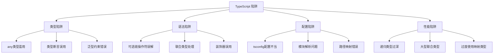

# TypeScript 常见陷阱与解决方案

## 🎯 TypeScript 陷阱总览

### 📊 陷阱类型分析



## 🚫 类型系统陷阱

### 💥 any 类型滥用陷阱

```typescript
// ❌ 陷阱：随意使用 any 类型
function badExample(value: any): any {
    return value;  // 完全失去类型安全
}

function processUserData(userData: any): any {
    // 错误：假设 userData.name 存在，但不检查
    return userData.name.toUpperCase();
}

// ✅ 解决方案：使用具体类型和类型守护
function goodExample(value: unknown): string {
    if (typeof value === 'string') {
        return value.toUpperCase();
    }
    throw new Error('Value must be a string');
}

function processUserData(userData: unknown): string {
    if (typeof userData === 'object' && userData !== null && 'name' in userData) {
        const user = userData as { name: string };
        return user.name.toUpperCase();
    }
    throw new Error('Invalid user data');
}

// 🎯 更好的解决方案：定义具体接口
interface UserData {
    name: string;
    email: string;
    age: number;
}

function processUserData(userData: UserData): string {
    return userData.name.toUpperCase();
}
```

### ⚠️ 类型推断陷阱

```typescript
// ❌ 陷阱：误解数组类型推断
function badArrayExample() {
    const numbers = [];  // 推断为 any[]
    numbers.push(1);     // OK
    numbers.push('hello'); // 也是 OK - 这是问题！
    return numbers;
}

function badFunctionExample(input: any[]) {
    // 错误：假设所有元素都是同一类型
    return input.map(item => item.toLowerCase());  // 可能出错
}

// ✅ 解决方案：明确的类型声明
function goodArrayExample(): number[] {
    const numbers: number[] = [];  // 明确声明类型
    numbers.push(1);               // OK
    // numbers.push('hello');       // ❌ TypeScript 错误
    return numbers;
}

function goodFunctionExample(input: string[]) {
    return input.map(item => item.toLowerCase());  // 类型安全
}

// 🎯 更好的解决方案：泛型使用
function genericExample<T>(items: T[]): T[] {
    return items.filter(Boolean);
}
```

### 🔧 联合类型陷阱

```typescript
// ❌ 陷阱：忽略联合类型的复杂性
function badUnionExample(status: 'loading' | 'success' | 'error') {
    return status.toUpperCase();  // 错误：无法直接调用方法
}

// ❌ 陷阱：类型守护错误使用
function badTypeGuard(input: unknown) {
    if (input.length > 0) {  // 错误：unknown 类型没有 length 属性
        return input;        // input 仍然是 unknown
    }
    return [];
}

// ✅ 解决方案：正确的类型守护
function goodUnionExample(status: 'loading' | 'success' | 'error'): string {
    // TypeScript 会自动推断这是字符串联合类型
    return status.toUpperCase();
}

function goodTypeGuard(input: unknown): string[] {
    if (Array.isArray(input)) {
        // 现在 TypeScript 知道 input 是数组
        return input.filter(item => typeof item === 'string');
    }
    return [];
}

// 🎯 高级解决方案：判别联合类型
interface LoadingState {
    type: 'loading';
}

interface SuccessState {
    type: 'success';
    data: any;
}

interface ErrorState {
    type: 'error';
    error: string;
}

type AppState = LoadingState | SuccessState | ErrorState;

function handleAppState(state: AppState) {
    switch (state.type) {
        case 'loading':
            // TypeScript 知道这是 LoadingState
            return '正在加载...';
        case 'success':
            // TypeScript 知道这是 SuccessState
            return `数据: ${state.data}`;
        case 'error':
            // TypeScript 知道这是 ErrorState
            return `错误: ${state.error}`;
    }
}
```

## 🗄️ 类与接口陷阱

### 🎯 this 绑定陷阱

```typescript
// ❌ 陷阱：方法作为回调丢失 this 上下文
class Button {
    name: string = 'Click me';
    
    addEventListener() {
        const element = document.createElement('button');
        element.textContent = this.name;
        
        // 错误：this 上下文丢失
        element.addEventListener('click', this.handleClick);
        
        // 或者在类的方法中
        setTimeout(this.logName, 1000);  // this 上下文丢失
    }
    
    handleClick() {
        console.log(this.name);  // undefined 或错误
    }
    
    logName() {
        console.log(this.name);  // undefined 或错误
    }
}

// ✅ 解决方案：使用箭头函数或绑定
class GoodButton {
    name: string = 'Click me';
    
    addEventListener() {
        const element = document.createElement('button');
        element.textContent = this.name;
        
        // 解决方案1：箭头函数保持 this 绑定
        element.addEventListener('click', () => this.handleClick());
        
        // 解决方案2：绑定 this
        element.addEventListener('click', this.handleClick.bind(this));
        
        // 解决方案3：定义时使用箭头函数
        setTimeout(() => this.logName(), 1000);
    }
    
    // 使用箭头函数定义方法（自动绑定 this）
    private readonly handleClick = () => {
        console.log(this.name);  // 始终正确
    }
    
    private readonly logName = () => {
        console.log(this.name);  // 始终正确
    }
}
```

### ⚡ 属性修饰符陷阱

```typescript
// ❌ 陷阱：忘记使用属性修饰符
class BadClass {
    name: string;        // 没有初始化，可能为 undefined
    readonly data: any;  // readonly 但编译器可能不会阻止所有修改
    
    badMethod(input: any) {
        this.name = input;  // 可能设置 undefined
        this.data.value = 'changed';  // readonly 属性被修改！
    }
}

// ❌ 陷阱：private 和 protected 的实际影响
class BadInheritance {
    private secret = 'private data';
    protected inherited = 'protected data';
    
    accessPrivate() {
        console.log(this.secret);  // 编译器允许，但可能不是预期行为
    }
}

class Child extends BadInheritance {
    accessProtected() {
        console.log(this.inherited);  // 允许访问
        // console.log(this.secret);  // 编译错误，这是正确的
    }
}

// ✅ 解决方案：正确的属性管理
class GoodClass {
    // 明确初始化
    public readonly name: string;
    protected readonly id: number;
    private readonly _data: Map<string, any>;
    
    constructor(name: string, id: number) {
        this.name = name;
        this.id = id;
        this._data = new Map();
    }
    
    // 定义明确的访问器
    public get data(): Readonly<Map<string, any>> {
        return this._data;
    }
    
    public addData(key: string, value: any): void {
        this._data.set(key, value);
    }
    
    // 类型安全的方法
    public getName(): string {
        return this.name;  // 保证是可用的字符串
    }
}

// 🎯 高级解决方案：访问控制
namespace AccessControl {
    // 使用接口 + 命名空间实现真正的私有性
    interface IPrivateClass {
        publicMethod(): string;
    }
    
    export class PrivateClass implements IPrivateClass {
        publicMethod(): string {
            return this.getSecretData();
        }
        
        // 真正的私有方法（无法从外部访问）
        private getSecretData(): string {
            return 'secret information';
        }
    }
}
```

## 🔧 配置与模块陷阱

### 📦 模块解析陷阱

```typescript
// ❌ 陷阱：混淆不同的模块系统
// 不要在同一个文件中混合使用 import 和 require
import { Component } from 'react';  // ES6 import
const fs = require('fs');            // ❌ CommonJS require

// ❌ 陷阱：路径映射错误理解
// tsconfig.json
{
  "paths": {
    "@/*": ["./src/*"],     // 错误的路径配置
    "@utils/*": ["utils/*"]  // 如果没有正确设置 baseUrl
  }
}

// 使用时的陷阱
import { Helper } from '@/utils/helper';  // 可能找不到模块
import { Helper } from '@utils/helper';  // 也可能找不到

// ✅ 解决方案：一致的模块系统
// 统一使用 ES6 模块
import { Component } from 'react';
import { readFileSync } from 'fs';

// 或者统一使用 CommonJS（不推荐用于 TypeScript）
const { Component } = require('react');
const fs = require('fs');

// ✅ 解决方案：正确的路径映射
// tsconfig.json
{
  "compilerOptions": {
    "baseUrl": "./src",        // 明确的基准路径
    "paths": {
      "@/*": ["./*"],          // 相对于 baseUrl
      "@utils/*": ["./utils/*"],
      "@components/*": ["./components/*"]
    }
  }
}

// 📁 推荐的目录结构
// src/
//   components/
//     Button.tsx
//   utils/
//     helper.ts
//   index.ts

// 使用
import { Helper } from '@/utils/helper';      // ✅ 正确
import { Button } from '@/components/Button'; // ✅ 正确
```

### 🔄 循环依赖陷阱

```typescript
// ❌ 陷阱：循环依赖
// user.ts
import { Order } from './order';

export class User {
    orders: Order[] = [];
    
    addOrder(order: Order) {
        this.orders.push(order);
    }
}

// order.ts
import { User } from './user';  // ❌ 循环依赖

export class Order {
    user: User;
    
    constructor(user: User) {
        this.user = user;
    }
}

// 使用时会出问题
const user = new User();
const order = new Order(user);  // ❌ 可能导致内存泄漏或初始化问题

// ✅ 解决方案：使用接口解耦
// user.interface.ts
export interface IUser {
    id: number;
    name: string;
    orders: IOrder[];
}

// order.interface.ts  
export interface IOrder {
    id: number;
    userId: number;
    amount: number;
}

// user.ts
import { IUser, IOrder } from './interfaces';

export class User implements IUser {
    id: number;
    name: string;
    orders: IOrder[] = [];
    
    constructor(id: number, name: string) {
        this.id = id;
        this.name = name;
    }
    
    addOrder(order: IOrder) {
        this.orders.push(order);
    }
}

// order.ts
import { IOrder, IUser } from './interfaces';

export class Order implements IOrder {
    id: number;
    userId: number;
    amount: number;
    
    constructor(id: number, userId: number, amount: number) {
        this.id = id;
        this.userId = userId;
        this.amount = amount;
    }
    
    // 不再直接引用 User 类，只引用 userId
    getUserReference(): number {
        return this.userId;
    }
}

// 🎯 更好的解决方案：服务层模式
class UserService {
    private users: Map<number, User> = new Map();
    
    getUser(userId: number): User | undefined {
        return this.users.get(userId);
    }
    
    addOrder(userId: number, order: Order): void {
        const user = this.getUser(userId);
        if (user) {
            user.addOrder(order);
        }
    }
}

class OrderService {
    private orders: Map<number, Order> = new Map();
    
    getOrder(orderId: number): Order | undefined {
        return this.orders.get(orderId);
    }
    
    createOrder(userId: number, amount: number): Order {
        const order = new Order(Date.now(), userId, amount);
        this.orders.set(order.id, order);
        return order;
    }
}
```

## 🎭 装饰器陷阱

### 🔗 装饰器执行顺序陷阱

```typescript
// ❌ 陷阱：误解装饰器执行顺序
function LogMethod(target: any, propertyKey: string, descriptor: PropertyDescriptor) {
    console.log('LogMethod 执行'); // 这会立即执行，不在方法调用时
    return descriptor;
}

function Timing(target: any, propertyKey: string, descriptor: PropertyDescriptor) {
    console.log('Timing 执行'); // 这也立即执行
    return descriptor;
}

// 装饰器的执行顺序可能会混乱
class TrapExample {
    @LogMethod
    @Timing
    async fetchData() {
        console.log('fetchData 被调用');
        return await Promise.resolve('data');
    }
}

// ❌ 错误期望：以为装饰器会在运行时执行
const example = new TrapExample();
// LogMethod 和 Timing 装饰器已经在创建 TrapExample 类时执行了
// 而不会在调用 example.fetchData() 时再次执行

// ✅ 解决方案：正确的装饰器实现
function LogMethod(target: any, propertyKey: string, descriptor: PropertyDescriptor) {
    const originalMethod = descriptor.value;
    
    descriptor.value = function (...args: any[]) {
        console.log(`方法 ${propertyKey} 被调用`);
        const result = originalMethod.apply(this, args);
        console.log(`方法 ${propertyKey} 调用完成`);
        return result;
    };
    
    return descriptor;
}

function Timing(target: any, propertyKey: string, descriptor: PropertyDescriptor) {
    const originalMethod = descriptor.value;
    
    descriptor.value = function (...args: any[]) {
        const start = performance.now();
        const result = originalMethod.apply(this, args);
        
        // 处理异步方法的时序
        if (result instanceof Promise) {
            return result.finally(() => {
                const end = performance.now();
                console.log(`方法 ${propertyKey} 执行时间: ${end - start}ms`);
            });
        } else {
            const end = performance.now();
            console.log(`方法 ${propertyKey} 执行时间: ${end - start}ms`);
            return result;
        }
    };
    
    return descriptor;
}

// ✅ 正确使用的装饰器
class GoodExample {
    @LogMethod
    @Timing
    async fetchData(): Promise<string> {
        await new Promise(resolve => setTimeout(resolve, 100));
        return 'data';
    }
}

const goodExample = new GoodExample();
await goodExample.fetchData();
// 现在会正确输出：
// "方法 fetchData 被调用"
// "方法 fetchData 执行时间: XXXms"
// "方法 fetchData 调用完成"
```

## 🚀 性能陷阱

### ⚡ 类型检查性能陷阱

```typescript
// ❌ 陷阱：过度复杂的条件类型
type BadComplexType<T> = T extends string ? 
    T extends 'red' ? 'red_string' :
    T extends 'blue' ? 'blue_string' :
    string :
T extends number ?
    T extends 0 ? 'zero' :
    T extends 1 ? 'one' :
    number :
T extends boolean ?
    T extends true ? 'true_value' : 'false_value' :
never;

// 这个类型会让 TypeScript 编译器变慢
type SlowType = BadComplexType<string | number | boolean>;

// ❌ 陷阱：递归类型过深
type RecursiveType<T> = T extends infer U ? 
    U extends object ? 
        { [K in keyof U]: RecursiveType<U[K]> } : 
        U : 
    never;

// 使用这个类型可能会导致编译器超时
// type Deep = RecursiveType<VeryDeepObject>;

// ✅ 解决方案：简化条件类型
type SimpleType<T> = 
    T extends string ? string :
    T extends number ? number :
    T extends boolean ? boolean :
    unknown;

// 使用工具类型避免重复
type ColorType<T> = T extends string ? T extends `#${string}` ? string : never : never;
type SizeType<T> = T extends number ? T extends 0 | 1 | 2 | 3 | 4 ? number : never : never;

// ✅ 解决方案：安全深度限制
type SafeRecursive<T, Depth extends number = 3> = 
    Depth extends 0 ? T :
    T extends object ?
        { [K in keyof T]: SafeRecursive<T[K], Prev<Depth>> } :
        T;

type Prev<T extends number> = [...Array<T, never>] extends [infer A, ...infer _] 
    ? A extends number ? A : never 
    : never;

// 限制深度为 3 层，防止性能问题
type SafeDeep = SafeRecursive<ComplexObject, 3>;
```

## 📚 最佳实践总结

### 🎯 避免陷阱的核心原则

```typescript
// 1. 明确的类型定义
interface UserConfig {
    readonly id: string;
    name: string;
    preferences: UserPreferences;
}

// 2. 正确的错误处理
function safeGetUser(id: string): UserConfig | null {
    try {
        return getUserFromCache(id) || null;
    } catch (error) {
        console.error('Failed to get user:', error);
        return null;
    }
}

// 3. 使用类型守护
function isValidUser(value: unknown): value is UserConfig {
    return typeof value === 'object' && 
           value !== null &&
           'id' in value &&
           typeof (value as any).id === 'string';
}

// 4. 合理的泛型约束
function processItems<T extends { id: string }>(items: T[]): T[] {
    return items.filter(item => item.id !== '');
}

// 5. 避免性能问题
type SimpleUnion = 'red' | 'green' | 'blue';  // ✅ 简单联合类型
type ComplexUnion = string | number | boolean | object;  // ❌ 过大联合类型
```

### 🔗 相关深入学习

- [[02-Type-Errors-Debug指南]] - 详细调试策略
- [[04-Architecture-Decisions架构决策]] - 架构层面的陷阱避免
- [[01-Type-Design-Patterns类型设计模式]] - 正确的类型设计

---
*💡 了解常见陷阱能帮助您避免 80% 的 TypeScript 问题，提高代码质量和开发效率*
