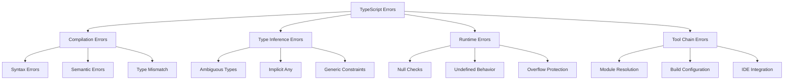

# TypeScript 类型错误调试完全指南

## 🎯 类型错误调试图览

### 📊 常见错误分类



## 🔧 调试策略与工具

### 💡 系统化错误诊断

```typescript
// 1. TypeScript Error Diagnostic Framework
class TypeScriptDebugger {
    private diagnostics: Diagnostic[] = [];
    private errorPatterns: ErrorPattern[] = [];
    
    constructor(private program: ts.Program, private checker: ts.TypeChecker) {
        this.setupErrorPatterns();
    }
    
    // 系统化错误分析
    analyzeAllErrors(): DiagnosticReport {
        const diagnostics = ts.getDiagnostics(this.program).filter(d => d.category === ts.DiagnosticCategory.Error);
        
        const report: DiagnosticReport = {
            totalErrors: diagnostics.length,
            errorsByType: this.groupErrorsByType(diagnostics),
            errorsByFile: this.groupErrorsByFile(diagnostics),
            suggestedFixes: this.generateFixSuggestions(diagnostics),
            complexityAnalysis: this.analyzeComplexity(diagnostics),
            performanceImpact: this.assessPerformanceImpact(diagnostics)
        };
        
        return report;
    }
    
    // 错误模式识别
    private setupErrorPatterns(): void {
        this.errorPatterns = [
            // 类型不匹配错误
            {
                pattern: /Type.*is not assignable to type/,
                category: 'TYPE_MISMATCH',
                severity: 'ERROR',
                commonCause: '接口不匹配或类型转换错误',
                suggestsFix: ['检查接口定义', '使用类型断言', '重新设计数据类型']
            },
            
            // 空值检查错误
            {
                pattern: /Object is possibly 'null' or 'undefined'/,
                category: 'NULL_CHECK',
                severity: 'ERROR',
                commonCause: '未进行空值检查',
                suggestsFix: ['添加空值检查', '使用可选链', '使用非空断言']
            },
            
            // 泛型约束错误
            {
                pattern: /Type argument.*does not satisfy the constraint/,
                category: 'GENERIC_CONSTRAINT',
                severity: 'ERROR',
                commonCause: '泛型参数不满足约束条件',
                suggestsFix: ['修改泛型约束', '调整类型参数', '重新设计泛型接口']
            },
            
            // 模块解析错误
            {
                pattern: /Cannot find module/,
                category: 'MODULE_RESOLUTION',
                severity: 'ERROR',
                commonCause: '模块路径或依赖问题',
                suggestsFix: ['检查模块路径', '安装缺失依赖', '更新tsconfig配置']
            },
            
            // 函数签名错误
            {
                pattern: /Expected.*arguments but got/,
                category: 'FUNCTION_SIGNATURE',
                severity: 'ERROR',
                commonCause: '函数参数不匹配',
                suggestsFix: ['修正参数数量', '检查参数类型', '使用剩余参数']
            },
            
            // 索引签名错误
            {
                pattern: /Index signature of type.*is missing/,
                category: 'INDEX_SIGNATURE',
                severity: 'ERROR',
                commonCause: '缺少索引签名',
                suggestsFix: ['添加索引签名', '使用Record类型', '重构数据结构']
            }
        ];
    }
    
    // 错误分类和优先级评估
    categorizeError(error: ts.Diagnostic): ErrorCategory {
        const message = error.messageText.toString();
        
        const matchingPattern = this.errorPatterns.find(pattern => 
            pattern.pattern.test(message)
        );
        
        if (matchingPattern) {
            return {
                category: matchingPattern.category,
                severity: matchingPattern.severity,
                priority: this.calculatePriority(error, matchingPattern),
                suggestsFix: matchingPattern.suggestsFix,
                complexity: this.assessComplexity(error),
                rootCause: this.analyzeRootCause(error)
            };
        }
        
        return {
            category: 'UNKNOWN',
            severity: 'ERROR',
            priority: 'MEDIUM',
            suggestsFix: ['详细分析错误消息', '查阅TypeScript文档', '寻求社区帮助'],
            complexity: 'MEDIUM',
            rootCause: '需要进一步分析'
        };
    }
    
    // 智能修复建议生成
    generateFixSuggestions(diagnostics: ts.Diagnostic[]): FixSuggestion[] {
        const suggestions: FixSuggestion[] = [];
        
        for (const diagnostic of diagnostics) {
            const categorization = this.categorizeError(diagnostic);
            
            switch (categorization.category) {
                case 'TYPE_MISMATCH':
                    suggestions.push(this.generateTypeMismatchFix(diagnostic));
                    break;
                    
                case 'NULL_CHECK':
                    suggestions.push(this.generateNullCheckFix(diagnostic));
                    break;
                    
                case 'GENERIC_CONSTRAINT':
                    suggestions.push(this.generateGenericConstraintFix(diagnostic));
                    break;
                    
                case 'MODULE_RESOLUTION':
                    suggestions.push(this.generateModuleResolutionFix(diagnostic));
                    break;
                    
                case 'FUNCTION_SIGNATURE':
                    suggestions.push(this.generateFunctionSignatureFix(diagnostic));
                    break;
                    
                default:
                    suggestions.push(this.generateGenericFix(diagnostic));
            }
        }
        
        return suggestions;
    }
    
    // 具体修复逻辑
    private generateTypeMismatchFix(diagnostic: ts.Diagnostic): FixSuggestion {
        const info = diagnostic.file?.text.slice(diagnostic.start, diagnostic.end);
        
        return {
            diagnostic,
            type: 'TYPE_MISMATCH',
            priority: 'HIGH',
            description: '类型不匹配错误',
            fixes: [
                {
                    type: 'TYPE_ASSERTION',
                    description: '使用类型断言',
                    example: `(${info} as TargetType)`,
                    confidence: 0.7
                },
                {
                    type: 'INTERFACE_UPDATE',
                    description: '更新接口定义',
                    example: `interface UpdatedInterface {\n  property: CompatibleType;\n}`,
                    confidence: 0.8
                },
                {
                    type: 'GENERIC_TYPE_ARGUMENT',
                    description: '指定泛型类型参数',
                    example: `GenericType<CompatibleType>`,
                    confidence: 0.9
                }
            ],
            prevention: [
                '使用更严格的类型定义',
                '启用strict模式',
                '定期进行类型检查'
            ]
        };
    }
    
    private generateNullCheckFix(diagnostic: ts.Diagnostic): FixSuggestion {
        return {
            diagnostic,
            type: 'NULL_CHECK',
            priority: 'HIGH',
            description: '空值检查错误',
            fixes: [
                {
                    type: 'OPTIONAL_CHAINING',
                    description: '使用可选链操作符',
                    example: 'object?.property?.method()',
                    confidence: 0.9
                },
                {
                    type: 'NON_NULL_ASSERTION',
                    description: '使用非空断言操作符',
                    example: 'object!.property',
                    confidence: 0.6
                },
                {
                    type: 'EXPLICIT_CHECK',
                    description: '添加显式空值检查',
                    example: 'if (object && object.property) { ... }',
                    confidence: 0.8
                },
                {
                    type: 'DEFAULT_VALUES',
                    description: '使用默认值',
                    example: 'const value = object?.property ?? defaultValue',
                    confidence: 0.7
                }
            ],
            prevention: [
                '启用strictNullChecks',
                '使用Optional类型',
                '在if语句中进行空值检查'
            ]
        };
    }
    
    private generateGenericConstraintFix(diagnostic: ts.Diagnostic): FixSuggestion {
        return {
            diagnostic,
            type: 'GENERIC_CONSTRAINT',
            priority: 'MEDIUM',
            description: '泛型约束错误',
            fixes: [
                {
                    type: 'CONSTRAINT_ADJUSTMENT',
                    description: '调整泛型约束',
                    example: 'T extends CompatibleType',
                    confidence: 0.8
                },
                {
                    type: 'CONDITIONAL_TYPE',
                    description: '使用条件类型',
                    example: 'T extends SomeType ? CompatibleType : Never',
                    confidence: 0.7
                },
                {
                    type: 'TYPE_MAPPING',
                    description: '使用类型映射',
                    example: '{ [K in keyof T]: CompatibleType<T[K]> }',
                    confidence: 0.6
                }
            ],
            prevention: [
                '精心设计泛型约束',
                '使用更灵活的约束条件',
                '考虑使用联合类型'
            ]
        };
    }
};
```

### 🎪 实际调试案例

```typescript
// 2. Real-world Debugging Cases

// Case 1: Complex Generic Type Error
// 问题：复杂的泛型类型错误
class ServiceRegistry<T extends Record<string, any>> {
    private services = new Map<keyof T, T[keyof T]>();
    
    register<K extends keyof T>(name: K, service: T[K]): void {
        this.services.set(name, service);
    }
    
    get<K extends keyof T>(name: K): T[K] {
        const service = this.services.get(name);
        if (!service) {
            throw new Error(`Service ${String(name)} not found`);
        }
        return service; // ❌ Type error here
    }
    
    // 调试过程：
    // 1. 错误信息：Type 'T[keyof T]' is not assignable to type 'T[K]'
    // 2. 分析：Map.get() 返回 T[keyof T] | undefined，但我们期望 T[K]
    // 3. 解决方案：使用类型断言或重新设计类型
    
    // 修复方案 1: 类型断言
    getFixed<K extends keyof T>(name: K): T[K] {
        const service = this.services.get(name);
        if (!service) {
            throw new Error(`Service ${String(name)} not found`);
        }
        return service as T[K]; // ✅ Type assertion
    }
    
    // 修复方案 2: 重新设计类型系统
    getBetter<K extends keyof T>(name: K): T[K] | undefined {
        return this.services.get(name) as T[K] | undefined; // ✅ More precise type
    }
}
```

```typescript
// Case 2: Module Resolution Issues
// 问题：模块解析问题

// 错误的导入方式
// import { UserService } from './services/user-service'; // ❌ Module not found

// 调试步骤：
// 1. 检查文件路径是否正确
// 2. 检查文件是否存在
// 3. 检查 tsconfig.json 配置
// 4. 检查模块导出

// 解决方案：
// 检查 tsconfig.json
const exampleTsConfig = {
    "compilerOptions": {
        "baseUrl": ".",
        "paths": {
            "@services/*": ["src/services/*"],
            "@components/*": ["src/components/*"],
            "@utils/*": ["src/utils/*"]
        },
        "moduleResolution": "node",
        "esModuleInterop": true,
        "allowSyntheticDefaultImports": true
    }
};

// 正确的导入方式
import { UserService } from '@services/user-service';
import UserComponent from '@components/user-component';
import { formatDate } from '@utils/date-utils';
```

```typescript
// Case 3: Strict Null Checks Issues
// 问题：严格空值检查问题

interface UserProfile {
    id: string;
    name: string;
    email?: string;
    avatar?: string;
}

class UserProfileManager {
    private profiles = new Map<string, UserProfile>();
    
    // ❌ 问题代码：可能返回 undefined
    getProfile(userId: string): UserProfile {
        return this.profiles.get(userId); // ❌ Error: Object is possibly 'undefined'
    }
    
    // ✅ 修复方案 1: 明确返回类型
    getProfile(userId: string): UserProfile | undefined {
        return this.profiles.get(userId);
    }
    
    // ✅ 修复方案 2: 抛出异常
    getProfileRequired(userId: string): UserProfile {
        const profile = this.profiles.get(userId);
        if (!profile) {
            throw new Error(`Profile not found for user: ${userId}`);
        }
        return profile;
    }
    
    // ✅ 修复方案 3: 提供默认值
    getProfileWithDefault(userId: string): UserProfile {
        const profile = this.profiles.get(userId);
        if (!profile) {
            return {
                id: userId,
                name: 'Unknown User'
            };
        }
        return profile;
    }
    
    // ✅ 修复方案 4: 使用可选链
    updateProfile(userId: string, updates: Partial<UserProfile>): boolean {
        const profile = this.profiles.get(userId);
        if (!profile) return false;
        
        // Safe access with optional chaining
        if (updates.name) {
            profile.name = updates.name;
        }
        if (updates.email?.includes('@')) { // ✅ Optional chaining + condition
            profile.email = updates.email;
        }
        
        return true;
    }
}
```

```typescript
// Case 4: Complex Union Type Issues
// 问题：复杂联合类型问题

type ApiResponse<T> = 
    | { success: true; data: T }
    | { success: false; error: string };

type User = { id: string; name: string; email: string };

class UserApiClient {
    async fetchUser(id: string): Promise<ApiResponse<User>> {
        try {
            const response = await fetch(`/api/users/${id}`);
            const data = await response.json();
            
            if (response.ok) {
                return { success: true, data }; // ❌ Type error: data might not be User
            } else {
                return { success: false, error: data.message };
            }
        } catch (error) {
            return { 
                success: false, 
                error: error instanceof Error ? error.message : 'Unknown error' 
            };
        }
    }
    
    // ✅ 修复：添加类型验证
    async fetchUserSafe(id: string): Promise<ApiResponse<User>> {
        try {
            const response = await fetch(`/api/users/${id}`);
            const data = await response.json();
            
            if (response.ok) {
                // Validate the data structure
                if (this.isValidUser(data)) {
                    return { success: true, data };
                } else {
                    return { success: false, error: 'Invalid user data received' };
                }
            } else {
                return { success: false, error: data.message || 'Request failed' };
            }
        } catch (error) {
            return { 
                success: false, 
                error: error instanceof Error ? error.message : 'Unknown error' 
            };
        }
    }
    
    private isValidUser(data: any): data is User {
        return (
            typeof data === 'object' &&
            data !== null &&
            typeof data.id === 'string' &&
            typeof data.name === 'string' &&
            typeof data.email === 'string'
        );
    }
    
    // ✅ 使用类型守护
    handleUserResponse(response: ApiResponse<User>): void {
        if (response.success) {
            // TypeScript knows this is { success: true; data: User }
            console.log(`User: ${response.data.name}`);
            console.log(`Email: ${response.data.email}`);
        } else {
            // TypeScript knows this is { success: false; error: string }
            console.error(`Error: ${response.error}`);
        }
    }
}
```

```typescript
// Case 5: Generic Constraints Debugging
// 问题：泛型约束调试

// ❌ 问题代码：复杂的泛型约束不满足
interface DataProcessor<T> {
    process(data: T): T;
}

interface StringProcessor extends DataProcessor<string> {
    process(data: string): string;
}

// 复杂的泛型工厂函数
function createProcessor<T, P extends DataProcessor<T>>(
    processorType: new () => P
): P {
    return new processorType();
}

// ❌ 使用时的错误
const processor = createProcessor(StringProcessor); // Type error!

// ✅ 修复方案：重新设计泛型约束
interface DataProcessor<T, P = T> {
    process(data: T): P;
}

interface TransformProcessor<T, P> extends DataProcessor<T, P> {
    transform(data: T): P;
}

// 更灵活的设计
interface StringLengthProcessor extends DataProcessor<string, number> {
    process(data: string): number {
        return data.length;
    }
    
    transform(data: string): number {
        return data.trim().length;
    }
}

// ✅ 正确的使用方式
function createStringProcessor(): StringLengthProcessor {
    return {
        process(data: string): number {
            return data.length;
        },
        transform(data: string): number {
            return data.trim().length;
        }
    };
}
```

## 🚀 调试工具和技巧

### 🔄 高级调试技巧

```typescript
// 3. Advanced Debugging Tools and Techniques

// Type-level debugging - 编译时类型调试
type DebugType<T> = T extends infer U 
    ? {
        readonly typeName: string;
        readonly properties: keyof U extends never ? 'Primitive' : keyof U;
        readonly isNullable: null extends U ? true : false;
        readonly isUndefinable: undefined extends U ? true : false;
    }
    : never;

// 使用示例
type UserDebugInfo = DebugType<User>;
// 结果: { typeName: "User"; properties: "id" | "name" | "email"; isNullable: false; isUndefinable: false }

// 运行时类型验证
class TypeValidator {
    static validateUser(data: any): data is User {
        return (
            this.hasProperty(data, 'id', 'string') &&
            this.hasProperty(data, 'name', 'string') &&
            this.hasProperty(data, 'email', 'string')
        );
    }
    
    static validateApiResponse<T>(data: any, validator: (data: any) => data is T): ApiResponse<T> {
        if (typeof data === 'object' && data !== null) {
            if ('success' in data && data.success === true) {
                if ('data' in data && validator(data.data)) {
                    return { success: true, data: data.data };
                }
            } else if ('success' in data && data.success === false) {
                if ('error' in data && typeof data.error === 'string') {
                    return { success: false, error: data.error };
                }
            }
        }
        
        throw new Error('Invalid API response format');
    }
    
    private static hasProperty(obj: any, prop: string, type: string): boolean {
        return obj !== null && 
               typeof obj === 'object' && 
               prop in obj && 
               typeof obj[prop] === type;
    }
}

// 调试配置助手
class DebugConfigurationHelper {
    static generateStrictConfig(): ts.CompilerOptions {
        return {
            strict: true,
            noImplicitAny: true,
            strictNullChecks: true,
            strictFunctionTypes: true,
            strictBindCallapply: true,
            strictPropertyInitialization: true,
            noImplicitReturns: true,
            noFallthroughCasesInSwitch: true,
            noUncheckedIndexedAccess: true,
            exactOptionalPropertyTypes: true,
            noImplicitOverride: true,
            noPropertyAccessFromIndexSignature: true,
            noUnsafeAny: true,
            noUnsafeMemberAccess: true,
            noUnsafeNegation: true
        };
    }
    
    static generateDevelopmentConfig(): ts.CompilerOptions {
        return {
            ...this.generateStrictConfig(),
            inlineSourceMap: true,
            inlineSources: true,
            preserveSymlinks: true,
            skipLibCheck: true
        };
    }
    
    static generateProductionConfig(): ts.CompilerOptions {
        return {
            ...this.generateStrictConfig(),
            declaration: true,
            declarationMap: true,
            sourceMap: true,
            removeComments: true,
            importHelpers: true,
            skipLibCheck: true
        };
    }
}

// 错误统计和趋势分析
class ErrorAnalytics {
    private errorHistory: ErrorRecord[] = [];
    
    recordError(error: TypeScriptError): void {
        const record: ErrorRecord = {
            ...error,
            timestamp: new Date(),
            resolved: false
        };
        
        this.errorHistory.push(record);
    }
    
    analyzeTrends(): ErrorTrendAnalysis {
        const recentErrors = this.errorHistory.slice(-30); // Last 30 errors
        
        return {
            mostCommonErrors: this.findMostCommonErrors(recentErrors),
            resolutionRate: this.calculateResolutionRate(),
            averageResolutionTime: this.calculateAverageResolutionTime(),
            categoryDistribution: this.categorizeErrors(recentErrors),
            recommendations: this.generateRecommendations(recentErrors)
        };
    }
    
    private findMostCommonErrors(errors: ErrorRecord[]): ErrorFrequency[] {
        const frequencyMap = new Map<string, number>();
        
        errors.forEach(error => {
            const key = error.message;
            frequencyMap.set(key, (frequencyMap.get(key) || 0) + 1);
        });
        
        return Array.from(frequencyMap.entries())
            .map(([message, count]) => ({ message, count }))
            .sort((a, b) => b.count - a.count)
            .slice(0, 10);
    }
    
    private generateRecommendations(errors: ErrorRecord[]): Recommendation[] {
        const recommendations: Recommendation[] = [];
        
        // 分析错误模式并生成建议
        const nullCheckErrors = errors.filter(e => e.type === 'NULL_CHECK');
        if (nullCheckErrors.length > 5) {
            recommendations.push({
                type: 'CONFIGURATION',
                title: '启用严格空值检查',
                description: '考虑在项目中启用 strictNullChecks 来提高空值安全性',
                priority: 'HIGH',
                action: '在 tsconfig.json 中设置 "strictNullChecks": true'
            });
        }
        
        const typeMismatchErrors = errors.filter(e => e.type === 'TYPE_MISMATCH');
        if (typeMismatchErrors.length > 10) {
            recommendations.push({
                type: 'PRACTICE',
                title: '改进类型定义',
                description: '考虑改进接口定义和类型约束',
                priority: 'MEDIUM',
                action: '审查和更新核心接口定义'
            });
        }
        
        return recommendations;
    }
}

// Supporting Types for Error Analytics
interface ErrorFrequency {
    message: string;
    count: number;
}

interface ErrorTrendAnalysis {
    mostCommonErrors: ErrorFrequency[];
    resolutionRate: number;
    averageResolutionTime: number;
    categoryDistribution: Map<string, number>;
    recommendations: Recommendation[];
}

interface Recommendation {
    type: 'CONFIGURATION' | 'PRACTICE' | 'TOOLING' | 'ARCHITECTURE';
    title: string;
    description: string;
    priority: 'LOW' | 'MEDIUM' | 'HIGH' | 'CRITICAL';
    action: string;
}
```

### 🔗 相关深入学习

- [[01-Common-Pitfalls常见陷阱]] - 常见陷阱避免指南
- [[02-Performance-Issues性能问题]] - 性能问题解决方案
- [[04-Architecture-Decisions架构决策]] - 架构决策指南

---
*💡 系统化的类型错误调试不仅能够快速解决问题，还能预防类似错误的发生，是提升TypeScript开发效率的关键技能*
