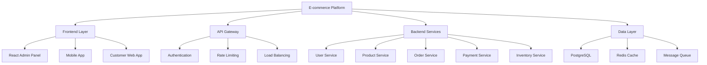

# TypeScript 电商平台实战案例

## 🎯 电商平台架构概览

### 📊 微服务架构设计



## 🔧 领域模型设计

### 💡 核心业务实体

```typescript
// 1. User Domain - 用户领域
namespace UserDomain {
    export interface User {
        readonly id: UserId;
        email: Email;
        profile: UserProfile;
        preferences: UserPreferences;
        status: UserStatus;
        readonly createdAt: Date;
        readonly updatedAt: Date;
    }
    
    export interface UserProfile {
        firstName: string;
        lastName: string;
        phone?: PhoneNumber;
        dateOfBirth?: Date;
        avatar?: string;
        addresses: Address[];
        defaultAddress?: AddressId;
    }
    
    export interface UserPreferences {
        language: LanguageCode;
        currency: CurrencyCode;
        timezone: string;
        notifications: NotificationSettings;
        privacy: PrivacySettings;
    }
    
    export interface NotificationSettings {
        emailMarketing: boolean;
        smsPromotions: boolean;
        pushNotifications: boolean;
        orderUpdates: boolean;
        priceAlerts: boolean;
    }
    
    export interface PrivacySettings {
        profileVisibility: 'public' | 'private';
        showEmail: boolean;
        showPhone: boolean;
        allowRecommendations: boolean;
        dataSharing: boolean;
    }
    
    // Value Objects
    export type UserId = Brand<string, 'UserId'>;
    export type Email = Brand<string, 'Email'>;
    export type PhoneNumber = Brand<string, 'PhoneNumber'>;
    export type AddressId = Brand<string, 'AddressId'>;
    export type LanguageCode = Brand<string, 'LanguageCode'>;
    export type CurrencyCode = Brand<string, 'CurrencyCode'>;
    
    export type UserStatus = 'active' | 'inactive' | 'suspended' | 'pending_verification';
}

// 2. Product Domain - 商品领域
namespace ProductDomain {
    export interface Product {
        readonly id: ProductId;
        sku: ProductSKU;
        name: MultiLanguageString;
        description: MultiLanguageString;
        category: Category;
        brand?: Brand;
        variants: ProductVariant[];
        media: Media[];
        pricing: Pricing;
        inventory: InventoryStatus;
        attributes: ProductAttribute[];
        seo: SEOData;
        status: ProductStatus;
        readonly createdAt: Date;
        readonly updatedAt: Date;
    }
    
    export interface ProductVariant {
        readonly id: VariantId;
        sku: VariantSKU;
        name: string;
        attributes: VariantAttribute[];
        pricing: VariantPricing;
        inventory: InventoryStatus;
        media: Media[];
        isDefault: boolean;
    }
    
    export interface Pricing {
        basePrice: Money;
        compareAtPrice?: Money;
        discounts: Discount[];
        taxClass?: TaxClass;
        shipping?: ShippingConfiguration;
    }
    
    export interface InventoryStatus {
        quantity: number;
        reserved: number;
        available: number;
        trackQuantity: boolean;
        allowBackorder: boolean;
        lowStockThreshold: number;
        status: InventoryStatusType;
    }
    
    export interface ProductAttribute {
        name: string;
        value: string | number | boolean;
        type: 'text' | 'number' | 'boolean' | 'select' | 'multi_select';
        options?: string[];
        required: boolean;
        searchable: boolean;
    }
    
    // Value Objects
    export type ProductId = Brand<string, 'ProductId'>;
    export type ProductSKU = Brand<string, 'ProductSKU'>;
    export type VariantId = Brand<string, 'VariantId'>;
    export type VariantSKU = Brand<string, 'VariantSKU'>;
    export type CategoryId = Brand<string, 'CategoryId'>;
    export type BrandId = Brand<string, 'BrandId'>;
    
    export type MultiLanguageString = Record<string, string>;
    export type ProductStatus = 'draft' | 'active' | 'inactive' | 'archived';
    export type InventoryStatusType = 'in_stock' | 'low_stock' | 'out_of_stock' | 'backorder';
}

// 3. Order Domain - 订单领域
namespace OrderDomain {
    export interface Order {
        readonly id: OrderId;
        customerId: UserDomain.UserId;
        orderNumber: OrderNumber;
        status: OrderStatus;
        items: OrderItem[];
        pricing: OrderPricing;
        shipping: ShippingInfo;
        billing: BillingInfo;
        payment: PaymentInfo;
        timeline: OrderTimeline;
        metadata: OrderMetadata;
        readonly createdAt: Date;
        readonly updatedAt: Date;
    }
    
    export interface OrderItem {
        readonly id: OrderItemId;
        productId: ProductDomain.ProductId;
        variantId: ProductDomain.VariantId;
        sku: string;
        name: string;
        quantity: number;
        unitPrice: Money;
        totalPrice: Money;
        discounts: ItemDiscount[];
        taxes: ItemTax[];
        shipping: ItemShipping;
        metadata: ItemMetadata;
    }
    
    export interface OrderPricing {
        subtotal: Money;
        discounts: Money;
        taxes: Money;
        shipping: Money;
        total: Money;
        currency: CurrencyCode;
        exchangeRate?: number;
    }
    
    export interface ShippingInfo {
        method: ShippingMethod;
        address: Address;
        tracking?: TrackingInfo;
        timeline: ShippingTimeline;
        insurance?: InsuranceInfo;
        customs?: CustomsInfo;
    }
    
    export interface PaymentInfo {
        method: PaymentMethod;
        status: PaymentStatus;
        transactionId?: string;
        gateway: PaymentGateway;
        amount: Money;
        fees: Money;
        timeline: PaymentTimeline;
        refunds?: RefundInfo[];
        subscriptions?: SubscriptionInfo;
    }
    
    export interface OrderTimeline {
        created: Timestamp;
        paid?: Timestamp;
        confirmed?: Timestamp;
        processing?: Timestamp;
        shipped?: Timestamp;
        delivered?: Timestamp;
        cancelled?: Timestamp;
        refunded?: Timestamp;
    }
    
    // Value Objects
    export type OrderId = Brand<string, 'OrderId'>;
    export type OrderNumber = Brand<string, 'OrderNumber'>;
    export type OrderItemId = Brand<string, 'OrderItemId'>;
    export type OrderStatus = 'pending' | 'confirmed' | 'processing' | 'shipped' | 'delivered' | 'cancelled' | 'refunded';
    export type PaymentStatus = 'pending' | 'failed' | 'processed' | 'refunded' | 'partially_refunded';
    export type ShippingMethod = 'standard' | 'express' | 'overnight' | 'same_day';
    export type PaymentMethod = 'credit_card' | 'debit_card' | 'paypal' | 'apple_pay' | 'google_pay' | 'bank_transfer';
    export type PaymentGateway = 'stripe' | 'paypal' | 'square' | 'braintree';
}

// 4. Payment Domain - 支付领域
namespace PaymentDomain {
    export interface PaymentTransaction {
        readonly id: TransactionId;
        orderId: OrderDomain.OrderId;
        customerId: UserDomain.UserId;
        amount: Money;
        currency: CurrencyCode;
        method: PaymentMethod;
        gateway: PaymentGateway;
        status: TransactionStatus;
        metadata: TransactionMetadata;
        timeline: PaymentTimeline;
        fees: TransactionFees;
        risks: RiskAssessment;
        readonly createdAt: Date;
        readonly updatedAt: Date;
    }
    
    export interface PaymentGateway {
        name: GatewayName;
        configuration: GatewayConfiguration;
        capabilities: GatewayCapabilities;
        webhooks: WebhookConfiguration[];
        metadata: GatewayMetadata;
    }
    
    export interface GatewayConfiguration {
        apiKey: string;
        webhookSecret: string;
        environment: 'sandbox' | 'production';
        regions: string[];
        supportedCurrencies: CurrencyCode[];
        supportedMethods: PaymentMethod[];
    }
    
    export interface RiskAssessment {
        score: number;
        level: RiskLevel;
        factors: RiskFactor[];
        recommendations: RiskRecommendation[];
    }
    
    export interface TransactionFees {
        processing: Money;
        gateway: Money;
        international: Money;
        total: Money;
        breakdown: FeeBreakdown[];
    }
    
    // Value Objects
    export type TransactionId = Brand<string, 'TransactionId'>;
    export type GatewayName = 'stripe' | 'paypal' | 'square' | 'braintree' | 'adyen';
    export type TransactionStatus = 'pending' | 'processing' | 'succeeded' | 'failed' | 'cancelled' | 'refunded';
    export type RiskLevel = 'low' | 'medium' | 'high' | 'critical';
}

// 5. Common Value Objects - 通用值对象
namespace Common {
    export interface Money {
        amount: number;
        currency: CurrencyCode;
    }
    
    export interface Address {
        readonly id: AddressId;
        type: AddressType;
        street1: string;
        street2?: string;
        city: string;
        state: string;
        postalCode: string;
        country: CountryCode;
        isDefault?: boolean;
    }
    
    export interface Media {
        readonly id: MediaId;
        url: string;
        type: MediaType;
        alt?: string;
        caption?: string;
        order: number;
        dimensions?: Dimensions;
        sizes?: MediaSizes;
    }
    
    export interface SEOData {
        title: string;
        description: string;
        keywords: string[];
        canonical?: string;
        robots?: string;
        sitemap?: boolean;
        structuredData?: StructuredData;
    }
    
    export interface Timestamp {
        date: Date;
        timezone: string;
    }
    
    // Value Objects
    export type AddressId = Brand<string, 'AddressId'>;
    export type AddressType = 'billing' | 'shipping' | 'office' | 'home';
    export type CountryCode = Brand<string, 'CountryCode'>;
    export type CurrencyCode = Brand<string, 'CurrencyCode'>;
    export type MediaId = Brand<string, 'MediaId'>;
    export type MediaType = 'image' | 'video' | 'document' | 'audio';
    
    export interface Dimensions {
        width: number;
        height: number;
    }
    
    export interface MediaSizes {
        thumbnail: MediaSize;
        small: MediaSize;
        medium: MediaSize;
        large: MediaSize;
    }
    
    export interface MediaSize {
        url: string;
        width: number;
        height: number;
    }
}

// Brand Types - 类型品牌化
type Brand<T, Tag> = T & { __brand: Tag };
```

## 🚀 服务层实现

### 🔄 用户服务实现

```typescript
// User Service Implementation
import { Repository } from '../../infrastructure/repository';
import { EventPublisher } from '../../infrastructure/events';
import { DomainEvent } from '../../common/events';

export class UserService {
    constructor(
        private userRepository: Repository<UserDomain.User>,
        private eventPublisher: EventPublisher
    ) {}
    
    async createUser(command: CreateUserCommand): Promise<UserDomain.UserId> {
        // 验证业务规则
        await this.validateCreateUserCommand(command);
        
        // 创建用户实体
        const userId = this.generateUserId();
        const user: UserDomain.User = {
            id: userId,
            email: command.email,
            profile: command.profile,
            preferences: command.preferences,
            status: 'pending_verification',
            status: 'createdAt': new Date(),
            status: 'updatedAt': new Date()
        };
        
        // 保存到持久层
        await this.userRepository.save(user);
        
        // 发布领域事件
        await this.eventPublisher.publish(new UserCreatedEvent(userId, command.email));
        
        return userId;
    }
    
    async updateProfile(command: UpdateProfileCommand): Promise<void> {
        const user = await this.getUserById(command.userId);
        assert.notNull(user, `User not found: ${command.userId}`);
        
        // 应用业务规则
        const updatedUser = this.applyProfileUpdate(user, command.updates);
        
        // 验证更新后的状态
        await this.validateUserState(updatedUser);
        
        // 保存更改
        await this.userRepository.save(updatedUser);
        
        // 发布事件
        await this.eventPublisher.publish(
            new UserProfileUpdatedEvent(command.userId, command.updates)
        );
    }
    
    async suspendUser(command: SuspendUserCommand): Promise<void> {
        const user = await this.getUserById(command.userId);
        assert.notNull(user, `User not found: ${command.userId}`);
        
        if (user.status === 'suspended') {
            throw new BusinessRuleViolation('User already suspended');
        }
        
        const suspendedUser: UserDomain.User = {
            ...user,
            status: 'suspended',
            updatedAt: new Date()
        };
        
        await this.userRepository.save(suspendedUser);
        
        await this.eventPublisher.publish(
            new UserSuspendedEvent(command.userId, command.reason)
        );
        
        // 取消相关订单和退款
        await this.cancelPendingOrders(command.userId);
    }
    
    private async validateCreateUserCommand(command: CreateUserCommand): Promise<void> {
        // 检查邮箱唯一性
        const existingUser = await this.userRepository.findByEmail(command.email);
        if (existingUser) {
            throw new BusinessRuleViolation('Email already exists');
        }
        
        // 验证邮箱格式
        if (!this.isValidEmail(command.email)) {
            throw new ValidationError('Invalid email format');
        }
        
        // 验证密码强度
        if (!this.isStrongPassword(command.password)) {
            throw new ValidationError('Password does not meet security requirements');
        }
        
        // 验证地址信息
        if (command.profile.addresses.length === 0) {
            throw new ValidationError('At least one address is required');
        }
    }
    
    private applyProfileUpdate(user: UserDomain.User, updates: Partial<UserDomain.UserProfile>): UserDomain.User {
        const updatedProfile: UserDomain.UserProfile = {
            ...user.profile,
            ...updates
        };
        
        // 如果更新了地址，验证地址信息
        if (updates.addresses) {
            updatedProfile.addresses = this.validateAddresses(updates.addresses);
        }
        
        // 如果更新了首选地址，确保地址存在于地址列表中
        if (updates.defaultAddress) {
            const addressExists = updatedProfile.addresses.some(
                addr => addr.id === updates.defaultAddress
            );
            if (!addressExists) {
                throw new ValidationError('Default address must exist in address list');
            }
        }
        
        return {
            ...user,
            profile: updatedProfile,
            updatedAt: new Date()
        };
    }
    
    private validateAddresses(addresses: Common.Address[]): Common.Address {
        for (const address of addresses) {
            this.validateAddress(address);
        }
        return addresses;
    }
    
    private validateAddress(address: Common.Address): void {
        if (!address.street1.trim()) {
            throw new ValidationError('Street address is required');
        }
        
        if (!address.city.trim()) {
            throw new ValidationError('City is required');
        }
        
        if (!address.postalCode.trim()) {
            throw new ValidationError('Postal code is required');
        }
        
        if (!this.isValidCountryCode(address.country)) {
            throw new ValidationError('Invalid country code');
        }
    }
    
    private isValidEmail(email: UserDomain.Email): boolean {
        const emailRegex = /^[^\s@]+@[^\s@]+\.[^\s@]+$/;
        return emailRegex.test(email);
    }
    
    private isStrongPassword(password: string): boolean {
        // 至少8位，包含大小写字母、数字和特殊字符
        const strongRegex = /^(?=.*[a-z])(?=.*[A-Z])(?=.*\d)(?=.*[@$!%*?&])[A-Za-z\d@$!%*?&]{8,}$/;
        return strongRegex.test(password);
    }
    
    private isValidCountryCode(code: Common.CountryCode): boolean {
        const validCodes = ['US', 'CA', 'GB', 'DE', 'FR', 'AU']; // 简化示例
        return validCodes.includes(code);
    }
    
    private generateUserId(): UserDomain.UserId {
        return crypto.randomUUID() as UserDomain.UserId;
    }
    
    private async getUserById(userId: UserDomain.UserId): Promise<UserDomain.User | null> {
        try {
            return await this.userRepository.findById(userId);
        } catch (error) {
            logger.error(`Failed to get user ${userId}:`, error);
            return null;
        }
    }
    
    private async cancelPendingOrders(userId: UserDomain.UserId): Promise<void> {
        // 这里会调用订单服务来取消待处理订单
        // 实现依赖注入或服务间通信机制
    }
}

// Command Objects - 命令对象
export interface CreateUserCommand {
    email: UserDomain.Email;
    password: string;
    profile: UserDomain.UserProfile;
    preferences: UserDomain.UserPreferences;
}

export interface UpdateProfileCommand {
    userId: UserDomain.UserId;
    updates: Partial<UserDomain.UserProfile>;
}

export interface SuspendUserCommand {
    userId: UserDomain.UserId;
    reason: string;
}

// Domain Events - 领域事件
export class UserCreatedEvent extends DomainEvent {
    constructor(
        public readonly userId: UserDomain.UserId,
        public readonly email: UserDomain.Email
    ) {
        super('user.created', userId);
    }
}

export class UserProfileUpdatedEvent extends DomainEvent {
    constructor(
        public readonly userId: UserDomain.UserId,
        public readonly updates: Partial<UserDomain.UserProfile>
    ) {
        super('user.profile.updated', userId);
    }
}

export class UserSuspendedEvent extends DomainEvent {
    constructor(
        public readonly userId: UserDomain.UserId,
        public readonly reason: string
    ) {
        super('user.suspended', userId);
    }
}

// Domain Exceptions - 领域异常
export class BusinessRuleViolation extends Error {
    constructor(message: string) {
        super(message);
        this.name = 'BusinessRuleViolation';
    }
}

export class ValidationError extends Error {
    constructor(message: string) {
        super(message);
        this.name = 'ValidationError';
    }
}
```

### 🎪 订单服务实现

```typescript
// Order Service Implementation
export class OrderService {
    constructor(
        private orderRepository: Repository<OrderDomain.Order>,
        private productRepository: Repository<ProductDomain.Product>,
        private inventoryService: InventoryService,
        private pricingService: PricingService,
        private eventPublisher: EventPublisher,
        private paymentService: PaymentService
    ) {}
    
    async createOrder(command: CreateOrderCommand): Promise<OrderDomain.OrderId> {
        // 验证客户
        await this.validateCustomer(command.customerId);
        
        // 验证购物车项
        const validatedItems = await this.validateCartItems(command.items);
        
        // 计算定价
        const pricing = await this.pricingService.calculateOrderPricing({
            customerId: command.customerId,
            items: validatedItems,
            shippingMethod: command.shipping.method
        });
        
        // 检查库存
        await this.inventoryService.reserveInventory(validatedItems);
        
        // 创建订单
        const orderId = this.generateOrderId();
        const order: OrderDomain.Order = {
            id: orderId,
            customerId: command.customerId,
            orderNumber: this.generateOrderNumber(),
            status: 'pending',
            items: validatedItems.map(item => ({
                id: this.generateOrderItemId(),
                productId: item.productId,
                variantId: item.variantId,
                sku: item.sku,
                name: item.name,
                quantity: item.quantity,
                unitPrice: item.unitPrice,
                totalPrice: item.totalPrice,
                discounts: item.discounts,
                taxes: [],
                shipping: item.shipping,
                metadata: item.metadata
            })),
            pricing: pricing,
            shipping: command.shipping,
            billing: command.billing,
            payment: {
                method: command.payment.method,
                status: 'pending',
                gateway: command.payment.gateway,
                amount: pricing.total,
                fees: Money.create(0, pricing.currency),
                timeline: {
                    created: Timestamp.now()
                }
            },
            timeline: {
                created: Timestamp.now()
            },
            metadata: command.metadata,
            createdAt: new Date(),
            updatedAt: new Date()
        };
        
        // 保存订单
        await this.orderRepository.save(order);
        
        // 发布事件
        await this.eventPublisher.publish(new OrderCreatedEvent(orderId, command.customerId));
        
        return orderId;
    }
    
    async confirmOrder(command: ConfirmOrderCommand): Promise<void> {
        const order = await this.getOrderById(command.orderId);
        assert.notNull(order, `Order not found: ${command.orderId}`);
        
        if (order.status !== 'pending') {
            throw new StateTransitionError(`Cannot confirm order with status: ${order.status}`);
        }
        
        // 处理支付
        const paymentResult = await this.paymentService.processPayment({
            orderId: command.orderId,
            amount: order.pricing.total,
            method: order.payment.method,
            gateway: order.payment.gateway,
            metadata: {
                customerId: order.customerId,
                orderNumber: order.orderNumber
            }
        });
        
        // 更新订单状态
        const confirmedOrder: OrderDomain.Order = {
            ...order,
            status: 'confirmed',
            payment: {
                ...order.payment,
                status: paymentResult.status,
                transactionId: paymentResult.transactionId,
                timeline: {
                    ...order.payment.timeline,
                    paid: Timestamp.now()
                }
            },
            timeline: {
                ...order.timeline,
                confirmed: Timestamp.now()
            },
            updatedAt: new Date()
        };
        
        await this.orderRepository.save(confirmedOrder);
        
        // 发布事件
        await this.eventPublisher.publish(
            new OrderConfirmedEvent(command.orderId, paymentResult.transactionId)
        );
        
        // 开始履行流程
        await this.startOrderFulfillment(command.orderId);
    }
    
    async processRefund(command: ProcessRefundCommand): Promise<void> {
        const order = await this.getOrderById(command.orderId);
        assert.notNull(order, `Order not found: ${command.orderId}`);
        
        if (!['confirmed', 'processing', 'shipped'].includes(order.status)) {
            throw new StateTransitionError(`Cannot refund order with status: ${order.status}`);
        }
        
        // 计算退款金额
        const refundAmount = command.fullRefund 
            ? order.pricing.total 
            : await this.calculatePartialRefundAmount(order, command.items);
        
        // 处理退款
        const refundResult = await this.paymentService.processRefund({
            transactionId: order.payment.transactionId!,
            amount: refundAmount,
            reason: command.reason,
            gateway: order.payment.gateway
        });
        
        // 更新库存
        await this.inventoryService.releaseInventory(
            order.items.filter(item => 
                command.items.some(refundItem => refundItem.orderItemId === item.id)
            )
        );
        
        // 更新订单状态
        const refundedOrder: OrderDomain.Order = {
            ...order,
            status: command.fullRefund ? 'refunded' : 'partially_refunded',
            payment: {
                ...order.payment,
                refunds: [
                    ...(order.payment.refunds || []),
                    {
                        id: refundResult.refundId,
                        amount: refundAmount,
                        reason: command.reason,
                        status: refundResult.status,
                        createdAt: Timestamp.now()
                    }
                ]
            },
            updatedAt: new Date()
        };
        
        await this.orderRepository.save(refundedOrder);
        
        // 发布事件
        await this.eventPublisher.publish(
            new OrderRefundedEvent(command.orderId, refundAmount, command.reason)
        );
    }
    
    private async validateCustomer(customerId: UserDomain.UserId): Promise<void> {
        // 检查客户是否存在且状态正常
        // 实现细节...
    }
    
    private async validateCartItems(items: CreateOrderItem[]): Promise<CreateOrderItem[]> {
        const validatedItems: CreateOrderItem[] = [];
        
        for (const item of items) {
            const product = await this.productRepository.findById(item.productId);
            if (!product) {
                throw new ValidationError(`Product not found: ${item.productId}`);
            }
            
            // 验证变体
            const variant = product.variants.find(v => v.id === item.variantId);
            if (!variant) {
                throw new ValidationError(`Product variant not found: ${item.variantId}`);
            }
            
            // 验证库存
            if (variant.inventory.quantity < item.quantity) {
                throw new InsufficientStockError(
                    `Insufficient stock for ${variant.sku}. Available: ${variant.inventory.quantity}, Requested: ${item.quantity}`
                );
            }
            
            // 验证价格
            const unitPrice = this.calculateUnitPrice(variant, customerId);
            if (Math.abs(unitPrice.amount - item.unitPrice.amount) > 0.01) {
                throw new PriceMismatchError('Product price has changed');
            }
            
            validatedItems.push({
                ...item,
                sku: variant.sku,
                name: variant.name,
                unitPrice,
                totalPrice: Money.multiply(unitPrice, item.quantity),
                discounts: await this.calculateItemDiscounts(variant, item.quantity, customerId),
                shipping: await this.calculateItemShipping(variant, item.quantity),
                metadata: {
                    productName: product.name.en, // Assuming English name exists
                    variantName: variant.name,
                    attributes: variant.attributes.reduce((acc, attr) => {
                        acc[attr.name] = attr.value;
                        return acc;
                    }, {} as Record<string, any>)
                }
            });
        }
        
        return validatedItems;
    }
    
    private async calculateItemDiscounts(
        variant: ProductDomain.ProductVariant, 
        quantity: number, 
        customerId: UserDomain.UserId
    ): Promise<ItemDiscount[]> {
        // 实现折扣计算逻辑
        return [];
    }
    
    private async calculateItemShipping(
        variant: ProductDomain.ProductVariant, 
        quantity: number
    ): Promise<ItemShipping> {
        // 实现运费计算逻辑
        return {
            weight: variant.inventory.weight || 0,
            dimensions: variant.dimensions || { length: 0, width: 0, height: 0 },
            shippingClass: variant.shippingClass || 'standard',
            cost: Money.create(0, 'USD')
        };
    }
    
    private async startOrderFulfillment(orderId: OrderDomain.OrderId): Promise<void> {
        // 启动订单履行流程
        // 这里会与库存、物流等服务协调
        await this.eventPublisher.publish(new OrderFulfillmentStartedEvent(orderId));
    }
    
    private generateOrderId(): OrderDomain.OrderId {
        return crypto.randomUUID() as OrderDomain.OrderId;
    }
    
    private generateOrderNumber(): OrderDomain.OrderNumber {
        const timestamp = Date.now().toString().slice(-8);
        const random = Math.random().toString(36).substr(2, 4).toUpperCase();
        return `${timestamp}${random}` as OrderDomain.OrderNumber;
    }
    
    private generateOrderItemId(): OrderDomain.OrderItemId {
        return crypto.randomUUID() as OrderDomain.OrderItemId;
    }
    
    private async getOrderById(orderId: OrderDomain.OrderId): Promise<OrderDomain.Order | null> {
        try {
            return await this.orderRepository.findById(orderId);
        } catch (error) {
            logger.error(`Failed to get order ${orderId}:`, error);
            return null;
        }
    }
}

// Supporting Services Interfaces
interface InventoryService {
    reserveInventory(items: CreateOrderItem[]): Promise<void>;
    releaseInventory(items: OrderDomain.OrderItem[]): Promise<void>;
}

interface PricingService {
    calculateOrderPricing(request: CalculatePricingRequest): Promise<OrderDomain.OrderPricing>;
}

interface PaymentService {
    processPayment(request: ProcessPaymentRequest): Promise<PaymentResult>;
    processRefund(request: ProcessRefundRequest): Promise<RefundResult>;
}

// Commands
interface CreateOrderCommand {
    customerId: UserDomain.UserId;
    items: CreateOrderItem[];
    shipping: ShippingInfo;
    billing: BillingInfo;
    payment: PaymentMethodInfo;
    metadata: OrderMetadata;
}

interface ConfirmOrderCommand {
    orderId: OrderDomain.OrderId;
}

interface ProcessRefundCommand {
    orderId: OrderDomain.OrderId;
    items?: RefundItem[];
    fullRefund: boolean;
    reason: string;
}

// Supporting Types
interface CreateOrderItem {
    productId: ProductDomain.ProductId;
    variantId: ProductDomain.VariantId;
    quantity: number;
    unitPrice: Money;
    totalPrice: Money;
    discounts: ItemDiscount[];
    shipping: ItemShipping;
    metadata: ItemMetadata;
}

interface ItemShipping {
    weight: number;
    dimensions: { length: number; width: number; height: number };
    shippingClass: string;
    cost: Money;
}

export interface InsufficientStockError extends Error {
    constructor(message: string) {
        super(message);
        this.name = 'InsufficientStockError';
    }
}

export interface PriceMismatchError extends Error {
    constructor(message: string) {
        super(message);
        this.name = 'PriceMismatchError';
    }
}

export interface StateTransitionError extends Error {
    constructor(message: string) {
        super(message);
        this.name = 'StateTransitionError';
    }
}
```

### 🔗 相关深入学习

- [[02-Dashboard-System仪表板系统]] - 管理后台实现
- [[03-Microservices-Gateway微服务网关]] - API网关设计
- [[04-Mobile-Cross-platform移动跨平台]] - 移动端集成

---
*💡 电商平台是TypeScript在企业级应用中的经典案例，展示了领域驱动设计、微服务架构和复杂业务逻辑的完整实现*
