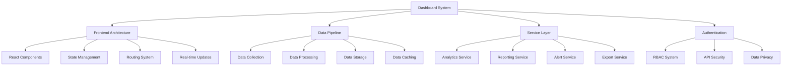

# TypeScript 仪表板系统实战案例

## 🎯 企业级仪表板架构概览

### 📊 现代化仪表板设计



## 🔧 核心组件架构

### 💡 类型安全的数据模型

```typescript
// Dashboard Domain Models
namespace DashboardDomain {
    // Base interfaces
    export interface BaseEntity {
        readonly id: EntityId;
        readonly createdAt: Date;
        readonly updatedAt: Date;
    }
    
    export interface TenantEntity extends BaseEntity {
        tenantId: TenantId;
    }
    
    // Dashboard core
    export interface Dashboard extends TenantEntity {
        name: string;
        description?: string;
        layoutConfig: LayoutConfig;
        widgets: Widget[];
        permissions: DashboardPermissions;
        theme: ThemeConfig;
        refreshInterval: number; // in seconds
        isPublic: boolean;
        shareConfig?: ShareConfig;
    }
    
    export interface Widget extends BaseEntity {
        type: WidgetType;
        title: string;
        config: WidgetConfig;
        datasourceId: DataSourceId;
        position: WidgetPosition;
        size: WidgetSize;
        filters: Filter[];
        refreshRate: number;
        isVisible: boolean;
    }
    
    export interface DataSource extends TenantEntity {
        name: string;
        type: DataSourceType;
        connectionConfig: ConnectionConfig;
        queryConfig?: QueryConfig;
        schema: DataSchema;
        lastSyncAt?: Date;
        status: DataSourceStatus;
    }
    
    // Analytics models
    export interface Metric extends TenantEntity {
        name: string;
        displayName: string;
        description?: string;
        unit: MetricUnit;
        category: MetricCategory;
        formula?: MetricFormula;
        filters: MetricFilter[];
        aggregationType: AggregationType;
        visualizationType: VisualizationType;
    }
    
    export interface Report extends TenantEntity {
        name: string;
        description?: string;
        reportType: ReportType;
        config: ReportConfig;
        schedule?: ScheduleConfig;
        output: OutputConfig;
        recipients: ReportRecipient[];
        status: ReportStatus;
    }
    
    // User and permissions
    export interface User extends TenantEntity {
        email: Email;
        profile: UserProfile;
        roles: Role[];
        permissions: Permission[];
        preferences: UserPreferences;
        lastLoginAt?: Date;
        isActive: boolean;
    }
    
    export interface Role extends TenantEntity {
        name: string;
        description?: string;
        permissions: Permission[];
        isSystemRole: boolean;
    }
    
    export interface Permission extends BaseEntity {
        resource: ResourceType;
        action: ActionType;
        conditions?: PermissionCondition[];
    }
    
    // Value Objects
    export type EntityId = Brand<string, 'EntityId'>;
    export type TenantId = Brand<string, 'TenantId'>;
    export type Email = Brand<string, 'Email'>;
    export type DataSourceId = Brand<string, 'DataSourceId'>;
    
    export type WidgetType = 'CHART' | 'TABLE' | 'KPICARD' | 'MAP' | 'FUNNEL' | 'GAUGE' | 'HEATMAP';
    export type DataSourceType = 'DATABASE' | 'API' | 'FILE' | 'STREAMING' | 'EXTERNAL';
    export type MetricUnit = 'COUNT' | 'PERCENTAGE' | 'CURRENCY' | 'TIME' | 'CUSTOM';
    export type MetricCategory = 'SALES' | 'MARKETING' | 'OPERATIONS' | 'FINANCE' | 'CUSTOM';
    export type AggregationType = 'SUM' | 'AVERAGE' | 'COUNT' | 'MIN' | 'MAX' | 'UNIQUE';
    export type VisualizationType = 'LINE' | 'BAR' | 'PIE' | 'DONUT' | 'SCATTER' | 'AREA' | 'COMPOSITE';
    export type ReportType = 'SCHEDULED' | 'ON_DEMAND' | 'REALTIME';
    export type ResourceType = 'DASHBOARD' | 'WIDGET' | 'DATASOURCE' | 'REPORT' | 'USER';
    export type ActionType = 'CREATE' | 'READ' | 'UPDATE' | 'DELETE' | 'SHARE' | 'EXPORT';
    export type DataSourceStatus = 'CONNECTED' | 'DISCONNECTED' | 'ERROR' | 'SYNCING';
    export type ReportStatus = 'ACTIVE' | 'INACTIVE' | 'ERROR' | 'COMPLETED';
}

// Layout and UI Configuration
interface LayoutConfig {
    type: 'FLEX' | 'GRID' | 'RESPONSIVE';
    columns: number;
    rows: number;
    gaps: GapConfig;
    responsive?: ResponsiveConfig;
}

interface WidgetPosition {
    row: number;
    column: number;
    columnSpan: number;
    rowSpan: number;
}

interface WidgetSize {
    width: MeasurementUnit;
    height: MeasurementUnit;
    minWidth?: MeasurementUnit;
    minHeight?: MeasurementUnit;
    maxWidth?: MeasurementUnit;
    maxHeight?: MeasurementUnit;
}

interface MeasurementUnit {
    value: number;
    unit: 'PX' | 'PERCENT' | 'EM' | 'REM' | 'FR';
}

// Theming
interface ThemeConfig {
    primary: ColorPalette;
    secondary: ColorPalette;
    background: ColorPalette;
    text: ColorPalette;
    border: ColorPalette;
    shadows: ShadowConfig;
    borderRadius: BorderRadiusConfig;
    spacing: SpacingConfig;
    typography: TypographyConfig;
}

interface ColorPalette {
    main: string;
    light?: string;
    dark?: string;
    contrast?: string;
}

// Data visualization configurations
interface WidgetConfig {
    chart?: ChartConfig;
    table?: TableConfig;
    kpi?: KPIConfig;
    map?: MapConfig;
    funnel?: FunnelConfig;
    gauge?: GaugeConfig;
}

interface ChartConfig {
    type: DashboardDomain.VisualizationType;
    axes: AxisConfig;
    series: SeriesConfig[];
    legend?: LegendConfig;
    tooltips?: TooltipConfig;
    colors?: ColorScheme;
    animations?: AnimationConfig;
    interactions?: InteractionConfig;
}

interface AxisConfig {
    x: {
        field: string;
        title?: string;
        type: 'LINEAR' | 'CATEGORICAL' | 'TIME' | 'LOG';
        format?: AxisFormatConfig;
        grid?: GridConfig;
        labels?: LabelConfig;
    };
    y: {
        field: string;
        title?: string;
        type: 'LINEAR' | 'CATEGORICAL' | 'TIME' | 'LOG';
        format?: AxisFormatConfig;
        grid?: GridConfig;
        labels?: LabelConfig;
    };
}

interface SeriesConfig {
    name: string;
    field: string;
    type: 'LINE' | 'BAR' | 'AREA' | 'SCATTER';
    color: string;
    style?: SeriesStyle;
    aggregation?: AggregationConfig;
}

// Permissions and Security
interface DashboardPermissions {
    canView: UserRole[];
    canEdit: UserRole[];
    canDelete: UserRole[];
    canShare: UserRole[];
    canExport: UserRole[];
}

interface PermissionCondition {
    field: string;
    operator: 'EQ' | 'NE' | 'GT' | 'LT' | 'IN' | 'NOT_IN' | 'LIKE';
    value: any;
    logicalOperator?: 'AND' | 'OR';
}

// Sharing and Export
interface ShareConfig {
    publicAccess: boolean;
    publicUrl?: string;
    permissions: SharePermissions;
    expiration?: Date;
    password?: string;
}

interface OutputConfig {
    format: 'PDF' | 'EXCEL' | 'CSV' | 'JSON' | 'PNG' | 'SVG';
    template?: ReportTemplate;
    includeCharts: boolean;
    includeData: boolean;
    includeMetadata: boolean;
}
```

### 🎪 实时数据处理引擎

```typescript
// Real-time Data Processing Engine
import { EventEmitter } from 'events';
import WebSocket from 'ws';

export class RealTimeDataEngine extends EventEmitter {
    private connections: Map<string, WebSocketConnection> = new Map();
    private subscriptions: Map<string, Subscription[]> = new Map();
    private dataStreams: Map<string, DataStream> = new Map();
    private cacheManager: CacheManager;
    private alertService: AlertService;
    
    constructor(
        private config: RealTimeConfig,
        cacheManager: CacheManager,
        alertService: AlertService
    ) {
        super();
        this.cacheManager = cacheManager;
        this.alertService = alertService;
        this.setupDataStreams();
    }
    
    // WebSocket connection management
    async handleConnection(ws: WebSocket, userId: DashboardDomain.UserId, tenantId: DashboardDomain.TenantId): Promise<void> {
        const connectionId = this.generateConnectionId();
        const connection: WebSocketConnection = {
            id: connectionId,
            websocket: ws,
            userId,
            tenantId,
            subscriptions: new Set(),
            lastHeartbeat: Date.now(),
            status: 'ACTIVE'
        };
        
        this.connections.set(connectionId, connection);
        
        // Setup message handlers
        ws.on('message', (data) => this.handleMessage(connectionId, data));
        ws.on('close', () => this.handleDisconnection(connectionId));
        ws.on('error', (error) => this.handleConnectionError(connectionId, error));
        
        // Send welcome message
        this.sendMessage(connectionId, {
            type: 'CONNECTION_ESTABLISHED',
            connectionId,
            timestamp: new Date().toISOString()
        });
        
        console.log(`Client connected: ${connectionId} (User: ${userId})`);
    }
    
    // Subscription management
    async subscribeToDashboard(
        connectionId: string, 
        dashboardId: DashboardDomain.EntityId,
        widgetIds?: DashboardDomain.EntityId[]
    ): Promise<void> {
        const connection = this.connections.get(connectionId);
        if (!connection) {
            throw new Error(`Connection not found: ${connectionId}`);
        }
        
        // Verify user has access to dashboard
        await this.verifyDashboardAccess(connection.userId, dashboardId);
        
        const subscription: Subscription = {
            id: this.generateSubscriptionId(),
            connectionId,
            userId: connection.userId,
            tenantId: connection.tenantId,
            dashboardId,
            widgetIds: widgetIds || [],
            status: 'ACTIVE'
        };
        
        connection.subscriptions.add(subscription.id);
        
        // Store subscription
        const subscriptions = this.subscriptions.get(connectionId) || [];
        subscriptions.push(subscription);
        this.subscriptions.set(connectionId, subscriptions);
        
        // Setup data streams for dashboard widgets
        await this.setupDataStreamsForSubscription(subscription);
        
        // Send subscription confirmation
        this.sendMessage(connectionId, {
            type: 'SUBSCRIPTION_ACTIVE',
            subscriptionId: subscription.id,
            dashboardId,
            timestamp: new Date().toISOString()
        });
        
        // Send initial data
        await this.sendInitialDashboardData(subscription);
    }
    
    // Data stream processing
    private async setupDataStreamsForSubscription(subscription: Subscription): Promise<void> {
        const dashboard = await this.getDashboard(subscription.dashboardId);
        
        for (const widget of dashboard.widgets) {
            if (subscription.widgetIds.length > 0 && !subscription.widgetIds.includes(widget.id)) {
                continue;
            }
            
            const dataSource = await this.getDataSource(widget.datasourceId);
            const streamKey = this.generateStreamKey(widget.id, dataSource.id);
            
            if (!this.dataStreams.has(streamKey)) {
                const dataStream = new DataStream(
                    streamKey,
                    dataSource,
                    widget.config,
                    this.config.refreshInterval || 1000
                );
                
                this.dataStreams.set(streamKey, dataStream);
                
                // Start data stream
                dataStream.on('data', (newData) => this.handleStreamData(streamKey, newData));
                dataStream.on('error', (error) => this.handleStreamError(streamKey, error));
                
                await dataStream.start();
            }
        }
    }
    
    // Real-time data updates
    private async handleStreamData(streamKey: string, newData: DataPacket): Promise<void> {
        console.log(`Received data for stream: ${streamKey}`);
        
        // Update cache
        await this.cacheManager.updateCache(streamKey, newData);
        
        // Check for alerts
        await this.checkAlerts(streamKey, newData);
        
        // Broadcast to subscribed connections
        await this.broadcastDataUpdate(streamKey, newData);
    }
    
    private async broadcastDataUpdate(streamKey: string, data: DataPacket): Promise<void> {
        const widgetId = this.extractWidgetIdFromStreamKey(streamKey);
        
        for (const [connectionId, subscriptions] of this.subscriptions) {
            const relevantSubscriptions = subscriptions.filter(
                sub => sub.widgetIds.length === 0 || sub.widgetIds.includes(widgetId)
            );
            
            if (relevantSubscriptions.length > 0) {
                const payload: DataUpdateMessage = {
                    type: 'DATA_UPDATE',
                    widgetId,
                    streamKey,
                    data: data.payload,
                    timestamp: data.timestamp,
                    metadata: {
                        source: data.source,
                        processingTime: data.productionTime - data.timestamp
                    }
                };
                
                this.sendMessage(connectionId, payload);
            }
        }
    }
    
    // Alert processing
    private async checkAlerts(streamKey: string, data: DataPacket): Promise<void> {
        const widgetId = this.extractWidgetIdFromStreamKey(streamKey);
        
        // Get all alerts for this widget
        const alerts = await this.alertService.getActiveAlertsForWidget(widgetId);
        
        for (const alert of alerts) {
            const shouldTrigger = await this.evaluateAlertCondition(alert, data.payload);
            
            if (shouldTrigger) {
                await this.triggerAlert(alert, data.payload);
            }
        }
    }
    
    private async triggerAlert(alert: Alert, data: any): Promise<void> {
        const alertEvent: AlertEvent = {
            id: this.generateEventId(),
            alertId: alert.id,
            widgetId: alert.widgetId,
            triggeredAt: new Date(),
            data,
            severity: alert.severity,
            message: alert.message,
            recipients: alert.recipients
        };
        
        // Store alert event
        await this.alertService.createAlertEvent(alertEvent);
        
        // Notify subscribers
        const broadcastMessage: AlertMessage = {
            type: 'ALERT_TRIGGERED',
            alertEvent,
            timestamp: new Date().toISOString()
        };
        
        await this.broadcastToTenant(alert.tenantId, broadcastMessage);
        
        // Send external notifications
        if (alert.externalNotifications) {
            await this.sendExternalNotifications(alertEvent, alert.externalNotifications);
        }
    }
    
    // Message handling
    private async handleMessage(connectionId: string, rawData: string): Promise<void> {
        try {
            const message = JSON.parse(rawData) as ClientMessage;
            
            switch (message.type) {
                case 'SUBSCRIBE_DASHBOARD':
                    await this.subscribeToDashboard(
                        connectionId,
                        message.dashboardId,
                        message.widgetIds
                    );
                    break;
                    
                case 'UNSUBSCRIBE_DASHBOARD':
                    await this.unsubscribeFromDashboard(
                        connectionId,
                        message.dashboardId
                    );
                    break;
                    
                case 'FILTER_UPDATE':
                    await this.updateWidgetFilters(
                        connectionId,
                        message.widgetId,
                        message.filters
                    );
                    break;
                    
                case 'HEARTBEAT':
                    await this.handleHeartbeat(connectionId);
                    break;
                    
                case 'PING':
                    this.sendMessage(connectionId, {
                        type: 'PONG',
                        timestamp: new Date().toISOString()
                    });
                    break;
                    
                default:
                    console.warn(`Unknown message type: ${message.type}`);
            }
        } catch (error) {
            console.error(`Error handling message from ${connectionId}:`, error);
            this.sendMessage(connectionId, {
                type: 'ERROR',
                error: 'Invalid message format',
                timestamp: new Date().toISOString()
            });
        }
    }
    
    // Dashboard service integration
    async createDashboard(command: CreateDashboardCommand): Promise<DashboardDomain.EntityId> {
        const dashboardId = this.generateDashboardId();
        
        const dashboard: DashboardDomain.Dashboard = {
            id: dashboardId,
            tenantId: command.tenantId,
            name: command.name,
            layoutConfig: command.layoutConfig,
            widgets: [],
            permissions: command.permissions,
            theme: command.theme,
            refreshInterval: command.refreshInterval || 30,
            isPublic: command.isPublic || false,
            createdAt: new Date(),
            updatedAt: new Date()
        };
        
        await this.saveDashboard(dashboard);
        
        // Emit domain event
        this.emit('dashboardCreated', {
            dashboardId,
            tenantId: command.tenantId,
            createdBy: command.createdBy,
            createdAt: new Date()
        });
        
        return dashboardId;
    }
    
    async addWidgetToDashboard(command: AddWidgetCommand): Promise<DashboardDomain.EntityId> {
        const dashboard = await this.getDashboard(command.dashboardId);
        
        if (!dashboard) {
            throw new Error(`Dashboard not found: ${command.dashboardId}`);
        }
        
        const widgetId = this.generateWidgetId();
        
        const widget: DashboardDomain.Widget = {
            id: widgetId,
            type: command.type,
            title: command.title,
            config: command.config,
            datasourceId: command.datasourceId,
            position: command.position,
            size: command.size,
            filters: command.filters || [],
            refreshRate: command.refreshRate || 30,
            isVisible: command.isVisible !== false,
            createdAt: new Date(),
            updatedAt: new Date()
        };
        
        dashboard.widgets.push(widget);
        dashboard.updatedAt = new Date();
        
        await this.saveDashboard(dashboard);
        
        // Setup real-time data stream for new widget
        await this.setupDataStreamForWidget(widget);
        
        return widgetId;
    }
    
    // Utility methods
    private generateConnectionId(): string {
        return `conn_${Date.now()}_${Math.random().toString(36).substr(2, 9)}`;
    }
    
    private generateSubscriptionId(): string {
        return `sub_${Date.now()}_${Math.random().toString(36).substr(2, 9)}`;
    }
    
    private generateDashboardId(): DashboardDomain.EntityId {
        return crypto.randomUUID() as DashboardDomain.EntityId;
    }
    
    private generateWidgetId(): DashboardDomain.EntityId {
        return crypto.randomUUID() as DashboardDomain.EntityId;
    }
    
    private generateStreamKey(widgetId: DashboardDomain.EntityId, dataSourceId: DashboardDomain.DataSourceId): string {
        return `${widgetId}:${dataSourceId}`;
    }
    
    private extractWidgetIdFromStreamKey(streamKey: string): DashboardDomain.EntityId {
        return streamKey.split(':')[0] as DashboardDomain.EntityId;
    }
    
    private sendMessage(connectionId: string, message: any): void {
        const connection = this.connections.get(connectionId);
        if (connection && connection.websocket.readyState === WebSocket.OPEN) {
            try {
                connection.websocket.send(JSON.stringify(message));
            } catch (error) {
                console.error(`Failed to send message to ${connectionId}:`, error);
            }
        }
    }
    
    // Cleanup and maintenance
    private async cleanupInactiveConnections(): Promise<void> {
        const now = Date.now();
        const inactiveTimeout = 5 * 60 * 1000; // 5 minutes
        
        for (const [connectionId, connection] of this.connections) {
            if (now - connection.lastHeartbeat > inactiveTimeout) {
                console.log(`Cleaning up inactive connection: ${connectionId}`);
                await this.handleDisconnection(connectionId);
            }
        }
    }
    
    // Start periodic cleanup
    startMaintenanceTask(): void {
        setInterval(() => {
            this.cleanupInactiveConnections();
        }, 60000); // Every minute
    }
}

// Supporting Types and Interfaces
interface RealTimeConfig {
    refreshInterval: number;
    maxConnections: number;
    cleanupInterval: number;
    heartbeatTimeout: number;
}

interface WebSocketConnection {
    id: string;
    websocket: WebSocket;
    userId: DashboardDomain.UserId;
    tenantId: DashboardDomain.TenantId;
    subscriptions: Set<string>;
    lastHeartbeat: number;
    status: 'ACTIVE' | 'INACTIVE' | 'CLOSED';
}

interface Subscription {
    id: string;
    connectionId: string;
    userId: DashboardDomain.UserId;
    tenantId: DashboardDomain.TenantId;
    dashboardId: DashboardDomain.EntityId;
    widgetIds: DashboardDomain.EntityId[];
    status: 'ACTIVE' | 'INACTIVE';
}

interface DataStream extends EventEmitter {
    start(): Promise<void>;
    stop(): Promise<void>;
    isActive(): boolean;
}

interface DataPacket {
    streamKey: string;
    payload: any;
    timestamp: number;
    source: string;
    processingTime: number;
}

interface ClientMessage {
    type: string;
    dashboardId?: DashboardDomain.EntityId;
    widgetIds?: DashboardDomain.EntityId[];
    widgetId?: DashboardDomain.EntityId;
    filters?: Filter[];
}

interface DataUpdateMessage {
    type: 'DATA_UPDATE';
    widgetId: DashboardDomain.EntityId;
    streamKey: string;
    data: any;
    timestamp: number;
    metadata: {
        source: string;
        processingTime: number;
    };
}

interface AlertMessage {
    type: 'ALERT_TRIGGERED';
    alertEvent: AlertEvent;
    timestamp: string;
}

interface AlertEvent {
    id: string;
    alertId: string;
    widgetId: DashboardDomain.EntityId;
    triggeredAt: Date;
    data: any;
    severity: 'LOW' | 'MEDIUM' | 'HIGH' | 'CRITICAL';
    message: string;
    recipients: string[];
}

// Commands
interface CreateDashboardCommand {
    tenantId: DashboardDomain.TenantId;
    name: string;
    layoutConfig: LayoutConfig;
    permissions: DashboardDomain.DashboardPermissions;
    theme: ThemeConfig;
    refreshInterval?: number;
    isPublic?: boolean;
    createdBy: DashboardDomain.UserId;
}

interface AddWidgetCommand {
    dashboardId: DashboardDomain.EntityId;
    type: DashboardDomain.WidgetType;
    title: string;
    config: WidgetConfig;
    datasourceId: DashboardDomain.DataSourceId;
    position: WidgetPosition;
    size: WidgetSize;
    filters?: Filter[];
    refreshRate?: number;
    isVisible?: boolean;
}
```

### 🔗 相关深入学习

- [[01-E-commerce-Platform电商平台]] - 复杂业务系统架构
- [[03-Microservices-Gateway微服务网关]] - API网关设计
- [[04-Mobile-Cross-platform移动跨平台]] - 跨平台开发

---
*💡 企业级仪表板系统展示了TypeScript在复杂数据可视化和实时系统开发中的专业应用*
