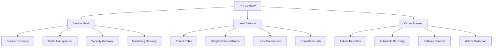

# TypeScript 微服务网关实战案例

## 🎯 微服务网关架构概览

### 📊 服务治理架构



## 🔧 核心网关实现

### 💡 API Gateway Core

```typescript
// Microservices Gateway Implementation
namespace GatewayDomain {
    // Core Gateway Types
    interface APIGateway {
        readonly id: GatewayId;
        name: string;
        version: string;
        endpoints: GatewayEndpoint[];
        middleware: Middleware[];
        policies: GatewayPolicy[];
        status: GatewayStatus;
        metrics: GatewayMetrics;
    }
    
    interface GatewayEndpoint {
        readonly id: EndpointId;
        path: string;
        method: HttpMethod;
        target: ServiceTarget;
        middleware: MiddlewareConfig[];
        policies: PolicyConfig[];
        timeout: number;
        retryPolicy: RetryPolicy;
        circuitBreaker?: CircuitBreakerConfig;
    }
    
    interface ServiceTarget {
        service: ServiceId;
        uri: string;
        version?: string;
        environment: Environment;
        healthCheck: HealthCheckConfig;
    }
    
    // Request/Response Models
    interface GatewayRequest {
        readonly id: RequestId;
        timestamp: Date;
        method: HttpMethod;
        path: string;
        headers: Map<string, string>;
        queryParams: Map<string, string>;
        pathParams: Map<string, string>;
        body?: any;
        userId?: UserId;
        sessionId?: SessionId;
        traceId?: TraceId;
        clientIp: string;
        userAgent: string;
    }
    
    interface GatewayResponse {
        requestId: RequestId;
        statusCode: number;
        headers: Map<string, string>;
        body?: any;
        latency: number;
        upstreamService?: ServiceId;
        cached: boolean;
        errors?: GatewayError[];
    }
    
    // Service Discovery
    interface ServiceRegistry {
        register(service: ServiceDefinition): Promise<void>;
        unregister(serviceId: ServiceId): Promise<void>;
        discover(serviceId: ServiceId): Promise<ServiceInstance[]>;
        healthCheck(serviceId: ServiceId): Promise<HealthStatus>;
        watch(serviceId: ServiceId): AsyncIterable<ServiceInstance[]>;
    }
    
    interface ServiceDefinition {
        id: ServiceId;
        name: string;
        version: string;
        endpoints: ServiceEndpoint[];
        dependencies: ServiceId[];
        healthCheckEndpoint: string;
        metadata: ServiceMetadata;
    }
    
    interface ServiceInstance {
        id: InstanceId;
        serviceId: ServiceId;
        address: Uri;
        port: number;
        protocol: Protocol;
        status: InstanceStatus;
        health: HealthStatus;
        metrics: InstanceMetrics;
        tags: Map<string, string>;
        registerTime: Date;
        lastHealthCheck: Date;
    }
    
    // Middleware System
    interface Middleware {
        id: MiddlewareId;
        name: string;
        execute(context: GatewayContext): Promise<GatewayContext>;
        priority: number;
        async: boolean;
    }
    
    interface MiddlewareConfig {
        middlewareId: MiddlewareId;
        conditions: MiddlewareCondition[];
        config: Map<string, any>;
        enabled: boolean;
    }
    
    // Value Objects
    type GatewayId = Brand<string, 'GatewayId'>;
    type EndpointId = Brand<string, 'EndpointId'>;
    type ServiceId = Brand<string, 'ServiceId'>;
    type InstanceId = Brand<string, 'InstanceId'>;
    type MiddlewareId = Brand<string, 'MiddlewareId'>;
    type RequestId = Brand<string, 'RequestId'>;
    type TraceId = Brand<string, 'TraceId'>;
    type SessionId = Brand<string, 'SessionId'>;
    type Uri = Brand<string, 'Uri'>;
    
    type HttpMethod = 'GET' | 'POST' | 'PUT' | 'DELETE' | 'PATCH' | 'HEAD' | 'OPTIONS';
    type Protocol = 'HTTP' | 'HTTPS' | 'WS' | 'WSS' | 'GRPC';
    type Environment = 'DEVELOPMENT' | 'STAGING' | 'PRODUCTION';
    type InstanceStatus = 'HEALTHY' | 'UNHEALTHY' | 'UNKNOWN' | 'MAINTENANCE';
    type GatewayStatus = 'RUNNING' | 'STOPPED' | 'MAINTENANCE' | 'ERROR';
}

// Gateway Implementation
class TypeScriptAPIGateway {
    private serviceRegistry: ServiceRegistry;
    private middlewareRegistry: MiddlewareRegistry;
    private circuitBreakerManager: CircuitBreakerManager;
    private loadBalancer: LoadBalancer;
    private cacheManager: CacheManager;
    private metricsCollector: MetricsCollector;
    
    constructor(private config: GatewayConfig) {
        this.initializeComponents();
    }
    
    // Processing Pipeline
    async processRequest(request: GatewayRequest): Promise<GatewayResponse> {
        const startTime = Date.now();
        const gatewayId = this.generateRequestId();
        
        try {
            // Create processing context
            const context = await this.createGatewayContext(request, gatewayId);
            
            // Execute middleware pipeline
            const processedContext = await this.executeMiddlewarePipeline(context);
            
            // Route to target service
            const response = await this.routeToTargetService(processedContext);
            
            // Cache response if applicable
            await this.cacheResponseIfNeeded(processedContext, response);
            
            // Collect metrics
            await this.collectMetrics(processedContext, response, Date.now() - startTime);
            
            return response;
            
        } catch (error) {
            return await this.handleGatewayError(gatewayId, error, Date.now() - startTime);
        }
    }
    
    // Service Discovery Integration
    async routeToTargetService(context: GatewayContext): Promise<GatewayResponse> {
        const serviceId = context.endpoint.target.service;
        
        // Get healthy service instances
        const instances = await this.serviceRegistry.discover(serviceId);
        
        if (instances.length === 0) {
            throw new ServiceUnavailableError(`No healthy instances found for service: ${serviceId}`);
        }
        
        // Apply load balancing
        const selectedInstance = await this.loadBalancer.selectInstance(instances, context);
        
        // Apply circuit breaker
        if (context.endpoint.circuitBreaker) {
            const circuitBreaker = await this.circuitBreakerManager.getCircuitBreaker(
                context.endpoint.id,
                context.endpoint.circuitBreaker
            );
            
            if (!await circuitBreaker.allowRequest()) {
                throw new CircuitBreakerOpenError(`Circuit breaker open for endpoint: ${context.endpoint.id}`);
            }
        }
        
        // Make upstream request
        return await this.makeUpstreamRequest(context, selectedInstance);
    }
    
    // Middleware Pipeline
    private async executeMiddlewarePipeline(context: GatewayContext): Promise<GatewayContext> {
        const middlewareConfigs = this.getMiddlewareConfigs(context.endpoint);
        
        // Sort middleware by priority
        const sortedMiddleware = middlewareConfigs
            .map(config => ({
                config,
                middleware: this.middlewareRegistry.getMiddleware(config.middlewareId)
            }))
            .filter(item => item.middleware && this.evaluateMiddlewareConditions(item.config, context))
            .sort((a, b) => a.config.priority - b.config.priority);
        
        // Execute middleware chain
        let processedContext = context;
        
        for (const { middleware, config } of sortedMiddleware) {
            try {
                await middleware.configure(config.config);
                processedContext = await middleware.execute(processedContext);
            } catch (error) {
                // Middleware error handling
                await this.handleMiddlewareError(middleware, error, processedContext);
                
                if (middleware.config.critical) {
                    throw error;
                }
            }
        }
        
        return processedContext;
    }
    
    // Cache Management
    private async cacheResponseIfNeeded(
        context: GatewayContext, 
        response: GatewayResponse
    ): Promise<void> {
        const cacheStrategy = this.getCacheStrategy(context.endpoint);
        
        if (cacheStrategy && this.isCacheableResponse(response)) {
            const cacheKey = this.generateCacheKey(context);
            await this.cacheManager.set(cacheKey, response, cacheStrategy.ttl);
        }
    }
    
    // Error Handling
    private async handleGatewayError(
        requestId: RequestId, 
        error: Error, 
        latency: number
    ): Promise<GatewayResponse> {
        const gatewayError = this.classifyGatewayError(error);
        
        // Log error
        await this.logGatewayError(requestId, error, latency);
        
        // Collect error metrics
        await this.metricsCollector.recordError(gatewayError.type, latency);
        
        return {
            requestId,
            statusCode: gatewayError.statusCode,
            headers: new Map([['Content-Type', 'application/json']]),
            body: {
                error: gatewayError.type,
                message: gatewayError.message,
                requestId,
                timestamp: new Date().toISOString()
            },
            latency,
            cached: false
        };
    }
    
    private classifyGatewayError(error: Error): ClassifiedError {
        if (error instanceof ServiceUnavailableError) {
            return {
                type: 'SERVICE_UNAVAILABLE',
                statusCode: 503,
                message: 'Service temporarily unavailable'
            };
        }
        
        if (error instanceof CircuitBreakerOpenError) {
            return {
                type: 'CIRCUIT_B REAKER_OPEN',
                statusCode: 503,
                message: 'Circuit breaker is open'
            };
        }
        
        if (error instanceof AuthenticationError) {
            return {
                type: 'AUTHENTICATION_FAILED',
                statusCode: 401,
                message: 'Authentication required'
            };
        }
        
        if (error instanceof AuthorizationError) {
            return {
                type: 'AUTHORIZATION_FAILED',
                statusCode: 403,
                message: 'Insufficient privileges'
            };
        }
        
        return {
            type: 'INTERNAL_SERVER_ERROR',
            statusCode: 500,
            message: 'An internal error occurred'
        };
    }
}

// Service Registry Implementation
class ConsulServiceRegistry implements ServiceRegistry {
    constructor(private consulClient: ConsulClient) {}
    
    async register(service: ServiceDefinition): Promise<void> {
        const consulServiceDefinition: ConsulServiceDefinition = {
            ID: service.id,
            Name: service.name,
            Tags: this.buildTags(service),
            Address: service.metadata.address,
            Port: service.metadata.port,
            Check: {
                HTTP: `${service.metadata.protocol}://${service.metadata.address}:${service.metadata.port}${service.healthCheckEndpoint}`,
                Interval: `${service.healthCheck.intervalSeconds}s`,
                Timeout: `${service.healthCheck.timeoutSeconds}s`
            }
        };
        
        await this.consulClient.agent.service.register(consulServiceDefinition);
    }
    
    async discover(serviceId: ServiceId): Promise<ServiceInstance[]> {
        const [services] = await this.consulClient.health.service(serviceId);
        
        return services.map(service => ({
            id: service.Service.ID as InstanceId,
            serviceId: service.Service.Service as ServiceId,
            address: service.Service.Address as Uri,
            port: service.Service.Port,
            protocol: this.determineProtocol(service.Service.Meta),
            status: this.mapHealthStatus(service.Checks),
            health: this.evaluateHealthStatus(service.Checks),
            metrics: this.extractMetrics(service.Service.Meta),
            tags: new Map(Object.entries(service.Service.Tags || {})),
            registerTime: service.Service.CreateIndex ? new Date(service.Service.CreateIndex) : new Date(),
            lastHealthCheck: new Date()
        }));
    }
    
    async *watch(serviceId: ServiceId): AsyncIterable<ServiceInstance[]> {
        const watch = this.consulClient.watch({
            method: this.consulClient.health.service,
            options: { service: serviceId }
        });
        
        try {
            for await (const services of watch) {
                yield this.mapServicesToInstances(services);
            }
        } catch (error) {
            console.error(`Error watching service ${serviceId}:`, error);
        }
    }
}

// Load Balancer Implementation
class WeightedRoundRobinBalancer implements LoadBalancer {
    private instanceWeights = new Map<InstanceId, number>();
    private currentIndex = new Map<ServiceId, number>();
    
    async selectInstance(
        instances: ServiceInstance[], 
        context: GatewayContext
    ): Promise<ServiceInstance> {
        if (instances.length === 1) {
            return instances[0];
        }
        
        // Filter healthy instances
        const healthyInstances = instances.filter(instance => 
            instance.status === InstanceStatus.HEALTHY
        );
        
        if (healthyInstances.length === 0) {
            throw new ServiceUnavailableError('No healthy instances available');
        }
        
        // Apply session affinity if configured
        const affinityInstance = this.checkSessionAffinity(context, healthyInstances);
        if (affinityInstance) {
            return affinityInstance;
        }
        
        // Apply weighted round robin
        return this.performWeightedSelection(healthyInstances, context.endpoint.target.service);
    }
    
    private performWeightedSelection(instances: ServiceInstance[], serviceId: ServiceId): ServiceInstance {
        const totalWeight = instances.reduce((sum, instance) => {
            const weight = this.getInstanceWeight(instance.id);
            return sum + weight;
        }, 0);
        
        let currentWeight = this.currentIndex.get(serviceId) || 0;
        
        for (const instance of instances) {
            const weight = this.getInstanceWeight(instance.id);
            currentWeight += weight;
            
            if (currentWeight >= totalWeight) {
                this.currentIndex.set(serviceId, weight % totalWeight);
                return instance;
            }
        }
        
        // Fallback to first instance
        return instances[0];
    }
}

// Circuit Breaker Implementation
class CircuitBreakerManager {
    private circuitBreakers = new Map<string, CircuitBreaker>();
    
    async getCircuitBreaker(endpointId: EndpointId, config: CircuitBreakerConfig): Promise<CircuitBreaker> {
        if (!this.circuitBreakers.has(endpointId)) {
            this.circuitBreakers.set(endpointId, new CircuitBreaker(config));
        }
        
        return this.circuitBreakers.get(endpointId)!;
    }
}

class CircuitBreaker {
    private state: CircuitBreakerState = 'CLOSED';
    private failureCount = 0;
    private lastFailureTime?: Date;
    
    constructor(private config: CircuitBreakerConfig) {}
    
    async allowRequest(): Promise<boolean> {
        switch (this.state) {
            case 'CLOSED':
                return true;
                
            case 'OPEN':
                return this.shouldAttemptReset();
                
            case 'HALF_OPEN':
                return true; // Allow limited requests
                
            default:
                return false;
        }
    }
    
    async recordSuccess(): Promise<void> {
        this.failureCount = 0;
        this.state = 'CLOSED';
    }
    
    async recordFailure(): Promise<void> {
        this.failureCount++;
        this.lastFailureTime = new Date();
        
        if (this.failureCount >= this.config.failureThreshold) {
            this.state = 'OPEN';
            this.scheduleResetAttempt();
        }
    }
    
    private shouldAttemptReset(): boolean {
        if (!this.lastFailureTime) return true;
        
        const timeSinceLastFailure = Date.now() - this.lastFailureTime.getTime();
        const resetTimeout = this.config.resetTimeoutSeconds * 1000;
        
        if (timeSinceLastFailure >= resetTimeout) {
            this.state = 'HALF_OPEN';
            return true;
        }
        
        return false;
    }
    
    private scheduleResetAttempt(): void {
        setTimeout(() => {
            if (this.state === 'OPEN') {
                this.state = 'HALF_OPEN';
            }
        }, this.config.resetTimeoutSeconds * 1000);
    }
}

// Middleware Examples
class AuthenticationMiddleware implements Middleware {
    constructor(private authProvider: AuthenticationProvider) {}
    
    async configure(config: Map<string, any>): Promise<void> {
        // Configure authentication settings
    }
    
    async execute(context: GatewayContext): Promise<GatewayContext> {
        const authHeader = context.request.headers.get('authorization');
        
        if (!authHeader) {
            throw new AuthenticationError('Authorization header required');
        }
        
        const token = this.extractToken(authHeader);
        const user = await this.authProvider.validateToken(token);
        
        context.request.userId = user.id;
        context.request.sessionId = user.sessionId;
        
        return context;
    }
}

class RateLimitingMiddleware implements Middleware {
    constructor(private rateLimiter: RateLimiter) {}
    
    async configure(config: Map<string, any>): Promise<void> {
        // Configure rate limiting settings
    }
    
    async execute(context: GatewayContext): Promise<GatewayContext> {
        const identifier = this.extractIdentifier(context.request);
        const allowed = await this.rateLimiter.checkLimit(identifier, context.endpoint);
        
        if (!allowed.allowed) {
            throw new RateLimitExceededError(`Rate limit exceeded. Reset in ${allowed.resetTime}ms`);
        }
        
        // Add rate limit headers
        context.response.headers = context.response.headers || new Map();
        context.response.headers.set('X-RateLimit-Limit', allowed.limit.toString());
        context.response.headers.set('X-RateLimit-Remaining', allowed.remaining.toString());
        context.response.headers.set('X-RateLimit-Reset', new Date(allowed.resetTime).toISOString());
        
        return context;
    }
    
    private extractIdentifier(request: GatewayRequest): string {
        return request.userId || request.clientIp;
    }
}

// Error Types
class ServiceUnavailableError extends Error {
    constructor(message: string) {
        super(message);
        this.name = 'ServiceUnavailableError';
    }
}

class CircuitBreakerOpenError extends Error {
    constructor(message: string) {
        super(message);
        this.name = 'CircuitBreakerOpenError';
    }
}

class AuthenticationError extends Error {
    constructor(message: string) {
        super(message);
        this.name = 'AuthenticationError';
    }
}

class AuthorizationError extends Error {
    constructor(message: string) {
        super(message);
        this.name = 'AuthorizationError';
    }
}

class RateLimitExceededError extends Error {
    constructor(message: string) {
        super(message);
        this.name = 'RateLimitExceededError';
    }
}

// Supporting Types
type CircuitBreakerState = 'CLOSED' | 'OPEN' | 'HALF_OPEN';

interface CircuitBreakerConfig {
    failureThreshold: number;
    resetTimeoutSeconds: number;
    successThreshold?: number;
}

interface ClassifiedError {
    type: string;
    statusCode: number;
    message: string;
}

interface GatewayConfig {
    serviceRegistry: {
        type: 'CONSUL' | 'ETCD' | 'EUREKA';
        endpoints: string[];
    };
    middleware: MiddlewareDefinition[];
    circuitBreaker: CircuitBreakerConfig;
    loadBalancing: LoadBalancingConfig;
    caching: CachingConfig;
    metrics: MetricsConfig;
}
```

### 🎪 Service Mesh Integration

```typescript
// Service Mesh Implementation
class ServiceMeshGateway {
    private istioClient: IstioClient;
    private sidecarManager: SidecarManager;
    private trafficPolicy: TrafficPolicyManager;
    
    constructor(private config: ServiceMeshConfig) {
        this.istioClient = new IstioClient(config.istioGatewayUrl);
        this.sidecarManager = new SidecarManager();
        this.trafficPolicy = new TrafficPolicyManager();
    }
    
    async deployServiceMeshConfiguration(): Promise<void> {
        // Deploy Gateway configuration
        await this.createIstioGateway();
        
        // Configure Virtual Services
        await this.createVirtualServices();
        
        // Set up Destination Rules
        await this.createDestinationRules();
        
        // Configure Security Policies
        await this.createSecurityPolicies();
        
        // Set up Monitoring
        await this.configureObservability();
    }
    
    private async createIstioGateway(): Promise<void> {
        const gatewayConfig = {
            apiVersion: 'networking.istio.io/v1beta1',
            kind: 'Gateway',
            metadata: {
                name: 'typescript-api-gateway',
                namespace: this.config.namespace
            },
            spec: {
                selector: {
                    istio: 'ingressgateway'
                },
                servers: [
                    {
                        port: {
                            number: 443,
                            protocol: 'HTTPS'
                        },
                        hosts: this.config.domainNames,
                        tls: {
                            mode: 'SIMPLE',
                            credentialName: 'gateway-tls-cert'
                        }
                    }
                ]
            }
        };
        
        await this.istioClient.applyResource(gatewayConfig);
    }
    
    private async createVirtualServices(): Promise<void> {
        for (const service of this.config.services) {
            const virtualService = {
                apiVersion: 'networking.istio.io/v1beta1',
                kind: 'VirtualService',
                metadata: {
                    name: `${service.name}-virtual-service`,
                    namespace: service.namespace
                },
                spec: {
                    hosts: [service.virtualHost],
                    gateways: ['typescript-api-gateway'],
                    http: [
                        {
                            match: service.routeRules,
                            route: [
                                {
                                    destination: {
                                        host: service.hostName,
                                        port: {
                                            number: service.port
                                        }
                                    },
                                    weight: 100
                                }
                            ],
                            timeout: `${service.timeoutSeconds}s`,
                            retries: service.retryPolicy
                        }
                    ]
                }
            };
            
            await this.istioClient.applyResource(virtualService);
        }
    }
    
    async configureCanaryDeployment(
        serviceId: ServiceId,
        trafficSplit: TrafficSplit
    ): Promise<void> {
        const virtualService = await this.istioClient.getVirtualService(serviceId);
        
        virtualService.spec.http[0].route = [
            {
                destination: {
                    host: `${serviceId}-stable`,
                    subset: 'stable'
                },
                weight: 100 - trafficSplit.canaryPercentage
            },
            {
                destination: {
                    host: `${serviceId}-canary`,
                    subset: 'canary'
                },
                weight: trafficSplit.canaryPercentage
            }
        ];
        
        await this.istioClient.updateVirtualService(virtualService);
        
        // Monitor canary deployment
        await this.monitorCanaryDeployment(serviceId, trafficSplit);
    }
    
    private async monitorCanaryDeployment(
        serviceId: ServiceId, 
        trafficSplit: TrafficSplit
    ): Promise<void> {
        const monitoringConfig = {
            alertRules: trafficSplit.alertRules,
            metricQueries: trafficSplit.metrics,
            rollbackCriteria: trafficSplit.rollbackCriteria
        };
        
        const canaryMonitor = new CanaryMonitor(monitoringConfig);
        await canaryMonitor.startMonitoring(serviceId);
    }
}

// Traffic Management
class AdvancedTrafficManager {
    private circuitBreakers = new Map<ServiceId, CircuitBreaker>();
    private retryPolicies = new Map<ServiceId, RetryPolicy>();
    private timeoutPolicies = new Map<ServiceId, TimeoutPolicy>();
    
    async configureRetryPolicy(
        serviceId: ServiceId, 
        policy: RetryPolicy
    ): Promise<void> {
        this.retryPolicies.set(serviceId, policy);
        
        // Apply to Istio Destination Rule
        await this.updateDestinationRule(serviceId, 'retries', {
            attempts: policy.maxAttempts,
            perTryTimeout: `${policy.timeoutSeconds}s`,
            retryOn: policy.retryConditions.join(',')
        });
    }
    
    async configureCircuitBreaker(
        serviceId: ServiceId,
        config: CircuitBreakerPolicy
    ): Promise<void> {
        this.circuitBreakers.set(serviceId, new CircuitBreaker(config));
        
        // Apply to Istio Destination Rule
        await this.updateDestinationRule(serviceId, 'outlierDetection', {
            consecutiveErrors: config.failureThreshold,
            interval: `${config.checkIntervalSeconds}s`,
            baseEjectionTime: `${config.baseEjectionTimeSeconds}s`,
            maxEjectionPercent: config.maxEjectionPercent
        });
    }
    
    async performRequest(
        serviceId: ServiceId,
        request: ServiceRequest
    ): Promise<ServiceResponse> {
        const circuitBreaker = this.circuitBreakers.get(serviceId);
        
        if (circuitBreaker && !await circuitBreaker.allowRequest()) {
            throw new CircuitBreakerOpenError(`Circuit breaker open for ${serviceId}`);
        }
        
        try {
            const retryPolicy = this.retryPolicies.get(serviceId);
            const response = await this.executeWithRetry(serviceId, request, retryPolicy);
            
            if (circuitBreaker) {
                await circuitBreaker.recordSuccess();
            }
            
            return response;
        } catch (error) {
            if (circuitBreaker) {
                await circuitBreaker.recordFailure();
            }
            throw error;
        }
    }
    
    private async executeWithRetry(
        serviceId: ServiceId,
        request: ServiceRequest,
        retryPolicy?: RetryPolicy
    ): Promise<ServiceResponse> {
        const maxAttempts = retryPolicy?.maxAttempts || 1;
        let lastError: Error;
        
        for (let attempt = 1; attempt <= maxAttempts; attempt++) {
            try {
                return await this.makeServiceRequest(serviceId, request);
            } catch (error) {
                lastError = error as Error;
                
                // Check if error is retryable
                if (!this.isRetryableError(error, retryPolicy)) {
                    throw error;
                }
                
                // Apply backoff delay
                if (attempt < maxAttempts) {
                    const delay = this.calculateBackoffDelay(attempt, retryPolicy);
                    await new Promise(resolve => setTimeout(resolve, delay));
                }
            }
        }
        
        throw lastError!;
    }
}

// Security and Authentication
class SecurityPolicyManager {
    async enforceSecurityPolicies(
        request: GatewayRequest,
        policies: SecurityPolicy[]
    )
    {
        for (const policy of policies) {
            switch (policy.type) {
                case 'AUTHENTICATION_REQUIRED':
                    await this.enforceAuthentication(request);
                    break;
                    
                case 'AUTHORIZATION_CHECK':
                    await this.enforceAuthorization(request, policy.resources);
                    break;
                    
                case 'RATE_LIMITING':
                    await this.enforceRateLimit(request, policy.limits);
                    break;
                    
                case 'INPUT_VALIDATION':
                    await this.validateInput(request, policy.validationRules);
                    break;
                    
                case 'CSRF_PROTECTION':
                    await this.verifyCSRFToken(request);
                    break;
                    
                default:
                    throw new Error(`Unknown security policy: ${policy.type}`);
            }
        }
    }
    
    private async enforceAuthentication(request: GatewayRequest): Promise<void> {
        if (!request.userId) {
            throw new AuthenticationError('Authentication required');
        }
        
        // Validate JWT token
        const token = request.headers.get('authorization');
        if (!token) {
            throw new AuthenticationError('Authorization token missing');
        }
        
        const isValid = await this.validateJWToken(token);
        if (!isValid) {
            throw new AuthenticationError('Invalid or expired token');
        }
    }
    
    private async enforceAuthorization(
        request: GatewayRequest,
        resources: ProtectedResource[]
    ): Promise<void> {
        const userPermissions = await this.getUserPermissions(request.userId!);
        
        for (const resource of resources) {
            const hasPermission = this.checkResourcePermission(userPermissions, resource);
            if (!hasPermission) {
                throw new AuthorizationError(`Access denied to resource: ${resource.resource}`);
            }
        }
    }
}

// Configuration Management
interface ServiceMeshConfig {
    istioGatewayUrl: string;
    namespace: string;
    domainNames: string[];
    services: ServiceMeshService[];
    monitoring: MonitoringConfig;
    security: SecurityConfig;
}

interface ServiceMeshService {
    name: string;
    namespace: string;
    virtualHost: string;
    hostName: string;
    port: number;
    routeRules: RouteRule[];
    timeoutSeconds: number;
    retryPolicy: RetryPolicyRule;
}

interface TrafficSplit {
    canaryPercentage: number;
    alertRules: AlertRule[];
    metrics: MetricQuery[];
    rollbackCriteria: RollbackCriteria[];
}

interface CircuitBreakerPolicy {
    failureThreshold: number;
    timeoutSeconds: number;
    resetTimeoutSeconds: number;
    checkIntervalSeconds: number;
    baseEjectionTimeSeconds: number;
    maxEjectionPercent: number;
}
```

### 🔗 相关深入学习

- [[01-E-commerce-Platform电商平台]] - 复杂业务系统架构
- [[02-Dashboard-System仪表板系统]] - 企业级仪表板实现
- [[04-Mobile-Cross-platform移动跨平台]] - 跨平台开发

---
*💡 微服务网关是现代分布式系统的核心组件，TypeScript的类型安全特性使其成为构建可靠网关服务的理想选择*
