# TypeScript Mobile Cross-platform 移动跨平台开发

## 🎯 移动跨平台开发生态

### 📊 跨平台技术栈体系

```mermaid
graph TD
    A[Mobile Cross-platform Strategy] --> B[Native Cross-compilation]
    A --> C[Hybrid Development]
    A --> D[Web Technologies]
    A --> E[Quantum Frameworks]
    A --> F[Progressive Enhancement]
    
    B --> B1[Xamarin]
    B --> B2[React Native]
    B --> B3[Flutter with TypeScript]
    B --> B4[Cordova/PhoneGap]
    
    C --> C1[Ionic Framework]
    C --> C2[Capacitor]
    C --> C3[Apache Cordova]
    C --> C4[Cordova-Plus]
    
    D --> D1[Progressive Web Apps]
    D --> D2[Service Workers]
    D --> D3[Responsive Design]
    D --> D4[Offline First]
    
    E --> E1[Compile to Native]
    E --> E2[Single Codebase]
    E --> E3[Platform Optimization]
    E --> E4[Performance Parity]
    
    F --> F1[Component Adaptability]
    F --> F2[Platform Detection]
    F --> F3[Feature Flags]
    F --> F4[Progressive Loading]
```



## 🔧 React Native + TypeScript 核心架构

### 💡 React Native 企业级实现

```typescript
// React Native + TypeScript Enterprise Architecture
namespace MobileCrossPlatform {
    // React Native Application Structure
    interface ReactNativeAppStructure {
        architecture: AppArchitecture;
        components: ComponentLibrary;
        navigation: NavigationStack;
        stateManagement: StateManagementPattern;
        utilities: UtilityLibraries;
        testingStrategy: TestingFramework;
        deployment: DeploymentPipeline;
    }
    
    // Mobile App Architecture Manager
    class TypeScriptMobilizer {
        private navigationManager: NavigationManager;
        private stateManager: StateManager;
        private componentLibraryManager: ComponentLibraryManager;
        private platformManager: PlatformDetectionManager;
        private performanceOptimizer: PerformanceOptimizer;
        private analyticsEngine: AnalyticsEngine;
        
        constructor(config: MobileAppConfiguration) {
            this.navigationManager = new NavigationManager(config.navigation);
            this.stateManager = new StateManager(config.redux);
            this.componentLibraryManager = new ComponentLibraryManager(config.components);
            this.platformManager = new PlatformDetectionManager();
            this.performanceOptimizer = new PerformanceOptimizer(config.perfOpts);
            this.analyticsEngine = new AnalyticsEngine(config.analytics);
        }
        
        // Setup Complete Mobile Application
        async setupMobileApplication(): Promise<void> {
            await this.setupNavigation();
            await this.setupStateManagement();
            await this.setupComponentLibrary();
            await this.setupPlatformOptimizations();
            await this.setupPerformanceOptimizations();
            await this.setupAnalytics();
            await this.setupErrorHandling();
            await this.setupOfflineCapabilities();
        }
        
        // React Navigation with TypeScript Setup
        private async setupNavigation(): Promise<void> {
            // Create Type-Safe Navigation Structure
            const navigationStructure = this.createNavigationStructure();
            
            // Define Screen Parameter Types
            const screenTypes = {
                Home: { undefined },
                Profile: { userId: string; editingMode?: boolean },
                Settings: { section?: string },
                Detail: { itemId: string; category: string },
                Search: { query?: string; filters?: SearchFilters }
            };
            
            // Root Navigator Configuration
            const RootNavigator = createStackNavigator<RootStackParamList>();
            
            const AppNavigator: React.FC = () => {
                return (
                    <NavigationContainer
                        ref={navigationRef}
                        onReady={() => this.navigationManager.onNavigatorReady()}
                        onStateChange={this.navigationManager.onStateChange}
                    >
                        <RootNavigator.Navigator
                            screenOptions={{
                                headerStyle: { backgroundColor: '#6200EE' },
                                headerTintColor: 'white',
                                headerTitleStyle: { fontWeight: 'bold' }
                            }}
                        >
                            <RootNavigator.Screen
                                name="Home"
                                component={HomeScreen}
                                options={{
                                    title: 'Welcome',
                                    headerRight: () => (<ProfileButton />)
                                }}
                            />
                            <RootNavigator.Screen
                                name="Profile"
                                component={ProfileScreen}
                                options={({ route }) => ({
                                    title: `Profile ${route.params.userId}`,
                                    headerBackTitle: 'Back'
                                })}
                            />
                            <RootNavigator.Screen
                                name="TabNavigator"
                                component={TabNavigatorWrapper}
                                options={{ headerShown: false }}
                            />
                        </RootNavigator.Navigator>
                    </NavigationContainer>
                );
            };
            
            // Tab Navigator with Bottom Tabs
            const TabNavigator: React.FC = () => {
                return (
                    <Tab.Navigator
                        screenOptions={({ route }) => ({
                            tabBarIcon: ({ color, size }) => this.renderTabIcon(route.name, color, size),
                            tabBarActiveTintColor: '#6200EE',
                            tabBarInactiveTintColor: 'gray',
                            tabBarLabelStyle: { fontSize: 12, fontWeight: '600' }
                        })}
                    >
                        <Tab.Screen
                            name="Home"
                            component={HomeScreenContent}
                            options={{ title: 'Home', tabBarBadge: this.getHomeBadgeCount() }}
                        />
                        <Tab.Screen
                            name="Search"
                            component={SearchScreen}
                            options={{ 
                                title: 'Search',
                                tabBarIcon: ({ color }) => <SearchIcon color={color} size={24} />
                            }}
                        />
                        <Tab.Screen
                            name="Favorites"
                            component={FavoritesScreen}
                            options={{ title: 'Favorites' }}
                        />
                        <Tab.Screen
                            name="Profile"
                            component={ProfileScreenContent}
                            options={{ title: 'Profile' }}
                        />
                    </Tab.Navigator>
                );
            };
            
            await this.navigationManager.registerNavigator(RootNavigator);
        }
        
        // Redux Toolkit with TypeScript Setup
        private async setupStateManagement(): Promise<void> {
            // Root State Definition
            interface RootState {
                auth: AuthState;
                user: UserState;
                products: ProductState;
                cart: ShoppingCartState;
                settings: SettingsState;
                navigation: NavigationState;
                offline: OfflineState;
            }
            
            // Auth Slice with TypeScript
            const authSlice = createSlice({
                name: 'auth',
                initialState: {
                    user: null as User | null,
                    token: null as string | null,
                    isLoading: false,
                    error: null as string | null,
                    biometricEnabled: false,
                    preferredAuthMethod: 'password' as AuthMethod
                } as AuthState,
                
                reducers: {
                    loginStart: (state) => {
                        state.isLoading = true;
                        state.error = null;
                    },
                    loginSuccess: (state, action: PayloadAction<LoginSuccessPayload>) => {
                        state.isLoading = false;
                        state.user = action.payload.user;
                        state.token = action.payload.token;
                        state.error = null;
                    },
                    loginFailure: (state, action: PayloadAction<string>) => {
                        state.isLoading = false;
                        state.error = action.payload;
                        state.user = null;
                        state.token = null;
                    },
                    logout: (state) => {
                        state.user = null;
                        state.token = null;
                        state.error = null;
                    },
                    updateBiometric: (state, action: PayloadAction<boolean>) => {
                        state.biometricEnabled = action.payload;
                    },
                    setPreferredAuthMethod: (state, action: PayloadAction<AuthMethod>) => {
                        state.preferredAuthMethod = action.payload;
                    }
                },
                
                extraReducers: (builder) => {
                    builder
                        .addCase(loginAsync.pending, (state) => {
                            state.isLoading = true;
                            state.error = null;
                        })
                        .addCase(loginAsync.fulfilled, (state, action) => {
                            state.isLoading = false;
                            state.user = action.payload.user;
                            state.token = action.payload.token;
                        })
                        .addCase(loginAsync.rejected, (state, action) => {
                            state.isLoading = false;
                            state.error = action.error.message || 'Login failed';
                        });
                }
            });
            
            // Async Actions with TypeScript
            export const loginAsync = createAsyncThunk<
                LoginSuccessPayload,
                LoginCredentials,
                { rejectValue: string }
            >(
                'auth/loginAsync',
                async (credentials: LoginCredentials, { rejectWithValue }) => {
                    try {
                        const response = await authApi.login(credentials);
                        
                        if (response.success) {
                            await AsyncStorage.setItem('user_token', response.token);
                            return response;
                        } else {
                            return rejectWithValue(response.error || 'Login failed');
                        }
                    } catch (error) {
                        return rejectWithValue(error instanceof Error ? error.message : 'Unknown error');
                    }
                }
            );
            
            // Store Configuration
            const store = configureStore({
                reducer: {
                    auth: authSlice.reducer,
                    user: userSlice.reducer,
                    products: productsSlice.reducer,
                    cart: cartSlice.reducer,
                    settings: settingsSlice.reducer
                },
                middleware: (getDefaultMiddleware) =>
                    getDefaultMiddleware({
                        serializableCheck: {
                            ignoredActions: ['persist/PERSIST', 'persist/REHYDRATE'],
                            ignoredActionsPaths: ['meta.arg', 'payload.timestamp']
                        }
                    })
                    .concat(thunkMiddleware)
                    .concat(offlineMiddleware),
                devTools: __DEV__
            });
            
            await this.stateManager.configureStore(store);
        }
        
        // Component Library Setup
        private async setupComponentLibrary(): Promise<void> {
            // Base Component Types
            interface BaseComponentProps {
                children?: React.ReactNode;
                style?: StyleProp<any>;
                testID?: string;
                accessible?: boolean;
                accessibilityLabel?: string;
            }
            
            // Typed Button Component
            interface TypedButtonProps extends BaseComponentProps {
                title: string;
                onPress: () => void;
                variant?: 'primary' | 'secondary' | 'danger' | 'ghost';
                size?: 'small' | 'medium' | 'large';
                disabled?: boolean;
                loading?: boolean;
                icon?: React.ReactNode;
                textColor?: string;
                backgroundColor?: string;
            }
            
            const TypedButton: React.FC<TypedButtonProps> = ({
                title,
                onPress,
                variant = 'primary',
                size = 'medium',
                disabled = false,
                loading = false,
                icon,
                style,
                testID,
                ...props
            }) => {
                const theme = useTheme();
                
                const buttonStyles = StyleSheet.create({
                    primary: { backgroundColor: theme.colors.primary },
                    secondary: { backgroundColor: theme.colors.secondary },
                    danger: { backgroundColor: theme.colors.error },
                    ghost: { backgroundColor: 'transparent', borderColor: theme.colors.primary }
                });
                
                const sizeStyles = StyleSheet.create({
                    small: { paddingHorizontal: 12, paddingVertical: 8 },
                    medium: { paddingHorizontal: 16, paddingVertical: 12 },
                    large: { paddingHorizontal: 20, paddingVertical: 16 }
                });
                
                return (
                    <TouchableOpacity
                        style={[
                            style,
                            buttonStyles[variant],
                            sizeStyles[size],
                            disabled && { opacity: 0.6 }
                        ]}
                        onPress={onPress}
                        disabled={disabled || loading}
                        testID={testID}
                        {...props}
                    >
                        {loading ? (
                            <ActivityIndicator color="white" size="small" />
                        ) : (
                            <View style={styles.buttonContent}>
                                {icon && <View style={styles.iconContainer}>{icon}</View>}
                                <Text style={[styles.buttonText, { color: theme.colors.onPrimary }]}>
                                    {title}
                                </Text>
                            </View>
                        )}
                    </TouchableOpacity>
                );
            };
            
            // List Component with Performance Optimization
            interface PerformanceListProps<T> {
                data: T[];
                renderItem: ({ item }: { item: T }) => React.ReactElement;
                keyExtractor: (item: T) => string;
                onEndReached?: () => void;
                onRefresh?: () => Promise<void>;
                refreshing?: boolean;
                estimatedItemSize?: number;
                ListEmptyComponent?: React.ReactElement;
                ListHeaderComponent?: React.ReactElement;
                ListFooterComponent?: React.ReactElement;
                windowSize?: number;
                initialNumToRender?: number;
                maxToRenderPerBatch?: number;
            }
            
            const PerformanceList = <T extends unknown>(props: PerformanceListProps<T>) => {
                const { 
                    data, 
                    renderItem, 
                    keyExtractor, 
                    onEndReached,
                    onRefresh,
                    refreshing = false,
                    estimatedItemSize = 100,
                    windowSize = 5,
                    initialNumToRender = 10,
                    maxToRenderPerBatch = 5,
                    ...listProps
                } = props;
                
                const getItemLayout = useCallback(
                    (data: T[] | null, index: number) => ({
                        length: estimatedItemSize,
                        offset: estimatedItemSize * index,
                        index,
                    }),
                    [estimatedItemSize]
                );
                
                return (
                    <FlatList
                        data={data}
                        renderItem={renderItem}
                        keyExtractor={keyExtractor}
                        getItemLayout={getItemLayout}
                        onEndReached={onEndReached}
                        onRefresh={onRefresh}
                        refreshing={refreshing}
                        windowSize={windowSize}
                        initialNumToRender={initialNumToRender}
                        maxToRenderPerBatch={maxToRenderPerBatch}
                        removeClippedSubviews={Platform.OS === 'android'}
                        {...listProps}
                    />
                );
            };
            
            // Register Components
            await this.componentLibraryManager.registerComponents({
                TypedButton,
                PerformanceList,
                SafeAreaWrapper,
                LoadingSpinner,
                ErrorBoundary,
                EmptyState,
                SearchInput,
                ImageWithFallback
            });
        }
        
        // Platform-Specific Optimizations
        private async setupPlatformOptimizations(): Promise<void> {
            const platformOptimizations = {
                iOS: {
                    // iOS-specific optimizations
                    stackNavigatorOptimizations: {
                        gestureBackEnabled: true,
                        animationEnabled: true,
                        screenTransitionGesture: 'horizontal'
                    },
                    
                    performanceOptimizations: {
                        reduceMotion: true,
                        optimizeAnimations: true,
                        memoryManagement: 'advanced'
                    },
                    
                    accessibilityFeatures: {
                        voiceOverSupport: true,
                        switchControlSupport: true,
                        dynamicType: true
                    }
                },
                
                android: {
                    // Android-specific optimizations
                    stackNavigatorOptimizations: {
                        gestureBackEnabled: true,
                        animationEnabled: Platform.version >= 21,
                        screenTransitionGesture: 'horizontal'
                    },
                    
                    performanceOptimizations: {
                        bundleSplitting: true,
                        codeShrinking: true,
                        proguardOptimization: true
                    },
                    
                    accessibilityFeatures: {
                        talkBackSupport: true,
                        accessibilityService: true,
                        fontScaling: true
                    }
                }
            };
            
            const currentPlatform = Platform.OS;
            const optimizations = platformOptimizations[currentPlatform];
            
            await this.platformManager.applyOptimizations(optimizations);
        }
        
        // Performance Optimization Setup
        private async setupPerformanceOptimizations(): Promise<void> {
            const optimizations: PerformanceOptimization[] = [
                {
                    type: 'BUNDLE_SIZE',
                    techniques: ['code splitting', 'tree shaking', 'dead code elimination'],
                    targetMetric: 'Bundle size < 10MB',
                    implementation: async () => {
                        await this.optimizeBundleSize();
                    }
                },
                
                {
                    type: 'RAM_USAGE',
                    techniques: ['memory pooling', 'image caching', 'lazy loading'],
                    targetMetric: 'RAM usage < 100MB',
                    implementation: async () => {
                        await this.optimizeMemoryUsage();
                    }
                },
                
                {
                    type: 'RENDER_PERFORMANCE',
                    techniques: ['flatlist optimization', 'animation optimization', 'VSync alignment'],
                    targetMetric: '60 FPS scrolling',
                    implementation: async () => {
                        await this.optimizeRenderPerformance();
                    }
                },
                
                {
                    type: 'STARTUP_TIME',
                    techniques: ['lazy initialization', 'code splitting', 'preloading'],
                    targetMetric: 'Cold start < 3 seconds',
                    implementation: async () => {
                        await this.optimizeStartupTime();
                    }
                }
            ];
            
            for (const optimization of optimizations) {
                await optimization.implementation();
                await this.performanceOptimizer.registerOptimization(optimization);
            }
        }
        
        // Real-time Analytics Setup
        private async setupAnalytics(): Promise<void> {
            const analyticsConfiguration = {
                automaticScreenTracking: true,
                viewTrackingTimeout: 10000,
                crashReporting: true,
                userProperties: {
                    platform: Platform.OS,
                    appVersion: DeviceInfo.getVersion(),
                    deviceOS: DeviceInfo.getSystemVersion(),
                    deviceModel: DeviceInfo.getManufacturer()
                },
                
                eventTypes: {
                    screenView: ['screen_name', 'screen_class'],
                    userAction: ['action_name', 'action_category', 'value'],
                    performance: ['metric_name', 'metric_value', 'timestamp'],
                    error: ['error_name', 'error_message', 'error_stack']
                },
                
                customDimensions: {
                    user_type: 'premium|free|admin',
                    feature_usage: 'feature_name',
                    engagement_level: 'low|medium|high'
                }
            };
            
            await this.analyticsEngine.configure(analyticsConfiguration);
            
            // Custom Event Tracking
            this.setupCustomEventTracking();
        }
        
        private setupCustomEventTracking(): void {
            // User interaction tracking
            this.analyticsEngine.trackUserInteraction = (interaction: UserInteraction) => {
                this.analyticsEngine.track('user_interaction', {
                    interaction_type: interaction.type,
                    element_id: interaction.elementId,
                    duration: interaction.duration,
                    timestamp: Date.now()
                });
            };
            
            // Performance monitoring
            this.analyticsEngine.trackPerformance = (metric: PerformanceMetric) => {
                this.analyticsEngine.track('performance_metric', {
                    metric_name: metric.name,
                    target: metric.target,
                    actual: metric.value,
                    deviation: metric.value - metric.target,
                    context: metric.context
                });
            };
            
            // Feature usage tracking
            this.analyticsEngine.trackFeatureUsage = (feature: FeatureUsage) => {
                this.analyticsEngine.track('feature_usage', {
                    feature_name: feature.name,
                    usage_count: feature.count,
                    last_used: feature.lastUsed,
                    user_persona: feature.persona
                });
            };
        }
        
        // Offline Capabilities Setup
        private async setupOfflineCapabilities(): Promise<void> {
            const offlineConfiguration = {
                storageStrategy: 'INDEXED_DB',
                syncInterval: 30000, // 30 seconds
                conflictResolution: 'CLIENT_WINS',
                dirtyDataStrategy: 'QUEUE_FOR_SYNC',
                offlineQueueSize: 1000,
                
                endpoints: {
                    critical: { 
                        offlineCache: true, 
                        autoSync: true, 
                        uploadQueue: true 
                    },
                    normal: { 
                        offlineCache: true, 
                        autoSync: false, 
                        uploadQueue: false 
                    },
                    optional: { 
                        offlineCache: false, 
                        autoSync: false, 
                        uploadQueue: false 
                    }
                },
                
                features: {
                    backgroundSync: true,
                    incrementalSync: true,
                    optimisticUpdates: true,
                    conflictDetection: true,
                    retryMechanism: { maxRetries: 3, backoffStrategy: 'exponential' }
                }
            };
            
            const offlineManager = new OfflineCapabilitiesManager(offlineConfiguration);
            
            // Setup offline listeners
            offlineManager.onNetworkStatusChange = (isOnline: boolean) => {
                this.notificationManager.showStatusBar({
                    type: isOnline ? 'online' : 'offline',
                    message: isOnline ? 'Connected' : 'Working offline'
                });
            };
            
            offlineManager.onSyncStart = () => {
                this.notificationManager.showSyncIndicator(true);
            };
            
            offlineManager.onSyncComplete = (result: SyncResult) => {
                this.notificationManager.showSyncIndicator(false);
                this.notificationManager.showSyncResult(result);
            };
            
            await offlineManager.initialize();
        }
        
        // Advanced Development Features
        createDevelopmentTools(): DevelopmentEnvironment {
            return {
                hotReload: this.enableHotReload(),
                debuggingTools: this.setupDebuggingTools(),
                performanceProfiler: this.setupPerformanceProfiler(),
                bundleAnalyzer: this.setupBundleAnalyzer(),
                typeChecking: this.setupTypeChecking(),
                codeQuality: this.setupCodeQualityChecks(),
                testingEnvironment: this.setupTestingEnvironment(),
                emulatorConfiguration: this.configureEmulator()
            };
        }
        
        private enableHotReload(): HotReloadConfiguration {
            return {
                fastRefresh: true,
                statePreservation: true,
                componentHotReloading: true,
                styleHotReloading: true,
                typeCheckingDelay: 1000,
                errorRecovery: true
            };
        }
        
        private setupDebuggingTools(): DebuggingEnvironment {
            return {
                flipperIntegration: true,
                chromeDevTools: true,
                reactDevTools: true,
                networkInspector: true,
                layoutInspector: true,
                storageInspector: true,
                performanceProfiler: true
            };
        }
    }
    
    // Supporting Types
    interface RootStackParamList {
        Home: undefined;
        Profile: { userId: string; editingMode?: boolean };
        Settings: { section?: string };
        Detail: { itemId: string; category: string };
        Search: { query?: string; filters?: SearchFilters };
        TabNavigator: undefined;
    }
    
    interface AuthState {
        user: User | null;
        token: string | null;
        isLoading: boolean;
        error: string | null;
        biometricEnabled: boolean;
        preferredAuthMethod: AuthMethod;
    }
    
    interface LoginCredentials {
        username: string;
        password: string;
        biometricAuth?: boolean;
        rememberMe?: boolean;
    }
    
    interface LoginSuccessPayload {
        user: User;
        token: string;
        expiresAt: number;
    }
    
    interface PerformanceOptimization {
        type: 'BUNDLE_SIZE' | 'RAM_USAGE' | 'RENDER_PERFORMANCE' | 'STARTUP_TIME';
        techniques: string[];
        targetMetric: string;
        implementation: () => Promise<void>;
    }
    
    interface UserInteraction {
        type: 'tap' | 'swipe' | 'long_press' | 'scroll';
        elementId: string;
        duration?: number;
        timestamp: number;
    }
    
    interface PerformanceMetric {
        name: string;
        target: number;
        value: number;
        context?: Record<string, any>;
    }
    
    interface FeatureUsage {
        name: string;
        count: number;
        lastUsed: number;
        persona: string;
    }
    
    interface SyncResult {
        success: boolean;
        syncedItems: number;
        conflicts: ConflictItem[];
        errors: SyncError[];
    }
    
    type AuthMethod = 'PASSWORD' | 'BIOMETRIC' | 'PIN' | 'FACE_ID';
    type PlatformType = 'ios' | 'android' | 'web';
}
```

### 🔗 相关深入学习

- [[01-E-commerce-Platform电商平台]] - 电商平台复杂业务实现
- [[02-Dashboard-System仪表板系统]] - 企业级仪表板系统
- [[03-Microservices-Gateway微服务网关]] - 微服务网关架构

---
*💡 TypeScript在移动跨平台开发中展现了强大的类型安全能力，通过React Native等框架实现真正的跨平台代码复用和类型检查*
