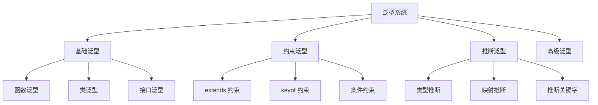

# TypeScript 泛型精通指南

## 🎯 泛型系统深度解析

泛型是 TypeScript 的核心特性，提供类型安全的代码复用机制。

### 📊 泛型架构图



## 🎪 泛型基础进阶

### 🔧 函数泛型深度应用

```typescript
// 1. 多泛型参数
function swap<T, U>(tuple: [T, U]): [U, T] {
    return [tuple[1], tuple[0]];
}

const swapped = swap<string, number>(['hello', 42]);  // [number, string]

// 2. 泛型约束实战
interface Lengthwise {
    length: number;
}

function loggingIdentity<T extends Lengthwise>(arg: T): T {
    console.log(arg.length);
    return arg;
}

loggingIdentity('hello world');     // ✅ string has length
loggingIdentity([1, 2, 3]);        // ✅ array has length
loggingIdentity({ length: -1 });   // ✅ object has length

// 3. 泛型默认值
function createArray<T = string>(length: number, value?: T): T[] {
    return Array(length).fill(value);
}

const stringArray = createArray(3, 'default');        // ['default', 'default', 'default']
const numberArray = createArray<number>(3, 42);       // [42, 42, 42]
```

### 🏗️ 泛型类架构设计

```typescript
// 1. 泛型数据容器
class Repository<T, K = string> {
    private items: Map<K, T> = new Map();
    
    create(id: K, item: T): void {
        this.items.set(id, item);
    }
    
    read(id: K): T | undefined {
        return this.items.get(id);
    }
    
    update(id: K, item: Partial<T>): boolean {
        const existing = this.items.get(id);
        if (!existing) return false;
        
        this.items.set(id, { ...existing, ...item });
        return true;
    }
    
    delete(id: K): boolean {
        return this.items.delete(id);
    }
    
    findAll(): T[] {
        return Array.from(this.items.values());
    }
}

// 使用泛型仓储
interface User {
    id: string;
    name: string;
    email: string;
}

const userRepo = new Repository<User, string>();
userRepo.create('user-1', { id: 'user-1', name: 'Alice', email: 'alike@email.com' });

// 2. 泛型缓存系统
class Cache<T extends string | number | object> {
    private cache = new Map<string, { value: T; expires: number }>();
    
    set(key: string, value: T, ttlSeconds: number = 300): void {
        const expires = Date.now() + (ttlSeconds * 1000);
        this.cache.set(key, { value, expires });
    };
    
    get<K extends T>(key: string): K | null {
        const item = this.cache.get(key);
        
        if (!item) return null;
        
        if (Date.now() > item.expires) {
            this.cache.delete(key);
            return null;
        }
        
        return item.value as K;
    }
    
    has(key: string): boolean {
        return this.get(key) !== null;
    }
    
    clear(): void {
        this.cache.clear();
    }
}

// 使用缓存
const cache = new Cache<User>();
cache.set('user-1', userRepo.read('user-1')!);
```

### 🔗 泛型接口设计模式

```typescript
// 1. 构建者模式泛型化
interface Builder<T> {
    build(): T;
}

class ConfigurationBuilder<T> implements Builder<T> {
    private config: Partial<T> = {};
    
    set<K extends keyof T>(key: K, value: T[K]): this {
        this.config[key] = value;
        return this;
    }
    
    setMany(config: Partial<T>): this {
        Object.assign(this.config, config);
        return this;
    }
    
    build(): T {
        return this.config as T;
    }
}

// 2. 工厂模式泛型化
interface Factory<T, Args extends readonly unknown[] = []> {
    create(...args: Args): T;
}

class ComponentFactory<T extends { mount(node: HTMLElement): void }> implements Factory<T> {
    constructor(private constructor: new (...args: any[]) => T) {}
    
    create(): T {
        return new this.constructor();
    }
}

// 3. 观察者模式泛型化
interface Observer<T> {
    update(data: T): void;
}

interface Observable<T> {
    subscribe(observer: Observer<T>): void;
    unsubscribe(observer: Observer<T>): void;
    notify(data: T): void;
}

class EventEmitter<T> implements Observable<T> {
    private observers: Observer<T>[] = [];
    
    subscribe(observer: Observer<T>): void {
        this.observers.push(observer);
    }
    
    unsubscribe(observer: Observer<T>): void {
        const index = this.observers.indexOf(observer);
        if (index > -1) {
            this.observers.splice(index, 1);
        }
    }
    
    notify(data: T): void {
        this.observers.forEach(observer => observer.update(data));
    }
}
```

## 🎯 高级泛型技巧

### 🔍 条件类型与泛型

```typescript
// 1. 类型守护泛型
type IsString<T> = T extends string ? true : false;
type CheckString = IsString<string>;  // true
type CheckNumber = IsString<number>;  // false

// 2. 条件推断泛型
type ExtractType<T> = T extends Array<infer U> ? U : never;
type StringArray = ExtractType<string[]>;  // string
type NotArray = ExtractType<number>;       // never

// 3. 递归条件类型
type DeepReadonly<T> = {
    readonly [P in keyof T]: T[P] extends object ? DeepReadonly<T[P]> : T[P];
};

interface DeepObject {
    level1: {
        level2: {
            value: string;
        };
    };
}

type DeepReadonlyExample = DeepReadonly<DeepObject>;

// 4. 联合类型分散
type Flatten<T> = T extends (infer U)[] ? U : T;
type FlattenArray = Flatten<string[]>;  // string
type FlattenNonArray = Flatten<string>; // string

// 5. 递归展开数组
type DeepFlatten<T>:
  T extends (infer U)[]
    ? U extends (infer V)[]
      ? V
      : U
    : T;

type DeepNestedArray = DeepFlatten<string[][]>;  // string
type SingleArray = DeepFlatten<string[]>;        // string
type NotArray = DeepFlatten<string>;             // string
```

### 🎪 映射类型泛型

```typescript
// 1. 工具类型改造
type Partial<T> = {
    [P in keyof T]?: T[P];
};

type Required<T> = {
    [P in keyof T]-?: T[P];
};

type Pick<T, K extends keyof T> = {
    [P in K]: T[P];
};

type Omit<T, K extends keyof T> = Pick<T, Exclude<keyof T, K>>;

// 2. 高级映射类型
type Nullable<T> = {
    [P in keyof T]: T[P] | null;
};

type Optional<T, K extends keyof T> = Omit<T, K> & Partial<Pick<T, K>>;

type ReadOnlySome<T, K extends keyof T> = ReadOnly<Pick<T, K>> & Omit<T, K>;

// 3. 字符串映射
type Stringify<T> = {
    [K in keyof T]: string;
};

type Numerify<T> = {
    [K in keyof T]: number;
};

// 4. 条件映射
type ConditionalMapping<T> = {
    [K in keyof T]: T[K] extends string 
        ? T[K] | null 
        : T[K] extends number 
            ? T[K]
            : T[K];
};
```

## 🚀 实用泛型工具库

### 🔧 类型安全工具集

```typescript
// 1. Result 模式泛型
type Result<T, E = Error> = Success<T> | Failure<E>;

interface Success<T> {
    success: true;
    data: T;
}

interface Failure<E> {
    success: false;
    error: E;
}

class ResultBuilder<T, E = Error> {
    static success<U>(data: U): Result<U, E> {
        return { success: true, data };
    }
    
    static failure<U>(error: E): Result<U, E> {
        return { success: false, error };
    }
    
    static fromPromise<T>(promise: Promise<T>): Promise<Result<T, E>> {
        return promise
            .then(data => ResultBuilder.success(data))
            .catch(error => ResultBuilder.failure(error));
    }
}

// 2. Either 类型泛型
type Either<L, R> = Left<L> | Right<R>;

class Left<L> {
    constructor(public value: L) {}
    
    isLeft(): this is Left<L> {
        return true;
    }
    
    isRight(): this is never {
        return false;
    }
}

class Right<R> {
    constructor(public value: R) {}
    
    isLeft(): this is never {
        return false;
    }
    
    isRight(): this is Right<R> {
        return true;
    }
    
    map<U>(fn: (value: R) => U): Either<L, U> {
        return new Right(fn(this.value));
    }
    
    flatMap<U>(fn: (value: R) => Either<L, U>): Either<L, U> {
        return fn(this.value);
    }
}

// 3. Maybe 泛型
type Maybe<T> = Some<T> | None;

class Some<T> {
    constructor(public value: T) {}
    
    isSome(): this is Some<T> {
        return true;
    }
    
    isNone(): this is never {
        return false;
    }
    
    map<U>(fn: (value: T) => U): Maybe<U> {
        return new Some(fn(this.value));
    }
    
    flatMap<U>(fn: (value: T) => Maybe<U>): Maybe<U> {
        return fn(this.value);
    }
    
    getOrElse(defaultValue: T): T {
        return this.value;
    }
}

class None {
    isSome(): this is never {
        return false;
    }
    
    isNone(): this is None {
        return true;
    }
    
    map<U>(fn: (value: never) => U): Maybe<U> {
        return this as None;
    }
    
    flatMap<U>(fn: (value: never) => Maybe<U>): Maybe<U> {
        return this as None;
    }
    
    getOrElse<T>(defaultValue: T): T {
        return defaultValue;
    }
}
```

### 🎯 业务逻辑泛型

```typescript
// 1. 验证器泛型
interface Validator<T> {
    validate(value: unknown): value is T;
    errorMessage: string;
}

class TypeValidator<T> implements Validator<T> {
    constructor(
        private predicate: (value: unknown) => value is T,
        public errorMessage: string
    ) {}
    
    validate(value: unknown): value is T {
        return this.predicate(value);
    }
}

// 验证器工厂
class ValidatorFactory {
    static string(): Validator<string> {
        return new TypeValidator((value): value is string => 
            typeof value === 'string', 'Expected string'
        );
    }
    
    static number(): Validator<number> {
        return new TypeValidator((value): value is number => 
            typeof value === 'number', 'Expected number'
        );
    }
    
    static email(): Validator<string> {
        return new TypeValidator((value): value is string => 
            typeof value === 'string' && /^[^\s@]+@[^\s@]+\.[^\s@]+$/.test(value), 
            'Invalid email format'
        );
    }
}

// 2. API 客户端泛型
interface ApiClient<T> {
    get<R>(endpoint: string): Promise<Result<R, Error>>;
    post<R>(endpoint: string, data: T): Promise<Result<R, Error>>;
    put<R>(endpoint: string, data: T): Promise<Result<R, Error>>;
    delete<R>(endpoint: string): Promise<Result<R, Error>>;
}

class GenericApiClient<T> implements ApiClient<T> {
    constructor(private baseURL: string) {}
    
    async get<R>(endpoint: string): Promise<Result<R, Error>> {
        try {
            const response = await fetch(`${this.baseURL}${endpoint}`);
            const data = await response.json();
            return ResultBuilder.success(data as R);
        } catch (error) {
            return ResultBuilder.failure(error as Error);
        }
    }
    
    async post<R>(endpoint: string, data: T): Promise<Result<R, Error>> {
        try {
            const response = await fetch(`${this.baseURL}${endpoint}`, {
                method: 'POST',
                headers: { 'Content-Type': 'application/json' },
                body: JSON.stringify(data)
            });
            const result = await response.json();
            return ResultBuilder.success(result as R);
        } catch (error) {
            return ResultBuilder.failure(error as Error);
        }
    }
    
    async put<R>(endpoint: string, data: T): Promise<Result<R, Error>> {
        try {
            const response = await fetch(`${this.baseURL}${endpoint}`, {
                method: 'PUT',
                headers: { 'Content-Type': 'application/json' },
                body: JSON.stringify(data)
            });
            const result = await response.json();
            return ResultBuilder.success(result as R);
        } catch (error) {
            return ResultBuilder.failure(error as Error);
        }
    }
    
    async delete<R>(endpoint: string): Promise<Result<R, Error>> {
        try {
            const response = await fetch(`${this.baseURL}${endpoint}`, {
                method: 'DELETE'
            });
            const result = await response.json();
            return ResultBuilder.success(result as R);
        } catch (error) {
            return ResultBuilder.failure(error as Error);
        }
    }
}
```

## 📚 泛型最佳实践

### 🎯 设计原则

1. **单一职责**: 每个泛型参数应该有明确的用途
2. **渐进增强**: 从简单泛型开始，逐步增加复杂度
3. **类型约束**: 使用约束避免过度泛型化
4. **文档优先**: 为复杂泛型提供详细文档

### 🔗 相关学习

- [[03-Conditional-Types深度应用]] - 条件类型高级用法
- [[04-Mapped-Types工具类型库]] - 映射类型工具集
- [[01-Type-System入门]] - 类型系统基础

---
*💡 掌握泛型是成为TypeScript专家的重要里程碑，它是构建可复用、类型安全代码的关键工具*
