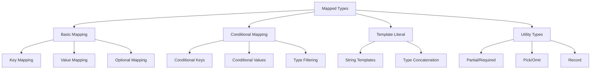

# TypeScript 映射类型工具库

## 🎯 映射类型核心机制

### 📊 映射类型分类



## 🔧 基础映射类型

### 💡 核心映射语法

```typescript
// 1. 基础映射类型结构
type BasicMapping<T> = {
    [K in keyof T]: T[K];
};

// 2. 简单变换
type ReadonlyMapping<T> = {
    readonly [K in keyof T]: T[K];
};

type OptionalMapping<T> = {
    [K in keyof T]?: T[K];
};

type RequiredMapping<T> = {
    [K in keyof T]-?: T[K];  // 移除可选标记
};

// 3. 实际应用示例
interface User {
    id: string;
    name: string;
    email: string;
    age?: number;
}

type ReadonlyUser = ReadonlyMapping<User>;
// { readonly id: string; readonly name: string; readonly email: string; readonly age?: number; }

type OptionalUser = OptionalMapping<User>;
// { id?: string; name?: string; email?: string; age?: number; }

type RequiredUser = RequiredMapping<User>;
// { id: string; name: string; email: string; age: number; }
```

### 🎪 高级映射技巧

```typescript
// 4. 条件映射
type NonNullableMapping<T> = {
    [K in keyof T]: T[K] extends null | undefined ? never : T[K];
};

type StringMapping<T> = {
    [K in keyof T]: T[K] extends string ? T[K] : string;
};

// 5. 键值映射
type PrefixedKeys<T, Prefix extends string> = {
    [K in keyof T as `${Prefix}${K & string}`]: T[K];
};

type SuffixedKeys<T, Suffix extends string> = {
    [K in keyof T as `${K & string}${Suffix}`]: T[K];
};

// 使用示例
type ApiUser = PrefixedKeys<User, 'api_'>; // { api_id: string; api_name: string; ... }
type ConfigUser = SuffixedKeys<User, '_config'>; // { id_config: string; name_config: string; ... }

// 6. 嵌套映射
type DeepReadonly<T> = {
    readonly [K in keyof T]: T[K] extends object
        ? T[K] extends Function
            ? T[K]
            : DeepReadonly<T[K]>
        : T[K];
};

interface NestedData {
    user: {
        profile: {
            name: string;
            settings: {
                theme: 'light' | 'dark';
            };
        };
    };
    config: {
        apiUrl: string;
    };
}

type DeepReadonlyData = DeepReadonly<NestedData>;
// 所有嵌套属性都变为 readonly
```

## 🚀 条件映射类型

### 🔍 类型过滤与转换

```typescript
// 1. 按值类型过滤属性
type PickByType<T, U> = {
    [K in keyof T as T[K] extends U ? K : never]: T[K];
};

type OmitByType<T, U> = {
    [K in keyof T as T[K] extends U ? никогда : K]: T[K];
};

// 使用示例
interface MixedData {
    id: string;
    name: string;
    age: number;
    isActive: boolean;
    createdAt: Date;
}

type StringFields = PickByType<MixedData, string>;
// { id: string; name: string; }

type NonStringFields = OmitByType<MixedData, string>;
// { age: number; isActive: boolean; createdAt: Date; }

// 2. 按键名模式过滤
type PickByPattern<T, Pattern extends string> = {
    [K in keyof T as K extends Pattern ? K : never]: T[K];
};

type OmitByPattern<T, Pattern extends string> = {
    [K in keyof T as K extends Pattern ? never : K]: T[K];
};

interface ApiData {
    'user.id': string;
    'user.name': string;
    'user.email': string;
    'config.api.URL': string;
    'config.api.timeout': number;
}

type UserFields = PickByPattern<ApiData, 'user.*'>; // { 'user.id': string; 'user.name': string; 'user.email': string; }
type ConfigFields = PickByPattern<ApiData, 'config.*'>; // { 'config.api.url': string; 'config.api.timeout': number; }

// 3. 复杂条件映射
type ConditionalMapping<T> = {
    [K in keyof T]: T[K] extends string
        ? `${string & T[K]}!`
        : T[K] extends number
            ? T[K] | 0
            : T[K] extends boolean
                ? !T[K]
                : T[K];
};

type ProcessedData = ConditionalMapping<{
    message: string;
    count: number;
    active: boolean;
    config: object;
}>;
// { message: string; count: number | 0; active: boolean; config: object; }
```

### 🎯 键值转换

```typescript
// 1. 键名转换工具
type CamelCaseKeys<T> = {
    [K in keyof T as CamelCase<string & K>]: T[K];
};

type SnakeCaseKeys<T> = {
    [K in keyof T as SnakeCase<string & K>]: T[K];
};

type PascalCaseKeys<T> = {
    [K in keyof T as PascalCase<string & K>]: T[K];
};

// 辅助类型定义
type CamelCase<S extends string> = S extends `${infer P1}_${infer P2}${infer P3}`
    ? `${P1}${Capitalize<P2>}${CamelCase<P3>}`
    : S;

type SnakeCase<S extends string> = S extends `${infer P1}${infer P2}`
    ? P2 extends Uncapitalize<P2>
        ? `${P1}${SnakeCase<P2>}`
        : `${P1}_${SnakeCase<Uncapitalize<P2>>}`
    : S;

type PascalCase<S extends string> = S extends `${infer P1}_${infer P2}`
    ? `${Capitalize<P1>}${PascalCase<P2>}`
    : Capitalize<S>;

// 使用示例
interface SnakeCaseData {
    user_id: string;
    first_name: string;
    last_name: string;
    email_address: string;
}

type CamelCaseData = CamelCaseKeys<SnakeCaseData>;
// { userId: string; firstName: string; lastName: string; emailAddress: string; }

// 2. 值类型转换
type ConvertTypes<T> = {
    [K in keyof T]: T[K] extends string ? string : T[K] extends number ? number : T[K];
};

type TransformTypes<T> = {
    [K in keyof T]: T[K] extends 'true' ? true
        : T[K] extends 'false' ? false
        : T[K] extends string ? T[K]
        : T[K] extends number ? T[K]
        : never;
};
```

## 📚 实用工具类型库

### 🛠️ 标准工具类型实现

```typescript
// 1. Partial 和 Required
type MyPartial<T> = {
    [K in keyof T]?: T[K];
};

type MyRequired<T> = {
    [K in keyof T]-?: T[K];
};

// 2. Pick 和 Omit
type MyPick<T, K extends keyof T> = {
    [P in K]: T[P];
};

type MyOmit<T, K extends keyof any> = MyPick<T, Exclude<keyof T, K>>;

// 3. Record 类型
type MyRecord<K extends keyof any, T> = {
    [P in K]: T;
};

// 使用示例
type UserRecord = MyRecord<'id' | 'name' | 'email', string>;
// { id: string; name: string; email: string; }

type ConfigRecord = MyRecord<string, string | number | boolean>;
// { [key: string]: string | number | boolean; }

// 4. Extract 和 Exclude
type MyExtract<T, U> = T extends U ? T : never;
type MyExclude<T, U> = T extends U ? never : T;

// 5. NonNullable
type MyNonNullable<T> = T extends null | undefined ? never : T;

// 6. Parameters 和 ReturnType
type MyParameters<T extends (...args: any) => any> = T extends (...args: infer P) => any ? P : never;
type MyReturnType<T extends (...args: any) => any> = T extends (...args: any) => infer R ? R : any;
type MyConstructorParameters<T extends new (...args: any) => any> = T extends new (...args: infer P) => any ? P : never;
type MyInstanceType<T extends new (...args: any) => any> = T extends new (...) => infer R ? R : any;
```

## 🎭 高级映射应用

### 🔄 复杂变换模式

```typescript
// 1. 深度变换
type DeepTransform<T> = {
    [K in keyof T]: T[K] extends object
        ? T[K] extends Array<infer U>
            ? Array<DeepTransform<U>>
            : DeepTransform<T[K]>
        : T[K] extends string
            ? string | null
            : T[K];
};

interface ComplexData {
    user: {
        id: number;
        profile: {
            name: string;
            tags: string[];
        };
    };
    items: Array<{
        title: string;
        quantity: number;
    }>;
}

type TransformedData = DeepTransform<ComplexData>;
// 所有字符串类型变为 string | null，其他保持不变

// 2. 批量属性操作
type AddPrefixes<T, Prefix extends string> = {
    [K in keyof T as K extends string ? `${Prefix}${K}` : K]: T[K];
};

type AddSuffixes<T, Suffix extends string> = {
    [K in keyof T as K extends string ? `${K}${Suffix}` : K]: T[K];
};

type RemovePrefixes<T, Prefix extends string> = {
    [K in keyof T as K extends string
        ? K extends `${Prefix}${infer Rest}` ? Rest : K
        : K]: T[K];
};

// 使用示例
type ApiPrefixedData = AddPrefixes<User, 'api_'>;
type DisplayPrefixedData = AddPrefixes<User, 'display_'>;
type CleanData = RemovePrefixes<ApiPrefixedData, 'api_'>; // 回到原始 User

// 3. 条件重命名
type ConditionalRename<T extends Record<string, any>> = {
    [K in keyof T]: K extends string
        ? K extends 'id'
            ? { identifier: T[K] }
            : K extends 'name'
                ? { title: T[K] }
                : T[K]
        : T[K];
};
```

### 🎯 智能映射工具

```typescript
// 1. 模板字面量映射
type TemplateMapper<T> = {
    [K in keyof T]: T[K] extends `${infer Prefix}-${infer Suffix}`
        ? `${Prefix}${Capitalize<Suffix>}`
        : T[K];
};

// 2. 递归映射
type RecursiveMapper<T> = T extends object
    ? {
        [K in keyof T]: T[K] extends object
            ? RecursiveMapper<T[K]>
            : T[K] extends string
                ? T[K] | null
                : T[K];
    }
    : T;

// 3. 路径映射
type PathMapper<T, MapRecord> = {
    [K in keyof T]: T[K] extends object
        ? PathMapper<T[K], MapRecord>
        : K extends keyof MapRecord
            ? MapRecord[K]
            : T[K];
};

// 使用示例
type TypeMapping = {
    string: number;
    number: boolean;
    boolean: string;
};

type MappedData = PathMapper<{
    id: string;
    count: number;
    active: boolean;
    config: {
        apiKey: string;
        timeout: number;
    };
}, TypeMapping>;
```

## 🎪 性能优化与最佳实践

### ⚡ 性能考虑

```typescript
// 1. 避免深度递归
type ShallowMapping<T> = {
    [K in keyof T]: T[K];
};

type DeepMappingLimit<T, Depth extends number = 3> = Depth extends 0
    ? T
    : {
        [K in keyof T]: T[K] extends object
            ? DeepMappingLimit<T[K], Prev<Depth>>
            : T[K];
    };

type Prev<T extends number> = [...Array<T>, never] extends [infer A, ...infer _]
    ? A extends number ? A : never
    : never;

// 2. 缓存复杂类型
type CachedTransformation<T> = T extends infer U
    ? U extends object
        ? { readonly [K in keyof U]: CachedTransformation<U[K]> }
        : U
    : never;

// 3. 批量操作
type BatchTransform<T, Transformations extends Record<string, any>> = {
    [K in keyof T]: K extends keyof Transformations
        ? Transformations[K] extends (...args: any[]) => infer R
            ? R
            : Transformations[K]
        : T[K];
};
```

### 🔗 相关深入学习

- [[03-Conditional-Types深度应用]] - 条件类型机制
- [[05-Template-Literals字符串魔法]] - 模板字面量类型
- [[01-Type-System入门]] - 类型系统基础

---
*💡 映射类型是TypeScript类型编程的核心工具，掌握这些技巧能构建出强大而灵活的类型系统*
