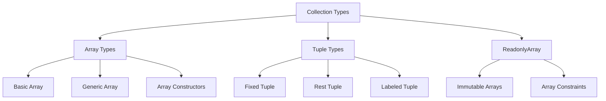

# TypeScript Array & Tuple 完全解析

## 🎯 数组与元组类型系统

### 📊 类型架构图



## 📚 数组类型详解

### 🎪 基础数组类型

```typescript
// 1. 基本数组语法
let numbers: number[] = [1, 2, 3, 4, 5];
let strings: string[] = ['hello', 'world'];
let mixed: (string | number)[] = ['hello', 42];

// 2. 泛型数组语法
let names: Array<string> = ['Alice', 'Bob'];
let ages: Array<number> = [25, 30, 35];

// 3. 数组字面量推断
const inferred = [1, true, 'hello'];  // (string | number | boolean)[]
const explicit: (string | number | boolean)[] = [1, true, 'hello'];

// 4. 多维度数组
let matrix: number[][] = [[1, 2], [3, 4]];
let cube: number[][][] = [[[1, 2], [3, 4]], [[5, 6], [7, 8]]];
```

### 🔧 数组工具类型

```typescript
// 1. 只读数组
let readonlyNumbers: readonly number[] = [1, 2, 3];
readonlyNumbers[0];  // ✅ 可以读取
// readonlyNumbers[0] = 10;  // ❌ 不能修改

// 2. ReadonlyArray 泛型
let readonlyNames: ReadonlyArray<string> = ['Alice', 'Bob'];
let readonlyAges: ReadonlyArray<number> = Object.freeze([25, 30]);

// 3. 数组约束
function processArray<T extends readonly unknown[]>(array: T): T {
    return array;
}

function sumNumbers(array: readonly number[]): number {
    return array.reduce((sum, num) => sum + num, 0);
}

// 4. 数组转换工具类型
type ArrayElement<T> = T extends readonly (infer U)[] ? U : never;
type StringArrayElement = ArrayElement<string[]>;  // string

// 展开数组类型
type FlattenArray<T> = T extends readonly (infer U)[] ? U[] : [T];
type Flat = FlattenArray<[1, 2, [3, 4]]>;  // [1, 2, 3, 4]
```

### 🎯 数组方法类型安全

```typescript
// 类型安全的数组方法
class TypedArray<T> {
    private items: T[] = [];
    
    push(item: T): number {
        return this.items.push(item);
    }
    
    pop(): T | undefined {
        return this.items.pop();
    }
    
    map<U>(callbackfn: (value: T, index: number, array: T[]) => U): U[] {
        return this.items.map(callbackfn);
    }
    
    filter(callbackfn: (value: T, index: number, array: T[]) => boolean): T[] {
        return this.items.filter(callbackfn);
    }
    
    reduce<U>(callbackfn: (previousValue: U, currentValue: T, currentIndex: number, array: T[]) => U, initialValue: U): U {
        return this.items.reduce(callbackfn, initialValue);
    }
    
    find(predicate: (value: T, index: number, obj: T[]) => boolean): T | undefined {
        return this.items.find(predicate);
    }
    
    some(predicate: (value: T, index: number, array: T[]) => boolean): boolean {
        return this.items.some(predicate);
    }
    
    every(predicate: (value: T, index: number, array: T[]) => boolean): boolean {
        return this.items.every(predicate);
    }
}

// 实际应用
const stringArray = new TypedArray<string>();
stringArray.push('hello');
stringArray.push('world');

const lengths = stringArray.map(s => s.length);  // number[]
const longWords = stringArray.filter(s => s.length > 5);  // string[]
```

## 🎭 元组类型详解

### 📋 固定长度元组

```typescript
// 1. 基础元组
let coordinate: [number, number] = [10, 20];
let person: [string, number, boolean] = ['Alice', 25, true];

// 2. 类型推断与约束
function createTuple<A, B>(a: A, b: B): [A, B] {
    return [a, b];
}

const stringTuple = createTuple('hello', 'world');  // [string, string]
const mixedTuple = createTuple(42, true);          // [number, boolean]

// 3. 元组解构类型安全
function handleCoordinates([x, y]: [number, number]) {
    console.log(`X: ${x}, Y: ${y}`);
}

function handleUser([name, age, active]: [string, number, boolean]) {
    console.log(`User ${name} (${age}) is ${active ? 'active' : 'inactive'}`);
}
```

### 🚀 Rest元组与标签元组

```typescript
// 1. Rest元组 (TypeScript 4.0+)
function processItems<T extends readonly unknown[]>(items: [...T]): T {
    return items;
}

const processed = processItems([1, 'hello', true]);  // [number, string, boolean]

// 2. 条件Rest元组
function createVariadicTuple<T extends readonly unknown[]>(
    ...args: T extends readonly [infer U, ...infer Rest] ? [U, ...Rest] : T
): T {
    return args as T;
}

// 3. 标签元组 (TypeScript 4.0+)
interface LabeledCoordinate extends Array<number> {
    0: number;  // x
    1: number;  // y
}

type LabeledTuple = [x: number, y: number, z: number];

// 实际应用示例
interface DatabaseConfig {
    host: string;
    port: number;
    username: string;
    password: string;
    database: string;
}

function createDbConfig(config: [host: string, port: number, username: string, password: string, database: string]): DatabaseConfig {
    const [host, port, username, password, database] = config;
    return { host, port, username, password, database };
}

const dbConfig = createDbConfig(['localhost', 5432, 'admin', 'password', 'myapp']);
```

### 🎪 元组实用工具类型

```typescript
// 1. 元组长度获取
type TupleLength<T extends readonly unknown[]> = T.length;
type Length = TupleLength<[1, 2, 3, 4]>;  // 4

// 2. 元组首元素类型
type Head<T extends readonly unknown[]> = T extends readonly [infer H, ...unknown[]] ? H : never;
type First = Head<[string, number, boolean]>;  // string

// 3. 元组尾元素类型
type Tail<T extends readonly unknown[]> = T extends readonly [unknown, ...infer T] ? T : [];
type Rest = Tail<[string, number, boolean]>;  // [number, boolean]

// 4. 元组反转
type Reverse<T extends readonly unknown[]> = T extends readonly [infer H, ...infer Rest]
    ? [...Reverse<Rest>, H]
    : [];

type ReverseExample = Reverse<[1, 2, 3, 4]>;  // [4, 3, 2, 1]

// 5. 元组合并
type Concat<T extends readonly unknown[], U extends readonly unknown[]> = [...T, ...U];
type ConcatResult = Concat<[1, 2], [3, 4]>;  // [1, 2, 3, 4]

// 6. 条件类型推断工具
type Last<T extends readonly unknown[]> = T extends readonly [...unknown[], infer L] ? L : never;
type LastElement = Last<['a', 'b', 'c']>;  // 'c'

type Pop<T extends readonly unknown[]> = T extends readonly [...infer Rest, unknown] ? Rest : [];
type PopResult = Pop<[1, 2, 3]>;  // [1, 2]
```

## 🔄 数组与元组转换

### 🛠️ 类型转换工具

```typescript
// 1. 元组转数组
type TupleToArray<T extends readonly unknown[]> = T[number][];
type TupleFromArray = TupleToArray<[string, number, boolean]>;  // (string | number | boolean)[]

// 2. 数组转元组 (有限制)
type ArrayToTuple<T extends readonly unknown[]> = T extends readonly [infer U, ...infer Rest]
    ? Rest extends readonly []
        ? [U]
        : [ U, ...ArrayToTuple<Rest> ]
    : [];

// 3. 数组元素类型提取
type ElementType<T> = T extends readonly (infer U)[] ? U : never;
type StringElement = ElementType<string[]>;  // string
type TupleElement = ElementType<[string, number]>;  // string | number

// 4. 嵌套数组处理
type Flatten<T> = T extends readonly (infer U)[] 
    ? U extends readonly unknown[] 
        ? Flatten<U> 
        : U 
    : T;

type DeepFlatten = Flatten<[1, [2, [3, [4]]]]>;  // number

// 5. 数组映射
type ArrayMap<T extends readonly unknown[], F> = {
    [K in keyof T]: F extends (x: T[K]) => infer R ? R : never;
};

type ToString<T extends readonly unknown[]> = ArrayMap<T, (x: string) => string>;
```

### 🎯 实际应用场景

```typescript
// 1. 函数参数元组化
type Params<T extends (...args: any[]) => any> = T extends (...args: infer P) => any ? P : never;

function add(a: number, b: number): number {
    return a + b;
}

type AddParams = Params<typeof add>;  // [number, number]

// 2. API响应处理
interface ApiResponse<T> {
    data: T;
    status: 'success' | 'error';
    message?: string;
}

function handleApiResponses<T extends readonly unknown[]>(
    responses: [...ArrayMap<T, ApiResponse>]
): ApiResponse<ArrayMap<T, ElementType>> {
    // 批量处理API响应的逻辑
    return {
        data: responses.map(r => r.data) as ArrayMap<T, ElementType>,
        status: 'success'
    };
}

// 3. 数据库查询结果类型化
interface User { id: number; name: string; email: string; }
interface Post { id: number; title: string; userId: number; }

type QueryResult<T> = {
    results: T[];
    total: number;
    page: number;
    limit: number;
};

function createTypedQuery<T extends readonly unknown[]>(queries: [...T]) {
    return {
        execute: async (): Promise<ArrayMap<T, QueryResult>> => {
            // 查询逻辑
            return Promise.all(
                queries.map(async () => ({ results: [], total: 0, page: 1, limit: 10 }))
            ) as Promise<ArrayMap<T, QueryResult>>;
        }
    };
}

// 使用示例
const userQuery = createTypedQuery<User[], Post[]>([]);
```

## 📚 最佳实践与性能优化

### 🎯 设计原则

```typescript
// 1. 优先使用具体类型
// 推荐：具体类型
let userIds: number[] = [1, 2, 3, 4];
let userNames: string[] = ['Alice', 'Bob', 'Charlie'];

// 避免：any数组
let mixedData: any[] = [1, 'hello', true];  // ❌

// 2. 使用元组进行固定长度约束
type Coordinates = [number, number];
type RGBColor = [number, number, number];

function drawLine(start: Coordinates, end: Coordinates) {
    // 确保参数长度固定且类型正确
}

// 3. 利用只读类型保护数据
function processUserData(data: readonly User[]) {
    // data 不能修改，确保数据安全
}

// 4. 合理使用rest元组
function createLogger<T extends readonly unknown[]>(...levels: [...T]) {
    return {
        log: (level: T[number], message: string) => {
            console.log(`[${level}] ${message}`);
        }
    };
}

const logger = createLogger('debug', 'info', 'error', 'fatal');
logger.log('info', 'This is a log message');
```

### ⚡ 性能考虑

```typescript
// 1. 大数组的内存优化
class EfficientArray<T> {
    private items: T[];
    private capacity: number;
    
    constructor(initialCapacity: number = 16) {
        this.capacity = initialCapacity;
        this.items = new Array(this.capacity);
    }
    
    add(item: T): void {
        if (this.items.length >= this.capacity) {
            this.resize();
        }
        this.items.push(item);
    }
    
    private resize(): void {
        this.capacity *= 2;
    }
}

// 2. 类型的懒加载
type LazyArray<T> = () => T[];
type ConditionalArray<T> = T extends string ? string[] : number[];

// 3. 不变性保证
function immutableAdd<T>(array: readonly T[], item: T): T[] {
    return [...array, item];
}

function immutableUpdate<T>(array: readonly T[], index: number, item: T): T[] {
    return array.map((existing, i} => i === index ? item : existing);
};
```

### 🔗 相关深入学习

- [[02-Object-Types设计模式]] - 对象类型设计
- [[03-Function-Types签名技巧]] - 函数类型技巧
- [[01-Type-Inference揭秘]] - 类型推断机制

---
*💡 Array和Tuple是TypeScript中的基础数据结构，掌握它们的类型特性是构建更大规模类型系统的基础*
