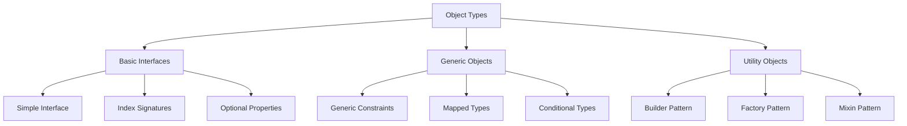

# TypeScript 对象类型设计模式

## 🎯 对象类型系统概览

### 📊 对象类型架构



## 🏗️ 基础对象类型

### 🎪 接口设计模式

```typescript
// 1. 基础接口定义
interface User {
    readonly id: string;
    name: string;
    email: string;
    age?: number;
    preferences: UserPreferences;
    createdAt: Date;
    updatedAt?: Date;
}

interface UserPreferences {
    theme: 'light' | 'dark';
    language: 'en' | 'zh';
    notifications: boolean;
}

// 2. 可扩展接口设计
interface BaseEntity {
    readonly id: string;
    createdAt: Date;
    updatedAt: Date;
}

interface Product extends BaseEntity {
    name: string;
    price: number;
    description: string;
    category: Category;
}

interface Category extends BaseEntity {
    name: string;
    products: Product[];
}

// 3. 组合接口模式
interface Auditable {
    createdBy: string;
    updatedBy: string;
    version: number;
}

interface Timestamped {
    createdAt: Date;
    updatedAt: Date;
}

interface Document extends BaseEntity, Auditable, Timestamped {
    title: string;
    content: string;
    status: 'draft' | 'published' | 'archical' | 'archicald';
}
```

### 🔧 索引签名与动态属性

```typescript
// 1. 数字索引签名
interface StringArray {
    [index: number]: string;
}

let myArray: StringArray;
myArray = ["Bob", "Fred"];

// 2. 字符串索引签名
interface Dictionary {
    [key: string]: string | number;
}

let myDict: Dictionary;
myDict = { 
    "name": "Bob", 
    "age": 25,
    "city": "Beijing"
};

// 3. 混合索引签名
interface ComplexObject {
    [key: string]: any;
    readonly id: string;
    name: string;
}

// 4. 带约束的索引签名
interface TypedDictionary<T> {
    [key: string]: T;
    readonly keys: string[];
    readonly values: T[];
}
```

### 🎯 可选与必需属性

```typescript
// 1. 部分属性工具类型
type PartialUser = Partial<User>;
// 所有属性变为可选的

type RequiredUser = Required<User>;
// 所有属性变为必需的

// 2. 自定义可选属性
type OptionalUser = {
    id: string;  // 保持必需
    name: string; // 保持必需
    email: string; // 保持必需
} & Partial<Pick<User, 'age' | 'preferences' | 'createdAt' | 'updatedAt'>>;

// 3. 条件必需属性
type ConditionalUser<T extends boolean> = {
    id: string;
    name: string;
    email: string;
} & (T extends true ? {
    preferences: UserPreferences;
    createdAt: Date;
} : {
    preferences?: UserPreferences;
    createdAt?: Date;
});
```

## 🚀 泛型对象类型

### 💫 泛型对象约束

```typescript
// 1. 泛型对象接口
interface Repository<T> {
    findById(id: string): Promise<T | null>;
    findAll(): Promise<T[]>;
    create(entity: Omit<T, 'id'>): Promise<T>;
    update(id: string, entity: Partial<T>): Promise<T | null>;
    delete(id: string): Promise<boolean>;
}

interface Entity {
    readonly id: string;
    createdAt: Date;
    updatedAt: Date;
}

// 2. 约束泛型类型
interface TypedRepository<T extends Entity> extends Repository<T> {
    findByDateRange(startDate: Date, endDate: Date): Promise<T[]>;
    softDelete(id: string): Promise<T | null>;
}

// 3. 具体实现示例
class UserRepository implements TypedRepository<User> {
    private users: Map<string, User> = new Map();
    
    async findById(id: string): Promise<User | null> {
        return this.users.get(id) || null;
    }
    
    async findAll(): Promise<User[]> {
        return Array.from(this.users.values());
    }
    
    async create(newUser: Omit<User, 'id'>): Promise<User> {
        const user: User = {
            ...newUser,
            id: crypto.randomUUID(),
        };
        this.users.set(user.id, user);
        return user;
    }
    
    async update(id: string, updates: Partial<User>): Promise<User | null> {
        const existing = this.users.get(id);
        if (!existing) return null;
        
        const updated: User = { ...existing, ...updates };
        this.users.set(id, updated);
        return updated;
    }
    
    async delete(id: string): Promise<boolean> {
        return this.users.delete(id);
    }
    
    async findByDateRange(startDate: Date, endDate: Date): Promise<User[]> {
        return Array.from(this.users.values()).filter(
            user => user.createdAt >= startDate && user.createdAt <= endDate
        );
    }
    
    async softDelete(id: string): Promise<User | null> {
        // 软删除实现
        return this.findById(id);
    }
}
```

### 🔨 映射类型对象工具

```typescript
// 1. 深度只读映射
type DeepReadonly<T> = {
    readonly [P in keyof T]: T[P] extends object 
        ? DeepReadonly<T[P]> 
        : T[P];
};

type ReadonlyUser = DeepReadonly<User>;

// 2. 深度可选映射
type DeepPartial<T> = {
    [P in keyof T]?: T[P] extends object 
        ? DeepPartial<T[P]> 
        : T[P];
};

type PartialUserDeep = DeepPartial<User>;

// 3. 选择性映射
type PickByType<T, U> = {
    [K in keyof T as T[K] extends U ? K : never]: T[K];
};

type StringProps = PickByType<User, string>;  // { name: string; email: string; }

// 4. 变更字段类型
type ChangeFieldType<T, K extends keyof T, U> = {
    [P in keyof T]: P extends K ? U : T[P];
};

type StringUserIdUser = ChangeFieldType<User, 'id', string>;
```

## 🎭 设计模式应用

### 🏭 建造者模式 (Builder Pattern)

```typescript
// 1. 通用建造者接口
interface Builder<T> {
    build(): T;
}

// 2. 用户建造者实现
class UserBuilder implements Builder<User> {
    private user: Partial<User> = {};
    
    setId(id: string): this {
        this.user.id = id;
        return this;
    }
    
    setName(name: string): this {
        this.user.name = name;
        return this;
    }
    
    setEmail(email: string): this {
        this.user.email = email;
        return this;
    }
    
    setAge(age: number): this {
        this.user.age = age;
    }
    
    setPreferences(preferences: UserPreferences): this {
        this.user.preferences = preferences;
        return this;
    }
    
    build(): User {
        if (!this.user.id || !this.user.name || !this.user.email) {
            throw new Error('Missing required fields');
        }
        
        const user: RequestUser = {
            ...this.user as Required<Pick<User, 'id' | 'name' | 'email'>>,
            id: this.user.id,
            name: this.user.name,
            email: this.user.email,
            preferences: this.user.preferences || {
                theme: 'light',
                language: 'en',
                notifications: true
            },
            createdAt: new Date(),
            updatedAt: new Date()
        };
        
        return user;
    }
}

// 3. 使用建造者模式
const user = new UserBuilder()
    .setId(crypto.randomUUID())
    .setName('Alice')
    .setEmail('alice@example.com')
    .setAge(25)
    .build();
```

### 🏭 工厂模式 (Factory Pattern)

```typescript
// 1. 通用工厂接口
interface Factory<T, AT extends readonly unknown[] = []> {
    create(...args: AT): T;
}

// 2. 特定类型工厂
class UserFactory<U = User> implements Factory<U, [Omit<U, 'id' | 'createdAt' | 'updatedAt'>]> {
    constructor(private entityConstructor: new (data: any) => U) {}
    
    create(data: Omit<U, 'id' | 'createdAt' | 'updatedAt'>): U {
        const entity = {
            ...data,
            id: crypto.randomUUID(),
            createdAt: new Date(),
            updatedAt: new Date()
        };
        
        return new this.entity Constructor(entity);
    }
}

// 3. 抽象工厂
interface AbstractEntityFactory {
    createUser(data: UserData): User;
    createProduct(data: ProductData): Product;
}

class DatabaseEntityFactory implements AbstractEntityFactory {
    createUser(data: Omit<User, 'id' | 'createdAt' | 'updatedAt'>): User {
        return {
            ...data,
            id: crypto.randomUUID(),
            createdAt: new Date(),
            updatedAt: new Date()
        };
    }
    
    createProduct(data: Omit<Product, 'id' | 'createdAt' | 'updatedAt'>): Product {
        return {
            ...data,
            id: crypto.randomUUID(),
            createdAt: new Date(),
            updatedAt: new Date()
        };
    }
}
```

### 🔀 混入模式 (Mixin Pattern)

```typescript
// 1. 混入构造函数类型
type Constructor<T = {}> = new (...args: any[]) => T;

// 2. 可时间戳混入
class TimestampedMixin {
    createdAt: Date;
    updatedAt: Date;
    
    constructor() {
        this.createdAt = new Date();
        this.updatedAt = new Date();
    }
    
    touch(): void {
        this.updatedAt = new Date();
    }
}

// 3. 可审计混入
class AuditableMixin {
    createdBy: string;
    updatedBy: string;
    version: number;
    
    constructor(userId: string) {
        this.createdBy = userId;
        this.updatedBy = userId;
        this.version = 1;
    }
    
    updateVersion(updatedBy: string): void {
        this.updatedBy = updatedBy;
        this.version++;
    }
}

// 4. 混入应用函数
function applyMixins(derivedCtor: any, constructors: any[]) {
    constructors.forEach((baseCtor) => {
        Object.getOwnPropertyNames(baseCtor.prototype).forEach((name) => {
            Object.defineProperty(
                derivedCtor.prototype,
                name,
                Object.getOwnPropertyDescriptor(baseCtor.prototype, name) || 
                    Object.create(null)
            );
        });
    });
}

// 5. 具体应用
class AuditableTimestampedEntity implements User {
    // 混入的属性
    createdAt: Date;
    updatedAt: Date;
    createdBy: string;
    updatedBy: string;
    version: number;
    
    // 业务属性
    readonly id: string;
    name: string;
    email: string;
    age?: number;
    preferences: UserPreferences;
    
    constructor(userData: Omit<User, 'id' | 'createdAt' | 'updatedAt'>, userId: string) {
        this.id = crypto.randomUUID();
        Object.assign(this, userData);
        
        // 初始化混入
        this.createdAt = new Date();
        this.updatedAt = new Date();
        this.createdBy = userId;
        this.updatedBy = userId;
        this.version = 1;
    }
    
    // 混入方法
    touch(): void {
        this.updatedAt = new Date();
    }
    
    updateVersion(updatedBy: string): void {
        this.updatedBy = updatedBy;
        this.version++;
        this.touch();
    }
}
```

## 📚 高级对象类型技巧

### 🎯 条件对象类型

```typescript
// 1. 条件扩展
type ConditionalUser<T extends boolean> = {
    id: string;
    name: string;
    email: string;
} & (T extends true ? {
    fullProfile: {
        bio: string;
        avatar: string;
        social: SocialLinks;
    };
    permissions: Permission[];
} : {
    basicProfile: {
        displayName: string;
    };
});

interface SocialLinks {
    twitter?: string;
    github?: string;
    linkedin?: string;
}

interface Permission {
    resource: string;
    actions: string[];
}

// 2. 智能对象验证
type ValidateObject<T> = T extends { id: string } 
    ? T extends { name: string }
        ? T extends { email: string }
            ? T
            : never
        : never
    : never;

// 3. 运行时类型验证
function createValidUser<T extends Partial<User>>(userData: T): ValidateObject<T> {
    if (!userData.id || !userData.name || !userData.email) {
        throw new Error('Invalid user data: missing required fields');
    }
    
    return userData as ValidateObject<T>;
}
```

### 🔧 对象类型转换

```typescript
// 1. 扁平化嵌套对象
type Flatten<T> = {
    [K in keyof T]: T[K] extends object ? T[K] : T[K] extends never ? never : T[K];
} & {};

// 2. 对象属性的路径类型
type Paths<T> = T extends object ? {
    [K in keyof T]: `${K & string}` | `${K & string}.${Paths<T[K]>}`;
}[keyof T] : '';

type UserPaths = Paths<User>;  // "id" | "name" | "email" | "preferences.theme" | "preferences.language" | ...

// 3. 根据路径获取值的类型
type PathValue<T, P extends Paths<T>> = P extends keyof T 
    ? T[P]
    : P extends `${infer K}.${infer Rest}`
        ? K extends keyof T
            ? Rest extends Paths<T[K]>
                ? PathValue<T[K], Rest>
                : never
            : never
        : never;

type EmailType = PathValue<User, 'email'>;  // string
type ThemeType = PathValue<User, 'preferences.theme'>;  // 'light' | 'dark'
```

## 🎪 性能优化与最佳实践

### ⚡ 对象类型性能

```typescript
// 1. 使用接口而非type alias联合
interface WebService {
    request(): Promise<Response>;
}

interface DatabaseService {
    store(data: any): Promise<void>;
}

// 2. 避免过度复杂的条件类型
type SimpleConditional<T> = T extends string ? string : T extends number ? number : unknown;

// 3. 预定义常用类型
type CommonTypes = string | number | boolean | Date | null | undefined;

interface OptimizedEntity {
    metadata: Record<string, CommonTypes>;
}
```

### 🔗 相关深入学习

- [[03-Function-Types签名技巧]] - 函数类型设计
- [[04-Class-Types架构设计]] - 类类型架构
- [[01-Type-System入门]] - 类型系统基础

---
*💡 掌握对象类型设计模式是构建大型TypeScript应用的重要技能，合理的类型设计能大大提高代码质量和可维护性*
