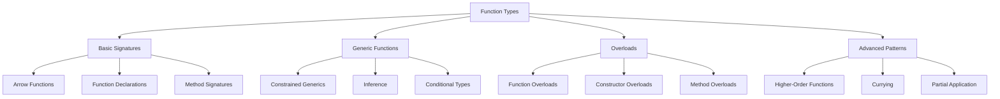

# TypeScript 函数类型签名技巧

## 🎯 函数类型系统概览

### 📊 函数类型分类



## 🔧 基础函数签名

### 💡 函数声明类型化

」```typescript
// 1. 基础函数类型签名
function add(a: number, b: number): number {
    return a + b;
}

function greet(name: string, greeting: string = 'Hello'): string {
    return `${greeting}, ${name}!`;
}

// 2. 箭头函数类型
const multiply = (x: number, y: number): number => x * y;

const formatUser = (user: { name: string; email: string }): string => {
    return `${user.name} (${user.email})`;
};

// 可选参数和默认值
const createUser = (
    name: string,
    email: string,
    options: {
        isActive?: boolean;
        role?: 'user' | 'admin';
        createdAt?: Date;
    } = {}
): User => {
    return {
        id: crypto.randomUUID(),
        name,
        email,
        isActive: options.isActive ?? true,
        role: options.role ?? 'user'],
        createdAt: options.createdAt ?? new Date()
    };
};

// 3. rest 参数类型
function sum(...numbers: number[]): number {
    return numbers.reduce((total, num) => total + num, 0);
}

function joinStrings(separator: string, ...strings: string[]): string {
    return strings.join(separator);
}
```

### 🎪 函数重载模式

```typescript
// 1. 基础函数重载
function parseValue(value: string): string;
function parseValue(value: number): number;
function parseValue(value: boolean): boolean;
function parseValue(value: string | number | boolean): string | number | boolean {
    if (typeof value === 'string') {
        return value.toUpperCase();
    } else if (typeof value === 'number') {
        return value * 2;
    } else {
        return !value;
    }
}

// 使用重载
const upperString = parseValue('hello');     // string
const doubledNumber = parseValue(42);         // number
const invertedBoolean = parseValue(true);     // boolean

// 2. API 调用重载
interface User {
    id: string;
    name: string;
    email: string;
}

interface ApiResponse<T> {
    data: T;
    status: number;
    message: string;
}

// 重载定义
function fetchUser(id: string): Promise<User>;
function fetchUser(): Promise<User[]>;
function fetchUser(id?: string): Promise<User | User[]> {
    if (id) {
        return fetch(`/api/users/${id}`).then(res => res.json());
    } else {
        return fetch('/_api/users').then(res => res.json());
    }
}

// 使用
const singleUser = await fetchUser('123');      // User
const allUsers = await fetchUser();             // User[]

// 3. 构造函数重载
class Point {
    x: number;
    y: number;

    constructor(x: number, y: number);
    constructor(point: { x: number; y: number });
    constructor(coordinates: string); // "x,y" 格式
    constructor(
        xOrPointOrCoordinates: number | { x: number; y: number } | string,
        y?: number
    ) {
        if (typeof xOrPointOrCoordinates === 'number' && y !== undefined) {
            this.x = xOrPointOrCoordinates;
            this.y = y;
        } else if (typeof xOrPointOrCoordinates === 'object') {
            this.x = xOrPointOrCoordinates.x;
            this.y = xOrPointOrCoordinates.y;
        } else if (typeof xOrPointOrCoordinates === 'string') {
            const [x, y] = xOrPointOrCoordinates.split(',').map(Number);
            this.x = x;
            this.y = y;
        } else {
            throw new Error('Invalid arguments');
        }
    }
}
```

## 🚀 泛型函数设计

### 🎯 泛型约束应用

```typescript
// 1. 基础泛型函数
function identity<T>(value: T): T {
    return value;
}

function firstElement<T>(array: T[]): T | undefined {
    return array[0];
}

function lastElement<T>(array: T[]): T | undefined {
    return array[array.length - 1];
}

// 2. 约束泛型函数
interface Lengthwise {
    length: number;
}

function logLength<T extends Lengthwise>(item: T): void {
    console.log(`Length: ${item.length}`);
}

logLength('hello');      // 输出: Length: 5
logLength([1, 2, 3]);    // 输出: Length: 3
logLength({ length: 10 }); // 输出: Length: 10

// 3. 多个约束
interface Printable {
    print(): string;
}

function processItem<T extends Lengthwise & Printable>(item: T): void {
    console.log(`${item.print()} (length: ${item.length})`);
}

class Document implements Lengthwise, Printable {
    constructor(public content: string) {}
    
    get length(): number {
        return this.content.length;
    }
    
    print(): string {
        return this.content;
    }
}

processItem(new Document('Hello World')); // 输出: Hello World (length: 11)

// 4. 泛型工厂函数
function createFactory<T>(Constructor: new (...args: any[]) => T) {
    return function(...args: any[]): T {
        return new Constructor(...args);
    };
}

const createUser = createFactory(User);
const createPoint = createFactory(Point);

const user = createUser('Alice', 'alice@example.com');
const point = createPoint(10, 20);
```

### 🔄 条件泛型函数

```typescript
// 1. 条件类型函数
type IsArray<T> = T extends any[] ? true : false;

function processData<T>(
    data: T,
    processor: T extends any[] 
        ? (item: T[0]) => void 
        : (item: T) => void
): void {
    if (Array.isArray(data)) {
        data.forEach(item => processor(item as T[0]));
    } else {
        processor(data);
    }
}

// 使用
processData([1, 2, 3], (item) => console.log(item * 2));     // 处理数组
processData('hello', (item) => console.log(item.toUpperCase())); // 处理单个值

// 2. 映射类型函数
function mapProperties<T, U>(
    obj: T,
    mapper: (value: T[keyof T], key: keyof T) => U
): Record<keyof T, U> {
    const result = {} as Record<keyof T, U>;
    
    for (const key in obj) {
        result[key] = mapper(obj[key], key);
    }
    
    return result;
}

const user = { name: 'Alice', age: 30 };
const stringProperties = mapProperties(user, (value) => String(value));
// { name: string; age: string }

// 3. 推断泛型函数
function createPair<T extends unknown[], U>(
    first: (...args: T) => U,
    second: (...args: T) => U
): typeof first & typeof second {
    return Object.assign(first, second);
}

const pair = createPair(
    (x: string) => x.toUpperCase(),
    (x: string) => x.toLowerCase()
);

// pair 的类型是: ((x: string) => string) & ((x: string) => string)
```

## 🎭 高级函数模式

### 🏗️ 高阶函数设计

```typescript
// 1. 函数组合
function compose<A, B, C>(
    f: (b: B) => C,
    g: (a: A) => B
): (a: A) => C {
    return (a: A) => f(g(a));
}

// 使用组合
const addOne = (x: number) => x + 1;
const double = (x: number) => x * 2;
const toString = (x: number) => x.toString();

const processNumber = compose(
    compose(toString, addOne),
    double
);

const result = processNumber(5); // "11"

// 2. 管道函数
function pipe<T>(value: T): T;
function pipe<T, U>(value: T, fn: (x: T) => U): U;
function pipe<T, U, V>(value: T, fn1: (x: T) => U, fn2: (x: U) => V): V;
function pipe<T, U, V, W>(
    value: T,
    fn1: (x: T) => U,
    fn2: (x: U) => V,
    fn3: (x: V) => W
): W;
function pipe(...args: any[]): any {
    const [value, ...functions] = args;
    return functions.reduce((acc, fn) => fn(acc), value);
}

// 使用管道
const result = pipe(
    5,
    double,
    addOne,
    toString
); // "11"

// 3. curry 函数
function curry<TArgs extends any[], TReturn>(
    fn: (...args: TArgs) => TReturn
): Curried<TArgs, TReturn> {
    return ((...args: any[]) => {
        if (args.length >= fn.length) {
            return fn(...args as TArgs);
        } else {
            return curry(fn.bind(null, ...args));
        }
    }) as Curried<TArgs, TReturn>;
}

type Curried<T extends any[], R> = T extends [infer Arg, ...infer Rest]
    ? (arg: Arg) => Curried<Rest, R>
    : R;

// curry 化使用
const add = (x: number, y: number, z: number) => x + y + z;
const curriedAdd = curry(add);

const addFive = curriedAdd(5);           // (y: number, z: number) => number
const addFiveAndTen = curriedAdd(5)(10); // (z: number) => number
const result = addFiveAndTen(15);        // 30
```

### 🎯 异步函数类型

```typescript
// 1. Promise 类型化
async function fetchUser(id: string): Promise<User> {
    const response = await fetch(`/api/users/${id}`);
    
    if (!response.ok) {
        throw new Error(`Failed to fetch user: ${response.statusText}`);
    }
    
    return response.json();
}

// 2. async 错误处理类型
type AsyncResult<T, E = Error> = Promise<{ data: T } | { error: E }>;

async function safeFetchUser(id: string): AsyncResult<User> {
    try {
        const user = await fetchUser(id);
        return { data: user };
    } catch (error) {
        return { error: error instanceof Error ? error : new Error('Unknown error') };
    }
}

// 3. 批量处理类型
async function processBatch<T, R>(
    items: T[],
    processor: (item: T) => Promise<R>,
    concurrency: number = 3
): Promise<R[]> {
    const results: R[] = [];
    
    for (let i = 0; i < items.length; i += concurrency) {
        const batch = items.slice(i, i + concurrency);
        const batchResults = await Promise.all(batch.map(processor));
        results.push(...batchResults);
    }
    
    return results;
}

// 使用批量处理
const userIds = ['1', '2', '3', '4', '5'];
const users = await processBatch(
    userIds,
    id => fetchUser(id),
    2 // 并发数为 2
);
```

## 📚 函数签名最佳实践

### 🎯 设计原则

```typescript
// 1. 明确的返回类型
function calculateTax(amount: number, rate: number): number {
    return Math.round(amount * rate * 100) / 100;
}

// 2. 限制参数数量
interface CreateUserParams {
    name: string;
    email: string;
    options?: UserOptions;
}

function createUser({ name, email, options = {} }: CreateUserParams): User {
    return {
        id: crypto.randomUUID(),
        name,
        email,
        ...options
    };
}

// 3. 使用类型守卫
function isValidEmail(value: unknown): value is string {
    return typeof value === 'string' && /^[^\s@]+@[^\s@]+\.[^\s@]+$/.test(value);
}

function validateUser(userData: unknown): User {
    if (typeof userData !== 'object' || userData === null) {
        throw new Error('Invalid user data');
    }
    
    const user = userData as Record<string, unknown>;
    
    if (typeof user.name !== 'string') {
        throw new Error('Name must be a string');
    }
    
    if (!isValidEmail(user.email)) {
        throw new Error('Invalid email format');
    }
    
    return {
        id: crypto.randomUUID(),
        name: user.name,
        email: user.email as string,
        isActive: true,
        createdAt: new Date()
    };
}
```

### ⚡ 性能优化

```typescript
// 1. 函数缓存
function memoize<TArgs extends any[], TReturn>(
    fn: (...args: TArgs) => TReturn
): (...args: TArgs) => TReturn {
    const cache = new Map<string, TReturn>();
    
    return (...args: TArgs) => {
        const key = JSON.stringify(args);
        
        if (cache.has(key)) {
            return cache.get(key)!;
        }
        
        const result = fn(...args);
        cache.set(key, result);
        return result;
    };
}

const expensiveCalculation = memoize((n: number) => {
    console.log('Calculating...');
    return n * n * n;
});

expensiveCalculation(5); // 计算并缓存
expensiveCalculation(5); // 从缓存返回

// 2. 惰性求值
function lazy<T>(factory: () => T): () => T {
    let cached: T | null = null;
    
    return (): T => {
        if (cached === null) {
            cached = factory();
        }
        return cached;
    };
}

const lazyValue = lazy(() => {
    console.log('Computing expensive value...');
    return Math.random();
});

const value1 = lazyValue(); // 计算
const value2 = lazyValue(); // 返回缓存值
```

### 🔗 相关深入学习

- [[02-Type-Assertions类型断言]] - 类型断言机制
- [[03-Decorators装饰器系统]] - 装饰器应用
- [[01-Type-System入门]] - 类型系统基础

---
*💡 掌握函数类型签名技巧是TypeScript高级应用的基础，良好的函数设计能大大提高代码的可读性和可维护性*
