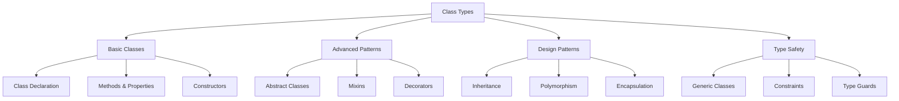

# TypeScript 类类型架构设计

## 🎯 类类型系统概览

### 📊 类架构分类



## 🔧 基础类类型设计

### 💡 类的类型注解

```typescript
// 1. 基础类定义
class User {
    // 属性类型注解
    id: string;
    name: string;
    email: string;
    private _age: number;
    protected role: 'user' | 'admin' = 'user';
    readonly createdAt: Date;
    
    // 构造函数类型
    constructor(id: string, name: string, email: string, age: number) {
        this.id = id;
        this.name = name;
        this.email = email;
        this._age = age;
        this.createdAt = new Date();
    }
    
    // 方法类型注解
    public getName(): string {
        return this.name;
    }
    
    public getAge(): number {
        return this._age;
    }
    
    private validateEmail(email: string): boolean {
        return /^[^\s@]+@[^\s@]+\.[^\s@]+$/.test(email);
    }
    
    protected updateEmail(newEmail: string): boolean {
        if (this.validateEmail(newEmail)) {
            this.email = newEmail;
            return true;
        }
        return false;
    }
}

// 2. 接口与类结合
interface Drawable {
    draw(): void;
    getArea(): number;
}

class Circle implements Drawable {
    constructor(private radius: number) {}
    
    draw(): void {
        console.log(`Drawing circle with radius ${this.radius}`);
    }
    
    getArea(): number {
        return Math.PI * this.radius * this.radius;
    }
}

// 3. 抽象类设计
abstract class Shape {
    protected constructor(
        protected readonly id: string,
        protected readonly position: { x: number; y: number }
    ) {}
    
    // 抽象方法，子类必须实现
    abstract getArea(): number;
    abstract getPerimeter(): number;
    
    // 具体方法
    public getId(): string {
        return this.id;
    }
    
    public getPosition(): { x: number; y: number } {
        return { ...this.position };
    }
    
    // 抽象方法的默认实现
    public describe(): string {
        return `Shape ${this.id} at position (${this.position.x}, ${this.position.y})`;
    }
}

class Rectangle extends Shape {
    constructor(
        id: string,
        position: { x: number; y: number },
        private width: number,
        private height: number
    ) {
        super(id, position);
    }
    
    getArea(): number {
        return this.width * this.height;
    }
    
    getPerimeter(): number {
        return 2 * (this.width + this.height);
    }
    
    // 重写父类方法
    public describe(): string {
        return `${super.describe()} - Rectangle ${this.width}x${this.height}`;
    }
}
```

### 🎪 泛型类设计

```typescript
// 1. 基础泛型类
class Repository<T> {
    private items: Map<string, T> = new Map();
    
    constructor(private itemType?: new (...args: any[]) => T) {}
    
    save(id: string, item: T): void {
        this.items.set(id, item);
    }
    
    findById(id: string): T | undefined {
        return this.items.get(id);
    }
    
    findAll(): T[] {
        return Array.from(this.items.values());
    }
    
    delete(id: string): boolean {
        return this.items.delete(id);
    }
    
    // 泛型约束方法
    createNew<UserData>(data: UserData): T {
        if (this.itemType) {
            return new this.itemType(data);
        }
        throw new Error('No item type specified');
    }
}

// 使用泛型类
const userRepo = new Repository<User>();
userRepo.save('1', new User('1', 'Alice', 'alice@example.com', 25));

// 2. 泛型约束类
interface Identifiable {
    id: string;
}

class DatabaseRepository<T extends Identifiable> {
    private items: T[] = [];
    
    create(item: Omit<T, 'id'>): T {
        const newItem = {
            ...item,
            id: crypto.randomUUID()
        } as T;
        
        this.items.push(newItem);
        return newItem;
    }
    
    update(id: string, updates: Partial<T>): T | null {
        const index = this.items.findIndex(item => item.id === id);
        
        if (index === -1) {
            return null;
        }
        
        this.items[index] = { ...this.items[index], ...updates };
        return this.items[index];
    }
    
    delete(id: string): boolean {
        const index = this.items.findIndex(item => item.id === id);
        
        if (index !== -1) {
            this.items.splice(index, 1);
            return true;
        }
        
        return false;
    }
    
    findById(id: string): T | null {
        return this.items.find(item => item.id === id) || null;
    }
}

// 3. 高级泛型模式
class EventEmitter<TEventMap extends Record<string, any>> {
    private listeners: Map<keyof TEventMap, Array<(...args: any[]) => void>> = new Map();
    
    on<EventType extends keyof TEventMap>(
        event: EventType,
        listener: (...args: TEventMap[EventType] extends Array<infer U> ? TEventMap[EventType] : never) => void
    ): void {
        if (!this.listeners.has(event)) {
            this.listeners.set(event, []);
        }
        this.listeners.get(event)!.push(listener);
    }
    
    emit<EventType extends keyof TEventMap>(
        event: EventType,
        ...args: TEventMap[EventType] extends Array<infer U> ? TEventMap[EventType] : never
    ): void {
        const eventListeners = this.listeners.get(event);
        if (eventListeners) {
            eventListeners.forEach(listener => listener(...args));
        }
    }
    
    off<EventType extends keyof TEventMap>(event: EventType, listener?: Function): void {
        if (!listener) {
            this.listeners.delete(event);
        } else {
            const eventListeners = this.listeners.get(event);
            if (eventListeners) {
                const index = eventListeners.indexOf(listener);
                if (index !== -1) {
                    eventListeners.splice(index, 1);
                }
            }
        }
    }
}

// 定义事件映射
interface MyEventMap {
    'user:created': [User];
    'user:updated': [string, Partial<User>];
    'error': [Error];
}

class UserService extends EventEmitter<MyEventMap> {
    private userRepository = new Repository<User>();
    
    createUser(userData: Omit<User, 'id'>): User {
        const user = new User(
            crypto.randomUUID(),
            userData.name,
            userData.email,
            userData.age
        );
        
        this.userRepository.save(user.id, user);
        this.emit('user:created', user);
        
        return user;
    }
    
    updateUser(id: string, updates: Partial<User>): boolean {
        const user = this.userRepository.findById(id);
        
        if (!user) {
            this.emit('error', new Error(`User ${id} not found`));
            return false;
        }
        
        Object.assign(user, updates);
        this.userRepository.save(id, user);
        this.emit('user:updated', id, updates);
        
        return true;
    }
}
```

## 🚀 高级类模式

### 🔄 装饰器与元数据

```typescript
// 1. 类装饰器
function Sealed(target: Function): void {
    Object.seal(target);
    Object.seal(target.prototype);
}

function Inject(dependencies: string[]) {
    return function<T extends { new(...args: any[]): {} }>(constructor: T) {
        return class extends constructor {
            constructor(...args: any[]) {
                const injectedArgs = [
                    ...args,
                    ...dependencies.map(dep => Container.resolve(dep))
                ];
                super(...injectedArgs);
            }
        };
    };
}

function ApiController(basePath: string) {
    return function<T extends { new(...args: any[]): {} }>(Constructor: T) {
        Reflect.defineMetadata('basePath', basePath, Constructor);
        return Constructor;
    };
}

// 2. 属性装饰器
function Required(target: any, propertyKey: string): void {
    Reflect.defineMetadata('required', true, target, propertyKey);
}

function MinLength(length: number) {
    return function(target: any, propertyKey: string): void {
        Reflect.defineMetadata('minLength', length, target, propertyKey);
    };
}

function Email(target: any, propertyKey: string): void {
    Reflect.defineMetadata('email', true, target, propertyKey);
}

// 3. 方法装饰器
function Log(target: any, propertyKey: string, descriptor: PropertyDescriptor): PropertyDescriptor {
    const originalMethod = descriptor.value;
    
    descriptor.value = function(...args: any[]) {
        console.log(`Calling ${propertyKey} with args:`, args);
        const result = originalMethod.apply(this, args);
        console.log(`Method ${propertyKey} returned:`, result);
        return result;
    };
    
    return descriptor;
}

function Throttle(delay: number) {
    return function(target: any, propertyKey: string, descriptor: PropertyDescriptor): PropertyDescriptor {
        let lastCallTime = 0;
        const originalMethod = descriptor.value;
        
        descriptor.value = function(...args: any[]) {
            const now = Date.now();
            
            if (now - lastCallTime >= delay) {
                lastCallTime = now;
                return originalMethod.apply(this, args);
            }
            
            console.log(`Method ${propertyKey} throttled`);
        };
        
        return descriptor;
    };
}

// 4. 应用装饰器
@Sealed
@ApiController('/api/users')
export class UserController {
    @Required
    @MinLength(2)
    name: string;
    
    @Required
    @Email
    email: string;
    
    constructor(
        @Inject(['UserRepository']) private userRepository: Repository<User>
    ) {
        this.name = '';
        this.email = '';
    }
    
    @Log
    @Throttle(1000)
    createUser(userData: Partial<User>): User {
        if (!this.validateUserData(userData)) {
            throw new Error('Invalid user data');
        }
        
        const user = new User(
            crypto.randomUUID(),
            userData.name!,
            userData.email!,
            userData.age || 0
        );
        
        this.userRepository.save(user.id, user);
        return user;
    }
    
    private validateUserData(userData: Partial<User>): boolean {
        // 运行时验证逻辑
        return !!(userData.name && userData.email);
    }
}

// 5. 简单的依赖注入容器
class Container {
    private static instances: Map<string, any> = new Map();
    
    static register<T>(key: string, implementation: T): void {
        this.instances.set(key, implementation);
    }
    
    static resolve<T>(key: string): T {
        const instance = this.instances.get(key);
        if (!instance) {
            throw new Error(`No implementation registered for ${key}`);
        }
        return instance;
    }
}
```

## 🎭 设计模式实现

### 🏗️ 工厂模式

```typescript
// 1. 抽象工厂
interface GUIFactory {
    createButton(): Button;
    createDialog(): Dialog;
}

interface Button {
    render(): string;
    onClick(handler: () => void): void;
}

interface Dialog {
    render(): string;
    show(): void;
}

// 具体工厂实现
class WindowsGUIFactory implements GUIFactory {
    createButton(): Button {
        return new WindowsButton();
    }
    
    createDialog(): Dialog {
        return new WindowsDialog();
    }
}

class MacGUIFactory implements GUIFactory {
    createButton(): Button {
        return new MacButton();
    }
    
    createDialog(): Dialog {
        return new MacDialog();
    }
}

// 具体产品
class WindowsButton implements Button {
    render(): string {
        return '<windows-button>Click me</windows-button>';
    }
    
    onClick(handler: () => void): void {
        console.log('Windows button clicked');
        handler();
    }
}

class MacButton implements Button {
    render(): string {
        return '<mac-button>Click me</mac-button>';
    }
    
    onClick(handler: () => void): void {
        console.log('Mac button clicked');
        handler();
    }
}

class WindowsDialog implements Dialog {
    render(): string {
        return '<windows-dialog>Windows Dialog</windows-dialog>';
    }
    
    show(): void {
        console.log('Windows dialog shown');
    }
}

class MacDialog implements Dialog {
    render(): string {
        return '<mac-dialog>Mac Dialog</mac-dialog>';
    }
    
    show(): void {
        console.log('Mac dialog shown');
    }
}

// 工厂管理器
class GUIFactoryManager {
    private static factories: Map<string, new() => GUIFactory> = new Map();
    
    static registerFactory(platform: string, factoryClass: new() => GUIFactory): void {
        this.factories.set(platform, factoryClass);
    }
    
    static createFactory(platform: string): GUIFactory {
        const FactoryClass = this.factories.get(platform);
        if (!FactoryClass) {
            throw new Error(`No factory registered for platform: ${platform}`);
        }
        return new FactoryClass();
    }
}
```

### 🔄 观察者模式

```typescript
// 1. 观察者接口
interface Observer<T> {
    update(data: T): void;
}

interface Subject<T> {
 observe(observer: Observer<T>): void;
    unsubscribe(observer: Observer<T>): void;
    notify(data: T): void;
}

// 2. 具体实现
class NewsPublisher implements Subject<string> {
    private observers: Observer<string>[] = [];
    private news: string[] = [];
    
    subscribe(observer: Observer<string>): void {
        if (!this.observers.includes(observer)) {
            this.observers.push(observer);
        }
    }
    
    unsubscribe(observer: Observer<string>): void {
        const index = this.observers.indexOf(observer);
        if (index !== -1) {
            this.observers.splice(index, 1);
        }
    }
    
    notify(data: string): void {
        this.observers.forEach(observer => observer.update(data));
    }
    
    publishNews(news: string): void {
        this.news.push(news);
        this.notify(news);
    }
    
    getLatestNews(): string[] {
        return [...this.news];
    }
}

class NewsSubscriber implements Observer<string> {
    constructor(private name: string) {}
    
    update(news: string): void {
        console.log(`${this.name} received news: ${news}`);
    }
}

// 3. 泛型观察者模式
class GenericSubject<T> {
    private observers: Map<symbol, Observer<T>> = new Map();
    
    subscribe(observer: Observer<T>): symbol {
        const id = Symbol();
        this.observers.set(id, observer);
        return id;
    }
    
    unsubscribe(id: symbol): boolean {
        return this.observers.delete(id);
    }
    
    notify(data: T): void {
        this.observers.forEach(observer => observer.update(data));
    }
}
```

## 📚 类类型最佳实践

### 🎯 设计原则

```typescript
// 1. 单一职责原则
class UserValidator {
    static validateEmail(email: string): boolean {
        return /^[^\s@]+@[^\s@]+\.[^\s@]+$/.test(email);
    }
    
    static validatePassword(password: string): boolean {
        return password.length >= 8 && /[A-Z]/.test(password);
    }
    
    static validateAge(age: number): boolean {
        return age >= 0 && age <= 150;
    }
}

class EmailSender {
    constructor(private smtpConfig: SMTPConfig) {}
    
    send(to: string, subject: string, body: string): Promise<boolean> {
        // 邮件发送逻辑
        return Promise.resolve(true);
    }
}

// 2. 里氏替换原则
abstract class Bird {
    fly(): void {
        console.log('Bird is flying');
    }
    
    eat(): void {
        console.log('Bird is eating');
    }
}

class FlyingBird extends Bird {
    // FlyingBird 可以替换 Bird
}

class Penguin extends Bird {
    fly(): void {
        throw new Error('Penguins cannot fly');
    }
    
    swim(): void {
        console.log('Penguin is swimming');
    }
}

// 3. 依赖倒置原则
interface DatabaseService {
    save<T>(entity: T): Promise<T>;
    update<T>(id: string, entity: Partial<T>): Promise<T>;
    delete(id: string): Promise<boolean>;
}

class PostgreSQLService implements DatabaseService {
    async save<T>(entity: T): Promise<T> {
        // PostgreSQL 实现
        return entity;
    }
    
    async update<T>(id: string, entity: Partial<T>): Promise<T> {
        // PostgreSQL 更新实现
        return entity as T;
    }
    
    async delete(id: string): Promise<boolean> {
        // PostgreSQL 删除实现
        return true;
    }
}

class ServiceManager {
    constructor(private databaseService: DatabaseService) {}
    
    async createEntity<T>(entity: T): Promise<T> {
        return await this.databaseService.save(entity);
    }
}
```

### ⚡ 性能优化

```typescript
// 1. 懒加载单例
class Singleton {
    private static instance: Singleton;
    private static lazyInstance: Singleton | null = null;
    
    private constructor() {}
    
    static getInstance(): Singleton {
        if (!this.instance) {
            this.instance = new Singleton();
        }
        return this.instance;
    }
    
    // 懒加载实现
    static getLazyInstance(): Singleton {
        if (!this.lazyInstance) {
            this.lazyInstance = new Singleton();
        }
        return this.lazyInstance;
    }
}

// 2. 对象池模式
class ObjectPool<T extends { reset(): void }> {
    private pool: T[] = [];
    private createFn: () => T;
    
    constructor(createFn: () => T, initialSize: number = 10) {
        this.createFn = createFn;
        
        // 预创建对象
        for (let i = 0; i < initialSize; i++) {
            this.pool.push(this.createFn());
        }
    }
    
    acquire(): T {
        if (this.pool.length > 0) {
                return this.pool.pop()!;
        }
        
        return this.createFn();
    }
    
    release(obj: T): void {
        obj.reset();
        this.pool.push(obj);
    }
}

// 3. 内存管理
class CircularBuffer<T> {
    private buffer: T[];
    private head: number = 0;
    private tail: number = 0;
    private size: number = 0;
    
    constructor(private capacity: number) {
        this.buffer = new Array(capacity);
    }
    
    enqueue(item: T): void {
        if (this.size === this.capacity) {
            this.tail = (this.tail + 1) % this.capacity;
        } else {
            this.size++;
        }
        
        this.buffer[this.head] = item;
        this.head = (this.head + 1) % this.capacity;
    }
    
    dequeue(): T | undefined {
        if (this.size === 0) {
            return undefined;
        }
        
        const item = this.buffer[this.tail];
        this.tail = (this.tail + 1) % this.capacity;
        this.size--;
        
        return item;
    }
    
    isEmpty(): boolean {
        return this.size === 0;
    }
    
    isFull(): boolean {
        return this.size === this.capacity;
    }
}
```

### 🔗 相关深入学习

- [[03-Decorators装饰器系统]] - 装饰器模式详解
- [[02-Object-Types设计模式]] - 对象类型设计
- [[01-Type-System入门]] - 类型系统基础

---
*💡 掌握类类型架构设计是构建大型TypeScript应用的基础，良好的类设计能大大提高代码的可维护性和扩展性*
