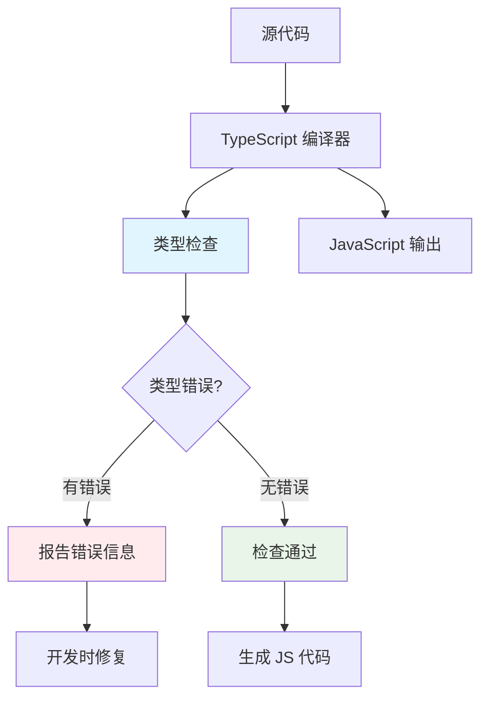
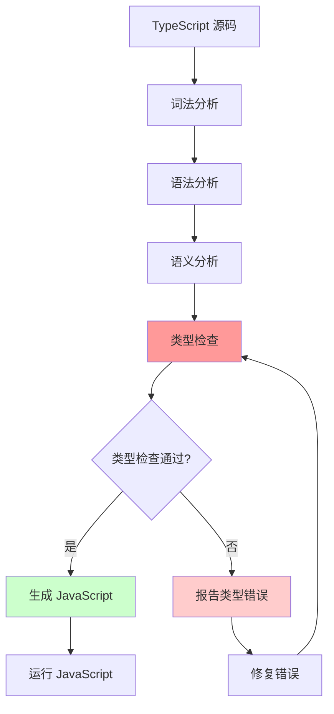
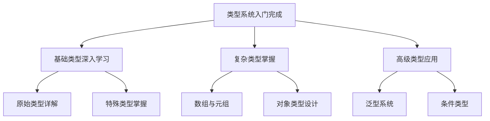

# TypeScript 类型系统入门

## 🎯 什么是类型系统

### 💡 基础概念认知

> **类型系统**：一套规则和机制，用于在编译时检查程序中的类型使用是否正确，防止常见的编程错误。



### 🔍 类型系统的核心价值

| 功能 | 描述 | 实际效果 |
|------|------|----------|
| **编译时检查** | 运行前发现错误 | 减少 80%+ 运行时错误 |
| **代码文档化** | 类型即文档 | 减少注释需求，提高可读性 |
| **智能辅助** | IDE 精确提示 | 提升开发效率 300%+ |
| **重构支持** | 类型保证重构安全 | 大型项目重构必备 |

## 🏗️ TypeScript 类型系统架构

### 📊 类型系统层级结构

```typescript
// TypeScript 类型系统层次
interface TypeSystemHierarchy {
    // Level 1: 原始类型 (Primitive Types)
    primitives: {
        string: string;
        number: number;
        boolean: boolean;
        null: null;
        undefined: undefined;
        symbol: symbol;
        bigint: bigint;
    };
    
    // Level 2: 字面量类型 (Literal Types)  
    literals: {
        stringLiteral: "hello";
        numberLiteral: 42;
        booleanLiteral: true;
    };
    
    // Level 3: 组合类型 (Composite Types)
    composite: {
        any: any;              // 顶级类型
        unknown: unknown;       // 类型安全的 any
        object: object;        // 对象基础类型
        array: string[];       // 数组类型
        tuple: [string, number]; // 元组类型
    };
    
    // Level 4: 抽象类型 (Abstract Types)
    abstract: {
        never: never;          // 底部类型
        void: void;           // 无返回值
        Function: Function;    // 函数基础类型
    };
}
```

### 🎯 类型推理机制

```typescript
// TypeScript 类型推理演示
function demonstrateInference() {
    // 1. 基础推理
    let name = "Alice";              // 推理为: string
    let age = 25;                    // 推理为: number  
    let isActive = true;             // 推理为: boolean
    
    // 2. 函数参数推理
    function greet(name: string) {   // 明确注解
        return `Hello, ${name}`;     // 推理返回: string
    }
    
    // 3. 上下文推理
    const users = ["Alice", "Bob"];  // 推理为: string[]
    
    // 4. 复杂推理
    const config = {                 // 推理为: { apiUrl: string; timeout: number; retries: number }
        apiUrl: "http://api.example.com",
        timeout: 5000,
        retries: 3
    };
    
    console.log("类型推理演示完成");
}
```

## 🔤 类型注解与类型推断

### 📝 类型注解的使用场景

```typescript
// 需要显式类型注解的场景
interface ExplicitAnnotationExamples {
    // 1. 函数参数 (通常需要)
    calculateTax(income: number): number;
    
    // 2. 复杂返回值 (推荐)
    parseUserData(json: string): { name: string; email: string };
    
    // 3. 明确接口实现 (必须)
    processOrder(order: Order): Promise<OrderResult>;
    
    // 4. 类型安全的 any (推荐)
    handleUnknownData(data: unknown): string;
    
    // 5. 泛型约束 (必须)
    findUserById<T extends User>(id: number): T | null;
}

// 可以不使用类型注解的场景
function inferenceExamples() {
    // ✅ 简单的变量初始化
    const name = "Alice";           // 自动推断: string
    const count = 42;              // 自动推断: number
    const items = ["a", "b"];      // 自动推断: string[]
    
    // ✅ 简单的函数返回值
    function getName() {
        return "Alice";             // 自动推断返回: string
    }
    
    // ✅ 基于上下文的推断
    const users = [{ name: "Alice" }, { name: "Bob" }];
    // 自动推断: { name: string }[]
}
```

### 🎪 类型推论的艺术

| 推理类型 | 触发条件 | 示例 | 推理结果 |
|----------|----------|------|----------|
| **字面量推理** | 常量声明 | `const color = "red"` | `"red"` |
| **数组推理** | 数组初始化 | `[1, 2, 3]` | `number[]` |
| **对象推理** | 对象字面量 | `{a: 1}` | `{a: number}` |
| **函数推理** | 函数表达式 | `() => 42` | `() => number` |
| **上下文推理** | 函数参数 | `.map(x => x.name)` | 根据上下文 |

## 🛡️ 类型安全与类型检查

### ✅ TypeScript 类型检查流程



### 🔍 常见类型检查错误

```typescript
// TypeScript 类型检查错误演示
function demonstrateTypeErrors() {
    // ❌ 错误类型 1: 类型不匹配
    // let message: string = 123;
    // Error: Type 'number' is not assignable to type 'string'
    
    // ❌ 错误类型 2: 未定义的属性
    interface User {
        name: string;
        age: number;
    }
    
    const user: User = {
        name: "Alice",
        age: 25,
        // email: "alice@example.com",  // ❌ 额外的属性
        // 错误: Object literal may only specify known properties
    };
    
    // ❌ 错误类型 3: 缺少必需属性
    // const incompleteUser: User = {
    //     name: "Bob"
    //     // 缺少 age 属性
    // };
    
    // ❌ 错误类型 4: 错误的函数参数
    function greet(name: string): string {
        return `Hello, ${name}`;
    }
    
    // greet(123);  // ❌ 参数类型错误
    
    // ❌ 错误类型 5: null/undefined 错误
    interface ApiResponse {
        data: string;
    }
    
    function processResponse(response: ApiResponse | null): string {
        // return response.data.toUpperCase();  // ❌ 可能的空值
    
        // ✅ 正确的空值处理
        if (response === null) {
            throw new Error("Response is null");
        }
        return response.data.toUpperCase();  // 现在类型安全
    }
}
```

## 🔧 实用类型操作

### 🛠️ 基础类型操作技术

```typescript
// 实用的类型操作技术
namespace TypeOperations {
    
    // 1. 联合类型 (Union Types)
    type StringOrNumber = string | number;
    type Status = 'idle' | 'loading' | 'success' | 'error';
    
    function handleValue(value: StringOrNumber) {
        if (typeof value === 'string') {
            return value.toUpperCase();  // TypeScript 知道这里 value 是 string
        } else {
            return value.toFixed(2);     // TypeScript 知道这里 value 是 number
        }
    }
    
    // 2. 交集类型 (Intersection Types)
    interface Person {
        name: string;
        age: number;
    }
    
    interface Employee {
        id: number;
        department: string;
    }
    
    type Staff = Person & Employee;  // 必须同时满足 Person 和 Employee
    
    const staff: Staff = {
        name: "Alice",
        age: 30,
        id: 1,
        department: "Engineering"
    };
    
    // 3. 可选属性与必需属性
    interface Config {
        apiUrl: string;           // 必需
        timeout?: number;         // 可选
        retries?: number;         // 可选
    }
    
    // 4. 只读属性
    interface ReadOnlyData {
        readonly id: number;
        readonly createdAt: Date;
        name: string;              // 可修改
    }
    
    // 5. 索引签名
    interface Dictionary {
        [key: string]: any;       // 字符串索引
    }
    
    interface NumberMap {
        [key: number]: string;    // 数字索引
    }
}
```

## 🎪 类型系统最佳实践

### 💡 实用开发技巧

#### 📝 技巧 1: 渐进式类型采用

```typescript
// 阶段1: 基础类型注解
function stage1Process(data: any) {
    return data.map((item: any) => item.name);
}

// 阶段2: 添加接口定义
interface DataItem {
    name: string;
    value: number;
}

function stage2Process(data: DataItem[]) {
    return data.map((item: DataItem) => item.name);
}

// 阶段3: 精确类型定义
interface ProcessedData {
    names: string[];
    totalCount: number;
}

function stage3Process(data: DataItem[]): ProcessedData {
    return {
        names: data.map(item => item.name),
        totalCount: data.length
    };
}
```

#### 📝 技巧 2: 错误处理类型化

```typescript
// 类型安全的错误处理
interface Result<T, E = string> {
    success: true;
    data: T;
} | {
    success: false;
    error: E;
}

function divide(a: number, b: number): Result<number> {
    if (b === 0) {
        return { success: false, error: "Division by zero" };
    }
    return { success: true, data: a / b };
}

function handleOperation() {
    const result = divide(10, 0);
    
    if (result.success) {
        console.log(`Result: ${result.data}`);  // TypeScript 知道这里是 number
    } else {
        console.error(`Error: ${result.error}`); // TypeScript 知道这里是 string
    }
}
```

### 📊 类型系统理解层次

| 理解层次 | 技能要求 | 典型应用 | 进阶挑战 |
|----------|----------|----------|----------|
| **入门级** | 基础类型注解 | 简单项目类型标注 | 掌握 any 类型使用场景 |
| **进阶级** | 接口设计能力 | 复杂数据结构建模 | 高级类型组合技巧 |
| **专家级** | 泛型系统精通 | 类型库设计与优化 | 条件类型与映射类型 |

## 🎯 学习路径规划

### 🚀 下一步学习重点



### 🔗 相关深入学习

- [[02-Primitive-Types完全指南]] - 基础类型深度解析
- [[03-Type-Inference揭秘]] - 类型推断机制剖析
- [[04-Type-vs-Interface深度对比]] - 类型与接口选择策略

## 🧪 实践验证

### 💪 即时练习

```typescript
// exercises.ts
// 练习1: 设计一个博客文章的类型
interface BlogPost {
    readonly id: string;
    title: string;
    content: string;
    author: {
        name: string;
        email?: string;
    };
    publishedAt: Date;
    tags: string[];
    isPublished: boolean;
}

// 练习2: 创建一个类型安全的 API 响应处理器
interface ApiResponse<T> {
    success: boolean;
    data?: T;
    error?: string;
    timestamp: Date;
}

function handleApiResponse<T>(response: ApiResponse<T>, onSuccess: (data: T) => void, onError: (error: string) => void): void {
    if (response.success && response.data) {
        onSuccess(response.data);
    } else if (!response.success && response.error) {
        onError(response.error);
    } else {
        onError("Unknown error occurred");
    }
}

// 练习3: 使用类型系统确保数据安全
type UserRole = 'admin' | 'user' | 'guest';

interface User {
    id: number;
    name: string;
    role: UserRole;
    permissions: string[];
}

function checkPermission(user: User, requiredPermission: string): boolean {
    return user.permissions.includes(requiredPermission);
}

console.log("TypeScript 类型系统入门练习完成! 🎉");
```

---
*💡 类型系统是 TypeScript 的核心，掌握了类型系统就等于掌握了 TypeScript 的一半精髓*
