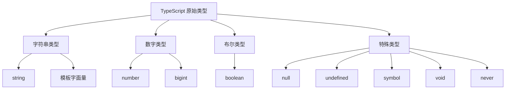

# TypeScript 原始类型完全指南

## 🎯 原始类型总览

### 📊 TypeScript 原始类型体系



## 📝 string - 字符串类型

### 🎪 基础字符串类型

```typescript
// 基础字符串使用
let firstName: string = "John";
let lastName: string = 'Doe';
let fullName: string = `Mr. ${firstName} ${lastName}`;

// 字符串模板 - ES6+ 特性
const title: string = "开发工程师";
const intro: string = `
欢迎 ${fullName}！
职位：${title}
入职时间：${new Date().getFullYear()}
`;
```

### 🔤 字面量字符串类型

```typescript
// 字面量类型限制值范围
type Theme = "light" | "dark" | "auto";
type Status = "pending" | "approved" | "rejected";

const currentTheme: Theme = "light";
const userStatus: Status = "pending";

// 实际应用示例
interface ApiEndpoint {
    url: string;
    method: "GET" | "POST" | "PUT" | "DELETE";
}

const endpoints: ApiEndpoint[] = [
    { url: "/api/users", method: "GET" },
    { url: "/api/users", method: "POST" }
];
```

## 🔢 number - 数字类型

### 📊 数字类型详解

```typescript
// TypeScript 数字类型包含所有数值
let decimal: number = 6;           // 十进制
let hex: number = 0xf00d;          // 十六进制
let binary: number = 0b1010;       // 二进制
let octal: number = 0o744;         // 八进制

// 浮点数
let pi: number = 3.14159;
let scientific: number = 2.14e-5;

// 字面量数字类型
type DiceRoll = 1 | 2 | 3 | 4 | 5 | 6;
type HttpStatusCode = 200 | 404 | 500;

const roll: DiceRoll = 4;
const responseCode: HttpStatusCode = 200;
```

### 💡 数字类型最佳实践

```typescript
// 精确的数值类型定义
interface Money {
    amount: number;      // 金额
    currency: "USD" | "EUR" | "CNY";
    precision: number;   // 小数位数
}

// 安全的数学运算
function safeDivide(a: number, b: number): number | null {
    if (b === 0) {
        return null;
    }
    return a / b;
}

// 数字验证工具
function isValidAge(age: any): age is number {
    return typeof age === 'number' && age > 0 && age < 150;
}
```

## ✅ boolean - 布尔类型

### 🎯 布尔类型深度使用

```typescript
// 基础布尔类型
let isLoggedIn: boolean = true;
let hasPermission: boolean = false;

// 布尔字面量类型
type LoadingState = true | false;
type ToggleState = boolean;

// 布尔值在实际应用中的使用
interface User {
    isActive: boolean;
    isEmailVerified: boolean;
    isPremium: boolean;
}

function canAccess(user: User, feature: string): boolean {
    if (feature === 'premium') {
        return user.isActive && user.isPremium;
    }
    return user.isActive && user.isEmailVerified;
}

// 类型守卫函数
function isString(value: unknown): value is string {
    return typeof value === 'string';
}

function isNumber(value: unknown): value is number {
    return typeof value === 'number' && !isNaN(value);
}
```

## 🏗️ bigint - 大整数类型

### 💾 BigInt 使用场景

```typescript
// BigInt 字面量
let bigNumber: bigint = 9007199254740991n;
let anotherBigInt: bigint = BigInt(9007199254740991);

// BigInt 运算
function calculateFactorial(n: number): bigint {
    let result = 1n;
    for (let i = 2n; i <= BigInt(n); i++) {
        result *= i;
    }
    return result;
}

// 实际应用：ID 生成器
class SnowflakeIDGenerator {
    private sequence: bigint = 0n;
    private timestamp: bigint = 0n;
    
    generate(): bigint {
        const now = BigInt(Date.now());
        if (now !== this.timestamp) {
            this.timestamp = now;
            this.sequence = 0n;
        }
        
        return (this.timestamp << 22n) | 
               (1n << 17n) | 
               (this.sequence++);
    }
}
```

## 🎭 symbol - 符号类型

### 🔒 Symbol 深度应用

```typescript
// Symbol 创建和使用
const userID = Symbol('userID');
const userName = Symbol('userName');

interface UserRecord {
    [userID]: number;
    [userName]: string;
    name: string;
}

const user: UserRecord = {
    [userID]: 1,
    [userName]: "admin_user",
    name: "John Doe"
};

// 内置 Symbol 使用
class Collection<T> {
    private items: T[] = [];
    
    [Symbol.iterator](): Iterator<T, any, undefined> {
        let index = 0;
        return {
            next: () => ({
                done: index >= this.items.length,
                value: this.items[index++]
            })
        };
    }
    
    add(item: T): void {
        this.items.push(item);
    }
}
```

## 🚫 null 和 undefined

### ⚡ 空值类型处理

```typescript
// null 和 undefined 的区别
let nullableValue: null = null;
let undefinedValue: undefined = undefined;

// 严格空值检查的使用
interface OptionalUser {
    name: string;
    email: string | null;      // 可以是 null
    phone?: string;            // 可选，默认 undefined
}

// 空值检查的类型守卫
function processUser(user: OptionalUser): string {
    // 检查 null
    if (user.email === null) {
        return "No email provided";
    }
    
    // 检查 undefined
    if (user.phone === undefined) {
        return "Phone number is optional";
    }
    
    return `User: ${user.name}`;
}

// 非空断言操作符
function getLength(text: string | null | undefined): number {
    // 告诉 TypeScript 这里不会是 null/undefined
    return text!.length;
}

// 可选链操作符
function getUserName(user: OptionalUser | null): string {
    // 安全的访问嵌套属性
    return user?.name ?? "Unknown User";
}
```

## 🚪 void - 无返回值

### 📋 void 类型使用场景

```typescript
// void 函数声明
function logMessage(message: string): void {
    console.log(message);
}

function showAlert(message: string): void {
    alert(message);
}

// void 在泛型中的应用
interface Callback<T> {
    (value: T): void;
}

function processArray<T>(items: T[], callback: Callback<T>): void {
    for (const item of items) {
        callback(item);
    }
}

// 实际应用
processArray([1, 2, 3], (num) => {
    console.log(`Number: ${num}`);
});
```

## ❌ never - 永不存在值

### 🔒 never 类型深度解析

```typescript
// never 类型的典型场景

// 1. 抛出异常的函数
function throwError(message: string): never {
    throw new Error(message);
}

// 2. 无限循环
function infiniteLoop(): never {
    while (true) {
        console.log("Infinite loop");
    }
}

// 3. 穷尽性检查
type Status = "pending" | "success" | "error";

function handleStatus(status: Status): string {
    switch (status) {
        case "pending":
            return "正在处理";
        case "success":
            return "处理成功";
        case "error":
            return "处理失败";
        default:
            // 如果没有 default，TypeScript 会检查是否所有情况都被覆盖
            const _exhaustiveCheck: never = status;
            return _exhaustiveCheck;
    }
}

// 4. 过滤类型
type NonNullable<T> = T extends null | undefined ? never : T;

type StringOrNumber = string | number | null | undefined;
type OnlyStringOrNumber = NonNullable<StringOrNumber>; // string | number
```

## 🎪 特殊类型实用技巧

### 💡 类型组合与约束

```typescript
// 1. 联合类型的原始类型组合
type StringOrNumber = string | number;
type ValidJSONType = string | number | boolean | null;

// 2. 原始类型的类型守卫
function isPrimitive(value: unknown): value is string | number | boolean | symbol | null | undefined {
    return (typeof value === 'string' ||
            typeof value === 'number' ||
            typeof value === 'boolean' ||
            typeof value === 'symbol' ||
            value === null ||
            value === undefined);
}

// 3. 字面量类型的约束
interface Config {
    readonly environment: "development" | "staging" | "production";
    readonly debug: boolean;
    readonly logLevel: "error" | "warn" | "info" | "debug";
}

const config: Config = {
    environment: "development",
    debug: true,
    logLevel: "debug"
};
```

### 🔧 工具类型应用

```typescript
// 基于原始类型的工具类型
type StringKeys<T> = {
    [K in keyof T]: T[K] extends string ? K : never;
}[keyof T];

interface User {
    id: number;
    name: string;
    email: string;
    age: number;
}

type UserStringKeys = StringKeys<User>; // "name" | "email"

// 数值验证工具
type IsWholeNumber<T extends number> = `${T}` extends `${number}` ? true : false;

// 安全的数学运算
type SafeAdd<T1 extends number, T2 extends number> = T1 extends number
    ? T2 extends number
        ? `${T1}` extends `${bigint}` & `${T2}` extends `${bigint}`
            ? T1 & T2 extends never ? never : number
            : never
        : never
    : never;
```

## 🧪 实践练习题

### 💪 即时练习

```typescript
// exercises.ts

// 练习1: 设计一个用户状态系统
type UserStatus = "active" | "inactive" | "banned" | "pending";
type UserRole = "admin" | "moderator" | "user" | "guest";

interface SystemUser {
    id: bigint;
    username: string;
    email: string | null;
    status: UserStatus;
    role: UserRole;
    createdAt: number;
    isVerified: boolean;
}

// 练习2: 创建一个安全的验证函数
function validateUser(user: unknown): user is SystemUser {
    if (typeof user !== 'object' || user === null) {
        return false;
    }
    
    const candidate = user as any;
    
    return (
        typeof candidate.id === 'bigint' &&
        typeof candidate.username === 'string' &&
        (candidate.email === null || typeof candidate.email === 'string') &&
        ['active', 'inactive', 'banned', 'pending'].includes(candidate.status) &&
        typeof candidate.createdAt === 'number' &&
        typeof candidate.isVerified === 'boolean'
    );
}

// 练习3: 实现一个计数器
class TypedCounter<T extends string | number> {
    private counts: Map<T, bigint> = new Map();
    
    increment(key: T, amount: bigint = 1n): void {
        const current = this.counts.get(key) || 0n;
        this.counts.set(key, current + amount);
    }
    
    get(key: T): bigint {
        return this.counts.get(key) || 0n;
    }
    
    getAll(): Array<[T, bigint]> {
        return Array.from(this.counts.entries());
    }
}

console.log("原始类型练习完成! 🎉");
```

## 📚 学习总结

### 🎯 原始类型掌握检查

| 类型 | 掌握程度 | 关键特点 | 应用场景 |
|------|----------|----------|----------|
| **string** | ⭐⭐⭐⭐⭐ | 文本数据处理 | API响应、用户输入、配置 |
| **number** | ⭐⭐⭐⭐⭐ | 数值计算 | 数学运算、统计、游戏分数 |
| **boolean** | ⭐⭐⭐⭐ | 条件判断 | 状态控制、权限验证 |
| **bigint** | ⭐⭐⭐ | 大整数处理 | ID生成、加密、财务运算 |
| **symbol** | ⭐⭐⭐ | 唯一标识 | 私有属性、元编程 |
| **null/undefined** | ⭐⭐⭐⭐ | 空值处理 | 可选数据、错误处理 |
| **void** | ⭐⭐⭐⭐ | 无返回值 | 事件处理、日志记录 |
| **never** | ⭐⭐⭐ | 永不存在的值 | 类型安全检查、异常处理 |

### 🔗 下一步学习路径

- [[03-Type-Inference揭秘]] - 深入理解类型推断
- [[01-Array-and-Tuple完全解析]] - 数组类型详细学习
- [[02-Object-Types设计模式]] - 对象类型设计

---
*💡 原始类型是TypeScript类型系统的基础，熟练掌握这些类型是后续学习复杂类型的前提*
