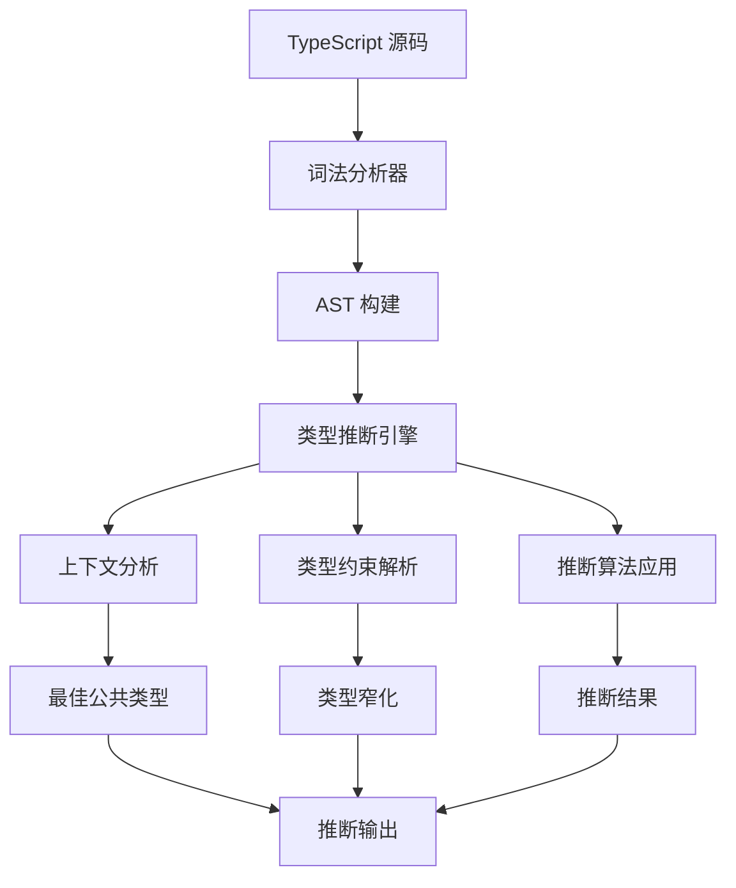

# TypeScript 类型推断揭秘

## 🎯 类型推断机制深度解析

### 📊 推断引擎工作原理



## 🔍 推断类型详解

### 💡 基础推断类型

```typescript
// 1. 左推断 (Left Inference)
let name = "TypeScript";  // 推断为 string
let count = 42;          // 推断为 number
let isActive = true;     // 推断为 boolean

// 2. 右推断 (Right Inference)
function greet(name) {  // 参数推断为 any
    return `Hello ${name}`;  // 返回值推断为 string
}

// 3. 上下文推断 (Contextual Inference)
document.addEventListener("click", e => {
    console.log(e.clientX);  // e 推断为 MouseEvent
});

// 4. 约束推断 (Constrained Inference)
function pickProperty<T, K extends keyof T>(obj: T, key: K): T[K] {
    return obj[key];  // 返回值推断为 T[K]
}
```

### 🎯 推断算法详解

```typescript
// 最佳公共类型推断
class Animal {
    move(): void {}
}
class Fish extends Animal {
    swim(): void {}
}
class Bird extends Animal {
    fly(): void {}
}

function moveAnimal(animal: Animal): void {
    animal.move();
}

const animals = [new Fish(), new Bird()];
// TypeScript 推断为: Animal[] 而不是 (Fish | Bird)[]
moveAnimal(animals[0]);  // ✅ 推断正确
```

## 🚀 高级推断技术

### 🎪 条件类型推断

```typescript
// Infer 关键字详解
type ReturnType<T> = T extends (...args: any[]) => infer R ? R : never;

type FunctionReturn = ReturnType<() => string>;  // string
type ArrayElement = ReturnType<() => number[]>;  // number[]

// 函数参数推断
type Parameters<T> = T extends (...args: infer P) => any ? P : never;

type MyParams = Parameters<(a: string, b: number) => void>;  // [string, number]

// 构造函数推断
type ConstructorParameters<T> = T extends new (...args: infer P) => any ? P : never;

class User {
    constructor(name: string, age: number) {}
}

type MyConstructorParams = ConstructorParameters<typeof User>;  // [string, number]
```

### 🔧 泛型推断高级技巧

```typescript
// 泛型推断的重载
function createElement<T extends string>(tag: T): HTMLElement;
function createElement<T extends HTMLInputElement>(tag: 'input', config?: Partial<T>): T;
function createElement(tag: string, config?: any): HTMLElement {
    return document.createElement(tag as any);
}

const div = createElement('div');        // HTMLElement
const input = createElement('input');   // HTMLInputElement

// 推断映射示例
type WithDefault<T, D> = T extends undefined ? D : T;

function getValue<T, D>(
    obj: Record<string, any>,
    key: string,
    defaultValue: D
): WithDefault<T, D> {
    const value = obj[key];
    return value !== undefined ? value : defaultValue;
}

const config = { port: 3000, host: 'localhost' };
const port = getValue(config, 'port', 8080);        // number
const debug = getValue(config, 'debug', false);    // boolean
const unknown = getValue(config, 'unknown', 'default'); // string
```

## 🎯 上下文推断深度应用

### 📱 React Hook 类型推断

```typescript
// useState 推断示例
function useState<S>(initialState: S | (() => S)): [S, (value: S) => void];

const [name, setName] = useState('');        // [string, Dispatch<SetStateAction<string>>]
const [count, setCount] = useState(0);      // [number, Dispatch<SetStateAction<number>>]
const [user, setUser] = useState<User | null>(null);  // [User | null, Dispatch<SetStateAction<User | null>>]

// useReducer 推断
function useReducer<R extends Reducer<any, any>, I>(
    reducer: R,
    initialState: I,
    initializer?: undefined
): [ReducerState<R>, Dispatch<ReducerAction<R>>];

type CounterReducer = Reducer<
    number,
    { type: 'increment' } | { type: 'decrement' } | { type: 'reset'; payload: number }
>;

const [state, dispatch] = useReducer(
    (state: number, action) => {
        switch (action.type) {
            case 'increment': return state + 1;
            case 'decrement': return state - 1;
            case 'reset': return action.payload;
            default: return state;
        }
    },
    0
);  // [number, Dispatch<Action>]
```

### 🔄 异步函数推断

```typescript
// Promise 类型推断
async function fetchData<T>(url: string): Promise<T> {
    const response = await fetch(url);
    return response.json();
}

const userData = await fetchData<User>('/api/user');     // User
const postsData = await fetchData<Post[]>('/api/posts'); // Post[]

// 错误处理中的推断
function safeParse<T>(json: string): T | Error {
    try {
        return JSON.parse(json);
    } catch (error) {
        return new Error('Parse failed');
    }
}

const result = safeParse<UserData>('{"id": 1}');
if (result instanceof Error) {
    // TypeScript 推断 result 为 Error
    console.error(result.message);
} else {
    // TypeScript 推断 result 为 UserData
    console.log(result.id);
}
```

## 🛡️ 类型窄化与推断

### 🎯 控制流分析

```typescript
function processValue(value: string | number | null) {
    // value: string | number | null
    
    if (value === null) {
        // TypeScript 推断: value 是 null
        return;
    }
    
    if (typeof value === 'string') {
        // TypeScript 推断: value 是 string
        console.log(value.toUpperCase());
    } else {
        // TypeScript 推断: value 是 number
        console.log(value.toFixed(2));
    }
}

// 用户定义类型保护
function isString(value: unknown): value is string {
    return typeof value === 'string';
}

function processUnknown(value: unknown) {
    if (isString(value)) {
        // TypeScript 推断: value 是 string
        console.log(value.split(' '));
    }
}
```

### 🔍 判别联合类型推断

```typescript
interface User {
    type: 'user';
    name: string;
    email: string;
}

interface Admin {
    type: 'admin';
    name: string;
    permissions: string[];
}

type Account = User | Admin;

function getAccountByType(account: Account): string {
    switch (account.type) {
        case 'user':
            // TypeScript 推断 account 为 User
            return `User: ${account.name} (${account.email})`;
        case 'admin':
            // TypeScript 推断 account 为 Admin
            return `Admin: ${account.name} - ${account.permissions.length} permissions`;
    }
}

// 智能推断与自动补全
function handleAccount(account: Account) {
    if (account.type === 'user') {
        // IDE 自动补全 account.email
        console.log(account.email);
    } else {
        // IDE 自动补全 account.permissions
        console.log(account.permissions);
    }
}
```

## 💡 推断优化技巧

### 🔧 提升推断质量

```typescript
// 1. 显式类型注解关键位置
interface ApiConfig {
    baseUrl: string;
    timeout: number;
}

function createApi(config: ApiConfig) {
    // 好的做法：明确返回类型
    return {
        get: <T>() => Promise<T>,
        post: <T>(data: any) => Promise<T>
    };
}

// 2. 利用 const assertions
const COLORS = ['red', 'green', 'blue'] as const;
type Color = typeof COLORS[number];  // 'red' | 'green' | 'blue'

// 3. 条件类型中的推断优化
type DeepRequired<T> = {
    [K in keyof T]-?: T[K] extends object ? DeepRequired<T[K]> : T[K];
};

// 4. 函数重载优化推断
function format(value: string): string;
function format(value: number): string;
function format(value: Date): string;
function format(value: string | number | Date): string {
    return String(value);
}

const formattedDate = format(new Date());   // string (推断正确)
```

### 🎪 高级推断模式

```typescript
// 品牌类型推断
type Brand<K, T> = K & { __brand: T };
type UserId = Brand<string, 'UserId'>;

const UserId = {
    create: (id: string): UserId => id as UserId,
    isValid: (value: unknown): value is UserId => 
        typeof value === 'string' && value.length > 0
};

// 推断工具类型
type InferPromiseType<T> = T extends Promise<infer U> ? U : T;
type Awaited<T> = T extends Promise<infer U> ? Awaited<U> : T;

// 实用性推断函数
function createValidator<T>() {
    return {
        forField: <K extends keyof T>(field: K) => ({
            required: () => field,
            custom: (validator: (value: T[K]) => boolean) => field
        })
    };
}

const userValidator = createValidator<{ name: string; age: number }>();
userValidator.forField('name').required();
userValidator.forField('age').custom(age => age > 0);
```

## 📚 推断陷阱与最佳实践

### ⚠️ 常见推断问题

```typescript
// 问题1: any 类型逃逸
function badFunction(param: any) {
    return param;  // 返回 any，丢失类型信息
}

// 问题2: 过度泛型
function overGeneric<T, U, V>(a: T, b: U, c: V): [T, U, V] {
    return [a, b, c];  // 过度复杂
}

// 问题3: 推断冲突
interface Conflicting {
    id: string | number;
    process: (id: string) => void;
    process: (id: number) => void;  // 重载冲突
}
```

### ✅ 推断最佳实践

```typescript
// 最佳实践1: 适度使用显式注解
interface UserService {
    findById(id: string): Promise<User>;
    create(user: Omit<User, 'id'>): Promise<User>;
}

// 最佳实践2: 合理的泛型边界
function processItems<T extends { id: string }>(items: T[]): Map<string, T> {
    return new Map(items.map(item => [item.id, item]));
}

// 最佳实践3: 推断友好的设计
function createState<T>() {
    return {
        data: null as T | null,
        loading: false,
        error: null as string | null,
        
        setData: (data: T) => data,
        setLoading: (loading: boolean) => loading,
        setError: (error: string) => error
    };
}

const userState = createState<User>();
// TypeScript 完美推断所有方法和属性类型
```

### 🔗 相关深入学习

- [[02-Primitive-Types完全指南]] - 基础类型推断
- [[01-Generics泛型精通]] - 泛型推断应用
- [[04-Mapped-Types工具类型库]] - 高级类型工具

---
*💡 掌握类型推断是充分发挥 TypeScript 能力的关键，它让代码更简洁、更安全、更智能*
