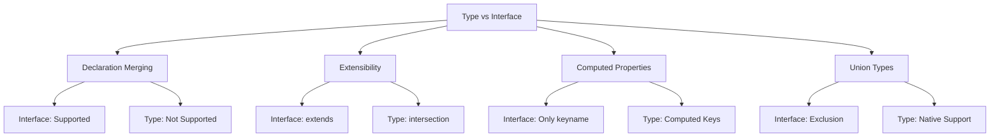

# TypeScript Type vs Interface 深度对比

## 🎯 Type 与 Interface 本质差异

### 📊 核心区别架构



## 🔧 基础语法对比

### 💡 声明方式差异

```typescript
// 1. Interface 定义
interface UserInterface {
    id: string;
    name: string;
    email: string;
    
    // 可选属性
    age?: number;
    
    // 只读属性
    readonly createdAt: Date;
    
    // 方法声明
    getFullInfo(): string;
}

// 2. Type 定义
type UserType = {
    id: string;
    name: string;
    email: string;
    
    // 可选属性
    age?: number;
    
    // 只读属性
    readonly createdAt: Date;
    
    // 方法声明
    getFullInfo(): string;
};

// 3. Interface 函数签名
interface MathOperations {
    add(a: number, b: number): number;
    multiply(a: number, b: number): number;
}

// 4. Type 函数签名
type MathOperationsType = {
    add(a: number, b: number): number;
    multiply(a: number, b: number): number;
};

// 5. Interface 索引签名
interface Dictionary {
    [key: string]: any;
    length: number;
}

// 6. Type 索引签名
type DictionaryType = {
    [key: string]: any;
    length: number;
};
```

### 🎪 声明合并能力

```typescript
// 1. Interface 声明合并
interface User {
    name: string;
}

interface User {
    age: number;
}

// 自动合并为:
// interface User {
//     name: string;
//     age: number;
// }

// 2. Interface 方法重载合并
interface ApiService {
    fetch(id: string): Promise<User>;
}

interface ApiService {
    fetch(ids: string[]): Promise<User[]>;
}

// 合并结果:
// interface ApiService {
//     fetch(id: string): Promise<User>;
//     fetch(ids: string[]): Promise<User[]>;
// }

// 3. Type 不支持声明合并
type UserType = {
    name: string;
};

// ❌ 错误：重复声明
// type UserType = {
//     age: number;
// };

// 4. Interface 命名空间合并
interface Configuration {
    api: string;
}

namespace Configuration {
    export interface Database {
        host: string;
    }
}

// 使用合并后的配置
const config: Configuration = {
    api: 'https://api.example.com'
};

const dbConfig: Configuration.Database = {
    host: 'localhost'
};
```

## 🚀 扩展性对比

### 🔄 继承与组合模式

```typescript
// 1. Interface 继承
interface BaseEntity {
    id: string;
    createdAt: Date;
}

interface User extends BaseEntity {
    name: string;
    email: string;
}

interface Product extends BaseEntity {
    title: string;
    price: number;
}

// 多继承
interface AdminUser extends User, BaseEntity {
    permissions: string[];
    lastLoginAt: Date;
}

// 2. Type 交叉类型 (类似继承)
interface User {
    name: string;
}

interface Age {
    age: number;
}

// Type 交叉
type UserWithAge = User & Age;

// 等价的 Interface 继承
interface UserWithAgeInterface extends User, Age {}

// 3. 条件组合
type ConditionalUser<T extends boolean> = T extends true
    ? User & { isActive: true; permissions: string[] }
    : User & { isActive: false };

// Interface 无法直接做到条件组合

// 4. 复杂的 Type 组合
type UserRole = 'admin' | 'user' | 'guest';

type AdminUser = {
    role: 'admin';
    permissions: string[];
    canDelete: boolean;
};

type RegularUser = {
    role: 'user';
    preferences: string[];
    lastLogin?: Date;
};

type GuestUser = {
    role: 'guest';
    expiresAt: Date;
};

type TypedUser = AdminUser | RegularUser | GuestUser;

// Interface 实现相同的效果
interface BaseUser {
    id: string;
    name: string;
}

interface Admin extends BaseUser {
    role: 'admin';
    permissions: string[];
    canDelete: boolean;
}

interface RegularUserInterface extends BaseUser {
    role: 'user';
    preferences: string[];
    lastLogin?: Date;
}

interface Guest extends BaseUser {
    role: 'guest';
    expiresAt: Date;
}

type TypedUserInterface = Admin | RegularUserInterface | Guest;
```

## 🎯 高级特性对比

### 🔍 计算属性和条件类型

```typescript
// 1. Type 支持计算属性
type DynamicKeys = 'name' | 'email' | 'phone';

type UserRecord = {
    [K in DynamicKeys]: string;
};

// 2. Interface 不支持计算属性
interface UserRecordInterface {
    // ❌ 错误：无法使用映射类型
    // [K in DynamicKeys]: string;
    
    name: string;
    email: string;
    phone: string;
}

// 3. Type 条件类型应用
type ApiResponse<T> = T extends string
    ? { message: T }
    : T extends number
        ? { status: T, data: any }
        : { result: T };

type StringResponse = ApiResponse<'success'>;      // { message: 'success' }
type NumberResponse = ApiResponse<200>;           // { status: 200, data: any }
type ObjectResponse = ApiResponse<{ id: number }>; // { result: { id: number } }

// 4. Interface 需要手动创建变体
interface StringApiResponse {
    message: string;
}

interface NumberApiResponse {
    status: number;
    data: any;
}

interface ObjectApiResponse {
    result: any;
}

// 5. Type 映射类型应用
type PartialUser<T> = {
    [K in keyof T]?: T[K];
};

type RequiredUser<T> = {
    [K in keyof T]-?: T[K];
};

// Interface 无法直接实现映射
interface PartialUserInterface<T> {
    // ❌ 无法使用 K in keyof T
}

// 6. Type 模板字面量类型
type EventName<T> = `on_${T}`;

type ClickEvent = EventName<'click'>;    // 'on_click'
type HoverEvent = EventName<'hover'>;   // 'on_hover'

// Interface 不支持
interface EventHandler<T> {
    // ❌ 无法使用模板字面量
    // handler: EventName<T>;
}
```

### 🔧 性能和使用场景

```typescript
// 1. Interface 性能优势
interface OptimizedUser {
    id: string;
    name: string;
    email: string;
}

// Interface 扩展快速
interface ExtendedUser extends OptimizedUser {
    preferences: UserPreferences;
}

// 2. Type 解析性能考虑
type UserState = 'loading' | 'success' | 'error';

type UserData = {
    status: UserState;
    data: UserState extends 'success' ? User : null;
};

// 复杂的类型需要更多编译时间
type ComplexType<T> = T extends infer U 
    ? U extends object 
        ? { [K in keyof U]: ComplexType<U[K]> }
        : U 
    : never;

// 3. 使用场景区分

// ✅ Interface 适用场景：
// - 对象形状定义
// - API 契约定义
// - 可扩展的库设计
// - 团队协作环境

interface DatabaseEntity {
    id: string;
    createdAt: Date;
    updatedAt: Date;
}

interface UserEntity extends DatabaseEntity {
    name: string;
    email: string;
}

// ✅ Type 适用场景：
// - 联合类型
// - 条件类型
// - 映射类型
// - 复杂类型计算
// - 类型工具函数

type PrimitiveTypes = string | number | boolean;

type PromiseResult<T> = T extends Promise<infer U> ? U : T;

type ExtractUserType<T> = T extends { user: infer U } ? U : never;

// 4. 实际项目中的混合使用

// Interface 用于基础结构
interface ApiEndpoint {
    path: string;
    method: string;
    handler: string;
}

interface UserService {
    createEndpoint(path: string): ApiEndpoint;
    getUsers(): Promise<User[]>;
}

// Type 用于复杂逻辑
type ApiMethod = 'GET' | 'POST' | 'PUT' | 'DELETE';

type DynamicEndpoint<T extends ApiMethod, P extends string> = {
    method: T;
    path: P;
    handler: `${LowerCase<T>}${Capitalize<P>}`;
};

type GetUsersEndpoint = DynamicEndpoint<'GET', 'users'>;
// { method: 'GET'; path: 'users'; handler: 'getUsers'; }
```

## 📚 最佳实践指南

### 🎯 选择原则

```typescript
// 1. Interface vs Type 选择决策树

// 场景1: 简单对象定义
interface SimpleUser {
    name: string;
    age: number;
}

// 场景2: 需要继承的对象
interface BaseModel {
    id: string;
}

interface Product extends BaseModel {
    title: string;
}

// 场景3: 联合类型
type Status = 'pending' | 'approved' | 'rejected';

// 场景4: 计算属性或映射
type Partial<T> = {
    [P in keyof T]?: T[P];
};

// 场景5: 条件类型
type IsArray<T> = T extends any[] ? true : false;

// 场景6: 函数重载类型
interface NumericMap {
    (key: string): number;
    (key: number): string;
}

// 场景7: 模块扩展（库设计）
interface DefaultOptions {
    timeout: number;
}

// 用户可以扩展此接口
interface DefaultOptions {
    retries?: number;
}

// 2. 性能优化建议
type OptimizedTuple = [string, number, boolean];

interface OptimizedObject {
    prop1: string;
    prop2: number;
    prop3: boolean;
}

// ✅ 优先选择 Interface for objects
// ✅ 优先选择 Type for union and computed types
// ✅ 避免过度复杂的类型计算
// ✅ Interface 适合公共API
// ✅ Type 适合内部实现细节
```

### 🔄 重构与迁移

```typescript
// 1. Interface 到 Type 的迁移
interface OldUserInterface {
    id: string;
    name: string;
    email: string;
}

type NewUserType = {
    id: string;
    name: string;
    email: string;
};

// 2. Type 到 Interface 的迁移
type OldUserType = string | {
    id: string;
    name: string;
};

// 只能是简化版，因为缺少联合支持
interface NewUserInterface {
    id: string;
    name: string;
}

// 3. 混合使用模式
interface BaseConfig {
    apiUrl: string;
    timeout: number;
}

type AdvancedConfig = BaseConfig & {
    retries: number;
    cache: boolean;
};

type ConfigSelector<T> = T extends 'advanced'
    ? AdvancedConfig
    : T extends 'basic'
        ? BaseConfig
        : never;

interface ServiceAPI {
    config: ConfigSelector<'advanced'>;
    
    getUser(id: string): Promise<User>;
    getUsers(filters?: UserFilters): Promise<User[]>;
}
```

### 🔗 相关深入学习

- [[02-Object-Types设计模式]] - 对象类型设计
- [[03-Function-Types签名技巧]] - 函数类型设计
- [[01-Type-System入门]] - 类型系统基础

---
*💡 Interface 和 Type 各有优势，选择时应根据具体需求：Interface 更适合面向对象设计，Type 更适合函数式编程和复杂类型操作*
