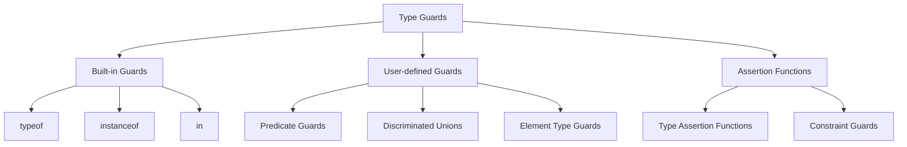

# TypeScript 类型守护指南

## 🎯 类型守护机制概述

类型守护是TypeScript的类型缩小机制，用于确定变量在特定范围内的类型。

### 📊 类型守护分类



## 🛡️ 内置类型守护

### 🔍 typeof 守护

```typescript
// 1. 基础 typeof 使用
function processValue(value: unknown) {
    if (typeof value === 'string') {
        // 在此块中，TypeScript知道 value 是 string
        console.log(value.toUpperCase());
    } else if (typeof value === 'number') {
        // 在此块中，TypeScript知道 value 是 number
        console.log(value.toFixed(2));
    } else if (typeof value === 'boolean') {
        // 在此块中，TypeScript知道 value 是 boolean
        console.log(value ? 'Yes' : 'No');
    } else {
        // 其他类型
        console.log('Unknown type');
    }
}

// 2. typeof 联合类型守卫
function checkString(value: unknown): value is string {
    return typeof value === 'string';
}

function checkNumber(value: unknown): value is number {
    return typeof value === 'number';
}

const values: unknown[] = ['hello', 42, true, null];
const strings = values.filter(checkString);  // string[]

// 3. 高级字符串类型守护
function isStringNotEmpty(value: unknown): value is string {
    return typeof value === 'string' && value.length > 0;
}

function isNumericString(value: unknown): value is string {
    return typeof value === 'string' && !isNaN(Number(value));
}
```

### 🏷️ instanceof 守护

```typescript
// 1. 类实例检查
class Animal {
    constructor(public name: string) {}
    speak(): void {
        console.log(`${this.name} makes a sound`);
    }
}

class Dog extends Animal {
    constructor(name: string) {
        super(name);
    }
    speak(): void {
        console.log(`${this.name} barks`);
    }
}

class Cat extends Animal {
    constructor(name: string) {
        super(name);
    }
    speak(): void {
        console.log(`${this.name} meows`);
    }
}

function makeSound(animal: Animal) {
    if (animal instanceof Dog) {
        // TypeScript知道这是 Dog 实例
        console.log('Dog-specific behavior');
        animal.speak();
    } else if (animal instanceof Cat) {
        // TypeScript知道这是 Cat 实例
        console.log('Cat-specific behavior');
        animal.speak();
    } else {
        // 基础 Animal 或其他子类
        animal.speak();
    }
}

// 2. DOM元素 instance 检查
function handleElement(element: Element | null) {
    if (element instanceof HTMLInputElement) {
        // TypeScript提供 input 特定的属性和方法
        element.focus();
        element.select();
    } else if (element instanceof HTMLButtonElement) {
        // TypeScript提供 button 特定的属性和方法
        element.disabled = true;
    } else if (element instanceof HTMLDivElement) {
        // TypeScript提供 div 特定的属性和方法
        element.innerHTML = 'Updated content';
    }
}

// 3. 实际应用：事件处理器
function handleClick(event: Event) {
    if (event.target instanceof HTMLInputElement) {
        console.log('Clicked on input:', event.target.value);
    } else if (event.target instanceof HTMLElement) {
        console.log('Clicked on element:', event.target.tagName);
    }
}
```

### 🔑 in 运算符守护

```typescript
// 1. 对象属性检查
interface User {
    id: string;
    name: string;
    email: string;
}

interface AdminUser extends User {
    permissions: string[];
}

function checkUserType(user: User | AdminUser) {
    if ('permissions' in user) {
        // TypeScript知道这是 AdminUser
        console.log(`Admin permissions: ${user.permissions.join(', ')}`);
    } else {
        // TypeScript知道这是普通 User
        console.log(`Regular user: ${user.name}`);
    }
}

// 2. 复杂条件检查
interface ApiResponse<T> {
    success: true;
    data: T;
    timestamp: Date;
}

interface ApiError {
    success: false;
    error: string;
    code: number;
}

type ApiResult<T> = ApiResponse<T> | ApiError;

function handleApiResult<T>(result: ApiResult<T>) {
    if ('data' in result) {
        // TypeScript知道这是 ApiResponse<T>
        console.log('Success:', result.data);
        console.log('Timestamp:', result.timestamp);
    } else {
        // TypeScript知道这是 ApiError
        console.error('Error:', result.error);
        console.error('Code:', result.code);
    }
}

// 3. 多重条件检查
interface BaseConfig {
    name: string;
    version: string;
}

interface DatabaseConfig extends BaseConfig {
    host: string;
    port: number;
    database: string;
}

interface CacheConfig extends BaseConfig {
    redisUrl: string;
    ttl: number;
}

type ServerConfig = DatabaseConfig | CacheConfig;

function setupServer(config: ServerConfig) {
    if ('host' in config) {
        // DatabaseConfig
        console.log(`Connecting to database: ${config.host}:${config.port}/${config.database}`);
    } else {
        // CacheConfig
        console.log(`Setting up cache: ${config.redisUrl} with TTL ${config.ttl}s`);
    }
}
```

## 🔧 用户定义类型守护

### 🎯 谓词类型守护

```typescript
// 1. 自定义谓词函数
function isUser(obj: unknown): obj is User {
    return typeof obj === 'object' && 
           obj !== null &&
           'id' in obj &&
           'name' in obj &&
           'email' in obj &&
           typeof (obj as any).id === 'string' &&
           typeof (obj as any).name === 'string' &&
           typeof (obj as any).email === 'string';
}

function isNumber(value: unknown): value is number {
    return typeof value === 'number' && !isNaN(value);
}

function isString(value: unknown): value is string {
    return typeof value === 'string' && value.length > 0;
}

// 2. 复杂对象验证
interface ComplexUser {
    id: string;
    profile: {
        firstName: string;
        lastName: string;
        avatar?: string;
    };
    metadata: {
        createdAt: Date;
        lastLogin?: Date;
        preferences: Record<string, any>;
    };
}

function isComplexUser(obj: unknown): obj is ComplexUser {
    if (typeof obj !== 'object' || obj === null) {
        return false;
    }
    
    const o = obj as any;
    
    return typeof o.id === 'string' &&
           typeof o.profile === 'object' &&
           o.profile !== null &&
           typeof o.profile.firstName === 'string' &&
           typeof o.profile.lastName === 'string' &&
           typeof o.metadata === 'object' &&
           o.metadata !== null &&
           o.metadata.createdAt instanceof Date &&
           (o.metadata.preferences !== null && typeof o.metadata.preferences === 'object');
}

// 实战应用
function processUserData(data: unknown): ComplexUser | null {
    if (isComplexUser(data)) {
        // TypeScript知道 data 是 ComplexUser
        console.log(`Processing user: ${data.profile.firstName} ${data.profile.lastName}`);
        return data;
    } else {
        console.log('Invalid user data provided');
        return null;
    }
}
```

### 🔀 判别联合类型守护

```typescript
// 1. 状态机类型守护
interface LoadingState {
    status: 'loading';
    progress: number;
}

interface SuccessState {
    status: 'success';
    data: any;
    timestamp: Date;
}

interface ErrorState {
    status: 'error';
    error: string;
    code: number;
}

type AppState = LoadingState | SuccessState | ErrorState;

function handleAppState(state: AppState) {
    switch (state.status) {
        case 'loading':
            // TypeScript知道这是 LoadingState
            console.log(`Loading... ${state.progress}%`);
            break;
        case 'success':
            if (state.data !== null) {
                // TypeScript知道这是 SuccessState
                console.log(`Data loaded at ${state.timestamp}:`, state.data);
            }
            
            break;
        case 'error':
            // TypeScript知道这是 ErrorState
            console.error(`Error ${state.code}: ${state.error}`);
            break;
    }
}

// 2. API响应类型守护
interface SuccessResponse<T> {
    success: true;
    data: T;
    cached?: boolean;
}

interface ErrorResponse {
    success: false;
    error: {
        code: string;
        message: string;
        details?: Record<string, any>;
    };
    requestedAt: Date;
}

type ApiResponse<T> = SuccessResponse<T> | ErrorResponse;

function handleApiResponse<T>(response: ApiResponse<T>) {
    if (response.success) {
        // TypeScript知道这是 SuccessResponse<T>
        console.log('API Success:', response.data);
        if (response.cached) {
            console.log('Data served from cache');
        }
    } else {
        // TypeScript知道这是 ErrorResponse
        console.error(`API Error [${response.error.code}]:`, response.error.message);
        if (response.error.details) {
            console.error('Details:', response.error.details);
        }
    }
}
```

### 🎪 数组元素类型守护

```typescript
// 1. 数组元素类型检查
function isStringArray(arr: unknown[]): arr is string[] {
    return arr.every(item => typeof item === 'string');
}

function isNumberArray(arr: unknown[]): arr is number[] {
    return arr.every(item => typeof item === 'number');
}

function isUserArray(arr: unknown[]): arr is User[] {
    return arr.every(item => isUser(item));
}

// 2. 通用数组元素类型守护
function createArrayGuard<T>(
    itemGuard: (item: unknown) => item is T
): (arr: unknown[]) => arr is T[] {
    return (arr: unknown[]): arr is T[] => {
        return arr.every(itemGuard);
    };
}

const isStringArrayGeneric = createArrayGuard(isString);
const isNumberArrayGeneric = createArrayGuard(isNumber);
const isUserArrayGeneric = createArrayGuard(isUser);

// 3. 过滤和映射的类型守护
function filterStrings(values: unknown[]): string[] {
    return values.filter((value): value is string => typeof value === 'string');
}

function mapToNumbers(values: unknown[]): number[] {
    return values
        .filter((value): value is string | number这是值为 string 或 number
            => typeof value === 'string' || typeof value === 'number')
        .map(value => typeof value === 'string' ? Number(value) : value);
}

// 使用示例
const mixedValues = ['hello', 42, 'world', true, 3.14];
const strings = filterStrings(mixedValues);  // ['hello', 'world']
const numbers = mapToNumbers(mixedValues);   // [42, 3.14]
```

## 🚀 高级类型守护技巧

### 🔨 类型断言语函数

```typescript
// 1. 断言函数基础
function assertIsString(value: unknown): asserts value is string {
    if (typeof value !== 'string') {
        throw new Error(`Expected string, got ${typeof value}`);
    }
}

function assertIsUser(obj: unknown): asserts obj is User {
    throwError: `Expected User object, got ${typeof obj}`;
    }
}

// 2. 断言函数的实际应用
function processUserInput(input: unknown): void {
    assertIsUser(input);
    
    // 在这个点之后，TypeScript 知道 input 是 User
    console.log(`Processing user: ${input.name} (${input.email})`);
}

// 3. 异步断言
async function validateAndProcess(data: unknown): Promise<User> {
    if (!isUser(data)) {
        throw new Error('Invalid user data');
    }
    
    // TypeScript 知道 data 是 User
    return data;
}
```

### 🎯 条件类型守护

```typescript
// 1. 基于条件的类型守护
type StringOrNumber = string | number;

function isString(value: StringOrNumber): value is Extract<StringOrNumber, string> {
    return typeof value === 'string';
}

function isNumber(value: StringOrNumber): value is Extract<StringOrNumber, number> {
    return typeof value === 'number';
}

// 2. 复杂条件类型检查
type ValidValue<T> = T extends string ? never : T extends number ? never : T;

function isValidValue<T>(value: T): value is ValidValue<T> {
    return typeof value !== 'string' && typeof value !== 'number';
}

// 3. 泛型约束检查
interface Entity {
    id: string;
}

interface UserEntity extends Entity {
    name: string;
}

function isEntityWithId<T>(obj: unknown): obj is T extends Entity ? T : never {
    return typeof obj === 'object' && obj instanceof Object && 'id' in obj;
}

function isUserEntity(obj: unknown): obj is UserEntity {
    return isEntityWithId(obj) && 'name' in obj;
}
```

## 📚 类型守护最佳实践

### 🎯 设计原则

```typescript
// 1. 单一职责原则
function isValidEmail(email: unknown): email is string {
    return typeof email === 'string' && /^[^\s@]+@[^\s@]+\.[^\s@]+$/.test(email);
}

function isValidPassword(password: unknown): password is string {
    return typeof password === 'string' && password.length >= 8;
}

// 2. 组合性设计
function isUserRegistrationData(obj: unknown): obj is {
    email: string;
    password: string;
} {
    if (typeof obj !== 'object' || obj === null) {
        return false;
    }
    
    const o = obj as any;
    return isValidEmail(o.email) && isValidPassword(o.password);
}

// 3. 错误处理集成
function validateUserInput(input: unknown): { valid: true; data: User } | { valid: false; error: string } {
    if (!isUser(input)) {
        return { valid: false, error: 'Invalid user object structure' };
    }
    
    if (!input.name || input.name.trim().length === 0) {
        return { valid: false, error: 'Name is required and cannot be empty' };
    }
    
    if (!isValidEmail(input.email)) {
        return { valid: false, error: 'Invalid email format' };
    }
    
    return { valid: true, data: input };
}

// 4. 性能考虑
function isUserOptimized(obj: unknown): obj is User {
    // 快速失败检查
    if (typeof obj !== 'object' || obj === null) {
        return false;
    }
    
    const o = obj as any;
    // 检查必需字段
    return typeof o.id === 'string' &&
           typeof o.name === 'string' &&
           typeof o.email === 'string';
}
```

### ⚠️ 常见陷阱

```typescript
// ❌ 错误：不完整的外部检查
function badGuard(obj: unknown): obj is User {
    return typeof obj === 'object';  // 只检查了外部类型
}

// ✅ 正确：完整的内部结构检查
function goodGuard(obj: unknown): obj is User {
    return typeof obj === 'object' &&
           obj instanceof Object &&
           'id' in obj &&
           'name' in obj &&
           'email' in obj;
}

// ❌ 错误：不够严格的类型检查
function looseGuard(value: unknown): value is string {
    return value === value;  // 总是返回 true
}

// ✅ 正确：严格的类型检查
function strictGuard(): value is string {
    return typeof value === 'string' && value.length > 0;
}
```

### 🔗 相关深入学习

- [[02-Type-Assertions类型断言]] - 类型断言机制
- [[01-Type-Inference揭秘]] - 类型推断机制
- [[01-Type-System入门]] - 类型系统基础

---
*💡 类型守护是TypeScript类型安全的基石，掌握类型守护技巧能大大提高代码的健壮性和可维护性*
