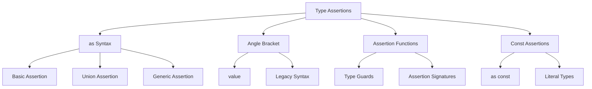

# TypeScript 类型断言完全指南

## 🎯 类型断言机制概览

### 📊 断言方式分类



## 🔧 as 语法类型断言

### 💡 基础断言应用

```typescript
// 1. 基本类型断言
function getUserData(): unknown {
    return { id: 1, name: 'Alice', email: 'alice@example.com' };
}

const userData = getUserData();
const user = userData as { id: number; name: string; email: string };

// 现在可以安全访问 user 的属性
console.log(user.name);  // 'Alice'
console.log(user.email); // 'alice@example.com'

// 2. DOM 元素断言
function getElement(): Element | null {
    return document.querySelector('#myButton');
}

const button = getElement() as HTMLButtonElement;
button.onclick = () => console.log('Button clicked');

// 3. 事件目标断言
function handleClick(event: Event) {
    const target = event.target as HTMLInputElement;
    
    // 现在可以访问 input 特有的属性
    if (target.type === 'text') {
        console.log('Input value:', target.value);
    }
}
```

### 🎪 联合类型断言

```typescript
// 1. Union 类型收缩
interface Circle {
    kind: 'circle';
    radius: number;
}

interface Rectangle {
    kind: 'rectangle';
    width: number;
    height: number;
}

type Shape = Circle | Rectangle;

function processShape(shape: Shape) {
    if ('radius' in shape) {
        // TypeScript 推断这是 Circle
        console.log('Circle area:', Math.PI * shape.radius * shape.radius);
    } else {
        // TypeScript 推断这是 Rectangle
        console.log('Rectangle area:', shape.width * shape.height);
    }
}

// 手动断言
function calculateArea(shape: Shape): number {
    if (shape.kind === 'circle') {
        const circle = shape as Circle;
        return Math.PI * circle.radius * circle.radius;
    } else {
        const rectangle = shape as Rectangle;
        return rectangle.width * rectangle.height;
    }
}

// 2. 复杂联合类型处理
type StringOrNumber = string | number;

function processValue(value: StringOrNumber): void {
    // 运行时检查确保类型安全
    if (typeof value === 'string') {
        const stringValue = value as string;
        console.log(stringValue.toUpperCase());
    } else {
        const numberValue = value as number;
        console.log(numberValue.toFixed(2));
    }
}
```

## 🎭 类型守卫断言

### 🛡️ 自定义断言函数

```typescript
// 1. 基础断言函数
function assertIsString(value: unknown): asserts value is string {
    if (typeof value !== 'string') {
        throw new Error('Expected string, got ' + typeof value);
    }
}

function assertIsNumber(value: unknown): asserts value is number {
    if (typeof value !== 'number') {
        throw new Error('Expected number, got ' + typeof value);
    }
}

function assertIsArray(value: unknown): asserts value is unknown[] {
    if (!Array.isArray(value)) {
        throw new Error('Expected array, got ' + typeof value);
    }
}

// 使用断言函数
function processUnknownData(data: unknown): void {
    try {
        assertIsString(data);
        // data 现在是 string 类型
        console.log(data.toUpperCase());
        
    } catch (error) {
        console.error('Type assertion failed:', error);
    }
}

// 2. 复杂对象断言
interface User {
    id: string;
    name: string;
    email: string;
}

function assertIsUser(value: unknown): asserts value is User {
    if (typeof value !== 'object' || value === null) {
        throw new Error('Expected object, got ' + typeof value);
    }
    
    const obj = value as Record<string, unknown>;
    
    if (typeof obj.id !== 'string') {
        throw new Error('Expected string id');
    }
    
    if (typeof obj.name !== 'string') {
        throw new Error('Expected string name');
    }
    
    if (typeof obj.email !== 'string') {
        throw new Error('Expected string email');
    }
}

function validateUser(userData: unknown): User {
    assertIsUser(userData);
    // userData 现在是 User 类型
    return userData;
}
```

### 🔍 高级断言模式

```typescript
// 1. 泛型断言函数
function assertHasProperty<T extends Record<string, unknown>>(
    value: unknown,
    property: keyof T
): asserts value is T {
    if (typeof value !== 'object' || value === null) {
        throw new Error('Expected object');
    }
    
    const obj = value as Record<string, unknown>;
    
    if (!(property in obj)) {
        throw new Error(`Expected property ${String(property)}`);
    }
}

// 使用
function processApiResponse(response: unknown): void {
    assertHasProperty<User>(response, 'id');
    
    // response 现在被断言为 User 类型
    console.log('User ID:', response.id);
}

// 2. 条件断言函数
function assertCondition<T>(
    value: T,
    condition: (value: T) => boolean,
    message: string
): asserts value is T {
    if (!condition(value)) {
        throw new Error(`Assertion failed: ${message}`);
    }
}

function assertPositiveNumber(value: unknown): asserts value is number {
    assertCondition(
        value,
        (v): v is number => typeof v === 'number' && v > 0,
        'Expected positive number'
    );
}

// 3. 异步断言函数
async function assertApiResponse(response: Response): Promise<unknown> {
    if (!response.ok) {
        throw new Error(`HTTP ${response.status}: ${response.statusText}`);
    }
    
    return response.json();
}

async function fetchUserData(id: string): Promise<User> {
    const response = await fetch(`/api/users/${id}`);
    const data = await assertApiResponse(response);
    assertIsUser(data);
    
    return data;  // TypeScript 知道这是 User 类型
}
```

## 🚀 const 断言深度应用

### 🎯 字面量类型锁定

```typescript
// 1. as const 基础使用
const colors = ['red', 'green', 'blue'] as const;
type ColorType = typeof colors[number]; // 'red' | 'green' | 'blue'

const userConfig = {
    theme: 'dark',
    language: 'en',
    features: ['notifications', 'analytics']
} as const;

// 所有属性都被锁定为字面量类型
type UserConfig = typeof userConfig;
// {
//   readonly theme: 'dark';
//   readonly language: 'en';
//   readonly features: readonly ['notifications', 'analytics'];
// }

// 2. 深度 const 断言
const deepConfig = {
    api: {
        baseUrl: 'https://api.example.com',
        timeout: 5000,
        retries: 3
    },
    ui: {
        theme: 'light' as const,
        sidebar: {
            collapsed: false as const,
            width: 260 as const
        }
    }
} as const;

// 所有嵌套属性都被锁定
type DeepConfig = typeof deepConfig;

// 3. React 组件中的 const 断言
const ButtonVariants = {
    primary: 'bg-blue-500',
    secondary: 'bg-gray-500',
    danger: 'bg-red-500'
} as const;

type ButtonVariant = keyof typeof ButtonVariants; // 'primary' | 'secondary' | 'danger'

// 组件 Props 中使用
interface ButtonProps {
    variant: ButtonVariant;
    children: React.ReactNode;
}

const Button: React.FC<ButtonProps> = ({ variant, children }) => {
    const className = ButtonVariants[variant];
    return <button className={className}>{children}</button>;
};
```

### 🔧 高级 const 技巧

```typescript
// 1. 联合类型字面量
const statusList = ['pending', 'success', 'error'] as const;
type Status = typeof statusList[number]; // 'pending' | 'success' | 'error'

function handleStatus(status: Status): void {
    switch (status) {
        case 'pending':
            console.log('Loading...');
            break;
        case 'success':
            console.log('Completed');
            break;
        case 'error':
            console.log('Failed');
            break;
    }
}

// 2. 元组类型断言
const coordinates = [10, 20] as const;
type CoordinateTuple = typeof coordinates; // readonly [10, 20]

// 3. 枚举替代方案
const UserRoles = {
    USER: 'user',
    ADMIN: 'admin',
    MODERATOR: 'moderator'
} as const;

type UserRole = typeof UserRoles[keyof typeof UserRoles]; // 'user' | 'admin' | 'moderator'

function checkPermission(role: UserRole): boolean {
    switch (role) {
        case UserRoles.USER:
            return false;
        case UserRoles.ADMIN:
            return true;
        case UserRoles.MODERATOR:
            return true;
    }
}
```

## 🎪 类型断言最佳实践

### ⚠️ 常见陷阱与解决方案

```typescript
// ❌ 错误：不安全的断言
function badAssertion(value: unknown): string {
    return value as string;  // 不安全，可能导致运行时错误
}

// ✅ 正确：安全检查后进行断言
function safeAssertion(value: unknown): string {
    if (typeof value !== 'string') {
        throw new Error('Expected string');
    }
    return value;  // 这里不需要 as，TypeScript 已经知道类型
}

// ❌ 错误：过度使用 as any
function badOveruse(data: unknown): string {
    const obj = data as any;  // 失去了类型安全
    return obj.someDeepProperty.nestedValue;
}

// ✅ 正确：渐进式断言
function gradualAssertion(data: unknown): string {
    assertIsObject(data);
    assertHasProperty<{ someDeepProperty: unknown }>(data, 'someDeepProperty');
    
    const nested = data.someDeepProperty;
    assertIsObject(nested);
    assertHasProperty<{ nestedValue: unknown }>(nested, 'nestedValue');
    
    assertIsString(nested.nestedValue);
    return nested.nestedValue;
}

function assertIsObject(value: unknown): asserts value is Record<string, unknown> {
    if (typeof value !== 'object' || value === null) {
        throw new Error('Expected object');
    }
}
```

### 🎯 性能考虑

```typescript
// 1. 断言函数复用
class TypeAssertor {
    private static readonly cache = new Map<string, boolean>();
    
    static isString(value: unknown): value is string {
        const key = 'string_' + typeof value;
        
        if (this.cache.has(key)) {
            return this.cache.get(key)!;
        }
        
        const result = typeof value === 'string';
        this.cache.set(key, result);
        return result;
    }
    
    static isArray(value: unknown): value is unknown[] {
        const key = 'array_' + typeof value;
        
        if (this.cache.has(key)) {
            return this.cache.get(key)!;
        }
        
        const result = Array.isArray(value);
        this.cache.set(key, result);
        return result;
    }
    
    static clearCache(): void {
        this.cache.clear();
    }
}

// 2. 批量断言
function batchAssert<T>(
    values: unknown[],
    checker: (value: unknown) => value is T
): T[] {
    const results: T[] = [];
    
    for (const value of values) {
        if (checker(value)) {
            results.push(value);
        }
    }
    
    return results;
}

const mixedArray = [1, 'hello', 42, 'world', true];
const stringArray = batchAssert(mixedArray, TypeAssertor.isString); // ['hello', 'world']
```

### 🔗 相关深入学习

- [[01-Type-Guards类型守护]] - 类型守护机制
- [[01-Type-Inference揭秘]] - 类型推断机制
- [[01-Type-System入门]] - 类型系统基础

---
*💡 类型断言是TypeScript灵活性与类型安全的平衡工具，正确使用能大大提升开发效率，但需要谨慎避免运行时错误*
