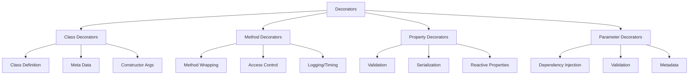

# TypeScript 装饰器系统完全指南

## 🎯 装饰器类型系统概览

### 📊 装饰器分类架构



## 🔧 基础装饰器语法

### 💡 装饰器基本原理

```typescript
// 1. 类装饰器基础语法
function ClassDecorator<T extends { new(...args: any[]): {} }>(
    constructor: T
): T {
    return class extends constructor {
        // 装饰器逻辑
        constructor(...args: any[]) {
            super(...args);
            console.log('Class instantiated');
        }
    };
}

// 2. 方法装饰器
function MethodDecorator(
    target: any,
    propertyKey: string,
    descriptor: PropertyDescriptor
): PropertyDescriptor {
    console.log('Target:', target);
    console.log('Property:', propertyKey);
    console.log('Descriptor:', descriptor);
    
    return descriptor;
}

// 3. 属性装饰器
function PropertyDecorator(target: any, propertyKey: string): void {
    console.log('Property decorated:', propertyKey);
}

// 4. 参数装饰器
function ParameterDecorator(
    target: any,
    propertyKey: string | symbol | undefined,
    parameterIndex: number
): void {
    console.log('Parameter index:', parameterIndex);
}

// 使用示例
@ClassDecorator
class ExampleClass {
    @PropertyDecorator
    name: string = '';
    
    constructor(name: string) {
        this.name = name;
    }
    
    @MethodDecorator
    getName(): string {
        return this.name;
    }
    
    setName(@ParameterDecorator name: string): void {
        this.name = name;
    }
}
```

### 🎪 装饰器工厂模式

```typescript
// 1. 装饰器工厂基础
function LogClass(message: string) {
    return function<T extends { new(...args: any[]): {} }>(
        constructor: T
    ): T {
        return class extends constructor {
            constructor(...args: any[]) {
                super(...args);
                console.log(`${message}: ${constructor.name} instantiated`);
            }
        };
    };
}

function LogMethod(message: string) {
    return function(
        target: any,
        propertyKey: string,
        descriptor: PropertyDescriptor
    ): PropertyDescriptor {
        const originalMethod = descriptor.value;
        
        descriptor.value = function(...args: any[]) {
            console.log(`${message}: Calling ${propertyKey}`);
            const result = originalMethod.apply(this, args);
            console.log(`${message}: ${propertyKey} completed`);
            return result;
        };
        
        return descriptor;
    };
}

function LogProperty(defaultValue: string) {
    return function(target: any, propertyKey: string): void {
        let value = defaultValue;
        
        // 创建 getter 和 setter
        Object.defineProperty(target, propertyKey, {
            get: function() {
                console.log(`Getting ${propertyKey}: ${value}`);
                return value;
            },
            set: function(newValue: string) {
                console.log(`Setting ${propertyKey} to: ${newValue}`);
                value = newValue;
            },
            enumerable: true,
            configurable: true
        });
    };
}

// 使用装饰器工厂
@LogClass('User Management')
class UserService {
    @LogProperty('anonymous')
    private username: string;
    
    constructor(username: string) {
        this.username = username;
    }
    
    @LogMethod('Authentication')
    authenticate(password: string): boolean {
        // 模拟认证逻辑
        return password === 'secret';
    }
}
```

## 🚀 高级装饰器应用

### 🔄 元数据装饰器

```typescript
// 1. Reflect-metadata 支持
import 'reflect-metadata';

const requiredMetadataKey = Symbol('required');
const serializableMetadataKey = Symbol('serializable');

// 必需字段装饰器
function Required(target: any, propertyKey: string | symbol): void {
    Reflect.defineMetadata(requiredMetadataKey, true, target, propertyKey);
}

// 序列化装饰器
function Serializable(target: any, propertyKey: string | symbol): void {
    Reflect.defineMetadata(serializableMetadataKey, true, target, propertyKey);
}

// 类型验证装饰器
function Validate(validator: (value: any) => boolean) {
    return function(target: any, propertyKey: string | symbol): void {
        Reflect.defineMetadata('validator', validator, target, propertyKey);
        
        const currentValue = target[propertyKey];
        
        Object.defineProperty(target, propertyKey, {
            get: function() {
                return currentValue;
            },
            set: function(newValue: any) {
                if (!validator(newValue)) {
                    throw new TypeError(`Invalid value for ${String(propertyKey)}: ${newValue}`);
                }
                Reflect.set(target, propertyKey, newValue);
            },
            enumerable: true,
            configurable: true
        });
    };
}

// 实际应用
class ApiResponse {
    @Required
    @Serializable
    @Validate((value: number) => typeof value === 'number' && value >= 200 && value < 600)
    status: number;
    
    @Serializable
    data: any;
    
    @Required
    @Validate((value: string) => typeof value === 'string' && value.length > 0)
    message: string;
    
    constructor(status: number, data: any, message: string) {
        this.status = status;
        this.data = data;
        this.message = message;
    }
    
    // 验证元数据
    static validateRequired(obj: any): boolean {
        const metadata = Reflect.getMetadata(requiredMetadataKey, obj);
        return metadata !== undefined;
    }
    
    // 获取序列化字段
    getSerializableFields(): string[] {
        const prototype = Object.getPrototypeOf(this);
        const propertyKeys = Object.getOwnPropertyNames(this);
        
        return propertyKeys.filter(key => 
            Reflect.getMetadata(serializableMetadataKey, prototype, key)
        );
    }
}
```

### 🎯 方法装饰器高级用法

```typescript
// 1. 缓存装饰器
function Cache(ttl: number = 300000) { // 5分钟默认缓存
    return function(target: any, propertyKey: string, descriptor: PropertyDescriptor) {
        const originalMethod = descriptor.value;
        const cache = new Map<string, { value: any; timestamp: number }>();
        
        descriptor.value = function(...args: any[]) {
            const key = JSON.stringify(args);
            const cached = cache.get(key);
            
            if (cached && Date.now() - cached.timestamp < ttl) {
                console.log(`Cache hit for ${propertyKey}`);
                return cached.value;
            }
            
            console.log(`Cache miss for ${propertyKey}`);
            const result = originalMethod.apply(this, args);
            
            cache.set(key, {
                value: result,
                timestamp: Date.now()
            });
            
            return result;
        };
        
        return descriptor;
    };
}

// 2. 重试装饰器
function Retry(maxAttempts: number = 3, delay: number = 1000) {
    return function(target: any, propertyKey: string, descriptor: PropertyDescriptor) {
        const originalMethod = descriptor.value;
        
        descriptor.value = async function(...args: any[]) {
            let lastError: Error;
            
            for (let attempt = 1; attempt <= maxAttempts; attempt++) {
                try {
                    console.log(`${propertyKey} attempt ${attempt}/${maxAttempts}`);
                    return await originalMethod.apply(this, args);
                } catch (error) {
                    lastError = error as Error;
                    console.log(`${propertyKey} failed on attempt ${attempt}:`, error);
                    
                    if (attempt < maxAttempts) {
                        await new Promise(resolve => setTimeout(resolve, delay));
                    }
                }
            }
            
            throw lastError!;
        };
        
        return descriptor;
    };
}

// 3. 限流装饰器
function Throttle(timeWindow: number = 1000, maxRequests: number = 1) {
    return function(target: any, propertyKey: string, descriptor: PropertyDescriptor) {
        const originalMethod = descriptor.value;
        const requestTimes: number[] = [];
        
        descriptor.value = function(...args: any[]) {
            const now = Date.now();
            
